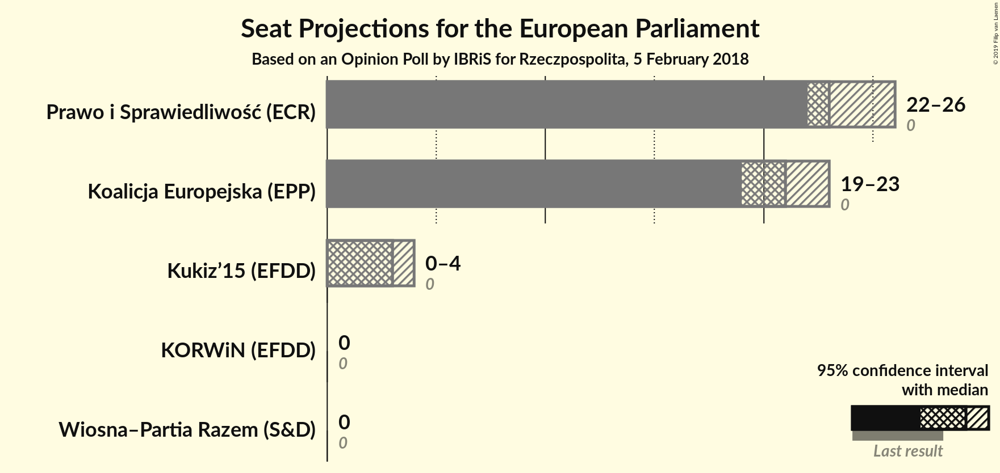

# Opinion Poll by IBRiS for Rzeczpospolita, 5 February 2018

<a href="#voting-intentions">Voting Intentions</a> | <a href="#seats">Seats</a> | <a href="#coalitions">Coalitions</a> | <a href="#technical-information">Technical Information</a>

## Voting Intentions

### Confidence Intervals

| Party | Last Result | Poll Result | 80% Confidence Interval | 90% Confidence Interval | 95% Confidence Interval | 99% Confidence Interval |
|:-----:|:-----------:|:-----------:|:-----------------------:|:-----------------------:|:-----------------------:|:-----------------------:|
| Prawo i Sprawiedliwość (ECR) | 0.0% | 42.9% | 40.9–44.9% |40.3–45.5% |39.9–46.0% |38.9–47.0% |
| Koalicja Europejska (EPP) | 0.0% | 38.6% | 36.7–40.6% |36.1–41.2% |35.6–41.7% |34.7–42.6% |
| Kukiz’15 (EFDD) | 0.0% | 5.7% | 4.9–6.8% |4.6–7.1% |4.4–7.3% |4.1–7.9% |
| Wiosna–Partia Razem (S&D) | 0.0% | 2.9% | 2.3–3.7% |2.2–3.9% |2.0–4.1% |1.8–4.6% |
| KORWiN (EFDD) | 0.0% | 0.4% | 0.2–0.8% |0.2–0.9% |0.2–1.0% |0.1–1.3% |

*Note:* The poll result column reflects the actual value used in the calculations. Published results may vary slightly, and in addition be rounded to fewer digits.

## Seats

### Confidence Intervals

| Party | Last Result | Median | 80% Confidence Interval | 90% Confidence Interval | 95% Confidence Interval | 99% Confidence Interval |
|:-----:|:-----------:|:------:|:-----------------------:|:-----------------------:|:-----------------------:|:-----------------------:|
| <a href="#prawo-i-sprawiedliwość-(ecr)">Prawo i Sprawiedliwość (ECR)</a> | 0 | 23 | 22–25 |22–25 |22–26 |21–26 |
| <a href="#koalicja-europejska-(epp)">Koalicja Europejska (EPP)</a> | 0 | 21 | 20–22 |20–23 |19–23 |19–24 |
| <a href="#kukiz’15-(efdd)">Kukiz’15 (EFDD)</a> | 0 | 3 | 0–3 |0–3 |0–4 |0–4 |
| <a href="#wiosna–partia-razem-(s&d)">Wiosna–Partia Razem (S&D)</a> | 0 | 0 | 0 |0 |0 |0 |
| <a href="#korwin-(efdd)">KORWiN (EFDD)</a> | 0 | 0 | 0 |0 |0 |0 |

### Prawo i Sprawiedliwość (ECR)

*For a full overview of the results for this party, see the [Prawo i Sprawiedliwość (ECR)](party-prawoisprawiedliwośćecr.html) page.*

| Number of Seats | Probability | Accumulated | Special Marks |
|:---------------:|:-----------:|:-----------:|:-------------:|
| 0 | 0% | 100% | Last Result |
| 1 | 0% | 100% |  |
| 2 | 0% | 100% |  |
| 3 | 0% | 100% |  |
| 4 | 0% | 100% |  |
| 5 | 0% | 100% |  |
| 6 | 0% | 100% |  |
| 7 | 0% | 100% |  |
| 8 | 0% | 100% |  |
| 9 | 0% | 100% |  |
| 10 | 0% | 100% |  |
| 11 | 0% | 100% |  |
| 12 | 0% | 100% |  |
| 13 | 0% | 100% |  |
| 14 | 0% | 100% |  |
| 15 | 0% | 100% |  |
| 16 | 0% | 100% |  |
| 17 | 0% | 100% |  |
| 18 | 0% | 100% |  |
| 19 | 0% | 100% |  |
| 20 | 0% | 100% |  |
| 21 | 1.1% | 100% |  |
| 22 | 13% | 98.8% |  |
| 23 | 36% | 86% | Median |
| 24 | 33% | 50% |  |
| 25 | 13% | 17% |  |
| 26 | 3% | 4% |  |
| 27 | 0.3% | 0.3% | Majority |
| 28 | 0% | 0% |  |

### Koalicja Europejska (EPP)

*For a full overview of the results for this party, see the [Koalicja Europejska (EPP)](party-koalicjaeuropejskaepp.html) page.*

| Number of Seats | Probability | Accumulated | Special Marks |
|:---------------:|:-----------:|:-----------:|:-------------:|
| 0 | 0% | 100% | Last Result |
| 1 | 0% | 100% |  |
| 2 | 0% | 100% |  |
| 3 | 0% | 100% |  |
| 4 | 0% | 100% |  |
| 5 | 0% | 100% |  |
| 6 | 0% | 100% |  |
| 7 | 0% | 100% |  |
| 8 | 0% | 100% |  |
| 9 | 0% | 100% |  |
| 10 | 0% | 100% |  |
| 11 | 0% | 100% |  |
| 12 | 0% | 100% |  |
| 13 | 0% | 100% |  |
| 14 | 0% | 100% |  |
| 15 | 0% | 100% |  |
| 16 | 0% | 100% |  |
| 17 | 0% | 100% |  |
| 18 | 0.1% | 100% |  |
| 19 | 4% | 99.9% |  |
| 20 | 21% | 96% |  |
| 21 | 39% | 75% | Median |
| 22 | 27% | 36% |  |
| 23 | 7% | 8% |  |
| 24 | 1.0% | 1.1% |  |
| 25 | 0.1% | 0.1% |  |
| 26 | 0% | 0% |  |

### Kukiz’15 (EFDD)

*For a full overview of the results for this party, see the [Kukiz’15 (EFDD)](party-kukiz’15efdd.html) page.*

| Number of Seats | Probability | Accumulated | Special Marks |
|:---------------:|:-----------:|:-----------:|:-------------:|
| 0 | 15% | 100% | Last Result |
| 1 | 0% | 85% |  |
| 2 | 16% | 85% |  |
| 3 | 65% | 68% | Median |
| 4 | 4% | 4% |  |
| 5 | 0% | 0% |  |

### Wiosna–Partia Razem (S&D)

*For a full overview of the results for this party, see the [Wiosna–Partia Razem (S&D)](party-wiosna–partiarazemsd.html) page.*

| Number of Seats | Probability | Accumulated | Special Marks |
|:---------------:|:-----------:|:-----------:|:-------------:|
| 0 | 99.9% | 100% | Last Result, Median |
| 1 | 0% | 0.1% |  |
| 2 | 0.1% | 0.1% |  |
| 3 | 0% | 0% |  |

### KORWiN (EFDD)

*For a full overview of the results for this party, see the [KORWiN (EFDD)](party-korwinefdd.html) page.*

| Number of Seats | Probability | Accumulated | Special Marks |
|:---------------:|:-----------:|:-----------:|:-------------:|
| 0 | 100% | 100% | Last Result, Median |

## Coalitions

### Confidence Intervals

| Coalition | Last Result | Median | Majority? | 80% Confidence Interval | 90% Confidence Interval | 95% Confidence Interval | 99% Confidence Interval |
|:---------:|:-----------:|:------:|:---------:|:-----------------------:|:-----------------------:|:-----------------------:|:-----------------------:|
| Prawo i Sprawiedliwość (ECR) | 0 | 23 | 0.3% | 22–25 | 22–25 | 22–26 | 21–26 |
| Koalicja Europejska (EPP) | 0 | 21 | 0% | 20–22 | 20–23 | 19–23 | 19–24 |
| Kukiz’15 (EFDD) – KORWiN (EFDD) | 0 | 3 | 0% | 0–3 | 0–3 | 0–4 | 0–4 |
| Wiosna–Partia Razem (S&D) | 0 | 0 | 0% | 0 | 0 | 0 | 0 |

### Prawo i Sprawiedliwość (ECR)

| Number of Seats | Probability | Accumulated | Special Marks |
|:---------------:|:-----------:|:-----------:|:-------------:|
| 0 | 0% | 100% | Last Result |
| 1 | 0% | 100% |  |
| 2 | 0% | 100% |  |
| 3 | 0% | 100% |  |
| 4 | 0% | 100% |  |
| 5 | 0% | 100% |  |
| 6 | 0% | 100% |  |
| 7 | 0% | 100% |  |
| 8 | 0% | 100% |  |
| 9 | 0% | 100% |  |
| 10 | 0% | 100% |  |
| 11 | 0% | 100% |  |
| 12 | 0% | 100% |  |
| 13 | 0% | 100% |  |
| 14 | 0% | 100% |  |
| 15 | 0% | 100% |  |
| 16 | 0% | 100% |  |
| 17 | 0% | 100% |  |
| 18 | 0% | 100% |  |
| 19 | 0% | 100% |  |
| 20 | 0% | 100% |  |
| 21 | 1.1% | 100% |  |
| 22 | 13% | 98.8% |  |
| 23 | 36% | 86% | Median |
| 24 | 33% | 50% |  |
| 25 | 13% | 17% |  |
| 26 | 3% | 4% |  |
| 27 | 0.3% | 0.3% | Majority |
| 28 | 0% | 0% |  |

### Koalicja Europejska (EPP)

| Number of Seats | Probability | Accumulated | Special Marks |
|:---------------:|:-----------:|:-----------:|:-------------:|
| 0 | 0% | 100% | Last Result |
| 1 | 0% | 100% |  |
| 2 | 0% | 100% |  |
| 3 | 0% | 100% |  |
| 4 | 0% | 100% |  |
| 5 | 0% | 100% |  |
| 6 | 0% | 100% |  |
| 7 | 0% | 100% |  |
| 8 | 0% | 100% |  |
| 9 | 0% | 100% |  |
| 10 | 0% | 100% |  |
| 11 | 0% | 100% |  |
| 12 | 0% | 100% |  |
| 13 | 0% | 100% |  |
| 14 | 0% | 100% |  |
| 15 | 0% | 100% |  |
| 16 | 0% | 100% |  |
| 17 | 0% | 100% |  |
| 18 | 0.1% | 100% |  |
| 19 | 4% | 99.9% |  |
| 20 | 21% | 96% |  |
| 21 | 39% | 75% | Median |
| 22 | 27% | 36% |  |
| 23 | 7% | 8% |  |
| 24 | 1.0% | 1.1% |  |
| 25 | 0.1% | 0.1% |  |
| 26 | 0% | 0% |  |

### Kukiz’15 (EFDD) – KORWiN (EFDD)

| Number of Seats | Probability | Accumulated | Special Marks |
|:---------------:|:-----------:|:-----------:|:-------------:|
| 0 | 15% | 100% | Last Result |
| 1 | 0% | 85% |  |
| 2 | 16% | 85% |  |
| 3 | 65% | 68% | Median |
| 4 | 4% | 4% |  |
| 5 | 0% | 0% |  |

### Wiosna–Partia Razem (S&D)

| Number of Seats | Probability | Accumulated | Special Marks |
|:---------------:|:-----------:|:-----------:|:-------------:|
| 0 | 99.9% | 100% | Last Result, Median |
| 1 | 0% | 0.1% |  |
| 2 | 0.1% | 0.1% |  |
| 3 | 0% | 0% |  |

## Technical Information

### Opinion Poll

+ **Polling firm:** IBRiS
+ **Commissioner(s):** Rzeczpospolita
+ **Fieldwork period:** 5 February 2018

### Calculations

+ **Sample size:** 1000
+ **Simulations done:** 131,072
+ **Error estimate:** 0.67%

