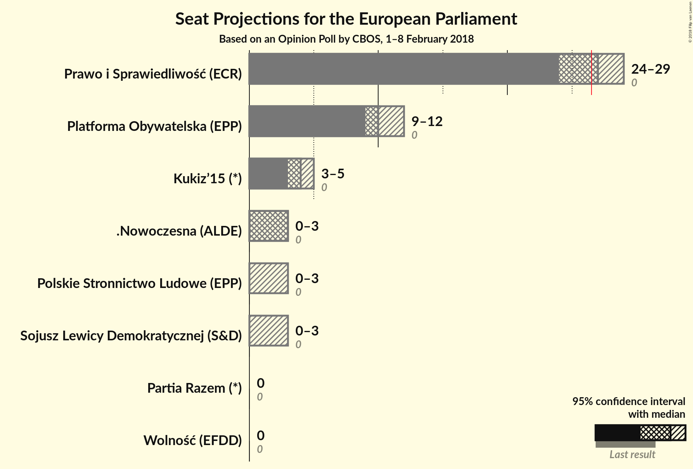
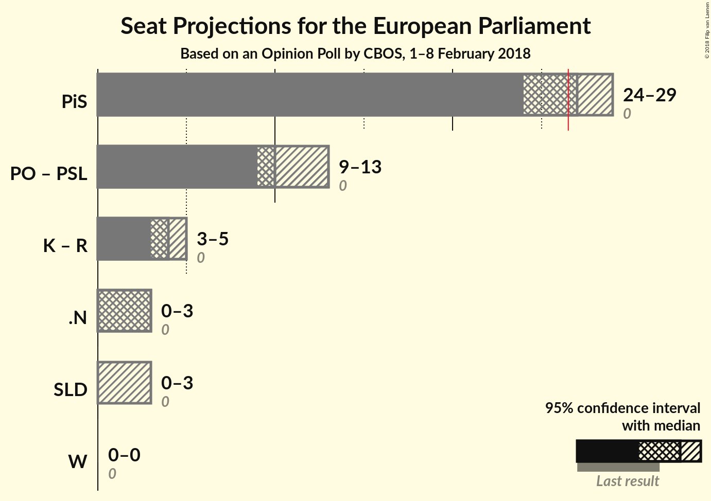

# Opinion Poll by CBOS, 1–8 February 2018

<a href="#voting-intentions">Voting Intentions</a> | <a href="#seats">Seats</a> | <a href="#coalitions">Coalitions</a> | <a href="#technical-information">Technical Information</a>

## Voting Intentions

### Confidence Intervals

| Party | Last Result | Poll Result | 80% Confidence Interval | 90% Confidence Interval | 95% Confidence Interval | 99% Confidence Interval |
|:-----:|:-----------:|:-----------:|:-----------------------:|:-----------------------:|:-----------------------:|:-----------------------:|
| Prawo i Sprawiedliwość (ECR) | 0.0% | 43.9% | N/A |N/A |N/A |N/A |
| Platforma Obywatelska (EPP) | 0.0% | 17.3% | N/A |N/A |N/A |N/A |
| Kukiz’15 (ENF) | 0.0% | 7.2% | N/A |N/A |N/A |N/A |
| .Nowoczesna (ALDE) | 0.0% | 5.1% | N/A |N/A |N/A |N/A |
| Polskie Stronnictwo Ludowe (EPP) | 0.0% | 4.1% | N/A |N/A |N/A |N/A |
| Sojusz Lewicy Demokratycznej (S&D) | 0.0% | 4.1% | N/A |N/A |N/A |N/A |
| Wolność (EFDD) | 0.0% | 2.1% | N/A |N/A |N/A |N/A |
| Partia Razem (—) | 0.0% | 1.0% | N/A |N/A |N/A |N/A |

*Note:* The poll result column reflects the actual value used in the calculations. Published results may vary slightly, and in addition be rounded to fewer digits.

## Seats

### Confidence Intervals

| Party | Last Result | Median | 80% Confidence Interval | 90% Confidence Interval | 95% Confidence Interval | 99% Confidence Interval |
|:-----:|:-----------:|:------:|:-----------------------:|:-----------------------:|:-----------------------:|:-----------------------:|
| <a href="#prawo-i-sprawiedliwość-(ecr)">Prawo i Sprawiedliwość (ECR)</a> | 0 | N/A | N/A |N/A |N/A |N/A |
| <a href="#platforma-obywatelska-(epp)">Platforma Obywatelska (EPP)</a> | 0 | N/A | N/A |N/A |N/A |N/A |
| <a href="#kukiz’15-(enf)">Kukiz’15 (ENF)</a> | 0 | N/A | N/A |N/A |N/A |N/A |
| <a href="#.nowoczesna-(alde)">.Nowoczesna (ALDE)</a> | 0 | N/A | N/A |N/A |N/A |N/A |
| <a href="#polskie-stronnictwo-ludowe-(epp)">Polskie Stronnictwo Ludowe (EPP)</a> | 0 | N/A | N/A |N/A |N/A |N/A |
| <a href="#sojusz-lewicy-demokratycznej-(s&d)">Sojusz Lewicy Demokratycznej (S&D)</a> | 0 | N/A | N/A |N/A |N/A |N/A |
| <a href="#wolność-(efdd)">Wolność (EFDD)</a> | 0 | N/A | N/A |N/A |N/A |N/A |
| <a href="#partia-razem-(—)">Partia Razem (—)</a> | 0 | N/A | N/A |N/A |N/A |N/A |

## Coalitions

## Technical Information

### Opinion Poll

+ **Polling firm:** CBOS
+ **Commissioner(s):** —
+ **Fieldwork period:** 1–8 February 2018

### Calculations

+ **Sample size:** 1057
+ **Simulations done:** 0
+ **Error estimate:** 100.00%

