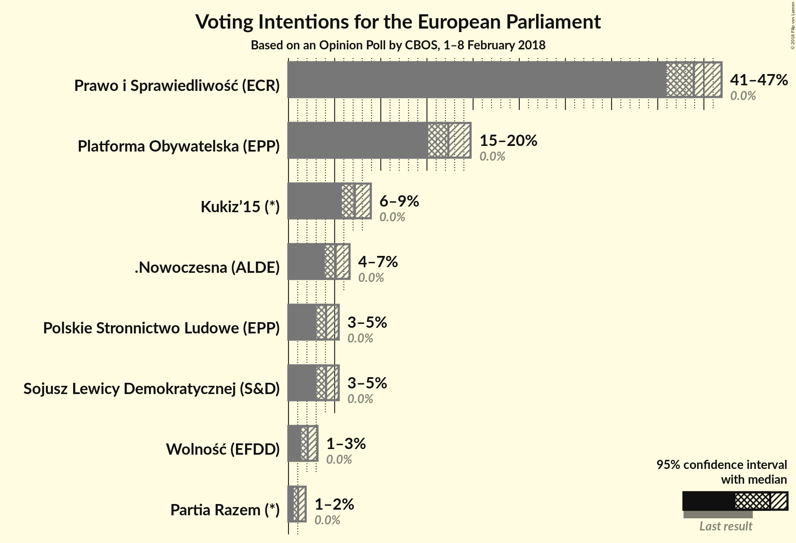
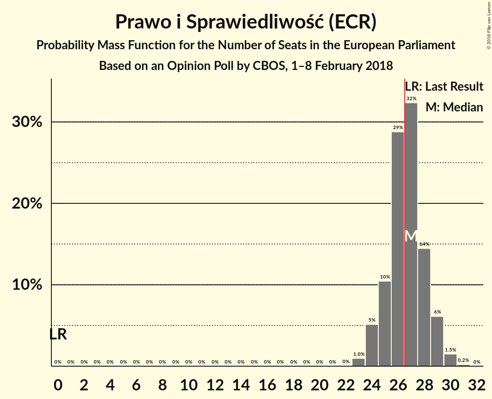
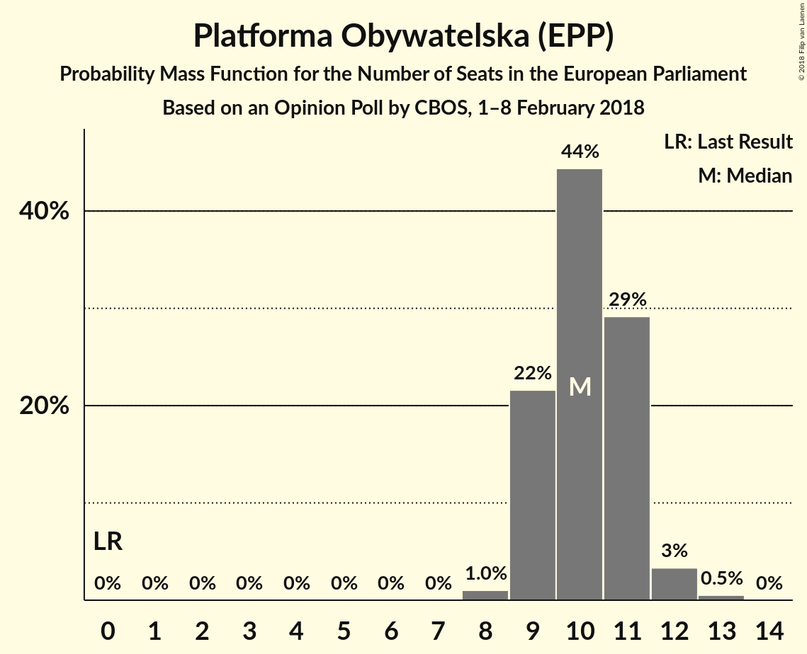
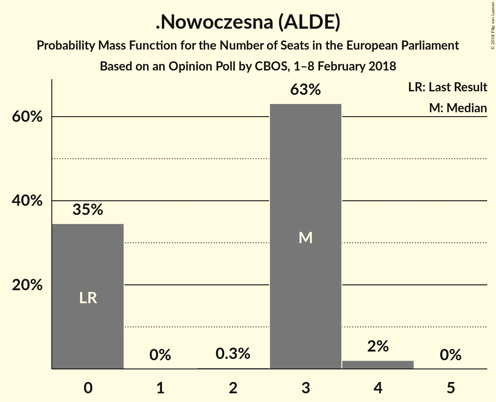
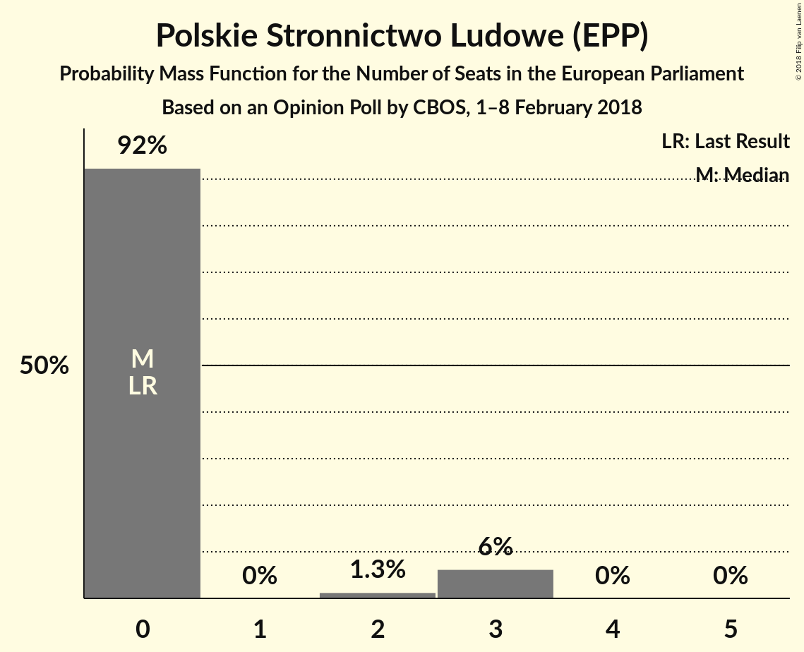

# Opinion Poll by CBOS, 1–8 February 2018

<a href="#voting-intentions">Voting Intentions</a> | <a href="#seats">Seats</a> | <a href="#coalitions">Coalitions</a> | <a href="#technical-information">Technical Information</a>

## Voting Intentions

### Confidence Intervals

| Party | Last Result | Poll Result | 80% Confidence Interval | 90% Confidence Interval | 95% Confidence Interval | 99% Confidence Interval |
|:-----:|:-----------:|:-----------:|:-----------------------:|:-----------------------:|:-----------------------:|:-----------------------:|
| Prawo i Sprawiedliwość (ECR) | 0.0% | 43.9% | 41.9–45.9% |41.4–46.4% |40.9–46.9% |40.0–47.9% |
| Platforma Obywatelska (EPP) | 0.0% | 17.3% | 15.9–18.9% |15.5–19.3% |15.2–19.7% |14.5–20.5% |
| Kukiz’15 (*) | 0.0% | 7.2% | 6.3–8.3% |6.0–8.6% |5.8–8.9% |5.4–9.5% |
| .Nowoczesna (ALDE) | 0.0% | 5.1% | 4.3–6.1% |4.1–6.4% |3.9–6.6% |3.6–7.1% |
| Polskie Stronnictwo Ludowe (EPP) | 0.0% | 4.1% | 3.4–5.0% |3.2–5.2% |3.0–5.4% |2.7–5.9% |
| Sojusz Lewicy Demokratycznej (S&D) | 0.0% | 4.1% | 3.4–5.0% |3.2–5.2% |3.0–5.4% |2.7–5.9% |
| Wolność (EFDD) | 0.0% | 2.1% | 1.6–2.8% |1.5–3.0% |1.4–3.1% |1.2–3.5% |
| Partia Razem (*) | 0.0% | 1.0% | 0.7–1.6% |0.7–1.7% |0.6–1.9% |0.5–2.1% |

*Note:* The poll result column reflects the actual value used in the calculations. Published results may vary slightly, and in addition be rounded to fewer digits.

## Seats

### Confidence Intervals

| Party | Last Result | Median | 80% Confidence Interval | 90% Confidence Interval | 95% Confidence Interval | 99% Confidence Interval |
|:-----:|:-----------:|:------:|:-----------------------:|:-----------------------:|:-----------------------:|:-----------------------:|
| <a href="#prawo-i-sprawiedliwość-(ecr)">Prawo i Sprawiedliwość (ECR)</a> | 0 | 27 | 25–28 |24–29 |24–29 |23–29 |
| <a href="#platforma-obywatelska-(epp)">Platforma Obywatelska (EPP)</a> | 0 | 10 | 9–11 |9–11 |9–11 |8–13 |
| <a href="#kukiz’15-(*)">Kukiz’15 (*)</a> | 0 | 4 | 3–5 |3–5 |3–5 |3–6 |
| <a href="#.nowoczesna-(alde)">.Nowoczesna (ALDE)</a> | 0 | 3 | 0–3 |0–3 |0–4 |0–4 |
| <a href="#polskie-stronnictwo-ludowe-(epp)">Polskie Stronnictwo Ludowe (EPP)</a> | 0 | 0 | 0 |0–3 |0–3 |0–3 |
| <a href="#sojusz-lewicy-demokratycznej-(s&d)">Sojusz Lewicy Demokratycznej (S&D)</a> | 0 | 0 | 0 |0–3 |0–3 |0–3 |
| <a href="#wolność-(efdd)">Wolność (EFDD)</a> | 0 | 0 | 0 |0 |0 |0 |
| <a href="#partia-razem-(*)">Partia Razem (*)</a> | 0 | 0 | 0 |0 |0 |0 |

### Prawo i Sprawiedliwość (ECR)

*For a full overview of the results for this party, see the [Prawo i Sprawiedliwość (ECR)](party-prawoisprawiedliwośćecr.html) page.*

| Number of Seats | Probability | Accumulated | Special Marks |
|:---------------:|:-----------:|:-----------:|:-------------:|
| 0 | 0% | 100% | Last Result |
| 1 | 0% | 100% |  |
| 2 | 0% | 100% |  |
| 3 | 0% | 100% |  |
| 4 | 0% | 100% |  |
| 5 | 0% | 100% |  |
| 6 | 0% | 100% |  |
| 7 | 0% | 100% |  |
| 8 | 0% | 100% |  |
| 9 | 0% | 100% |  |
| 10 | 0% | 100% |  |
| 11 | 0% | 100% |  |
| 12 | 0% | 100% |  |
| 13 | 0% | 100% |  |
| 14 | 0% | 100% |  |
| 15 | 0% | 100% |  |
| 16 | 0% | 100% |  |
| 17 | 0% | 100% |  |
| 18 | 0% | 100% |  |
| 19 | 0% | 100% |  |
| 20 | 0% | 100% |  |
| 21 | 0% | 100% |  |
| 22 | 0% | 100% |  |
| 23 | 0.9% | 100% |  |
| 24 | 8% | 99.1% |  |
| 25 | 19% | 91% |  |
| 26 | 10% | 72% |  |
| 27 | 40% | 62% | Median, Majority |
| 28 | 12% | 22% |  |
| 29 | 9% | 9% |  |
| 30 | 0.2% | 0.3% |  |
| 31 | 0.1% | 0.1% |  |
| 32 | 0% | 0% |  |

### Platforma Obywatelska (EPP)

*For a full overview of the results for this party, see the [Platforma Obywatelska (EPP)](party-platformaobywatelskaepp.html) page.*

| Number of Seats | Probability | Accumulated | Special Marks |
|:---------------:|:-----------:|:-----------:|:-------------:|
| 0 | 0% | 100% | Last Result |
| 1 | 0% | 100% |  |
| 2 | 0% | 100% |  |
| 3 | 0% | 100% |  |
| 4 | 0% | 100% |  |
| 5 | 0% | 100% |  |
| 6 | 0% | 100% |  |
| 7 | 0% | 100% |  |
| 8 | 0.6% | 100% |  |
| 9 | 29% | 99.3% |  |
| 10 | 38% | 70% | Median |
| 11 | 30% | 32% |  |
| 12 | 2% | 2% |  |
| 13 | 0.6% | 0.6% |  |
| 14 | 0% | 0% |  |

### Kukiz’15 (*)

*For a full overview of the results for this party, see the [Kukiz’15 (*)](party-kukiz’15.html) page.*

| Number of Seats | Probability | Accumulated | Special Marks |
|:---------------:|:-----------:|:-----------:|:-------------:|
| 0 | 0% | 100% | Last Result |
| 1 | 0% | 100% |  |
| 2 | 0% | 100% |  |
| 3 | 20% | 100% |  |
| 4 | 68% | 80% | Median |
| 5 | 11% | 12% |  |
| 6 | 0.9% | 0.9% |  |
| 7 | 0% | 0% |  |

### .Nowoczesna (ALDE)

*For a full overview of the results for this party, see the [.Nowoczesna (ALDE)](party-nowoczesnaalde.html) page.*

| Number of Seats | Probability | Accumulated | Special Marks |
|:---------------:|:-----------:|:-----------:|:-------------:|
| 0 | 27% | 100% | Last Result |
| 1 | 0% | 73% |  |
| 2 | 0.3% | 73% |  |
| 3 | 69% | 73% | Median |
| 4 | 3% | 4% |  |
| 5 | 0% | 0% |  |

### Polskie Stronnictwo Ludowe (EPP)

*For a full overview of the results for this party, see the [Polskie Stronnictwo Ludowe (EPP)](party-polskiestronnictwoludoweepp.html) page.*

| Number of Seats | Probability | Accumulated | Special Marks |
|:---------------:|:-----------:|:-----------:|:-------------:|
| 0 | 92% | 100% | Last Result, Median |
| 1 | 0% | 8% |  |
| 2 | 0.7% | 8% |  |
| 3 | 7% | 7% |  |
| 4 | 0% | 0% |  |

### Sojusz Lewicy Demokratycznej (S&D)

*For a full overview of the results for this party, see the [Sojusz Lewicy Demokratycznej (S&D)](party-sojuszlewicydemokratycznejsd.html) page.*

| Number of Seats | Probability | Accumulated | Special Marks |
|:---------------:|:-----------:|:-----------:|:-------------:|
| 0 | 95% | 100% | Last Result, Median |
| 1 | 0% | 5% |  |
| 2 | 0.1% | 5% |  |
| 3 | 5% | 5% |  |
| 4 | 0% | 0% |  |

### Wolność (EFDD)

*For a full overview of the results for this party, see the [Wolność (EFDD)](party-wolnośćefdd.html) page.*

| Number of Seats | Probability | Accumulated | Special Marks |
|:---------------:|:-----------:|:-----------:|:-------------:|
| 0 | 100% | 100% | Last Result, Median |

### Partia Razem (*)

*For a full overview of the results for this party, see the [Partia Razem (*)](party-partiarazem.html) page.*

| Number of Seats | Probability | Accumulated | Special Marks |
|:---------------:|:-----------:|:-----------:|:-------------:|
| 0 | 100% | 100% | Last Result, Median |

## Coalitions

### Confidence Intervals

| Coalition | Last Result | Median | Majority? | 80% Confidence Interval | 90% Confidence Interval | 95% Confidence Interval | 99% Confidence Interval |
|:---------:|:-----------:|:------:|:---------:|:-----------------------:|:-----------------------:|:-----------------------:|:-----------------------:|
| Prawo i Sprawiedliwość (ECR) | 0 | 27 | 62% | 25–28 | 24–29 | 24–29 | 23–29 |
| Platforma Obywatelska (EPP) – Polskie Stronnictwo Ludowe (EPP) | 0 | 10 | 0% | 9–11 | 9–13 | 9–14 | 9–14 |
| Kukiz’15 (*) – Partia Razem (*) | 0 | 4 | 0% | 3–5 | 3–5 | 3–5 | 3–6 |
| .Nowoczesna (ALDE) | 0 | 3 | 0% | 0–3 | 0–3 | 0–4 | 0–4 |
| Sojusz Lewicy Demokratycznej (S&D) | 0 | 0 | 0% | 0 | 0–3 | 0–3 | 0–3 |
| Wolność (EFDD) | 0 | 0 | 0% | 0 | 0 | 0 | 0 |

### Prawo i Sprawiedliwość (ECR)

| Number of Seats | Probability | Accumulated | Special Marks |
|:---------------:|:-----------:|:-----------:|:-------------:|
| 0 | 0% | 100% | Last Result |
| 1 | 0% | 100% |  |
| 2 | 0% | 100% |  |
| 3 | 0% | 100% |  |
| 4 | 0% | 100% |  |
| 5 | 0% | 100% |  |
| 6 | 0% | 100% |  |
| 7 | 0% | 100% |  |
| 8 | 0% | 100% |  |
| 9 | 0% | 100% |  |
| 10 | 0% | 100% |  |
| 11 | 0% | 100% |  |
| 12 | 0% | 100% |  |
| 13 | 0% | 100% |  |
| 14 | 0% | 100% |  |
| 15 | 0% | 100% |  |
| 16 | 0% | 100% |  |
| 17 | 0% | 100% |  |
| 18 | 0% | 100% |  |
| 19 | 0% | 100% |  |
| 20 | 0% | 100% |  |
| 21 | 0% | 100% |  |
| 22 | 0% | 100% |  |
| 23 | 0.9% | 100% |  |
| 24 | 8% | 99.1% |  |
| 25 | 19% | 91% |  |
| 26 | 10% | 72% |  |
| 27 | 40% | 62% | Median, Majority |
| 28 | 12% | 22% |  |
| 29 | 9% | 9% |  |
| 30 | 0.2% | 0.3% |  |
| 31 | 0.1% | 0.1% |  |
| 32 | 0% | 0% |  |

### Platforma Obywatelska (EPP) – Polskie Stronnictwo Ludowe (EPP)

| Number of Seats | Probability | Accumulated | Special Marks |
|:---------------:|:-----------:|:-----------:|:-------------:|
| 0 | 0% | 100% | Last Result |
| 1 | 0% | 100% |  |
| 2 | 0% | 100% |  |
| 3 | 0% | 100% |  |
| 4 | 0% | 100% |  |
| 5 | 0% | 100% |  |
| 6 | 0% | 100% |  |
| 7 | 0% | 100% |  |
| 8 | 0.4% | 100% |  |
| 9 | 27% | 99.6% |  |
| 10 | 36% | 73% | Median |
| 11 | 27% | 37% |  |
| 12 | 4% | 9% |  |
| 13 | 3% | 5% |  |
| 14 | 3% | 3% |  |
| 15 | 0% | 0% |  |

### Kukiz’15 (*) – Partia Razem (*)

| Number of Seats | Probability | Accumulated | Special Marks |
|:---------------:|:-----------:|:-----------:|:-------------:|
| 0 | 0% | 100% | Last Result |
| 1 | 0% | 100% |  |
| 2 | 0% | 100% |  |
| 3 | 20% | 100% |  |
| 4 | 68% | 80% | Median |
| 5 | 11% | 12% |  |
| 6 | 0.9% | 0.9% |  |
| 7 | 0% | 0% |  |

### .Nowoczesna (ALDE)

| Number of Seats | Probability | Accumulated | Special Marks |
|:---------------:|:-----------:|:-----------:|:-------------:|
| 0 | 27% | 100% | Last Result |
| 1 | 0% | 73% |  |
| 2 | 0.3% | 73% |  |
| 3 | 69% | 73% | Median |
| 4 | 3% | 4% |  |
| 5 | 0% | 0% |  |

### Sojusz Lewicy Demokratycznej (S&D)

| Number of Seats | Probability | Accumulated | Special Marks |
|:---------------:|:-----------:|:-----------:|:-------------:|
| 0 | 95% | 100% | Last Result, Median |
| 1 | 0% | 5% |  |
| 2 | 0.1% | 5% |  |
| 3 | 5% | 5% |  |
| 4 | 0% | 0% |  |

### Wolność (EFDD)

| Number of Seats | Probability | Accumulated | Special Marks |
|:---------------:|:-----------:|:-----------:|:-------------:|
| 0 | 100% | 100% | Last Result, Median |

## Technical Information

### Opinion Poll

+ **Polling firm:** CBOS
+ **Commissioner(s):** —
+ **Fieldwork period:** 1–8 February 2018

### Calculations

+ **Sample size:** 1057
+ **Simulations done:** 131,072
+ **Error estimate:** 2.36%

