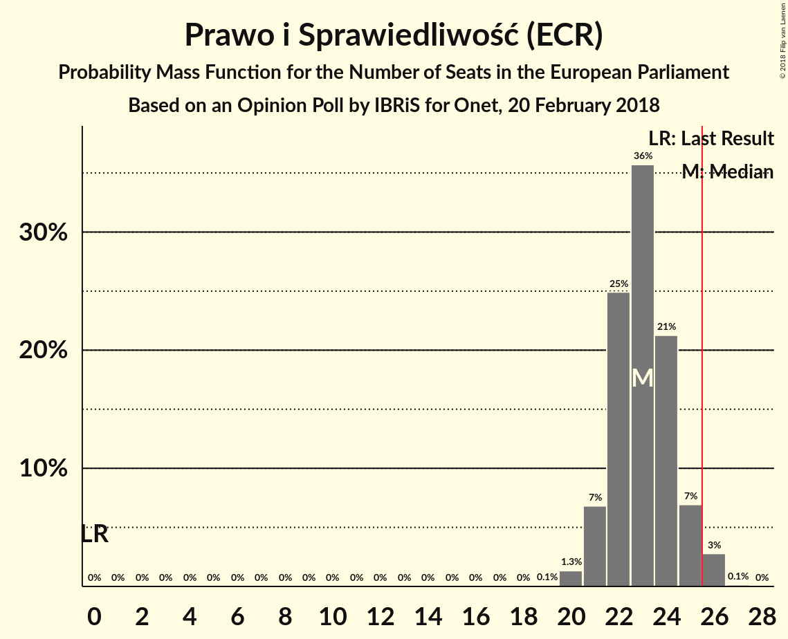
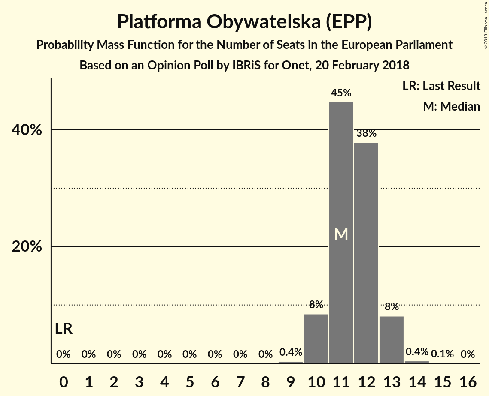
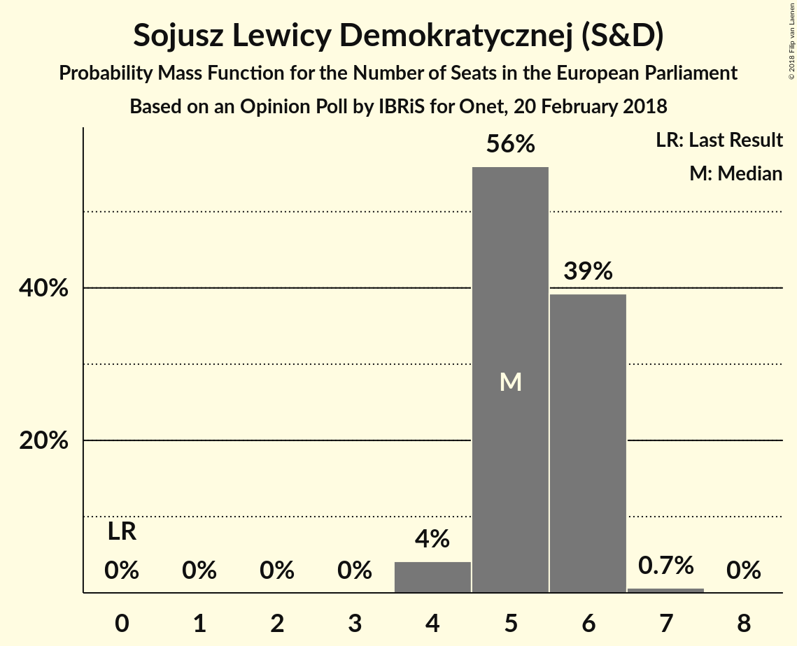
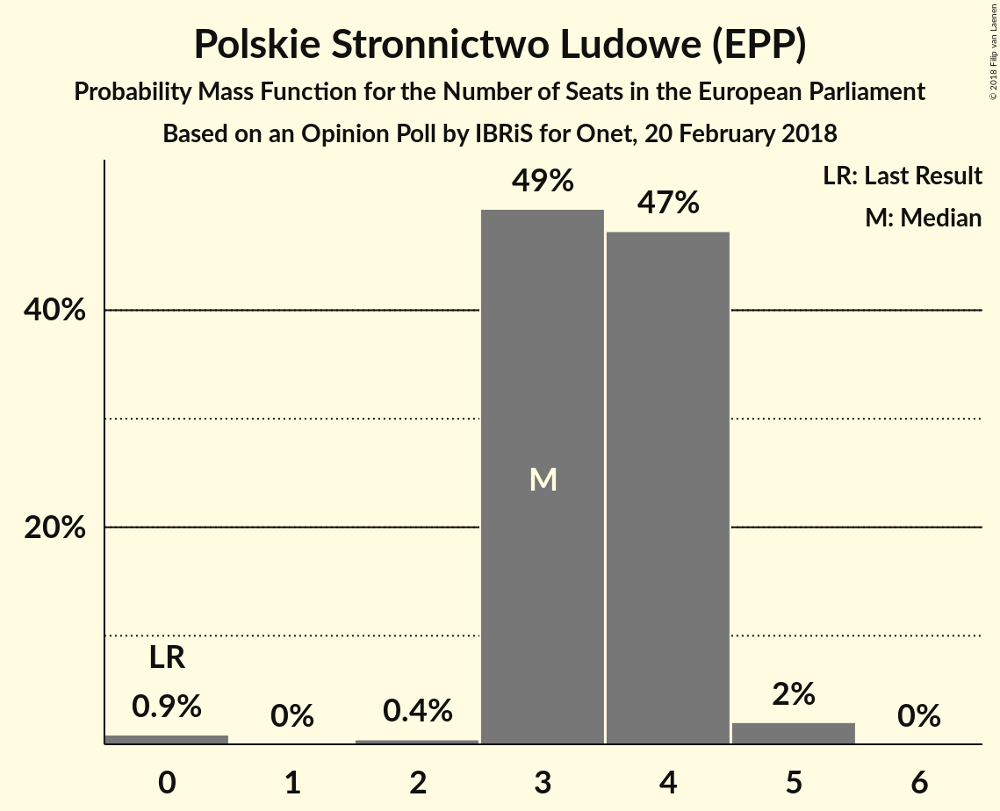
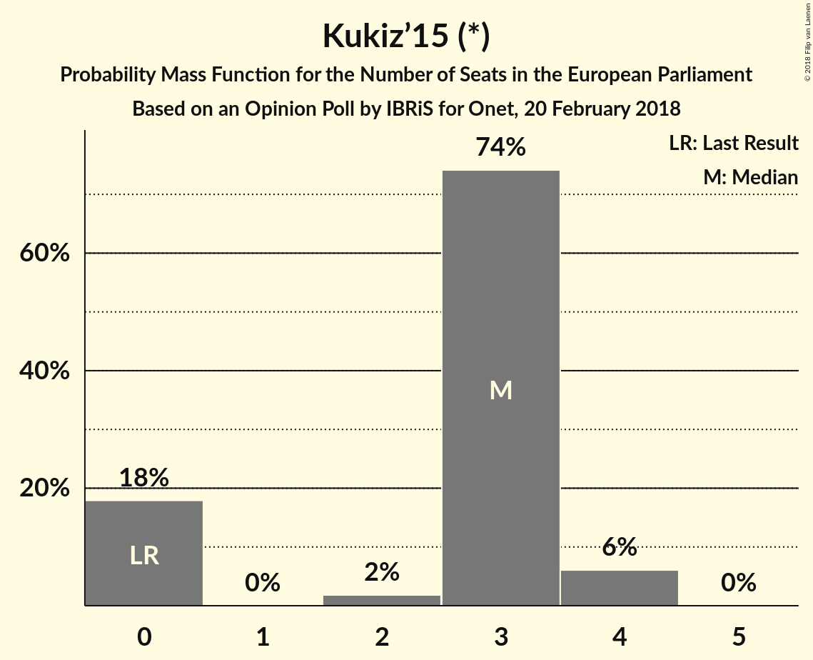
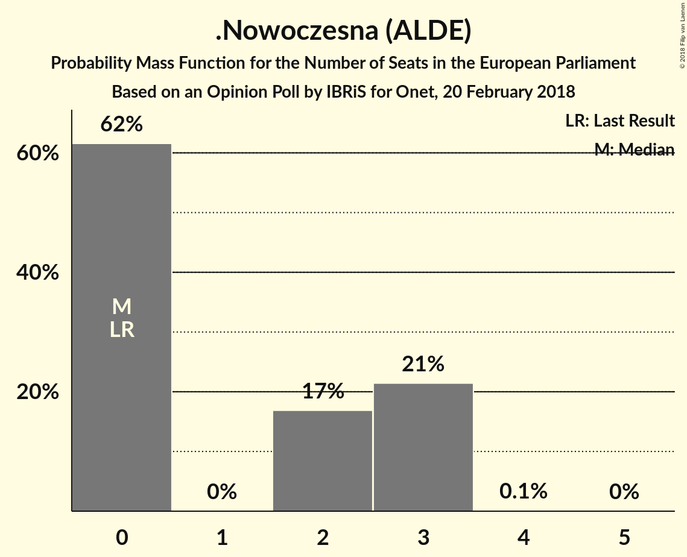
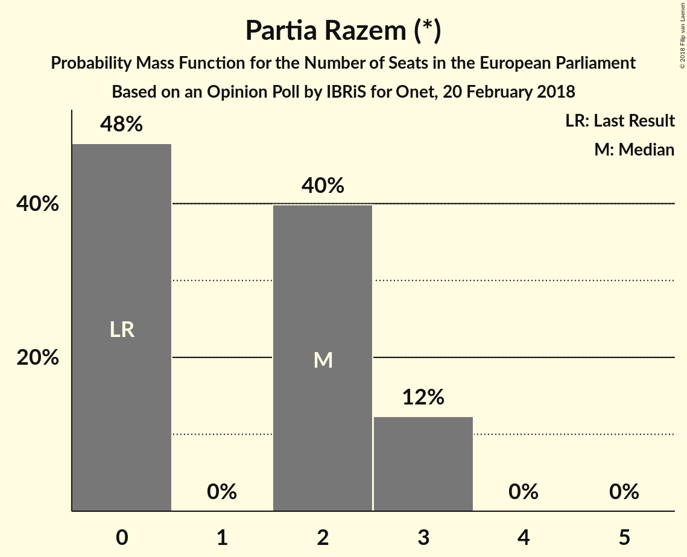
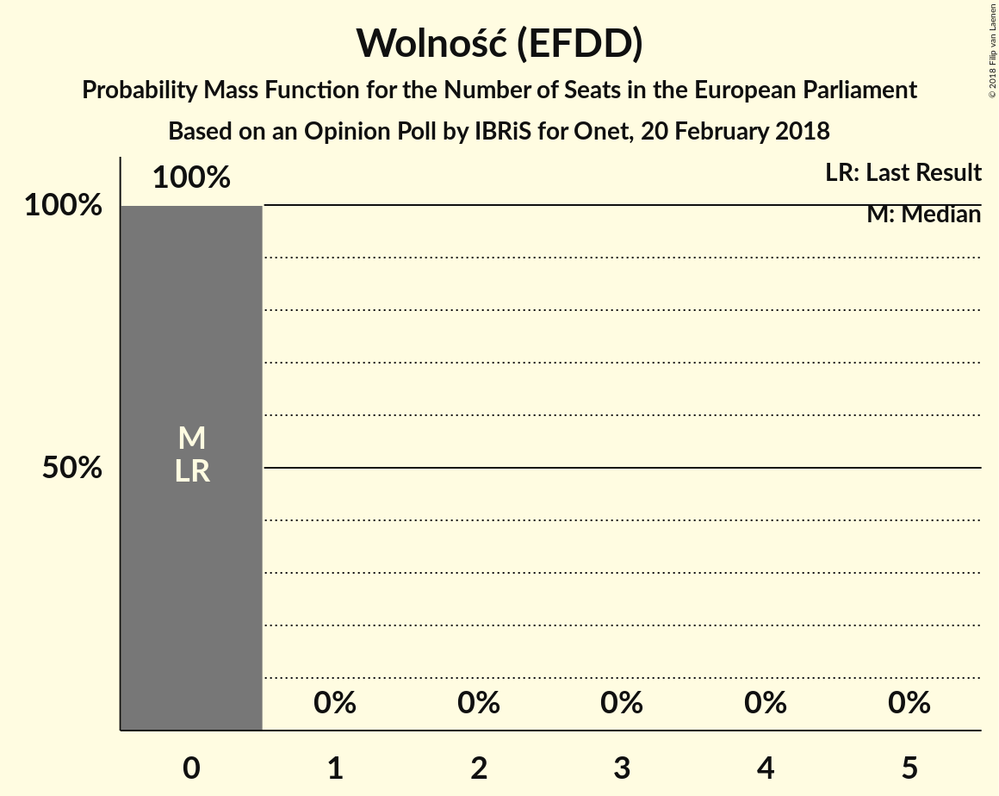
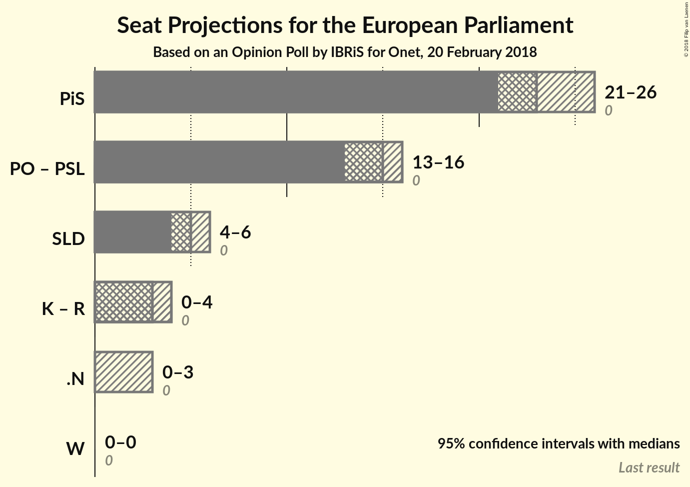

# Opinion Poll by IBRiS for Onet, 20 February 2018

<a href="#voting-intentions">Voting Intentions</a> | <a href="#seats">Seats</a> | <a href="#coalitions">Coalitions</a> | <a href="#technical-information">Technical Information</a>

## Voting Intentions

### Confidence Intervals

| Party | Last Result | Poll Result | 80% Confidence Interval | 90% Confidence Interval | 95% Confidence Interval | 99% Confidence Interval |
|:-----:|:-----------:|:-----------:|:-----------------------:|:-----------------------:|:-----------------------:|:-----------------------:|
| Prawo i Sprawiedliwość (ECR) | 0.0% | 39.7% | 37.9–41.6% |37.3–42.2% |36.9–42.7% |36.0–43.6% |
| Platforma Obywatelska (EPP) | 0.0% | 19.6% | 18.2–21.2% |17.7–21.7% |17.4–22.1% |16.7–22.9% |
| Sojusz Lewicy Demokratycznej (S&D) | 0.0% | 9.5% | 8.4–10.7% |8.1–11.0% |7.9–11.3% |7.4–11.9% |
| Polskie Stronnictwo Ludowe (EPP) | 0.0% | 6.6% | 5.8–7.7% |5.5–8.0% |5.3–8.3% |4.9–8.8% |
| Kukiz’15 (*) | 0.0% | 5.5% | 4.8–6.5% |4.5–6.8% |4.3–7.1% |4.0–7.6% |
| .Nowoczesna (ALDE) | 0.0% | 4.5% | 3.8–5.5% |3.6–5.7% |3.5–5.9% |3.1–6.4% |
| Partia Razem (*) | 0.0% | 3.9% | 3.2–4.8% |3.1–5.0% |2.9–5.2% |2.6–5.7% |
| Wolność (EFDD) | 0.0% | 1.4% | 1.0–1.9% |0.9–2.1% |0.8–2.2% |0.7–2.5% |

*Note:* The poll result column reflects the actual value used in the calculations. Published results may vary slightly, and in addition be rounded to fewer digits.

## Seats

### Confidence Intervals

| Party | Last Result | Median | 80% Confidence Interval | 90% Confidence Interval | 95% Confidence Interval | 99% Confidence Interval |
|:-----:|:-----------:|:------:|:-----------------------:|:-----------------------:|:-----------------------:|:-----------------------:|
| <a href="#prawo-i-sprawiedliwość-(ecr)">Prawo i Sprawiedliwość (ECR)</a> | 0 | 23 | 22–25 |22–25 |21–26 |21–27 |
| <a href="#platforma-obywatelska-(epp)">Platforma Obywatelska (EPP)</a> | 0 | 11 | 10–12 |10–13 |10–13 |9–14 |
| <a href="#sojusz-lewicy-demokratycznej-(s&d)">Sojusz Lewicy Demokratycznej (S&D)</a> | 0 | 5 | 5–6 |4–6 |4–6 |4–7 |
| <a href="#polskie-stronnictwo-ludowe-(epp)">Polskie Stronnictwo Ludowe (EPP)</a> | 0 | 4 | 3–4 |3–4 |3–5 |0–5 |
| <a href="#kukiz’15-(*)">Kukiz’15 (*)</a> | 0 | 3 | 0–3 |0–4 |0–4 |0–4 |
| <a href="#.nowoczesna-(alde)">.Nowoczesna (ALDE)</a> | 0 | 0 | 0–3 |0–3 |0–3 |0–3 |
| <a href="#partia-razem-(*)">Partia Razem (*)</a> | 0 | 0 | 0 |0 |0–3 |0–3 |
| <a href="#wolność-(efdd)">Wolność (EFDD)</a> | 0 | 0 | 0 |0 |0 |0 |

### Prawo i Sprawiedliwość (ECR)

*For a full overview of the results for this party, see the [Prawo i Sprawiedliwość (ECR)](party-prawoisprawiedliwośćecr.html) page.*

| Number of Seats | Probability | Accumulated | Special Marks |
|:---------------:|:-----------:|:-----------:|:-------------:|
| 0 | 0% | 100% | Last Result |
| 1 | 0% | 100% |  |
| 2 | 0% | 100% |  |
| 3 | 0% | 100% |  |
| 4 | 0% | 100% |  |
| 5 | 0% | 100% |  |
| 6 | 0% | 100% |  |
| 7 | 0% | 100% |  |
| 8 | 0% | 100% |  |
| 9 | 0% | 100% |  |
| 10 | 0% | 100% |  |
| 11 | 0% | 100% |  |
| 12 | 0% | 100% |  |
| 13 | 0% | 100% |  |
| 14 | 0% | 100% |  |
| 15 | 0% | 100% |  |
| 16 | 0% | 100% |  |
| 17 | 0% | 100% |  |
| 18 | 0% | 100% |  |
| 19 | 0% | 100% |  |
| 20 | 0.3% | 100% |  |
| 21 | 4% | 99.7% |  |
| 22 | 16% | 95% |  |
| 23 | 29% | 79% | Median |
| 24 | 30% | 50% |  |
| 25 | 15% | 19% |  |
| 26 | 4% | 4% |  |
| 27 | 0.5% | 0.5% | Majority |
| 28 | 0.1% | 0.1% |  |
| 29 | 0% | 0% |  |

### Platforma Obywatelska (EPP)

*For a full overview of the results for this party, see the [Platforma Obywatelska (EPP)](party-platformaobywatelskaepp.html) page.*

| Number of Seats | Probability | Accumulated | Special Marks |
|:---------------:|:-----------:|:-----------:|:-------------:|
| 0 | 0% | 100% | Last Result |
| 1 | 0% | 100% |  |
| 2 | 0% | 100% |  |
| 3 | 0% | 100% |  |
| 4 | 0% | 100% |  |
| 5 | 0% | 100% |  |
| 6 | 0% | 100% |  |
| 7 | 0% | 100% |  |
| 8 | 0% | 100% |  |
| 9 | 0.7% | 100% |  |
| 10 | 12% | 99.3% |  |
| 11 | 46% | 88% | Median |
| 12 | 33% | 41% |  |
| 13 | 8% | 8% |  |
| 14 | 0.7% | 0.8% |  |
| 15 | 0% | 0% |  |

### Sojusz Lewicy Demokratycznej (S&D)

*For a full overview of the results for this party, see the [Sojusz Lewicy Demokratycznej (S&D)](party-sojuszlewicydemokratycznejsd.html) page.*

| Number of Seats | Probability | Accumulated | Special Marks |
|:---------------:|:-----------:|:-----------:|:-------------:|
| 0 | 0% | 100% | Last Result |
| 1 | 0% | 100% |  |
| 2 | 0% | 100% |  |
| 3 | 0% | 100% |  |
| 4 | 10% | 100% |  |
| 5 | 62% | 90% | Median |
| 6 | 27% | 29% |  |
| 7 | 2% | 2% |  |
| 8 | 0% | 0% |  |

### Polskie Stronnictwo Ludowe (EPP)

*For a full overview of the results for this party, see the [Polskie Stronnictwo Ludowe (EPP)](party-polskiestronnictwoludoweepp.html) page.*

| Number of Seats | Probability | Accumulated | Special Marks |
|:---------------:|:-----------:|:-----------:|:-------------:|
| 0 | 0.8% | 100% | Last Result |
| 1 | 0% | 99.2% |  |
| 2 | 0.3% | 99.2% |  |
| 3 | 45% | 98.9% |  |
| 4 | 51% | 54% | Median |
| 5 | 3% | 3% |  |
| 6 | 0% | 0% |  |

### Kukiz’15 (*)

*For a full overview of the results for this party, see the [Kukiz’15 (*)](party-kukiz’15.html) page.*

| Number of Seats | Probability | Accumulated | Special Marks |
|:---------------:|:-----------:|:-----------:|:-------------:|
| 0 | 18% | 100% | Last Result |
| 1 | 0% | 82% |  |
| 2 | 2% | 82% |  |
| 3 | 74% | 80% | Median |
| 4 | 6% | 6% |  |
| 5 | 0% | 0% |  |

### .Nowoczesna (ALDE)

*For a full overview of the results for this party, see the [.Nowoczesna (ALDE)](party-nowoczesnaalde.html) page.*

| Number of Seats | Probability | Accumulated | Special Marks |
|:---------------:|:-----------:|:-----------:|:-------------:|
| 0 | 75% | 100% | Last Result, Median |
| 1 | 0% | 25% |  |
| 2 | 6% | 25% |  |
| 3 | 19% | 19% |  |
| 4 | 0.1% | 0.1% |  |
| 5 | 0% | 0% |  |

### Partia Razem (*)

*For a full overview of the results for this party, see the [Partia Razem (*)](party-partiarazem.html) page.*

| Number of Seats | Probability | Accumulated | Special Marks |
|:---------------:|:-----------:|:-----------:|:-------------:|
| 0 | 95% | 100% | Last Result, Median |
| 1 | 0% | 5% |  |
| 2 | 2% | 5% |  |
| 3 | 3% | 3% |  |
| 4 | 0% | 0% |  |

### Wolność (EFDD)

*For a full overview of the results for this party, see the [Wolność (EFDD)](party-wolnośćefdd.html) page.*

| Number of Seats | Probability | Accumulated | Special Marks |
|:---------------:|:-----------:|:-----------:|:-------------:|
| 0 | 100% | 100% | Last Result, Median |

## Coalitions

### Confidence Intervals

| Coalition | Last Result | Median | Majority? | 80% Confidence Interval | 90% Confidence Interval | 95% Confidence Interval | 99% Confidence Interval |
|:---------:|:-----------:|:------:|:---------:|:-----------------------:|:-----------------------:|:-----------------------:|:-----------------------:|
| Prawo i Sprawiedliwość (ECR) | 0 | 23 | 0.5% | 22–25 | 22–25 | 21–26 | 21–27 |
| Platforma Obywatelska (EPP) – Polskie Stronnictwo Ludowe (EPP) | 0 | 15 | 0% | 14–16 | 13–17 | 13–17 | 12–17 |
| Sojusz Lewicy Demokratycznej (S&D) | 0 | 5 | 0% | 5–6 | 4–6 | 4–6 | 4–7 |
| Kukiz’15 (*) – Partia Razem (*) | 0 | 3 | 0% | 0–3 | 0–4 | 0–5 | 0–6 |
| .Nowoczesna (ALDE) | 0 | 0 | 0% | 0–3 | 0–3 | 0–3 | 0–3 |
| Wolność (EFDD) | 0 | 0 | 0% | 0 | 0 | 0 | 0 |

### Prawo i Sprawiedliwość (ECR)

| Number of Seats | Probability | Accumulated | Special Marks |
|:---------------:|:-----------:|:-----------:|:-------------:|
| 0 | 0% | 100% | Last Result |
| 1 | 0% | 100% |  |
| 2 | 0% | 100% |  |
| 3 | 0% | 100% |  |
| 4 | 0% | 100% |  |
| 5 | 0% | 100% |  |
| 6 | 0% | 100% |  |
| 7 | 0% | 100% |  |
| 8 | 0% | 100% |  |
| 9 | 0% | 100% |  |
| 10 | 0% | 100% |  |
| 11 | 0% | 100% |  |
| 12 | 0% | 100% |  |
| 13 | 0% | 100% |  |
| 14 | 0% | 100% |  |
| 15 | 0% | 100% |  |
| 16 | 0% | 100% |  |
| 17 | 0% | 100% |  |
| 18 | 0% | 100% |  |
| 19 | 0% | 100% |  |
| 20 | 0.3% | 100% |  |
| 21 | 4% | 99.7% |  |
| 22 | 16% | 95% |  |
| 23 | 29% | 79% | Median |
| 24 | 30% | 50% |  |
| 25 | 15% | 19% |  |
| 26 | 4% | 4% |  |
| 27 | 0.5% | 0.5% | Majority |
| 28 | 0.1% | 0.1% |  |
| 29 | 0% | 0% |  |

### Platforma Obywatelska (EPP) – Polskie Stronnictwo Ludowe (EPP)

| Number of Seats | Probability | Accumulated | Special Marks |
|:---------------:|:-----------:|:-----------:|:-------------:|
| 0 | 0% | 100% | Last Result |
| 1 | 0% | 100% |  |
| 2 | 0% | 100% |  |
| 3 | 0% | 100% |  |
| 4 | 0% | 100% |  |
| 5 | 0% | 100% |  |
| 6 | 0% | 100% |  |
| 7 | 0% | 100% |  |
| 8 | 0% | 100% |  |
| 9 | 0% | 100% |  |
| 10 | 0% | 100% |  |
| 11 | 0.2% | 100% |  |
| 12 | 0.6% | 99.7% |  |
| 13 | 5% | 99.1% |  |
| 14 | 31% | 94% |  |
| 15 | 35% | 64% | Median |
| 16 | 23% | 29% |  |
| 17 | 5% | 5% |  |
| 18 | 0.5% | 0.5% |  |
| 19 | 0% | 0% |  |

### Sojusz Lewicy Demokratycznej (S&D)

| Number of Seats | Probability | Accumulated | Special Marks |
|:---------------:|:-----------:|:-----------:|:-------------:|
| 0 | 0% | 100% | Last Result |
| 1 | 0% | 100% |  |
| 2 | 0% | 100% |  |
| 3 | 0% | 100% |  |
| 4 | 10% | 100% |  |
| 5 | 62% | 90% | Median |
| 6 | 27% | 29% |  |
| 7 | 2% | 2% |  |
| 8 | 0% | 0% |  |

### Kukiz’15 (*) – Partia Razem (*)

| Number of Seats | Probability | Accumulated | Special Marks |
|:---------------:|:-----------:|:-----------:|:-------------:|
| 0 | 17% | 100% | Last Result |
| 1 | 0% | 83% |  |
| 2 | 2% | 83% |  |
| 3 | 72% | 81% | Median |
| 4 | 6% | 10% |  |
| 5 | 2% | 4% |  |
| 6 | 2% | 2% |  |
| 7 | 0.1% | 0.1% |  |
| 8 | 0% | 0% |  |

### .Nowoczesna (ALDE)

| Number of Seats | Probability | Accumulated | Special Marks |
|:---------------:|:-----------:|:-----------:|:-------------:|
| 0 | 75% | 100% | Last Result, Median |
| 1 | 0% | 25% |  |
| 2 | 6% | 25% |  |
| 3 | 19% | 19% |  |
| 4 | 0.1% | 0.1% |  |
| 5 | 0% | 0% |  |

### Wolność (EFDD)

| Number of Seats | Probability | Accumulated | Special Marks |
|:---------------:|:-----------:|:-----------:|:-------------:|
| 0 | 100% | 100% | Last Result, Median |

## Technical Information

### Opinion Poll

+ **Polling firm:** IBRiS
+ **Commissioner(s):** Onet
+ **Fieldwork period:** 20 February 2018

### Calculations

+ **Sample size:** 1100
+ **Simulations done:** 1,048,576
+ **Error estimate:** 2.03%

