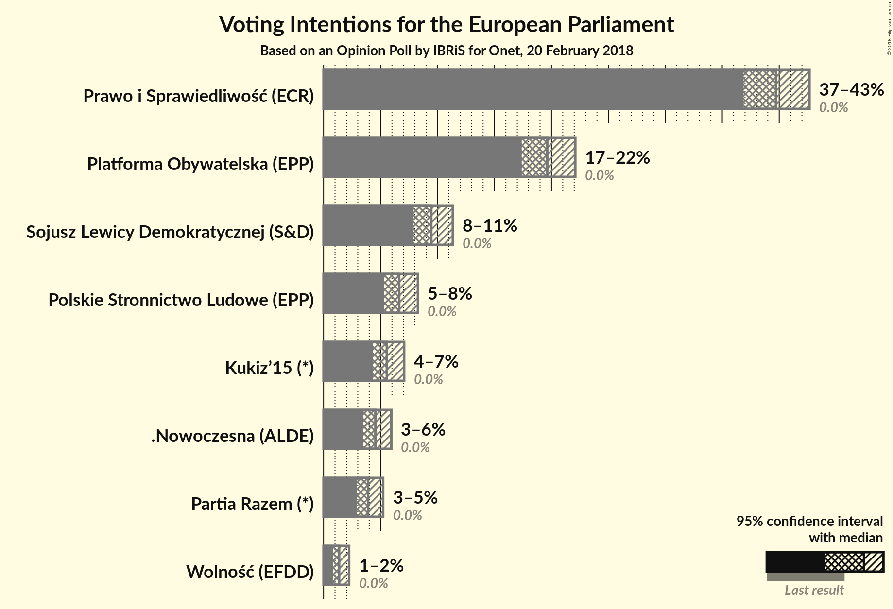

# Opinion Poll by IBRiS for Onet, 20 February 2018

<a href="#voting-intentions">Voting Intentions</a> | <a href="#seats">Seats</a> | <a href="#coalitions">Coalitions</a> | <a href="#technical-information">Technical Information</a>

## Voting Intentions

### Confidence Intervals

| Party | Last Result | Poll Result | 80% Confidence Interval | 90% Confidence Interval | 95% Confidence Interval | 99% Confidence Interval |
|:-----:|:-----------:|:-----------:|:-----------------------:|:-----------------------:|:-----------------------:|:-----------------------:|
| Prawo i Sprawiedliwość (ECR) | 0.0% | 39.7% | 37.9–41.6% |37.3–42.2% |36.9–42.7% |36.0–43.6% |
| Platforma Obywatelska (EPP) | 0.0% | 19.6% | 18.2–21.2% |17.7–21.7% |17.4–22.1% |16.7–22.9% |
| Sojusz Lewicy Demokratycznej (S&D) | 0.0% | 9.5% | 8.4–10.7% |8.1–11.0% |7.9–11.3% |7.4–11.9% |
| Polskie Stronnictwo Ludowe (EPP) | 0.0% | 6.6% | 5.8–7.7% |5.5–8.0% |5.3–8.3% |4.9–8.8% |
| Kukiz’15 (*) | 0.0% | 5.5% | N/A |N/A |N/A |N/A |
| .Nowoczesna (ALDE) | 0.0% | 4.5% | 3.8–5.5% |3.6–5.7% |3.5–5.9% |3.1–6.4% |
| Partia Razem (*) | 0.0% | 3.9% | N/A |N/A |N/A |N/A |
| Wolność (EFDD) | 0.0% | 1.4% | 1.0–1.9% |0.9–2.1% |0.8–2.2% |0.7–2.5% |

*Note:* The poll result column reflects the actual value used in the calculations. Published results may vary slightly, and in addition be rounded to fewer digits.

## Seats

### Confidence Intervals

| Party | Last Result | Median | 80% Confidence Interval | 90% Confidence Interval | 95% Confidence Interval | 99% Confidence Interval |
|:-----:|:-----------:|:------:|:-----------------------:|:-----------------------:|:-----------------------:|:-----------------------:|
| <a href="#prawo-i-sprawiedliwość-(ecr)">Prawo i Sprawiedliwość (ECR)</a> | 0 | 23 | 22–25 |22–25 |21–26 |21–27 |
| <a href="#platforma-obywatelska-(epp)">Platforma Obywatelska (EPP)</a> | 0 | 11 | 10–12 |10–13 |10–13 |9–14 |
| <a href="#sojusz-lewicy-demokratycznej-(s&d)">Sojusz Lewicy Demokratycznej (S&D)</a> | 0 | 5 | 5–6 |4–6 |4–6 |4–7 |
| <a href="#polskie-stronnictwo-ludowe-(epp)">Polskie Stronnictwo Ludowe (EPP)</a> | 0 | 4 | 3–4 |3–4 |3–5 |0–5 |
| <a href="#kukiz’15-(*)">Kukiz’15 (*)</a> | 0 | N/A | N/A |N/A |N/A |N/A |
| <a href="#.nowoczesna-(alde)">.Nowoczesna (ALDE)</a> | 0 | 0 | 0–3 |0–3 |0–3 |0–3 |
| <a href="#partia-razem-(*)">Partia Razem (*)</a> | 0 | N/A | N/A |N/A |N/A |N/A |
| <a href="#wolność-(efdd)">Wolność (EFDD)</a> | 0 | 0 | 0 |0 |0 |0 |

