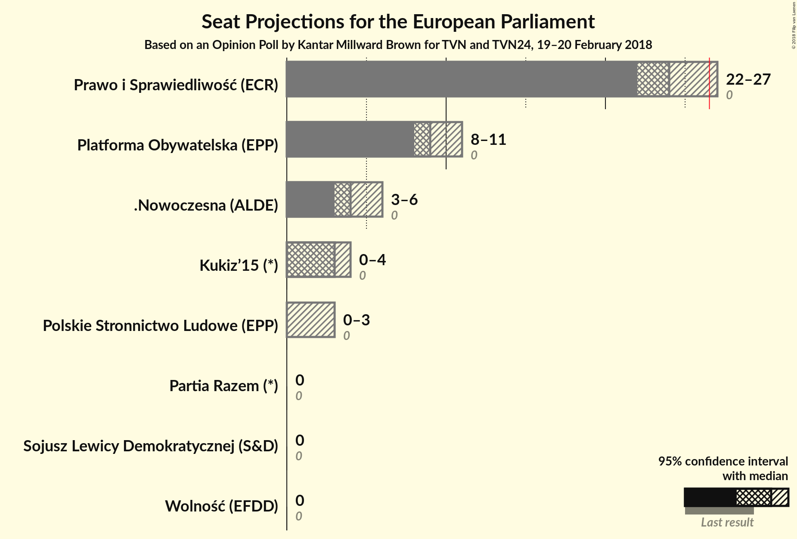
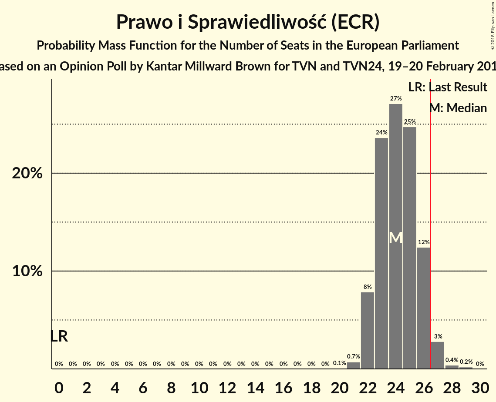
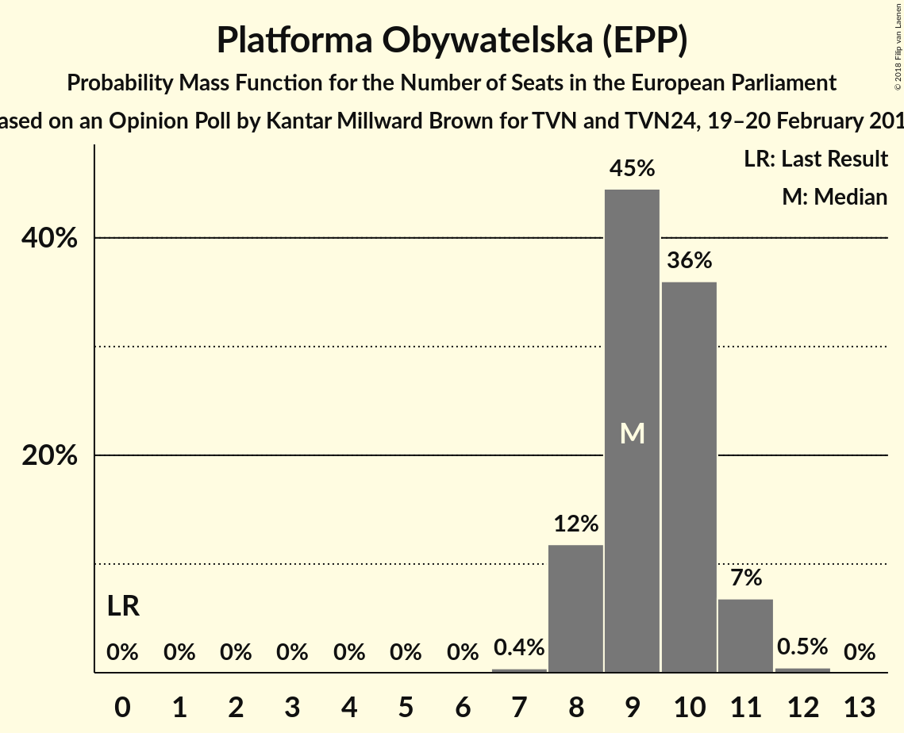
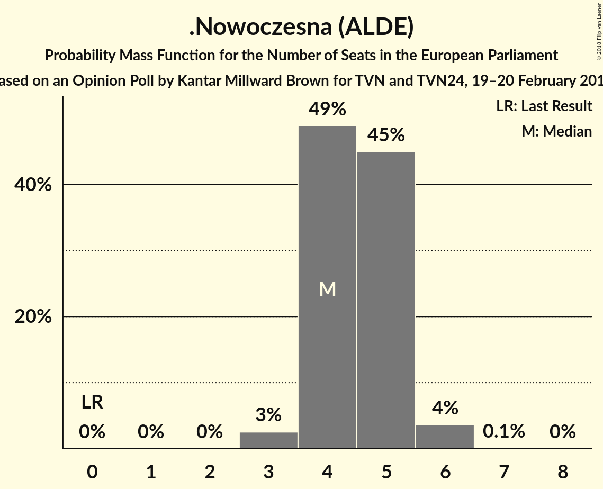
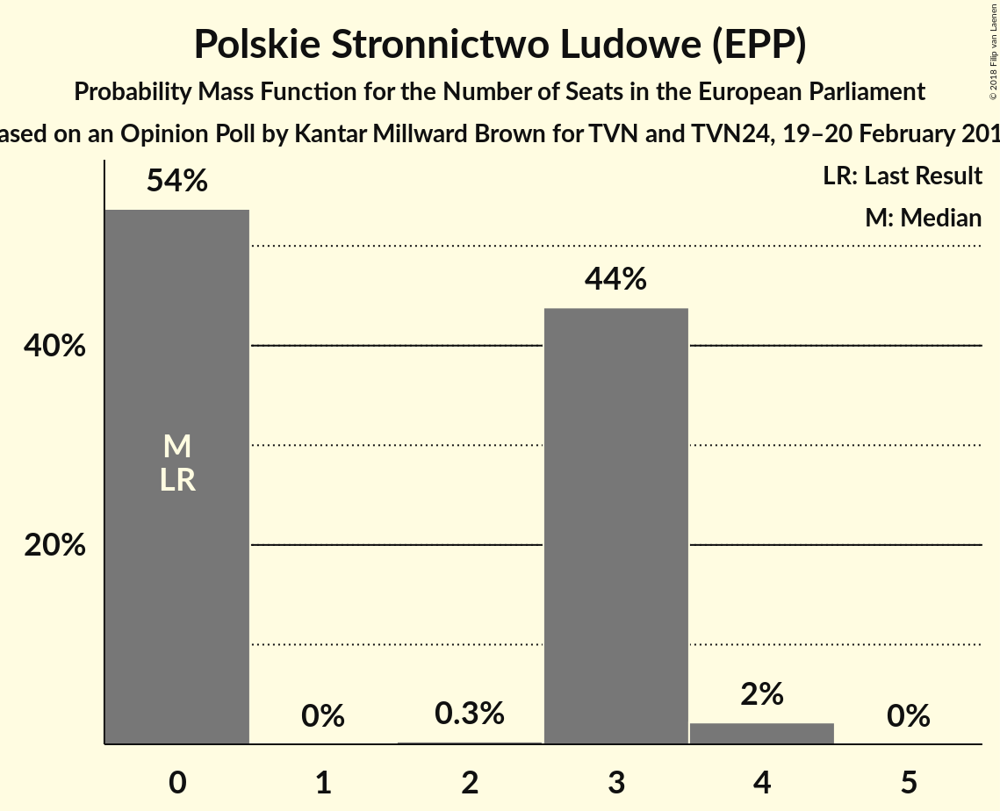
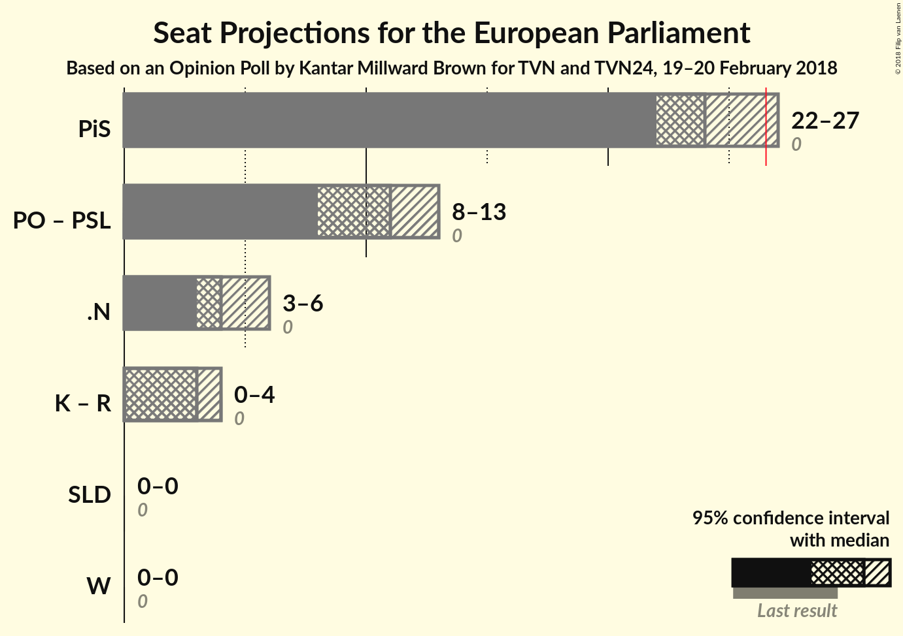

# Opinion Poll by Kantar Millward Brown for TVN and TVN24, 19–20 February 2018

<a href="#voting-intentions">Voting Intentions</a> | <a href="#seats">Seats</a> | <a href="#coalitions">Coalitions</a> | <a href="#technical-information">Technical Information</a>

## Voting Intentions

### Confidence Intervals

| Party | Last Result | Poll Result | 80% Confidence Interval | 90% Confidence Interval | 95% Confidence Interval | 99% Confidence Interval |
|:-----:|:-----------:|:-----------:|:-----------------------:|:-----------------------:|:-----------------------:|:-----------------------:|
| Prawo i Sprawiedliwość (ECR) | 0.0% | 40.0% | 38.1–42.0% |37.5–42.6% |37.0–43.1% |36.1–44.1% |
| Platforma Obywatelska (EPP) | 0.0% | 16.0% | 14.6–17.5% |14.2–18.0% |13.8–18.4% |13.2–19.1% |
| .Nowoczesna (ALDE) | 0.0% | 8.0% | 7.0–9.2% |6.7–9.5% |6.5–9.8% |6.0–10.4% |
| Kukiz’15 (*) | 0.0% | 6.0% | 5.1–7.1% |4.9–7.4% |4.7–7.6% |4.3–8.2% |
| Polskie Stronnictwo Ludowe (EPP) | 0.0% | 5.0% | 4.2–6.0% |4.0–6.3% |3.8–6.5% |3.5–7.0% |
| Sojusz Lewicy Demokratycznej (S&D) | 0.0% | 3.0% | 2.4–3.8% |2.2–4.0% |2.1–4.3% |1.8–4.7% |
| Wolność (EFDD) | 0.0% | 3.0% | 2.4–3.8% |2.2–4.0% |2.1–4.3% |1.8–4.7% |
| Partia Razem (*) | 0.0% | 3.0% | 2.4–3.8% |2.2–4.0% |2.1–4.3% |1.8–4.7% |

*Note:* The poll result column reflects the actual value used in the calculations. Published results may vary slightly, and in addition be rounded to fewer digits.

## Seats

### Confidence Intervals

| Party | Last Result | Median | 80% Confidence Interval | 90% Confidence Interval | 95% Confidence Interval | 99% Confidence Interval |
|:-----:|:-----------:|:------:|:-----------------------:|:-----------------------:|:-----------------------:|:-----------------------:|
| <a href="#prawo-i-sprawiedliwość-(ecr)">Prawo i Sprawiedliwość (ECR)</a> | 0 | 24 | 23–26 |22–26 |22–27 |21–28 |
| <a href="#platforma-obywatelska-(epp)">Platforma Obywatelska (EPP)</a> | 0 | 9 | 8–10 |8–11 |8–11 |8–11 |
| <a href="#.nowoczesna-(alde)">.Nowoczesna (ALDE)</a> | 0 | 4 | 4–5 |4–5 |3–6 |3–6 |
| <a href="#kukiz’15-(*)">Kukiz’15 (*)</a> | 0 | 3 | 3–4 |0–4 |0–4 |0–5 |
| <a href="#polskie-stronnictwo-ludowe-(epp)">Polskie Stronnictwo Ludowe (EPP)</a> | 0 | 0 | 0–3 |0–3 |0–3 |0–4 |
| <a href="#sojusz-lewicy-demokratycznej-(s&d)">Sojusz Lewicy Demokratycznej (S&D)</a> | 0 | 0 | 0 |0 |0 |0 |
| <a href="#wolność-(efdd)">Wolność (EFDD)</a> | 0 | 0 | 0 |0 |0 |0 |
| <a href="#partia-razem-(*)">Partia Razem (*)</a> | 0 | 0 | 0 |0 |0 |0 |

### Prawo i Sprawiedliwość (ECR)

*For a full overview of the results for this party, see the [Prawo i Sprawiedliwość (ECR)](party-prawoisprawiedliwośćecr.html) page.*

| Number of Seats | Probability | Accumulated | Special Marks |
|:---------------:|:-----------:|:-----------:|:-------------:|
| 0 | 0% | 100% | Last Result |
| 1 | 0% | 100% |  |
| 2 | 0% | 100% |  |
| 3 | 0% | 100% |  |
| 4 | 0% | 100% |  |
| 5 | 0% | 100% |  |
| 6 | 0% | 100% |  |
| 7 | 0% | 100% |  |
| 8 | 0% | 100% |  |
| 9 | 0% | 100% |  |
| 10 | 0% | 100% |  |
| 11 | 0% | 100% |  |
| 12 | 0% | 100% |  |
| 13 | 0% | 100% |  |
| 14 | 0% | 100% |  |
| 15 | 0% | 100% |  |
| 16 | 0% | 100% |  |
| 17 | 0% | 100% |  |
| 18 | 0% | 100% |  |
| 19 | 0% | 100% |  |
| 20 | 0.1% | 100% |  |
| 21 | 0.7% | 99.9% |  |
| 22 | 8% | 99.2% |  |
| 23 | 24% | 91% |  |
| 24 | 27% | 68% | Median |
| 25 | 25% | 41% |  |
| 26 | 12% | 16% |  |
| 27 | 3% | 3% | Majority |
| 28 | 0.4% | 0.6% |  |
| 29 | 0.2% | 0.2% |  |
| 30 | 0% | 0% |  |

### Platforma Obywatelska (EPP)

*For a full overview of the results for this party, see the [Platforma Obywatelska (EPP)](party-platformaobywatelskaepp.html) page.*

| Number of Seats | Probability | Accumulated | Special Marks |
|:---------------:|:-----------:|:-----------:|:-------------:|
| 0 | 0% | 100% | Last Result |
| 1 | 0% | 100% |  |
| 2 | 0% | 100% |  |
| 3 | 0% | 100% |  |
| 4 | 0% | 100% |  |
| 5 | 0% | 100% |  |
| 6 | 0% | 100% |  |
| 7 | 0.4% | 100% |  |
| 8 | 12% | 99.6% |  |
| 9 | 45% | 88% | Median |
| 10 | 36% | 43% |  |
| 11 | 7% | 7% |  |
| 12 | 0.5% | 0.5% |  |
| 13 | 0% | 0% |  |

### .Nowoczesna (ALDE)

*For a full overview of the results for this party, see the [.Nowoczesna (ALDE)](party-nowoczesnaalde.html) page.*

| Number of Seats | Probability | Accumulated | Special Marks |
|:---------------:|:-----------:|:-----------:|:-------------:|
| 0 | 0% | 100% | Last Result |
| 1 | 0% | 100% |  |
| 2 | 0% | 100% |  |
| 3 | 3% | 100% |  |
| 4 | 49% | 97% | Median |
| 5 | 45% | 49% |  |
| 6 | 4% | 4% |  |
| 7 | 0.1% | 0.1% |  |
| 8 | 0% | 0% |  |

### Kukiz’15 (*)

*For a full overview of the results for this party, see the [Kukiz’15 (*)](party-kukiz’15.html) page.*

| Number of Seats | Probability | Accumulated | Special Marks |
|:---------------:|:-----------:|:-----------:|:-------------:|
| 0 | 8% | 100% | Last Result |
| 1 | 0% | 92% |  |
| 2 | 0% | 92% |  |
| 3 | 64% | 92% | Median |
| 4 | 28% | 28% |  |
| 5 | 0.7% | 0.7% |  |
| 6 | 0% | 0% |  |

### Polskie Stronnictwo Ludowe (EPP)

*For a full overview of the results for this party, see the [Polskie Stronnictwo Ludowe (EPP)](party-polskiestronnictwoludoweepp.html) page.*

| Number of Seats | Probability | Accumulated | Special Marks |
|:---------------:|:-----------:|:-----------:|:-------------:|
| 0 | 54% | 100% | Last Result, Median |
| 1 | 0% | 46% |  |
| 2 | 0.3% | 46% |  |
| 3 | 44% | 46% |  |
| 4 | 2% | 2% |  |
| 5 | 0% | 0% |  |

### Sojusz Lewicy Demokratycznej (S&D)

*For a full overview of the results for this party, see the [Sojusz Lewicy Demokratycznej (S&D)](party-sojuszlewicydemokratycznejsd.html) page.*

| Number of Seats | Probability | Accumulated | Special Marks |
|:---------------:|:-----------:|:-----------:|:-------------:|
| 0 | 100% | 100% | Last Result, Median |

### Wolność (EFDD)

*For a full overview of the results for this party, see the [Wolność (EFDD)](party-wolnośćefdd.html) page.*

| Number of Seats | Probability | Accumulated | Special Marks |
|:---------------:|:-----------:|:-----------:|:-------------:|
| 0 | 99.8% | 100% | Last Result, Median |
| 1 | 0% | 0.2% |  |
| 2 | 0.1% | 0.2% |  |
| 3 | 0.2% | 0.2% |  |
| 4 | 0% | 0% |  |

### Partia Razem (*)

*For a full overview of the results for this party, see the [Partia Razem (*)](party-partiarazem.html) page.*

| Number of Seats | Probability | Accumulated | Special Marks |
|:---------------:|:-----------:|:-----------:|:-------------:|
| 0 | 99.9% | 100% | Last Result, Median |
| 1 | 0% | 0.1% |  |
| 2 | 0% | 0.1% |  |
| 3 | 0.1% | 0.1% |  |
| 4 | 0% | 0% |  |

## Coalitions

### Confidence Intervals

| Coalition | Last Result | Median | Majority? | 80% Confidence Interval | 90% Confidence Interval | 95% Confidence Interval | 99% Confidence Interval |
|:---------:|:-----------:|:------:|:---------:|:-----------------------:|:-----------------------:|:-----------------------:|:-----------------------:|
| Prawo i Sprawiedliwość (ECR) | 0 | 24 | 3% | 23–26 | 22–26 | 22–27 | 21–28 |
| Platforma Obywatelska (EPP) – Polskie Stronnictwo Ludowe (EPP) | 0 | 11 | 0% | 9–13 | 9–13 | 8–13 | 8–14 |
| .Nowoczesna (ALDE) | 0 | 4 | 0% | 4–5 | 4–5 | 3–6 | 3–6 |
| Kukiz’15 (*) – Partia Razem (*) | 0 | 3 | 0% | 3–4 | 0–4 | 0–4 | 0–5 |
| Sojusz Lewicy Demokratycznej (S&D) | 0 | 0 | 0% | 0 | 0 | 0 | 0 |
| Wolność (EFDD) | 0 | 0 | 0% | 0 | 0 | 0 | 0 |

### Prawo i Sprawiedliwość (ECR)

| Number of Seats | Probability | Accumulated | Special Marks |
|:---------------:|:-----------:|:-----------:|:-------------:|
| 0 | 0% | 100% | Last Result |
| 1 | 0% | 100% |  |
| 2 | 0% | 100% |  |
| 3 | 0% | 100% |  |
| 4 | 0% | 100% |  |
| 5 | 0% | 100% |  |
| 6 | 0% | 100% |  |
| 7 | 0% | 100% |  |
| 8 | 0% | 100% |  |
| 9 | 0% | 100% |  |
| 10 | 0% | 100% |  |
| 11 | 0% | 100% |  |
| 12 | 0% | 100% |  |
| 13 | 0% | 100% |  |
| 14 | 0% | 100% |  |
| 15 | 0% | 100% |  |
| 16 | 0% | 100% |  |
| 17 | 0% | 100% |  |
| 18 | 0% | 100% |  |
| 19 | 0% | 100% |  |
| 20 | 0.1% | 100% |  |
| 21 | 0.7% | 99.9% |  |
| 22 | 8% | 99.2% |  |
| 23 | 24% | 91% |  |
| 24 | 27% | 68% | Median |
| 25 | 25% | 41% |  |
| 26 | 12% | 16% |  |
| 27 | 3% | 3% | Majority |
| 28 | 0.4% | 0.6% |  |
| 29 | 0.2% | 0.2% |  |
| 30 | 0% | 0% |  |

### Platforma Obywatelska (EPP) – Polskie Stronnictwo Ludowe (EPP)

| Number of Seats | Probability | Accumulated | Special Marks |
|:---------------:|:-----------:|:-----------:|:-------------:|
| 0 | 0% | 100% | Last Result |
| 1 | 0% | 100% |  |
| 2 | 0% | 100% |  |
| 3 | 0% | 100% |  |
| 4 | 0% | 100% |  |
| 5 | 0% | 100% |  |
| 6 | 0% | 100% |  |
| 7 | 0% | 100% |  |
| 8 | 3% | 100% |  |
| 9 | 21% | 97% | Median |
| 10 | 25% | 77% |  |
| 11 | 14% | 52% |  |
| 12 | 24% | 38% |  |
| 13 | 12% | 14% |  |
| 14 | 2% | 2% |  |
| 15 | 0.1% | 0.1% |  |
| 16 | 0% | 0% |  |

### .Nowoczesna (ALDE)

| Number of Seats | Probability | Accumulated | Special Marks |
|:---------------:|:-----------:|:-----------:|:-------------:|
| 0 | 0% | 100% | Last Result |
| 1 | 0% | 100% |  |
| 2 | 0% | 100% |  |
| 3 | 3% | 100% |  |
| 4 | 49% | 97% | Median |
| 5 | 45% | 49% |  |
| 6 | 4% | 4% |  |
| 7 | 0.1% | 0.1% |  |
| 8 | 0% | 0% |  |

### Kukiz’15 (*) – Partia Razem (*)

| Number of Seats | Probability | Accumulated | Special Marks |
|:---------------:|:-----------:|:-----------:|:-------------:|
| 0 | 8% | 100% | Last Result |
| 1 | 0% | 92% |  |
| 2 | 0% | 92% |  |
| 3 | 64% | 92% | Median |
| 4 | 28% | 28% |  |
| 5 | 0.7% | 0.8% |  |
| 6 | 0.1% | 0.1% |  |
| 7 | 0% | 0% |  |

### Sojusz Lewicy Demokratycznej (S&D)

| Number of Seats | Probability | Accumulated | Special Marks |
|:---------------:|:-----------:|:-----------:|:-------------:|
| 0 | 100% | 100% | Last Result, Median |

### Wolność (EFDD)

| Number of Seats | Probability | Accumulated | Special Marks |
|:---------------:|:-----------:|:-----------:|:-------------:|
| 0 | 99.8% | 100% | Last Result, Median |
| 1 | 0% | 0.2% |  |
| 2 | 0.1% | 0.2% |  |
| 3 | 0.2% | 0.2% |  |
| 4 | 0% | 0% |  |

## Technical Information

### Opinion Poll

+ **Polling firm:** Kantar Millward Brown
+ **Commissioner(s):** TVN and TVN24
+ **Fieldwork period:** 19–20 February 2018

### Calculations

+ **Sample size:** 1002
+ **Simulations done:** 1,048,576
+ **Error estimate:** 1.46%

