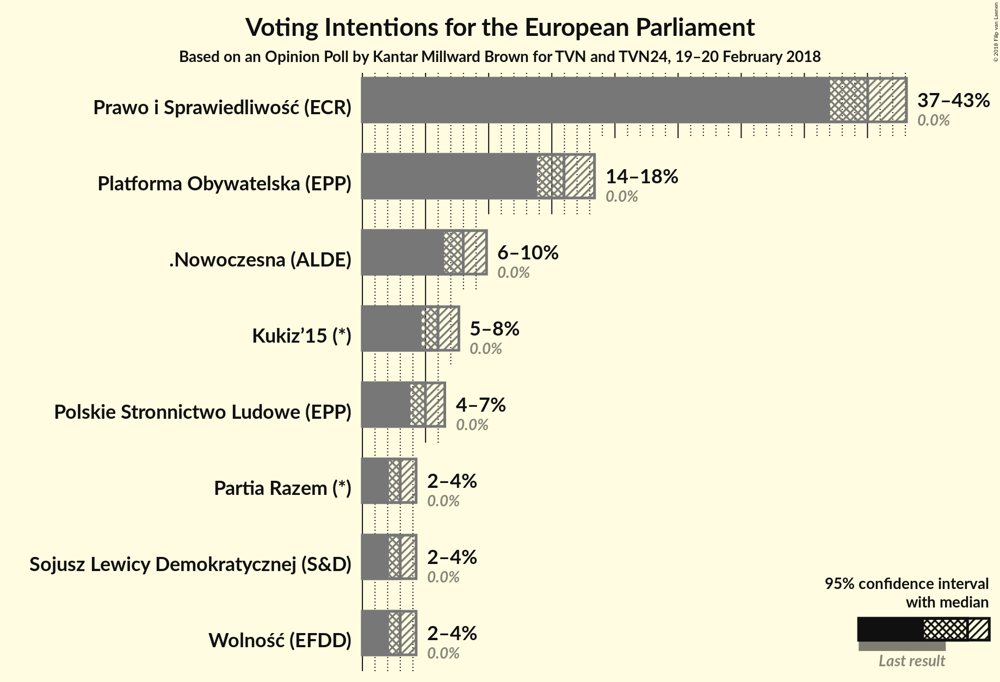

# Opinion Poll by Kantar Millward Brown for TVN and TVN24, 19–20 February 2018

<a href="#voting-intentions">Voting Intentions</a> | <a href="#seats">Seats</a> | <a href="#coalitions">Coalitions</a> | <a href="#technical-information">Technical Information</a>

## Voting Intentions

### Confidence Intervals

| Party | Last Result | Poll Result | 80% Confidence Interval | 90% Confidence Interval | 95% Confidence Interval | 99% Confidence Interval |
|:-----:|:-----------:|:-----------:|:-----------------------:|:-----------------------:|:-----------------------:|:-----------------------:|
| Prawo i Sprawiedliwość (ECR) | 0.0% | 40.0% | 38.1–42.0% |37.5–42.6% |37.0–43.1% |36.1–44.1% |
| Platforma Obywatelska (EPP) | 0.0% | 16.0% | 14.6–17.5% |14.2–18.0% |13.8–18.4% |13.2–19.1% |
| .Nowoczesna (ALDE) | 0.0% | 8.0% | 7.0–9.2% |6.7–9.5% |6.5–9.8% |6.0–10.4% |
| Kukiz’15 (*) | 0.0% | 6.0% | N/A |N/A |N/A |N/A |
| Polskie Stronnictwo Ludowe (EPP) | 0.0% | 5.0% | 4.2–6.0% |4.0–6.3% |3.8–6.5% |3.5–7.0% |
| Sojusz Lewicy Demokratycznej (S&D) | 0.0% | 3.0% | 2.4–3.8% |2.2–4.0% |2.1–4.3% |1.8–4.7% |
| Wolność (EFDD) | 0.0% | 3.0% | 2.4–3.8% |2.2–4.0% |2.1–4.3% |1.8–4.7% |
| Partia Razem (*) | 0.0% | 3.0% | N/A |N/A |N/A |N/A |

*Note:* The poll result column reflects the actual value used in the calculations. Published results may vary slightly, and in addition be rounded to fewer digits.

## Seats

### Confidence Intervals

| Party | Last Result | Median | 80% Confidence Interval | 90% Confidence Interval | 95% Confidence Interval | 99% Confidence Interval |
|:-----:|:-----------:|:------:|:-----------------------:|:-----------------------:|:-----------------------:|:-----------------------:|
| <a href="#prawo-i-sprawiedliwość-(ecr)">Prawo i Sprawiedliwość (ECR)</a> | 0 | 23 | 23–25 |23–25 |23–28 |23–28 |
| <a href="#platforma-obywatelska-(epp)">Platforma Obywatelska (EPP)</a> | 0 | 9 | 9 |9–10 |9–10 |8–10 |
| <a href="#.nowoczesna-(alde)">.Nowoczesna (ALDE)</a> | 0 | 5 | 4–6 |4–6 |4–6 |4–6 |
| <a href="#kukiz’15-(*)">Kukiz’15 (*)</a> | 0 | N/A | N/A |N/A |N/A |N/A |
| <a href="#polskie-stronnictwo-ludowe-(epp)">Polskie Stronnictwo Ludowe (EPP)</a> | 0 | 3 | 0–3 |0–3 |0–3 |0–3 |
| <a href="#sojusz-lewicy-demokratycznej-(s&d)">Sojusz Lewicy Demokratycznej (S&D)</a> | 0 | 0 | 0 |0 |0 |0 |
| <a href="#wolność-(efdd)">Wolność (EFDD)</a> | 0 | 0 | 0 |0 |0 |0 |
| <a href="#partia-razem-(*)">Partia Razem (*)</a> | 0 | N/A | N/A |N/A |N/A |N/A |

