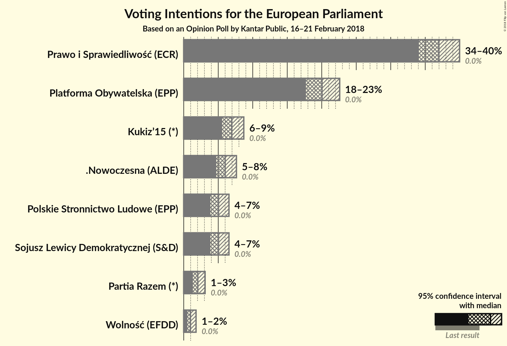
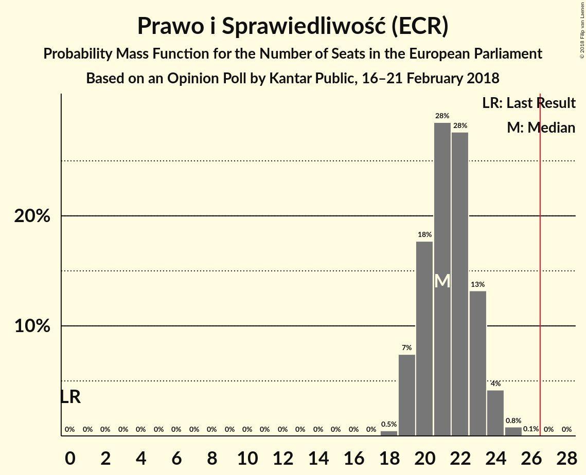
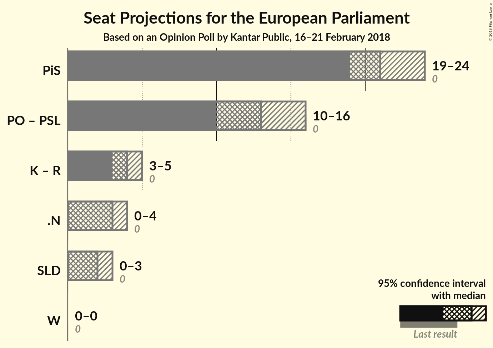

# Opinion Poll by Kantar Public, 16–21 February 2018

<a href="#voting-intentions">Voting Intentions</a> | <a href="#seats">Seats</a> | <a href="#coalitions">Coalitions</a> | <a href="#technical-information">Technical Information</a>

## Voting Intentions

### Confidence Intervals

| Party | Last Result | Poll Result | 80% Confidence Interval | 90% Confidence Interval | 95% Confidence Interval | 99% Confidence Interval |
|:-----:|:-----------:|:-----------:|:-----------------------:|:-----------------------:|:-----------------------:|:-----------------------:|
| Prawo i Sprawiedliwość (ECR) | 0.0% | 37.0% | 35.1–38.9% |34.5–39.5% |34.1–40.0% |33.2–40.9% |
| Platforma Obywatelska (EPP) | 0.0% | 20.0% | 18.5–21.7% |18.1–22.2% |17.7–22.6% |17.0–23.4% |
| Kukiz’15 (*) | 0.0% | 7.0% | 6.1–8.1% |5.8–8.4% |5.6–8.7% |5.2–9.3% |
| .Nowoczesna (ALDE) | 0.0% | 6.0% | 5.2–7.1% |4.9–7.4% |4.7–7.6% |4.3–8.2% |
| Polskie Stronnictwo Ludowe (EPP) | 0.0% | 5.0% | 4.3–6.0% |4.0–6.3% |3.9–6.6% |3.5–7.1% |
| Sojusz Lewicy Demokratycznej (S&D) | 0.0% | 5.0% | 4.3–6.0% |4.0–6.3% |3.9–6.6% |3.5–7.1% |
| Partia Razem (*) | 0.0% | 2.0% | 1.6–2.7% |1.4–2.9% |1.3–3.1% |1.1–3.5% |
| Wolność (EFDD) | 0.0% | 1.0% | 0.7–1.5% |0.6–1.6% |0.5–1.8% |0.4–2.1% |

*Note:* The poll result column reflects the actual value used in the calculations. Published results may vary slightly, and in addition be rounded to fewer digits.

## Seats

### Confidence Intervals

| Party | Last Result | Median | 80% Confidence Interval | 90% Confidence Interval | 95% Confidence Interval | 99% Confidence Interval |
|:-----:|:-----------:|:------:|:-----------------------:|:-----------------------:|:-----------------------:|:-----------------------:|
| <a href="#prawo-i-sprawiedliwość-(ecr)">Prawo i Sprawiedliwość (ECR)</a> | 0 | 21 | 20–23 |20–24 |20–24 |19–25 |
| <a href="#platforma-obywatelska-(epp)">Platforma Obywatelska (EPP)</a> | 0 | 11 | 11–13 |10–13 |10–13 |9–14 |
| <a href="#kukiz’15-(*)">Kukiz’15 (*)</a> | 0 | 3 | 3–4 |3–5 |3–5 |3–5 |
| <a href="#.nowoczesna-(alde)">.Nowoczesna (ALDE)</a> | 0 | 3 | 2–4 |0–4 |0–4 |0–4 |
| <a href="#polskie-stronnictwo-ludowe-(epp)">Polskie Stronnictwo Ludowe (EPP)</a> | 0 | 2 | 0–3 |0–3 |0–3 |0–4 |
| <a href="#sojusz-lewicy-demokratycznej-(s&d)">Sojusz Lewicy Demokratycznej (S&D)</a> | 0 | 3 | 0–3 |0–3 |0–3 |0–4 |
| <a href="#partia-razem-(*)">Partia Razem (*)</a> | 0 | 0 | 0 |0 |0 |0 |
| <a href="#wolność-(efdd)">Wolność (EFDD)</a> | 0 | 0 | 0 |0 |0 |0 |

### Prawo i Sprawiedliwość (ECR)

*For a full overview of the results for this party, see the [Prawo i Sprawiedliwość (ECR)](party-prawoisprawiedliwośćecr.html) page.*

| Number of Seats | Probability | Accumulated | Special Marks |
|:---------------:|:-----------:|:-----------:|:-------------:|
| 0 | 0% | 100% | Last Result |
| 1 | 0% | 100% |  |
| 2 | 0% | 100% |  |
| 3 | 0% | 100% |  |
| 4 | 0% | 100% |  |
| 5 | 0% | 100% |  |
| 6 | 0% | 100% |  |
| 7 | 0% | 100% |  |
| 8 | 0% | 100% |  |
| 9 | 0% | 100% |  |
| 10 | 0% | 100% |  |
| 11 | 0% | 100% |  |
| 12 | 0% | 100% |  |
| 13 | 0% | 100% |  |
| 14 | 0% | 100% |  |
| 15 | 0% | 100% |  |
| 16 | 0% | 100% |  |
| 17 | 0% | 100% |  |
| 18 | 0.4% | 100% |  |
| 19 | 2% | 99.6% |  |
| 20 | 34% | 98% |  |
| 21 | 34% | 64% | Median |
| 22 | 7% | 29% |  |
| 23 | 16% | 22% |  |
| 24 | 5% | 6% |  |
| 25 | 0.5% | 0.6% |  |
| 26 | 0.1% | 0.1% |  |
| 27 | 0% | 0% | Majority |

### Platforma Obywatelska (EPP)

*For a full overview of the results for this party, see the [Platforma Obywatelska (EPP)](party-platformaobywatelskaepp.html) page.*

| Number of Seats | Probability | Accumulated | Special Marks |
|:---------------:|:-----------:|:-----------:|:-------------:|
| 0 | 0% | 100% | Last Result |
| 1 | 0% | 100% |  |
| 2 | 0% | 100% |  |
| 3 | 0% | 100% |  |
| 4 | 0% | 100% |  |
| 5 | 0% | 100% |  |
| 6 | 0% | 100% |  |
| 7 | 0% | 100% |  |
| 8 | 0% | 100% |  |
| 9 | 0.6% | 100% |  |
| 10 | 9% | 99.4% |  |
| 11 | 55% | 91% | Median |
| 12 | 21% | 35% |  |
| 13 | 12% | 14% |  |
| 14 | 2% | 2% |  |
| 15 | 0% | 0% |  |

### Kukiz’15 (*)

*For a full overview of the results for this party, see the [Kukiz’15 (*)](party-kukiz’15.html) page.*

| Number of Seats | Probability | Accumulated | Special Marks |
|:---------------:|:-----------:|:-----------:|:-------------:|
| 0 | 0.3% | 100% | Last Result |
| 1 | 0% | 99.7% |  |
| 2 | 0.1% | 99.7% |  |
| 3 | 53% | 99.6% | Median |
| 4 | 40% | 47% |  |
| 5 | 7% | 7% |  |
| 6 | 0.1% | 0.1% |  |
| 7 | 0% | 0% |  |

### .Nowoczesna (ALDE)

*For a full overview of the results for this party, see the [.Nowoczesna (ALDE)](party-nowoczesnaalde.html) page.*

| Number of Seats | Probability | Accumulated | Special Marks |
|:---------------:|:-----------:|:-----------:|:-------------:|
| 0 | 8% | 100% | Last Result |
| 1 | 0% | 92% |  |
| 2 | 6% | 92% |  |
| 3 | 67% | 86% | Median |
| 4 | 18% | 18% |  |
| 5 | 0.2% | 0.2% |  |
| 6 | 0% | 0% |  |

### Polskie Stronnictwo Ludowe (EPP)

*For a full overview of the results for this party, see the [Polskie Stronnictwo Ludowe (EPP)](party-polskiestronnictwoludoweepp.html) page.*

| Number of Seats | Probability | Accumulated | Special Marks |
|:---------------:|:-----------:|:-----------:|:-------------:|
| 0 | 41% | 100% | Last Result |
| 1 | 0% | 59% |  |
| 2 | 11% | 59% | Median |
| 3 | 47% | 48% |  |
| 4 | 1.0% | 1.0% |  |
| 5 | 0% | 0% |  |

### Sojusz Lewicy Demokratycznej (S&D)

*For a full overview of the results for this party, see the [Sojusz Lewicy Demokratycznej (S&D)](party-sojuszlewicydemokratycznejsd.html) page.*

| Number of Seats | Probability | Accumulated | Special Marks |
|:---------------:|:-----------:|:-----------:|:-------------:|
| 0 | 41% | 100% | Last Result |
| 1 | 0% | 59% |  |
| 2 | 1.3% | 59% |  |
| 3 | 57% | 58% | Median |
| 4 | 0.9% | 0.9% |  |
| 5 | 0% | 0% |  |

### Partia Razem (*)

*For a full overview of the results for this party, see the [Partia Razem (*)](party-partiarazem.html) page.*

| Number of Seats | Probability | Accumulated | Special Marks |
|:---------------:|:-----------:|:-----------:|:-------------:|
| 0 | 100% | 100% | Last Result, Median |

### Wolność (EFDD)

*For a full overview of the results for this party, see the [Wolność (EFDD)](party-wolnośćefdd.html) page.*

| Number of Seats | Probability | Accumulated | Special Marks |
|:---------------:|:-----------:|:-----------:|:-------------:|
| 0 | 100% | 100% | Last Result, Median |

## Coalitions

### Confidence Intervals

| Coalition | Last Result | Median | Majority? | 80% Confidence Interval | 90% Confidence Interval | 95% Confidence Interval | 99% Confidence Interval |
|:---------:|:-----------:|:------:|:---------:|:-----------------------:|:-----------------------:|:-----------------------:|:-----------------------:|
| Prawo i Sprawiedliwość (ECR) | 0 | 21 | 0% | 20–23 | 20–24 | 20–24 | 19–25 |
| Platforma Obywatelska (EPP) – Polskie Stronnictwo Ludowe (EPP) | 0 | 13 | 0% | 11–15 | 11–16 | 11–16 | 10–16 |
| Kukiz’15 (*) – Partia Razem (*) | 0 | 3 | 0% | 3–4 | 3–5 | 3–5 | 3–5 |
| .Nowoczesna (ALDE) | 0 | 3 | 0% | 2–4 | 0–4 | 0–4 | 0–4 |
| Sojusz Lewicy Demokratycznej (S&D) | 0 | 3 | 0% | 0–3 | 0–3 | 0–3 | 0–4 |
| Wolność (EFDD) | 0 | 0 | 0% | 0 | 0 | 0 | 0 |

### Prawo i Sprawiedliwość (ECR)

| Number of Seats | Probability | Accumulated | Special Marks |
|:---------------:|:-----------:|:-----------:|:-------------:|
| 0 | 0% | 100% | Last Result |
| 1 | 0% | 100% |  |
| 2 | 0% | 100% |  |
| 3 | 0% | 100% |  |
| 4 | 0% | 100% |  |
| 5 | 0% | 100% |  |
| 6 | 0% | 100% |  |
| 7 | 0% | 100% |  |
| 8 | 0% | 100% |  |
| 9 | 0% | 100% |  |
| 10 | 0% | 100% |  |
| 11 | 0% | 100% |  |
| 12 | 0% | 100% |  |
| 13 | 0% | 100% |  |
| 14 | 0% | 100% |  |
| 15 | 0% | 100% |  |
| 16 | 0% | 100% |  |
| 17 | 0% | 100% |  |
| 18 | 0.4% | 100% |  |
| 19 | 2% | 99.6% |  |
| 20 | 34% | 98% |  |
| 21 | 34% | 64% | Median |
| 22 | 7% | 29% |  |
| 23 | 16% | 22% |  |
| 24 | 5% | 6% |  |
| 25 | 0.5% | 0.6% |  |
| 26 | 0.1% | 0.1% |  |
| 27 | 0% | 0% | Majority |

### Platforma Obywatelska (EPP) – Polskie Stronnictwo Ludowe (EPP)

| Number of Seats | Probability | Accumulated | Special Marks |
|:---------------:|:-----------:|:-----------:|:-------------:|
| 0 | 0% | 100% | Last Result |
| 1 | 0% | 100% |  |
| 2 | 0% | 100% |  |
| 3 | 0% | 100% |  |
| 4 | 0% | 100% |  |
| 5 | 0% | 100% |  |
| 6 | 0% | 100% |  |
| 7 | 0% | 100% |  |
| 8 | 0% | 100% |  |
| 9 | 0.3% | 100% |  |
| 10 | 1.4% | 99.7% |  |
| 11 | 18% | 98% |  |
| 12 | 14% | 80% |  |
| 13 | 23% | 66% | Median |
| 14 | 29% | 43% |  |
| 15 | 8% | 14% |  |
| 16 | 6% | 6% |  |
| 17 | 0.3% | 0.3% |  |
| 18 | 0% | 0% |  |

### Kukiz’15 (*) – Partia Razem (*)

| Number of Seats | Probability | Accumulated | Special Marks |
|:---------------:|:-----------:|:-----------:|:-------------:|
| 0 | 0.3% | 100% | Last Result |
| 1 | 0% | 99.7% |  |
| 2 | 0.1% | 99.7% |  |
| 3 | 53% | 99.6% | Median |
| 4 | 40% | 47% |  |
| 5 | 7% | 7% |  |
| 6 | 0.1% | 0.1% |  |
| 7 | 0% | 0% |  |

### .Nowoczesna (ALDE)

| Number of Seats | Probability | Accumulated | Special Marks |
|:---------------:|:-----------:|:-----------:|:-------------:|
| 0 | 8% | 100% | Last Result |
| 1 | 0% | 92% |  |
| 2 | 6% | 92% |  |
| 3 | 67% | 86% | Median |
| 4 | 18% | 18% |  |
| 5 | 0.2% | 0.2% |  |
| 6 | 0% | 0% |  |

### Sojusz Lewicy Demokratycznej (S&D)

| Number of Seats | Probability | Accumulated | Special Marks |
|:---------------:|:-----------:|:-----------:|:-------------:|
| 0 | 41% | 100% | Last Result |
| 1 | 0% | 59% |  |
| 2 | 1.3% | 59% |  |
| 3 | 57% | 58% | Median |
| 4 | 0.9% | 0.9% |  |
| 5 | 0% | 0% |  |

### Wolność (EFDD)

| Number of Seats | Probability | Accumulated | Special Marks |
|:---------------:|:-----------:|:-----------:|:-------------:|
| 0 | 100% | 100% | Last Result, Median |

## Technical Information

### Opinion Poll

+ **Polling firm:** Kantar Public
+ **Commissioner(s):** —
+ **Fieldwork period:** 16–21 February 2018

### Calculations

+ **Sample size:** 1033
+ **Simulations done:** 131,072
+ **Error estimate:** 2.36%

