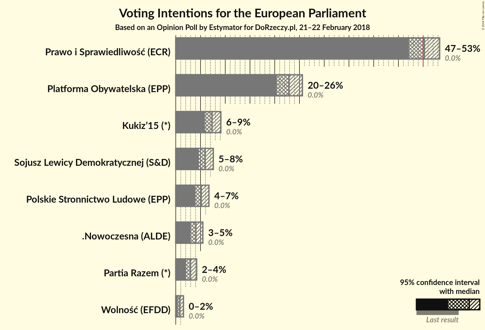

# Opinion Poll by Estymator for DoRzeczy.pl, 21–22 February 2018

<a href="#voting-intentions">Voting Intentions</a> | <a href="#seats">Seats</a> | <a href="#coalitions">Coalitions</a> | <a href="#technical-information">Technical Information</a>

## Voting Intentions

### Confidence Intervals

| Party | Last Result | Poll Result | 80% Confidence Interval | 90% Confidence Interval | 95% Confidence Interval | 99% Confidence Interval |
|:-----:|:-----------:|:-----------:|:-----------------------:|:-----------------------:|:-----------------------:|:-----------------------:|
| Prawo i Sprawiedliwość (ECR) | 0.0% | 50.2% | 48.2–52.3% |47.7–52.8% |47.2–53.3% |46.2–54.3% |
| Platforma Obywatelska (EPP) | 0.0% | 22.9% | 21.3–24.7% |20.8–25.2% |20.4–25.6% |19.6–26.5% |
| Kukiz’15 (*) | 0.0% | 7.3% | N/A |N/A |N/A |N/A |
| Sojusz Lewicy Demokratycznej (S&D) | 0.0% | 5.9% | 5.1–7.0% |4.8–7.3% |4.6–7.6% |4.3–8.1% |
| Polskie Stronnictwo Ludowe (EPP) | 0.0% | 5.2% | 4.4–6.2% |4.1–6.4% |3.9–6.7% |3.6–7.2% |
| .Nowoczesna (ALDE) | 0.0% | 4.1% | 3.4–5.0% |3.2–5.2% |3.0–5.5% |2.7–5.9% |
| Partia Razem (*) | 0.0% | 3.0% | N/A |N/A |N/A |N/A |
| Wolność (EFDD) | 0.0% | 0.8% | 0.5–1.3% |0.5–1.4% |0.4–1.6% |0.3–1.8% |

*Note:* The poll result column reflects the actual value used in the calculations. Published results may vary slightly, and in addition be rounded to fewer digits.

## Seats

### Confidence Intervals

| Party | Last Result | Median | 80% Confidence Interval | 90% Confidence Interval | 95% Confidence Interval | 99% Confidence Interval |
|:-----:|:-----------:|:------:|:-----------------------:|:-----------------------:|:-----------------------:|:-----------------------:|
| <a href="#prawo-i-sprawiedliwość-(ecr)">Prawo i Sprawiedliwość (ECR)</a> | 0 | 30 | 28–31 |28–32 |27–33 |27–34 |
| <a href="#platforma-obywatelska-(epp)">Platforma Obywatelska (EPP)</a> | 0 | 13 | 12–14 |12–15 |12–15 |11–16 |
| <a href="#kukiz’15-(*)">Kukiz’15 (*)</a> | 0 | N/A | N/A |N/A |N/A |N/A |
| <a href="#sojusz-lewicy-demokratycznej-(s&d)">Sojusz Lewicy Demokratycznej (S&D)</a> | 0 | 3 | 3–4 |0–4 |0–4 |0–4 |
| <a href="#polskie-stronnictwo-ludowe-(epp)">Polskie Stronnictwo Ludowe (EPP)</a> | 0 | 3 | 0–3 |0–3 |0–4 |0–4 |
| <a href="#.nowoczesna-(alde)">.Nowoczesna (ALDE)</a> | 0 | 0 | 0–2 |0–3 |0–3 |0–3 |
| <a href="#partia-razem-(*)">Partia Razem (*)</a> | 0 | N/A | N/A |N/A |N/A |N/A |
| <a href="#wolność-(efdd)">Wolność (EFDD)</a> | 0 | 0 | 0 |0 |0 |0 |

