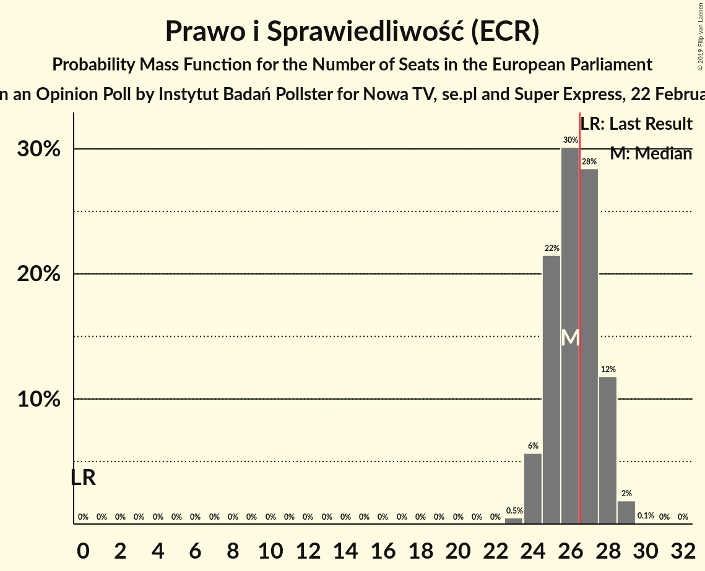
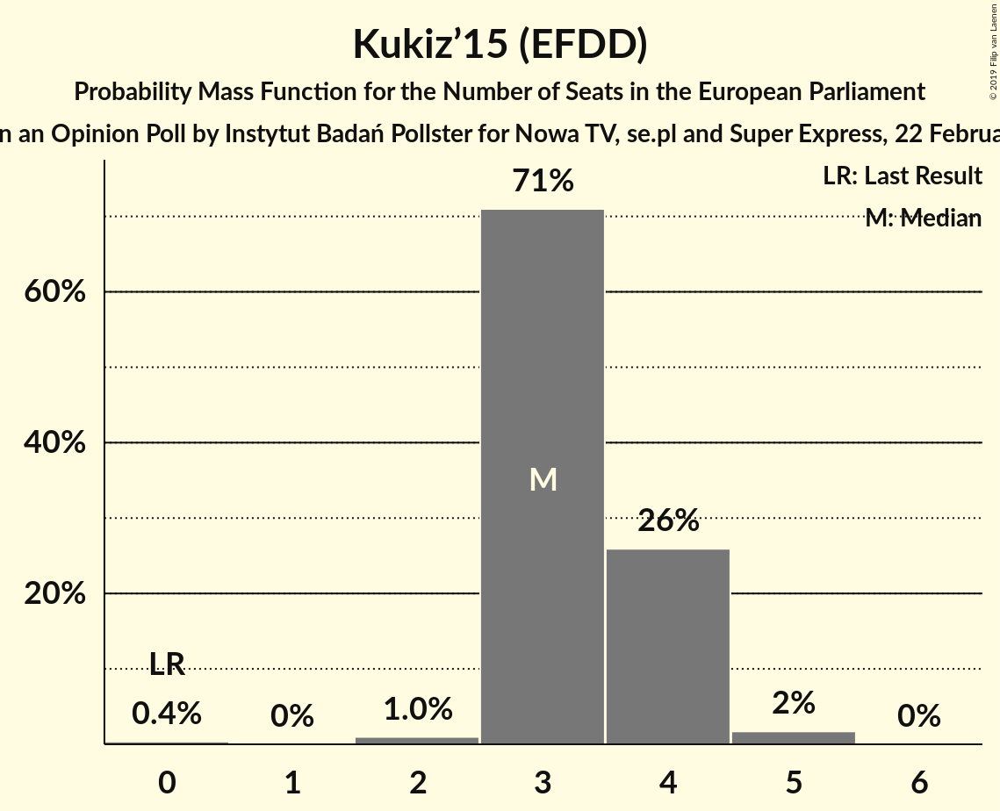
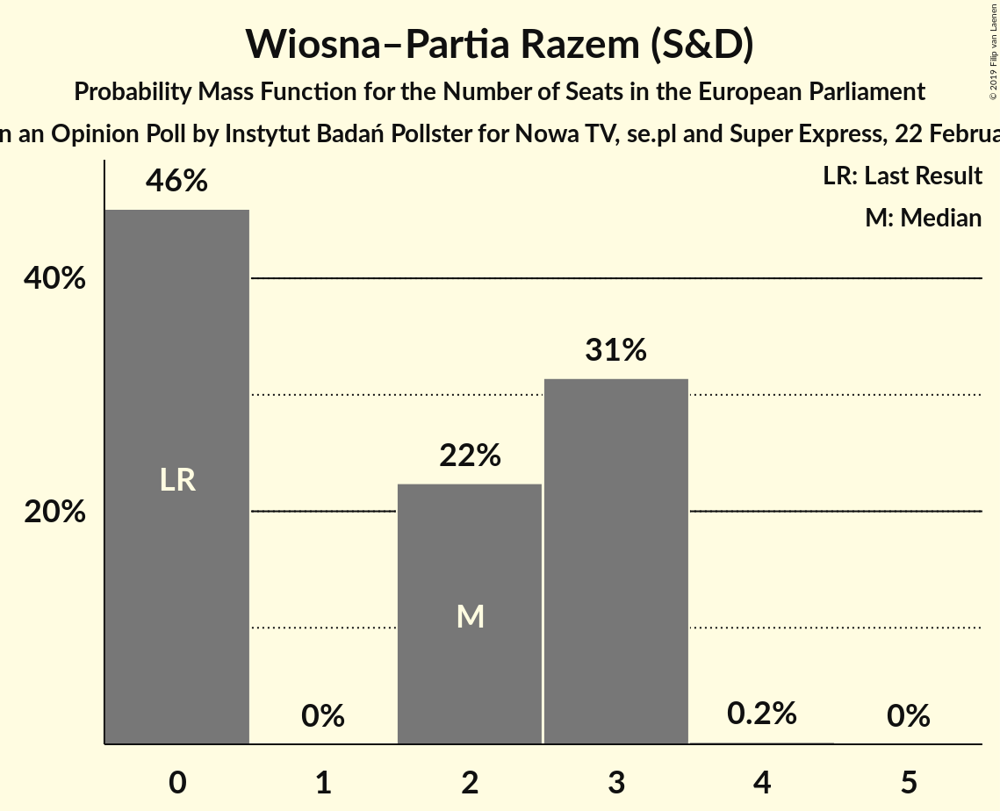
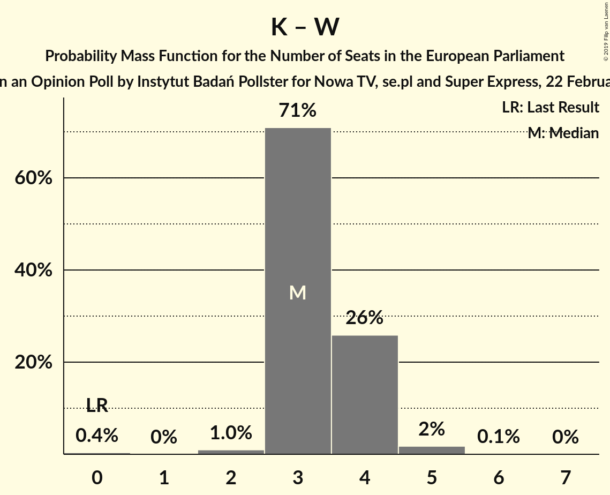
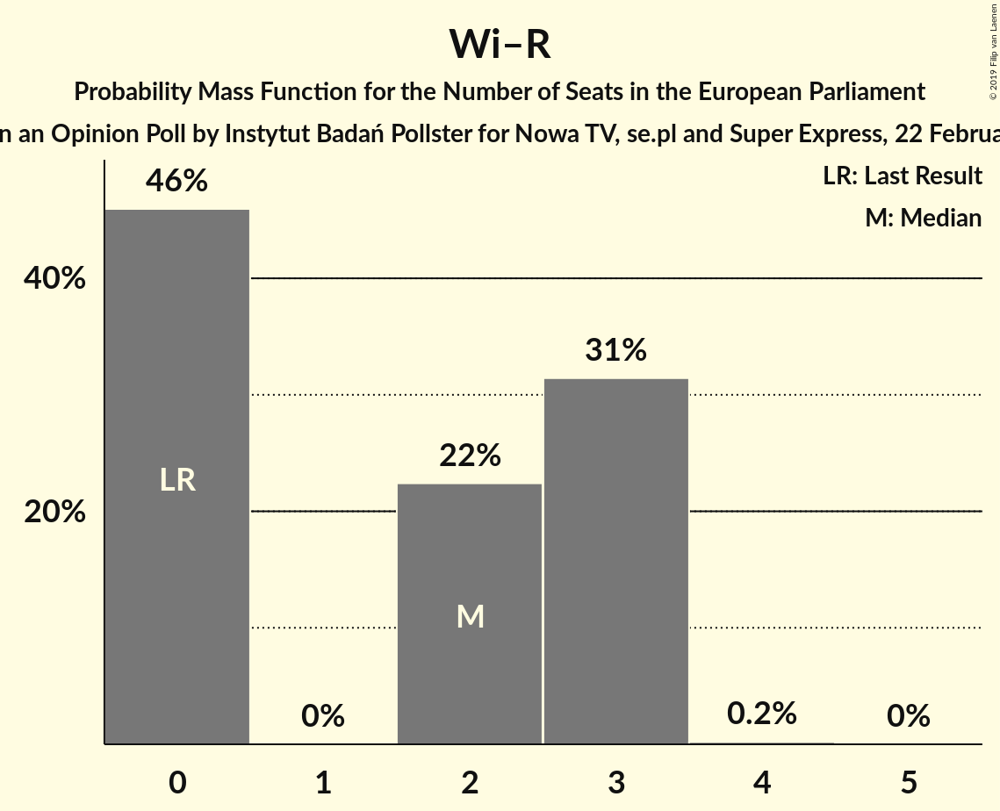

# Opinion Poll by Instytut Badań Pollster for Nowa TV, se.pl and Super Express, 22 February 2018

<a href="#voting-intentions">Voting Intentions</a> | <a href="#seats">Seats</a> | <a href="#coalitions">Coalitions</a> | <a href="#technical-information">Technical Information</a>

## Voting Intentions

### Confidence Intervals

| Party | Last Result | Poll Result | 80% Confidence Interval | 90% Confidence Interval | 95% Confidence Interval | 99% Confidence Interval |
|:-----:|:-----------:|:-----------:|:-----------------------:|:-----------------------:|:-----------------------:|:-----------------------:|
| Prawo i Sprawiedliwość (ECR) | 0.0% | 46.9% | 44.9–48.9% |44.4–49.5% |43.9–50.0% |42.9–51.0% |
| Koalicja Europejska (EPP) | 0.0% | 37.9% | 36.0–39.9% |35.5–40.5% |35.0–41.0% |34.1–41.9% |
| Kukiz’15 (EFDD) | 0.0% | 6.9% | 6.0–8.1% |5.8–8.4% |5.5–8.7% |5.1–9.2% |
| Wiosna–Partia Razem (S&D) | 0.0% | 5.0% | 4.2–6.0% |4.0–6.2% |3.8–6.5% |3.5–7.0% |
| KORWiN (EFDD) | 0.0% | 3.0% | 2.4–3.8% |2.3–4.1% |2.1–4.3% |1.9–4.7% |

*Note:* The poll result column reflects the actual value used in the calculations. Published results may vary slightly, and in addition be rounded to fewer digits.

## Seats

### Confidence Intervals

| Party | Last Result | Median | 80% Confidence Interval | 90% Confidence Interval | 95% Confidence Interval | 99% Confidence Interval |
|:-----:|:-----------:|:------:|:-----------------------:|:-----------------------:|:-----------------------:|:-----------------------:|
| <a href="#prawo-i-sprawiedliwość-(ecr)">Prawo i Sprawiedliwość (ECR)</a> | 0 | 26 | 25–28 |24–28 |24–28 |23–29 |
| <a href="#koalicja-europejska-(epp)">Koalicja Europejska (EPP)</a> | 0 | 21 | 20–22 |19–23 |19–23 |19–24 |
| <a href="#kukiz’15-(efdd)">Kukiz’15 (EFDD)</a> | 0 | 3 | 3–4 |3–4 |3–4 |2–5 |
| <a href="#wiosna–partia-razem-(s&d)">Wiosna–Partia Razem (S&D)</a> | 0 | 2 | 0–3 |0–3 |0–3 |0–3 |
| <a href="#korwin-(efdd)">KORWiN (EFDD)</a> | 0 | 0 | 0 |0 |0 |0 |

### Prawo i Sprawiedliwość (ECR)

*For a full overview of the results for this party, see the [Prawo i Sprawiedliwość (ECR)](party-prawoisprawiedliwośćecr.html) page.*

| Number of Seats | Probability | Accumulated | Special Marks |
|:---------------:|:-----------:|:-----------:|:-------------:|
| 0 | 0% | 100% | Last Result |
| 1 | 0% | 100% |  |
| 2 | 0% | 100% |  |
| 3 | 0% | 100% |  |
| 4 | 0% | 100% |  |
| 5 | 0% | 100% |  |
| 6 | 0% | 100% |  |
| 7 | 0% | 100% |  |
| 8 | 0% | 100% |  |
| 9 | 0% | 100% |  |
| 10 | 0% | 100% |  |
| 11 | 0% | 100% |  |
| 12 | 0% | 100% |  |
| 13 | 0% | 100% |  |
| 14 | 0% | 100% |  |
| 15 | 0% | 100% |  |
| 16 | 0% | 100% |  |
| 17 | 0% | 100% |  |
| 18 | 0% | 100% |  |
| 19 | 0% | 100% |  |
| 20 | 0% | 100% |  |
| 21 | 0% | 100% |  |
| 22 | 0% | 100% |  |
| 23 | 0.5% | 100% |  |
| 24 | 6% | 99.5% |  |
| 25 | 22% | 94% |  |
| 26 | 30% | 72% | Median |
| 27 | 28% | 42% | Majority |
| 28 | 12% | 14% |  |
| 29 | 2% | 2% |  |
| 30 | 0.1% | 0.1% |  |
| 31 | 0% | 0% |  |

### Koalicja Europejska (EPP)

*For a full overview of the results for this party, see the [Koalicja Europejska (EPP)](party-koalicjaeuropejskaepp.html) page.*

| Number of Seats | Probability | Accumulated | Special Marks |
|:---------------:|:-----------:|:-----------:|:-------------:|
| 0 | 0% | 100% | Last Result |
| 1 | 0% | 100% |  |
| 2 | 0% | 100% |  |
| 3 | 0% | 100% |  |
| 4 | 0% | 100% |  |
| 5 | 0% | 100% |  |
| 6 | 0% | 100% |  |
| 7 | 0% | 100% |  |
| 8 | 0% | 100% |  |
| 9 | 0% | 100% |  |
| 10 | 0% | 100% |  |
| 11 | 0% | 100% |  |
| 12 | 0% | 100% |  |
| 13 | 0% | 100% |  |
| 14 | 0% | 100% |  |
| 15 | 0% | 100% |  |
| 16 | 0% | 100% |  |
| 17 | 0% | 100% |  |
| 18 | 0.4% | 100% |  |
| 19 | 6% | 99.5% |  |
| 20 | 23% | 94% |  |
| 21 | 35% | 71% | Median |
| 22 | 28% | 36% |  |
| 23 | 7% | 8% |  |
| 24 | 0.6% | 0.7% |  |
| 25 | 0% | 0% |  |

### Kukiz’15 (EFDD)

*For a full overview of the results for this party, see the [Kukiz’15 (EFDD)](party-kukiz’15efdd.html) page.*

| Number of Seats | Probability | Accumulated | Special Marks |
|:---------------:|:-----------:|:-----------:|:-------------:|
| 0 | 0.4% | 100% | Last Result |
| 1 | 0% | 99.6% |  |
| 2 | 1.0% | 99.6% |  |
| 3 | 71% | 98.7% | Median |
| 4 | 26% | 28% |  |
| 5 | 2% | 2% |  |
| 6 | 0% | 0% |  |

### Wiosna–Partia Razem (S&D)

*For a full overview of the results for this party, see the [Wiosna–Partia Razem (S&D)](party-wiosna–partiarazemsd.html) page.*

| Number of Seats | Probability | Accumulated | Special Marks |
|:---------------:|:-----------:|:-----------:|:-------------:|
| 0 | 46% | 100% | Last Result |
| 1 | 0% | 54% |  |
| 2 | 22% | 54% | Median |
| 3 | 31% | 32% |  |
| 4 | 0.2% | 0.2% |  |
| 5 | 0% | 0% |  |

### KORWiN (EFDD)

*For a full overview of the results for this party, see the [KORWiN (EFDD)](party-korwinefdd.html) page.*

| Number of Seats | Probability | Accumulated | Special Marks |
|:---------------:|:-----------:|:-----------:|:-------------:|
| 0 | 99.9% | 100% | Last Result, Median |
| 1 | 0% | 0.1% |  |
| 2 | 0.1% | 0.1% |  |
| 3 | 0% | 0% |  |

## Coalitions

### Confidence Intervals

| Coalition | Last Result | Median | Majority? | 80% Confidence Interval | 90% Confidence Interval | 95% Confidence Interval | 99% Confidence Interval |
|:---------:|:-----------:|:------:|:---------:|:-----------------------:|:-----------------------:|:-----------------------:|:-----------------------:|
| Prawo i Sprawiedliwość (ECR) | 0 | 26 | 42% | 25–28 | 24–28 | 24–28 | 23–29 |
| Koalicja Europejska (EPP) | 0 | 21 | 0% | 20–22 | 19–23 | 19–23 | 19–24 |
| Kukiz’15 (EFDD) – KORWiN (EFDD) | 0 | 3 | 0% | 3–4 | 3–4 | 3–4 | 2–5 |
| Wiosna–Partia Razem (S&D) | 0 | 2 | 0% | 0–3 | 0–3 | 0–3 | 0–3 |

### Prawo i Sprawiedliwość (ECR)

| Number of Seats | Probability | Accumulated | Special Marks |
|:---------------:|:-----------:|:-----------:|:-------------:|
| 0 | 0% | 100% | Last Result |
| 1 | 0% | 100% |  |
| 2 | 0% | 100% |  |
| 3 | 0% | 100% |  |
| 4 | 0% | 100% |  |
| 5 | 0% | 100% |  |
| 6 | 0% | 100% |  |
| 7 | 0% | 100% |  |
| 8 | 0% | 100% |  |
| 9 | 0% | 100% |  |
| 10 | 0% | 100% |  |
| 11 | 0% | 100% |  |
| 12 | 0% | 100% |  |
| 13 | 0% | 100% |  |
| 14 | 0% | 100% |  |
| 15 | 0% | 100% |  |
| 16 | 0% | 100% |  |
| 17 | 0% | 100% |  |
| 18 | 0% | 100% |  |
| 19 | 0% | 100% |  |
| 20 | 0% | 100% |  |
| 21 | 0% | 100% |  |
| 22 | 0% | 100% |  |
| 23 | 0.5% | 100% |  |
| 24 | 6% | 99.5% |  |
| 25 | 22% | 94% |  |
| 26 | 30% | 72% | Median |
| 27 | 28% | 42% | Majority |
| 28 | 12% | 14% |  |
| 29 | 2% | 2% |  |
| 30 | 0.1% | 0.1% |  |
| 31 | 0% | 0% |  |

### Koalicja Europejska (EPP)

| Number of Seats | Probability | Accumulated | Special Marks |
|:---------------:|:-----------:|:-----------:|:-------------:|
| 0 | 0% | 100% | Last Result |
| 1 | 0% | 100% |  |
| 2 | 0% | 100% |  |
| 3 | 0% | 100% |  |
| 4 | 0% | 100% |  |
| 5 | 0% | 100% |  |
| 6 | 0% | 100% |  |
| 7 | 0% | 100% |  |
| 8 | 0% | 100% |  |
| 9 | 0% | 100% |  |
| 10 | 0% | 100% |  |
| 11 | 0% | 100% |  |
| 12 | 0% | 100% |  |
| 13 | 0% | 100% |  |
| 14 | 0% | 100% |  |
| 15 | 0% | 100% |  |
| 16 | 0% | 100% |  |
| 17 | 0% | 100% |  |
| 18 | 0.4% | 100% |  |
| 19 | 6% | 99.5% |  |
| 20 | 23% | 94% |  |
| 21 | 35% | 71% | Median |
| 22 | 28% | 36% |  |
| 23 | 7% | 8% |  |
| 24 | 0.6% | 0.7% |  |
| 25 | 0% | 0% |  |

### Kukiz’15 (EFDD) – KORWiN (EFDD)

| Number of Seats | Probability | Accumulated | Special Marks |
|:---------------:|:-----------:|:-----------:|:-------------:|
| 0 | 0.4% | 100% | Last Result |
| 1 | 0% | 99.6% |  |
| 2 | 1.0% | 99.6% |  |
| 3 | 71% | 98.7% | Median |
| 4 | 26% | 28% |  |
| 5 | 2% | 2% |  |
| 6 | 0.1% | 0.1% |  |
| 7 | 0% | 0% |  |

### Wiosna–Partia Razem (S&D)

| Number of Seats | Probability | Accumulated | Special Marks |
|:---------------:|:-----------:|:-----------:|:-------------:|
| 0 | 46% | 100% | Last Result |
| 1 | 0% | 54% |  |
| 2 | 22% | 54% | Median |
| 3 | 31% | 32% |  |
| 4 | 0.2% | 0.2% |  |
| 5 | 0% | 0% |  |

## Technical Information

### Opinion Poll

+ **Polling firm:** Instytut Badań Pollster
+ **Commissioner(s):** Nowa TV, se.pl and Super Express
+ **Fieldwork period:** 22 February 2018

### Calculations

+ **Sample size:** 1023
+ **Simulations done:** 131,072
+ **Error estimate:** 1.20%

