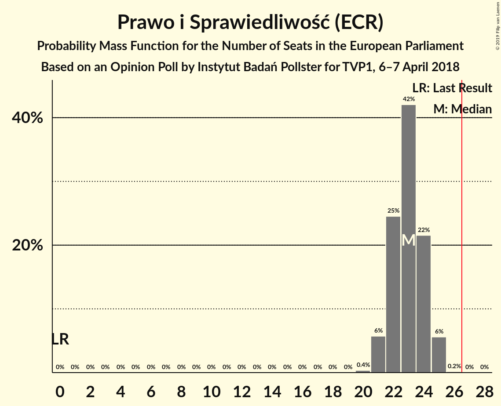
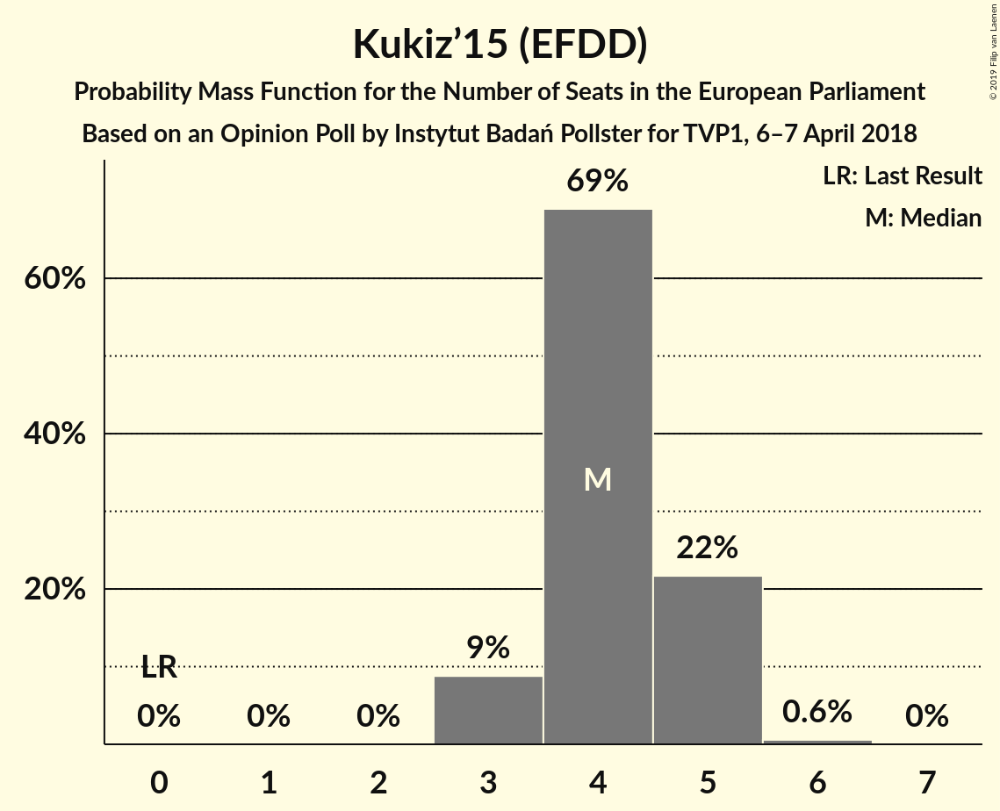
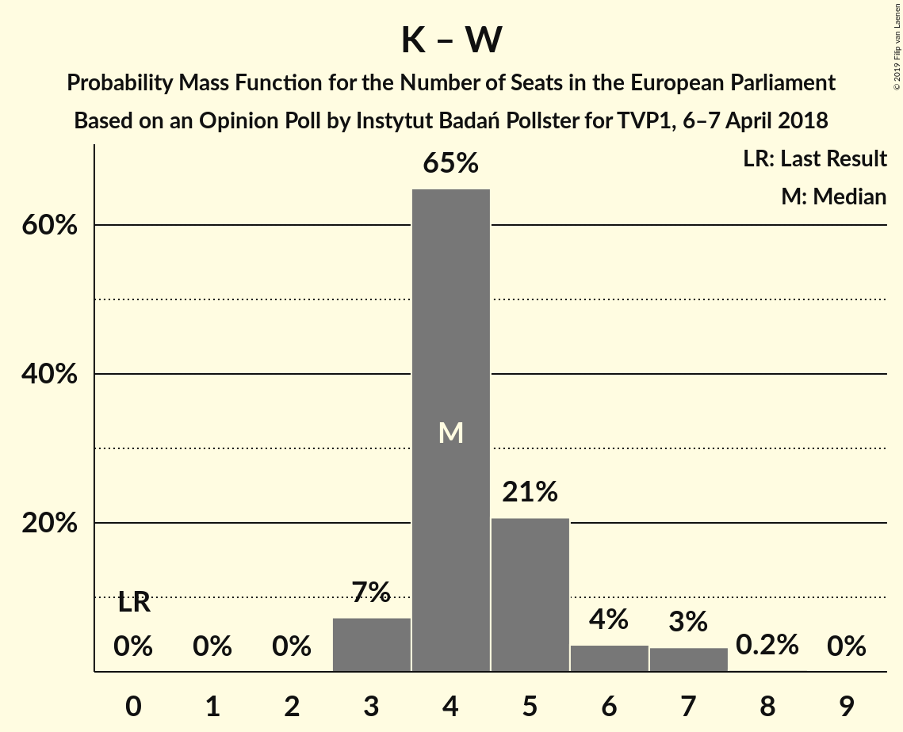
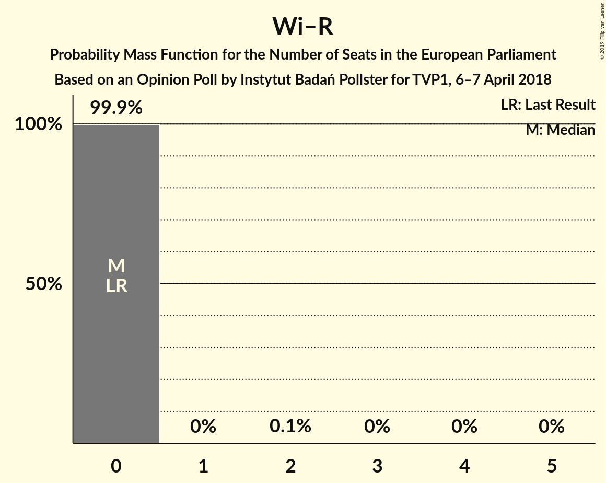

# Opinion Poll by Instytut Badań Pollster for TVP1, 6–7 April 2018

<a href="#voting-intentions">Voting Intentions</a> | <a href="#seats">Seats</a> | <a href="#coalitions">Coalitions</a> | <a href="#technical-information">Technical Information</a>

## Voting Intentions

### Confidence Intervals

| Party | Last Result | Poll Result | 80% Confidence Interval | 90% Confidence Interval | 95% Confidence Interval | 99% Confidence Interval |
|:-----:|:-----------:|:-----------:|:-----------------------:|:-----------------------:|:-----------------------:|:-----------------------:|
| Koalicja Europejska (EPP) | 0.0% | 43.9% | 41.9–45.9% |41.4–46.5% |40.9–47.0% |39.9–47.9% |
| Prawo i Sprawiedliwość (ECR) | 0.0% | 40.9% | 38.9–42.9% |38.4–43.4% |37.9–43.9% |37.0–44.9% |
| Kukiz’15 (EFDD) | 0.0% | 8.0% | 7.0–9.2% |6.7–9.6% |6.5–9.8% |6.1–10.5% |
| KORWiN (EFDD) | 0.0% | 4.0% | 3.3–4.9% |3.1–5.2% |3.0–5.4% |2.7–5.9% |
| Wiosna–Partia Razem (S&D) | 0.0% | 3.0% | 2.4–3.8% |2.3–4.1% |2.1–4.3% |1.9–4.7% |

*Note:* The poll result column reflects the actual value used in the calculations. Published results may vary slightly, and in addition be rounded to fewer digits.

## Seats

### Confidence Intervals

| Party | Last Result | Median | 80% Confidence Interval | 90% Confidence Interval | 95% Confidence Interval | 99% Confidence Interval |
|:-----:|:-----------:|:------:|:-----------------------:|:-----------------------:|:-----------------------:|:-----------------------:|
| <a href="#koalicja-europejska-(epp)">Koalicja Europejska (EPP)</a> | 0 | 26 | 23–26 |23–26 |23–27 |23–27 |
| <a href="#prawo-i-sprawiedliwość-(ecr)">Prawo i Sprawiedliwość (ECR)</a> | 0 | 22 | 21–23 |21–23 |21–23 |21–23 |
| <a href="#kukiz’15-(efdd)">Kukiz’15 (EFDD)</a> | 0 | 5 | 3–5 |3–5 |3–5 |3–6 |
| <a href="#korwin-(efdd)">KORWiN (EFDD)</a> | 0 | 0 | 0–2 |0–2 |0–3 |0–3 |
| <a href="#wiosna–partia-razem-(s&d)">Wiosna–Partia Razem (S&D)</a> | 0 | 0 | 0 |0 |0 |0 |

### Koalicja Europejska (EPP)

*For a full overview of the results for this party, see the [Koalicja Europejska (EPP)](party-koalicjaeuropejskaepp.html) page.*

| Number of Seats | Probability | Accumulated | Special Marks |
|:---------------:|:-----------:|:-----------:|:-------------:|
| 0 | 0% | 100% | Last Result |
| 1 | 0% | 100% |  |
| 2 | 0% | 100% |  |
| 3 | 0% | 100% |  |
| 4 | 0% | 100% |  |
| 5 | 0% | 100% |  |
| 6 | 0% | 100% |  |
| 7 | 0% | 100% |  |
| 8 | 0% | 100% |  |
| 9 | 0% | 100% |  |
| 10 | 0% | 100% |  |
| 11 | 0% | 100% |  |
| 12 | 0% | 100% |  |
| 13 | 0% | 100% |  |
| 14 | 0% | 100% |  |
| 15 | 0% | 100% |  |
| 16 | 0% | 100% |  |
| 17 | 0% | 100% |  |
| 18 | 0% | 100% |  |
| 19 | 0% | 100% |  |
| 20 | 0% | 100% |  |
| 21 | 0% | 100% |  |
| 22 | 0.1% | 100% |  |
| 23 | 41% | 99.8% |  |
| 24 | 1.2% | 59% |  |
| 25 | 0.8% | 58% |  |
| 26 | 54% | 57% | Median |
| 27 | 3% | 3% | Majority |
| 28 | 0% | 0% |  |

### Prawo i Sprawiedliwość (ECR)

*For a full overview of the results for this party, see the [Prawo i Sprawiedliwość (ECR)](party-prawoisprawiedliwośćecr.html) page.*

| Number of Seats | Probability | Accumulated | Special Marks |
|:---------------:|:-----------:|:-----------:|:-------------:|
| 0 | 0% | 100% | Last Result |
| 1 | 0% | 100% |  |
| 2 | 0% | 100% |  |
| 3 | 0% | 100% |  |
| 4 | 0% | 100% |  |
| 5 | 0% | 100% |  |
| 6 | 0% | 100% |  |
| 7 | 0% | 100% |  |
| 8 | 0% | 100% |  |
| 9 | 0% | 100% |  |
| 10 | 0% | 100% |  |
| 11 | 0% | 100% |  |
| 12 | 0% | 100% |  |
| 13 | 0% | 100% |  |
| 14 | 0% | 100% |  |
| 15 | 0% | 100% |  |
| 16 | 0% | 100% |  |
| 17 | 0% | 100% |  |
| 18 | 0% | 100% |  |
| 19 | 0% | 100% |  |
| 20 | 0.2% | 100% |  |
| 21 | 19% | 99.8% |  |
| 22 | 41% | 80% | Median |
| 23 | 39% | 39% |  |
| 24 | 0% | 0.1% |  |
| 25 | 0.1% | 0.1% |  |
| 26 | 0% | 0% |  |

### Kukiz’15 (EFDD)

*For a full overview of the results for this party, see the [Kukiz’15 (EFDD)](party-kukiz’15efdd.html) page.*

| Number of Seats | Probability | Accumulated | Special Marks |
|:---------------:|:-----------:|:-----------:|:-------------:|
| 0 | 0% | 100% | Last Result |
| 1 | 0% | 100% |  |
| 2 | 0% | 100% |  |
| 3 | 39% | 100% |  |
| 4 | 5% | 61% |  |
| 5 | 55% | 56% | Median |
| 6 | 1.3% | 1.3% |  |
| 7 | 0% | 0% |  |

### KORWiN (EFDD)

*For a full overview of the results for this party, see the [KORWiN (EFDD)](party-korwinefdd.html) page.*

| Number of Seats | Probability | Accumulated | Special Marks |
|:---------------:|:-----------:|:-----------:|:-------------:|
| 0 | 58% | 100% | Last Result, Median |
| 1 | 0% | 42% |  |
| 2 | 39% | 42% |  |
| 3 | 3% | 3% |  |
| 4 | 0% | 0% |  |

### Wiosna–Partia Razem (S&D)

*For a full overview of the results for this party, see the [Wiosna–Partia Razem (S&D)](party-wiosna–partiarazemsd.html) page.*

| Number of Seats | Probability | Accumulated | Special Marks |
|:---------------:|:-----------:|:-----------:|:-------------:|
| 0 | 99.9% | 100% | Last Result, Median |
| 1 | 0% | 0.1% |  |
| 2 | 0% | 0.1% |  |
| 3 | 0% | 0% |  |

## Coalitions

### Confidence Intervals

| Coalition | Last Result | Median | Majority? | 80% Confidence Interval | 90% Confidence Interval | 95% Confidence Interval | 99% Confidence Interval |
|:---------:|:-----------:|:------:|:---------:|:-----------------------:|:-----------------------:|:-----------------------:|:-----------------------:|
| Koalicja Europejska (EPP) | 0 | 26 | 3% | 23–26 | 23–26 | 23–27 | 23–27 |
| Prawo i Sprawiedliwość (ECR) | 0 | 22 | 0% | 21–23 | 21–23 | 21–23 | 21–23 |
| Kukiz’15 (EFDD) – KORWiN (EFDD) | 0 | 5 | 0% | 3–7 | 3–7 | 3–7 | 3–7 |
| Wiosna–Partia Razem (S&D) | 0 | 0 | 0% | 0 | 0 | 0 | 0 |

### Koalicja Europejska (EPP)

| Number of Seats | Probability | Accumulated | Special Marks |
|:---------------:|:-----------:|:-----------:|:-------------:|
| 0 | 0% | 100% | Last Result |
| 1 | 0% | 100% |  |
| 2 | 0% | 100% |  |
| 3 | 0% | 100% |  |
| 4 | 0% | 100% |  |
| 5 | 0% | 100% |  |
| 6 | 0% | 100% |  |
| 7 | 0% | 100% |  |
| 8 | 0% | 100% |  |
| 9 | 0% | 100% |  |
| 10 | 0% | 100% |  |
| 11 | 0% | 100% |  |
| 12 | 0% | 100% |  |
| 13 | 0% | 100% |  |
| 14 | 0% | 100% |  |
| 15 | 0% | 100% |  |
| 16 | 0% | 100% |  |
| 17 | 0% | 100% |  |
| 18 | 0% | 100% |  |
| 19 | 0% | 100% |  |
| 20 | 0% | 100% |  |
| 21 | 0% | 100% |  |
| 22 | 0.1% | 100% |  |
| 23 | 41% | 99.8% |  |
| 24 | 1.2% | 59% |  |
| 25 | 0.8% | 58% |  |
| 26 | 54% | 57% | Median |
| 27 | 3% | 3% | Majority |
| 28 | 0% | 0% |  |

### Prawo i Sprawiedliwość (ECR)

| Number of Seats | Probability | Accumulated | Special Marks |
|:---------------:|:-----------:|:-----------:|:-------------:|
| 0 | 0% | 100% | Last Result |
| 1 | 0% | 100% |  |
| 2 | 0% | 100% |  |
| 3 | 0% | 100% |  |
| 4 | 0% | 100% |  |
| 5 | 0% | 100% |  |
| 6 | 0% | 100% |  |
| 7 | 0% | 100% |  |
| 8 | 0% | 100% |  |
| 9 | 0% | 100% |  |
| 10 | 0% | 100% |  |
| 11 | 0% | 100% |  |
| 12 | 0% | 100% |  |
| 13 | 0% | 100% |  |
| 14 | 0% | 100% |  |
| 15 | 0% | 100% |  |
| 16 | 0% | 100% |  |
| 17 | 0% | 100% |  |
| 18 | 0% | 100% |  |
| 19 | 0% | 100% |  |
| 20 | 0.2% | 100% |  |
| 21 | 19% | 99.8% |  |
| 22 | 41% | 80% | Median |
| 23 | 39% | 39% |  |
| 24 | 0% | 0.1% |  |
| 25 | 0.1% | 0.1% |  |
| 26 | 0% | 0% |  |

### Kukiz’15 (EFDD) – KORWiN (EFDD)

| Number of Seats | Probability | Accumulated | Special Marks |
|:---------------:|:-----------:|:-----------:|:-------------:|
| 0 | 0% | 100% | Last Result |
| 1 | 0% | 100% |  |
| 2 | 0% | 100% |  |
| 3 | 39% | 100% |  |
| 4 | 3% | 61% |  |
| 5 | 16% | 59% | Median |
| 6 | 1.4% | 43% |  |
| 7 | 41% | 41% |  |
| 8 | 0.1% | 0.1% |  |
| 9 | 0% | 0% |  |

### Wiosna–Partia Razem (S&D)

| Number of Seats | Probability | Accumulated | Special Marks |
|:---------------:|:-----------:|:-----------:|:-------------:|
| 0 | 99.9% | 100% | Last Result, Median |
| 1 | 0% | 0.1% |  |
| 2 | 0% | 0.1% |  |
| 3 | 0% | 0% |  |

## Technical Information

### Opinion Poll

+ **Polling firm:** Instytut Badań Pollster
+ **Commissioner(s):** TVP1
+ **Fieldwork period:** 6–7 April 2018

### Calculations

+ **Sample size:** 1023
+ **Simulations done:** 1,024
+ **Error estimate:** 0.88%

