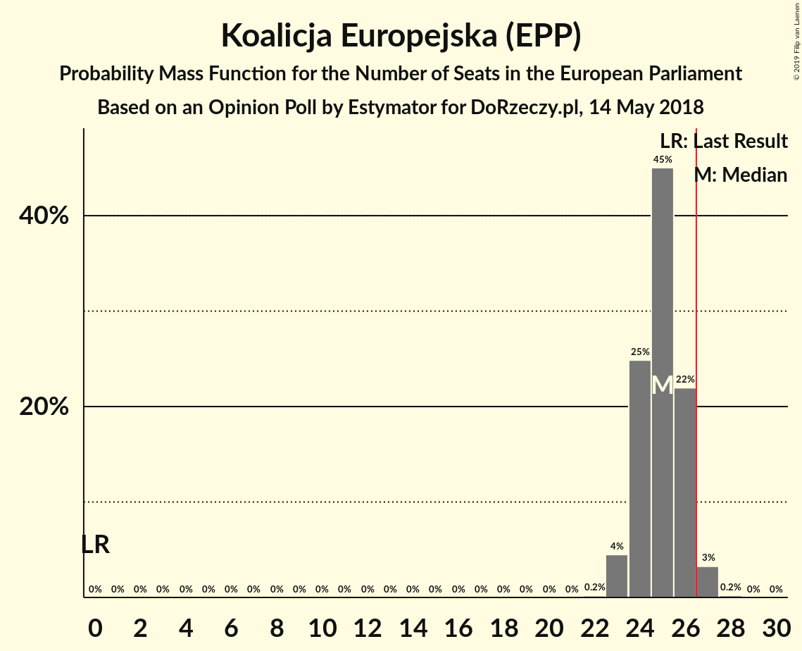
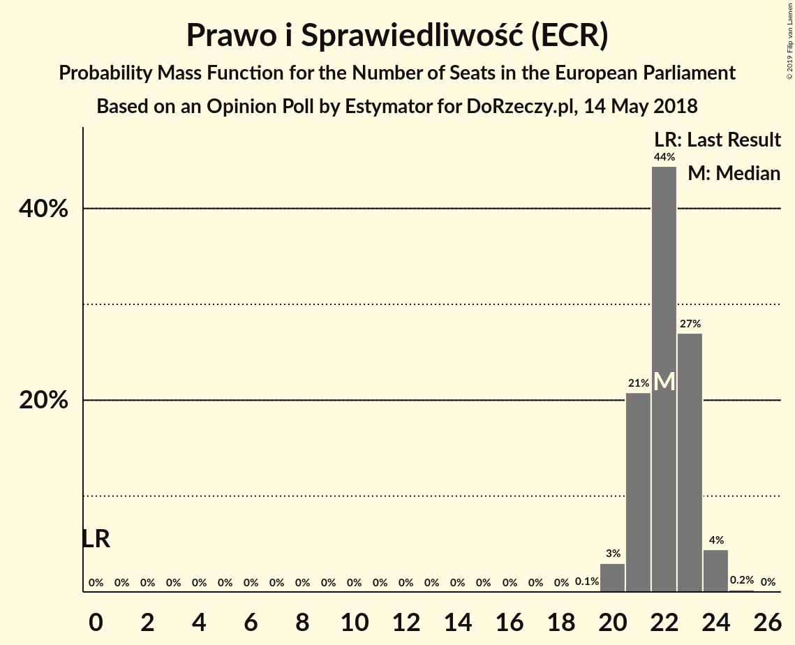
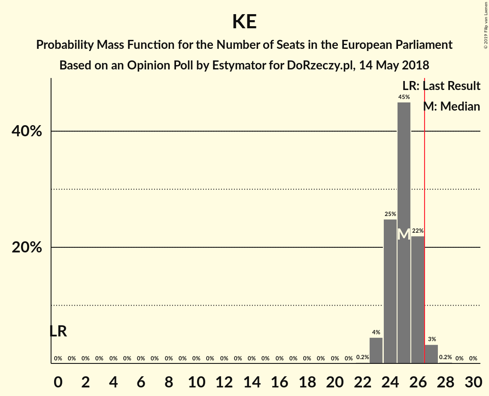

# Opinion Poll by Estymator for DoRzeczy.pl, 14 May 2018

<a href="#voting-intentions">Voting Intentions</a> | <a href="#seats">Seats</a> | <a href="#coalitions">Coalitions</a> | <a href="#technical-information">Technical Information</a>

## Voting Intentions

### Confidence Intervals

| Party | Last Result | Poll Result | 80% Confidence Interval | 90% Confidence Interval | 95% Confidence Interval | 99% Confidence Interval |
|:-----:|:-----------:|:-----------:|:-----------------------:|:-----------------------:|:-----------------------:|:-----------------------:|
| Koalicja Europejska (EPP) | 0.0% | 46.0% | 44.0–48.0% |43.4–48.6% |42.9–49.1% |42.0–50.1% |
| Prawo i Sprawiedliwość (ECR) | 0.0% | 40.8% | 38.9–42.8% |38.3–43.4% |37.8–43.9% |36.9–44.9% |
| Kukiz’15 (EFDD) | 0.0% | 9.8% | 8.7–11.1% |8.4–11.5% |8.1–11.8% |7.6–12.4% |
| KORWiN (EFDD) | 0.0% | 1.8% | 1.4–2.5% |1.2–2.7% |1.1–2.8% |1.0–3.2% |
| Wiosna–Partia Razem (S&D) | 0.0% | 1.3% | 0.9–1.9% |0.8–2.1% |0.8–2.2% |0.6–2.5% |

*Note:* The poll result column reflects the actual value used in the calculations. Published results may vary slightly, and in addition be rounded to fewer digits.

## Seats

### Confidence Intervals

| Party | Last Result | Median | 80% Confidence Interval | 90% Confidence Interval | 95% Confidence Interval | 99% Confidence Interval |
|:-----:|:-----------:|:------:|:-----------------------:|:-----------------------:|:-----------------------:|:-----------------------:|
| <a href="#koalicja-europejska-(epp)">Koalicja Europejska (EPP)</a> | 0 | 25 | 24–26 |24–26 |23–27 |23–27 |
| <a href="#prawo-i-sprawiedliwość-(ecr)">Prawo i Sprawiedliwość (ECR)</a> | 0 | 22 | 21–23 |21–23 |20–24 |20–24 |
| <a href="#kukiz’15-(efdd)">Kukiz’15 (EFDD)</a> | 0 | 5 | 4–5 |4–5 |4–6 |4–6 |
| <a href="#korwin-(efdd)">KORWiN (EFDD)</a> | 0 | 0 | 0 |0 |0 |0 |
| <a href="#wiosna–partia-razem-(s&d)">Wiosna–Partia Razem (S&D)</a> | 0 | 0 | 0 |0 |0 |0 |

### Koalicja Europejska (EPP)

*For a full overview of the results for this party, see the [Koalicja Europejska (EPP)](party-koalicjaeuropejskaepp.html) page.*

| Number of Seats | Probability | Accumulated | Special Marks |
|:---------------:|:-----------:|:-----------:|:-------------:|
| 0 | 0% | 100% | Last Result |
| 1 | 0% | 100% |  |
| 2 | 0% | 100% |  |
| 3 | 0% | 100% |  |
| 4 | 0% | 100% |  |
| 5 | 0% | 100% |  |
| 6 | 0% | 100% |  |
| 7 | 0% | 100% |  |
| 8 | 0% | 100% |  |
| 9 | 0% | 100% |  |
| 10 | 0% | 100% |  |
| 11 | 0% | 100% |  |
| 12 | 0% | 100% |  |
| 13 | 0% | 100% |  |
| 14 | 0% | 100% |  |
| 15 | 0% | 100% |  |
| 16 | 0% | 100% |  |
| 17 | 0% | 100% |  |
| 18 | 0% | 100% |  |
| 19 | 0% | 100% |  |
| 20 | 0% | 100% |  |
| 21 | 0% | 100% |  |
| 22 | 0.2% | 100% |  |
| 23 | 3% | 99.8% |  |
| 24 | 17% | 97% |  |
| 25 | 35% | 80% | Median |
| 26 | 42% | 45% |  |
| 27 | 3% | 4% | Majority |
| 28 | 0.1% | 0.1% |  |
| 29 | 0% | 0% |  |

### Prawo i Sprawiedliwość (ECR)

*For a full overview of the results for this party, see the [Prawo i Sprawiedliwość (ECR)](party-prawoisprawiedliwośćecr.html) page.*

| Number of Seats | Probability | Accumulated | Special Marks |
|:---------------:|:-----------:|:-----------:|:-------------:|
| 0 | 0% | 100% | Last Result |
| 1 | 0% | 100% |  |
| 2 | 0% | 100% |  |
| 3 | 0% | 100% |  |
| 4 | 0% | 100% |  |
| 5 | 0% | 100% |  |
| 6 | 0% | 100% |  |
| 7 | 0% | 100% |  |
| 8 | 0% | 100% |  |
| 9 | 0% | 100% |  |
| 10 | 0% | 100% |  |
| 11 | 0% | 100% |  |
| 12 | 0% | 100% |  |
| 13 | 0% | 100% |  |
| 14 | 0% | 100% |  |
| 15 | 0% | 100% |  |
| 16 | 0% | 100% |  |
| 17 | 0% | 100% |  |
| 18 | 0% | 100% |  |
| 19 | 0.1% | 100% |  |
| 20 | 4% | 99.9% |  |
| 21 | 25% | 96% |  |
| 22 | 35% | 71% | Median |
| 23 | 32% | 36% |  |
| 24 | 4% | 4% |  |
| 25 | 0.4% | 0.4% |  |
| 26 | 0% | 0% |  |

### Kukiz’15 (EFDD)

*For a full overview of the results for this party, see the [Kukiz’15 (EFDD)](party-kukiz’15efdd.html) page.*

| Number of Seats | Probability | Accumulated | Special Marks |
|:---------------:|:-----------:|:-----------:|:-------------:|
| 0 | 0% | 100% | Last Result |
| 1 | 0% | 100% |  |
| 2 | 0% | 100% |  |
| 3 | 0% | 100% |  |
| 4 | 37% | 100% |  |
| 5 | 60% | 63% | Median |
| 6 | 3% | 3% |  |
| 7 | 0.2% | 0.2% |  |
| 8 | 0% | 0% |  |

### KORWiN (EFDD)

*For a full overview of the results for this party, see the [KORWiN (EFDD)](party-korwinefdd.html) page.*

| Number of Seats | Probability | Accumulated | Special Marks |
|:---------------:|:-----------:|:-----------:|:-------------:|
| 0 | 100% | 100% | Last Result, Median |

### Wiosna–Partia Razem (S&D)

*For a full overview of the results for this party, see the [Wiosna–Partia Razem (S&D)](party-wiosna–partiarazemsd.html) page.*

| Number of Seats | Probability | Accumulated | Special Marks |
|:---------------:|:-----------:|:-----------:|:-------------:|
| 0 | 100% | 100% | Last Result, Median |

## Coalitions

### Confidence Intervals

| Coalition | Last Result | Median | Majority? | 80% Confidence Interval | 90% Confidence Interval | 95% Confidence Interval | 99% Confidence Interval |
|:---------:|:-----------:|:------:|:---------:|:-----------------------:|:-----------------------:|:-----------------------:|:-----------------------:|
| Koalicja Europejska (EPP) | 0 | 25 | 4% | 24–26 | 24–26 | 23–27 | 23–27 |
| Prawo i Sprawiedliwość (ECR) | 0 | 22 | 0% | 21–23 | 21–23 | 20–24 | 20–24 |
| Kukiz’15 (EFDD) – KORWiN (EFDD) | 0 | 5 | 0% | 4–5 | 4–5 | 4–6 | 4–6 |
| Wiosna–Partia Razem (S&D) | 0 | 0 | 0% | 0 | 0 | 0 | 0 |

### Koalicja Europejska (EPP)

| Number of Seats | Probability | Accumulated | Special Marks |
|:---------------:|:-----------:|:-----------:|:-------------:|
| 0 | 0% | 100% | Last Result |
| 1 | 0% | 100% |  |
| 2 | 0% | 100% |  |
| 3 | 0% | 100% |  |
| 4 | 0% | 100% |  |
| 5 | 0% | 100% |  |
| 6 | 0% | 100% |  |
| 7 | 0% | 100% |  |
| 8 | 0% | 100% |  |
| 9 | 0% | 100% |  |
| 10 | 0% | 100% |  |
| 11 | 0% | 100% |  |
| 12 | 0% | 100% |  |
| 13 | 0% | 100% |  |
| 14 | 0% | 100% |  |
| 15 | 0% | 100% |  |
| 16 | 0% | 100% |  |
| 17 | 0% | 100% |  |
| 18 | 0% | 100% |  |
| 19 | 0% | 100% |  |
| 20 | 0% | 100% |  |
| 21 | 0% | 100% |  |
| 22 | 0.2% | 100% |  |
| 23 | 3% | 99.8% |  |
| 24 | 17% | 97% |  |
| 25 | 35% | 80% | Median |
| 26 | 42% | 45% |  |
| 27 | 3% | 4% | Majority |
| 28 | 0.1% | 0.1% |  |
| 29 | 0% | 0% |  |

### Prawo i Sprawiedliwość (ECR)

| Number of Seats | Probability | Accumulated | Special Marks |
|:---------------:|:-----------:|:-----------:|:-------------:|
| 0 | 0% | 100% | Last Result |
| 1 | 0% | 100% |  |
| 2 | 0% | 100% |  |
| 3 | 0% | 100% |  |
| 4 | 0% | 100% |  |
| 5 | 0% | 100% |  |
| 6 | 0% | 100% |  |
| 7 | 0% | 100% |  |
| 8 | 0% | 100% |  |
| 9 | 0% | 100% |  |
| 10 | 0% | 100% |  |
| 11 | 0% | 100% |  |
| 12 | 0% | 100% |  |
| 13 | 0% | 100% |  |
| 14 | 0% | 100% |  |
| 15 | 0% | 100% |  |
| 16 | 0% | 100% |  |
| 17 | 0% | 100% |  |
| 18 | 0% | 100% |  |
| 19 | 0.1% | 100% |  |
| 20 | 4% | 99.9% |  |
| 21 | 25% | 96% |  |
| 22 | 35% | 71% | Median |
| 23 | 32% | 36% |  |
| 24 | 4% | 4% |  |
| 25 | 0.4% | 0.4% |  |
| 26 | 0% | 0% |  |

### Kukiz’15 (EFDD) – KORWiN (EFDD)

| Number of Seats | Probability | Accumulated | Special Marks |
|:---------------:|:-----------:|:-----------:|:-------------:|
| 0 | 0% | 100% | Last Result |
| 1 | 0% | 100% |  |
| 2 | 0% | 100% |  |
| 3 | 0% | 100% |  |
| 4 | 37% | 100% |  |
| 5 | 60% | 63% | Median |
| 6 | 3% | 3% |  |
| 7 | 0.2% | 0.2% |  |
| 8 | 0% | 0% |  |

### Wiosna–Partia Razem (S&D)

| Number of Seats | Probability | Accumulated | Special Marks |
|:---------------:|:-----------:|:-----------:|:-------------:|
| 0 | 100% | 100% | Last Result, Median |

## Technical Information

### Opinion Poll

+ **Polling firm:** Estymator
+ **Commissioner(s):** DoRzeczy.pl
+ **Fieldwork period:** 14 May 2018

### Calculations

+ **Sample size:** 1002
+ **Simulations done:** 4,096
+ **Error estimate:** 2.00%

