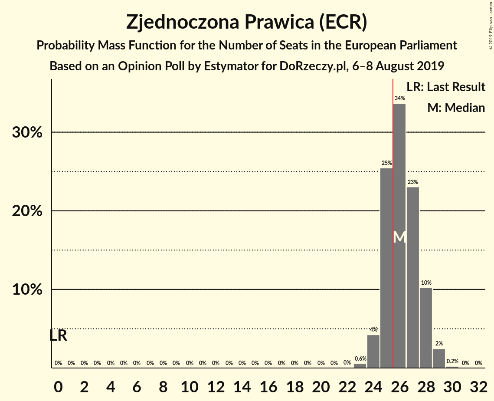
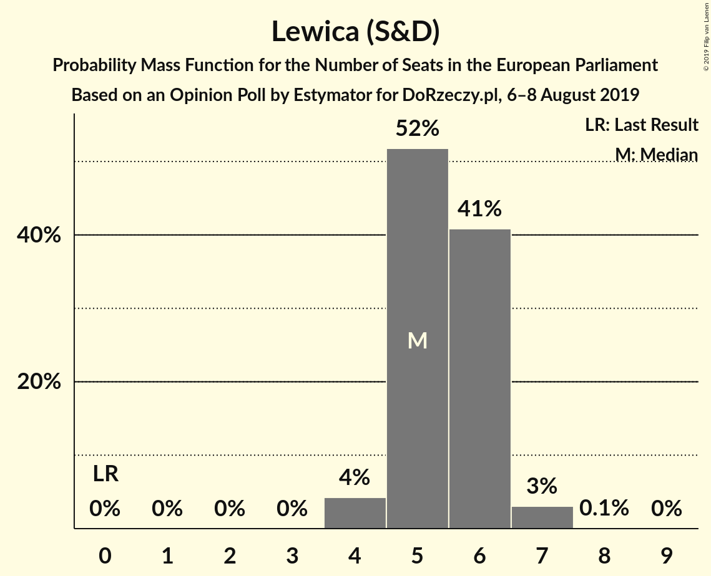
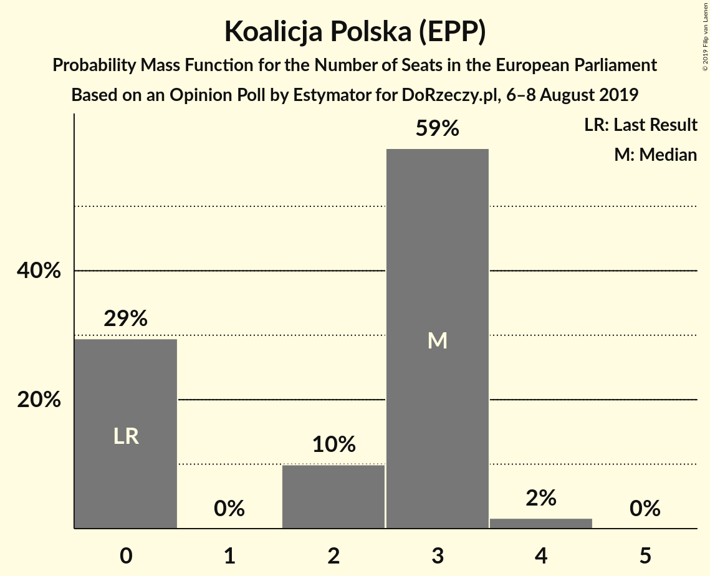
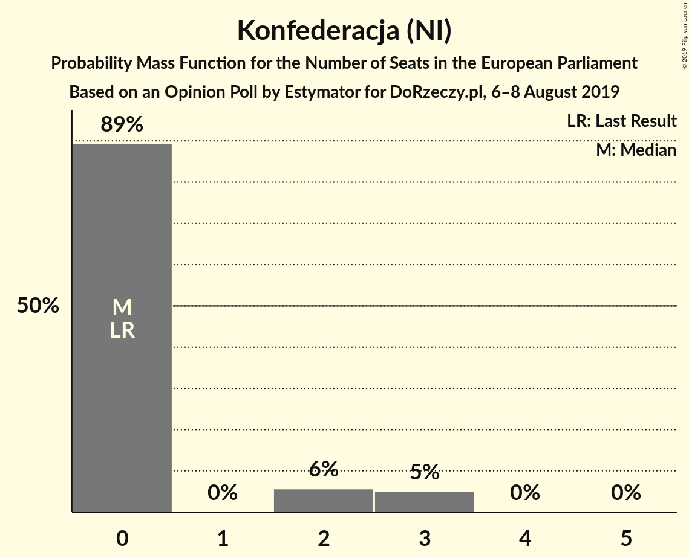
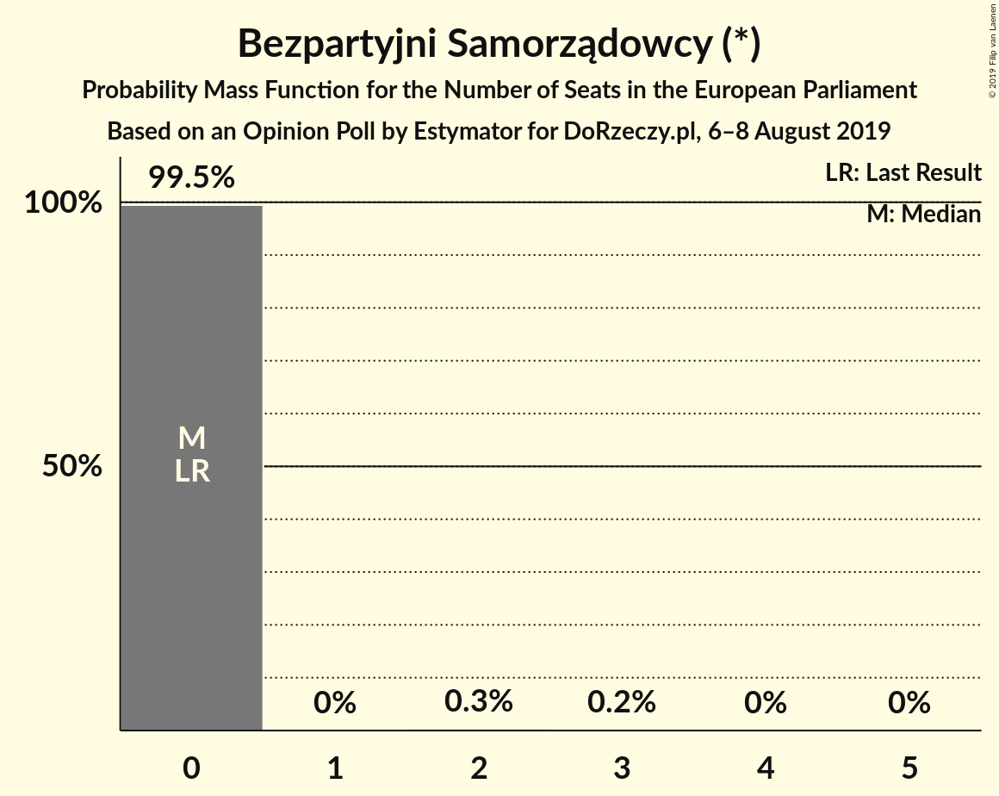
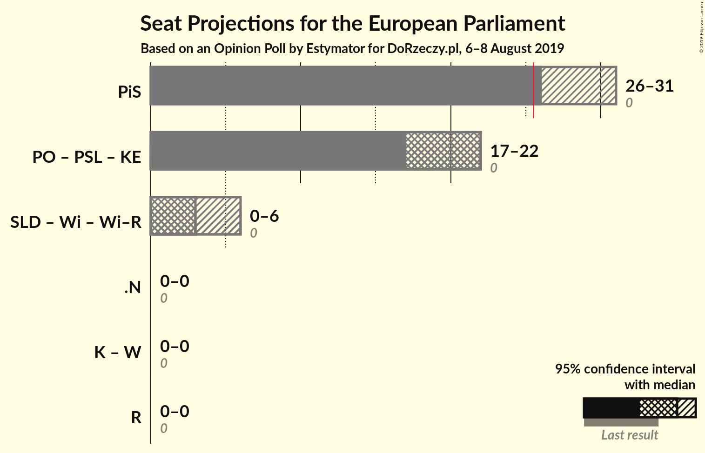
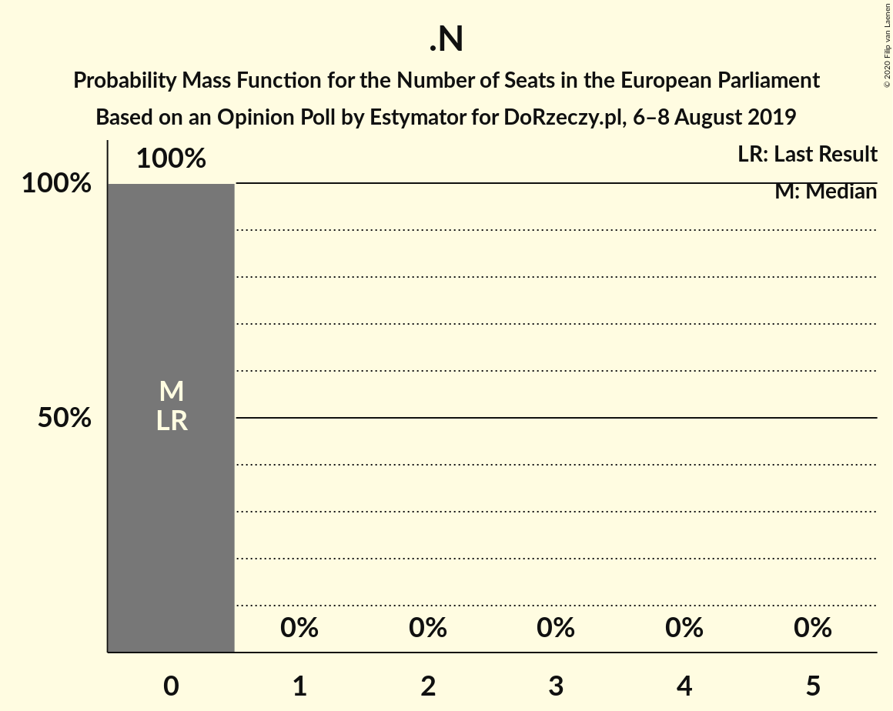

# Opinion Poll by Estymator for DoRzeczy.pl, 6–8 August 2019

<a href="#voting-intentions">Voting Intentions</a> | <a href="#seats">Seats</a> | <a href="#coalitions">Coalitions</a> | <a href="#technical-information">Technical Information</a>

## Voting Intentions

### Confidence Intervals

| Party | Last Result | Poll Result | 80% Confidence Interval | 90% Confidence Interval | 95% Confidence Interval | 99% Confidence Interval |
|:-----:|:-----------:|:-----------:|:-----------------------:|:-----------------------:|:-----------------------:|:-----------------------:|
| Prawo i Sprawiedliwość (ECR) | 0.0% | 45.4% | N/A |N/A |N/A |N/A |
| Platforma Obywatelska (EPP) | 0.0% | 28.9% | N/A |N/A |N/A |N/A |
| Sojusz Lewicy Demokratycznej (S&D) | 0.0% | 5.4% | N/A |N/A |N/A |N/A |
| Polskie Stronnictwo Ludowe (EPP) | 0.0% | 5.1% | N/A |N/A |N/A |N/A |
| Wiosna (S&D) | 0.0% | 3.7% | N/A |N/A |N/A |N/A |
| Kukiz’15 (NI) | 0.0% | 2.8% | N/A |N/A |N/A |N/A |
| KORWiN (NI) | 0.0% | 2.6% | N/A |N/A |N/A |N/A |
| Lewica Razem (S&D) | 0.0% | 2.2% | N/A |N/A |N/A |N/A |
| .Nowoczesna (RE) | 0.0% | 1.4% | N/A |N/A |N/A |N/A |

*Note:* The poll result column reflects the actual value used in the calculations. Published results may vary slightly, and in addition be rounded to fewer digits.

## Seats

### Confidence Intervals

| Party | Last Result | Median | 80% Confidence Interval | 90% Confidence Interval | 95% Confidence Interval | 99% Confidence Interval |
|:-----:|:-----------:|:------:|:-----------------------:|:-----------------------:|:-----------------------:|:-----------------------:|
| <a href="#prawo-i-sprawiedliwość-(ecr)">Prawo i Sprawiedliwość (ECR)</a> | 0 | N/A | N/A |N/A |N/A |N/A |
| <a href="#platforma-obywatelska-(epp)">Platforma Obywatelska (EPP)</a> | 0 | N/A | N/A |N/A |N/A |N/A |
| <a href="#sojusz-lewicy-demokratycznej-(s&d)">Sojusz Lewicy Demokratycznej (S&D)</a> | 0 | N/A | N/A |N/A |N/A |N/A |
| <a href="#polskie-stronnictwo-ludowe-(epp)">Polskie Stronnictwo Ludowe (EPP)</a> | 0 | N/A | N/A |N/A |N/A |N/A |
| <a href="#wiosna-(s&d)">Wiosna (S&D)</a> | 0 | N/A | N/A |N/A |N/A |N/A |
| <a href="#kukiz’15-(ni)">Kukiz’15 (NI)</a> | 0 | N/A | N/A |N/A |N/A |N/A |
| <a href="#korwin-(ni)">KORWiN (NI)</a> | 0 | N/A | N/A |N/A |N/A |N/A |
| <a href="#lewica-razem-(s&d)">Lewica Razem (S&D)</a> | 0 | N/A | N/A |N/A |N/A |N/A |
| <a href="#.nowoczesna-(re)">.Nowoczesna (RE)</a> | 0 | N/A | N/A |N/A |N/A |N/A |

### Zjednoczona Prawica (ECR)

*For a full overview of the results for this party, see the [Zjednoczona Prawica (ECR)](party-zjednoczonaprawicaecr.html) page.*

| Number of Seats | Probability | Accumulated | Special Marks |
|:---------------:|:-----------:|:-----------:|:-------------:|
| 0 | 0% | 100% | Last Result |
| 1 | 0% | 100% |  |
| 2 | 0% | 100% |  |
| 3 | 0% | 100% |  |
| 4 | 0% | 100% |  |
| 5 | 0% | 100% |  |
| 6 | 0% | 100% |  |
| 7 | 0% | 100% |  |
| 8 | 0% | 100% |  |
| 9 | 0% | 100% |  |
| 10 | 0% | 100% |  |
| 11 | 0% | 100% |  |
| 12 | 0% | 100% |  |
| 13 | 0% | 100% |  |
| 14 | 0% | 100% |  |
| 15 | 0% | 100% |  |
| 16 | 0% | 100% |  |
| 17 | 0% | 100% |  |
| 18 | 0% | 100% |  |
| 19 | 0% | 100% |  |
| 20 | 0% | 100% |  |
| 21 | 0% | 100% |  |
| 22 | 0% | 100% |  |
| 23 | 0.7% | 100% |  |
| 24 | 5% | 99.3% |  |
| 25 | 22% | 94% |  |
| 26 | 34% | 72% | Median, Majority |
| 27 | 23% | 38% |  |
| 28 | 12% | 15% |  |
| 29 | 3% | 4% |  |
| 30 | 0.3% | 0.3% |  |
| 31 | 0% | 0% |  |

### Koalicja Obywatelska (EPP)

*For a full overview of the results for this party, see the [Koalicja Obywatelska (EPP)](party-koalicjaobywatelskaepp.html) page.*

| Number of Seats | Probability | Accumulated | Special Marks |
|:---------------:|:-----------:|:-----------:|:-------------:|
| 0 | 0% | 100% | Last Result |
| 1 | 0% | 100% |  |
| 2 | 0% | 100% |  |
| 3 | 0% | 100% |  |
| 4 | 0% | 100% |  |
| 5 | 0% | 100% |  |
| 6 | 0% | 100% |  |
| 7 | 0% | 100% |  |
| 8 | 0% | 100% |  |
| 9 | 0% | 100% |  |
| 10 | 0% | 100% |  |
| 11 | 0% | 100% |  |
| 12 | 0% | 100% |  |
| 13 | 0% | 100% |  |
| 14 | 0.2% | 100% |  |
| 15 | 4% | 99.8% |  |
| 16 | 22% | 95% |  |
| 17 | 41% | 73% | Median |
| 18 | 24% | 33% |  |
| 19 | 7% | 8% |  |
| 20 | 1.0% | 1.0% |  |
| 21 | 0% | 0% |  |

### Lewica (S&D)

*For a full overview of the results for this party, see the [Lewica (S&D)](party-lewicasd.html) page.*

| Number of Seats | Probability | Accumulated | Special Marks |
|:---------------:|:-----------:|:-----------:|:-------------:|
| 0 | 0% | 100% | Last Result |
| 1 | 0% | 100% |  |
| 2 | 0% | 100% |  |
| 3 | 0% | 100% |  |
| 4 | 5% | 100% |  |
| 5 | 52% | 95% | Median |
| 6 | 39% | 43% |  |
| 7 | 4% | 4% |  |
| 8 | 0.1% | 0.1% |  |
| 9 | 0% | 0% |  |

### Koalicja Polska (EPP)

*For a full overview of the results for this party, see the [Koalicja Polska (EPP)](party-koalicjapolskaepp.html) page.*

| Number of Seats | Probability | Accumulated | Special Marks |
|:---------------:|:-----------:|:-----------:|:-------------:|
| 0 | 31% | 100% | Last Result |
| 1 | 0% | 69% |  |
| 2 | 10% | 69% |  |
| 3 | 57% | 59% | Median |
| 4 | 2% | 2% |  |
| 5 | 0% | 0% |  |

### Konfederacja (NI)

*For a full overview of the results for this party, see the [Konfederacja (NI)](party-konfederacjani.html) page.*

| Number of Seats | Probability | Accumulated | Special Marks |
|:---------------:|:-----------:|:-----------:|:-------------:|
| 0 | 90% | 100% | Last Result, Median |
| 1 | 0% | 10% |  |
| 2 | 5% | 10% |  |
| 3 | 5% | 5% |  |
| 4 | 0% | 0% |  |

### Bezpartyjni Samorządowcy (*)

*For a full overview of the results for this party, see the [Bezpartyjni Samorządowcy (*)](party-bezpartyjnisamorządowcy.html) page.*

| Number of Seats | Probability | Accumulated | Special Marks |
|:---------------:|:-----------:|:-----------:|:-------------:|
| 0 | 99.4% | 100% | Last Result, Median |
| 1 | 0% | 0.6% |  |
| 2 | 0.3% | 0.6% |  |
| 3 | 0.2% | 0.2% |  |
| 4 | 0% | 0% |  |

## Coalitions

### Confidence Intervals

| Coalition | Last Result | Median | Majority? | 80% Confidence Interval | 90% Confidence Interval | 95% Confidence Interval | 99% Confidence Interval |
|:---------:|:-----------:|:------:|:---------:|:-----------------------:|:-----------------------:|:-----------------------:|:-----------------------:|
| .Nowoczesna (RE) | 0 | 0 | 0% | 0 | 0 | 0 | 0 |

### .Nowoczesna (RE)

| Number of Seats | Probability | Accumulated | Special Marks |
|:---------------:|:-----------:|:-----------:|:-------------:|
| 0 | 100% | 100% | Last Result, Median |

## Technical Information

### Opinion Poll

+ **Polling firm:** Estymator
+ **Commissioner(s):** DoRzeczy.pl
+ **Fieldwork period:** 6–8 August 2019

### Calculations

+ **Sample size:** 1020
+ **Simulations done:** 1,048,576
+ **Error estimate:** 0.61%

