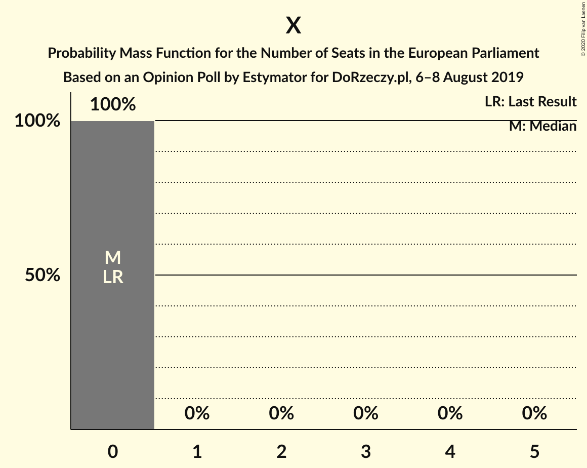

# Opinion Poll by Estymator for DoRzeczy.pl, 6–8 August 2019

<a href="#voting-intentions">Voting Intentions</a> | <a href="#seats">Seats</a> | <a href="#coalitions">Coalitions</a> | <a href="#technical-information">Technical Information</a>

## Voting Intentions

### Confidence Intervals

| Party | Last Result | Poll Result | 80% Confidence Interval | 90% Confidence Interval | 95% Confidence Interval | 99% Confidence Interval |
|:-----:|:-----------:|:-----------:|:-----------------------:|:-----------------------:|:-----------------------:|:-----------------------:|
| Zjednoczona Prawica (ECR) | 0.0% | 45.9% | 43.9–47.9% |43.3–48.5% |42.8–49.0% |41.9–49.9% |
| Koalicja Obywatelska (EPP) | 0.0% | 30.2% | 28.4–32.1% |27.9–32.6% |27.5–33.1% |26.6–34.0% |
| Lewica (S&D) | 0.0% | 10.1% | 9.0–11.4% |8.7–11.8% |8.4–12.1% |7.9–12.8% |
| Koalicja Polska (EPP) | 0.0% | 5.3% | 4.5–6.3% |4.3–6.6% |4.1–6.9% |3.7–7.4% |
| Konfederacja (NI) | 0.0% | 4.1% | 3.4–5.0% |3.2–5.3% |3.1–5.5% |2.8–6.0% |
| Bezpartyjni Samorządowcy (*) | 0.0% | 3.3% | 2.7–4.2% |2.5–4.4% |2.4–4.6% |2.1–5.1% |

*Note:* The poll result column reflects the actual value used in the calculations. Published results may vary slightly, and in addition be rounded to fewer digits.

## Seats

### Confidence Intervals

| Party | Last Result | Median | 80% Confidence Interval | 90% Confidence Interval | 95% Confidence Interval | 99% Confidence Interval |
|:-----:|:-----------:|:------:|:-----------------------:|:-----------------------:|:-----------------------:|:-----------------------:|
| <a href="#zjednoczona-prawica-(ecr)">Zjednoczona Prawica (ECR)</a> | 0 | 26 | 25–28 |25–28 |24–29 |23–29 |
| <a href="#koalicja-obywatelska-(epp)">Koalicja Obywatelska (EPP)</a> | 0 | 17 | 16–18 |16–19 |15–19 |15–20 |
| <a href="#lewica-(s&d)">Lewica (S&D)</a> | 0 | 5 | 5–6 |5–6 |4–7 |4–7 |
| <a href="#koalicja-polska-(epp)">Koalicja Polska (EPP)</a> | 0 | 3 | 0–3 |0–3 |0–3 |0–4 |
| <a href="#konfederacja-(ni)">Konfederacja (NI)</a> | 0 | 0 | 0–2 |0–3 |0–3 |0–3 |
| <a href="#bezpartyjni-samorządowcy-(*)">Bezpartyjni Samorządowcy (*)</a> | 0 | 0 | 0 |0 |0 |0–2 |

### Zjednoczona Prawica (ECR)

*For a full overview of the results for this party, see the [Zjednoczona Prawica (ECR)](party-zjednoczonaprawicaecr.html) page.*

| Number of Seats | Probability | Accumulated | Special Marks |
|:---------------:|:-----------:|:-----------:|:-------------:|
| 0 | 0% | 100% | Last Result |
| 1 | 0% | 100% |  |
| 2 | 0% | 100% |  |
| 3 | 0% | 100% |  |
| 4 | 0% | 100% |  |
| 5 | 0% | 100% |  |
| 6 | 0% | 100% |  |
| 7 | 0% | 100% |  |
| 8 | 0% | 100% |  |
| 9 | 0% | 100% |  |
| 10 | 0% | 100% |  |
| 11 | 0% | 100% |  |
| 12 | 0% | 100% |  |
| 13 | 0% | 100% |  |
| 14 | 0% | 100% |  |
| 15 | 0% | 100% |  |
| 16 | 0% | 100% |  |
| 17 | 0% | 100% |  |
| 18 | 0% | 100% |  |
| 19 | 0% | 100% |  |
| 20 | 0% | 100% |  |
| 21 | 0% | 100% |  |
| 22 | 0% | 100% |  |
| 23 | 0.6% | 99.9% |  |
| 24 | 4% | 99.4% |  |
| 25 | 25% | 95% |  |
| 26 | 34% | 70% | Median, Majority |
| 27 | 23% | 36% |  |
| 28 | 10% | 13% |  |
| 29 | 2% | 3% |  |
| 30 | 0.2% | 0.2% |  |
| 31 | 0% | 0% |  |

### Koalicja Obywatelska (EPP)

*For a full overview of the results for this party, see the [Koalicja Obywatelska (EPP)](party-koalicjaobywatelskaepp.html) page.*

| Number of Seats | Probability | Accumulated | Special Marks |
|:---------------:|:-----------:|:-----------:|:-------------:|
| 0 | 0% | 100% | Last Result |
| 1 | 0% | 100% |  |
| 2 | 0% | 100% |  |
| 3 | 0% | 100% |  |
| 4 | 0% | 100% |  |
| 5 | 0% | 100% |  |
| 6 | 0% | 100% |  |
| 7 | 0% | 100% |  |
| 8 | 0% | 100% |  |
| 9 | 0% | 100% |  |
| 10 | 0% | 100% |  |
| 11 | 0% | 100% |  |
| 12 | 0% | 100% |  |
| 13 | 0% | 100% |  |
| 14 | 0.2% | 100% |  |
| 15 | 4% | 99.8% |  |
| 16 | 24% | 96% |  |
| 17 | 40% | 72% | Median |
| 18 | 23% | 32% |  |
| 19 | 8% | 9% |  |
| 20 | 0.7% | 0.8% |  |
| 21 | 0.1% | 0.1% |  |
| 22 | 0% | 0% |  |

### Lewica (S&D)

*For a full overview of the results for this party, see the [Lewica (S&D)](party-lewicasd.html) page.*

| Number of Seats | Probability | Accumulated | Special Marks |
|:---------------:|:-----------:|:-----------:|:-------------:|
| 0 | 0% | 100% | Last Result |
| 1 | 0% | 100% |  |
| 2 | 0% | 100% |  |
| 3 | 0% | 100% |  |
| 4 | 4% | 100% |  |
| 5 | 52% | 96% | Median |
| 6 | 41% | 44% |  |
| 7 | 3% | 3% |  |
| 8 | 0.1% | 0.1% |  |
| 9 | 0% | 0% |  |

### Koalicja Polska (EPP)

*For a full overview of the results for this party, see the [Koalicja Polska (EPP)](party-koalicjapolskaepp.html) page.*

| Number of Seats | Probability | Accumulated | Special Marks |
|:---------------:|:-----------:|:-----------:|:-------------:|
| 0 | 29% | 100% | Last Result |
| 1 | 0% | 71% |  |
| 2 | 10% | 71% |  |
| 3 | 59% | 61% | Median |
| 4 | 2% | 2% |  |
| 5 | 0% | 0% |  |

### Konfederacja (NI)

*For a full overview of the results for this party, see the [Konfederacja (NI)](party-konfederacjani.html) page.*

| Number of Seats | Probability | Accumulated | Special Marks |
|:---------------:|:-----------:|:-----------:|:-------------:|
| 0 | 89% | 100% | Last Result, Median |
| 1 | 0% | 11% |  |
| 2 | 6% | 11% |  |
| 3 | 5% | 5% |  |
| 4 | 0% | 0% |  |

### Bezpartyjni Samorządowcy (*)

*For a full overview of the results for this party, see the [Bezpartyjni Samorządowcy (*)](party-bezpartyjnisamorządowcy.html) page.*

| Number of Seats | Probability | Accumulated | Special Marks |
|:---------------:|:-----------:|:-----------:|:-------------:|
| 0 | 99.5% | 100% | Last Result, Median |
| 1 | 0% | 0.5% |  |
| 2 | 0.3% | 0.5% |  |
| 3 | 0.2% | 0.2% |  |
| 4 | 0% | 0% |  |

## Coalitions

### Confidence Intervals

| Coalition | Last Result | Median | Majority? | 80% Confidence Interval | 90% Confidence Interval | 95% Confidence Interval | 99% Confidence Interval |
|:---------:|:-----------:|:------:|:---------:|:-----------------------:|:-----------------------:|:-----------------------:|:-----------------------:|
| Bezpartyjni Samorządowcy (*) | 0 | 0 | 0% | 0 | 0 | 0 | 0–2 |

### Bezpartyjni Samorządowcy (*)

| Number of Seats | Probability | Accumulated | Special Marks |
|:---------------:|:-----------:|:-----------:|:-------------:|
| 0 | 99.5% | 100% | Last Result, Median |
| 1 | 0% | 0.5% |  |
| 2 | 0.3% | 0.5% |  |
| 3 | 0.2% | 0.2% |  |
| 4 | 0% | 0% |  |

## Technical Information

### Opinion Poll

+ **Polling firm:** Estymator
+ **Commissioner(s):** DoRzeczy.pl
+ **Fieldwork period:** 6–8 August 2019

### Calculations

+ **Sample size:** 1020
+ **Simulations done:** 131,072
+ **Error estimate:** 1.69%

