# Opinion Poll by IBRiS for Rzeczpospolita, 9–10 August 2019

<a href="#voting-intentions">Voting Intentions</a> | <a href="#seats">Seats</a> | <a href="#coalitions">Coalitions</a> | <a href="#technical-information">Technical Information</a>

## Voting Intentions

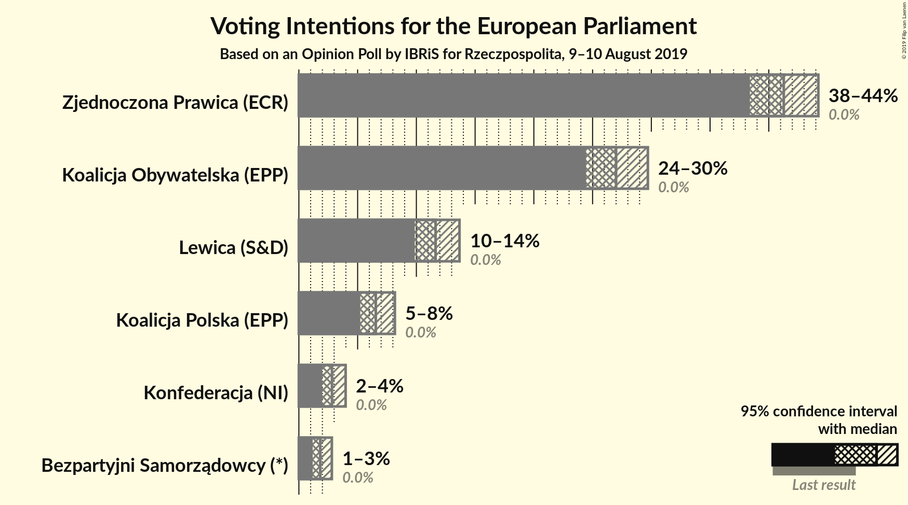

### Confidence Intervals

| Party | Last Result | Poll Result | 80% Confidence Interval | 90% Confidence Interval | 95% Confidence Interval | 99% Confidence Interval |
|:-----:|:-----------:|:-----------:|:-----------------------:|:-----------------------:|:-----------------------:|:-----------------------:|
| Zjednoczona Prawica (ECR) | 0.0% | 41.3% | 39.4–43.2% |38.9–43.7% |38.4–44.2% |37.5–45.1% |
| Koalicja Obywatelska (EPP) | 0.0% | 27.0% | 25.3–28.8% |24.9–29.3% |24.4–29.7% |23.7–30.6% |
| Lewica (S&D) | 0.0% | 11.6% | 10.5–13.0% |10.2–13.4% |9.9–13.7% |9.3–14.3% |
| Koalicja Polska (EPP) | 0.0% | 6.5% | 5.7–7.6% |5.4–7.9% |5.2–8.2% |4.8–8.7% |
| Konfederacja (NI) | 0.0% | 2.8% | 2.3–3.6% |2.1–3.8% |2.0–4.0% |1.8–4.4% |
| Bezpartyjni Samorządowcy (*) | 0.0% | 1.8% | 1.4–2.5% |1.3–2.6% |1.2–2.8% |1.0–3.1% |

*Note:* The poll result column reflects the actual value used in the calculations. Published results may vary slightly, and in addition be rounded to fewer digits.

## Seats

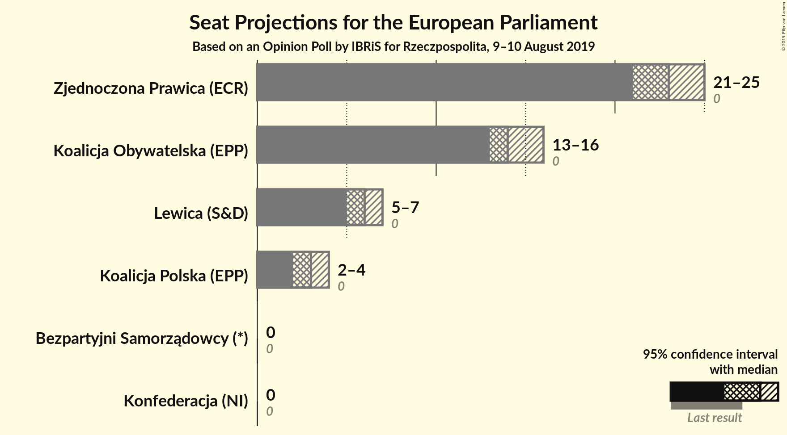

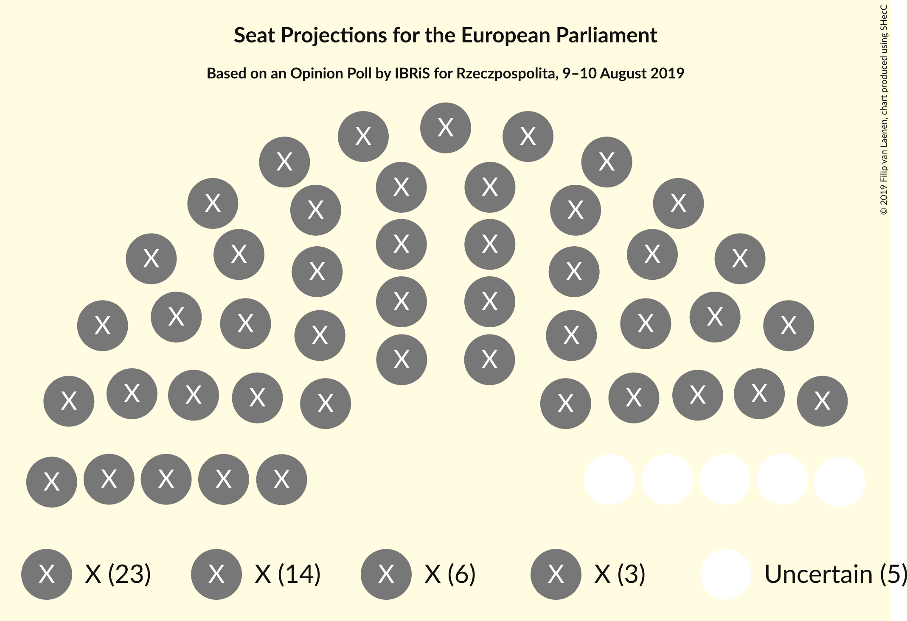

### Confidence Intervals

| Party | Last Result | Median | 80% Confidence Interval | 90% Confidence Interval | 95% Confidence Interval | 99% Confidence Interval |
|:-----:|:-----------:|:------:|:-----------------------:|:-----------------------:|:-----------------------:|:-----------------------:|
| <a href="#zjednoczona-prawica-(ecr)">Zjednoczona Prawica (ECR)</a> | 0 | 23 | 22–24 |21–24 |21–24 |20–25 |
| <a href="#koalicja-obywatelska-(epp)">Koalicja Obywatelska (EPP)</a> | 0 | 15 | 14–16 |13–16 |13–16 |13–17 |
| <a href="#lewica-(s&d)">Lewica (S&D)</a> | 0 | 6 | 5–7 |5–7 |5–7 |5–8 |
| <a href="#koalicja-polska-(epp)">Koalicja Polska (EPP)</a> | 0 | 3 | 3–4 |3–4 |2–4 |0–4 |
| <a href="#konfederacja-(ni)">Konfederacja (NI)</a> | 0 | 0 | 0 |0 |0 |0 |
| <a href="#bezpartyjni-samorządowcy-(*)">Bezpartyjni Samorządowcy (*)</a> | 0 | 0 | 0 |0 |0 |0 |

### Zjednoczona Prawica (ECR)

*For a full overview of the results for this party, see the [Zjednoczona Prawica (ECR)](party-zjednoczonaprawicaecr.html) page.*

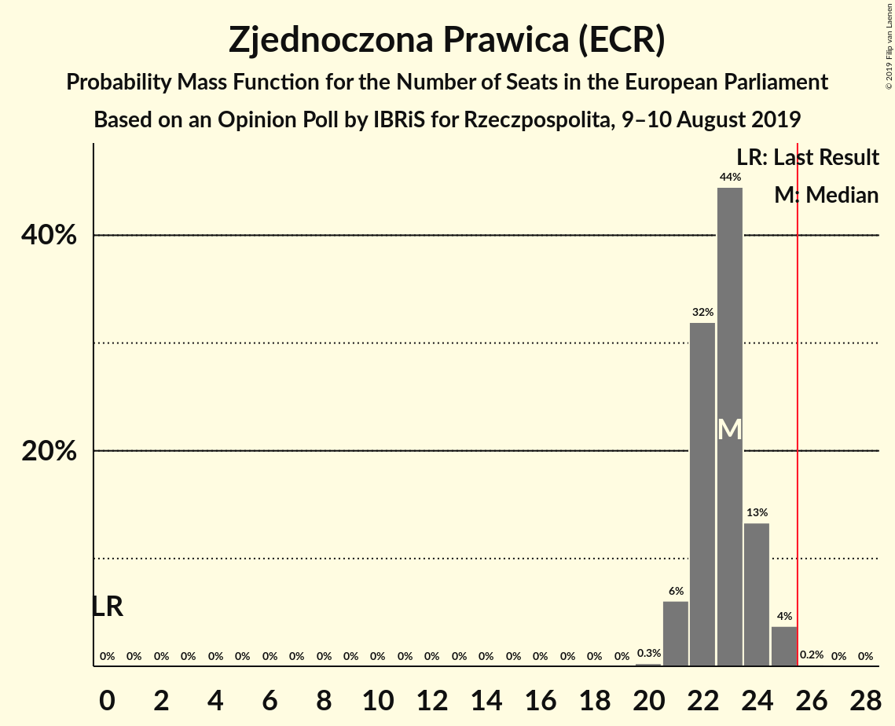

| Number of Seats | Probability | Accumulated | Special Marks |
|:---------------:|:-----------:|:-----------:|:-------------:|
| 0 | 0% | 100% | Last Result |
| 1 | 0% | 100% |  |
| 2 | 0% | 100% |  |
| 3 | 0% | 100% |  |
| 4 | 0% | 100% |  |
| 5 | 0% | 100% |  |
| 6 | 0% | 100% |  |
| 7 | 0% | 100% |  |
| 8 | 0% | 100% |  |
| 9 | 0% | 100% |  |
| 10 | 0% | 100% |  |
| 11 | 0% | 100% |  |
| 12 | 0% | 100% |  |
| 13 | 0% | 100% |  |
| 14 | 0% | 100% |  |
| 15 | 0% | 100% |  |
| 16 | 0% | 100% |  |
| 17 | 0% | 100% |  |
| 18 | 0% | 100% |  |
| 19 | 0% | 100% |  |
| 20 | 0.6% | 100% |  |
| 21 | 9% | 99.4% |  |
| 22 | 36% | 90% |  |
| 23 | 40% | 55% | Median |
| 24 | 13% | 14% |  |
| 25 | 2% | 2% |  |
| 26 | 0.1% | 0.1% | Majority |
| 27 | 0% | 0% |  |

### Koalicja Obywatelska (EPP)

*For a full overview of the results for this party, see the [Koalicja Obywatelska (EPP)](party-koalicjaobywatelskaepp.html) page.*

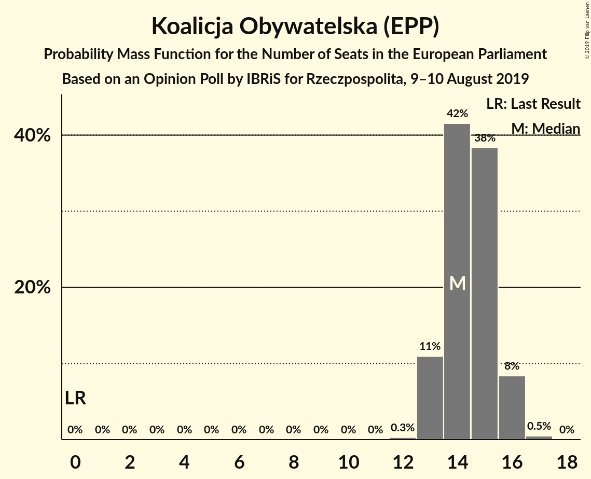

| Number of Seats | Probability | Accumulated | Special Marks |
|:---------------:|:-----------:|:-----------:|:-------------:|
| 0 | 0% | 100% | Last Result |
| 1 | 0% | 100% |  |
| 2 | 0% | 100% |  |
| 3 | 0% | 100% |  |
| 4 | 0% | 100% |  |
| 5 | 0% | 100% |  |
| 6 | 0% | 100% |  |
| 7 | 0% | 100% |  |
| 8 | 0% | 100% |  |
| 9 | 0% | 100% |  |
| 10 | 0% | 100% |  |
| 11 | 0% | 100% |  |
| 12 | 0.2% | 100% |  |
| 13 | 6% | 99.8% |  |
| 14 | 37% | 94% |  |
| 15 | 44% | 57% | Median |
| 16 | 12% | 13% |  |
| 17 | 0.8% | 0.9% |  |
| 18 | 0% | 0% |  |

### Lewica (S&D)

*For a full overview of the results for this party, see the [Lewica (S&D)](party-lewicasd.html) page.*

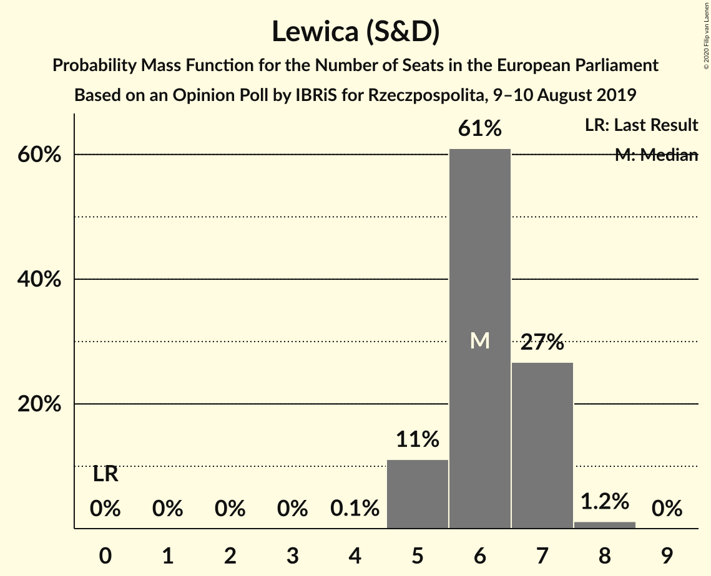

| Number of Seats | Probability | Accumulated | Special Marks |
|:---------------:|:-----------:|:-----------:|:-------------:|
| 0 | 0% | 100% | Last Result |
| 1 | 0% | 100% |  |
| 2 | 0% | 100% |  |
| 3 | 0% | 100% |  |
| 4 | 0.1% | 100% |  |
| 5 | 16% | 99.9% |  |
| 6 | 64% | 84% | Median |
| 7 | 20% | 21% |  |
| 8 | 0.6% | 0.6% |  |
| 9 | 0% | 0% |  |

### Koalicja Polska (EPP)

*For a full overview of the results for this party, see the [Koalicja Polska (EPP)](party-koalicjapolskaepp.html) page.*

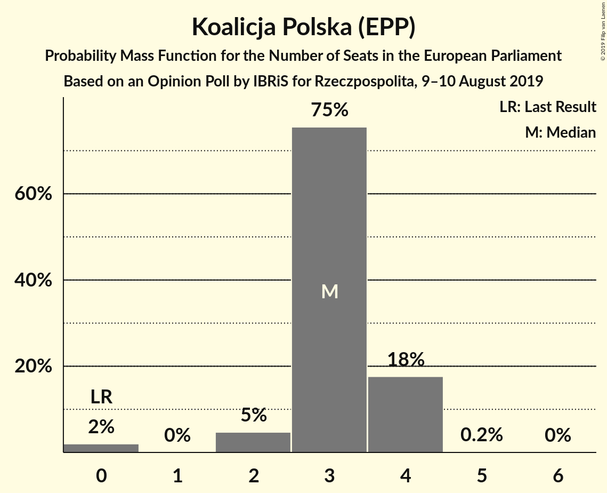

| Number of Seats | Probability | Accumulated | Special Marks |
|:---------------:|:-----------:|:-----------:|:-------------:|
| 0 | 1.1% | 100% | Last Result |
| 1 | 0% | 98.9% |  |
| 2 | 3% | 98.9% |  |
| 3 | 72% | 96% | Median |
| 4 | 24% | 24% |  |
| 5 | 0.2% | 0.2% |  |
| 6 | 0% | 0% |  |

### Konfederacja (NI)

*For a full overview of the results for this party, see the [Konfederacja (NI)](party-konfederacjani.html) page.*

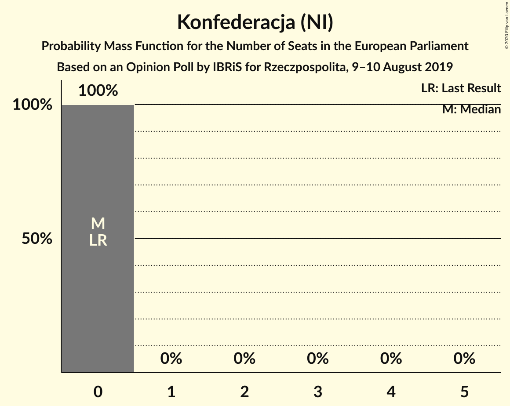

| Number of Seats | Probability | Accumulated | Special Marks |
|:---------------:|:-----------:|:-----------:|:-------------:|
| 0 | 100% | 100% | Last Result, Median |

### Bezpartyjni Samorządowcy (*)

*For a full overview of the results for this party, see the [Bezpartyjni Samorządowcy (*)](party-bezpartyjnisamorządowcy.html) page.*

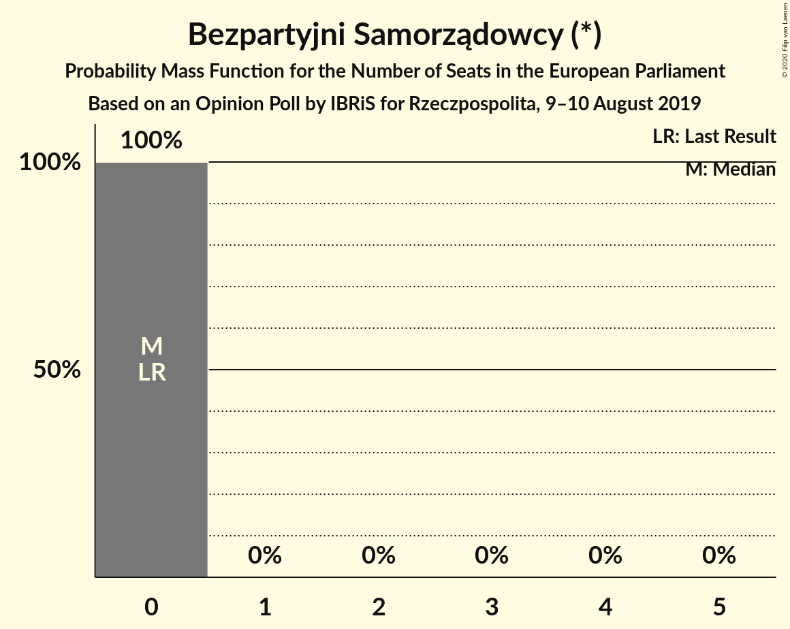

| Number of Seats | Probability | Accumulated | Special Marks |
|:---------------:|:-----------:|:-----------:|:-------------:|
| 0 | 100% | 100% | Last Result, Median |

## Coalitions

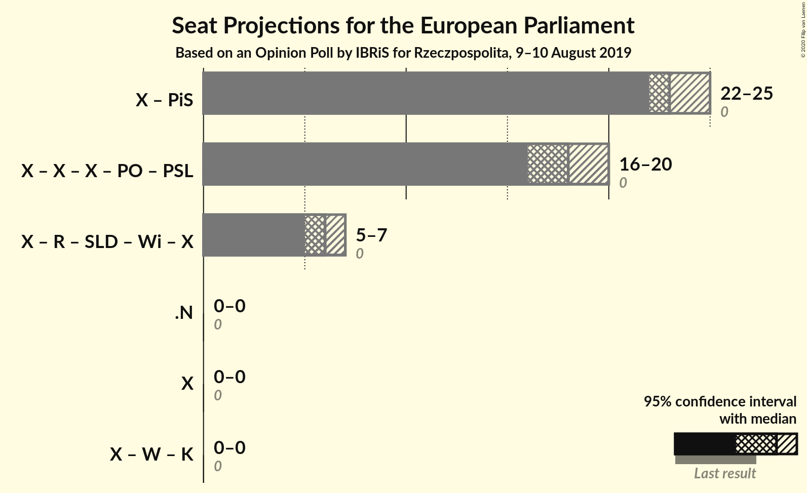

### Confidence Intervals

| Coalition | Last Result | Median | Majority? | 80% Confidence Interval | 90% Confidence Interval | 95% Confidence Interval | 99% Confidence Interval |
|:---------:|:-----------:|:------:|:---------:|:-----------------------:|:-----------------------:|:-----------------------:|:-----------------------:|
| Bezpartyjni Samorządowcy (*) | 0 | 0 | 0% | 0 | 0 | 0 | 0 |

### Bezpartyjni Samorządowcy (*)

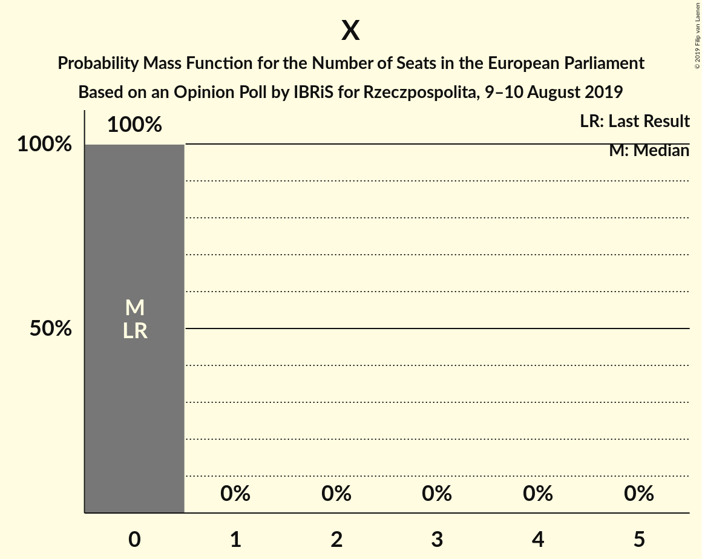

| Number of Seats | Probability | Accumulated | Special Marks |
|:---------------:|:-----------:|:-----------:|:-------------:|
| 0 | 100% | 100% | Last Result, Median |

## Technical Information

### Opinion Poll

+ **Polling firm:** IBRiS
+ **Commissioner(s):** Rzeczpospolita
+ **Fieldwork period:** 9–10 August 2019

### Calculations

+ **Sample size:** 1100
+ **Simulations done:** 1,048,576
+ **Error estimate:** 1.33%

