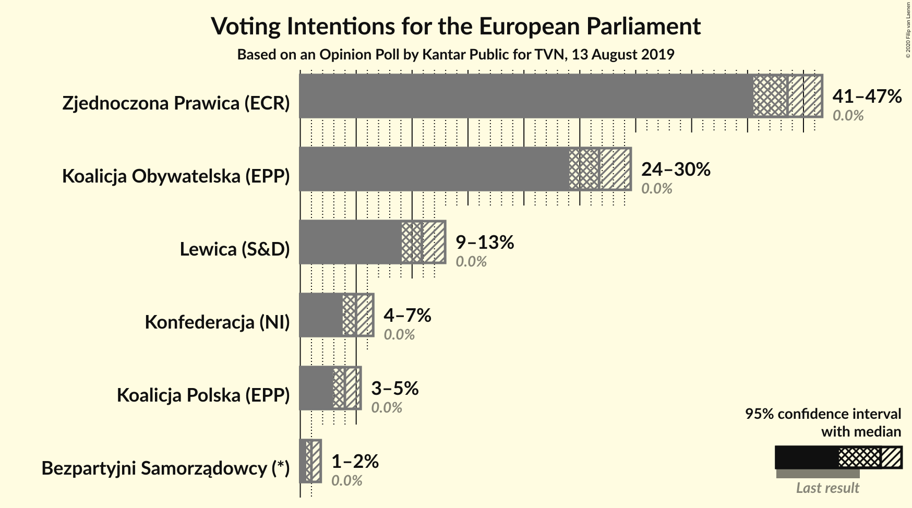
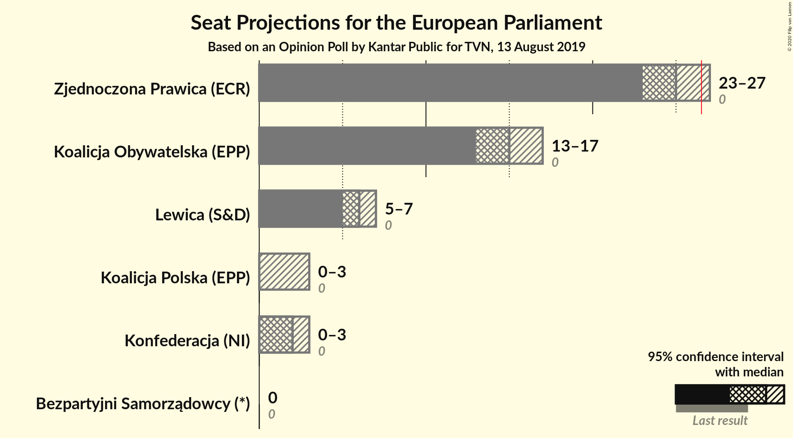
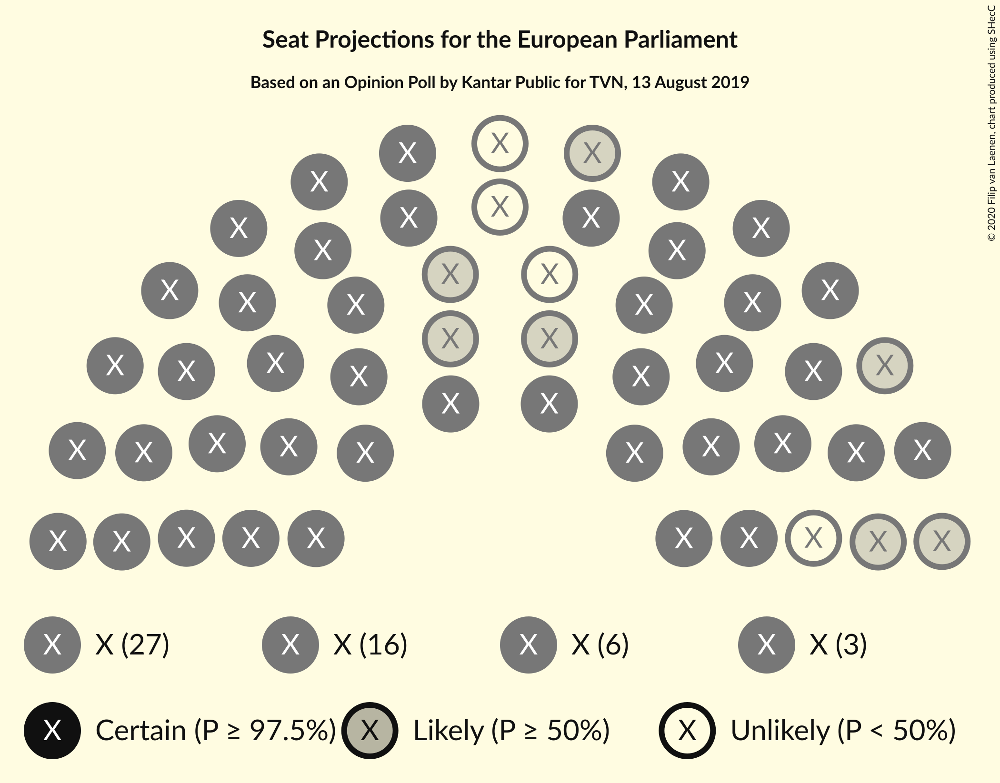
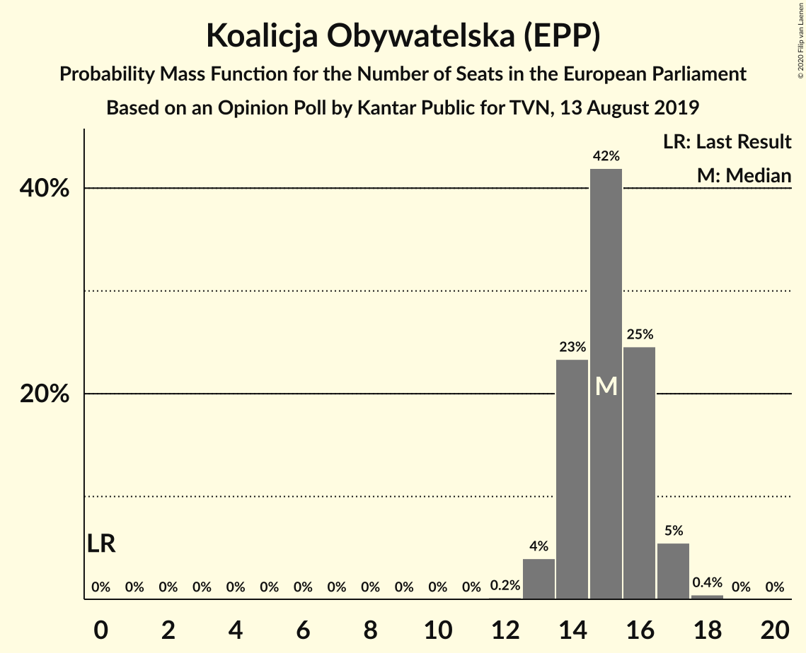
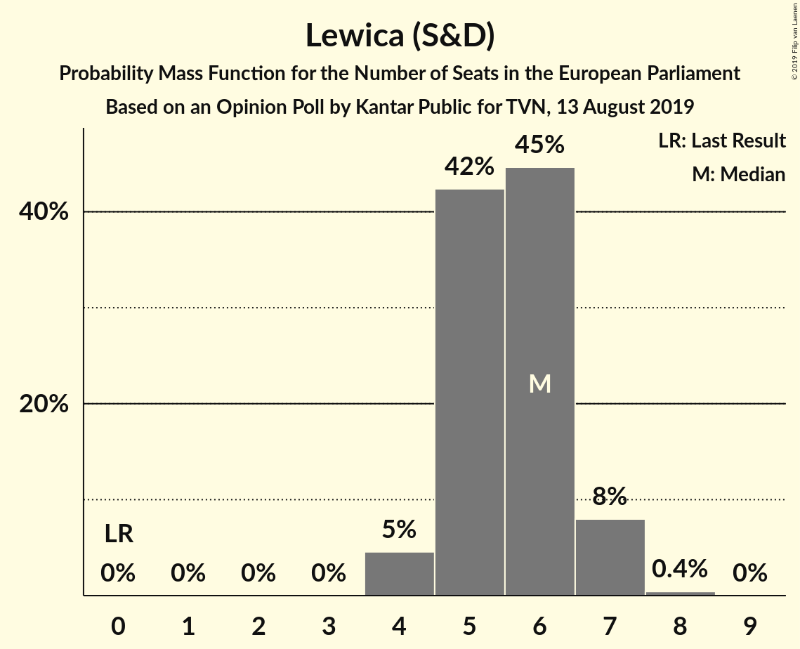
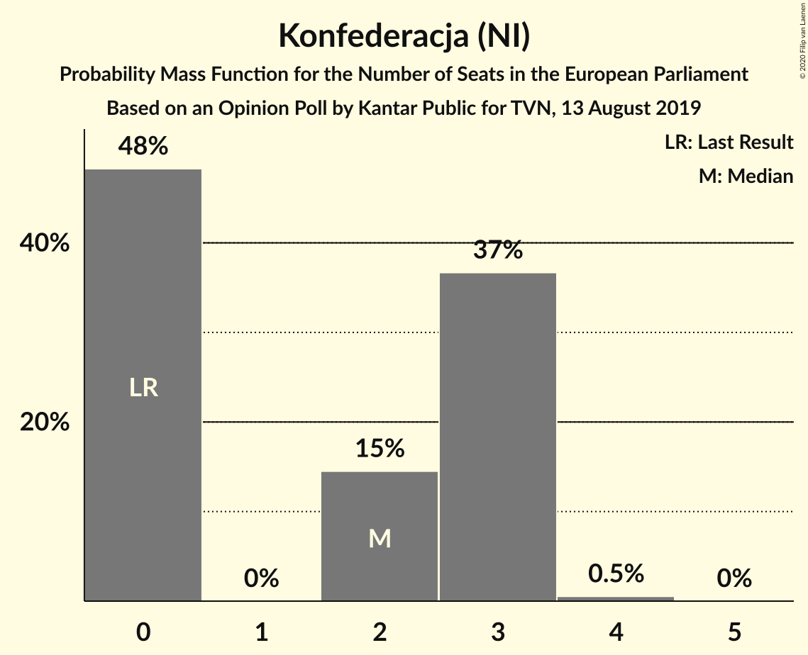
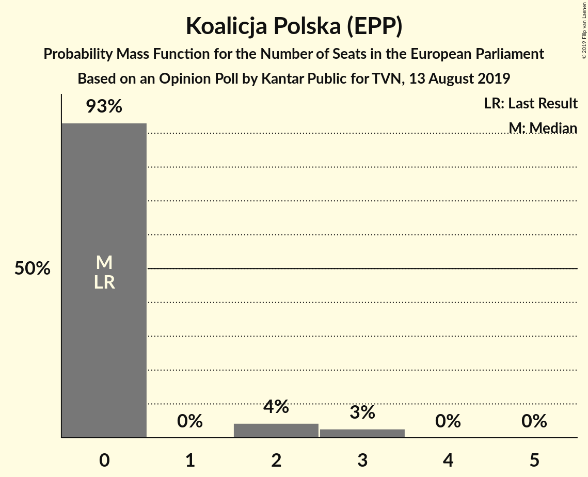
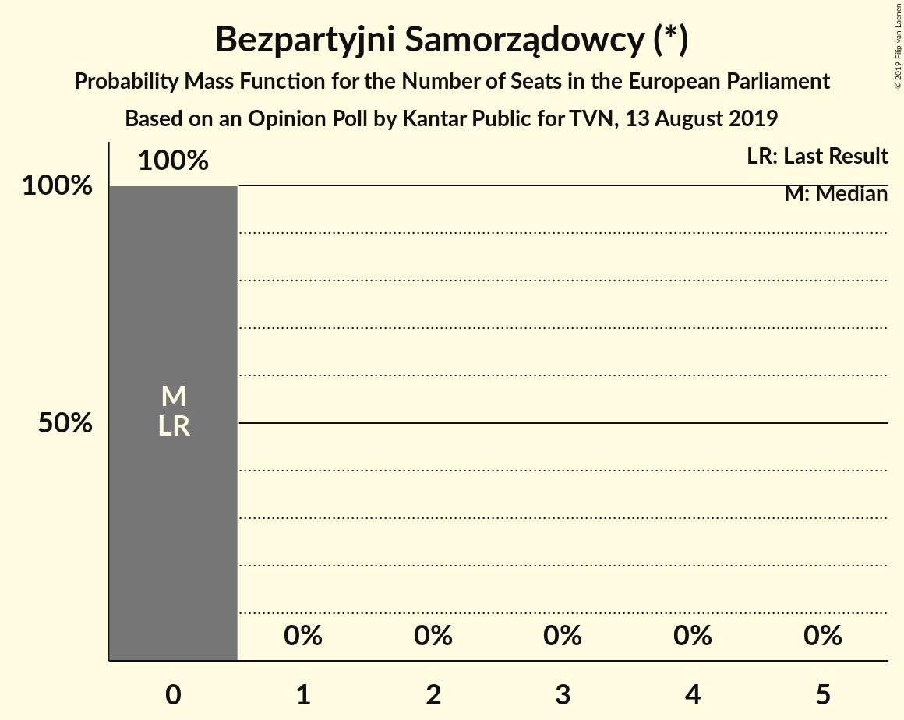
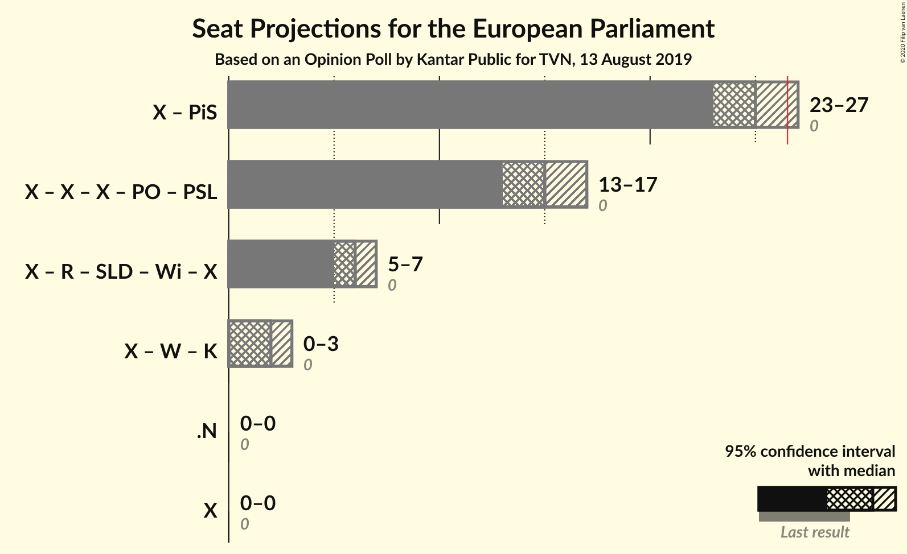
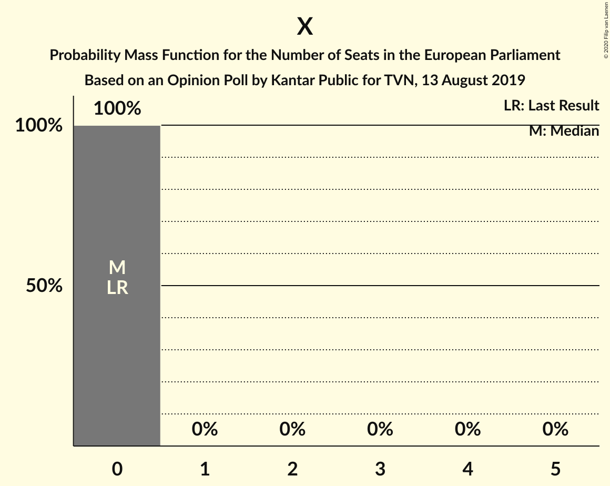

# Opinion Poll by Kantar Public for TVN, 13 August 2019

<a href="#voting-intentions">Voting Intentions</a> | <a href="#seats">Seats</a> | <a href="#coalitions">Coalitions</a> | <a href="#technical-information">Technical Information</a>

## Voting Intentions

### Confidence Intervals

| Party | Last Result | Poll Result | 80% Confidence Interval | 90% Confidence Interval | 95% Confidence Interval | 99% Confidence Interval |
|:-----:|:-----------:|:-----------:|:-----------------------:|:-----------------------:|:-----------------------:|:-----------------------:|
| Zjednoczona Prawica (ECR) | 0.0% | 43.6% | 41.6–45.6% |41.0–46.2% |40.5–46.7% |39.6–47.6% |
| Koalicja Obywatelska (EPP) | 0.0% | 26.7% | 25.0–28.6% |24.5–29.1% |24.1–29.6% |23.3–30.5% |
| Lewica (S&D) | 0.0% | 10.9% | 9.7–12.2% |9.4–12.6% |9.1–13.0% |8.6–13.6% |
| Konfederacja (NI) | 0.0% | 5.0% | 4.2–6.0% |4.0–6.3% |3.8–6.5% |3.5–7.0% |
| Koalicja Polska (EPP) | 0.0% | 4.0% | 3.3–4.9% |3.1–5.2% |2.9–5.4% |2.6–5.9% |
| Bezpartyjni Samorządowcy (*) | 0.0% | 1.0% | 0.7–1.5% |0.6–1.7% |0.5–1.8% |0.4–2.1% |

*Note:* The poll result column reflects the actual value used in the calculations. Published results may vary slightly, and in addition be rounded to fewer digits.

## Seats

### Confidence Intervals

| Party | Last Result | Median | 80% Confidence Interval | 90% Confidence Interval | 95% Confidence Interval | 99% Confidence Interval |
|:-----:|:-----------:|:------:|:-----------------------:|:-----------------------:|:-----------------------:|:-----------------------:|
| <a href="#zjednoczona-prawica-(ecr)">Zjednoczona Prawica (ECR)</a> | 0 | 24 | 23–26 |23–26 |22–27 |22–27 |
| <a href="#koalicja-obywatelska-(epp)">Koalicja Obywatelska (EPP)</a> | 0 | 15 | 14–16 |13–16 |13–17 |13–17 |
| <a href="#lewica-(s&d)">Lewica (S&D)</a> | 0 | 6 | 5–7 |5–7 |5–7 |4–7 |
| <a href="#konfederacja-(ni)">Konfederacja (NI)</a> | 0 | 2 | 0–3 |0–3 |0–3 |0–3 |
| <a href="#koalicja-polska-(epp)">Koalicja Polska (EPP)</a> | 0 | 0 | 0 |0–2 |0–2 |0–3 |
| <a href="#bezpartyjni-samorządowcy-(*)">Bezpartyjni Samorządowcy (*)</a> | 0 | 0 | 0 |0 |0 |0 |

### Zjednoczona Prawica (ECR)

*For a full overview of the results for this party, see the [Zjednoczona Prawica (ECR)](party-zjednoczonaprawicaecr.html) page.*

| Number of Seats | Probability | Accumulated | Special Marks |
|:---------------:|:-----------:|:-----------:|:-------------:|
| 0 | 0% | 100% | Last Result |
| 1 | 0% | 100% |  |
| 2 | 0% | 100% |  |
| 3 | 0% | 100% |  |
| 4 | 0% | 100% |  |
| 5 | 0% | 100% |  |
| 6 | 0% | 100% |  |
| 7 | 0% | 100% |  |
| 8 | 0% | 100% |  |
| 9 | 0% | 100% |  |
| 10 | 0% | 100% |  |
| 11 | 0% | 100% |  |
| 12 | 0% | 100% |  |
| 13 | 0% | 100% |  |
| 14 | 0% | 100% |  |
| 15 | 0% | 100% |  |
| 16 | 0% | 100% |  |
| 17 | 0% | 100% |  |
| 18 | 0% | 100% |  |
| 19 | 0% | 100% |  |
| 20 | 0% | 100% |  |
| 21 | 0.4% | 100% |  |
| 22 | 4% | 99.6% |  |
| 23 | 18% | 95% |  |
| 24 | 32% | 77% | Median |
| 25 | 29% | 45% |  |
| 26 | 14% | 16% | Majority |
| 27 | 2% | 3% |  |
| 28 | 0.2% | 0.2% |  |
| 29 | 0% | 0% |  |

### Koalicja Obywatelska (EPP)

*For a full overview of the results for this party, see the [Koalicja Obywatelska (EPP)](party-koalicjaobywatelskaepp.html) page.*

| Number of Seats | Probability | Accumulated | Special Marks |
|:---------------:|:-----------:|:-----------:|:-------------:|
| 0 | 0% | 100% | Last Result |
| 1 | 0% | 100% |  |
| 2 | 0% | 100% |  |
| 3 | 0% | 100% |  |
| 4 | 0% | 100% |  |
| 5 | 0% | 100% |  |
| 6 | 0% | 100% |  |
| 7 | 0% | 100% |  |
| 8 | 0% | 100% |  |
| 9 | 0% | 100% |  |
| 10 | 0% | 100% |  |
| 11 | 0% | 100% |  |
| 12 | 0.4% | 100% |  |
| 13 | 7% | 99.6% |  |
| 14 | 32% | 92% |  |
| 15 | 40% | 60% | Median |
| 16 | 17% | 20% |  |
| 17 | 3% | 3% |  |
| 18 | 0.1% | 0.1% |  |
| 19 | 0% | 0% |  |

### Lewica (S&D)

*For a full overview of the results for this party, see the [Lewica (S&D)](party-lewicasd.html) page.*

| Number of Seats | Probability | Accumulated | Special Marks |
|:---------------:|:-----------:|:-----------:|:-------------:|
| 0 | 0% | 100% | Last Result |
| 1 | 0% | 100% |  |
| 2 | 0% | 100% |  |
| 3 | 0% | 100% |  |
| 4 | 1.3% | 100% |  |
| 5 | 34% | 98.7% |  |
| 6 | 55% | 65% | Median |
| 7 | 10% | 10% |  |
| 8 | 0.3% | 0.3% |  |
| 9 | 0% | 0% |  |

### Konfederacja (NI)

*For a full overview of the results for this party, see the [Konfederacja (NI)](party-konfederacjani.html) page.*

| Number of Seats | Probability | Accumulated | Special Marks |
|:---------------:|:-----------:|:-----------:|:-------------:|
| 0 | 48% | 100% | Last Result |
| 1 | 0% | 52% |  |
| 2 | 19% | 52% | Median |
| 3 | 33% | 33% |  |
| 4 | 0.3% | 0.3% |  |
| 5 | 0% | 0% |  |

### Koalicja Polska (EPP)

*For a full overview of the results for this party, see the [Koalicja Polska (EPP)](party-koalicjapolskaepp.html) page.*

| Number of Seats | Probability | Accumulated | Special Marks |
|:---------------:|:-----------:|:-----------:|:-------------:|
| 0 | 93% | 100% | Last Result, Median |
| 1 | 0% | 7% |  |
| 2 | 5% | 7% |  |
| 3 | 2% | 2% |  |
| 4 | 0% | 0% |  |

### Bezpartyjni Samorządowcy (*)

*For a full overview of the results for this party, see the [Bezpartyjni Samorządowcy (*)](party-bezpartyjnisamorządowcy.html) page.*

| Number of Seats | Probability | Accumulated | Special Marks |
|:---------------:|:-----------:|:-----------:|:-------------:|
| 0 | 100% | 100% | Last Result, Median |

## Coalitions

### Confidence Intervals

| Coalition | Last Result | Median | Majority? | 80% Confidence Interval | 90% Confidence Interval | 95% Confidence Interval | 99% Confidence Interval |
|:---------:|:-----------:|:------:|:---------:|:-----------------------:|:-----------------------:|:-----------------------:|:-----------------------:|
| Bezpartyjni Samorządowcy (*) | 0 | 0 | 0% | 0 | 0 | 0 | 0 |

### Bezpartyjni Samorządowcy (*)

| Number of Seats | Probability | Accumulated | Special Marks |
|:---------------:|:-----------:|:-----------:|:-------------:|
| 0 | 100% | 100% | Last Result, Median |

## Technical Information

### Opinion Poll

+ **Polling firm:** Kantar Public
+ **Commissioner(s):** TVN
+ **Fieldwork period:** 13 August 2019

### Calculations

+ **Sample size:** 1003
+ **Simulations done:** 1,048,576
+ **Error estimate:** 0.44%

