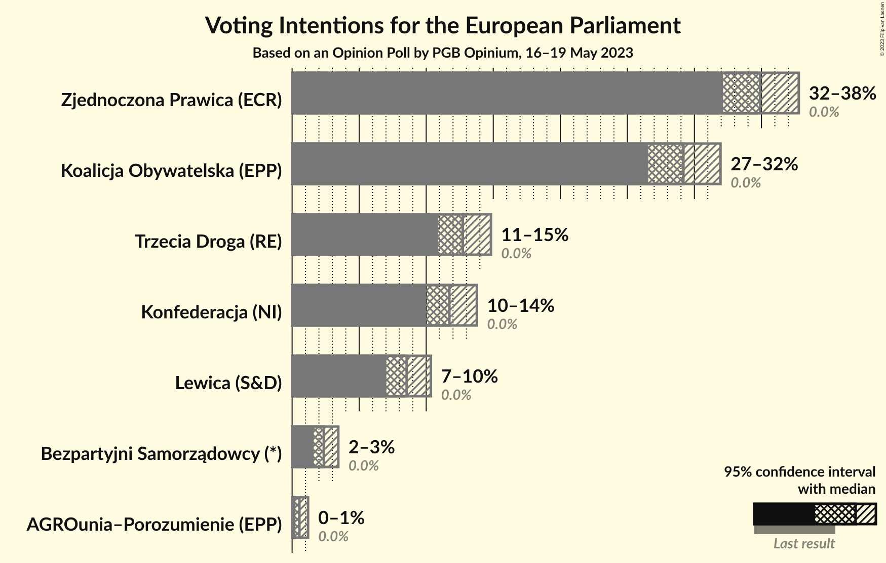
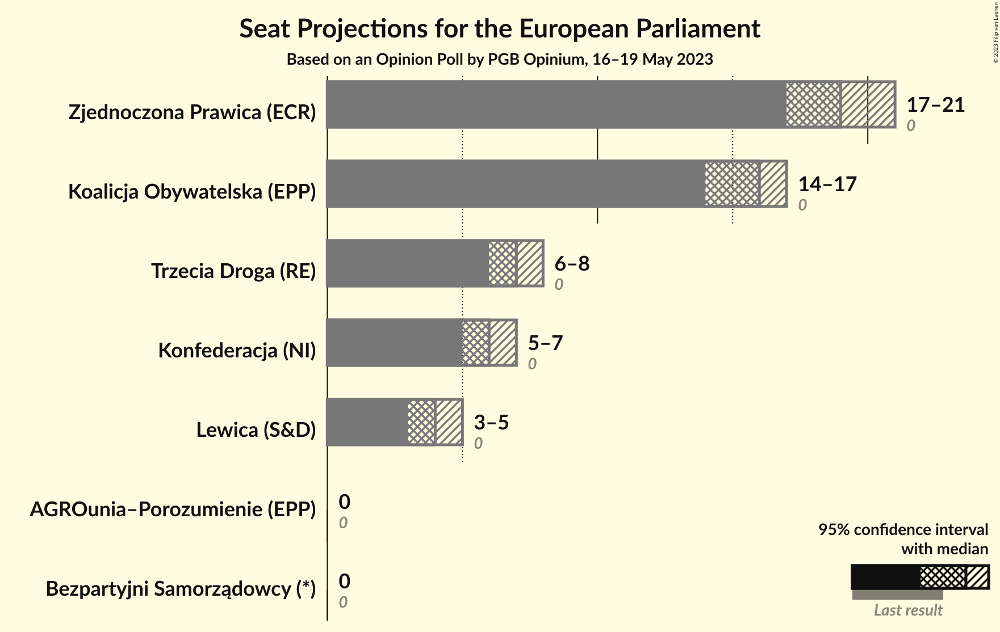
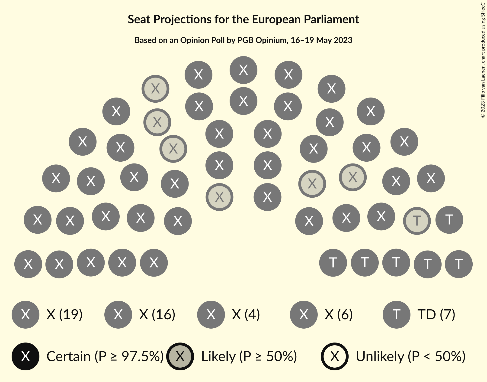

# Opinion Poll by PGB Opinium, 16–19 May 2023

<a href="#voting-intentions">Voting Intentions</a> | <a href="#seats">Seats</a> | <a href="#coalitions">Coalitions</a> | <a href="#technical-information">Technical Information</a>

## Voting Intentions

### Confidence Intervals

| Party | Last Result | Poll Result | 80% Confidence Interval | 90% Confidence Interval | 95% Confidence Interval | 99% Confidence Interval |
|:-----:|:-----------:|:-----------:|:-----------------------:|:-----------------------:|:-----------------------:|:-----------------------:|
| Zjednoczona Prawica (ECR) | 0.0% | 32.0% | 30.3–33.8% |29.9–34.3% |29.4–34.7% |28.6–35.6% |
| Koalicja Obywatelska (EPP) | 0.0% | 26.8% | 25.2–28.5% |24.7–28.9% |24.3–29.4% |23.6–30.2% |
| Trzecia Droga (RE) | 0.0% | 11.7% | 10.6–13.0% |10.2–13.3% |10.0–13.6% |9.5–14.3% |
| Konfederacja (NI) | 0.0% | 10.8% | 9.7–12.0% |9.4–12.3% |9.1–12.7% |8.6–13.3% |
| Polska 2050 (RE) | N/A | 8.3% | 7.3–9.4% |7.0–9.7% |6.8–10.0% |6.4–10.5% |
| Lewica (S&D) | 0.0% | 7.8% | 6.9–8.9% |6.7–9.2% |6.4–9.5% |6.0–10.1% |
| Bezpartyjni Samorządowcy (*) | 0.0% | 2.2% | 1.7–2.8% |1.6–3.0% |1.5–3.2% |1.3–3.5% |
| AGROunia–Porozumienie (EPP) | 0.0% | 0.5% | 0.3–0.9% |0.3–1.0% |0.2–1.1% |0.2–1.3% |

*Note:* The poll result column reflects the actual value used in the calculations. Published results may vary slightly, and in addition be rounded to fewer digits.

## Seats

### Confidence Intervals

| Party | Last Result | Median | 80% Confidence Interval | 90% Confidence Interval | 95% Confidence Interval | 99% Confidence Interval |
|:-----:|:-----------:|:------:|:-----------------------:|:-----------------------:|:-----------------------:|:-----------------------:|
| <a href="#zjednoczona-prawica-(ecr)">Zjednoczona Prawica (ECR)</a> | 0 | 18 | 17–19 |16–19 |16–19 |16–19 |
| <a href="#koalicja-obywatelska-(epp)">Koalicja Obywatelska (EPP)</a> | 0 | 15 | 14–16 |14–16 |13–16 |13–16 |
| <a href="#trzecia-droga-(re)">Trzecia Droga (RE)</a> | 0 | 6 | 5–7 |5–7 |5–7 |5–8 |
| <a href="#konfederacja-(ni)">Konfederacja (NI)</a> | 0 | 5 | 5–6 |5–6 |5–7 |4–7 |
| <a href="#polska-2050-(re)">Polska 2050 (RE)</a> | N/A | 4 | 4–5 |4–5 |3–5 |3–6 |
| <a href="#lewica-(s&d)">Lewica (S&D)</a> | 0 | 4 | 3–5 |3–5 |3–5 |3–5 |
| <a href="#bezpartyjni-samorządowcy-(*)">Bezpartyjni Samorządowcy (*)</a> | 0 | 0 | 0 |0 |0 |0 |
| <a href="#agrounia–porozumienie-(epp)">AGROunia–Porozumienie (EPP)</a> | 0 | 0 | 0 |0 |0 |0 |

