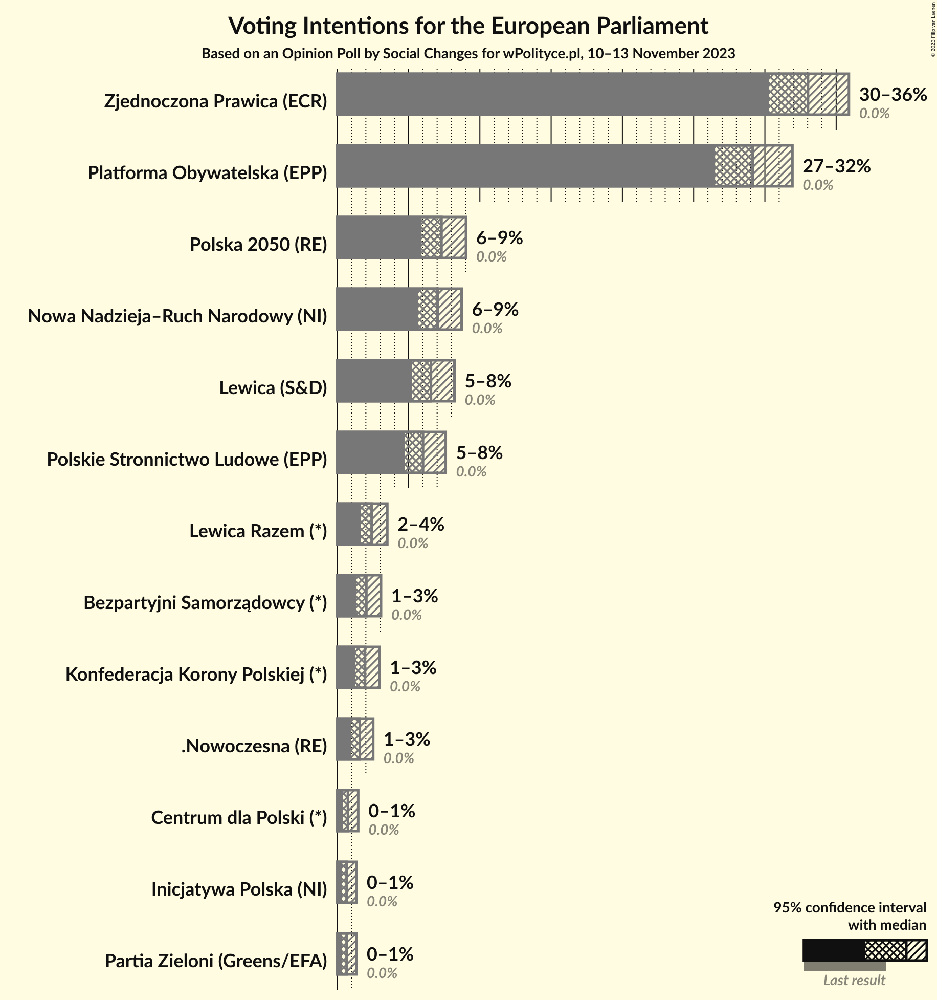
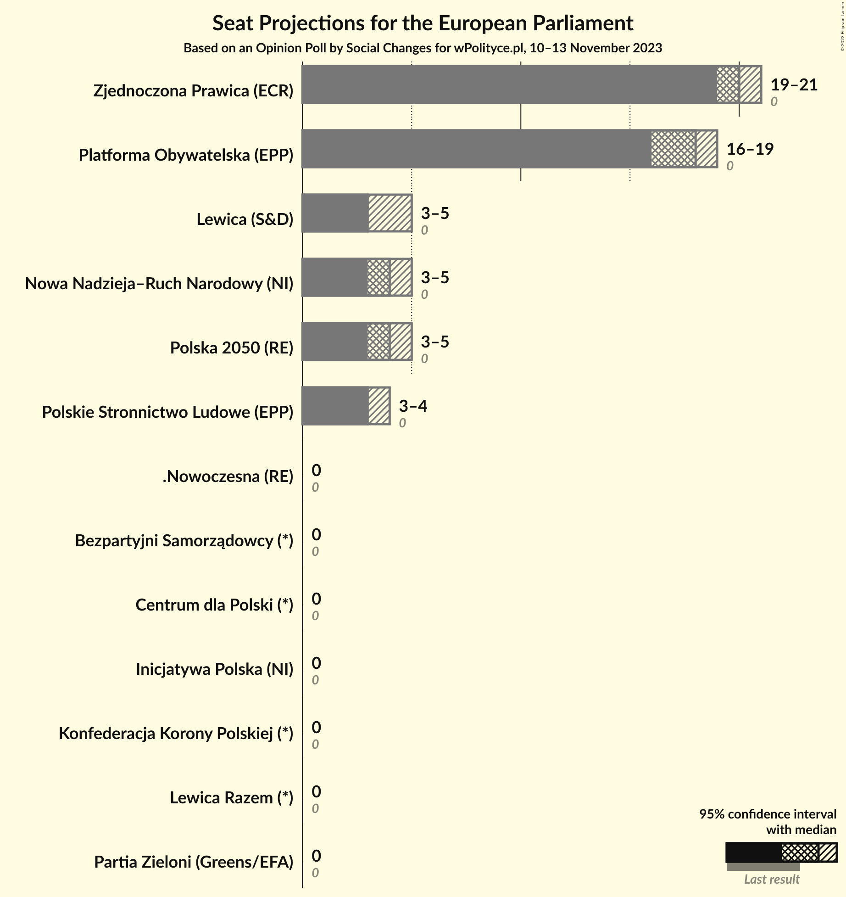
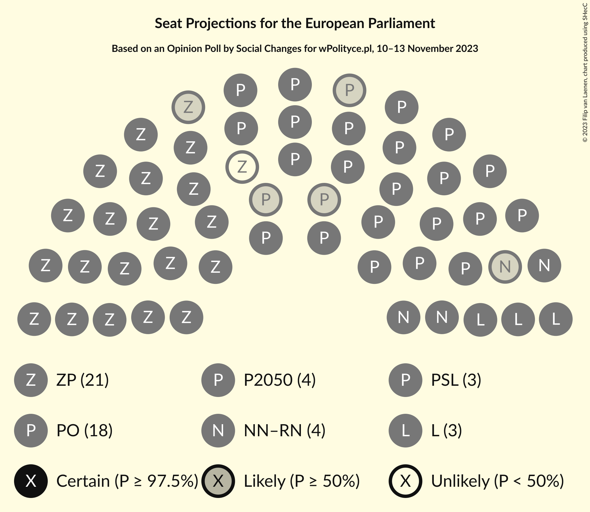

# Opinion Poll by Social Changes for wPolityce.pl, 10–13 November 2023

<a href="#voting-intentions">Voting Intentions</a> | <a href="#seats">Seats</a> | <a href="#coalitions">Coalitions</a> | <a href="#technical-information">Technical Information</a>

## Voting Intentions

### Confidence Intervals

| Party | Last Result | Poll Result | 80% Confidence Interval | 90% Confidence Interval | 95% Confidence Interval | 99% Confidence Interval |
|:-----:|:-----------:|:-----------:|:-----------------------:|:-----------------------:|:-----------------------:|:-----------------------:|
| Zjednoczona Prawica (ECR) | 0.0% | 33.0% | 31.2–34.9% |30.7–35.4% |30.3–35.9% |29.4–36.8% |
| Platforma Obywatelska (EPP) | 0.0% | 29.1% | 27.4–31.0% |26.9–31.5% |26.5–31.9% |25.7–32.8% |
| Polska 2050 (RE) | 0.0% | 7.3% | 6.4–8.4% |6.1–8.7% |5.9–9.0% |5.5–9.6% |
| Nowa Nadzieja–Ruch Narodowy (NI) | 0.0% | 7.0% | 6.1–8.1% |5.9–8.4% |5.7–8.7% |5.2–9.3% |
| Nowa Lewica (S&D) | N/A | 6.6% | 5.7–7.6% |5.4–7.9% |5.2–8.2% |4.8–8.7% |
| Polskie Stronnictwo Ludowe (EPP) | 0.0% | 6.0% | 5.2–7.0% |4.9–7.3% |4.7–7.6% |4.4–8.1% |
| Lewica Razem (*) | 0.0% | 2.4% | 1.9–3.1% |1.8–3.3% |1.6–3.5% |1.4–3.9% |
| Bezpartyjni Samorządowcy (*) | 0.0% | 2.0% | 1.6–2.7% |1.4–2.9% |1.3–3.1% |1.2–3.4% |
| Konfederacja Korony Polskiej (ID) | 0.0% | 1.9% | 1.5–2.6% |1.4–2.8% |1.3–3.0% |1.1–3.3% |
| .Nowoczesna (RE) | 0.0% | 1.6% | 1.2–2.2% |1.1–2.4% |1.0–2.5% |0.8–2.8% |
| Centrum dla Polski (*) | 0.0% | 0.7% | 0.5–1.2% |0.4–1.3% |0.4–1.5% |0.3–1.7% |
| Inicjatywa Polska (NI) | 0.0% | 0.6% | 0.4–1.1% |0.4–1.2% |0.3–1.3% |0.2–1.6% |
| Partia Zieloni (Greens/EFA) | 0.0% | 0.6% | 0.4–1.1% |0.4–1.2% |0.3–1.3% |0.2–1.6% |

*Note:* The poll result column reflects the actual value used in the calculations. Published results may vary slightly, and in addition be rounded to fewer digits.

## Seats

### Confidence Intervals

| Party | Last Result | Median | 80% Confidence Interval | 90% Confidence Interval | 95% Confidence Interval | 99% Confidence Interval |
|:-----:|:-----------:|:------:|:-----------------------:|:-----------------------:|:-----------------------:|:-----------------------:|
| <a href="#zjednoczona-prawica-(ecr)">Zjednoczona Prawica (ECR)</a> | 0 | 18 | 17–19 |17–19 |17–20 |16–20 |
| <a href="#platforma-obywatelska-(epp)">Platforma Obywatelska (EPP)</a> | 0 | 17 | 16–18 |15–18 |15–18 |15–19 |
| <a href="#polska-2050-(re)">Polska 2050 (RE)</a> | 0 | 4 | 4–5 |4–5 |3–5 |3–5 |
| <a href="#nowa-nadzieja–ruch-narodowy-(ni)">Nowa Nadzieja–Ruch Narodowy (NI)</a> | 0 | 4 | 3–5 |3–5 |3–5 |3–5 |
| <a href="#nowa-lewica-(s&d)">Nowa Lewica (S&D)</a> | N/A | 3 | 3–4 |3–4 |3–5 |3–5 |
| <a href="#polskie-stronnictwo-ludowe-(epp)">Polskie Stronnictwo Ludowe (EPP)</a> | 0 | 3 | 3–4 |3–4 |3–4 |2–5 |
| <a href="#lewica-razem-(*)">Lewica Razem (*)</a> | 0 | 1 | 1–2 |1–2 |1–2 |0–2 |
| <a href="#bezpartyjni-samorządowcy-(*)">Bezpartyjni Samorządowcy (*)</a> | 0 | 0 | 0 |0 |0 |0 |
| <a href="#konfederacja-korony-polskiej-(id)">Konfederacja Korony Polskiej (ID)</a> | 0 | 1 | 0–1 |0–1 |0–1 |0–1 |
| <a href="#.nowoczesna-(re)">.Nowoczesna (RE)</a> | 0 | 1 | 0–1 |0–1 |0–1 |0–1 |
| <a href="#centrum-dla-polski-(*)">Centrum dla Polski (*)</a> | 0 | 0 | 0 |0–1 |0–1 |0–1 |
| <a href="#inicjatywa-polska-(ni)">Inicjatywa Polska (NI)</a> | 0 | 0 | 0 |0 |0 |0 |
| <a href="#partia-zieloni-(greens/efa)">Partia Zieloni (Greens/EFA)</a> | 0 | 0 | 0 |0 |0 |0 |

