# Opinion Poll by Portland Communications, 24–31 January 2024

<a href="#voting-intentions">Voting Intentions</a> | <a href="#seats">Seats</a> | <a href="#coalitions">Coalitions</a> | <a href="#technical-information">Technical Information</a>

## Voting Intentions

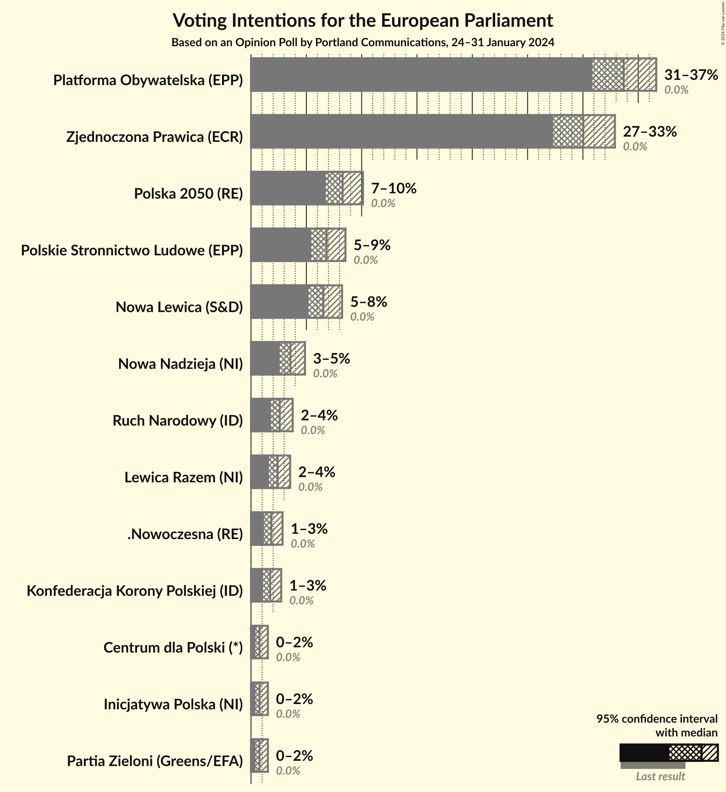

### Confidence Intervals

| Party | Last Result | Poll Result | 80% Confidence Interval | 90% Confidence Interval | 95% Confidence Interval | 99% Confidence Interval |
|:-----:|:-----------:|:-----------:|:-----------------------:|:-----------------------:|:-----------------------:|:-----------------------:|
| Platforma Obywatelska (EPP) | 0.0% | 33.7% | 31.8–35.6% |31.3–36.2% |30.9–36.6% |30.0–37.6% |
| Zjednoczona Prawica (ECR) | 0.0% | 30.0% | 28.2–31.9% |27.7–32.4% |27.3–32.9% |26.5–33.8% |
| Polska 2050 (RE) | 0.0% | 8.3% | 7.3–9.5% |7.0–9.8% |6.8–10.1% |6.3–10.7% |
| Polskie Stronnictwo Ludowe (EPP) | 0.0% | 6.8% | 5.9–7.9% |5.7–8.3% |5.4–8.5% |5.0–9.1% |
| Nowa Lewica (S&D) | 0.0% | 6.5% | 5.7–7.6% |5.4–8.0% |5.2–8.2% |4.8–8.8% |
| Nowa Nadzieja (NI) | 0.0% | 3.6% | 2.9–4.4% |2.7–4.7% |2.6–4.9% |2.3–5.3% |
| Ruch Narodowy (ID) | 0.0% | 2.6% | 2.1–3.4% |1.9–3.6% |1.8–3.8% |1.6–4.2% |
| Lewica Razem (NI) | 0.0% | 2.4% | 1.9–3.1% |1.8–3.4% |1.6–3.5% |1.4–3.9% |
| .Nowoczesna (RE) | 0.0% | 1.8% | 1.4–2.5% |1.3–2.7% |1.2–2.9% |1.0–3.2% |
| Konfederacja Korony Polskiej (ID) | 0.0% | 1.7% | 1.3–2.4% |1.2–2.6% |1.1–2.7% |0.9–3.1% |
| Centrum dla Polski (*) | 0.0% | 0.8% | 0.5–1.2% |0.4–1.4% |0.4–1.5% |0.3–1.8% |
| Inicjatywa Polska (NI) | 0.0% | 0.8% | 0.5–1.2% |0.4–1.4% |0.4–1.5% |0.3–1.8% |
| Partia Zieloni (Greens/EFA) | 0.0% | 0.8% | 0.5–1.2% |0.4–1.4% |0.4–1.5% |0.3–1.8% |

*Note:* The poll result column reflects the actual value used in the calculations. Published results may vary slightly, and in addition be rounded to fewer digits.

## Seats

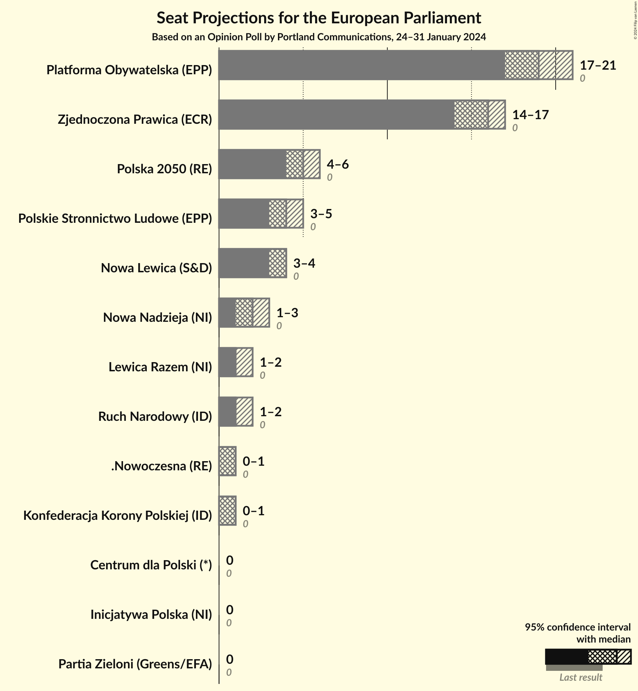

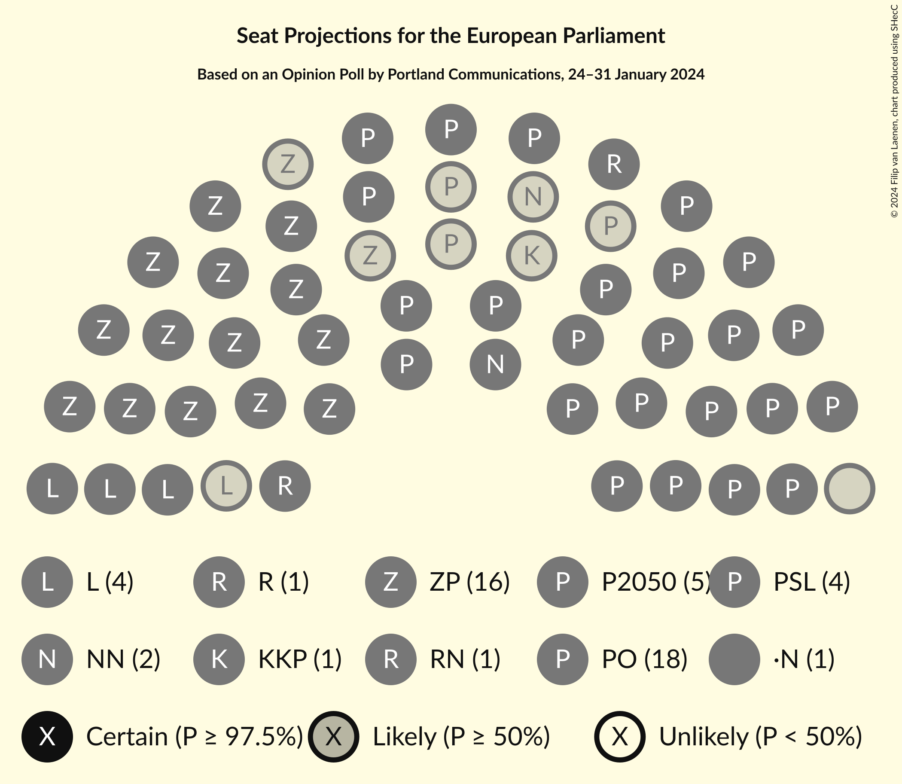

### Confidence Intervals

| Party | Last Result | Median | 80% Confidence Interval | 90% Confidence Interval | 95% Confidence Interval | 99% Confidence Interval |
|:-----:|:-----------:|:------:|:-----------------------:|:-----------------------:|:-----------------------:|:-----------------------:|
| <a href="#platforma-obywatelska-(epp)">Platforma Obywatelska (EPP)</a> | 0 | 19 | 18–20 |18–20 |17–21 |17–22 |
| <a href="#zjednoczona-prawica-(ecr)">Zjednoczona Prawica (ECR)</a> | 0 | 16 | 15–17 |15–17 |14–17 |14–18 |
| <a href="#polska-2050-(re)">Polska 2050 (RE)</a> | 0 | 5 | 4–6 |4–6 |4–6 |3–6 |
| <a href="#polskie-stronnictwo-ludowe-(epp)">Polskie Stronnictwo Ludowe (EPP)</a> | 0 | 4 | 3–4 |3–5 |3–5 |3–5 |
| <a href="#nowa-lewica-(s&d)">Nowa Lewica (S&D)</a> | 0 | 4 | 3–4 |3–4 |3–4 |2–5 |
| <a href="#nowa-nadzieja-(ni)">Nowa Nadzieja (NI)</a> | 0 | 2 | 2–3 |1–3 |1–3 |1–3 |
| <a href="#ruch-narodowy-(id)">Ruch Narodowy (ID)</a> | 0 | 1 | 1–2 |1–2 |1–2 |0–3 |
| <a href="#lewica-razem-(ni)">Lewica Razem (NI)</a> | 0 | 1 | 1–2 |1–2 |1–2 |0–2 |
| <a href="#.nowoczesna-(re)">.Nowoczesna (RE)</a> | 0 | 1 | 0–1 |0–1 |0–1 |0–2 |
| <a href="#konfederacja-korony-polskiej-(id)">Konfederacja Korony Polskiej (ID)</a> | 0 | 1 | 0–1 |0–1 |0–1 |0–2 |
| <a href="#centrum-dla-polski-(*)">Centrum dla Polski (*)</a> | 0 | 0 | 0 |0 |0 |0 |
| <a href="#inicjatywa-polska-(ni)">Inicjatywa Polska (NI)</a> | 0 | 0 | 0 |0 |0 |0 |
| <a href="#partia-zieloni-(greens/efa)">Partia Zieloni (Greens/EFA)</a> | 0 | 0 | 0 |0 |0 |0 |

### Platforma Obywatelska (EPP)

*For a full overview of the results for this party, see the [Platforma Obywatelska (EPP)](party-platformaobywatelskaepp.html) page.*

| Number of Seats | Probability | Accumulated | Special Marks |
|:---------------:|:-----------:|:-----------:|:-------------:|
| 0 | 0% | 100% | Last Result |
| 1 | 0% | 100% |  |
| 2 | 0% | 100% |  |
| 3 | 0% | 100% |  |
| 4 | 0% | 100% |  |
| 5 | 0% | 100% |  |
| 6 | 0% | 100% |  |
| 7 | 0% | 100% |  |
| 8 | 0% | 100% |  |
| 9 | 0% | 100% |  |
| 10 | 0% | 100% |  |
| 11 | 0% | 100% |  |
| 12 | 0% | 100% |  |
| 13 | 0% | 100% |  |
| 14 | 0% | 100% |  |
| 15 | 0% | 100% |  |
| 16 | 0.1% | 100% |  |
| 17 | 4% | 99.9% |  |
| 18 | 43% | 96% |  |
| 19 | 17% | 53% | Median |
| 20 | 34% | 36% |  |
| 21 | 2% | 3% |  |
| 22 | 0.9% | 0.9% |  |
| 23 | 0% | 0% |  |

### Zjednoczona Prawica (ECR)

*For a full overview of the results for this party, see the [Zjednoczona Prawica (ECR)](party-zjednoczonaprawicaecr.html) page.*

| Number of Seats | Probability | Accumulated | Special Marks |
|:---------------:|:-----------:|:-----------:|:-------------:|
| 0 | 0% | 100% | Last Result |
| 1 | 0% | 100% |  |
| 2 | 0% | 100% |  |
| 3 | 0% | 100% |  |
| 4 | 0% | 100% |  |
| 5 | 0% | 100% |  |
| 6 | 0% | 100% |  |
| 7 | 0% | 100% |  |
| 8 | 0% | 100% |  |
| 9 | 0% | 100% |  |
| 10 | 0% | 100% |  |
| 11 | 0% | 100% |  |
| 12 | 0% | 100% |  |
| 13 | 0% | 100% |  |
| 14 | 4% | 100% |  |
| 15 | 28% | 96% |  |
| 16 | 34% | 67% | Median |
| 17 | 31% | 33% |  |
| 18 | 2% | 2% |  |
| 19 | 0.3% | 0.3% |  |
| 20 | 0% | 0% |  |

### Polska 2050 (RE)

*For a full overview of the results for this party, see the [Polska 2050 (RE)](party-polska2050re.html) page.*

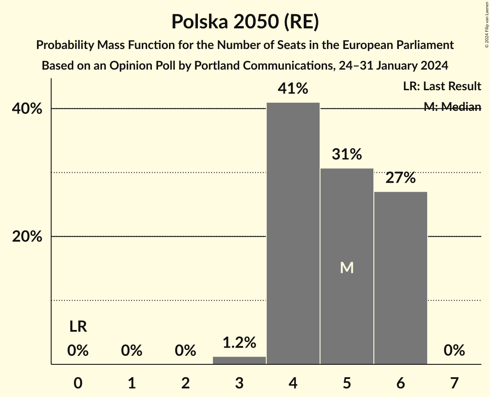

| Number of Seats | Probability | Accumulated | Special Marks |
|:---------------:|:-----------:|:-----------:|:-------------:|
| 0 | 0% | 100% | Last Result |
| 1 | 0% | 100% |  |
| 2 | 0% | 100% |  |
| 3 | 1.2% | 100% |  |
| 4 | 41% | 98.8% |  |
| 5 | 31% | 58% | Median |
| 6 | 27% | 27% |  |
| 7 | 0% | 0% |  |

### Polskie Stronnictwo Ludowe (EPP)

*For a full overview of the results for this party, see the [Polskie Stronnictwo Ludowe (EPP)](party-polskiestronnictwoludoweepp.html) page.*

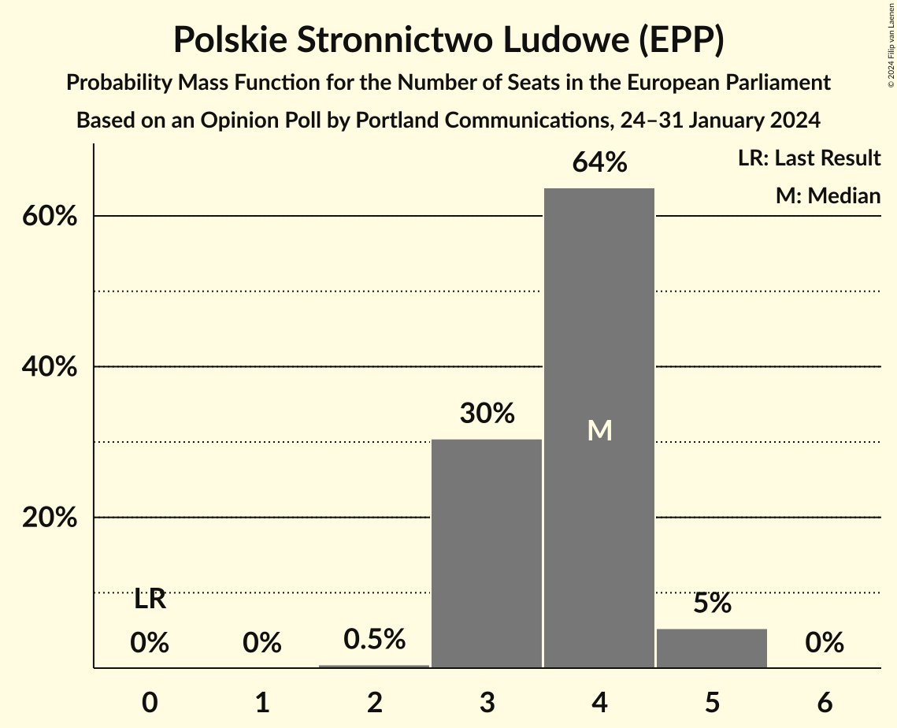

| Number of Seats | Probability | Accumulated | Special Marks |
|:---------------:|:-----------:|:-----------:|:-------------:|
| 0 | 0% | 100% | Last Result |
| 1 | 0% | 100% |  |
| 2 | 0.5% | 100% |  |
| 3 | 30% | 99.5% |  |
| 4 | 64% | 69% | Median |
| 5 | 5% | 5% |  |
| 6 | 0% | 0% |  |

### Nowa Lewica (S&D)

*For a full overview of the results for this party, see the [Nowa Lewica (S&D)](party-nowalewicasd.html) page.*

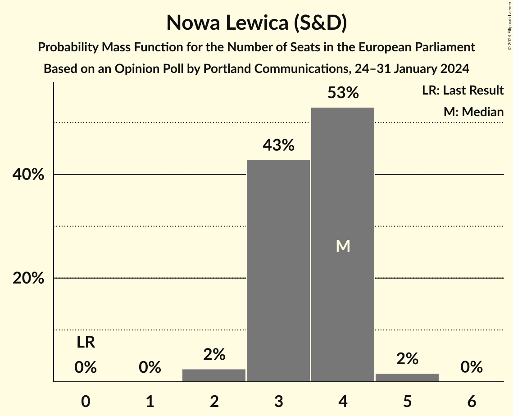

| Number of Seats | Probability | Accumulated | Special Marks |
|:---------------:|:-----------:|:-----------:|:-------------:|
| 0 | 0% | 100% | Last Result |
| 1 | 0% | 100% |  |
| 2 | 2% | 100% |  |
| 3 | 43% | 98% |  |
| 4 | 53% | 55% | Median |
| 5 | 2% | 2% |  |
| 6 | 0% | 0% |  |

### Nowa Nadzieja (NI)

*For a full overview of the results for this party, see the [Nowa Nadzieja (NI)](party-nowanadziejani.html) page.*

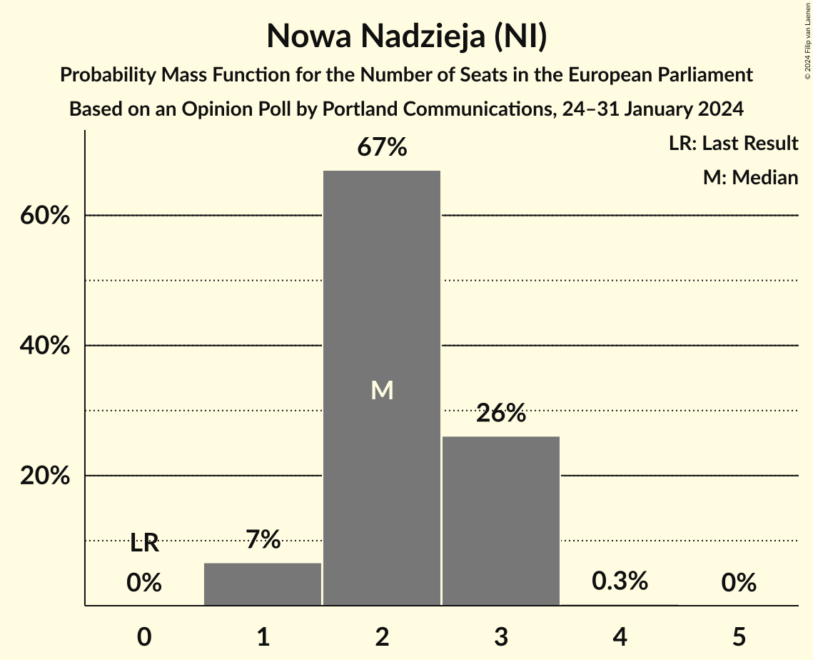

| Number of Seats | Probability | Accumulated | Special Marks |
|:---------------:|:-----------:|:-----------:|:-------------:|
| 0 | 0% | 100% | Last Result |
| 1 | 7% | 100% |  |
| 2 | 67% | 93% | Median |
| 3 | 26% | 26% |  |
| 4 | 0.3% | 0.3% |  |
| 5 | 0% | 0% |  |

### Ruch Narodowy (ID)

*For a full overview of the results for this party, see the [Ruch Narodowy (ID)](party-ruchnarodowyid.html) page.*

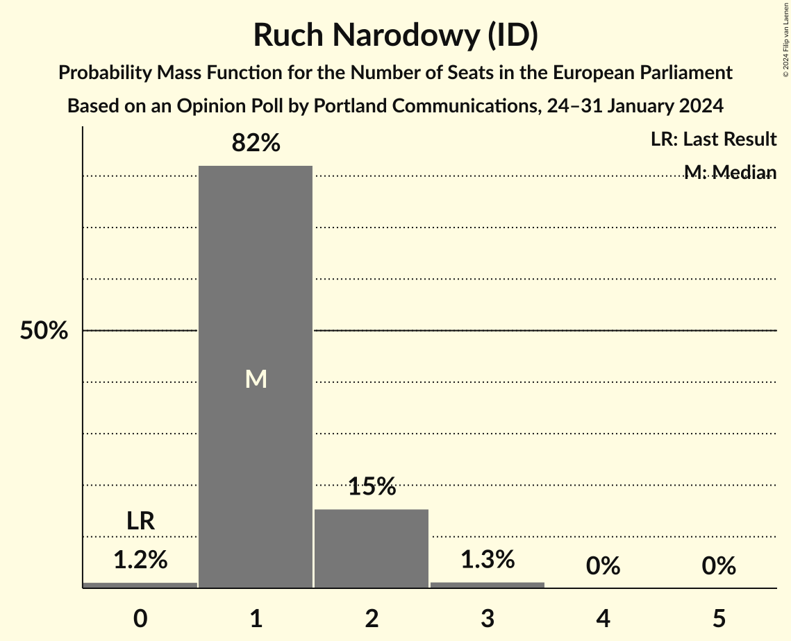

| Number of Seats | Probability | Accumulated | Special Marks |
|:---------------:|:-----------:|:-----------:|:-------------:|
| 0 | 1.2% | 100% | Last Result |
| 1 | 82% | 98.8% | Median |
| 2 | 15% | 17% |  |
| 3 | 1.3% | 1.3% |  |
| 4 | 0% | 0% |  |

### Lewica Razem (NI)

*For a full overview of the results for this party, see the [Lewica Razem (NI)](party-lewicarazemni.html) page.*

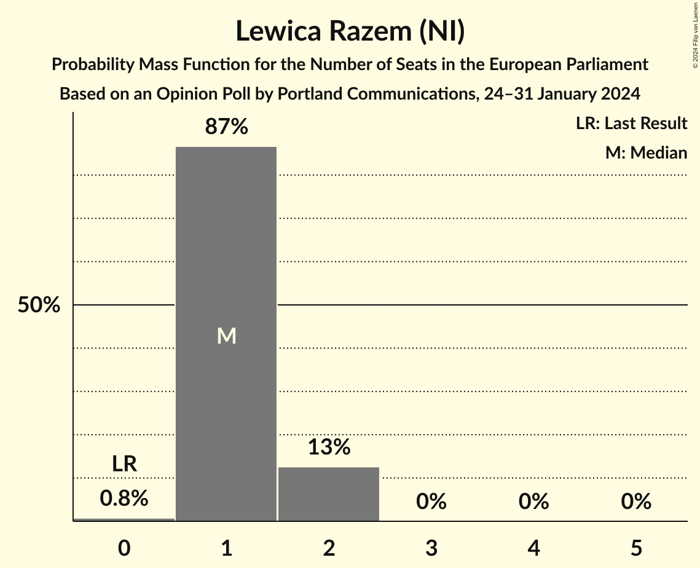

| Number of Seats | Probability | Accumulated | Special Marks |
|:---------------:|:-----------:|:-----------:|:-------------:|
| 0 | 0.8% | 100% | Last Result |
| 1 | 87% | 99.2% | Median |
| 2 | 13% | 13% |  |
| 3 | 0% | 0% |  |

### .Nowoczesna (RE)

*For a full overview of the results for this party, see the [.Nowoczesna (RE)](party-nowoczesnare.html) page.*

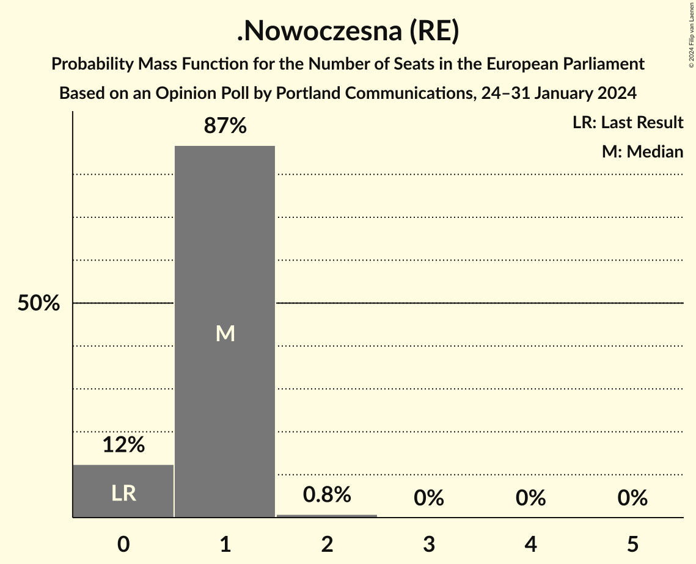

| Number of Seats | Probability | Accumulated | Special Marks |
|:---------------:|:-----------:|:-----------:|:-------------:|
| 0 | 12% | 100% | Last Result |
| 1 | 87% | 88% | Median |
| 2 | 0.8% | 0.8% |  |
| 3 | 0% | 0% |  |

### Konfederacja Korony Polskiej (ID)

*For a full overview of the results for this party, see the [Konfederacja Korony Polskiej (ID)](party-konfederacjakoronypolskiejid.html) page.*

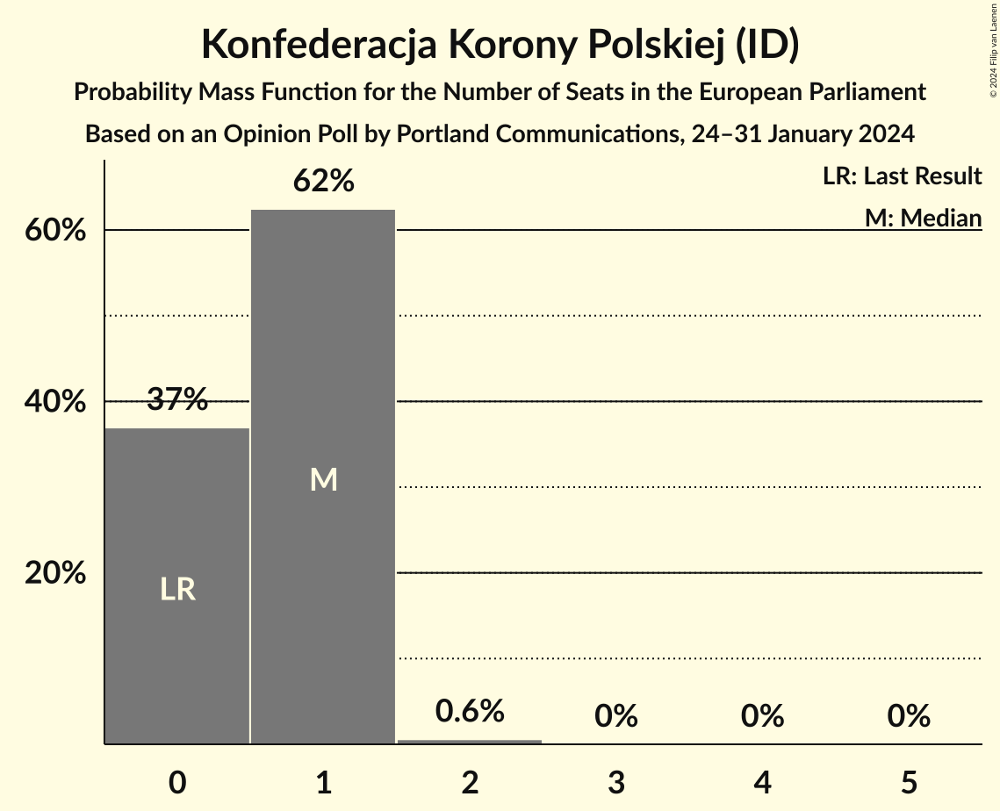

| Number of Seats | Probability | Accumulated | Special Marks |
|:---------------:|:-----------:|:-----------:|:-------------:|
| 0 | 37% | 100% | Last Result |
| 1 | 62% | 63% | Median |
| 2 | 0.6% | 0.6% |  |
| 3 | 0% | 0% |  |

### Centrum dla Polski (*)

*For a full overview of the results for this party, see the [Centrum dla Polski (*)](party-centrumdlapolski.html) page.*

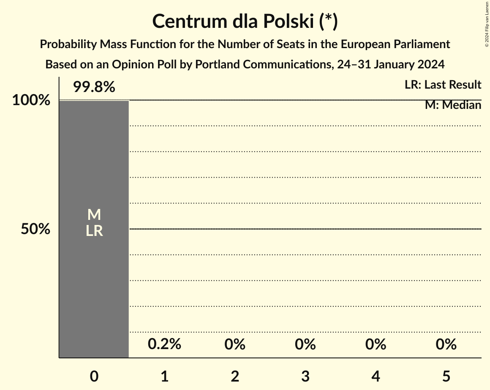

| Number of Seats | Probability | Accumulated | Special Marks |
|:---------------:|:-----------:|:-----------:|:-------------:|
| 0 | 99.8% | 100% | Last Result, Median |
| 1 | 0.2% | 0.2% |  |
| 2 | 0% | 0% |  |

### Inicjatywa Polska (NI)

*For a full overview of the results for this party, see the [Inicjatywa Polska (NI)](party-inicjatywapolskani.html) page.*

| Number of Seats | Probability | Accumulated | Special Marks |
|:---------------:|:-----------:|:-----------:|:-------------:|
| 0 | 99.9% | 100% | Last Result, Median |
| 1 | 0.1% | 0.1% |  |
| 2 | 0% | 0% |  |

### Partia Zieloni (Greens/EFA)

*For a full overview of the results for this party, see the [Partia Zieloni (Greens/EFA)](party-partiazielonigreensefa.html) page.*

| Number of Seats | Probability | Accumulated | Special Marks |
|:---------------:|:-----------:|:-----------:|:-------------:|
| 0 | 99.6% | 100% | Last Result, Median |
| 1 | 0.4% | 0.4% |  |
| 2 | 0% | 0% |  |

## Coalitions

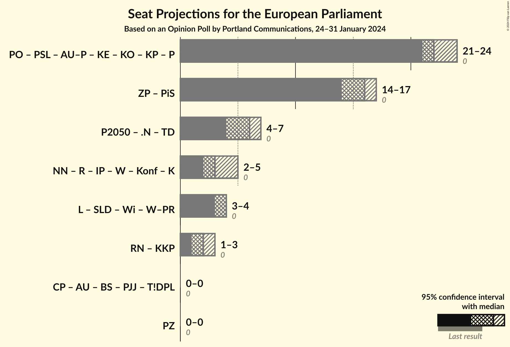

### Confidence Intervals

| Coalition | Last Result | Median | Majority? | 80% Confidence Interval | 90% Confidence Interval | 95% Confidence Interval | 99% Confidence Interval |
|:---------:|:-----------:|:------:|:---------:|:-----------------------:|:-----------------------:|:-----------------------:|:-----------------------:|
| Ruch Narodowy (ID) – Konfederacja Korony Polskiej (ID) | 0 | 2 | 0% | 1–2 | 1–3 | 1–3 | 1–4 |
| Partia Zieloni (Greens/EFA) | 0 | 0 | 0% | 0 | 0 | 0 | 0 |

### Ruch Narodowy (ID) – Konfederacja Korony Polskiej (ID)

| Number of Seats | Probability | Accumulated | Special Marks |
|:---------------:|:-----------:|:-----------:|:-------------:|
| 0 | 0% | 100% | Last Result |
| 1 | 29% | 100% |  |
| 2 | 63% | 71% | Median |
| 3 | 7% | 8% |  |
| 4 | 1.3% | 1.3% |  |
| 5 | 0% | 0% |  |

### Partia Zieloni (Greens/EFA)

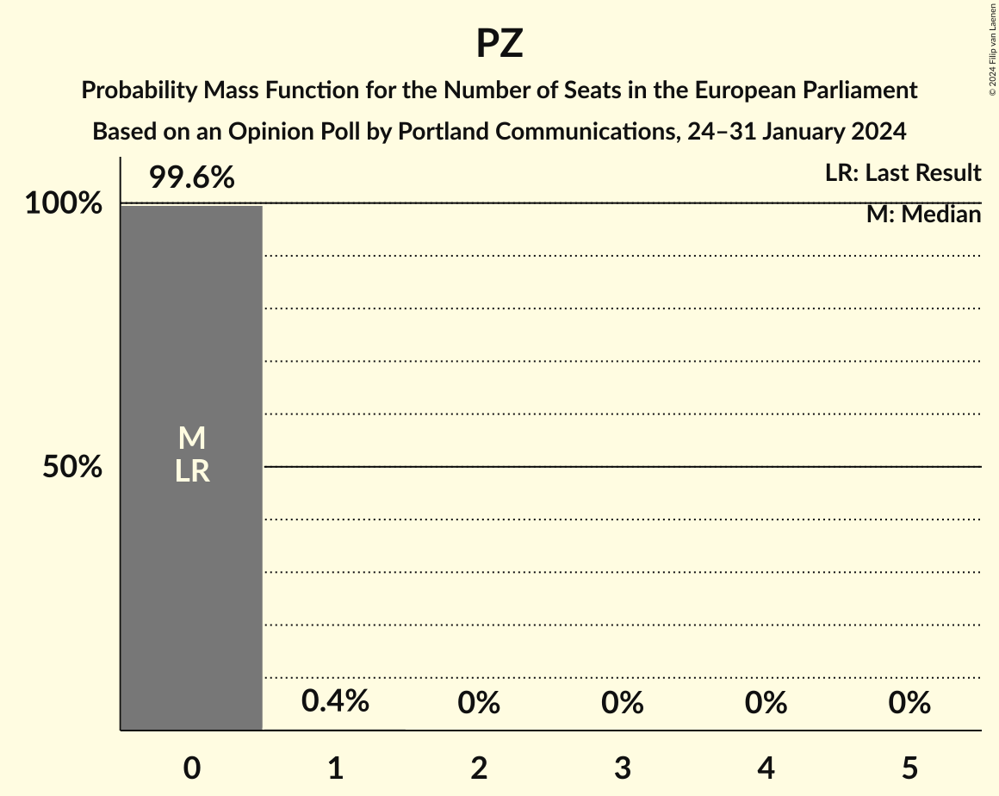

| Number of Seats | Probability | Accumulated | Special Marks |
|:---------------:|:-----------:|:-----------:|:-------------:|
| 0 | 99.6% | 100% | Last Result, Median |
| 1 | 0.4% | 0.4% |  |
| 2 | 0% | 0% |  |

## Technical Information

### Opinion Poll

+ **Polling firm:** Portland Communications
+ **Commissioner(s):** —
+ **Fieldwork period:** 24–31 January 2024

### Calculations

+ **Sample size:** 1039
+ **Simulations done:** 2,097,152
+ **Error estimate:** 2.76%

