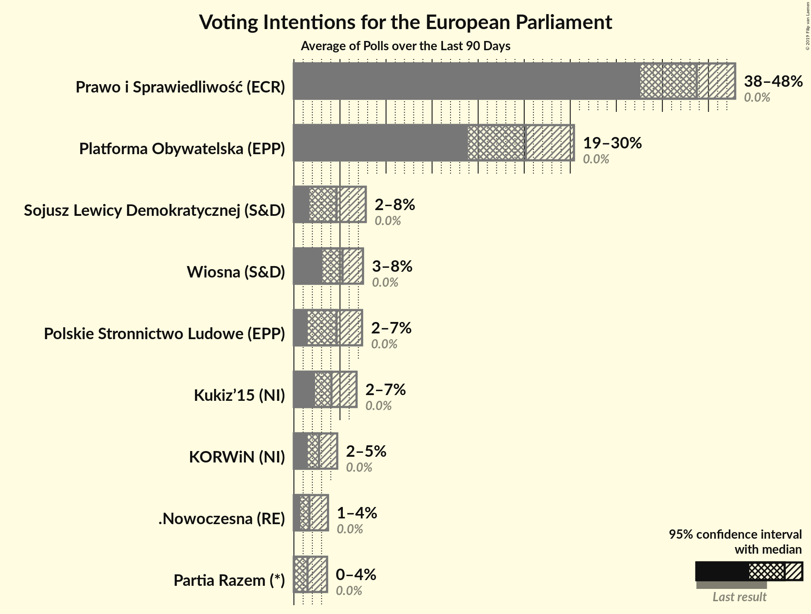
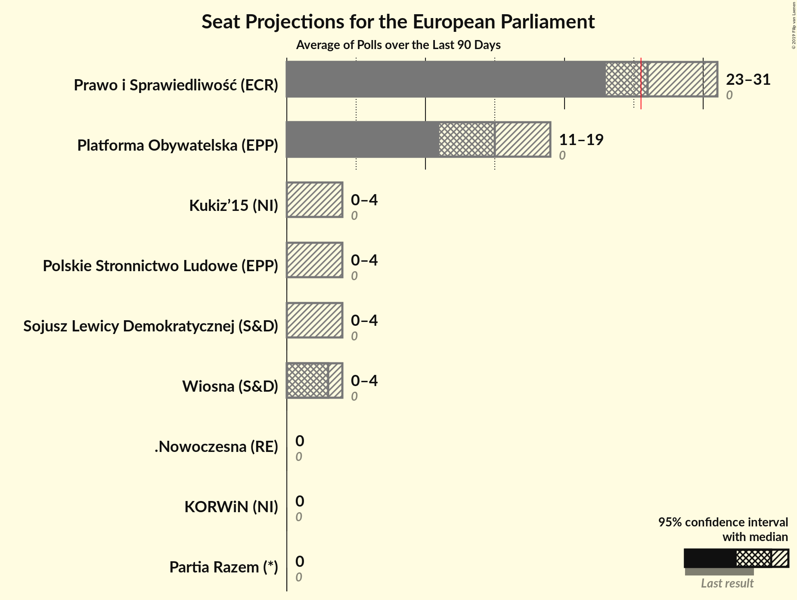
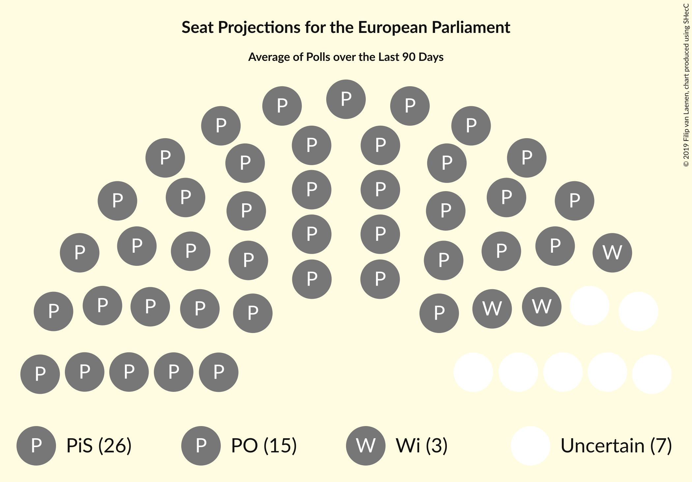
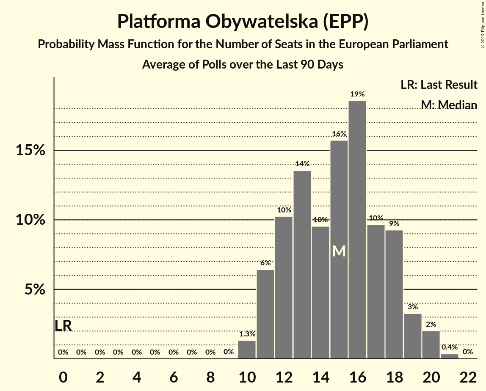
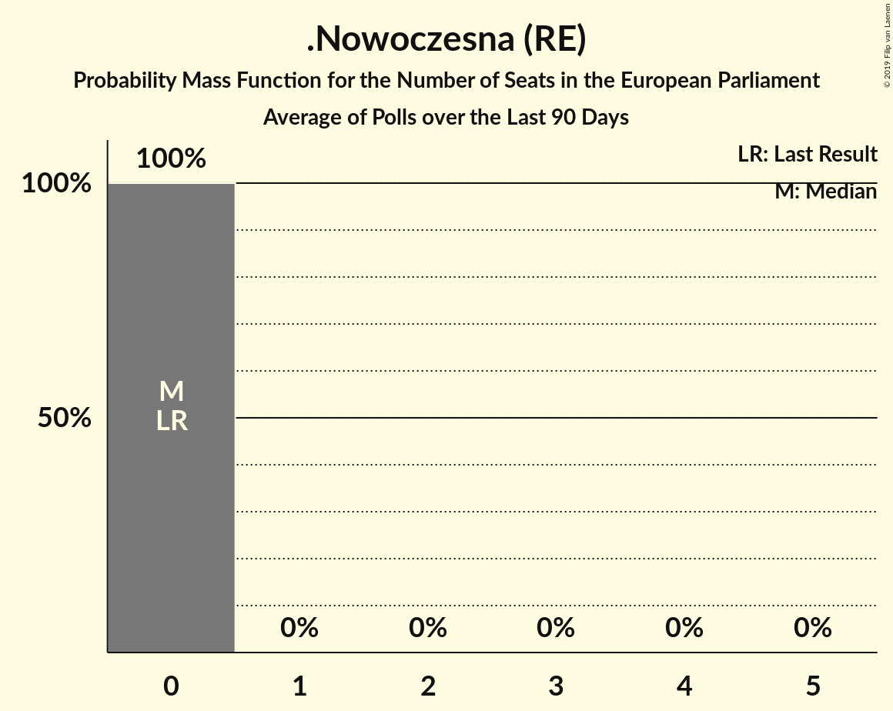
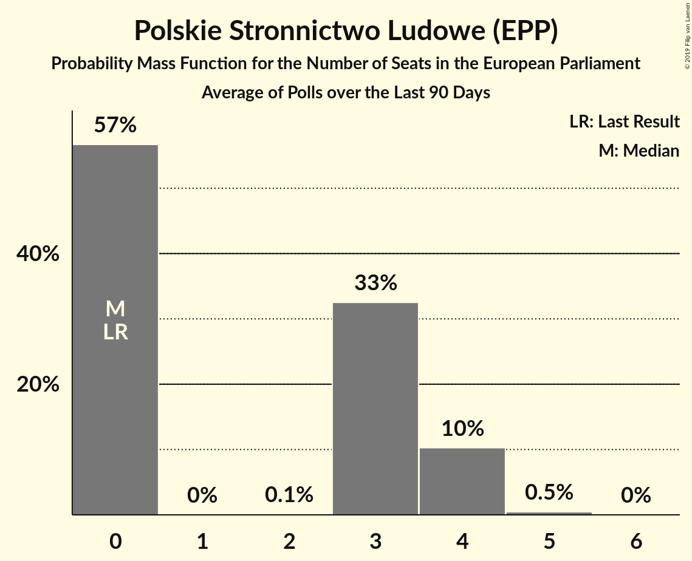
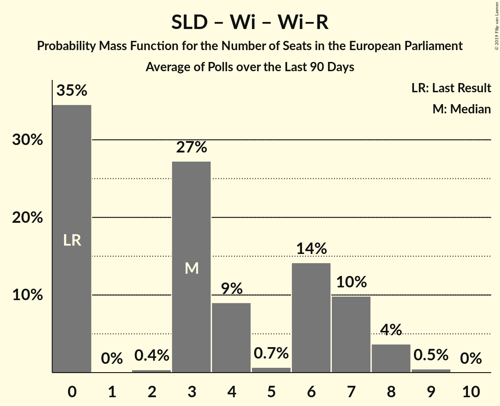
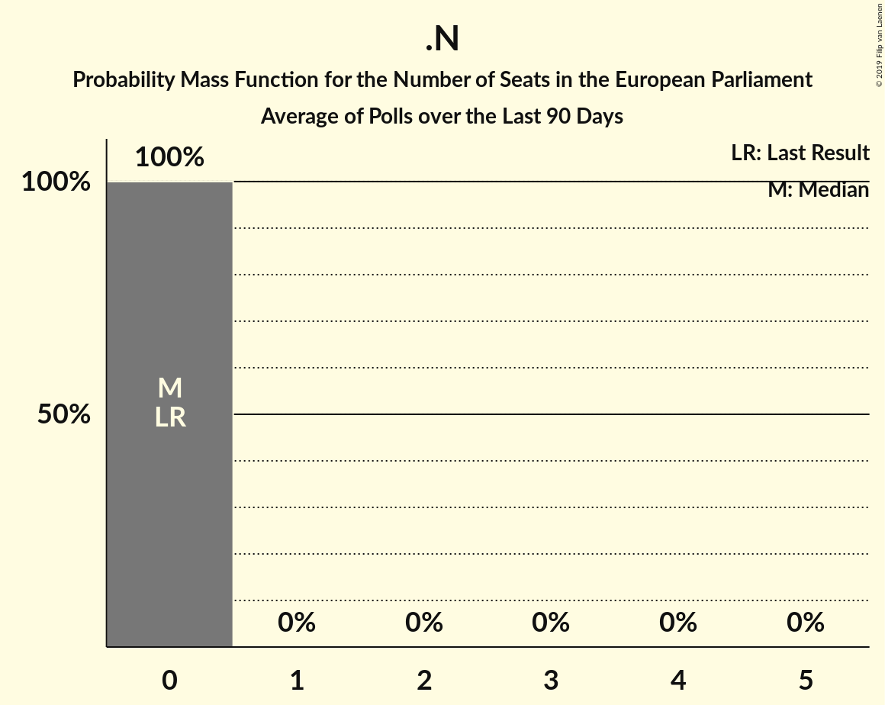

# Poll Average

<a href="#voting-intentions">Voting Intentions</a> | <a href="#seats">Seats</a> | <a href="#coalitions">Coalitions</a> | <a href="#technical-information">Technical Information</a>

## Summary

The table below lists the polls on which the average is based. They are the most recent polls (less than 90 days old) registered and analyzed so far.

| Period     | Polling firm/Commissioner(s) | PiS | PO | K | .N | PSL | SLD | W | R | Wi | Wi–R | KE |
|:----------:|:----------------------------:|:--:|:--:|:--:|:--:|:--:|:--:|:--:|:--:|:--:|:--:|:--:|
| 26 May 2019 | General Election | 0.0%   0 | 0.0%   0 | 0.0%   0 | 0.0%   0 | 0.0%   0 | 0.0%   0 | 0.0%   0 | 0.0%   0 | 0.0%   0 | 0.0%   0 | 0.0%   0 |
| N/A | Poll Average | 38–48%   23–31 | 19–30%   11–19 | 2–7%   0–4 | 1–4%   0 | 2–7%   0–4 | 2–8%   0–4 | 2–5%   0 | 0–4%   0 | 3–8%   0–4 | N/A   N/A | N/A   N/A |
| [6–8 August 2019](2019-08-08-Estymator.html) | Estymator   DoRzeczy.pl | 42–48%   26–32 | 26–32%   16–21 | 2–4%   0 | 1–2%   0 | 4–7%   0–4 | 4–7%   0–4 | 2–4%   0 | 1–3%   0 | 3–5%   0–3 | N/A   N/A | N/A   N/A |
| [2–7 August 2019](2019-08-07-SocialChanges.html) | Social Changes | 43–49%   25–29 | 22–27%   12–16 | 2–4%   0 | 1–3%   0 | 5–8%   3–4 | 6–9%   3–5 | 2–3%   0 | 1–2%   0 | 5–8%   0–4 | N/A   N/A | N/A   N/A |
| [6–7 August 2019](2019-08-07-InstytutBadańPollster.html) | Instytut Badań Pollster   Super Express | 40–46%   24–31 | 23–28%   14–18 | 4–6%   0–4 | 1–3%   0 | 4–6%   0–4 | 4–6%   0–4 | 3–5%   0–3 | 2–4%   0 | 5–8%   0–4 | N/A   N/A | N/A   N/A |
| [26–27 July 2019](2019-07-27-IBRiS.html) | IBRiS   RMF | 42–48%   24–29 | 18–23%   10–13 | 3–5%   0–3 | 1–2%   0 | 1–3%   0 | 4–7%   0–3 | 2–3%   0 | 0–1%   0 | 5–7%   0–4 | N/A   N/A | N/A   N/A |
| [12–17 July 2019](2019-07-17-KantarPublic.html) | Kantar Public   Radio ZET | 36–42%   22–26 | 23–29%   14–18 | 3–5%   0–3 | 2–4%   0 | 1–3%   0 | 2–4%   0 | 1–3%   0 | 1–2%   0 | 4–7%   0–4 | N/A   N/A | N/A   N/A |
| [12–15 July 2019](2019-07-15-KantarMillwardBrown.html) | Kantar Millward Brown   TVN and TVN24 | 39–45%   23–28 | 24–30%   14–18 | 5–8%   0–4 | N/A   N/A | 2–4%   0 | 1–3%   0 | 2–4%   0 | 1–3%   0 | 4–7%   0–3 | N/A   N/A | N/A   N/A |
| [4–11 July 2019](2019-07-11-CBOS.html) | CBOS | 41–47%   25–29 | 19–23%   11–14 | 3–5%   0–3 | 1–2%   0 | 5–8%   0–4 | 2–4%   0 | 2–4%   0 | 1–2%   0 | 3–5%   0–3 | N/A   N/A | N/A   N/A |
| 26 May 2019 | General Election | 0.0%   0 | 0.0%   0 | 0.0%   0 | 0.0%   0 | 0.0%   0 | 0.0%   0 | 0.0%   0 | 0.0%   0 | 0.0%   0 | 0.0%   0 | 0.0%   0 |

Only polls for which at least the sample size has been published are included in the table above.

**Legend:**
+ **Top half of each row:** Voting intentions (95% confidence interval)
+ **Bottom half of each row:** Seat projections for the European Parliament (95% confidence interval)
+ **PiS:** Prawo i Sprawiedliwość (ECR)
+ **PO:** Platforma Obywatelska (EPP)
+ **K:** Kukiz’15 (NI)
+ **.N:** .Nowoczesna (RE)
+ **PSL:** Polskie Stronnictwo Ludowe (EPP)
+ **SLD:** Sojusz Lewicy Demokratycznej (S&D)
+ **W:** KORWiN (NI)
+ **R:** Partia Razem (*)
+ **Wi:** Wiosna (S&D)
+ **Wi–R:** Wiosna–Partia Razem (S&D)
+ **KE:** Koalicja Europejska (EPP)
+ **N/A (single party):** Party not included the published results
+ **N/A (entire row):** Calculation for this opinion poll not started yet

## Voting Intentions

### Confidence Intervals

| Party | Last Result | Median | 80% Confidence Interval | 90% Confidence Interval | 95% Confidence Interval | 99% Confidence Interval |
|:-----:|:-----------:|:------:|:-----------------------:|:-----------------------:|:-----------------------:|:-----------------------:|
| <a href="#prawo-i-sprawiedliwość-(ecr)">Prawo i Sprawiedliwość (ECR)</a> | 0.0% | 43.7% | 39.6–46.5% |38.4–47.3% | 37.6–47.9% | 36.2–49.0% |
| <a href="#platforma-obywatelska-(epp)">Platforma Obywatelska (EPP)</a> | 0.0% | 25.2% | 20.1–28.8% |19.4–29.7% | 18.9–30.4% | 18.0–31.6% |
| <a href="#kukiz’15-(ni)">Kukiz’15 (NI)</a> | 0.0% | 4.1% | 2.8–5.9% |2.5–6.4% | 2.3–6.8% | 2.0–7.5% |
| <a href="#.nowoczesna-(re)">.Nowoczesna (RE)</a> | 0.0% | 1.7% | 1.0–3.0% |0.9–3.3% | 0.7–3.7% | 0.6–4.2% |
| <a href="#polskie-stronnictwo-ludowe-(epp)">Polskie Stronnictwo Ludowe (EPP)</a> | 0.0% | 4.6% | 1.9–6.7% |1.7–7.1% | 1.5–7.4% | 1.2–8.1% |
| <a href="#sojusz-lewicy-demokratycznej-(s&d)">Sojusz Lewicy Demokratycznej (S&D)</a> | 0.0% | 4.6% | 2.2–6.7% |1.9–7.3% | 1.7–7.8% | 1.3–8.5% |
| <a href="#korwin-(ni)">KORWiN (NI)</a> | 0.0% | 2.7% | 1.9–4.0% |1.7–4.4% | 1.5–4.7% | 1.3–5.3% |
| <a href="#partia-razem-(*)">Partia Razem (*)</a> | 0.0% | 1.5% | 0.2–2.9% |0.1–3.3% | 0.1–3.6% | 0.0–4.1% |
| <a href="#wiosna-(s&d)">Wiosna (S&D)</a> | 0.0% | 5.3% | 3.7–6.7% |3.4–7.1% | 3.1–7.5% | 2.8–8.1% |
| <a href="#wiosna–partia-razem-(s&d)">Wiosna–Partia Razem (S&D)</a> | 0.0% | N/A | N/A |N/A | N/A | N/A |
| <a href="#koalicja-europejska-(epp)">Koalicja Europejska (EPP)</a> | 0.0% | N/A | N/A |N/A | N/A | N/A |

### Prawo i Sprawiedliwość (ECR)

*For a full overview of the results for this party, see the [Prawo i Sprawiedliwość (ECR)](party-prawoisprawiedliwośćecr.html) page.*

| Voting Intentions | Probability | Accumulated | Special Marks |
|:-----------------:|:-----------:|:-----------:|:-------------:|
| 0.0–0.5% | 0% | 100% | Last Result |
| 0.5–1.5% | 0% | 100% |  |
| 1.5–2.5% | 0% | 100% |  |
| 2.5–3.5% | 0% | 100% |  |
| 3.5–4.5% | 0% | 100% |  |
| 4.5–5.5% | 0% | 100% |  |
| 5.5–6.5% | 0% | 100% |  |
| 6.5–7.5% | 0% | 100% |  |
| 7.5–8.5% | 0% | 100% |  |
| 8.5–9.5% | 0% | 100% |  |
| 9.5–10.5% | 0% | 100% |  |
| 10.5–11.5% | 0% | 100% |  |
| 11.5–12.5% | 0% | 100% |  |
| 12.5–13.5% | 0% | 100% |  |
| 13.5–14.5% | 0% | 100% |  |
| 14.5–15.5% | 0% | 100% |  |
| 15.5–16.5% | 0% | 100% |  |
| 16.5–17.5% | 0% | 100% |  |
| 17.5–18.5% | 0% | 100% |  |
| 18.5–19.5% | 0% | 100% |  |
| 19.5–20.5% | 0% | 100% |  |
| 20.5–21.5% | 0% | 100% |  |
| 21.5–22.5% | 0% | 100% |  |
| 22.5–23.5% | 0% | 100% |  |
| 23.5–24.5% | 0% | 100% |  |
| 24.5–25.5% | 0% | 100% |  |
| 25.5–26.5% | 0% | 100% |  |
| 26.5–27.5% | 0% | 100% |  |
| 27.5–28.5% | 0% | 100% |  |
| 28.5–29.5% | 0% | 100% |  |
| 29.5–30.5% | 0% | 100% |  |
| 30.5–31.5% | 0% | 100% |  |
| 31.5–32.5% | 0% | 100% |  |
| 32.5–33.5% | 0% | 100% |  |
| 33.5–34.5% | 0% | 100% |  |
| 34.5–35.5% | 0.1% | 100% |  |
| 35.5–36.5% | 0.6% | 99.8% |  |
| 36.5–37.5% | 2% | 99.2% |  |
| 37.5–38.5% | 3% | 98% |  |
| 38.5–39.5% | 4% | 94% |  |
| 39.5–40.5% | 5% | 90% |  |
| 40.5–41.5% | 7% | 85% |  |
| 41.5–42.5% | 10% | 78% |  |
| 42.5–43.5% | 14% | 67% |  |
| 43.5–44.5% | 16% | 53% | Median |
| 44.5–45.5% | 15% | 37% |  |
| 45.5–46.5% | 11% | 21% |  |
| 46.5–47.5% | 6% | 10% |  |
| 47.5–48.5% | 3% | 4% |  |
| 48.5–49.5% | 0.8% | 1.0% |  |
| 49.5–50.5% | 0.2% | 0.2% |  |
| 50.5–51.5% | 0% | 0% |  |

### Platforma Obywatelska (EPP)

*For a full overview of the results for this party, see the [Platforma Obywatelska (EPP)](party-platformaobywatelskaepp.html) page.*

| Voting Intentions | Probability | Accumulated | Special Marks |
|:-----------------:|:-----------:|:-----------:|:-------------:|
| 0.0–0.5% | 0% | 100% | Last Result |
| 0.5–1.5% | 0% | 100% |  |
| 1.5–2.5% | 0% | 100% |  |
| 2.5–3.5% | 0% | 100% |  |
| 3.5–4.5% | 0% | 100% |  |
| 4.5–5.5% | 0% | 100% |  |
| 5.5–6.5% | 0% | 100% |  |
| 6.5–7.5% | 0% | 100% |  |
| 7.5–8.5% | 0% | 100% |  |
| 8.5–9.5% | 0% | 100% |  |
| 9.5–10.5% | 0% | 100% |  |
| 10.5–11.5% | 0% | 100% |  |
| 11.5–12.5% | 0% | 100% |  |
| 12.5–13.5% | 0% | 100% |  |
| 13.5–14.5% | 0% | 100% |  |
| 14.5–15.5% | 0% | 100% |  |
| 15.5–16.5% | 0% | 100% |  |
| 16.5–17.5% | 0.2% | 100% |  |
| 17.5–18.5% | 1.2% | 99.8% |  |
| 18.5–19.5% | 4% | 98.6% |  |
| 19.5–20.5% | 8% | 94% |  |
| 20.5–21.5% | 8% | 86% |  |
| 21.5–22.5% | 6% | 78% |  |
| 22.5–23.5% | 5% | 72% |  |
| 23.5–24.5% | 9% | 67% |  |
| 24.5–25.5% | 13% | 58% | Median |
| 25.5–26.5% | 14% | 45% |  |
| 26.5–27.5% | 11% | 31% |  |
| 27.5–28.5% | 8% | 20% |  |
| 28.5–29.5% | 6% | 12% |  |
| 29.5–30.5% | 3% | 5% |  |
| 30.5–31.5% | 2% | 2% |  |
| 31.5–32.5% | 0.4% | 0.5% |  |
| 32.5–33.5% | 0.1% | 0.1% |  |
| 33.5–34.5% | 0% | 0% |  |

### Kukiz’15 (NI)

*For a full overview of the results for this party, see the [Kukiz’15 (NI)](party-kukiz’15ni.html) page.*

| Voting Intentions | Probability | Accumulated | Special Marks |
|:-----------------:|:-----------:|:-----------:|:-------------:|
| 0.0–0.5% | 0% | 100% | Last Result |
| 0.5–1.5% | 0% | 100% |  |
| 1.5–2.5% | 6% | 100% |  |
| 2.5–3.5% | 26% | 94% |  |
| 3.5–4.5% | 33% | 69% | Median |
| 4.5–5.5% | 20% | 35% |  |
| 5.5–6.5% | 11% | 15% |  |
| 6.5–7.5% | 3% | 4% |  |
| 7.5–8.5% | 0.4% | 0.5% |  |
| 8.5–9.5% | 0% | 0% |  |

### .Nowoczesna (RE)

*For a full overview of the results for this party, see the [.Nowoczesna (RE)](party-nowoczesnare.html) page.*

| Voting Intentions | Probability | Accumulated | Special Marks |
|:-----------------:|:-----------:|:-----------:|:-------------:|
| 0.0–0.5% | 0.4% | 100% | Last Result |
| 0.5–1.5% | 40% | 99.6% |  |
| 1.5–2.5% | 42% | 59% | Median |
| 2.5–3.5% | 14% | 17% |  |
| 3.5–4.5% | 3% | 3% |  |
| 4.5–5.5% | 0.1% | 0.1% |  |
| 5.5–6.5% | 0% | 0% |  |

### Polskie Stronnictwo Ludowe (EPP)

*For a full overview of the results for this party, see the [Polskie Stronnictwo Ludowe (EPP)](party-polskiestronnictwoludoweepp.html) page.*

| Voting Intentions | Probability | Accumulated | Special Marks |
|:-----------------:|:-----------:|:-----------:|:-------------:|
| 0.0–0.5% | 0% | 100% | Last Result |
| 0.5–1.5% | 3% | 100% |  |
| 1.5–2.5% | 24% | 97% |  |
| 2.5–3.5% | 13% | 73% |  |
| 3.5–4.5% | 9% | 60% |  |
| 4.5–5.5% | 20% | 51% | Median |
| 5.5–6.5% | 20% | 31% |  |
| 6.5–7.5% | 9% | 11% |  |
| 7.5–8.5% | 2% | 2% |  |
| 8.5–9.5% | 0.1% | 0.1% |  |
| 9.5–10.5% | 0% | 0% |  |

### Sojusz Lewicy Demokratycznej (S&D)

*For a full overview of the results for this party, see the [Sojusz Lewicy Demokratycznej (S&D)](party-sojuszlewicydemokratycznejsd.html) page.*

| Voting Intentions | Probability | Accumulated | Special Marks |
|:-----------------:|:-----------:|:-----------:|:-------------:|
| 0.0–0.5% | 0% | 100% | Last Result |
| 0.5–1.5% | 2% | 100% |  |
| 1.5–2.5% | 15% | 98% |  |
| 2.5–3.5% | 21% | 84% |  |
| 3.5–4.5% | 11% | 63% |  |
| 4.5–5.5% | 22% | 51% | Median |
| 5.5–6.5% | 17% | 29% |  |
| 6.5–7.5% | 8% | 12% |  |
| 7.5–8.5% | 3% | 4% |  |
| 8.5–9.5% | 0.4% | 0.5% |  |
| 9.5–10.5% | 0% | 0% |  |

### Wiosna (S&D)

*For a full overview of the results for this party, see the [Wiosna (S&D)](party-wiosnasd.html) page.*

| Voting Intentions | Probability | Accumulated | Special Marks |
|:-----------------:|:-----------:|:-----------:|:-------------:|
| 0.0–0.5% | 0% | 100% | Last Result |
| 0.5–1.5% | 0% | 100% |  |
| 1.5–2.5% | 0.2% | 100% |  |
| 2.5–3.5% | 8% | 99.8% |  |
| 3.5–4.5% | 23% | 92% |  |
| 4.5–5.5% | 28% | 69% | Median |
| 5.5–6.5% | 27% | 41% |  |
| 6.5–7.5% | 12% | 14% |  |
| 7.5–8.5% | 2% | 2% |  |
| 8.5–9.5% | 0.1% | 0.1% |  |
| 9.5–10.5% | 0% | 0% |  |

### KORWiN (NI)

*For a full overview of the results for this party, see the [KORWiN (NI)](party-korwinni.html) page.*

| Voting Intentions | Probability | Accumulated | Special Marks |
|:-----------------:|:-----------:|:-----------:|:-------------:|
| 0.0–0.5% | 0% | 100% | Last Result |
| 0.5–1.5% | 3% | 100% |  |
| 1.5–2.5% | 38% | 97% |  |
| 2.5–3.5% | 41% | 60% | Median |
| 3.5–4.5% | 15% | 19% |  |
| 4.5–5.5% | 3% | 4% |  |
| 5.5–6.5% | 0.2% | 0.2% |  |
| 6.5–7.5% | 0% | 0% |  |

### Partia Razem (*)

*For a full overview of the results for this party, see the [Partia Razem (*)](party-partiarazem.html) page.*

| Voting Intentions | Probability | Accumulated | Special Marks |
|:-----------------:|:-----------:|:-----------:|:-------------:|
| 0.0–0.5% | 15% | 100% | Last Result |
| 0.5–1.5% | 38% | 85% | Median |
| 1.5–2.5% | 29% | 47% |  |
| 2.5–3.5% | 15% | 18% |  |
| 3.5–4.5% | 3% | 3% |  |
| 4.5–5.5% | 0.1% | 0.1% |  |
| 5.5–6.5% | 0% | 0% |  |

## Seats

### Confidence Intervals

| Party | Last Result | Median | 80% Confidence Interval | 90% Confidence Interval | 95% Confidence Interval | 99% Confidence Interval |
|:-----:|:-----------:|:------:|:-----------------------:|:-----------------------:|:-----------------------:|:-----------------------:|
| <a href="#prawo-i-sprawiedliwość-(ecr)">Prawo i Sprawiedliwość (ECR)</a> | 0 | 26 | 24–29 |23–30 | 23–31 | 22–32 |
| <a href="#platforma-obywatelska-(epp)">Platforma Obywatelska (EPP)</a> | 0 | 15 | 12–18 |11–19 | 11–19 | 10–20 |
| <a href="#kukiz’15-(ni)">Kukiz’15 (NI)</a> | 0 | 0 | 0–3 |0–3 | 0–4 | 0–4 |
| <a href="#.nowoczesna-(re)">.Nowoczesna (RE)</a> | 0 | 0 | 0 |0 | 0 | 0 |
| <a href="#polskie-stronnictwo-ludowe-(epp)">Polskie Stronnictwo Ludowe (EPP)</a> | 0 | 0 | 0–4 |0–4 | 0–4 | 0–4 |
| <a href="#sojusz-lewicy-demokratycznej-(s&d)">Sojusz Lewicy Demokratycznej (S&D)</a> | 0 | 0 | 0–4 |0–4 | 0–4 | 0–5 |
| <a href="#korwin-(ni)">KORWiN (NI)</a> | 0 | 0 | 0 |0 | 0 | 0–3 |
| <a href="#partia-razem-(*)">Partia Razem (*)</a> | 0 | 0 | 0 |0 | 0 | 0 |
| <a href="#wiosna-(s&d)">Wiosna (S&D)</a> | 0 | 3 | 0–4 |0–4 | 0–4 | 0–4 |
| <a href="#wiosna–partia-razem-(s&d)">Wiosna–Partia Razem (S&D)</a> | 0 | N/A | N/A |N/A | N/A | N/A |
| <a href="#koalicja-europejska-(epp)">Koalicja Europejska (EPP)</a> | 0 | N/A | N/A |N/A | N/A | N/A |

### Prawo i Sprawiedliwość (ECR)

*For a full overview of the results for this party, see the [Prawo i Sprawiedliwość (ECR)](party-prawoisprawiedliwośćecr.html) page.*

| Number of Seats | Probability | Accumulated | Special Marks |
|:---------------:|:-----------:|:-----------:|:-------------:|
| 0 | 0% | 100% | Last Result |
| 1 | 0% | 100% |  |
| 2 | 0% | 100% |  |
| 3 | 0% | 100% |  |
| 4 | 0% | 100% |  |
| 5 | 0% | 100% |  |
| 6 | 0% | 100% |  |
| 7 | 0% | 100% |  |
| 8 | 0% | 100% |  |
| 9 | 0% | 100% |  |
| 10 | 0% | 100% |  |
| 11 | 0% | 100% |  |
| 12 | 0% | 100% |  |
| 13 | 0% | 100% |  |
| 14 | 0% | 100% |  |
| 15 | 0% | 100% |  |
| 16 | 0% | 100% |  |
| 17 | 0% | 100% |  |
| 18 | 0% | 100% |  |
| 19 | 0% | 100% |  |
| 20 | 0% | 100% |  |
| 21 | 0.1% | 100% |  |
| 22 | 1.4% | 99.8% |  |
| 23 | 4% | 98% |  |
| 24 | 11% | 94% |  |
| 25 | 16% | 83% |  |
| 26 | 22% | 67% | Median, Majority |
| 27 | 19% | 46% |  |
| 28 | 13% | 26% |  |
| 29 | 7% | 14% |  |
| 30 | 4% | 7% |  |
| 31 | 2% | 3% |  |
| 32 | 0.9% | 1.0% |  |
| 33 | 0.1% | 0.2% |  |
| 34 | 0% | 0% |  |

### Platforma Obywatelska (EPP)

*For a full overview of the results for this party, see the [Platforma Obywatelska (EPP)](party-platformaobywatelskaepp.html) page.*

| Number of Seats | Probability | Accumulated | Special Marks |
|:---------------:|:-----------:|:-----------:|:-------------:|
| 0 | 0% | 100% | Last Result |
| 1 | 0% | 100% |  |
| 2 | 0% | 100% |  |
| 3 | 0% | 100% |  |
| 4 | 0% | 100% |  |
| 5 | 0% | 100% |  |
| 6 | 0% | 100% |  |
| 7 | 0% | 100% |  |
| 8 | 0% | 100% |  |
| 9 | 0% | 100% |  |
| 10 | 1.3% | 100% |  |
| 11 | 6% | 98.6% |  |
| 12 | 10% | 92% |  |
| 13 | 14% | 82% |  |
| 14 | 10% | 68% |  |
| 15 | 16% | 59% | Median |
| 16 | 19% | 43% |  |
| 17 | 10% | 25% |  |
| 18 | 9% | 15% |  |
| 19 | 3% | 6% |  |
| 20 | 2% | 2% |  |
| 21 | 0.4% | 0.4% |  |
| 22 | 0% | 0% |  |

### Kukiz’15 (NI)

*For a full overview of the results for this party, see the [Kukiz’15 (NI)](party-kukiz’15ni.html) page.*

| Number of Seats | Probability | Accumulated | Special Marks |
|:---------------:|:-----------:|:-----------:|:-------------:|
| 0 | 75% | 100% | Last Result, Median |
| 1 | 0% | 25% |  |
| 2 | 0.5% | 25% |  |
| 3 | 21% | 24% |  |
| 4 | 3% | 3% |  |
| 5 | 0.1% | 0.1% |  |
| 6 | 0% | 0% |  |

### .Nowoczesna (RE)

*For a full overview of the results for this party, see the [.Nowoczesna (RE)](party-nowoczesnare.html) page.*

| Number of Seats | Probability | Accumulated | Special Marks |
|:---------------:|:-----------:|:-----------:|:-------------:|
| 0 | 100% | 100% | Last Result, Median |

### Polskie Stronnictwo Ludowe (EPP)

*For a full overview of the results for this party, see the [Polskie Stronnictwo Ludowe (EPP)](party-polskiestronnictwoludoweepp.html) page.*

| Number of Seats | Probability | Accumulated | Special Marks |
|:---------------:|:-----------:|:-----------:|:-------------:|
| 0 | 57% | 100% | Last Result, Median |
| 1 | 0% | 43% |  |
| 2 | 0.1% | 43% |  |
| 3 | 33% | 43% |  |
| 4 | 10% | 11% |  |
| 5 | 0.5% | 0.5% |  |
| 6 | 0% | 0% |  |

### Sojusz Lewicy Demokratycznej (S&D)

*For a full overview of the results for this party, see the [Sojusz Lewicy Demokratycznej (S&D)](party-sojuszlewicydemokratycznejsd.html) page.*

| Number of Seats | Probability | Accumulated | Special Marks |
|:---------------:|:-----------:|:-----------:|:-------------:|
| 0 | 60% | 100% | Last Result, Median |
| 1 | 0% | 40% |  |
| 2 | 0.5% | 40% |  |
| 3 | 28% | 40% |  |
| 4 | 10% | 11% |  |
| 5 | 0.9% | 0.9% |  |
| 6 | 0% | 0% |  |

### Wiosna (S&D)

*For a full overview of the results for this party, see the [Wiosna (S&D)](party-wiosnasd.html) page.*

| Number of Seats | Probability | Accumulated | Special Marks |
|:---------------:|:-----------:|:-----------:|:-------------:|
| 0 | 46% | 100% | Last Result |
| 1 | 0% | 54% |  |
| 2 | 0.4% | 54% |  |
| 3 | 38% | 54% | Median |
| 4 | 15% | 16% |  |
| 5 | 0.4% | 0.5% |  |
| 6 | 0% | 0% |  |

### KORWiN (NI)

*For a full overview of the results for this party, see the [KORWiN (NI)](party-korwinni.html) page.*

| Number of Seats | Probability | Accumulated | Special Marks |
|:---------------:|:-----------:|:-----------:|:-------------:|
| 0 | 98.8% | 100% | Last Result, Median |
| 1 | 0% | 1.2% |  |
| 2 | 0% | 1.2% |  |
| 3 | 1.2% | 1.2% |  |
| 4 | 0% | 0% |  |

### Partia Razem (*)

*For a full overview of the results for this party, see the [Partia Razem (*)](party-partiarazem.html) page.*

| Number of Seats | Probability | Accumulated | Special Marks |
|:---------------:|:-----------:|:-----------:|:-------------:|
| 0 | 100% | 100% | Last Result, Median |

## Coalitions

### Confidence Intervals

| Coalition | Last Result | Median | Majority? | 80% Confidence Interval | 90% Confidence Interval | 95% Confidence Interval | 99% Confidence Interval |
|:---------:|:-----------:|:------:|:---------:|:-----------------------:|:-----------------------:|:-----------------------:|:-----------------------:|
| Prawo i Sprawiedliwość (ECR) | 0 | 26 | 67% | 24–29 | 23–30 | 23–31 | 22–32 |
| Koalicja Europejska (EPP) – Platforma Obywatelska (EPP) – Polskie Stronnictwo Ludowe (EPP) | 0 | 16 | 0% | 12–19 | 11–21 | 11–21 | 10–23 |
| Sojusz Lewicy Demokratycznej (S&D) – Wiosna (S&D) – Wiosna–Partia Razem (S&D) | 0 | 3 | 0% | 0–7 | 0–7 | 0–8 | 0–8 |
| KORWiN (NI) – Kukiz’15 (NI) | 0 | 0 | 0% | 0–3 | 0–3 | 0–4 | 0–6 |
| .Nowoczesna (RE) | 0 | 0 | 0% | 0 | 0 | 0 | 0 |
| Partia Razem (*) | 0 | 0 | 0% | 0 | 0 | 0 | 0 |

### Prawo i Sprawiedliwość (ECR)

| Number of Seats | Probability | Accumulated | Special Marks |
|:---------------:|:-----------:|:-----------:|:-------------:|
| 0 | 0% | 100% | Last Result |
| 1 | 0% | 100% |  |
| 2 | 0% | 100% |  |
| 3 | 0% | 100% |  |
| 4 | 0% | 100% |  |
| 5 | 0% | 100% |  |
| 6 | 0% | 100% |  |
| 7 | 0% | 100% |  |
| 8 | 0% | 100% |  |
| 9 | 0% | 100% |  |
| 10 | 0% | 100% |  |
| 11 | 0% | 100% |  |
| 12 | 0% | 100% |  |
| 13 | 0% | 100% |  |
| 14 | 0% | 100% |  |
| 15 | 0% | 100% |  |
| 16 | 0% | 100% |  |
| 17 | 0% | 100% |  |
| 18 | 0% | 100% |  |
| 19 | 0% | 100% |  |
| 20 | 0% | 100% |  |
| 21 | 0.1% | 100% |  |
| 22 | 1.4% | 99.8% |  |
| 23 | 4% | 98% |  |
| 24 | 11% | 94% |  |
| 25 | 16% | 83% |  |
| 26 | 22% | 67% | Median, Majority |
| 27 | 19% | 46% |  |
| 28 | 13% | 26% |  |
| 29 | 7% | 14% |  |
| 30 | 4% | 7% |  |
| 31 | 2% | 3% |  |
| 32 | 0.9% | 1.0% |  |
| 33 | 0.1% | 0.2% |  |
| 34 | 0% | 0% |  |

### Koalicja Europejska (EPP) – Platforma Obywatelska (EPP) – Polskie Stronnictwo Ludowe (EPP)

| Number of Seats | Probability | Accumulated | Special Marks |
|:---------------:|:-----------:|:-----------:|:-------------:|
| 0 | 0% | 100% | Last Result |
| 1 | 0% | 100% |  |
| 2 | 0% | 100% |  |
| 3 | 0% | 100% |  |
| 4 | 0% | 100% |  |
| 5 | 0% | 100% |  |
| 6 | 0% | 100% |  |
| 7 | 0% | 100% |  |
| 8 | 0% | 100% |  |
| 9 | 0% | 100% |  |
| 10 | 1.2% | 100% |  |
| 11 | 6% | 98.7% |  |
| 12 | 5% | 93% |  |
| 13 | 3% | 88% |  |
| 14 | 4% | 85% |  |
| 15 | 12% | 81% | Median |
| 16 | 21% | 69% |  |
| 17 | 15% | 48% |  |
| 18 | 14% | 32% |  |
| 19 | 9% | 19% |  |
| 20 | 4% | 10% |  |
| 21 | 4% | 6% |  |
| 22 | 1.1% | 2% |  |
| 23 | 0.5% | 0.5% |  |
| 24 | 0.1% | 0.1% |  |
| 25 | 0% | 0% |  |

### Sojusz Lewicy Demokratycznej (S&D) – Wiosna (S&D) – Wiosna–Partia Razem (S&D)

| Number of Seats | Probability | Accumulated | Special Marks |
|:---------------:|:-----------:|:-----------:|:-------------:|
| 0 | 35% | 100% | Last Result |
| 1 | 0% | 65% |  |
| 2 | 0.4% | 65% |  |
| 3 | 27% | 65% | Median |
| 4 | 9% | 38% |  |
| 5 | 0.7% | 29% |  |
| 6 | 14% | 28% |  |
| 7 | 10% | 14% |  |
| 8 | 4% | 4% |  |
| 9 | 0.5% | 0.5% |  |
| 10 | 0% | 0% |  |

### KORWiN (NI) – Kukiz’15 (NI)

| Number of Seats | Probability | Accumulated | Special Marks |
|:---------------:|:-----------:|:-----------:|:-------------:|
| 0 | 75% | 100% | Last Result, Median |
| 1 | 0% | 25% |  |
| 2 | 0.5% | 25% |  |
| 3 | 21% | 25% |  |
| 4 | 3% | 4% |  |
| 5 | 0.1% | 0.7% |  |
| 6 | 0.6% | 0.6% |  |
| 7 | 0% | 0% |  |

### .Nowoczesna (RE)

| Number of Seats | Probability | Accumulated | Special Marks |
|:---------------:|:-----------:|:-----------:|:-------------:|
| 0 | 100% | 100% | Last Result, Median |

### Partia Razem (*)

| Number of Seats | Probability | Accumulated | Special Marks |
|:---------------:|:-----------:|:-----------:|:-------------:|
| 0 | 100% | 100% | Last Result, Median |

## Technical Information

+ **Number of polls included in this average:** 7
+ **Lowest number of simulations done in a poll included in this average:** 1,048,576
+ **Total number of simulations done in the polls included in this average:** 7,340,032
+ **Error estimate:** 2.68%
