# Poll Average

<a href="#voting-intentions">Voting Intentions</a> | <a href="#seats">Seats</a> | <a href="#coalitions">Coalitions</a> | <a href="#technical-information">Technical Information</a>

## Summary

The table below lists the polls on which the average is based. They are the most recent polls (less than 90 days old) registered and analyzed so far.

| Period     | Polling firm/Commissioner(s) | PiS | PO | K | .N | PSL | SLD | W | R | Wi | X | X | X | X | X | X | X | X | X | X |
|:----------:|:----------------------------:|:--:|:--:|:--:|:--:|:--:|:--:|:--:|:--:|:--:|:--:|:--:|:--:|:--:|:--:|:--:|:--:|:--:|:--:|:--:|
| 26 May 2019 | General Election | 0.0%   0 | 0.0%   0 | 0.0%   0 | 0.0%   0 | 0.0%   0 | 0.0%   0 | 0.0%   0 | 0.0%   0 | 0.0%   0 | 0.0%   0 | 0.0%   0 | 0.0%   0 | 0.0%   0 | 0.0%   0 | 0.0%   0 | 0.0%   0 | 0.0%   0 | 0.0%   0 | 0.0%   0 |
| N/A | Poll Average | N/A   N/A | N/A   N/A | N/A   N/A | N/A   N/A | N/A   N/A | N/A   N/A | N/A   N/A | N/A   N/A | N/A   N/A | N/A   N/A | N/A   N/A | 3–11%   0–5 | N/A   N/A | 24–35%   13–19 | 6–10%   3–5 | 10–18%   5–10 | N/A   N/A | N/A   N/A | 36–51%   19–27 |
| [29–30 January 2020](2020-01-30-KantarMB.html) | Kantar MB   TVN | N/A   N/A | N/A   N/A | N/A   N/A | N/A   N/A | N/A   N/A | N/A   N/A | N/A   N/A | N/A   N/A | N/A   N/A | N/A   N/A | N/A   N/A | 6–10%   3–5 | N/A   N/A | 29–36%   15–19 | 6–10%   3–5 | 11–17%   6–9 | N/A   N/A | N/A   N/A | 34–41%   18–22 |
| [23–27 January 2020](2020-01-27-SocialChanges.html) | Social Changes   wpolityce.pl | N/A   N/A | N/A   N/A | N/A   N/A | N/A   N/A | N/A   N/A | N/A   N/A | N/A   N/A | N/A   N/A | N/A   N/A | N/A   N/A | N/A   N/A | 6–9%   3–4 | N/A   N/A | 24–30%   13–16 | 7–11%   4–5 | 15–19%   8–10 | N/A   N/A | N/A   N/A | 36–42%   19–23 |
| [24–25 January 2020](2020-01-25-IBRiS.html) | IBRiS   Radio ZET | N/A   N/A | N/A   N/A | N/A   N/A | N/A   N/A | N/A   N/A | N/A   N/A | N/A   N/A | N/A   N/A | N/A   N/A | N/A   N/A | N/A   N/A | 5–8%   2–4 | N/A   N/A | 26–31%   13–16 | 6–9%   3–5 | 14–19%   7–10 | N/A   N/A | N/A   N/A | 38–44%   20–24 |
| [23–24 January 2020](2020-01-24-Estymator.html) | Estymator   DoRzeczy.pl | N/A   N/A | N/A   N/A | N/A   N/A | N/A   N/A | N/A   N/A | N/A   N/A | N/A   N/A | N/A   N/A | N/A   N/A | N/A   N/A | N/A   N/A | 4–8%   0–4 | N/A   N/A | 26–33%   14–18 | 7–11%   3–6 | 10–15%   5–7 | N/A   N/A | N/A   N/A | 40–47%   21–26 |
| [22–23 January 2020](2020-01-23-Pollster.html) | Pollster | N/A   N/A | N/A   N/A | N/A   N/A | N/A   N/A | N/A   N/A | N/A   N/A | N/A   N/A | N/A   N/A | N/A   N/A | N/A   N/A | N/A   N/A | 7–10%   3–5 | N/A   N/A | 25–30%   13–16 | 7–10%   3–5 | 13–17%   6–9 | N/A   N/A | N/A   N/A | 38–43%   20–23 |
| [14–16 January 2020](2020-01-16-IBSP.html) | IBSP   wpolityce.pl | N/A   N/A | N/A   N/A | N/A   N/A | N/A   N/A | N/A   N/A | N/A   N/A | N/A   N/A | N/A   N/A | N/A   N/A | N/A   N/A | N/A   N/A | 8–12%   4–6 | N/A   N/A | 28–34%   15–18 | 6–9%   3–5 | 11–16%   6–8 | N/A   N/A | N/A   N/A | 35–41%   18–22 |
| [9–16 January 2020](2020-01-16-CBOS.html) | CBOS | N/A   N/A | N/A   N/A | N/A   N/A | N/A   N/A | N/A   N/A | N/A   N/A | N/A   N/A | N/A   N/A | N/A   N/A | N/A   N/A | N/A   N/A | 4–7%   0–4 | N/A   N/A | 23–29%   12–16 | 6–10%   3–5 | 9–14%   5–7 | N/A   N/A | N/A   N/A | 46–53%   24–29 |
| [9–15 January 2020](2020-01-15-KantarPublic.html) | Kantar Public   TVN | N/A   N/A | N/A   N/A | N/A   N/A | N/A   N/A | N/A   N/A | N/A   N/A | N/A   N/A | N/A   N/A | N/A   N/A | N/A   N/A | N/A   N/A | 2–5%   0 | N/A   N/A | 28–35%   15–19 | 5–9%   3–5 | 12–17%   6–9 | N/A   N/A | N/A   N/A | 38–46%   21–26 |
| 26 May 2019 | General Election | 0.0%   0 | 0.0%   0 | 0.0%   0 | 0.0%   0 | 0.0%   0 | 0.0%   0 | 0.0%   0 | 0.0%   0 | 0.0%   0 | 0.0%   0 | 0.0%   0 | 0.0%   0 | 0.0%   0 | 0.0%   0 | 0.0%   0 | 0.0%   0 | 0.0%   0 | 0.0%   0 | 0.0%   0 |

Only polls for which at least the sample size has been published are included in the table above.

**Legend:**
+ **Top half of each row:** Voting intentions (95% confidence interval)
+ **Bottom half of each row:** Seat projections for the European Parliament (95% confidence interval)
+ **PiS:** Prawo i Sprawiedliwość (ECR)
+ **PO:** Platforma Obywatelska (EPP)
+ **K:** Kukiz’15 (NI)
+ **.N:** .Nowoczesna (RE)
+ **PSL:** Polskie Stronnictwo Ludowe (EPP)
+ **SLD:** Sojusz Lewicy Demokratycznej (S&D)
+ **W:** KORWiN (NI)
+ **R:** Lewica Razem (S&D)
+ **Wi:** Wiosna (S&D)
+ **X:** Wiosna–Partia Razem (S&D)
+ **X:** Koalicja Europejska (EPP)
+ **X:** Konfederacja (NI)
+ **X:** Koalicja Europejska (EPP)
+ **X:** Koalicja Obywatelska (EPP)
+ **X:** Koalicja Polska (EPP)
+ **X:** Lewica (S&D)
+ **X:** Wiosna–Partia Razem (S&D)
+ **X:** Bezpartyjni Samorządowcy (*)
+ **X:** Zjednoczona Prawica (ECR)
+ **N/A (single party):** Party not included the published results
+ **N/A (entire row):** Calculation for this opinion poll not started yet

## Voting Intentions

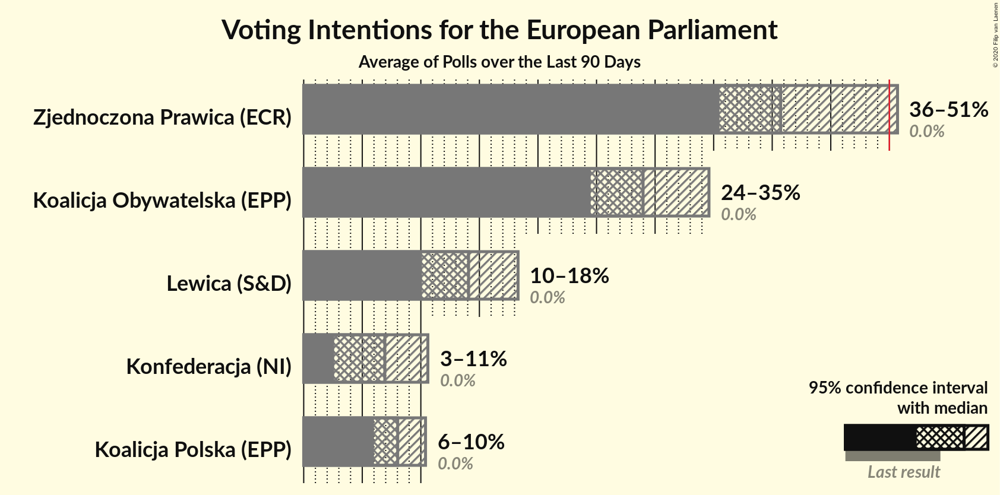

### Confidence Intervals

| Party | Last Result | Median | 80% Confidence Interval | 90% Confidence Interval | 95% Confidence Interval | 99% Confidence Interval |
|:-----:|:-----------:|:------:|:-----------------------:|:-----------------------:|:-----------------------:|:-----------------------:|
| <a href="#prawo-i-sprawiedliwość-(ecr)">Prawo i Sprawiedliwość (ECR)</a> | 0.0% | N/A | N/A |N/A | N/A | N/A |
| <a href="#platforma-obywatelska-(epp)">Platforma Obywatelska (EPP)</a> | 0.0% | N/A | N/A |N/A | N/A | N/A |
| <a href="#kukiz’15-(ni)">Kukiz’15 (NI)</a> | 0.0% | N/A | N/A |N/A | N/A | N/A |
| <a href="#.nowoczesna-(re)">.Nowoczesna (RE)</a> | 0.0% | N/A | N/A |N/A | N/A | N/A |
| <a href="#polskie-stronnictwo-ludowe-(epp)">Polskie Stronnictwo Ludowe (EPP)</a> | 0.0% | N/A | N/A |N/A | N/A | N/A |
| <a href="#sojusz-lewicy-demokratycznej-(s&d)">Sojusz Lewicy Demokratycznej (S&D)</a> | 0.0% | N/A | N/A |N/A | N/A | N/A |
| <a href="#korwin-(ni)">KORWiN (NI)</a> | 0.0% | N/A | N/A |N/A | N/A | N/A |
| <a href="#lewica-razem-(s&d)">Lewica Razem (S&D)</a> | 0.0% | N/A | N/A |N/A | N/A | N/A |
| <a href="#wiosna-(s&d)">Wiosna (S&D)</a> | 0.0% | N/A | N/A |N/A | N/A | N/A |
| <a href="#wiosna–partia-razem-(s&d)">Wiosna–Partia Razem (S&D)</a> | 0.0% | N/A | N/A |N/A | N/A | N/A |
| <a href="#koalicja-europejska-(epp)">Koalicja Europejska (EPP)</a> | 0.0% | N/A | N/A |N/A | N/A | N/A |
| <a href="#konfederacja-(ni)">Konfederacja (NI)</a> | 0.0% | 6.9% | 3.7–9.5% |2.9–10.2% | 2.6–10.6% | 2.1–11.5% |
| <a href="#koalicja-europejska-(epp)">Koalicja Europejska (EPP)</a> | 0.0% | N/A | N/A |N/A | N/A | N/A |
| <a href="#koalicja-obywatelska-(epp)">Koalicja Obywatelska (EPP)</a> | 0.0% | 29.0% | 25.8–32.9% |25.1–33.8% | 24.5–34.6% | 23.3–36.1% |
| <a href="#koalicja-polska-(epp)">Koalicja Polska (EPP)</a> | 0.0% | 8.0% | 6.7–9.5% |6.3–10.0% | 6.0–10.4% | 5.4–11.2% |
| <a href="#lewica-(s&d)">Lewica (S&D)</a> | 0.0% | 14.1% | 11.2–17.1% |10.6–17.7% | 10.1–18.3% | 9.3–19.3% |
| <a href="#wiosna–partia-razem-(s&d)">Wiosna–Partia Razem (S&D)</a> | 0.0% | N/A | N/A |N/A | N/A | N/A |
| <a href="#bezpartyjni-samorządowcy-(*)">Bezpartyjni Samorządowcy (*)</a> | 0.0% | N/A | N/A |N/A | N/A | N/A |
| <a href="#zjednoczona-prawica-(ecr)">Zjednoczona Prawica (ECR)</a> | 0.0% | 40.7% | 37.0–47.9% |36.2–49.7% | 35.5–50.7% | 34.1–52.3% |

### Zjednoczona Prawica (ECR)

*For a full overview of the results for this party, see the [Zjednoczona Prawica (ECR)](party-zjednoczonaprawicaecr.html) page.*

| Voting Intentions | Probability | Accumulated | Special Marks |
|:-----------------:|:-----------:|:-----------:|:-------------:|
| 0.0–0.5% | 0% | 100% | Last Result |
| 0.5–1.5% | 0% | 100% |  |
| 1.5–2.5% | 0% | 100% |  |
| 2.5–3.5% | 0% | 100% |  |
| 3.5–4.5% | 0% | 100% |  |
| 4.5–5.5% | 0% | 100% |  |
| 5.5–6.5% | 0% | 100% |  |
| 6.5–7.5% | 0% | 100% |  |
| 7.5–8.5% | 0% | 100% |  |
| 8.5–9.5% | 0% | 100% |  |
| 9.5–10.5% | 0% | 100% |  |
| 10.5–11.5% | 0% | 100% |  |
| 11.5–12.5% | 0% | 100% |  |
| 12.5–13.5% | 0% | 100% |  |
| 13.5–14.5% | 0% | 100% |  |
| 14.5–15.5% | 0% | 100% |  |
| 15.5–16.5% | 0% | 100% |  |
| 16.5–17.5% | 0% | 100% |  |
| 17.5–18.5% | 0% | 100% |  |
| 18.5–19.5% | 0% | 100% |  |
| 19.5–20.5% | 0% | 100% |  |
| 20.5–21.5% | 0% | 100% |  |
| 21.5–22.5% | 0% | 100% |  |
| 22.5–23.5% | 0% | 100% |  |
| 23.5–24.5% | 0% | 100% |  |
| 24.5–25.5% | 0% | 100% |  |
| 25.5–26.5% | 0% | 100% |  |
| 26.5–27.5% | 0% | 100% |  |
| 27.5–28.5% | 0% | 100% |  |
| 28.5–29.5% | 0% | 100% |  |
| 29.5–30.5% | 0% | 100% |  |
| 30.5–31.5% | 0% | 100% |  |
| 31.5–32.5% | 0% | 100% |  |
| 32.5–33.5% | 0.2% | 100% |  |
| 33.5–34.5% | 0.7% | 99.8% |  |
| 34.5–35.5% | 2% | 99.1% |  |
| 35.5–36.5% | 4% | 97% |  |
| 36.5–37.5% | 7% | 93% |  |
| 37.5–38.5% | 10% | 86% |  |
| 38.5–39.5% | 12% | 76% |  |
| 39.5–40.5% | 12% | 64% |  |
| 40.5–41.5% | 12% | 52% | Median |
| 41.5–42.5% | 10% | 40% |  |
| 42.5–43.5% | 7% | 30% |  |
| 43.5–44.5% | 5% | 23% |  |
| 44.5–45.5% | 3% | 18% |  |
| 45.5–46.5% | 2% | 15% |  |
| 46.5–47.5% | 2% | 13% |  |
| 47.5–48.5% | 2% | 11% |  |
| 48.5–49.5% | 3% | 8% |  |
| 49.5–50.5% | 3% | 5% |  |
| 50.5–51.5% | 2% | 3% |  |
| 51.5–52.5% | 0.8% | 1.2% |  |
| 52.5–53.5% | 0.3% | 0.4% |  |
| 53.5–54.5% | 0.1% | 0.1% |  |
| 54.5–55.5% | 0% | 0% |  |

### Koalicja Obywatelska (EPP)

*For a full overview of the results for this party, see the [Koalicja Obywatelska (EPP)](party-koalicjaobywatelskaepp.html) page.*

| Voting Intentions | Probability | Accumulated | Special Marks |
|:-----------------:|:-----------:|:-----------:|:-------------:|
| 0.0–0.5% | 0% | 100% | Last Result |
| 0.5–1.5% | 0% | 100% |  |
| 1.5–2.5% | 0% | 100% |  |
| 2.5–3.5% | 0% | 100% |  |
| 3.5–4.5% | 0% | 100% |  |
| 4.5–5.5% | 0% | 100% |  |
| 5.5–6.5% | 0% | 100% |  |
| 6.5–7.5% | 0% | 100% |  |
| 7.5–8.5% | 0% | 100% |  |
| 8.5–9.5% | 0% | 100% |  |
| 9.5–10.5% | 0% | 100% |  |
| 10.5–11.5% | 0% | 100% |  |
| 11.5–12.5% | 0% | 100% |  |
| 12.5–13.5% | 0% | 100% |  |
| 13.5–14.5% | 0% | 100% |  |
| 14.5–15.5% | 0% | 100% |  |
| 15.5–16.5% | 0% | 100% |  |
| 16.5–17.5% | 0% | 100% |  |
| 17.5–18.5% | 0% | 100% |  |
| 18.5–19.5% | 0% | 100% |  |
| 19.5–20.5% | 0% | 100% |  |
| 20.5–21.5% | 0% | 100% |  |
| 21.5–22.5% | 0.1% | 100% |  |
| 22.5–23.5% | 0.6% | 99.9% |  |
| 23.5–24.5% | 2% | 99.3% |  |
| 24.5–25.5% | 5% | 97% |  |
| 25.5–26.5% | 10% | 92% |  |
| 26.5–27.5% | 13% | 82% |  |
| 27.5–28.5% | 14% | 69% |  |
| 28.5–29.5% | 12% | 56% | Median |
| 29.5–30.5% | 11% | 43% |  |
| 30.5–31.5% | 11% | 32% |  |
| 31.5–32.5% | 9% | 22% |  |
| 32.5–33.5% | 6% | 12% |  |
| 33.5–34.5% | 4% | 6% |  |
| 34.5–35.5% | 2% | 3% |  |
| 35.5–36.5% | 0.7% | 1.0% |  |
| 36.5–37.5% | 0.2% | 0.3% |  |
| 37.5–38.5% | 0.1% | 0.1% |  |
| 38.5–39.5% | 0% | 0% |  |

### Lewica (S&D)

*For a full overview of the results for this party, see the [Lewica (S&D)](party-lewicasd.html) page.*

| Voting Intentions | Probability | Accumulated | Special Marks |
|:-----------------:|:-----------:|:-----------:|:-------------:|
| 0.0–0.5% | 0% | 100% | Last Result |
| 0.5–1.5% | 0% | 100% |  |
| 1.5–2.5% | 0% | 100% |  |
| 2.5–3.5% | 0% | 100% |  |
| 3.5–4.5% | 0% | 100% |  |
| 4.5–5.5% | 0% | 100% |  |
| 5.5–6.5% | 0% | 100% |  |
| 6.5–7.5% | 0% | 100% |  |
| 7.5–8.5% | 0.1% | 100% |  |
| 8.5–9.5% | 0.8% | 99.9% |  |
| 9.5–10.5% | 4% | 99.2% |  |
| 10.5–11.5% | 9% | 95% |  |
| 11.5–12.5% | 12% | 87% |  |
| 12.5–13.5% | 16% | 75% |  |
| 13.5–14.5% | 17% | 59% | Median |
| 14.5–15.5% | 15% | 42% |  |
| 15.5–16.5% | 12% | 27% |  |
| 16.5–17.5% | 9% | 15% |  |
| 17.5–18.5% | 5% | 6% |  |
| 18.5–19.5% | 1.4% | 2% |  |
| 19.5–20.5% | 0.3% | 0.3% |  |
| 20.5–21.5% | 0% | 0% |  |

### Koalicja Polska (EPP)

*For a full overview of the results for this party, see the [Koalicja Polska (EPP)](party-koalicjapolskaepp.html) page.*

| Voting Intentions | Probability | Accumulated | Special Marks |
|:-----------------:|:-----------:|:-----------:|:-------------:|
| 0.0–0.5% | 0% | 100% | Last Result |
| 0.5–1.5% | 0% | 100% |  |
| 1.5–2.5% | 0% | 100% |  |
| 2.5–3.5% | 0% | 100% |  |
| 3.5–4.5% | 0% | 100% |  |
| 4.5–5.5% | 0.7% | 100% |  |
| 5.5–6.5% | 7% | 99.3% |  |
| 6.5–7.5% | 25% | 92% |  |
| 7.5–8.5% | 35% | 67% | Median |
| 8.5–9.5% | 23% | 33% |  |
| 9.5–10.5% | 8% | 10% |  |
| 10.5–11.5% | 2% | 2% |  |
| 11.5–12.5% | 0.2% | 0.2% |  |
| 12.5–13.5% | 0% | 0% |  |

### Konfederacja (NI)

*For a full overview of the results for this party, see the [Konfederacja (NI)](party-konfederacjani.html) page.*

| Voting Intentions | Probability | Accumulated | Special Marks |
|:-----------------:|:-----------:|:-----------:|:-------------:|
| 0.0–0.5% | 0% | 100% | Last Result |
| 0.5–1.5% | 0% | 100% |  |
| 1.5–2.5% | 2% | 100% |  |
| 2.5–3.5% | 7% | 98% |  |
| 3.5–4.5% | 4% | 91% |  |
| 4.5–5.5% | 9% | 86% |  |
| 5.5–6.5% | 20% | 77% |  |
| 6.5–7.5% | 20% | 58% | Median |
| 7.5–8.5% | 15% | 38% |  |
| 8.5–9.5% | 12% | 22% |  |
| 9.5–10.5% | 7% | 10% |  |
| 10.5–11.5% | 2% | 3% |  |
| 11.5–12.5% | 0.4% | 0.4% |  |
| 12.5–13.5% | 0% | 0% |  |

## Seats

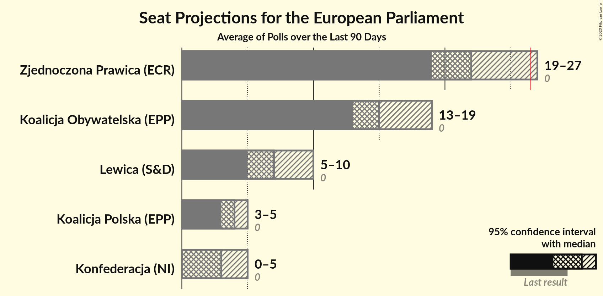

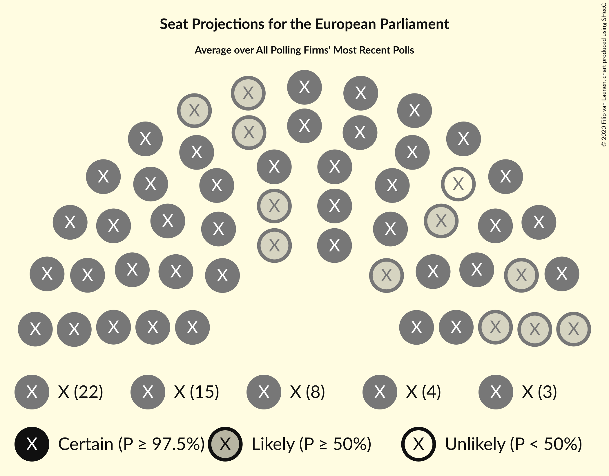

### Confidence Intervals

| Party | Last Result | Median | 80% Confidence Interval | 90% Confidence Interval | 95% Confidence Interval | 99% Confidence Interval |
|:-----:|:-----------:|:------:|:-----------------------:|:-----------------------:|:-----------------------:|:-----------------------:|
| <a href="#prawo-i-sprawiedliwość-(ecr)">Prawo i Sprawiedliwość (ECR)</a> | 0 | N/A | N/A |N/A | N/A | N/A |
| <a href="#platforma-obywatelska-(epp)">Platforma Obywatelska (EPP)</a> | 0 | N/A | N/A |N/A | N/A | N/A |
| <a href="#kukiz’15-(ni)">Kukiz’15 (NI)</a> | 0 | N/A | N/A |N/A | N/A | N/A |
| <a href="#.nowoczesna-(re)">.Nowoczesna (RE)</a> | 0 | N/A | N/A |N/A | N/A | N/A |
| <a href="#polskie-stronnictwo-ludowe-(epp)">Polskie Stronnictwo Ludowe (EPP)</a> | 0 | N/A | N/A |N/A | N/A | N/A |
| <a href="#sojusz-lewicy-demokratycznej-(s&d)">Sojusz Lewicy Demokratycznej (S&D)</a> | 0 | N/A | N/A |N/A | N/A | N/A |
| <a href="#korwin-(ni)">KORWiN (NI)</a> | 0 | N/A | N/A |N/A | N/A | N/A |
| <a href="#lewica-razem-(s&d)">Lewica Razem (S&D)</a> | 0 | N/A | N/A |N/A | N/A | N/A |
| <a href="#wiosna-(s&d)">Wiosna (S&D)</a> | 0 | N/A | N/A |N/A | N/A | N/A |
| <a href="#wiosna–partia-razem-(s&d)">Wiosna–Partia Razem (S&D)</a> | 0 | N/A | N/A |N/A | N/A | N/A |
| <a href="#koalicja-europejska-(epp)">Koalicja Europejska (EPP)</a> | 0 | N/A | N/A |N/A | N/A | N/A |
| <a href="#konfederacja-(ni)">Konfederacja (NI)</a> | 0 | 3 | 0–5 |0–5 | 0–5 | 0–6 |
| <a href="#koalicja-europejska-(epp)">Koalicja Europejska (EPP)</a> | 0 | N/A | N/A |N/A | N/A | N/A |
| <a href="#koalicja-obywatelska-(epp)">Koalicja Obywatelska (EPP)</a> | 0 | 15 | 14–18 |13–18 | 13–19 | 12–19 |
| <a href="#koalicja-polska-(epp)">Koalicja Polska (EPP)</a> | 0 | 4 | 3–5 |3–5 | 3–5 | 3–6 |
| <a href="#lewica-(s&d)">Lewica (S&D)</a> | 0 | 7 | 6–9 |5–9 | 5–10 | 5–10 |
| <a href="#wiosna–partia-razem-(s&d)">Wiosna–Partia Razem (S&D)</a> | 0 | N/A | N/A |N/A | N/A | N/A |
| <a href="#bezpartyjni-samorządowcy-(*)">Bezpartyjni Samorządowcy (*)</a> | 0 | N/A | N/A |N/A | N/A | N/A |
| <a href="#zjednoczona-prawica-(ecr)">Zjednoczona Prawica (ECR)</a> | 0 | 22 | 20–26 |19–27 | 19–27 | 18–28 |

### Zjednoczona Prawica (ECR)

*For a full overview of the results for this party, see the [Zjednoczona Prawica (ECR)](party-zjednoczonaprawicaecr.html) page.*

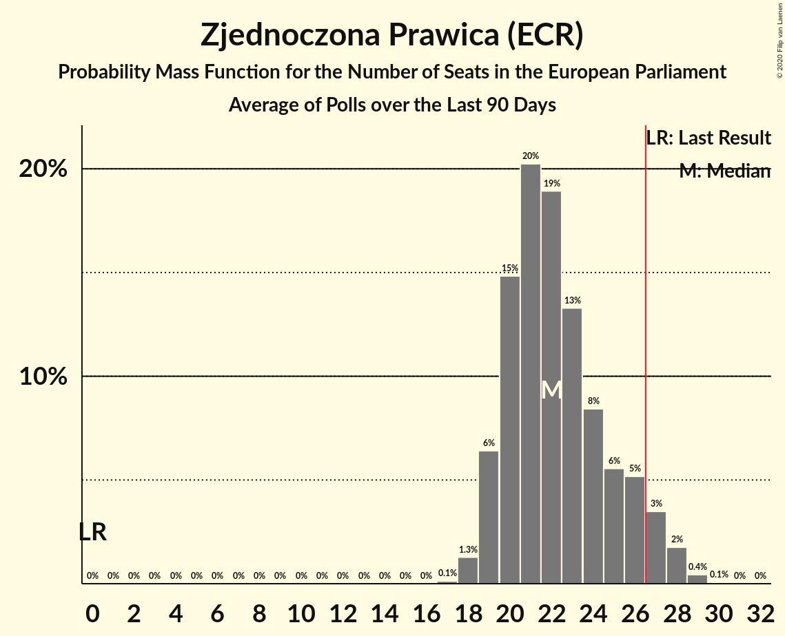

| Number of Seats | Probability | Accumulated | Special Marks |
|:---------------:|:-----------:|:-----------:|:-------------:|
| 0 | 0% | 100% | Last Result |
| 1 | 0% | 100% |  |
| 2 | 0% | 100% |  |
| 3 | 0% | 100% |  |
| 4 | 0% | 100% |  |
| 5 | 0% | 100% |  |
| 6 | 0% | 100% |  |
| 7 | 0% | 100% |  |
| 8 | 0% | 100% |  |
| 9 | 0% | 100% |  |
| 10 | 0% | 100% |  |
| 11 | 0% | 100% |  |
| 12 | 0% | 100% |  |
| 13 | 0% | 100% |  |
| 14 | 0% | 100% |  |
| 15 | 0% | 100% |  |
| 16 | 0% | 100% |  |
| 17 | 0.1% | 100% |  |
| 18 | 1.3% | 99.9% |  |
| 19 | 6% | 98.6% |  |
| 20 | 15% | 92% |  |
| 21 | 20% | 77% |  |
| 22 | 19% | 57% | Median |
| 23 | 13% | 38% |  |
| 24 | 8% | 25% |  |
| 25 | 6% | 16% |  |
| 26 | 5% | 11% |  |
| 27 | 3% | 6% | Majority |
| 28 | 2% | 2% |  |
| 29 | 0.4% | 0.5% |  |
| 30 | 0.1% | 0.1% |  |
| 31 | 0% | 0% |  |

### Koalicja Obywatelska (EPP)

*For a full overview of the results for this party, see the [Koalicja Obywatelska (EPP)](party-koalicjaobywatelskaepp.html) page.*

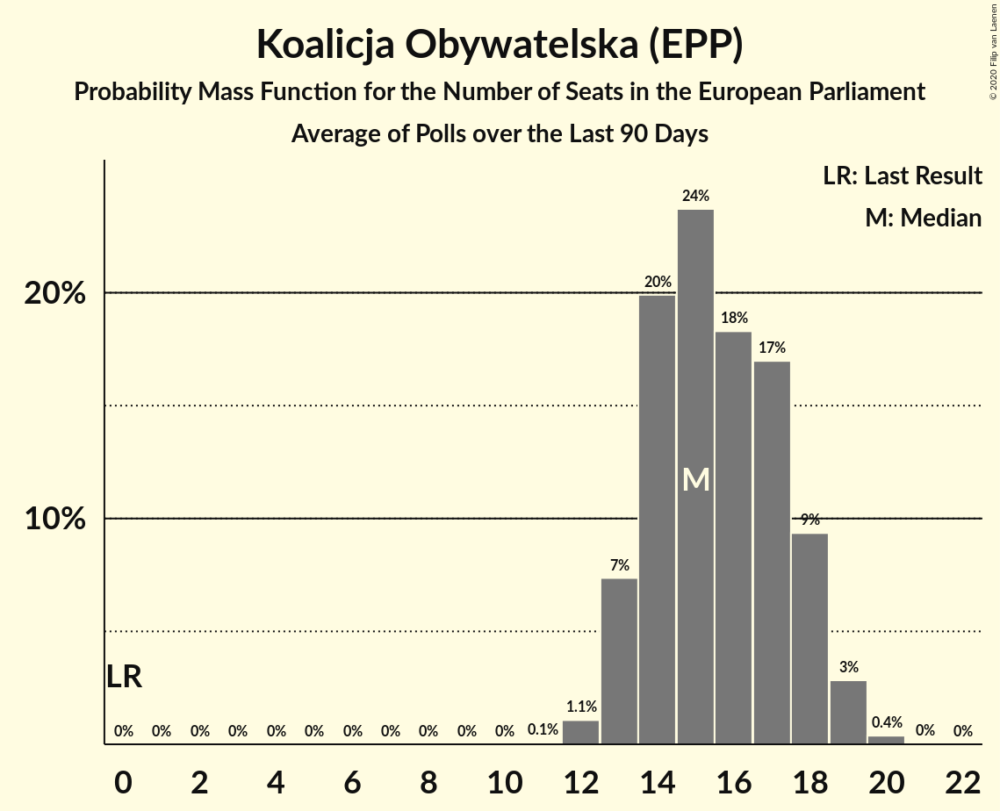

| Number of Seats | Probability | Accumulated | Special Marks |
|:---------------:|:-----------:|:-----------:|:-------------:|
| 0 | 0% | 100% | Last Result |
| 1 | 0% | 100% |  |
| 2 | 0% | 100% |  |
| 3 | 0% | 100% |  |
| 4 | 0% | 100% |  |
| 5 | 0% | 100% |  |
| 6 | 0% | 100% |  |
| 7 | 0% | 100% |  |
| 8 | 0% | 100% |  |
| 9 | 0% | 100% |  |
| 10 | 0% | 100% |  |
| 11 | 0.1% | 100% |  |
| 12 | 1.1% | 99.9% |  |
| 13 | 7% | 98.9% |  |
| 14 | 20% | 91% |  |
| 15 | 24% | 72% | Median |
| 16 | 18% | 48% |  |
| 17 | 17% | 30% |  |
| 18 | 9% | 13% |  |
| 19 | 3% | 3% |  |
| 20 | 0.4% | 0.4% |  |
| 21 | 0% | 0% |  |

### Lewica (S&D)

*For a full overview of the results for this party, see the [Lewica (S&D)](party-lewicasd.html) page.*

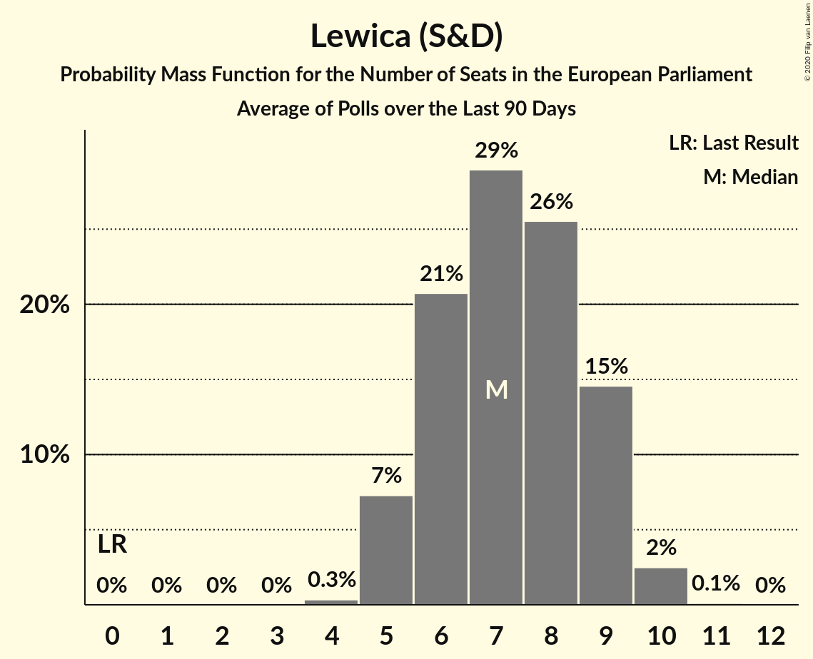

| Number of Seats | Probability | Accumulated | Special Marks |
|:---------------:|:-----------:|:-----------:|:-------------:|
| 0 | 0% | 100% | Last Result |
| 1 | 0% | 100% |  |
| 2 | 0% | 100% |  |
| 3 | 0% | 100% |  |
| 4 | 0.3% | 100% |  |
| 5 | 7% | 99.7% |  |
| 6 | 21% | 92% |  |
| 7 | 29% | 72% | Median |
| 8 | 26% | 43% |  |
| 9 | 15% | 17% |  |
| 10 | 2% | 3% |  |
| 11 | 0.1% | 0.1% |  |
| 12 | 0% | 0% |  |

### Koalicja Polska (EPP)

*For a full overview of the results for this party, see the [Koalicja Polska (EPP)](party-koalicjapolskaepp.html) page.*

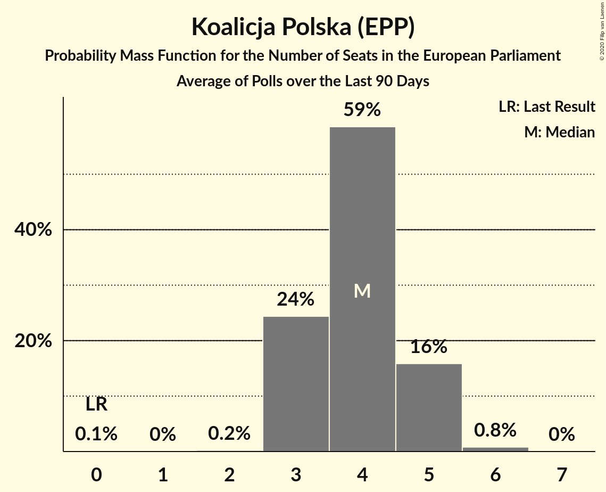

| Number of Seats | Probability | Accumulated | Special Marks |
|:---------------:|:-----------:|:-----------:|:-------------:|
| 0 | 0.1% | 100% | Last Result |
| 1 | 0% | 99.9% |  |
| 2 | 0.2% | 99.9% |  |
| 3 | 24% | 99.6% |  |
| 4 | 59% | 75% | Median |
| 5 | 16% | 17% |  |
| 6 | 0.8% | 0.8% |  |
| 7 | 0% | 0% |  |

### Konfederacja (NI)

*For a full overview of the results for this party, see the [Konfederacja (NI)](party-konfederacjani.html) page.*

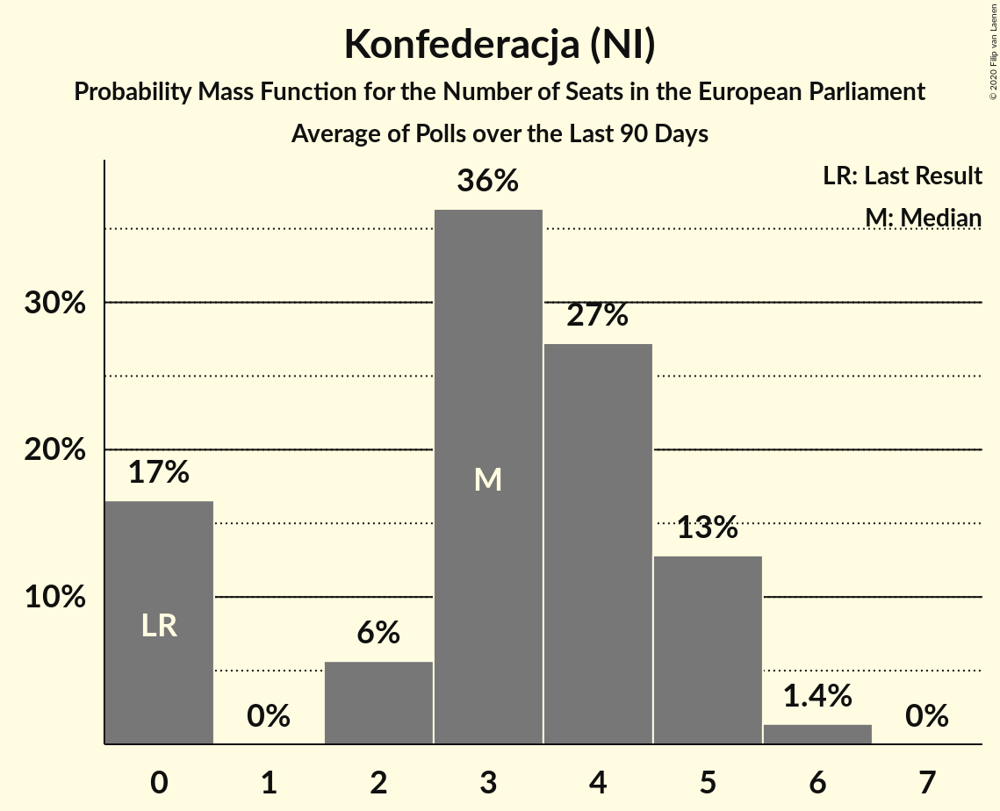

| Number of Seats | Probability | Accumulated | Special Marks |
|:---------------:|:-----------:|:-----------:|:-------------:|
| 0 | 17% | 100% | Last Result |
| 1 | 0% | 83% |  |
| 2 | 6% | 83% |  |
| 3 | 36% | 78% | Median |
| 4 | 27% | 41% |  |
| 5 | 13% | 14% |  |
| 6 | 1.4% | 1.4% |  |
| 7 | 0% | 0% |  |

## Coalitions

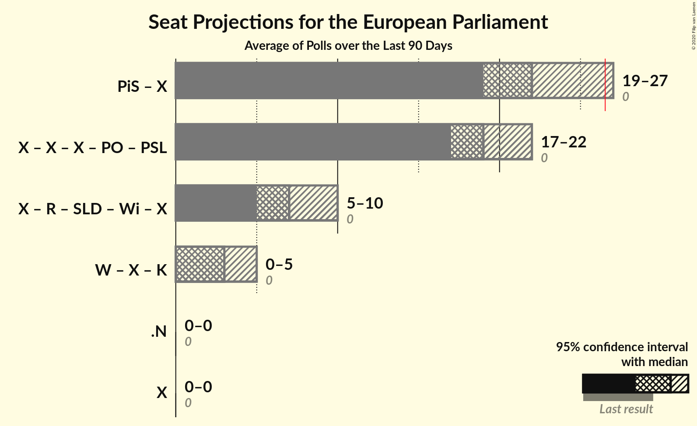

### Confidence Intervals

| Coalition | Last Result | Median | Majority? | 80% Confidence Interval | 90% Confidence Interval | 95% Confidence Interval | 99% Confidence Interval |
|:---------:|:-----------:|:------:|:---------:|:-----------------------:|:-----------------------:|:-----------------------:|:-----------------------:|
| Prawo i Sprawiedliwość (ECR) – Zjednoczona Prawica (ECR) | 0 | 22 | 6% | 20–26 | 19–27 | 19–27 | 18–28 |
| Koalicja Europejska (EPP) – Koalicja Obywatelska (EPP) – Koalicja Polska (EPP) – Platforma Obywatelska (EPP) – Polskie Stronnictwo Ludowe (EPP) | 0 | 19 | 0% | 18–21 | 17–22 | 17–22 | 16–23 |
| Lewica (S&D) – Lewica Razem (S&D) – Sojusz Lewicy Demokratycznej (S&D) – Wiosna (S&D) – Wiosna–Partia Razem (S&D) | 0 | 7 | 0% | 6–9 | 5–9 | 5–10 | 5–10 |
| KORWiN (NI) – Konfederacja (NI) – Kukiz’15 (NI) | 0 | 3 | 0% | 0–5 | 0–5 | 0–5 | 0–6 |
| .Nowoczesna (RE) | 0 | 0 | 0% | 0 | 0 | 0 | 0 |
| Bezpartyjni Samorządowcy (*) | 0 | 0 | 0% | 0 | 0 | 0 | 0 |

### Prawo i Sprawiedliwość (ECR) – Zjednoczona Prawica (ECR)

| Number of Seats | Probability | Accumulated | Special Marks |
|:---------------:|:-----------:|:-----------:|:-------------:|
| 0 | 0% | 100% | Last Result |
| 1 | 0% | 100% |  |
| 2 | 0% | 100% |  |
| 3 | 0% | 100% |  |
| 4 | 0% | 100% |  |
| 5 | 0% | 100% |  |
| 6 | 0% | 100% |  |
| 7 | 0% | 100% |  |
| 8 | 0% | 100% |  |
| 9 | 0% | 100% |  |
| 10 | 0% | 100% |  |
| 11 | 0% | 100% |  |
| 12 | 0% | 100% |  |
| 13 | 0% | 100% |  |
| 14 | 0% | 100% |  |
| 15 | 0% | 100% |  |
| 16 | 0% | 100% |  |
| 17 | 0.1% | 100% |  |
| 18 | 1.3% | 99.9% |  |
| 19 | 6% | 98.6% |  |
| 20 | 15% | 92% |  |
| 21 | 20% | 77% |  |
| 22 | 19% | 57% | Median |
| 23 | 13% | 38% |  |
| 24 | 8% | 25% |  |
| 25 | 6% | 16% |  |
| 26 | 5% | 11% |  |
| 27 | 3% | 6% | Majority |
| 28 | 2% | 2% |  |
| 29 | 0.4% | 0.5% |  |
| 30 | 0.1% | 0.1% |  |
| 31 | 0% | 0% |  |

### Koalicja Europejska (EPP) – Koalicja Obywatelska (EPP) – Koalicja Polska (EPP) – Platforma Obywatelska (EPP) – Polskie Stronnictwo Ludowe (EPP)

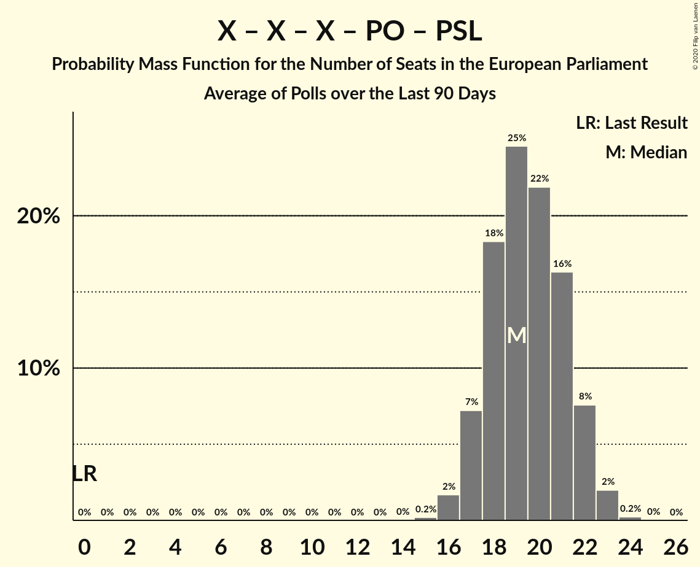

| Number of Seats | Probability | Accumulated | Special Marks |
|:---------------:|:-----------:|:-----------:|:-------------:|
| 0 | 0% | 100% | Last Result |
| 1 | 0% | 100% |  |
| 2 | 0% | 100% |  |
| 3 | 0% | 100% |  |
| 4 | 0% | 100% |  |
| 5 | 0% | 100% |  |
| 6 | 0% | 100% |  |
| 7 | 0% | 100% |  |
| 8 | 0% | 100% |  |
| 9 | 0% | 100% |  |
| 10 | 0% | 100% |  |
| 11 | 0% | 100% |  |
| 12 | 0% | 100% |  |
| 13 | 0% | 100% |  |
| 14 | 0% | 100% |  |
| 15 | 0.2% | 100% |  |
| 16 | 2% | 99.8% |  |
| 17 | 7% | 98% |  |
| 18 | 18% | 91% |  |
| 19 | 25% | 73% | Median |
| 20 | 22% | 48% |  |
| 21 | 16% | 26% |  |
| 22 | 8% | 10% |  |
| 23 | 2% | 2% |  |
| 24 | 0.2% | 0.2% |  |
| 25 | 0% | 0% |  |

### Lewica (S&D) – Lewica Razem (S&D) – Sojusz Lewicy Demokratycznej (S&D) – Wiosna (S&D) – Wiosna–Partia Razem (S&D)

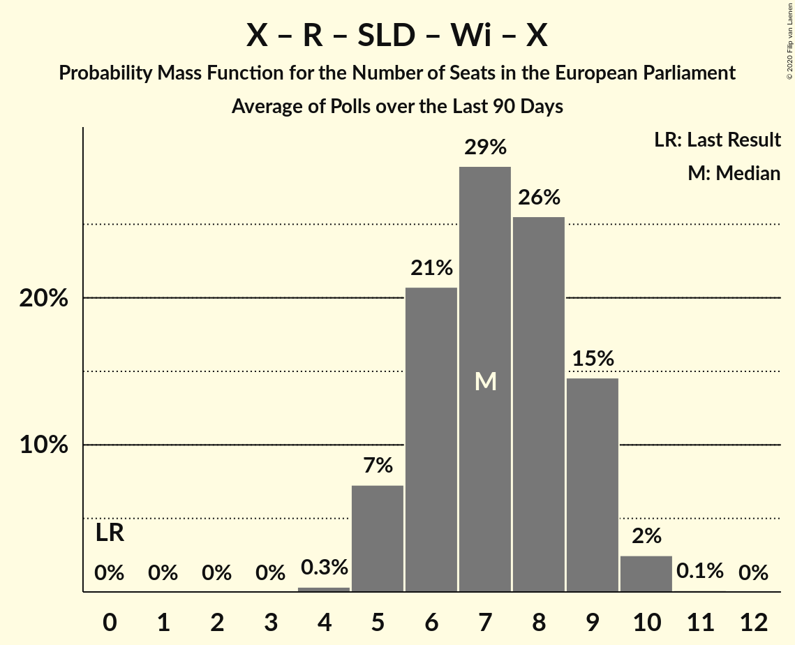

| Number of Seats | Probability | Accumulated | Special Marks |
|:---------------:|:-----------:|:-----------:|:-------------:|
| 0 | 0% | 100% | Last Result |
| 1 | 0% | 100% |  |
| 2 | 0% | 100% |  |
| 3 | 0% | 100% |  |
| 4 | 0.3% | 100% |  |
| 5 | 7% | 99.7% |  |
| 6 | 21% | 92% |  |
| 7 | 29% | 72% | Median |
| 8 | 26% | 43% |  |
| 9 | 15% | 17% |  |
| 10 | 2% | 3% |  |
| 11 | 0.1% | 0.1% |  |
| 12 | 0% | 0% |  |

### KORWiN (NI) – Konfederacja (NI) – Kukiz’15 (NI)

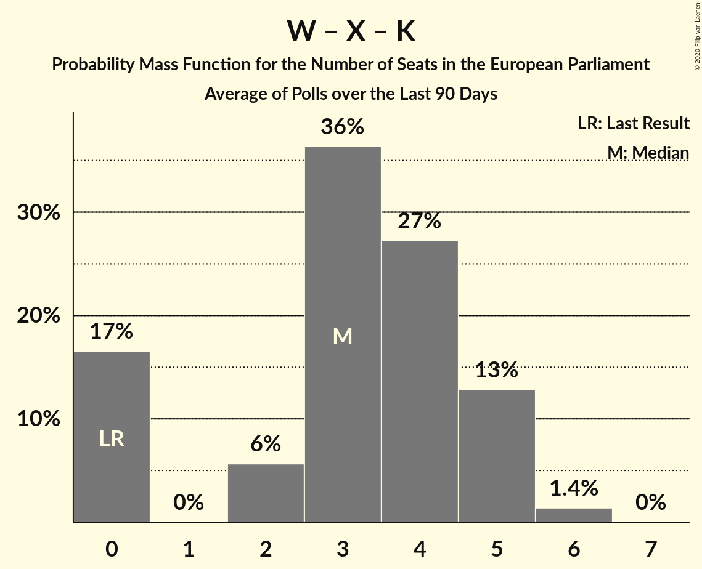

| Number of Seats | Probability | Accumulated | Special Marks |
|:---------------:|:-----------:|:-----------:|:-------------:|
| 0 | 17% | 100% | Last Result |
| 1 | 0% | 83% |  |
| 2 | 6% | 83% |  |
| 3 | 36% | 78% | Median |
| 4 | 27% | 41% |  |
| 5 | 13% | 14% |  |
| 6 | 1.4% | 1.4% |  |
| 7 | 0% | 0% |  |

### .Nowoczesna (RE)

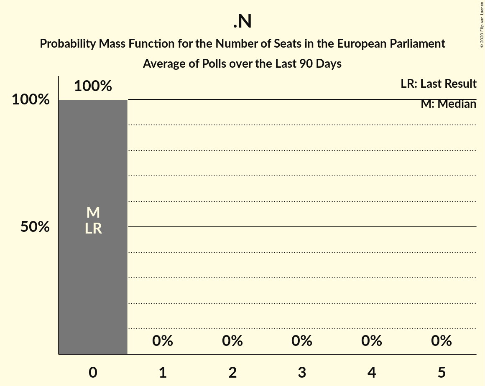

| Number of Seats | Probability | Accumulated | Special Marks |
|:---------------:|:-----------:|:-----------:|:-------------:|
| 0 | 100% | 100% | Last Result, Median |

### Bezpartyjni Samorządowcy (*)

| Number of Seats | Probability | Accumulated | Special Marks |
|:---------------:|:-----------:|:-----------:|:-------------:|
| 0 | 100% | 100% | Last Result, Median |

## Technical Information

+ **Number of polls included in this average:** 8
+ **Lowest number of simulations done in a poll included in this average:** 1,048,576
+ **Total number of simulations done in the polls included in this average:** 8,388,608
+ **Error estimate:** 2.07%
