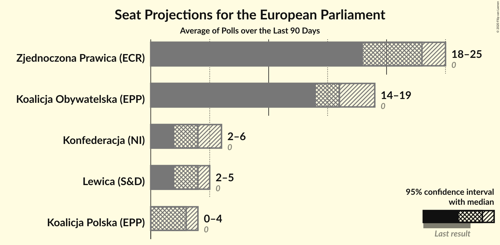
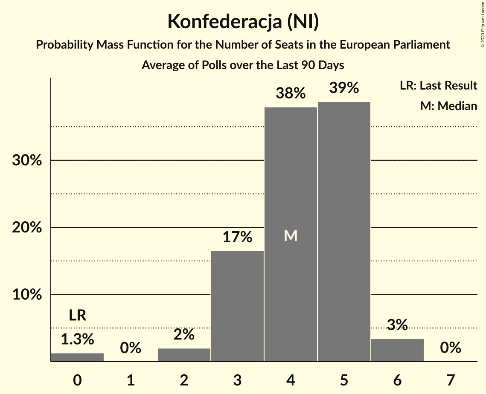
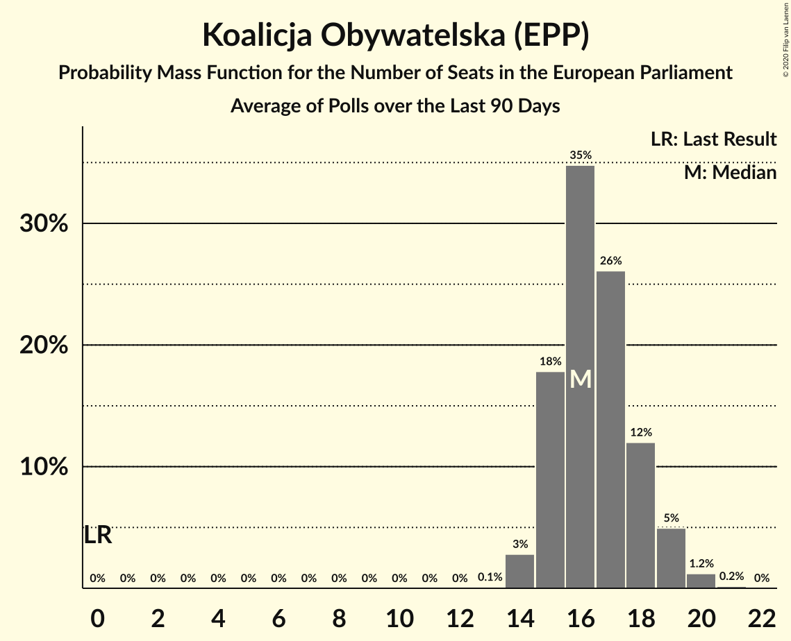
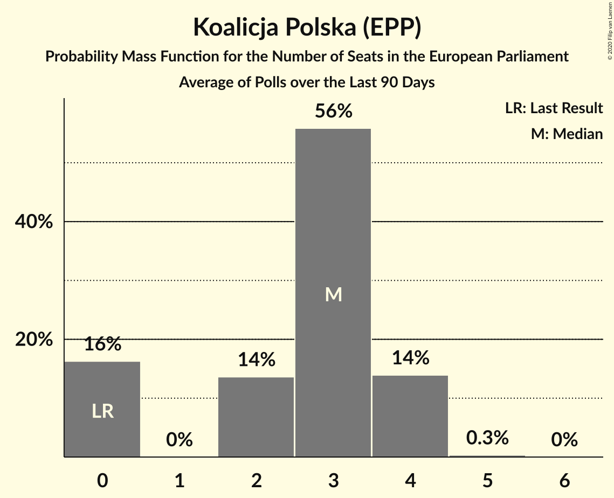
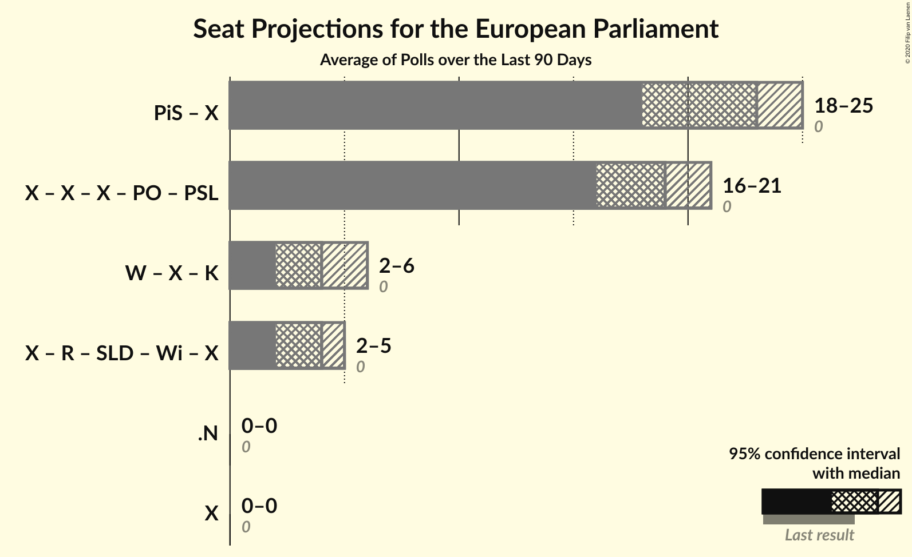
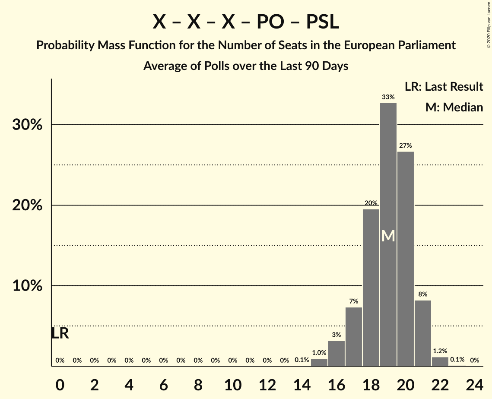

# Poll Average

<a href="#voting-intentions">Voting Intentions</a> | <a href="#seats">Seats</a> | <a href="#coalitions">Coalitions</a> | <a href="#technical-information">Technical Information</a>

## Summary

The table below lists the polls on which the average is based. They are the most recent polls (less than 90 days old) registered and analyzed so far.

| Period     | Polling firm/Commissioner(s) | PiS | PO | K | .N | PSL | SLD | W | R | Wi | X | X | X | X | X | X | X | X | X | X |
|:----------:|:----------------------------:|:--:|:--:|:--:|:--:|:--:|:--:|:--:|:--:|:--:|:--:|:--:|:--:|:--:|:--:|:--:|:--:|:--:|:--:|:--:|
| 26 May 2019 | General Election | 0.0%   0 | 0.0%   0 | 0.0%   0 | 0.0%   0 | 0.0%   0 | 0.0%   0 | 0.0%   0 | 0.0%   0 | 0.0%   0 | 0.0%   0 | 0.0%   0 | 0.0%   0 | 0.0%   0 | 0.0%   0 | 0.0%   0 | 0.0%   0 | 0.0%   0 | 0.0%   0 | 0.0%   0 |
| N/A | Poll Average | N/A   N/A | N/A   N/A | N/A   N/A | N/A   N/A | N/A   N/A | N/A   N/A | N/A   N/A | N/A   N/A | N/A   N/A | N/A   N/A | N/A   N/A | 5–11%   2–6 | N/A   N/A | 27–35%   14–19 | 4–8%   0–4 | 5–11%   2–5 | N/A   N/A | N/A   N/A | 34–46%   18–25 |
| [29 July 2020](2020-07-29-IBRiS.html) | IBRiS   KO | N/A   N/A | N/A   N/A | N/A   N/A | N/A   N/A | N/A   N/A | N/A   N/A | N/A   N/A | N/A   N/A | N/A   N/A | N/A   N/A | N/A   N/A | 5–8%   0–4 | N/A   N/A | 30–36%   16–20 | 4–6%   0–3 | 5–8%   0–4 | N/A   N/A | N/A   N/A | 33–39%   18–22 |
| [24–27 July 2020](2020-07-27-SocialChanges.html) | Social Changes   wPolityce.pl | N/A   N/A | N/A   N/A | N/A   N/A | N/A   N/A | N/A   N/A | N/A   N/A | N/A   N/A | N/A   N/A | N/A   N/A | N/A   N/A | N/A   N/A | 7–11%   4–6 | N/A   N/A | 26–32%   14–17 | 6–9%   3–4 | 7–10%   3–5 | N/A   N/A | N/A   N/A | 40–46%   22–26 |
| [23–24 July 2020](2020-07-24-Estymator.html) | Estymator   DoRzeczy.pl | N/A   N/A | N/A   N/A | N/A   N/A | N/A   N/A | N/A   N/A | N/A   N/A | N/A   N/A | N/A   N/A | N/A   N/A | N/A   N/A | N/A   N/A | 7–11%   3–5 | N/A   N/A | 28–34%   15–18 | 5–8%   2–4 | 8–11%   4–6 | N/A   N/A | N/A   N/A | 41–47%   22–25 |
| [18 July 2020](2020-07-18-UnitedSurveys.html) | United Surveys   RMF | N/A   N/A | N/A   N/A | N/A   N/A | N/A   N/A | N/A   N/A | N/A   N/A | N/A   N/A | N/A   N/A | N/A   N/A | N/A   N/A | N/A   N/A | 7–11%   3–5 | N/A   N/A | 26–32%   14–17 | 4–7%   0–3 | 7–10%   3–5 | N/A   N/A | N/A   N/A | 35–40%   19–22 |
| [25–26 June 2020](2020-06-26-IBSP.html) | IBSP | N/A   N/A | N/A   N/A | N/A   N/A | N/A   N/A | N/A   N/A | N/A   N/A | N/A   N/A | N/A   N/A | N/A   N/A | N/A   N/A | N/A   N/A | 8–12%   4–6 | N/A   N/A | 28–34%   15–18 | 5–8%   0–4 | 7–11%   4–5 | N/A   N/A | N/A   N/A | 41–47%   22–25 |
| 26 May 2019 | General Election | 0.0%   0 | 0.0%   0 | 0.0%   0 | 0.0%   0 | 0.0%   0 | 0.0%   0 | 0.0%   0 | 0.0%   0 | 0.0%   0 | 0.0%   0 | 0.0%   0 | 0.0%   0 | 0.0%   0 | 0.0%   0 | 0.0%   0 | 0.0%   0 | 0.0%   0 | 0.0%   0 | 0.0%   0 |

Only polls for which at least the sample size has been published are included in the table above.

**Legend:**
+ **Top half of each row:** Voting intentions (95% confidence interval)
+ **Bottom half of each row:** Seat projections for the European Parliament (95% confidence interval)
+ **PiS:** Prawo i Sprawiedliwość (ECR)
+ **PO:** Platforma Obywatelska (EPP)
+ **K:** Kukiz’15 (NI)
+ **.N:** .Nowoczesna (RE)
+ **PSL:** Polskie Stronnictwo Ludowe (EPP)
+ **SLD:** Sojusz Lewicy Demokratycznej (S&D)
+ **W:** KORWiN (NI)
+ **R:** Lewica Razem (S&D)
+ **Wi:** Wiosna (S&D)
+ **X:** Wiosna–Partia Razem (S&D)
+ **X:** Koalicja Europejska (EPP)
+ **X:** Konfederacja (NI)
+ **X:** Koalicja Europejska (EPP)
+ **X:** Koalicja Obywatelska (EPP)
+ **X:** Koalicja Polska (EPP)
+ **X:** Lewica (S&D)
+ **X:** Wiosna–Partia Razem (S&D)
+ **X:** Bezpartyjni Samorządowcy (*)
+ **X:** Zjednoczona Prawica (ECR)
+ **N/A (single party):** Party not included the published results
+ **N/A (entire row):** Calculation for this opinion poll not started yet

## Voting Intentions

### Confidence Intervals

| Party | Last Result | Median | 80% Confidence Interval | 90% Confidence Interval | 95% Confidence Interval | 99% Confidence Interval |
|:-----:|:-----------:|:------:|:-----------------------:|:-----------------------:|:-----------------------:|:-----------------------:|
| <a href="#prawo-i-sprawiedliwość-(ecr)">Prawo i Sprawiedliwość (ECR)</a> | 0.0% | N/A | N/A |N/A | N/A | N/A |
| <a href="#platforma-obywatelska-(epp)">Platforma Obywatelska (EPP)</a> | 0.0% | N/A | N/A |N/A | N/A | N/A |
| <a href="#kukiz’15-(ni)">Kukiz’15 (NI)</a> | 0.0% | N/A | N/A |N/A | N/A | N/A |
| <a href="#.nowoczesna-(re)">.Nowoczesna (RE)</a> | 0.0% | N/A | N/A |N/A | N/A | N/A |
| <a href="#polskie-stronnictwo-ludowe-(epp)">Polskie Stronnictwo Ludowe (EPP)</a> | 0.0% | N/A | N/A |N/A | N/A | N/A |
| <a href="#sojusz-lewicy-demokratycznej-(s&d)">Sojusz Lewicy Demokratycznej (S&D)</a> | 0.0% | N/A | N/A |N/A | N/A | N/A |
| <a href="#korwin-(ni)">KORWiN (NI)</a> | 0.0% | N/A | N/A |N/A | N/A | N/A |
| <a href="#lewica-razem-(s&d)">Lewica Razem (S&D)</a> | 0.0% | N/A | N/A |N/A | N/A | N/A |
| <a href="#wiosna-(s&d)">Wiosna (S&D)</a> | 0.0% | N/A | N/A |N/A | N/A | N/A |
| <a href="#wiosna–partia-razem-(s&d)">Wiosna–Partia Razem (S&D)</a> | 0.0% | N/A | N/A |N/A | N/A | N/A |
| <a href="#koalicja-europejska-(epp)">Koalicja Europejska (EPP)</a> | 0.0% | N/A | N/A |N/A | N/A | N/A |
| <a href="#konfederacja-(ni)">Konfederacja (NI)</a> | 0.0% | 8.8% | 6.1–10.3% |5.6–10.7% | 5.3–11.0% | 4.7–11.7% |
| <a href="#koalicja-europejska-(epp)">Koalicja Europejska (EPP)</a> | 0.0% | N/A | N/A |N/A | N/A | N/A |
| <a href="#koalicja-obywatelska-(epp)">Koalicja Obywatelska (EPP)</a> | 0.0% | 30.5% | 28.1–33.3% |27.5–34.1% | 27.0–34.7% | 26.0–35.9% |
| <a href="#koalicja-polska-(epp)">Koalicja Polska (EPP)</a> | 0.0% | 6.0% | 4.7–7.4% |4.5–7.8% | 4.2–8.1% | 3.8–8.7% |
| <a href="#lewica-(s&d)">Lewica (S&D)</a> | 0.0% | 8.3% | 6.0–9.9% |5.6–10.3% | 5.3–10.7% | 4.7–11.4% |
| <a href="#wiosna–partia-razem-(s&d)">Wiosna–Partia Razem (S&D)</a> | 0.0% | N/A | N/A |N/A | N/A | N/A |
| <a href="#bezpartyjni-samorządowcy-(*)">Bezpartyjni Samorządowcy (*)</a> | 0.0% | N/A | N/A |N/A | N/A | N/A |
| <a href="#zjednoczona-prawica-(ecr)">Zjednoczona Prawica (ECR)</a> | 0.0% | 42.1% | 35.7–45.1% |34.9–45.8% | 34.3–46.3% | 33.2–47.4% |

### Zjednoczona Prawica (ECR)

*For a full overview of the results for this party, see the [Zjednoczona Prawica (ECR)](party-zjednoczonaprawicaecr.html) page.*

| Voting Intentions | Probability | Accumulated | Special Marks |
|:-----------------:|:-----------:|:-----------:|:-------------:|
| 0.0–0.5% | 0% | 100% | Last Result |
| 0.5–1.5% | 0% | 100% |  |
| 1.5–2.5% | 0% | 100% |  |
| 2.5–3.5% | 0% | 100% |  |
| 3.5–4.5% | 0% | 100% |  |
| 4.5–5.5% | 0% | 100% |  |
| 5.5–6.5% | 0% | 100% |  |
| 6.5–7.5% | 0% | 100% |  |
| 7.5–8.5% | 0% | 100% |  |
| 8.5–9.5% | 0% | 100% |  |
| 9.5–10.5% | 0% | 100% |  |
| 10.5–11.5% | 0% | 100% |  |
| 11.5–12.5% | 0% | 100% |  |
| 12.5–13.5% | 0% | 100% |  |
| 13.5–14.5% | 0% | 100% |  |
| 14.5–15.5% | 0% | 100% |  |
| 15.5–16.5% | 0% | 100% |  |
| 16.5–17.5% | 0% | 100% |  |
| 17.5–18.5% | 0% | 100% |  |
| 18.5–19.5% | 0% | 100% |  |
| 19.5–20.5% | 0% | 100% |  |
| 20.5–21.5% | 0% | 100% |  |
| 21.5–22.5% | 0% | 100% |  |
| 22.5–23.5% | 0% | 100% |  |
| 23.5–24.5% | 0% | 100% |  |
| 24.5–25.5% | 0% | 100% |  |
| 25.5–26.5% | 0% | 100% |  |
| 26.5–27.5% | 0% | 100% |  |
| 27.5–28.5% | 0% | 100% |  |
| 28.5–29.5% | 0% | 100% |  |
| 29.5–30.5% | 0% | 100% |  |
| 30.5–31.5% | 0% | 100% |  |
| 31.5–32.5% | 0.1% | 100% |  |
| 32.5–33.5% | 0.7% | 99.8% |  |
| 33.5–34.5% | 3% | 99.1% |  |
| 34.5–35.5% | 6% | 97% |  |
| 35.5–36.5% | 9% | 91% |  |
| 36.5–37.5% | 9% | 82% |  |
| 37.5–38.5% | 7% | 73% |  |
| 38.5–39.5% | 4% | 66% |  |
| 39.5–40.5% | 3% | 62% |  |
| 40.5–41.5% | 5% | 59% |  |
| 41.5–42.5% | 9% | 54% | Median |
| 42.5–43.5% | 14% | 45% |  |
| 43.5–44.5% | 14% | 31% |  |
| 44.5–45.5% | 10% | 17% |  |
| 45.5–46.5% | 5% | 6% |  |
| 46.5–47.5% | 1.5% | 2% |  |
| 47.5–48.5% | 0.3% | 0.4% |  |
| 48.5–49.5% | 0% | 0.1% |  |
| 49.5–50.5% | 0% | 0% |  |

### Koalicja Obywatelska (EPP)

*For a full overview of the results for this party, see the [Koalicja Obywatelska (EPP)](party-koalicjaobywatelskaepp.html) page.*

| Voting Intentions | Probability | Accumulated | Special Marks |
|:-----------------:|:-----------:|:-----------:|:-------------:|
| 0.0–0.5% | 0% | 100% | Last Result |
| 0.5–1.5% | 0% | 100% |  |
| 1.5–2.5% | 0% | 100% |  |
| 2.5–3.5% | 0% | 100% |  |
| 3.5–4.5% | 0% | 100% |  |
| 4.5–5.5% | 0% | 100% |  |
| 5.5–6.5% | 0% | 100% |  |
| 6.5–7.5% | 0% | 100% |  |
| 7.5–8.5% | 0% | 100% |  |
| 8.5–9.5% | 0% | 100% |  |
| 9.5–10.5% | 0% | 100% |  |
| 10.5–11.5% | 0% | 100% |  |
| 11.5–12.5% | 0% | 100% |  |
| 12.5–13.5% | 0% | 100% |  |
| 13.5–14.5% | 0% | 100% |  |
| 14.5–15.5% | 0% | 100% |  |
| 15.5–16.5% | 0% | 100% |  |
| 16.5–17.5% | 0% | 100% |  |
| 17.5–18.5% | 0% | 100% |  |
| 18.5–19.5% | 0% | 100% |  |
| 19.5–20.5% | 0% | 100% |  |
| 20.5–21.5% | 0% | 100% |  |
| 21.5–22.5% | 0% | 100% |  |
| 22.5–23.5% | 0% | 100% |  |
| 23.5–24.5% | 0% | 100% |  |
| 24.5–25.5% | 0.2% | 100% |  |
| 25.5–26.5% | 1.1% | 99.8% |  |
| 26.5–27.5% | 4% | 98.7% |  |
| 27.5–28.5% | 10% | 94% |  |
| 28.5–29.5% | 17% | 84% |  |
| 29.5–30.5% | 19% | 68% | Median |
| 30.5–31.5% | 17% | 49% |  |
| 31.5–32.5% | 14% | 31% |  |
| 32.5–33.5% | 9% | 18% |  |
| 33.5–34.5% | 5% | 8% |  |
| 34.5–35.5% | 2% | 3% |  |
| 35.5–36.5% | 0.7% | 0.8% |  |
| 36.5–37.5% | 0.1% | 0.1% |  |
| 37.5–38.5% | 0% | 0% |  |

### Lewica (S&D)

*For a full overview of the results for this party, see the [Lewica (S&D)](party-lewicasd.html) page.*

| Voting Intentions | Probability | Accumulated | Special Marks |
|:-----------------:|:-----------:|:-----------:|:-------------:|
| 0.0–0.5% | 0% | 100% | Last Result |
| 0.5–1.5% | 0% | 100% |  |
| 1.5–2.5% | 0% | 100% |  |
| 2.5–3.5% | 0% | 100% |  |
| 3.5–4.5% | 0.2% | 100% |  |
| 4.5–5.5% | 4% | 99.8% |  |
| 5.5–6.5% | 11% | 95% |  |
| 6.5–7.5% | 15% | 84% |  |
| 7.5–8.5% | 27% | 69% | Median |
| 8.5–9.5% | 26% | 41% |  |
| 9.5–10.5% | 12% | 15% |  |
| 10.5–11.5% | 3% | 3% |  |
| 11.5–12.5% | 0.3% | 0.3% |  |
| 12.5–13.5% | 0% | 0% |  |

### Koalicja Polska (EPP)

*For a full overview of the results for this party, see the [Koalicja Polska (EPP)](party-koalicjapolskaepp.html) page.*

| Voting Intentions | Probability | Accumulated | Special Marks |
|:-----------------:|:-----------:|:-----------:|:-------------:|
| 0.0–0.5% | 0% | 100% | Last Result |
| 0.5–1.5% | 0% | 100% |  |
| 1.5–2.5% | 0% | 100% |  |
| 2.5–3.5% | 0.1% | 100% |  |
| 3.5–4.5% | 6% | 99.9% |  |
| 4.5–5.5% | 26% | 94% |  |
| 5.5–6.5% | 35% | 67% | Median |
| 6.5–7.5% | 24% | 32% |  |
| 7.5–8.5% | 7% | 8% |  |
| 8.5–9.5% | 0.8% | 0.9% |  |
| 9.5–10.5% | 0% | 0% |  |

### Konfederacja (NI)

*For a full overview of the results for this party, see the [Konfederacja (NI)](party-konfederacjani.html) page.*

| Voting Intentions | Probability | Accumulated | Special Marks |
|:-----------------:|:-----------:|:-----------:|:-------------:|
| 0.0–0.5% | 0% | 100% | Last Result |
| 0.5–1.5% | 0% | 100% |  |
| 1.5–2.5% | 0% | 100% |  |
| 2.5–3.5% | 0% | 100% |  |
| 3.5–4.5% | 0.2% | 100% |  |
| 4.5–5.5% | 4% | 99.8% |  |
| 5.5–6.5% | 10% | 95% |  |
| 6.5–7.5% | 8% | 85% |  |
| 7.5–8.5% | 19% | 77% |  |
| 8.5–9.5% | 32% | 58% | Median |
| 9.5–10.5% | 20% | 26% |  |
| 10.5–11.5% | 5% | 6% |  |
| 11.5–12.5% | 0.7% | 0.7% |  |
| 12.5–13.5% | 0% | 0% |  |
| 13.5–14.5% | 0% | 0% |  |

## Seats

### Confidence Intervals

| Party | Last Result | Median | 80% Confidence Interval | 90% Confidence Interval | 95% Confidence Interval | 99% Confidence Interval |
|:-----:|:-----------:|:------:|:-----------------------:|:-----------------------:|:-----------------------:|:-----------------------:|
| <a href="#prawo-i-sprawiedliwość-(ecr)">Prawo i Sprawiedliwość (ECR)</a> | 0 | N/A | N/A |N/A | N/A | N/A |
| <a href="#platforma-obywatelska-(epp)">Platforma Obywatelska (EPP)</a> | 0 | N/A | N/A |N/A | N/A | N/A |
| <a href="#kukiz’15-(ni)">Kukiz’15 (NI)</a> | 0 | N/A | N/A |N/A | N/A | N/A |
| <a href="#.nowoczesna-(re)">.Nowoczesna (RE)</a> | 0 | N/A | N/A |N/A | N/A | N/A |
| <a href="#polskie-stronnictwo-ludowe-(epp)">Polskie Stronnictwo Ludowe (EPP)</a> | 0 | N/A | N/A |N/A | N/A | N/A |
| <a href="#sojusz-lewicy-demokratycznej-(s&d)">Sojusz Lewicy Demokratycznej (S&D)</a> | 0 | N/A | N/A |N/A | N/A | N/A |
| <a href="#korwin-(ni)">KORWiN (NI)</a> | 0 | N/A | N/A |N/A | N/A | N/A |
| <a href="#lewica-razem-(s&d)">Lewica Razem (S&D)</a> | 0 | N/A | N/A |N/A | N/A | N/A |
| <a href="#wiosna-(s&d)">Wiosna (S&D)</a> | 0 | N/A | N/A |N/A | N/A | N/A |
| <a href="#wiosna–partia-razem-(s&d)">Wiosna–Partia Razem (S&D)</a> | 0 | N/A | N/A |N/A | N/A | N/A |
| <a href="#koalicja-europejska-(epp)">Koalicja Europejska (EPP)</a> | 0 | N/A | N/A |N/A | N/A | N/A |
| <a href="#konfederacja-(ni)">Konfederacja (NI)</a> | 0 | 4 | 3–5 |3–5 | 2–6 | 0–6 |
| <a href="#koalicja-europejska-(epp)">Koalicja Europejska (EPP)</a> | 0 | N/A | N/A |N/A | N/A | N/A |
| <a href="#koalicja-obywatelska-(epp)">Koalicja Obywatelska (EPP)</a> | 0 | 16 | 15–18 |15–19 | 14–19 | 14–20 |
| <a href="#koalicja-polska-(epp)">Koalicja Polska (EPP)</a> | 0 | 3 | 0–4 |0–4 | 0–4 | 0–4 |
| <a href="#lewica-(s&d)">Lewica (S&D)</a> | 0 | 4 | 3–5 |3–5 | 2–5 | 0–6 |
| <a href="#wiosna–partia-razem-(s&d)">Wiosna–Partia Razem (S&D)</a> | 0 | N/A | N/A |N/A | N/A | N/A |
| <a href="#bezpartyjni-samorządowcy-(*)">Bezpartyjni Samorządowcy (*)</a> | 0 | N/A | N/A |N/A | N/A | N/A |
| <a href="#zjednoczona-prawica-(ecr)">Zjednoczona Prawica (ECR)</a> | 0 | 23 | 19–24 |19–25 | 18–25 | 18–26 |

### Prawo i Sprawiedliwość (ECR)

*For a full overview of the results for this party, see the [Prawo i Sprawiedliwość (ECR)](party-prawoisprawiedliwośćecr.html) page.*

### Platforma Obywatelska (EPP)

*For a full overview of the results for this party, see the [Platforma Obywatelska (EPP)](party-platformaobywatelskaepp.html) page.*

### Kukiz’15 (NI)

*For a full overview of the results for this party, see the [Kukiz’15 (NI)](party-kukiz’15ni.html) page.*

### .Nowoczesna (RE)

*For a full overview of the results for this party, see the [.Nowoczesna (RE)](party-nowoczesnare.html) page.*

### Polskie Stronnictwo Ludowe (EPP)

*For a full overview of the results for this party, see the [Polskie Stronnictwo Ludowe (EPP)](party-polskiestronnictwoludoweepp.html) page.*

### Sojusz Lewicy Demokratycznej (S&D)

*For a full overview of the results for this party, see the [Sojusz Lewicy Demokratycznej (S&D)](party-sojuszlewicydemokratycznejsd.html) page.*

### KORWiN (NI)

*For a full overview of the results for this party, see the [KORWiN (NI)](party-korwinni.html) page.*

### Lewica Razem (S&D)

*For a full overview of the results for this party, see the [Lewica Razem (S&D)](party-lewicarazemsd.html) page.*

### Wiosna (S&D)

*For a full overview of the results for this party, see the [Wiosna (S&D)](party-wiosnasd.html) page.*

### Wiosna–Partia Razem (S&D)

*For a full overview of the results for this party, see the [Wiosna–Partia Razem (S&D)](party-wiosna–partiarazemsd.html) page.*

### Koalicja Europejska (EPP)

*For a full overview of the results for this party, see the [Koalicja Europejska (EPP)](party-koalicjaeuropejskaepp.html) page.*

### Konfederacja (NI)

*For a full overview of the results for this party, see the [Konfederacja (NI)](party-konfederacjani.html) page.*

| Number of Seats | Probability | Accumulated | Special Marks |
|:---------------:|:-----------:|:-----------:|:-------------:|
| 0 | 1.3% | 100% | Last Result |
| 1 | 0% | 98.7% |  |
| 2 | 2% | 98.7% |  |
| 3 | 17% | 97% |  |
| 4 | 38% | 80% | Median |
| 5 | 39% | 42% |  |
| 6 | 3% | 3% |  |
| 7 | 0% | 0% |  |

### Koalicja Obywatelska (EPP)

*For a full overview of the results for this party, see the [Koalicja Obywatelska (EPP)](party-koalicjaobywatelskaepp.html) page.*

| Number of Seats | Probability | Accumulated | Special Marks |
|:---------------:|:-----------:|:-----------:|:-------------:|
| 0 | 0% | 100% | Last Result |
| 1 | 0% | 100% |  |
| 2 | 0% | 100% |  |
| 3 | 0% | 100% |  |
| 4 | 0% | 100% |  |
| 5 | 0% | 100% |  |
| 6 | 0% | 100% |  |
| 7 | 0% | 100% |  |
| 8 | 0% | 100% |  |
| 9 | 0% | 100% |  |
| 10 | 0% | 100% |  |
| 11 | 0% | 100% |  |
| 12 | 0% | 100% |  |
| 13 | 0.1% | 100% |  |
| 14 | 3% | 99.9% |  |
| 15 | 18% | 97% |  |
| 16 | 35% | 79% | Median |
| 17 | 26% | 44% |  |
| 18 | 12% | 18% |  |
| 19 | 5% | 6% |  |
| 20 | 1.2% | 1.4% |  |
| 21 | 0.2% | 0.2% |  |
| 22 | 0% | 0% |  |

### Koalicja Polska (EPP)

*For a full overview of the results for this party, see the [Koalicja Polska (EPP)](party-koalicjapolskaepp.html) page.*

| Number of Seats | Probability | Accumulated | Special Marks |
|:---------------:|:-----------:|:-----------:|:-------------:|
| 0 | 16% | 100% | Last Result |
| 1 | 0% | 84% |  |
| 2 | 14% | 84% |  |
| 3 | 56% | 70% | Median |
| 4 | 14% | 14% |  |
| 5 | 0.3% | 0.3% |  |
| 6 | 0% | 0% |  |

### Lewica (S&D)

*For a full overview of the results for this party, see the [Lewica (S&D)](party-lewicasd.html) page.*

| Number of Seats | Probability | Accumulated | Special Marks |
|:---------------:|:-----------:|:-----------:|:-------------:|
| 0 | 1.3% | 100% | Last Result |
| 1 | 0% | 98.7% |  |
| 2 | 2% | 98.7% |  |
| 3 | 21% | 97% |  |
| 4 | 49% | 76% | Median |
| 5 | 25% | 27% |  |
| 6 | 2% | 2% |  |
| 7 | 0% | 0% |  |

### Bezpartyjni Samorządowcy (*)

*For a full overview of the results for this party, see the [Bezpartyjni Samorządowcy (*)](party-bezpartyjnisamorządowcy.html) page.*

### Zjednoczona Prawica (ECR)

*For a full overview of the results for this party, see the [Zjednoczona Prawica (ECR)](party-zjednoczonaprawicaecr.html) page.*

| Number of Seats | Probability | Accumulated | Special Marks |
|:---------------:|:-----------:|:-----------:|:-------------:|
| 0 | 0% | 100% | Last Result |
| 1 | 0% | 100% |  |
| 2 | 0% | 100% |  |
| 3 | 0% | 100% |  |
| 4 | 0% | 100% |  |
| 5 | 0% | 100% |  |
| 6 | 0% | 100% |  |
| 7 | 0% | 100% |  |
| 8 | 0% | 100% |  |
| 9 | 0% | 100% |  |
| 10 | 0% | 100% |  |
| 11 | 0% | 100% |  |
| 12 | 0% | 100% |  |
| 13 | 0% | 100% |  |
| 14 | 0% | 100% |  |
| 15 | 0% | 100% |  |
| 16 | 0% | 100% |  |
| 17 | 0.2% | 100% |  |
| 18 | 3% | 99.8% |  |
| 19 | 10% | 97% |  |
| 20 | 15% | 87% |  |
| 21 | 10% | 72% |  |
| 22 | 8% | 63% |  |
| 23 | 22% | 54% | Median |
| 24 | 23% | 32% |  |
| 25 | 9% | 10% |  |
| 26 | 1.1% | 1.2% |  |
| 27 | 0.1% | 0.1% | Majority |
| 28 | 0% | 0% |  |

## Coalitions

### Confidence Intervals

| Coalition | Last Result | Median | Majority? | 80% Confidence Interval | 90% Confidence Interval | 95% Confidence Interval | 99% Confidence Interval |
|:---------:|:-----------:|:------:|:---------:|:-----------------------:|:-----------------------:|:-----------------------:|:-----------------------:|
| Prawo i Sprawiedliwość (ECR) – Zjednoczona Prawica (ECR) | 0 | 23 | 0.1% | 19–24 | 19–25 | 18–25 | 18–26 |
| Koalicja Europejska (EPP) – Koalicja Obywatelska (EPP) – Koalicja Polska (EPP) – Platforma Obywatelska (EPP) – Polskie Stronnictwo Ludowe (EPP) | 0 | 19 | 0% | 17–20 | 17–21 | 16–21 | 15–22 |
| KORWiN (NI) – Konfederacja (NI) – Kukiz’15 (NI) | 0 | 4 | 0% | 3–5 | 3–5 | 2–6 | 0–6 |
| Lewica (S&D) – Lewica Razem (S&D) – Sojusz Lewicy Demokratycznej (S&D) – Wiosna (S&D) – Wiosna–Partia Razem (S&D) | 0 | 4 | 0% | 3–5 | 3–5 | 2–5 | 0–6 |
| .Nowoczesna (RE) | 0 | 0 | 0% | 0 | 0 | 0 | 0 |
| Bezpartyjni Samorządowcy (*) | 0 | 0 | 0% | 0 | 0 | 0 | 0 |

### Prawo i Sprawiedliwość (ECR) – Zjednoczona Prawica (ECR)

| Number of Seats | Probability | Accumulated | Special Marks |
|:---------------:|:-----------:|:-----------:|:-------------:|
| 0 | 0% | 100% | Last Result |
| 1 | 0% | 100% |  |
| 2 | 0% | 100% |  |
| 3 | 0% | 100% |  |
| 4 | 0% | 100% |  |
| 5 | 0% | 100% |  |
| 6 | 0% | 100% |  |
| 7 | 0% | 100% |  |
| 8 | 0% | 100% |  |
| 9 | 0% | 100% |  |
| 10 | 0% | 100% |  |
| 11 | 0% | 100% |  |
| 12 | 0% | 100% |  |
| 13 | 0% | 100% |  |
| 14 | 0% | 100% |  |
| 15 | 0% | 100% |  |
| 16 | 0% | 100% |  |
| 17 | 0.2% | 100% |  |
| 18 | 3% | 99.8% |  |
| 19 | 10% | 97% |  |
| 20 | 15% | 87% |  |
| 21 | 10% | 72% |  |
| 22 | 8% | 63% |  |
| 23 | 22% | 54% | Median |
| 24 | 23% | 32% |  |
| 25 | 9% | 10% |  |
| 26 | 1.1% | 1.2% |  |
| 27 | 0.1% | 0.1% | Majority |
| 28 | 0% | 0% |  |

### Koalicja Europejska (EPP) – Koalicja Obywatelska (EPP) – Koalicja Polska (EPP) – Platforma Obywatelska (EPP) – Polskie Stronnictwo Ludowe (EPP)

| Number of Seats | Probability | Accumulated | Special Marks |
|:---------------:|:-----------:|:-----------:|:-------------:|
| 0 | 0% | 100% | Last Result |
| 1 | 0% | 100% |  |
| 2 | 0% | 100% |  |
| 3 | 0% | 100% |  |
| 4 | 0% | 100% |  |
| 5 | 0% | 100% |  |
| 6 | 0% | 100% |  |
| 7 | 0% | 100% |  |
| 8 | 0% | 100% |  |
| 9 | 0% | 100% |  |
| 10 | 0% | 100% |  |
| 11 | 0% | 100% |  |
| 12 | 0% | 100% |  |
| 13 | 0% | 100% |  |
| 14 | 0.1% | 100% |  |
| 15 | 1.0% | 99.9% |  |
| 16 | 3% | 99.0% |  |
| 17 | 7% | 96% |  |
| 18 | 20% | 88% |  |
| 19 | 33% | 69% | Median |
| 20 | 27% | 36% |  |
| 21 | 8% | 10% |  |
| 22 | 1.2% | 1.3% |  |
| 23 | 0.1% | 0.1% |  |
| 24 | 0% | 0% |  |

### KORWiN (NI) – Konfederacja (NI) – Kukiz’15 (NI)

| Number of Seats | Probability | Accumulated | Special Marks |
|:---------------:|:-----------:|:-----------:|:-------------:|
| 0 | 1.3% | 100% | Last Result |
| 1 | 0% | 98.7% |  |
| 2 | 2% | 98.7% |  |
| 3 | 17% | 97% |  |
| 4 | 38% | 80% | Median |
| 5 | 39% | 42% |  |
| 6 | 3% | 3% |  |
| 7 | 0% | 0% |  |

### Lewica (S&D) – Lewica Razem (S&D) – Sojusz Lewicy Demokratycznej (S&D) – Wiosna (S&D) – Wiosna–Partia Razem (S&D)

| Number of Seats | Probability | Accumulated | Special Marks |
|:---------------:|:-----------:|:-----------:|:-------------:|
| 0 | 1.3% | 100% | Last Result |
| 1 | 0% | 98.7% |  |
| 2 | 2% | 98.7% |  |
| 3 | 21% | 97% |  |
| 4 | 49% | 76% | Median |
| 5 | 25% | 27% |  |
| 6 | 2% | 2% |  |
| 7 | 0% | 0% |  |

### .Nowoczesna (RE)

| Number of Seats | Probability | Accumulated | Special Marks |
|:---------------:|:-----------:|:-----------:|:-------------:|
| 0 | 100% | 100% | Last Result, Median |

### Bezpartyjni Samorządowcy (*)

| Number of Seats | Probability | Accumulated | Special Marks |
|:---------------:|:-----------:|:-----------:|:-------------:|
| 0 | 100% | 100% | Last Result, Median |

## Technical Information

+ **Number of polls included in this average:** 5
+ **Lowest number of simulations done in a poll included in this average:** 1,048,576
+ **Total number of simulations done in the polls included in this average:** 5,242,880
+ **Error estimate:** 1.08%
