# Poll Average

<a href="#voting-intentions">Voting Intentions</a> | <a href="#seats">Seats</a> | <a href="#coalitions">Coalitions</a> | <a href="#technical-information">Technical Information</a>

## Summary

The table below lists the polls on which the average is based. They are the most recent polls (less than 90 days old) registered and analyzed so far.

| Period     | Polling firm/Commissioner(s) | PiS | PO | K | .N | PSL | SLD | W | R | Wi | X | X | X | X | X | X | X | X | X | X | P2050 |
|:----------:|:----------------------------:|:--:|:--:|:--:|:--:|:--:|:--:|:--:|:--:|:--:|:--:|:--:|:--:|:--:|:--:|:--:|:--:|:--:|:--:|:--:|:--:|
| 26 May 2019 | General Election | 0.0%   0 | 0.0%   0 | 0.0%   0 | 0.0%   0 | 0.0%   0 | 0.0%   0 | 0.0%   0 | 0.0%   0 | 0.0%   0 | 0.0%   0 | 0.0%   0 | 0.0%   0 | 0.0%   0 | 0.0%   0 | 0.0%   0 | 0.0%   0 | 0.0%   0 | 0.0%   0 | 0.0%   0 | 0.0%   0 |
| N/A | Poll Average | N/A   N/A | N/A   N/A | N/A   N/A | N/A   N/A | N/A   N/A | N/A   N/A | N/A   N/A | N/A   N/A | N/A   N/A | N/A   N/A | N/A   N/A | 4–10%   0–5 | N/A   N/A | 18–31%   10–17 | 2–8%   0–4 | 3–12%   0–6 | N/A   N/A | N/A   N/A | 36–46%   20–27 | 2–10%   0–5 |
| [28–31 August 2020](2020-08-31-SocialChanges.html) | Social Changes   wPolityce.pl | N/A   N/A | N/A   N/A | N/A   N/A | N/A   N/A | N/A   N/A | N/A   N/A | N/A   N/A | N/A   N/A | N/A   N/A | N/A   N/A | N/A   N/A | 7–10%   3–5 | N/A   N/A | 23–29%   12–15 | 6–9%   3–4 | 9–13%   5–7 | N/A   N/A | N/A   N/A | 39–45%   21–24 | N/A   N/A |
| [18–27 August 2020](2020-08-27-CBOS.html) | CBOS | N/A   N/A | N/A   N/A | N/A   N/A | N/A   N/A | N/A   N/A | N/A   N/A | N/A   N/A | N/A   N/A | N/A   N/A | N/A   N/A | N/A   N/A | 6–10%   3–5 | N/A   N/A | 17–22%   9–12 | 2–4%   0 | 3–6%   0–3 | N/A   N/A | N/A   N/A | 41–47%   23–27 | 1–3%   0 |
| [21–22 August 2020](2020-08-22-IBRiS.html) | IBRiS   WP.pl | N/A   N/A | N/A   N/A | N/A   N/A | N/A   N/A | N/A   N/A | N/A   N/A | N/A   N/A | N/A   N/A | N/A   N/A | N/A   N/A | N/A   N/A | 6–9%   3–5 | N/A   N/A | 21–26%   11–15 | 4–7%   0–3 | 4–7%   0–3 | N/A   N/A | N/A   N/A | 36–42%   19–24 | 7–10%   3–5 |
| [21 August 2020](2020-08-21-UnitedSurvey.html) | United Survey   RMF | N/A   N/A | N/A   N/A | N/A   N/A | N/A   N/A | N/A   N/A | N/A   N/A | N/A   N/A | N/A   N/A | N/A   N/A | N/A   N/A | N/A   N/A | 5–8%   3–4 | N/A   N/A | 20–25%   11–14 | 2–3%   0 | 2–4%   0 | N/A   N/A | N/A   N/A | 38–44%   22–25 | 6–9%   3–5 |
| [13–14 August 2020](2020-08-14-Estymator.html) | Estymator   DoRzeczy.pl | N/A   N/A | N/A   N/A | N/A   N/A | N/A   N/A | N/A   N/A | N/A   N/A | N/A   N/A | N/A   N/A | N/A   N/A | N/A   N/A | N/A   N/A | 7–10%   3–5 | N/A   N/A | 27–33%   14–17 | 6–9%   3–4 | 8–12%   4–6 | N/A   N/A | N/A   N/A | 41–47%   22–25 | N/A   N/A |
| [7–12 August 2020](2020-08-12-KantarPublic.html) | Kantar Public | N/A   N/A | N/A   N/A | N/A   N/A | N/A   N/A | N/A   N/A | N/A   N/A | N/A   N/A | N/A   N/A | N/A   N/A | N/A   N/A | N/A   N/A | 3–5%   0–3 | N/A   N/A | 20–26%   11–15 | 2–4%   0 | 5–8%   0–4 | N/A   N/A | N/A   N/A | 35–41%   20–24 | 4–7%   0–3 |
| 26 May 2019 | General Election | 0.0%   0 | 0.0%   0 | 0.0%   0 | 0.0%   0 | 0.0%   0 | 0.0%   0 | 0.0%   0 | 0.0%   0 | 0.0%   0 | 0.0%   0 | 0.0%   0 | 0.0%   0 | 0.0%   0 | 0.0%   0 | 0.0%   0 | 0.0%   0 | 0.0%   0 | 0.0%   0 | 0.0%   0 | 0.0%   0 |

Only polls for which at least the sample size has been published are included in the table above.

**Legend:**
+ **Top half of each row:** Voting intentions (95% confidence interval)
+ **Bottom half of each row:** Seat projections for the European Parliament (95% confidence interval)
+ **PiS:** Prawo i Sprawiedliwość (ECR)
+ **PO:** Platforma Obywatelska (EPP)
+ **K:** Kukiz’15 (NI)
+ **.N:** .Nowoczesna (RE)
+ **PSL:** Polskie Stronnictwo Ludowe (EPP)
+ **SLD:** Sojusz Lewicy Demokratycznej (S&D)
+ **W:** KORWiN (NI)
+ **R:** Lewica Razem (S&D)
+ **Wi:** Wiosna (S&D)
+ **X:** Wiosna–Partia Razem (S&D)
+ **X:** Koalicja Europejska (EPP)
+ **X:** Konfederacja (NI)
+ **X:** Koalicja Europejska (EPP)
+ **X:** Koalicja Obywatelska (EPP)
+ **X:** Koalicja Polska (EPP)
+ **X:** Lewica (S&D)
+ **X:** Wiosna–Partia Razem (S&D)
+ **X:** Bezpartyjni Samorządowcy (*)
+ **X:** Zjednoczona Prawica (ECR)
+ **P2050:** Polska 2050 (*)
+ **N/A (single party):** Party not included the published results
+ **N/A (entire row):** Calculation for this opinion poll not started yet

## Voting Intentions

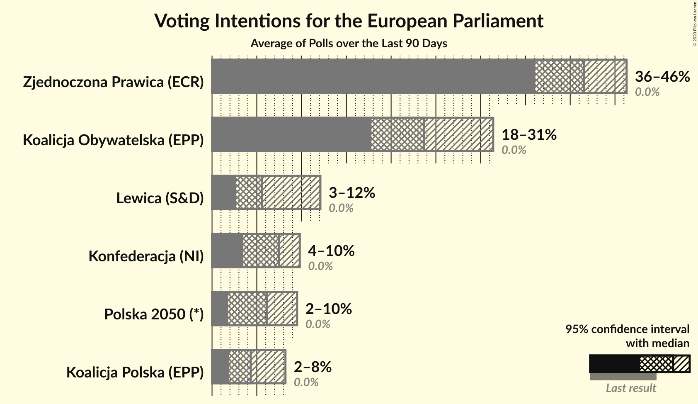

### Confidence Intervals

| Party | Last Result | Median | 80% Confidence Interval | 90% Confidence Interval | 95% Confidence Interval | 99% Confidence Interval |
|:-----:|:-----------:|:------:|:-----------------------:|:-----------------------:|:-----------------------:|:-----------------------:|
| <a href="#prawo-i-sprawiedliwość-(ecr)">Prawo i Sprawiedliwość (ECR)</a> | 0.0% | N/A | N/A |N/A | N/A | N/A |
| <a href="#platforma-obywatelska-(epp)">Platforma Obywatelska (EPP)</a> | 0.0% | N/A | N/A |N/A | N/A | N/A |
| <a href="#kukiz’15-(ni)">Kukiz’15 (NI)</a> | 0.0% | N/A | N/A |N/A | N/A | N/A |
| <a href="#.nowoczesna-(re)">.Nowoczesna (RE)</a> | 0.0% | N/A | N/A |N/A | N/A | N/A |
| <a href="#polskie-stronnictwo-ludowe-(epp)">Polskie Stronnictwo Ludowe (EPP)</a> | 0.0% | N/A | N/A |N/A | N/A | N/A |
| <a href="#sojusz-lewicy-demokratycznej-(s&d)">Sojusz Lewicy Demokratycznej (S&D)</a> | 0.0% | N/A | N/A |N/A | N/A | N/A |
| <a href="#korwin-(ni)">KORWiN (NI)</a> | 0.0% | N/A | N/A |N/A | N/A | N/A |
| <a href="#lewica-razem-(s&d)">Lewica Razem (S&D)</a> | 0.0% | N/A | N/A |N/A | N/A | N/A |
| <a href="#wiosna-(s&d)">Wiosna (S&D)</a> | 0.0% | N/A | N/A |N/A | N/A | N/A |
| <a href="#wiosna–partia-razem-(s&d)">Wiosna–Partia Razem (S&D)</a> | 0.0% | N/A | N/A |N/A | N/A | N/A |
| <a href="#koalicja-europejska-(epp)">Koalicja Europejska (EPP)</a> | 0.0% | N/A | N/A |N/A | N/A | N/A |
| <a href="#konfederacja-(ni)">Konfederacja (NI)</a> | 0.0% | 7.5% | 4.2–9.0% |3.8–9.4% | 3.5–9.8% | 3.0–10.5% |
| <a href="#koalicja-europejska-(epp)">Koalicja Europejska (EPP)</a> | 0.0% | N/A | N/A |N/A | N/A | N/A |
| <a href="#koalicja-obywatelska-(epp)">Koalicja Obywatelska (EPP)</a> | 0.0% | 23.7% | 19.4–29.5% |18.4–30.6% | 17.8–31.4% | 16.7–32.6% |
| <a href="#koalicja-polska-(epp)">Koalicja Polska (EPP)</a> | 0.0% | 4.3% | 2.4–7.4% |2.1–7.9% | 1.9–8.2% | 1.6–8.8% |
| <a href="#lewica-(s&d)">Lewica (S&D)</a> | 0.0% | 5.6% | 3.3–11.0% |2.9–11.7% | 2.7–12.1% | 2.3–13.0% |
| <a href="#wiosna–partia-razem-(s&d)">Wiosna–Partia Razem (S&D)</a> | 0.0% | N/A | N/A |N/A | N/A | N/A |
| <a href="#bezpartyjni-samorządowcy-(*)">Bezpartyjni Samorządowcy (*)</a> | 0.0% | N/A | N/A |N/A | N/A | N/A |
| <a href="#zjednoczona-prawica-(ecr)">Zjednoczona Prawica (ECR)</a> | 0.0% | 41.5% | 37.5–44.9% |36.7–45.7% | 36.1–46.3% | 35.0–47.5% |
| <a href="#polska-2050-(*)">Polska 2050 (*)</a> | 0.0% | 6.1% | 2.2–8.7% |2.0–9.2% | 1.8–9.5% | 1.5–10.2% |

### Zjednoczona Prawica (ECR)

*For a full overview of the results for this party, see the [Zjednoczona Prawica (ECR)](party-zjednoczonaprawicaecr.html) page.*

| Voting Intentions | Probability | Accumulated | Special Marks |
|:-----------------:|:-----------:|:-----------:|:-------------:|
| 0.0–0.5% | 0% | 100% | Last Result |
| 0.5–1.5% | 0% | 100% |  |
| 1.5–2.5% | 0% | 100% |  |
| 2.5–3.5% | 0% | 100% |  |
| 3.5–4.5% | 0% | 100% |  |
| 4.5–5.5% | 0% | 100% |  |
| 5.5–6.5% | 0% | 100% |  |
| 6.5–7.5% | 0% | 100% |  |
| 7.5–8.5% | 0% | 100% |  |
| 8.5–9.5% | 0% | 100% |  |
| 9.5–10.5% | 0% | 100% |  |
| 10.5–11.5% | 0% | 100% |  |
| 11.5–12.5% | 0% | 100% |  |
| 12.5–13.5% | 0% | 100% |  |
| 13.5–14.5% | 0% | 100% |  |
| 14.5–15.5% | 0% | 100% |  |
| 15.5–16.5% | 0% | 100% |  |
| 16.5–17.5% | 0% | 100% |  |
| 17.5–18.5% | 0% | 100% |  |
| 18.5–19.5% | 0% | 100% |  |
| 19.5–20.5% | 0% | 100% |  |
| 20.5–21.5% | 0% | 100% |  |
| 21.5–22.5% | 0% | 100% |  |
| 22.5–23.5% | 0% | 100% |  |
| 23.5–24.5% | 0% | 100% |  |
| 24.5–25.5% | 0% | 100% |  |
| 25.5–26.5% | 0% | 100% |  |
| 26.5–27.5% | 0% | 100% |  |
| 27.5–28.5% | 0% | 100% |  |
| 28.5–29.5% | 0% | 100% |  |
| 29.5–30.5% | 0% | 100% |  |
| 30.5–31.5% | 0% | 100% |  |
| 31.5–32.5% | 0% | 100% |  |
| 32.5–33.5% | 0% | 100% |  |
| 33.5–34.5% | 0.2% | 100% |  |
| 34.5–35.5% | 0.9% | 99.8% |  |
| 35.5–36.5% | 3% | 98.8% |  |
| 36.5–37.5% | 6% | 96% |  |
| 37.5–38.5% | 9% | 90% |  |
| 38.5–39.5% | 10% | 81% |  |
| 39.5–40.5% | 10% | 71% |  |
| 40.5–41.5% | 11% | 61% |  |
| 41.5–42.5% | 13% | 50% | Median |
| 42.5–43.5% | 13% | 37% |  |
| 43.5–44.5% | 11% | 24% |  |
| 44.5–45.5% | 8% | 13% |  |
| 45.5–46.5% | 4% | 6% |  |
| 46.5–47.5% | 1.4% | 2% |  |
| 47.5–48.5% | 0.4% | 0.4% |  |
| 48.5–49.5% | 0.1% | 0.1% |  |
| 49.5–50.5% | 0% | 0% |  |

### Koalicja Obywatelska (EPP)

*For a full overview of the results for this party, see the [Koalicja Obywatelska (EPP)](party-koalicjaobywatelskaepp.html) page.*

| Voting Intentions | Probability | Accumulated | Special Marks |
|:-----------------:|:-----------:|:-----------:|:-------------:|
| 0.0–0.5% | 0% | 100% | Last Result |
| 0.5–1.5% | 0% | 100% |  |
| 1.5–2.5% | 0% | 100% |  |
| 2.5–3.5% | 0% | 100% |  |
| 3.5–4.5% | 0% | 100% |  |
| 4.5–5.5% | 0% | 100% |  |
| 5.5–6.5% | 0% | 100% |  |
| 6.5–7.5% | 0% | 100% |  |
| 7.5–8.5% | 0% | 100% |  |
| 8.5–9.5% | 0% | 100% |  |
| 9.5–10.5% | 0% | 100% |  |
| 10.5–11.5% | 0% | 100% |  |
| 11.5–12.5% | 0% | 100% |  |
| 12.5–13.5% | 0% | 100% |  |
| 13.5–14.5% | 0% | 100% |  |
| 14.5–15.5% | 0% | 100% |  |
| 15.5–16.5% | 0.3% | 100% |  |
| 16.5–17.5% | 2% | 99.6% |  |
| 17.5–18.5% | 4% | 98% |  |
| 18.5–19.5% | 5% | 94% |  |
| 19.5–20.5% | 5% | 89% |  |
| 20.5–21.5% | 7% | 84% |  |
| 21.5–22.5% | 11% | 77% |  |
| 22.5–23.5% | 14% | 66% |  |
| 23.5–24.5% | 13% | 52% | Median |
| 24.5–25.5% | 9% | 39% |  |
| 25.5–26.5% | 7% | 30% |  |
| 26.5–27.5% | 5% | 23% |  |
| 27.5–28.5% | 4% | 18% |  |
| 28.5–29.5% | 4% | 14% |  |
| 29.5–30.5% | 5% | 10% |  |
| 30.5–31.5% | 3% | 5% |  |
| 31.5–32.5% | 2% | 2% |  |
| 32.5–33.5% | 0.4% | 0.5% |  |
| 33.5–34.5% | 0.1% | 0.1% |  |
| 34.5–35.5% | 0% | 0% |  |

### Lewica (S&D)

*For a full overview of the results for this party, see the [Lewica (S&D)](party-lewicasd.html) page.*

| Voting Intentions | Probability | Accumulated | Special Marks |
|:-----------------:|:-----------:|:-----------:|:-------------:|
| 0.0–0.5% | 0% | 100% | Last Result |
| 0.5–1.5% | 0% | 100% |  |
| 1.5–2.5% | 1.4% | 100% |  |
| 2.5–3.5% | 14% | 98.6% |  |
| 3.5–4.5% | 17% | 85% |  |
| 4.5–5.5% | 17% | 68% |  |
| 5.5–6.5% | 13% | 51% | Median |
| 6.5–7.5% | 4% | 38% |  |
| 7.5–8.5% | 2% | 34% |  |
| 8.5–9.5% | 7% | 31% |  |
| 9.5–10.5% | 10% | 25% |  |
| 10.5–11.5% | 9% | 15% |  |
| 11.5–12.5% | 4% | 6% |  |
| 12.5–13.5% | 1.1% | 1.2% |  |
| 13.5–14.5% | 0.1% | 0.1% |  |
| 14.5–15.5% | 0% | 0% |  |

### Koalicja Polska (EPP)

*For a full overview of the results for this party, see the [Koalicja Polska (EPP)](party-koalicjapolskaepp.html) page.*

| Voting Intentions | Probability | Accumulated | Special Marks |
|:-----------------:|:-----------:|:-----------:|:-------------:|
| 0.0–0.5% | 0% | 100% | Last Result |
| 0.5–1.5% | 0.3% | 100% |  |
| 1.5–2.5% | 15% | 99.7% |  |
| 2.5–3.5% | 27% | 85% |  |
| 3.5–4.5% | 9% | 57% | Median |
| 4.5–5.5% | 9% | 49% |  |
| 5.5–6.5% | 15% | 40% |  |
| 6.5–7.5% | 17% | 25% |  |
| 7.5–8.5% | 7% | 8% |  |
| 8.5–9.5% | 1.0% | 1.1% |  |
| 9.5–10.5% | 0.1% | 0.1% |  |
| 10.5–11.5% | 0% | 0% |  |

### Konfederacja (NI)

*For a full overview of the results for this party, see the [Konfederacja (NI)](party-konfederacjani.html) page.*

| Voting Intentions | Probability | Accumulated | Special Marks |
|:-----------------:|:-----------:|:-----------:|:-------------:|
| 0.0–0.5% | 0% | 100% | Last Result |
| 0.5–1.5% | 0% | 100% |  |
| 1.5–2.5% | 0% | 100% |  |
| 2.5–3.5% | 3% | 100% |  |
| 3.5–4.5% | 10% | 97% |  |
| 4.5–5.5% | 4% | 87% |  |
| 5.5–6.5% | 10% | 83% |  |
| 6.5–7.5% | 25% | 73% | Median |
| 7.5–8.5% | 29% | 48% |  |
| 8.5–9.5% | 15% | 20% |  |
| 9.5–10.5% | 4% | 4% |  |
| 10.5–11.5% | 0.4% | 0.4% |  |
| 11.5–12.5% | 0% | 0% |  |

### Polska 2050 (*)

*For a full overview of the results for this party, see the [Polska 2050 (*)](party-polska2050.html) page.*

| Voting Intentions | Probability | Accumulated | Special Marks |
|:-----------------:|:-----------:|:-----------:|:-------------:|
| 0.0–0.5% | 0% | 100% | Last Result |
| 0.5–1.5% | 0.8% | 100% |  |
| 1.5–2.5% | 15% | 99.2% |  |
| 2.5–3.5% | 9% | 84% |  |
| 3.5–4.5% | 6% | 75% |  |
| 4.5–5.5% | 13% | 70% |  |
| 5.5–6.5% | 11% | 56% | Median |
| 6.5–7.5% | 16% | 45% |  |
| 7.5–8.5% | 17% | 29% |  |
| 8.5–9.5% | 10% | 12% |  |
| 9.5–10.5% | 2% | 2% |  |
| 10.5–11.5% | 0.2% | 0.2% |  |
| 11.5–12.5% | 0% | 0% |  |

## Seats

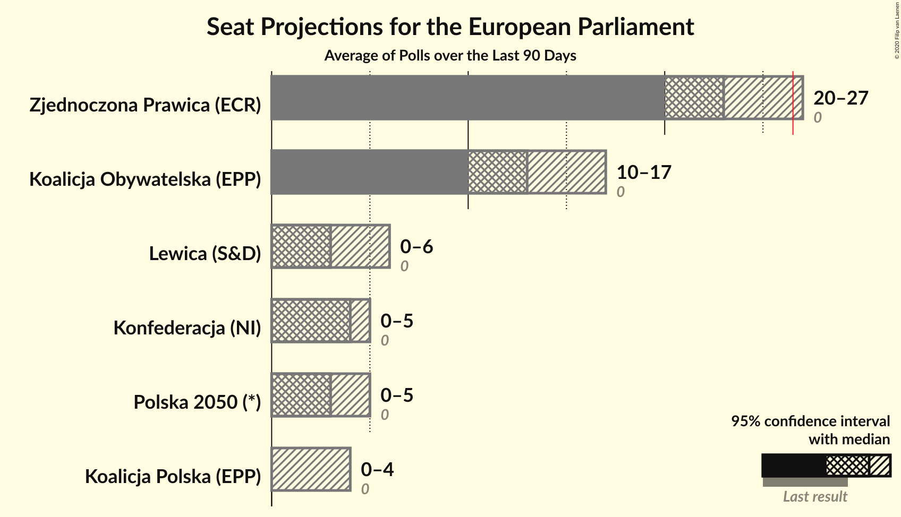

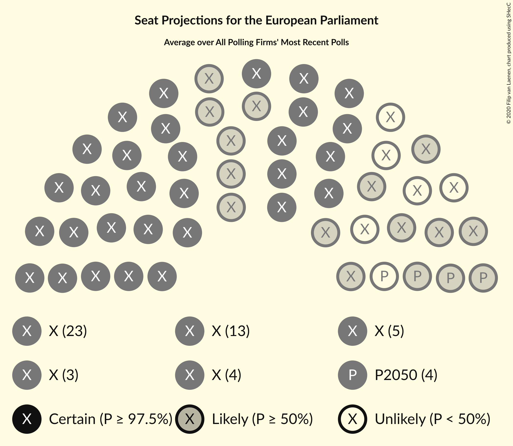

### Confidence Intervals

| Party | Last Result | Median | 80% Confidence Interval | 90% Confidence Interval | 95% Confidence Interval | 99% Confidence Interval |
|:-----:|:-----------:|:------:|:-----------------------:|:-----------------------:|:-----------------------:|:-----------------------:|
| <a href="#prawo-i-sprawiedliwość-(ecr)">Prawo i Sprawiedliwość (ECR)</a> | 0 | N/A | N/A |N/A | N/A | N/A |
| <a href="#platforma-obywatelska-(epp)">Platforma Obywatelska (EPP)</a> | 0 | N/A | N/A |N/A | N/A | N/A |
| <a href="#kukiz’15-(ni)">Kukiz’15 (NI)</a> | 0 | N/A | N/A |N/A | N/A | N/A |
| <a href="#.nowoczesna-(re)">.Nowoczesna (RE)</a> | 0 | N/A | N/A |N/A | N/A | N/A |
| <a href="#polskie-stronnictwo-ludowe-(epp)">Polskie Stronnictwo Ludowe (EPP)</a> | 0 | N/A | N/A |N/A | N/A | N/A |
| <a href="#sojusz-lewicy-demokratycznej-(s&d)">Sojusz Lewicy Demokratycznej (S&D)</a> | 0 | N/A | N/A |N/A | N/A | N/A |
| <a href="#korwin-(ni)">KORWiN (NI)</a> | 0 | N/A | N/A |N/A | N/A | N/A |
| <a href="#lewica-razem-(s&d)">Lewica Razem (S&D)</a> | 0 | N/A | N/A |N/A | N/A | N/A |
| <a href="#wiosna-(s&d)">Wiosna (S&D)</a> | 0 | N/A | N/A |N/A | N/A | N/A |
| <a href="#wiosna–partia-razem-(s&d)">Wiosna–Partia Razem (S&D)</a> | 0 | N/A | N/A |N/A | N/A | N/A |
| <a href="#koalicja-europejska-(epp)">Koalicja Europejska (EPP)</a> | 0 | N/A | N/A |N/A | N/A | N/A |
| <a href="#konfederacja-(ni)">Konfederacja (NI)</a> | 0 | 4 | 0–5 |0–5 | 0–5 | 0–5 |
| <a href="#koalicja-europejska-(epp)">Koalicja Europejska (EPP)</a> | 0 | N/A | N/A |N/A | N/A | N/A |
| <a href="#koalicja-obywatelska-(epp)">Koalicja Obywatelska (EPP)</a> | 0 | 13 | 11–16 |10–16 | 10–17 | 9–17 |
| <a href="#koalicja-polska-(epp)">Koalicja Polska (EPP)</a> | 0 | 0 | 0–4 |0–4 | 0–4 | 0–4 |
| <a href="#lewica-(s&d)">Lewica (S&D)</a> | 0 | 3 | 0–6 |0–6 | 0–6 | 0–7 |
| <a href="#wiosna–partia-razem-(s&d)">Wiosna–Partia Razem (S&D)</a> | 0 | N/A | N/A |N/A | N/A | N/A |
| <a href="#bezpartyjni-samorządowcy-(*)">Bezpartyjni Samorządowcy (*)</a> | 0 | N/A | N/A |N/A | N/A | N/A |
| <a href="#zjednoczona-prawica-(ecr)">Zjednoczona Prawica (ECR)</a> | 0 | 23 | 21–25 |21–26 | 20–27 | 19–27 |
| <a href="#polska-2050-(*)">Polska 2050 (*)</a> | 0 | 3 | 0–4 |0–5 | 0–5 | 0–5 |

### Prawo i Sprawiedliwość (ECR)

*For a full overview of the results for this party, see the [Prawo i Sprawiedliwość (ECR)](party-prawoisprawiedliwośćecr.html) page.*

### Platforma Obywatelska (EPP)

*For a full overview of the results for this party, see the [Platforma Obywatelska (EPP)](party-platformaobywatelskaepp.html) page.*

### Kukiz’15 (NI)

*For a full overview of the results for this party, see the [Kukiz’15 (NI)](party-kukiz’15ni.html) page.*

### .Nowoczesna (RE)

*For a full overview of the results for this party, see the [.Nowoczesna (RE)](party-nowoczesnare.html) page.*

### Polskie Stronnictwo Ludowe (EPP)

*For a full overview of the results for this party, see the [Polskie Stronnictwo Ludowe (EPP)](party-polskiestronnictwoludoweepp.html) page.*

### Sojusz Lewicy Demokratycznej (S&D)

*For a full overview of the results for this party, see the [Sojusz Lewicy Demokratycznej (S&D)](party-sojuszlewicydemokratycznejsd.html) page.*

### KORWiN (NI)

*For a full overview of the results for this party, see the [KORWiN (NI)](party-korwinni.html) page.*

### Lewica Razem (S&D)

*For a full overview of the results for this party, see the [Lewica Razem (S&D)](party-lewicarazemsd.html) page.*

### Wiosna (S&D)

*For a full overview of the results for this party, see the [Wiosna (S&D)](party-wiosnasd.html) page.*

### Wiosna–Partia Razem (S&D)

*For a full overview of the results for this party, see the [Wiosna–Partia Razem (S&D)](party-wiosna–partiarazemsd.html) page.*

### Koalicja Europejska (EPP)

*For a full overview of the results for this party, see the [Koalicja Europejska (EPP)](party-koalicjaeuropejskaepp.html) page.*

### Konfederacja (NI)

*For a full overview of the results for this party, see the [Konfederacja (NI)](party-konfederacjani.html) page.*

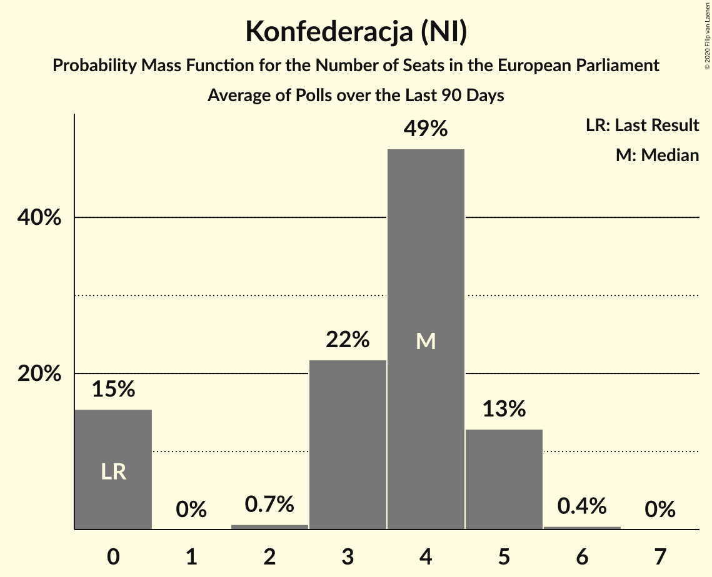

| Number of Seats | Probability | Accumulated | Special Marks |
|:---------------:|:-----------:|:-----------:|:-------------:|
| 0 | 15% | 100% | Last Result |
| 1 | 0% | 85% |  |
| 2 | 0.7% | 85% |  |
| 3 | 22% | 84% |  |
| 4 | 49% | 62% | Median |
| 5 | 13% | 13% |  |
| 6 | 0.4% | 0.4% |  |
| 7 | 0% | 0% |  |

### Koalicja Obywatelska (EPP)

*For a full overview of the results for this party, see the [Koalicja Obywatelska (EPP)](party-koalicjaobywatelskaepp.html) page.*

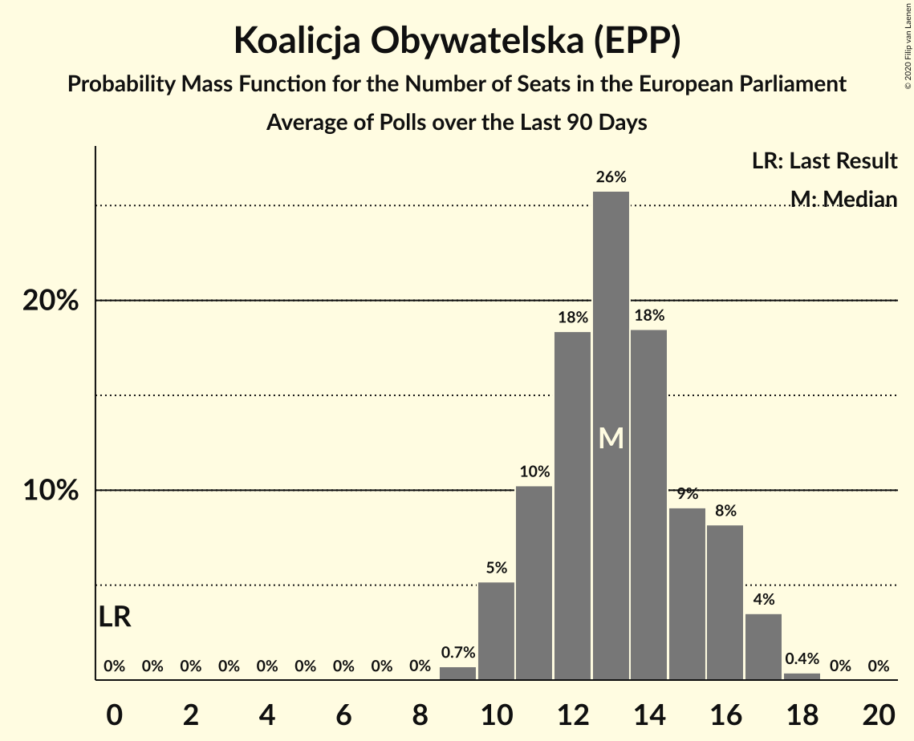

| Number of Seats | Probability | Accumulated | Special Marks |
|:---------------:|:-----------:|:-----------:|:-------------:|
| 0 | 0% | 100% | Last Result |
| 1 | 0% | 100% |  |
| 2 | 0% | 100% |  |
| 3 | 0% | 100% |  |
| 4 | 0% | 100% |  |
| 5 | 0% | 100% |  |
| 6 | 0% | 100% |  |
| 7 | 0% | 100% |  |
| 8 | 0% | 100% |  |
| 9 | 0.7% | 100% |  |
| 10 | 5% | 99.3% |  |
| 11 | 10% | 94% |  |
| 12 | 18% | 84% |  |
| 13 | 26% | 65% | Median |
| 14 | 18% | 40% |  |
| 15 | 9% | 21% |  |
| 16 | 8% | 12% |  |
| 17 | 4% | 4% |  |
| 18 | 0.4% | 0.4% |  |
| 19 | 0% | 0% |  |

### Koalicja Polska (EPP)

*For a full overview of the results for this party, see the [Koalicja Polska (EPP)](party-koalicjapolskaepp.html) page.*

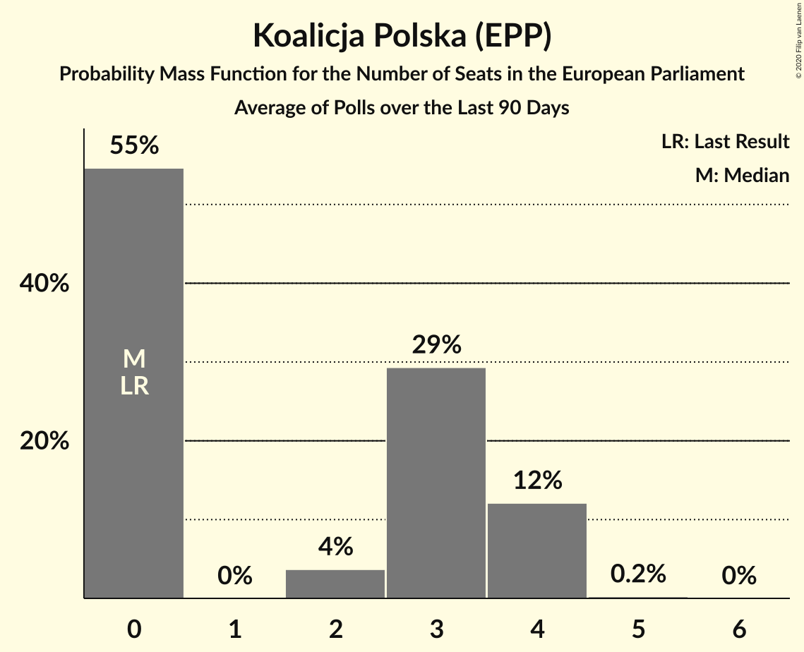

| Number of Seats | Probability | Accumulated | Special Marks |
|:---------------:|:-----------:|:-----------:|:-------------:|
| 0 | 55% | 100% | Last Result, Median |
| 1 | 0% | 45% |  |
| 2 | 4% | 45% |  |
| 3 | 29% | 42% |  |
| 4 | 12% | 12% |  |
| 5 | 0.2% | 0.2% |  |
| 6 | 0% | 0% |  |

### Lewica (S&D)

*For a full overview of the results for this party, see the [Lewica (S&D)](party-lewicasd.html) page.*

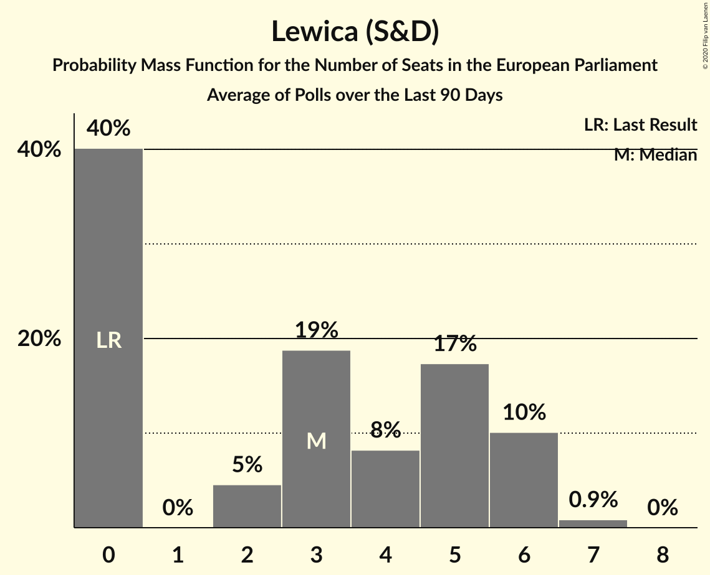

| Number of Seats | Probability | Accumulated | Special Marks |
|:---------------:|:-----------:|:-----------:|:-------------:|
| 0 | 40% | 100% | Last Result |
| 1 | 0% | 60% |  |
| 2 | 5% | 60% |  |
| 3 | 19% | 55% | Median |
| 4 | 8% | 37% |  |
| 5 | 17% | 28% |  |
| 6 | 10% | 11% |  |
| 7 | 0.9% | 0.9% |  |
| 8 | 0% | 0% |  |

### Bezpartyjni Samorządowcy (*)

*For a full overview of the results for this party, see the [Bezpartyjni Samorządowcy (*)](party-bezpartyjnisamorządowcy.html) page.*

### Zjednoczona Prawica (ECR)

*For a full overview of the results for this party, see the [Zjednoczona Prawica (ECR)](party-zjednoczonaprawicaecr.html) page.*

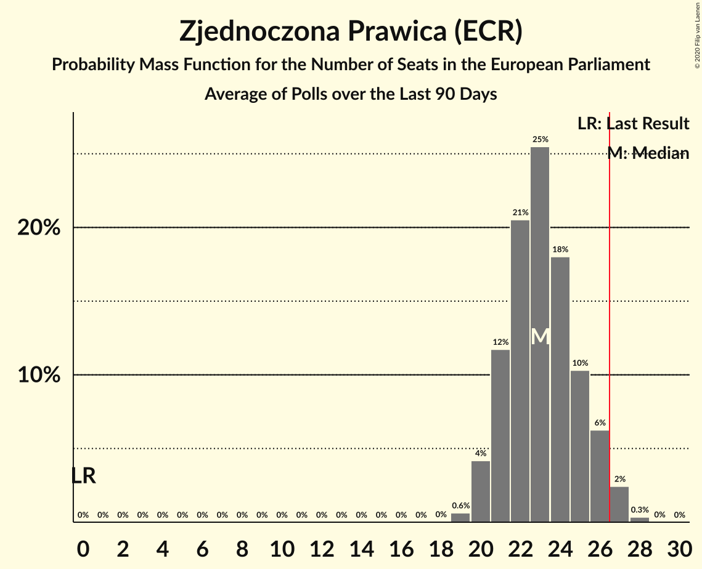

| Number of Seats | Probability | Accumulated | Special Marks |
|:---------------:|:-----------:|:-----------:|:-------------:|
| 0 | 0% | 100% | Last Result |
| 1 | 0% | 100% |  |
| 2 | 0% | 100% |  |
| 3 | 0% | 100% |  |
| 4 | 0% | 100% |  |
| 5 | 0% | 100% |  |
| 6 | 0% | 100% |  |
| 7 | 0% | 100% |  |
| 8 | 0% | 100% |  |
| 9 | 0% | 100% |  |
| 10 | 0% | 100% |  |
| 11 | 0% | 100% |  |
| 12 | 0% | 100% |  |
| 13 | 0% | 100% |  |
| 14 | 0% | 100% |  |
| 15 | 0% | 100% |  |
| 16 | 0% | 100% |  |
| 17 | 0% | 100% |  |
| 18 | 0% | 100% |  |
| 19 | 0.6% | 100% |  |
| 20 | 4% | 99.3% |  |
| 21 | 12% | 95% |  |
| 22 | 21% | 83% |  |
| 23 | 25% | 63% | Median |
| 24 | 18% | 37% |  |
| 25 | 10% | 19% |  |
| 26 | 6% | 9% |  |
| 27 | 2% | 3% | Majority |
| 28 | 0.3% | 0.4% |  |
| 29 | 0% | 0% |  |

### Polska 2050 (*)

*For a full overview of the results for this party, see the [Polska 2050 (*)](party-polska2050.html) page.*

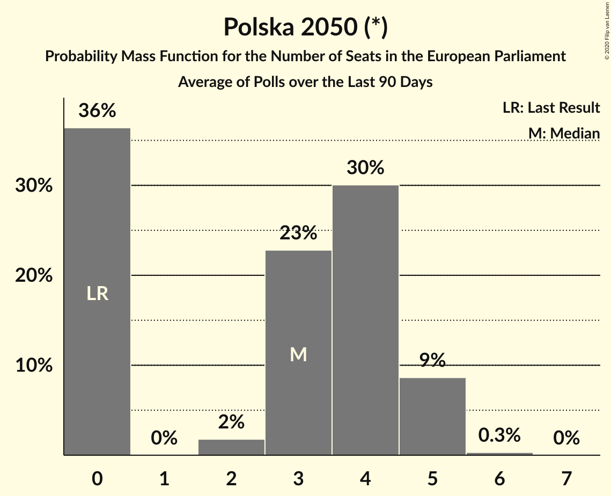

| Number of Seats | Probability | Accumulated | Special Marks |
|:---------------:|:-----------:|:-----------:|:-------------:|
| 0 | 36% | 100% | Last Result |
| 1 | 0% | 64% |  |
| 2 | 2% | 64% |  |
| 3 | 23% | 62% | Median |
| 4 | 30% | 39% |  |
| 5 | 9% | 9% |  |
| 6 | 0.3% | 0.3% |  |
| 7 | 0% | 0% |  |

## Coalitions

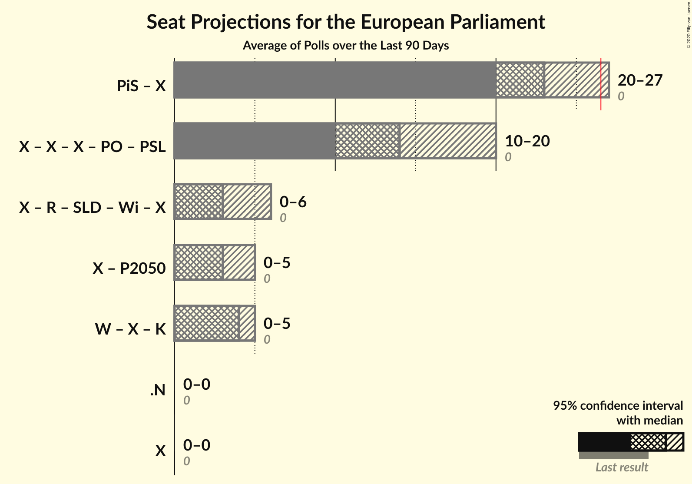

### Confidence Intervals

| Coalition | Last Result | Median | Majority? | 80% Confidence Interval | 90% Confidence Interval | 95% Confidence Interval | 99% Confidence Interval |
|:---------:|:-----------:|:------:|:---------:|:-----------------------:|:-----------------------:|:-----------------------:|:-----------------------:|
| Prawo i Sprawiedliwość (ECR) – Zjednoczona Prawica (ECR) | 0 | 23 | 3% | 21–25 | 21–26 | 20–27 | 19–27 |
| Koalicja Europejska (EPP) – Koalicja Obywatelska (EPP) – Koalicja Polska (EPP) – Platforma Obywatelska (EPP) – Polskie Stronnictwo Ludowe (EPP) | 0 | 14 | 0% | 11–19 | 10–20 | 10–20 | 9–21 |
| Lewica (S&D) – Lewica Razem (S&D) – Sojusz Lewicy Demokratycznej (S&D) – Wiosna (S&D) – Wiosna–Partia Razem (S&D) | 0 | 3 | 0% | 0–6 | 0–6 | 0–6 | 0–7 |
| Bezpartyjni Samorządowcy (*) – Polska 2050 (*) | 0 | 3 | 0% | 0–4 | 0–5 | 0–5 | 0–5 |
| KORWiN (NI) – Konfederacja (NI) – Kukiz’15 (NI) | 0 | 4 | 0% | 0–5 | 0–5 | 0–5 | 0–5 |
| .Nowoczesna (RE) | 0 | 0 | 0% | 0 | 0 | 0 | 0 |
| Bezpartyjni Samorządowcy (*) | 0 | 0 | 0% | 0 | 0 | 0 | 0 |

### Prawo i Sprawiedliwość (ECR) – Zjednoczona Prawica (ECR)

| Number of Seats | Probability | Accumulated | Special Marks |
|:---------------:|:-----------:|:-----------:|:-------------:|
| 0 | 0% | 100% | Last Result |
| 1 | 0% | 100% |  |
| 2 | 0% | 100% |  |
| 3 | 0% | 100% |  |
| 4 | 0% | 100% |  |
| 5 | 0% | 100% |  |
| 6 | 0% | 100% |  |
| 7 | 0% | 100% |  |
| 8 | 0% | 100% |  |
| 9 | 0% | 100% |  |
| 10 | 0% | 100% |  |
| 11 | 0% | 100% |  |
| 12 | 0% | 100% |  |
| 13 | 0% | 100% |  |
| 14 | 0% | 100% |  |
| 15 | 0% | 100% |  |
| 16 | 0% | 100% |  |
| 17 | 0% | 100% |  |
| 18 | 0% | 100% |  |
| 19 | 0.6% | 100% |  |
| 20 | 4% | 99.3% |  |
| 21 | 12% | 95% |  |
| 22 | 21% | 83% |  |
| 23 | 25% | 63% | Median |
| 24 | 18% | 37% |  |
| 25 | 10% | 19% |  |
| 26 | 6% | 9% |  |
| 27 | 2% | 3% | Majority |
| 28 | 0.3% | 0.4% |  |
| 29 | 0% | 0% |  |

### Koalicja Europejska (EPP) – Koalicja Obywatelska (EPP) – Koalicja Polska (EPP) – Platforma Obywatelska (EPP) – Polskie Stronnictwo Ludowe (EPP)

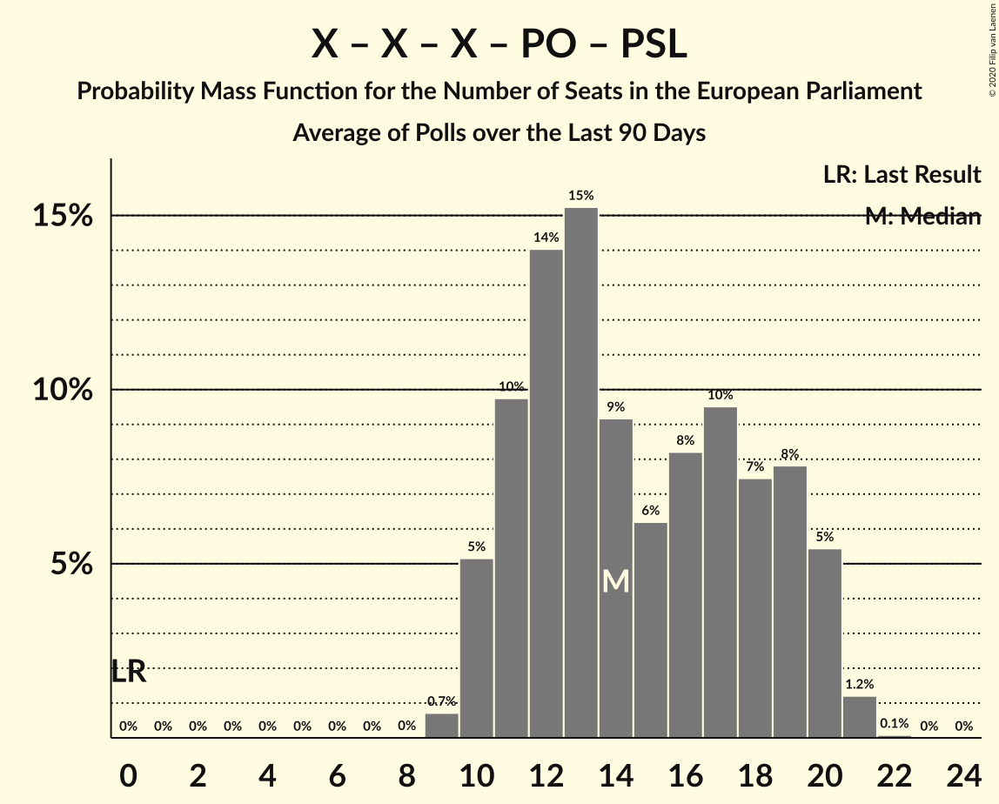

| Number of Seats | Probability | Accumulated | Special Marks |
|:---------------:|:-----------:|:-----------:|:-------------:|
| 0 | 0% | 100% | Last Result |
| 1 | 0% | 100% |  |
| 2 | 0% | 100% |  |
| 3 | 0% | 100% |  |
| 4 | 0% | 100% |  |
| 5 | 0% | 100% |  |
| 6 | 0% | 100% |  |
| 7 | 0% | 100% |  |
| 8 | 0% | 100% |  |
| 9 | 0.7% | 100% |  |
| 10 | 5% | 99.3% |  |
| 11 | 10% | 94% |  |
| 12 | 14% | 84% |  |
| 13 | 15% | 70% | Median |
| 14 | 9% | 55% |  |
| 15 | 6% | 46% |  |
| 16 | 8% | 40% |  |
| 17 | 10% | 32% |  |
| 18 | 7% | 22% |  |
| 19 | 8% | 15% |  |
| 20 | 5% | 7% |  |
| 21 | 1.2% | 1.3% |  |
| 22 | 0.1% | 0.1% |  |
| 23 | 0% | 0% |  |

### Lewica (S&D) – Lewica Razem (S&D) – Sojusz Lewicy Demokratycznej (S&D) – Wiosna (S&D) – Wiosna–Partia Razem (S&D)

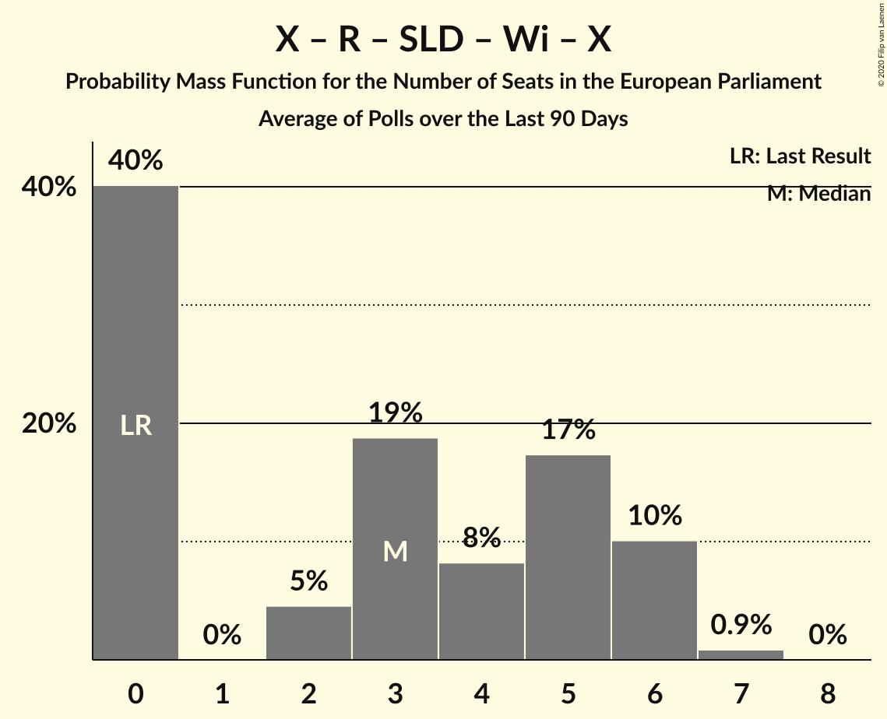

| Number of Seats | Probability | Accumulated | Special Marks |
|:---------------:|:-----------:|:-----------:|:-------------:|
| 0 | 40% | 100% | Last Result |
| 1 | 0% | 60% |  |
| 2 | 5% | 60% |  |
| 3 | 19% | 55% | Median |
| 4 | 8% | 37% |  |
| 5 | 17% | 28% |  |
| 6 | 10% | 11% |  |
| 7 | 0.9% | 0.9% |  |
| 8 | 0% | 0% |  |

### Bezpartyjni Samorządowcy (*) – Polska 2050 (*)

| Number of Seats | Probability | Accumulated | Special Marks |
|:---------------:|:-----------:|:-----------:|:-------------:|
| 0 | 36% | 100% | Last Result |
| 1 | 0% | 64% |  |
| 2 | 2% | 64% |  |
| 3 | 23% | 62% | Median |
| 4 | 30% | 39% |  |
| 5 | 9% | 9% |  |
| 6 | 0.3% | 0.3% |  |
| 7 | 0% | 0% |  |

### KORWiN (NI) – Konfederacja (NI) – Kukiz’15 (NI)

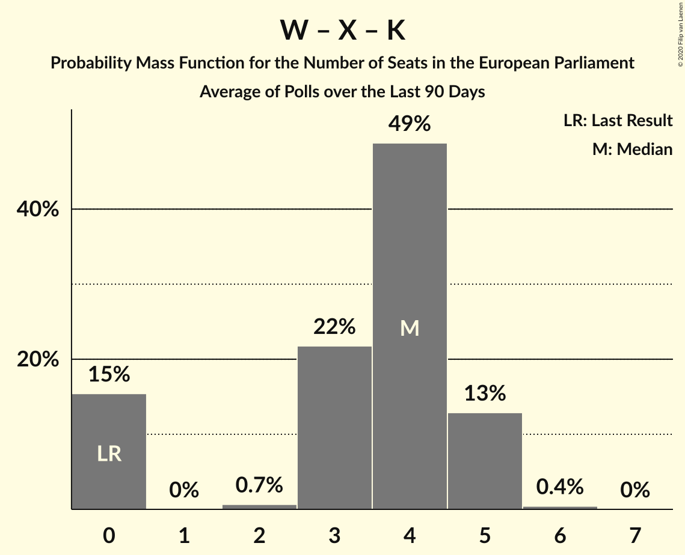

| Number of Seats | Probability | Accumulated | Special Marks |
|:---------------:|:-----------:|:-----------:|:-------------:|
| 0 | 15% | 100% | Last Result |
| 1 | 0% | 85% |  |
| 2 | 0.7% | 85% |  |
| 3 | 22% | 84% |  |
| 4 | 49% | 62% | Median |
| 5 | 13% | 13% |  |
| 6 | 0.4% | 0.4% |  |
| 7 | 0% | 0% |  |

### .Nowoczesna (RE)

| Number of Seats | Probability | Accumulated | Special Marks |
|:---------------:|:-----------:|:-----------:|:-------------:|
| 0 | 100% | 100% | Last Result, Median |

### Bezpartyjni Samorządowcy (*)

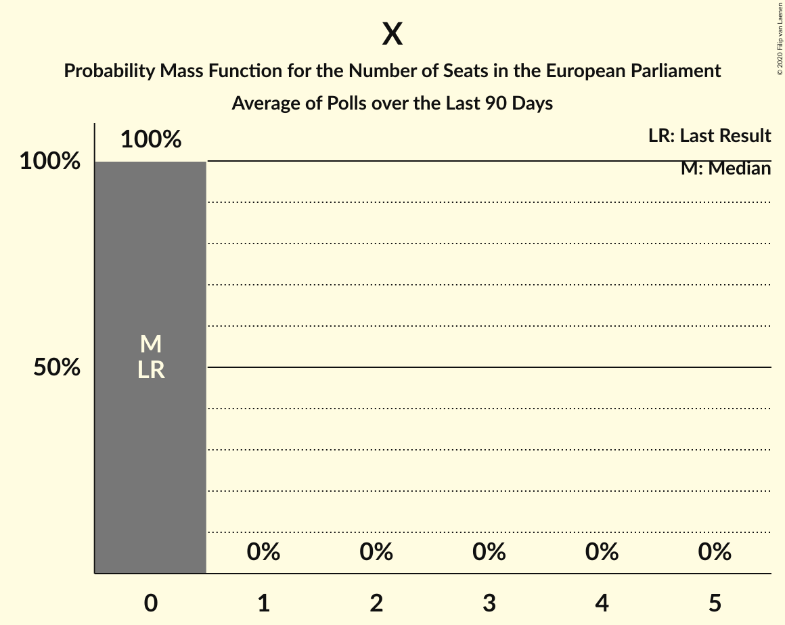

| Number of Seats | Probability | Accumulated | Special Marks |
|:---------------:|:-----------:|:-----------:|:-------------:|
| 0 | 100% | 100% | Last Result, Median |

## Technical Information

+ **Number of polls included in this average:** 6
+ **Lowest number of simulations done in a poll included in this average:** 1,048,576
+ **Total number of simulations done in the polls included in this average:** 6,291,456
+ **Error estimate:** 1.05%
