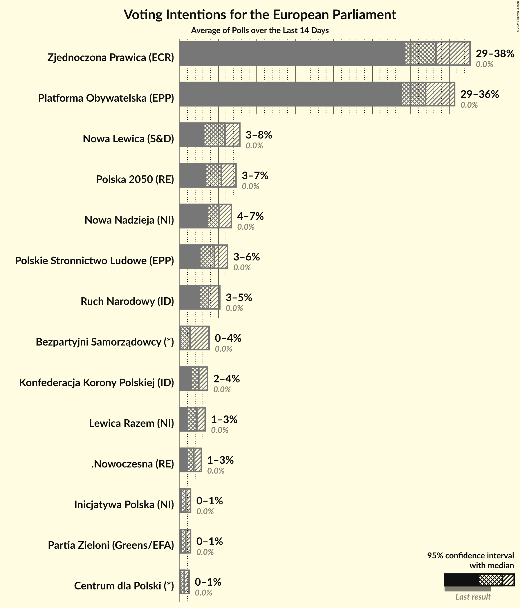
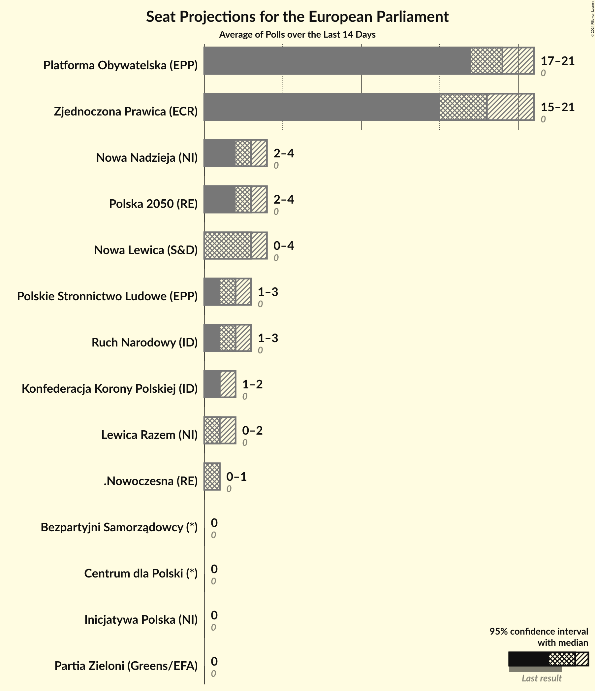
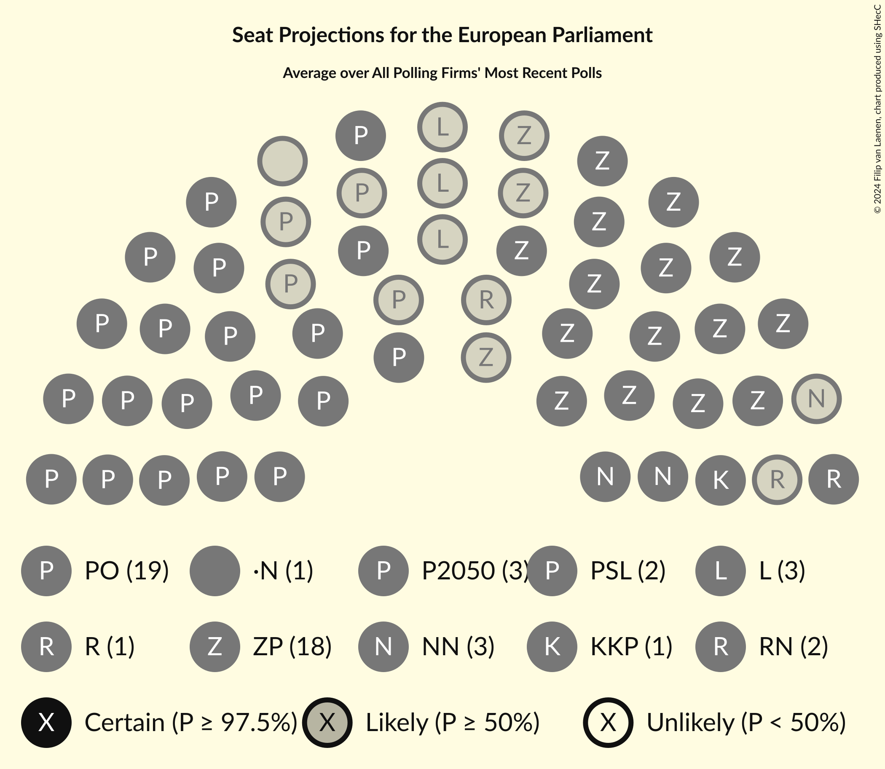
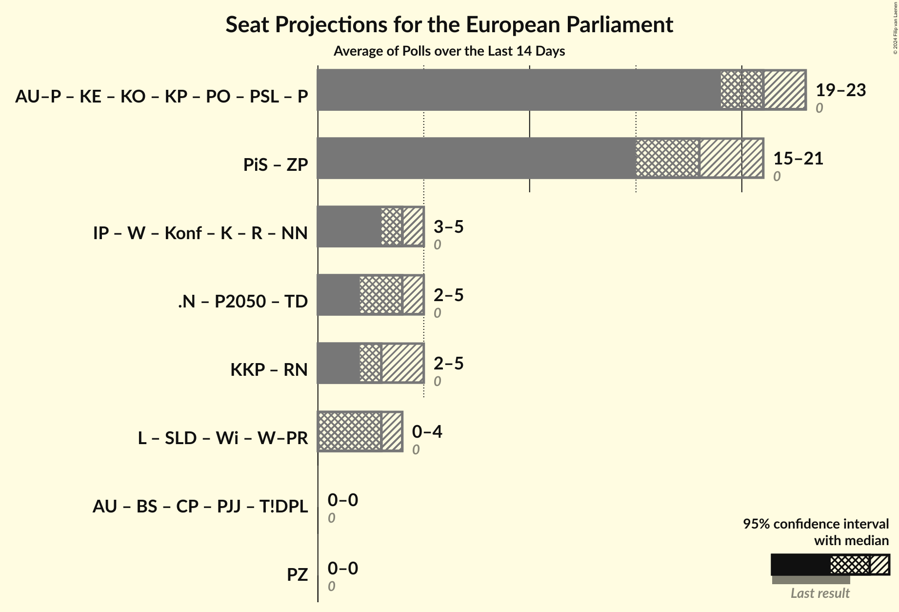

# Overview

The table below lists the most recent polls (less than 14 days old) registered and analyzed so far.

| Period     | Polling firm/Commissioner(s) | PiS | PO | K | .N | PSL | SLD | W | R | Wi | W–PR | KE | Konf | KE | KO | KP | L | W–PR | BS | ZP | P2050 | P | AU | AU–P | TD | T!DPL | PJJ | CP | KKP | IP | NN | PZ | RN |
|:----------:|:----------------------------:|:--:|:--:|:--:|:--:|:--:|:--:|:--:|:--:|:--:|:--:|:--:|:--:|:--:|:--:|:--:|:--:|:--:|:--:|:--:|:--:|:--:|:--:|:--:|:--:|:--:|:--:|:--:|:--:|:--:|:--:|:--:|:--:|
| 26 May 2019 | General Election | 0.0%   0 | 0.0%   0 | 0.0%   0 | 0.0%   0 | 0.0%   0 | 0.0%   0 | 0.0%   0 | 0.0%   0 | 0.0%   0 | 0.0%   0 | 0.0%   0 | 0.0%   0 | 0.0%   0 | 0.0%   0 | 0.0%   0 | 0.0%   0 | 0.0%   0 | 0.0%   0 | 0.0%   0 | 0.0%   0 | 0.0%   0 | 0.0%   0 | 0.0%   0 | 0.0%   0 | 0.0%   0 | 0.0%   0 | 0.0%   0 | 0.0%   0 | 0.0%   0 | 0.0%   0 | 0.0%   0 | 0.0%   0 |
| N/A | [Poll Average](average.html) | N/A   N/A | 29–36%   17–21 | N/A   N/A | 1–3%   0–1 | 3–6%   1–3 | N/A   N/A | N/A   N/A | 1–3%   0–2 | N/A   N/A | N/A   N/A | N/A   N/A | N/A   N/A | N/A   N/A | N/A   N/A | N/A   N/A | 3–8%   0–4 | N/A   N/A | 0–4%   0 | 29–38%   15–21 | 3–7%   2–4 | N/A   N/A | N/A   N/A | N/A   N/A | N/A   N/A | N/A   N/A | N/A   N/A | 0–1%   0 | 2–4%   1–2 | 0–1%   0 | 4–7%   2–4 | 0–1%   0 | 3–5%   1–3 |
| [4–7 June 2024](2024-06-07-OGB.html) | OGB   StanPolityki.pl | N/A   N/A | 31–37%   18–22 | N/A   N/A | 1–3%   0–1 | 2–4%   1–3 | N/A   N/A | N/A   N/A | 1–2%   0–1 | N/A   N/A | N/A   N/A | N/A   N/A | N/A   N/A | N/A   N/A | N/A   N/A | N/A   N/A | 3–5%   0–3 | N/A   N/A | 0–1%   0 | 33–39%   19–22 | 3–5%   2–3 | N/A   N/A | N/A   N/A | N/A   N/A | N/A   N/A | N/A   N/A | N/A   N/A | 0–1%   0 | 2–4%   1–2 | 0–2%   0 | 4–7%   2–4 | 0–2%   0 | 3–5%   2–3 |
| [4–6 June 2024](2024-06-06-Ipsos.html) | Ipsos   OKO.press and TOK FM | N/A   N/A | 29–35%   17–20 | N/A   N/A | 1–3%   0–1 | 4–6%   1–3 | N/A   N/A | N/A   N/A | 1–3%   0–2 | N/A   N/A | N/A   N/A | N/A   N/A | N/A   N/A | N/A   N/A | N/A   N/A | N/A   N/A | 5–7%   2–4 | N/A   N/A | 1–3%   0 | 28–34%   15–19 | 4–7%   2–4 | N/A   N/A | N/A   N/A | N/A   N/A | N/A   N/A | N/A   N/A | N/A   N/A | 0–1%   0 | 2–4%   1–2 | 0–1%   0 | 4–7%   2–4 | 0–1%   0 | 3–5%   1–4 |
| [5–6 June 2024](2024-06-06-InstytutBadańPollster.html) | Instytut Badań Pollster   Super Express | N/A   N/A | 29–35%   17–20 | N/A   N/A | 1–3%   0–1 | 4–7%   2–4 | N/A   N/A | N/A   N/A | 2–4%   1–2 | N/A   N/A | N/A   N/A | N/A   N/A | N/A   N/A | N/A   N/A | N/A   N/A | N/A   N/A | 5–8%   3–5 | N/A   N/A | N/A   N/A | 29–35%   16–19 | 5–8%   3–5 | N/A   N/A | N/A   N/A | N/A   N/A | N/A   N/A | N/A   N/A | N/A   N/A | 0–1%   0 | 2–3%   1–2 | 0–1%   0 | 4–6%   2–4 | 0–1%   0 | 3–5%   1–3 |
| [6 June 2024](2024-06-06-IBRiS.html) | IBRiS   Wydarzenia Polsat | N/A   N/A | 29–35%   17–19 | N/A   N/A | 1–3%   0–1 | 3–6%   2–3 | N/A   N/A | N/A   N/A | 2–4%   1–2 | N/A   N/A | N/A   N/A | N/A   N/A | N/A   N/A | N/A   N/A | N/A   N/A | N/A   N/A | 5–8%   3–4 | N/A   N/A | 0–1%   0 | 31–37%   18 | 4–7%   3–4 | N/A   N/A | N/A   N/A | N/A   N/A | N/A   N/A | N/A   N/A | N/A   N/A | 0–1%   0 | 2–4%   1 | 0–1%   0 | 4–6%   2–3 | 0–1%   0 | 3–5%   1–2 |
| [4–5 June 2024](2024-06-05-Kantar.html) | Kantar   Fakty TVN and TVN24 | N/A   N/A | 29–35%   18–21 | N/A   N/A | 1–3%   0–1 | 3–5%   2–3 | N/A   N/A | N/A   N/A | 1–3%   0–2 | N/A   N/A | N/A   N/A | N/A   N/A | N/A   N/A | N/A   N/A | N/A   N/A | N/A   N/A | 5–7%   3–4 | N/A   N/A | 1–3%   0 | 30–36%   17–19 | 4–6%   2–3 | N/A   N/A | N/A   N/A | N/A   N/A | N/A   N/A | N/A   N/A | N/A   N/A | 0–1%   0 | 1–3%   0–2 | 0–1%   0 | 3–6%   2–4 | 0–1%   0 | 2–5%   1–3 |
| [31 May–3 June 2024](2024-06-03-ResearchPartner.html) | Research Partner   Ariadna | N/A   N/A | 29–34%   18–21 | N/A   N/A | 1–3%   0–1 | 3–6%   2–3 | N/A   N/A | N/A   N/A | 1–3%   1 | N/A   N/A | N/A   N/A | N/A   N/A | N/A   N/A | N/A   N/A | N/A   N/A | N/A   N/A | 4–7%   2–3 | N/A   N/A | 2–4%   0 | 32–38%   18–20 | 4–7%   2–4 | N/A   N/A | N/A   N/A | N/A   N/A | N/A   N/A | N/A   N/A | N/A   N/A | 0–1%   0 | 2–3%   1 | 0–1%   0 | 4–6%   2–3 | 0–1%   0 | 2–5%   2 |
| [24–26 May 2024](2024-05-26-UnitedSurveys.html) | United Surveys   WP.pl | N/A   N/A | 29–34%   16–20 | N/A   N/A | 1–3%   0–1 | 4–6%   2–3 | N/A   N/A | N/A   N/A | 1–3%   0–2 | N/A   N/A | N/A   N/A | N/A   N/A | N/A   N/A | N/A   N/A | N/A   N/A | N/A   N/A | 5–8%   2–4 | N/A   N/A | 0–1%   0 | 30–36%   16–20 | 5–8%   3–4 | N/A   N/A | N/A   N/A | N/A   N/A | N/A   N/A | N/A   N/A | N/A   N/A | 0–1%   0 | 2–4%   1–2 | 0–1%   0 | 4–7%   2–4 | 0–1%   0 | 3–6%   1–3 |
| 26 May 2019 | General Election | 0.0%   0 | 0.0%   0 | 0.0%   0 | 0.0%   0 | 0.0%   0 | 0.0%   0 | 0.0%   0 | 0.0%   0 | 0.0%   0 | 0.0%   0 | 0.0%   0 | 0.0%   0 | 0.0%   0 | 0.0%   0 | 0.0%   0 | 0.0%   0 | 0.0%   0 | 0.0%   0 | 0.0%   0 | 0.0%   0 | 0.0%   0 | 0.0%   0 | 0.0%   0 | 0.0%   0 | 0.0%   0 | 0.0%   0 | 0.0%   0 | 0.0%   0 | 0.0%   0 | 0.0%   0 | 0.0%   0 | 0.0%   0 |

Only polls for which at least the sample size has been published are included in the table above.

**Legend:**
+ **Top half of each row:** Voting intentions (95% confidence interval)
+ **Bottom half of each row:** Seat projections for the European Parliament (95% confidence interval)
+ **PiS:** Prawo i Sprawiedliwość (ECR)
+ **PO:** Platforma Obywatelska (EPP)
+ **K:** Kukiz’15 (NI)
+ **.N:** .Nowoczesna (RE)
+ **PSL:** Polskie Stronnictwo Ludowe (EPP)
+ **SLD:** Sojusz Lewicy Demokratycznej (S&D)
+ **W:** KORWiN (NI)
+ **R:** Lewica Razem (NI)
+ **Wi:** Wiosna (S&D)
+ **W–PR:** Wiosna–Partia Razem (S&D)
+ **KE:** Koalicja Europejska (EPP)
+ **Konf:** Konfederacja (NI)
+ **KE:** Koalicja Europejska (EPP)
+ **KO:** Koalicja Obywatelska (EPP)
+ **KP:** Koalicja Polska (EPP)
+ **L:** Nowa Lewica (S&D)
+ **W–PR:** Wiosna–Partia Razem (S&D)
+ **BS:** Bezpartyjni Samorządowcy (*)
+ **ZP:** Zjednoczona Prawica (ECR)
+ **P2050:** Polska 2050 (RE)
+ **P:** Porozumienie (EPP)
+ **AU:** AGROunia (*)
+ **AU–P:** AGROunia–Porozumienie (EPP)
+ **TD:** Trzecia Droga (RE)
+ **T!DPL:** Tak! Dla Polski (*)
+ **PJJ:** Polska Jest Jedna (*)
+ **CP:** Centrum dla Polski (*)
+ **KKP:** Konfederacja Korony Polskiej (ID)
+ **IP:** Inicjatywa Polska (NI)
+ **NN:** Nowa Nadzieja (NI)
+ **PZ:** Partia Zieloni (Greens/EFA)
+ **RN:** Ruch Narodowy (ID)
+ **N/A (single party):** Party not included the published results
+ **N/A (entire row):** Calculation for this opinion poll not started yet

