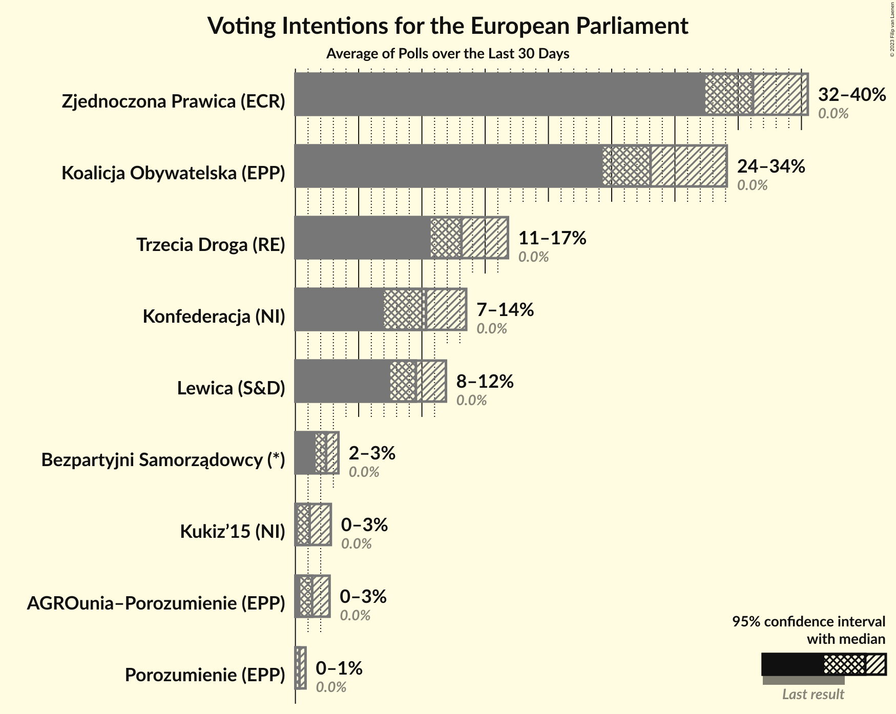

# Poll Average

<a href="#voting-intentions">Voting Intentions</a> | <a href="#seats">Seats</a> | <a href="#coalitions">Coalitions</a> | <a href="#technical-information">Technical Information</a>

## Summary

The table below lists the polls on which the average is based. They are the most recent polls (less than 30 days old) registered and analyzed so far.

| Period     | Polling firm/Commissioner(s) | PiS | PO | K | .N | PSL | SLD | W | R | Wi | X | X | X | X | X | X | X | X | X | X | P2050 | P | AU | AU–P | TD |
|:----------:|:----------------------------:|:--:|:--:|:--:|:--:|:--:|:--:|:--:|:--:|:--:|:--:|:--:|:--:|:--:|:--:|:--:|:--:|:--:|:--:|:--:|:--:|:--:|:--:|:--:|:--:|
| 26 May 2019 | General Election | 0.0%   0 | 0.0%   0 | 0.0%   0 | 0.0%   0 | 0.0%   0 | 0.0%   0 | 0.0%   0 | 0.0%   0 | 0.0%   0 | 0.0%   0 | 0.0%   0 | 0.0%   0 | 0.0%   0 | 0.0%   0 | 0.0%   0 | 0.0%   0 | 0.0%   0 | 0.0%   0 | 0.0%   0 | 0.0%   0 | 0.0%   0 | 0.0%   0 | 0.0%   0 | 0.0%   0 |
| N/A | Poll Average | N/A   N/A | N/A   N/A | 0–3%   0 | N/A   N/A | N/A   N/A | N/A   N/A | N/A   N/A | N/A   N/A | N/A   N/A | N/A   N/A | N/A   N/A | 7–13%   3–7 | N/A   N/A | 24–34%   13–18 | N/A   N/A | 7–12%   3–6 | N/A   N/A | 2–3%   0 | 31–40%   17–22 | N/A   N/A | 0–1%   0 | N/A   N/A | 0–3%   0 | 10–17%   5–9 |
| [19–21 May 2023](2023-05-21-UnitedSurveys.html) | United Surveys   DGP and RMF FM | N/A   N/A | N/A   N/A | N/A   N/A | N/A   N/A | N/A   N/A | N/A   N/A | N/A   N/A | N/A   N/A | N/A   N/A | N/A   N/A | N/A   N/A | 9–13%   4–7 | N/A   N/A | 25–31%   13–16 | N/A   N/A | 9–13%   4–6 | N/A   N/A | N/A   N/A | 32–38%   17–20 | N/A   N/A | N/A   N/A | N/A   N/A | N/A   N/A | 13–18%   7–9 |
| [19–21 May 2023](2023-05-21-IBRiS.html) | IBRiS   Wydarzenia | N/A   N/A | N/A   N/A | N/A   N/A | N/A   N/A | N/A   N/A | N/A   N/A | N/A   N/A | N/A   N/A | N/A   N/A | N/A   N/A | N/A   N/A | 10–14%   5–7 | N/A   N/A | 24–29%   12–15 | N/A   N/A | 8–12%   4–6 | N/A   N/A | N/A   N/A | 34–40%   18–21 | N/A   N/A | N/A   N/A | N/A   N/A | N/A   N/A | 13–18%   7–9 |
| [16–19 May 2023](2023-05-19-PGBOpinium.html) | PGB Opinium | N/A   N/A | N/A   N/A | N/A   N/A | N/A   N/A | N/A   N/A | N/A   N/A | N/A   N/A | N/A   N/A | N/A   N/A | N/A   N/A | N/A   N/A | 9–13%   5–7 | N/A   N/A | 24–29%   13–16 | N/A   N/A | 6–10%   3–5 | N/A   N/A | 1–3%   0 | 29–35%   16–19 | N/A   N/A | N/A   N/A | N/A   N/A | 0–1%   0 | 10–14%   5–7 |
| [16–19 May 2023](2023-05-19-IPSOS.html) | IPSOS   DoRzeczy.pl | N/A   N/A | N/A   N/A | N/A   N/A | N/A   N/A | N/A   N/A | N/A   N/A | N/A   N/A | N/A   N/A | N/A   N/A | N/A   N/A | N/A   N/A | 10–14%   5–7 | N/A   N/A | 23–29%   12–15 | N/A   N/A | 8–12%   4–6 | N/A   N/A | N/A   N/A | 34–40%   18–22 | N/A   N/A | N/A   N/A | N/A   N/A | 1–3%   0 | 11–15%   6–8 |
| [12–17 May 2023](2023-05-17-KantarPublic.html) | Kantar Public | N/A   N/A | N/A   N/A | 1–3%   0 | N/A   N/A | N/A   N/A | N/A   N/A | N/A   N/A | N/A   N/A | N/A   N/A | N/A   N/A | N/A   N/A | 6–10%   3–5 | N/A   N/A | 30–36%   16–19 | N/A   N/A | 7–11%   4–6 | N/A   N/A | N/A   N/A | 33–39%   18–22 | N/A   N/A | N/A   N/A | N/A   N/A | 1–2%   0 | 10–14%   5–7 |
| [12–15 May 2023](2023-05-15-ResearchPartner.html) | Research Partner   Ariadna | N/A   N/A | N/A   N/A | 0–1%   0 | N/A   N/A | N/A   N/A | N/A   N/A | N/A   N/A | N/A   N/A | N/A   N/A | N/A   N/A | N/A   N/A | 7–11%   4–6 | N/A   N/A | 27–33%   15–18 | N/A   N/A | 7–11%   4–5 | N/A   N/A | N/A   N/A | 34–40%   19–22 | N/A   N/A | N/A   N/A | N/A   N/A | 1–2%   0 | 11–15%   6–8 |
| [15 May 2023](2023-05-15-InstytutBadańPollster.html) | Instytut Badań Pollster   SE.pl | N/A   N/A | N/A   N/A | 0–1%   0 | N/A   N/A | N/A   N/A | N/A   N/A | N/A   N/A | N/A   N/A | N/A   N/A | N/A   N/A | N/A   N/A | 8–12%   4–6 | N/A   N/A | 25–31%   14–17 | N/A   N/A | 8–12%   4–6 | N/A   N/A | N/A   N/A | 31–37%   17–21 | N/A   N/A | N/A   N/A | N/A   N/A | 1–2%   0 | 11–14%   6–8 |
| [28 April–2 May 2023](2023-05-02-SocialChanges.html) | Social Changes   wPolityce.pl | N/A   N/A | N/A   N/A | 1–3%   0 | N/A   N/A | N/A   N/A | N/A   N/A | N/A   N/A | N/A   N/A | N/A   N/A | N/A   N/A | N/A   N/A | 7–10%   3–5 | N/A   N/A | 24–30%   13–16 | N/A   N/A | 7–11%   4–6 | N/A   N/A | N/A   N/A | 36–42%   20–23 | N/A   N/A | 0–1%   0 | N/A   N/A | N/A   N/A | 11–15%   6–8 |
| 26 May 2019 | General Election | 0.0%   0 | 0.0%   0 | 0.0%   0 | 0.0%   0 | 0.0%   0 | 0.0%   0 | 0.0%   0 | 0.0%   0 | 0.0%   0 | 0.0%   0 | 0.0%   0 | 0.0%   0 | 0.0%   0 | 0.0%   0 | 0.0%   0 | 0.0%   0 | 0.0%   0 | 0.0%   0 | 0.0%   0 | 0.0%   0 | 0.0%   0 | 0.0%   0 | 0.0%   0 | 0.0%   0 |

Only polls for which at least the sample size has been published are included in the table above.

**Legend:**
+ **Top half of each row:** Voting intentions (95% confidence interval)
+ **Bottom half of each row:** Seat projections for the European Parliament (95% confidence interval)
+ **PiS:** Prawo i Sprawiedliwość (ECR)
+ **PO:** Platforma Obywatelska (EPP)
+ **K:** Kukiz’15 (NI)
+ **.N:** .Nowoczesna (RE)
+ **PSL:** Polskie Stronnictwo Ludowe (EPP)
+ **SLD:** Sojusz Lewicy Demokratycznej (S&D)
+ **W:** KORWiN (NI)
+ **R:** Lewica Razem (S&D)
+ **Wi:** Wiosna (S&D)
+ **X:** Wiosna–Partia Razem (S&D)
+ **X:** Koalicja Europejska (EPP)
+ **X:** Konfederacja (NI)
+ **X:** Koalicja Europejska (EPP)
+ **X:** Koalicja Obywatelska (EPP)
+ **X:** Koalicja Polska (EPP)
+ **X:** Lewica (S&D)
+ **X:** Wiosna–Partia Razem (S&D)
+ **X:** Bezpartyjni Samorządowcy (*)
+ **X:** Zjednoczona Prawica (ECR)
+ **P2050:** Polska 2050 (*)
+ **P:** Porozumienie (EPP)
+ **AU:** AGROunia (*)
+ **AU–P:** AGROunia–Porozumienie (EPP)
+ **TD:** Trzecia Droga (RE)
+ **N/A (single party):** Party not included the published results
+ **N/A (entire row):** Calculation for this opinion poll not started yet

## Voting Intentions

### Confidence Intervals

| Party | Last Result | Median | 80% Confidence Interval | 90% Confidence Interval | 95% Confidence Interval | 99% Confidence Interval |
|:-----:|:-----------:|:------:|:-----------------------:|:-----------------------:|:-----------------------:|:-----------------------:|
| <a href="#prawo-i-sprawiedliwość-(ecr)">Prawo i Sprawiedliwość (ECR)</a> | 0.0% | N/A | N/A |N/A | N/A | N/A |
| <a href="#platforma-obywatelska-(epp)">Platforma Obywatelska (EPP)</a> | 0.0% | N/A | N/A |N/A | N/A | N/A |
| <a href="#kukiz’15-(ni)">Kukiz’15 (NI)</a> | 0.0% | 1.1% | 0.3–2.3% |0.3–2.6% | 0.2–2.8% | 0.1–3.1% |
| <a href="#.nowoczesna-(re)">.Nowoczesna (RE)</a> | 0.0% | N/A | N/A |N/A | N/A | N/A |
| <a href="#polskie-stronnictwo-ludowe-(epp)">Polskie Stronnictwo Ludowe (EPP)</a> | 0.0% | N/A | N/A |N/A | N/A | N/A |
| <a href="#sojusz-lewicy-demokratycznej-(s&d)">Sojusz Lewicy Demokratycznej (S&D)</a> | 0.0% | N/A | N/A |N/A | N/A | N/A |
| <a href="#korwin-(ni)">KORWiN (NI)</a> | 0.0% | N/A | N/A |N/A | N/A | N/A |
| <a href="#lewica-razem-(s&d)">Lewica Razem (S&D)</a> | 0.0% | N/A | N/A |N/A | N/A | N/A |
| <a href="#wiosna-(s&d)">Wiosna (S&D)</a> | 0.0% | N/A | N/A |N/A | N/A | N/A |
| <a href="#wiosna–partia-razem-(s&d)">Wiosna–Partia Razem (S&D)</a> | 0.0% | N/A | N/A |N/A | N/A | N/A |
| <a href="#koalicja-europejska-(epp)">Koalicja Europejska (EPP)</a> | 0.0% | N/A | N/A |N/A | N/A | N/A |
| <a href="#konfederacja-(ni)">Konfederacja (NI)</a> | 0.0% | 10.2% | 7.7–12.4% |7.3–12.9% | 7.0–13.3% | 6.4–14.2% |
| <a href="#koalicja-europejska-(epp)">Koalicja Europejska (EPP)</a> | 0.0% | N/A | N/A |N/A | N/A | N/A |
| <a href="#koalicja-obywatelska-(epp)">Koalicja Obywatelska (EPP)</a> | 0.0% | 27.6% | 25.3–31.9% |24.7–33.2% | 24.2–34.1% | 23.3–35.5% |
| <a href="#koalicja-polska-(epp)">Koalicja Polska (EPP)</a> | 0.0% | N/A | N/A |N/A | N/A | N/A |
| <a href="#lewica-(s&d)">Lewica (S&D)</a> | 0.0% | 9.5% | 7.9–11.1% |7.5–11.5% | 7.1–11.9% | 6.6–12.6% |
| <a href="#wiosna–partia-razem-(s&d)">Wiosna–Partia Razem (S&D)</a> | 0.0% | N/A | N/A |N/A | N/A | N/A |
| <a href="#bezpartyjni-samorządowcy-(*)">Bezpartyjni Samorządowcy (*)</a> | 0.0% | 2.2% | 1.7–2.8% |1.6–3.0% | 1.5–3.2% | 1.3–3.5% |
| <a href="#zjednoczona-prawica-(ecr)">Zjednoczona Prawica (ECR)</a> | 0.0% | 36.0% | 32.5–39.0% |31.5–39.8% | 30.9–40.5% | 29.7–41.8% |
| <a href="#polska-2050-(*)">Polska 2050 (*)</a> | 0.0% | N/A | N/A |N/A | N/A | N/A |
| <a href="#porozumienie-(epp)">Porozumienie (EPP)</a> | 0.0% | 0.3% | 0.2–0.6% |0.1–0.7% | 0.1–0.8% | 0.1–1.0% |
| <a href="#agrounia-(*)">AGROunia (*)</a> | 0.0% | N/A | N/A |N/A | N/A | N/A |
| <a href="#agrounia–porozumienie-(epp)">AGROunia–Porozumienie (EPP)</a> | 0.0% | 1.3% | 0.5–2.2% |0.4–2.4% | 0.3–2.7% | 0.2–3.1% |
| <a href="#trzecia-droga-(re)">Trzecia Droga (RE)</a> | 0.0% | 13.0% | 11.3–15.7% |10.8–16.3% | 10.5–16.8% | 9.9–17.8% |

