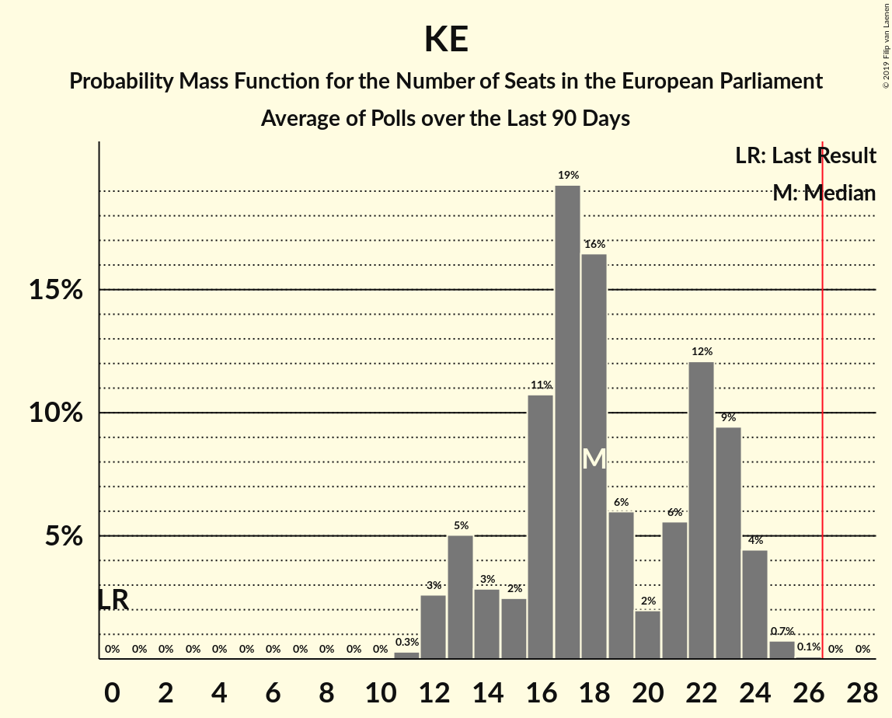
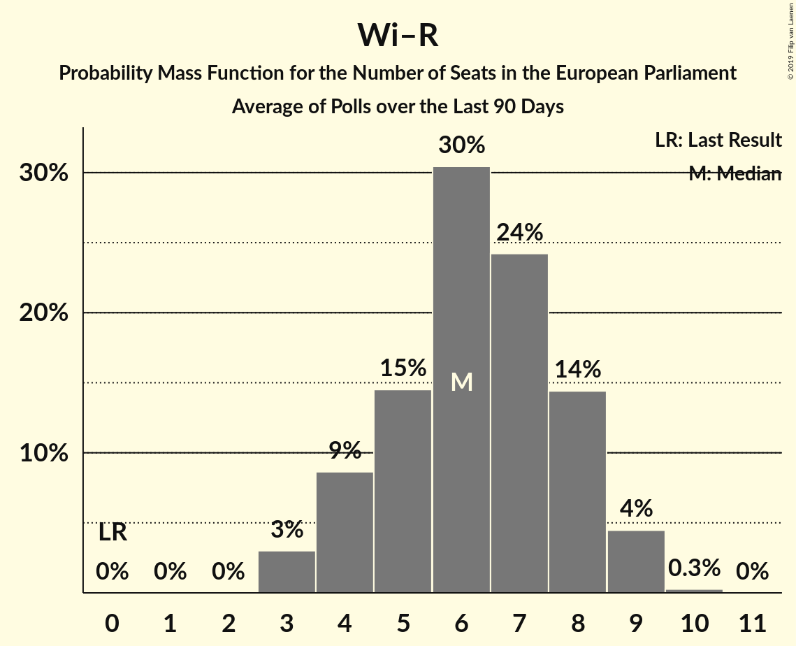

# Poll Average

<a href="#voting-intentions">Voting Intentions</a> | <a href="#seats">Seats</a> | <a href="#coalitions">Coalitions</a> | <a href="#technical-information">Technical Information</a>

## Summary

The table below lists the polls on which the average is based. They are the most recent polls (less than 90 days old) registered and analyzed so far.

| Period     | Polling firm/Commissioner(s) | PiS | PO | K | .N | PSL | SLD | W | R | Wi | Wi–R | KE |
|:----------:|:----------------------------:|:--:|:--:|:--:|:--:|:--:|:--:|:--:|:--:|:--:|:--:|:--:|
| 25 May 2014 | General Election | 0.0%   0 | 0.0%   0 | 0.0%   0 | 0.0%   0 | 0.0%   0 | 0.0%   0 | 0.0%   0 | 0.0%   0 | 0.0%   0 | 0.0%   0 | 0.0%   0 |
| N/A | Poll Average | 28–41%   16–23 | N/A   N/A | 4–9%   0–4 | N/A   N/A | N/A   N/A | N/A   N/A | 1–7%   0–3 | N/A   N/A | N/A   N/A | 9–18%   5–9 | 23–42%   12–23 |
| [20–21 February 2019](2019-02-21-Estymator.html) | Estymator   DoRzeczy.pl | 35–41%   19–22 | N/A   N/A | 6–9%   3–4 | N/A   N/A | N/A   N/A | N/A   N/A | 2–4%   0 | N/A   N/A | N/A   N/A | 8–12%   4–6 | 30–36%   16–20 |
| [14–16 February 2019](2019-02-16-IPSOS.html) | IPSOS   OKO.press | 31–37%   16–20 | N/A   N/A | 6–10%   3–5 | N/A   N/A | N/A   N/A | N/A   N/A | 5–8%   0–4 | N/A   N/A | N/A   N/A | 11–15%   6–8 | 30–36%   16–20 |
| [7–14 February 2019](2019-02-14-CBOS.html) | CBOS | 37–43%   20–24 | N/A   N/A | 4–7%   0–3 | N/A   N/A | N/A   N/A | N/A   N/A | 1–3%   0 | N/A   N/A | N/A   N/A | 9–13%   5–7 | 21–27%   11–15 |
| [8–13 February 2019](2019-02-13-KantarPublic.html) | Kantar Public | 31–37%   18–19 | N/A   N/A | 5–8%   2–3 | N/A   N/A | N/A   N/A | N/A   N/A | 1–2%   0 | N/A   N/A | N/A   N/A | 10–14%   6–7 | 28–34%   15–17 |
| [8–11 February 2019](2019-02-11-Ariadna.html) | Ariadna   WP | 32–38%   18–21 | N/A   N/A | 5–8%   3 | N/A   N/A | N/A   N/A | N/A   N/A | 1–3%   0 | N/A   N/A | N/A   N/A | 13–18%   6–8 | 29–35%   16–19 |
| [7–8 February 2019](2019-02-08-IBRiS.html) | IBRiS   Rzeczpospolita | 34–40%   18–22 | N/A   N/A | 4–6%   0–3 | N/A   N/A | N/A   N/A | N/A   N/A | N/A   N/A | N/A   N/A | N/A   N/A | 15–19%   8–10 | 30–35%   16–19 |
| [31 January–6 February 2019](2019-02-06-InstytutBadańSprawNarodowościowych.html) | Instytut Badań Spraw Narodowościowych   Radio ZET | 32–38%   18–22 | N/A   N/A | 5–7%   2–3 | N/A   N/A | N/A   N/A | N/A   N/A | 1–3%   0 | N/A   N/A | N/A   N/A | 10–14%   6–7 | 38–44%   21–25 |
| [4–5 February 2019](2019-02-05-KantarMillwardBrown.html) | Kantar Millward Brown | 26–32%   13–18 | N/A   N/A | 6–9%   3–4 | N/A   N/A | N/A   N/A | N/A   N/A | 4–7%   0–3 | N/A   N/A | N/A   N/A | 13–17%   7–9 | 28–34%   15–19 |
| [30 January 2019](2019-01-30-InstytutBadańPollster.html) | Instytut Badań Pollster   Super Express | 34–40%   19–23 | N/A   N/A | 5–8%   0–4 | N/A   N/A | N/A   N/A | N/A   N/A | 2–4%   0 | N/A   N/A | N/A   N/A | 10–14%   5–8 | 36–42%   20–24 |
| 25 May 2014 | General Election | 0.0%   0 | 0.0%   0 | 0.0%   0 | 0.0%   0 | 0.0%   0 | 0.0%   0 | 0.0%   0 | 0.0%   0 | 0.0%   0 | 0.0%   0 | 0.0%   0 |

Only polls for which at least the sample size has been published are included in the table above.

**Legend:**
+ **Top half of each row:** Voting intentions (95% confidence interval)
+ **Bottom half of each row:** Seat projections for the European Parliament (95% confidence interval)
+ **PiS:** Prawo i Sprawiedliwość (ECR)
+ **PO:** Platforma Obywatelska (EPP)
+ **K:** Kukiz’15 (EFDD)
+ **.N:** .Nowoczesna (ALDE)
+ **PSL:** Polskie Stronnictwo Ludowe (EPP)
+ **SLD:** Sojusz Lewicy Demokratycznej (S&D)
+ **W:** KORWiN (EFDD)
+ **R:** Partia Razem (*)
+ **Wi:** Wiosna (S&D)
+ **Wi–R:** Wiosna–Partia Razem (S&D)
+ **KE:** Koalicja Europejska (EPP)
+ **N/A (single party):** Party not included the published results
+ **N/A (entire row):** Calculation for this opinion poll not started yet

## Voting Intentions

### Confidence Intervals

| Party | Last Result | Median | 80% Confidence Interval | 90% Confidence Interval | 95% Confidence Interval | 99% Confidence Interval |
|:-----:|:-----------:|:------:|:-----------------------:|:-----------------------:|:-----------------------:|:-----------------------:|
| <a href="#prawo-i-sprawiedliwość-(ecr)">Prawo i Sprawiedliwość (ECR)</a> | 0.0% | 35.7% | 30.7–39.5% |28.8–40.5% | 27.9–41.3% | 26.6–42.7% |
| <a href="#platforma-obywatelska-(epp)">Platforma Obywatelska (EPP)</a> | 0.0% | N/A | N/A |N/A | N/A | N/A |
| <a href="#kukiz’15-(efdd)">Kukiz’15 (EFDD)</a> | 0.0% | 6.1% | 4.7–7.9% |4.4–8.3% | 4.1–8.7% | 3.7–9.5% |
| <a href="#.nowoczesna-(alde)">.Nowoczesna (ALDE)</a> | 0.0% | N/A | N/A |N/A | N/A | N/A |
| <a href="#polskie-stronnictwo-ludowe-(epp)">Polskie Stronnictwo Ludowe (EPP)</a> | 0.0% | N/A | N/A |N/A | N/A | N/A |
| <a href="#sojusz-lewicy-demokratycznej-(s&d)">Sojusz Lewicy Demokratycznej (S&D)</a> | 0.0% | N/A | N/A |N/A | N/A | N/A |
| <a href="#korwin-(efdd)">KORWiN (EFDD)</a> | 0.0% | 2.5% | 1.2–5.9% |1.0–6.5% | 0.8–6.9% | 0.6–7.7% |
| <a href="#partia-razem-(*)">Partia Razem (*)</a> | 0.0% | N/A | N/A |N/A | N/A | N/A |
| <a href="#wiosna-(s&d)">Wiosna (S&D)</a> | 0.0% | N/A | N/A |N/A | N/A | N/A |
| <a href="#wiosna–partia-razem-(s&d)">Wiosna–Partia Razem (S&D)</a> | 0.0% | 12.7% | 10.2–16.5% |9.7–17.3% | 9.2–17.9% | 8.5–18.9% |
| <a href="#koalicja-europejska-(epp)">Koalicja Europejska (EPP)</a> | 0.0% | 32.5% | 25.7–40.1% |23.8–41.2% | 23.0–42.0% | 21.8–43.3% |

### Prawo i Sprawiedliwość (ECR)

*For a full overview of the results for this party, see the [Prawo i Sprawiedliwość (ECR)](party-prawoisprawiedliwośćecr.html) page.*

| Voting Intentions | Probability | Accumulated | Special Marks |
|:-----------------:|:-----------:|:-----------:|:-------------:|
| 0.0–0.5% | 0% | 100% | Last Result |
| 0.5–1.5% | 0% | 100% |  |
| 1.5–2.5% | 0% | 100% |  |
| 2.5–3.5% | 0% | 100% |  |
| 3.5–4.5% | 0% | 100% |  |
| 4.5–5.5% | 0% | 100% |  |
| 5.5–6.5% | 0% | 100% |  |
| 6.5–7.5% | 0% | 100% |  |
| 7.5–8.5% | 0% | 100% |  |
| 8.5–9.5% | 0% | 100% |  |
| 9.5–10.5% | 0% | 100% |  |
| 10.5–11.5% | 0% | 100% |  |
| 11.5–12.5% | 0% | 100% |  |
| 12.5–13.5% | 0% | 100% |  |
| 13.5–14.5% | 0% | 100% |  |
| 14.5–15.5% | 0% | 100% |  |
| 15.5–16.5% | 0% | 100% |  |
| 16.5–17.5% | 0% | 100% |  |
| 17.5–18.5% | 0% | 100% |  |
| 18.5–19.5% | 0% | 100% |  |
| 19.5–20.5% | 0% | 100% |  |
| 20.5–21.5% | 0% | 100% |  |
| 21.5–22.5% | 0% | 100% |  |
| 22.5–23.5% | 0% | 100% |  |
| 23.5–24.5% | 0% | 100% |  |
| 24.5–25.5% | 0.1% | 100% |  |
| 25.5–26.5% | 0.4% | 99.9% |  |
| 26.5–27.5% | 1.2% | 99.6% |  |
| 27.5–28.5% | 2% | 98% |  |
| 28.5–29.5% | 3% | 96% |  |
| 29.5–30.5% | 3% | 93% |  |
| 30.5–31.5% | 2% | 90% |  |
| 31.5–32.5% | 4% | 88% |  |
| 32.5–33.5% | 7% | 84% |  |
| 33.5–34.5% | 12% | 77% |  |
| 34.5–35.5% | 13% | 65% |  |
| 35.5–36.5% | 13% | 52% | Median |
| 36.5–37.5% | 12% | 39% |  |
| 37.5–38.5% | 10% | 27% |  |
| 38.5–39.5% | 7% | 17% |  |
| 39.5–40.5% | 5% | 10% |  |
| 40.5–41.5% | 3% | 5% |  |
| 41.5–42.5% | 1.4% | 2% |  |
| 42.5–43.5% | 0.5% | 0.6% |  |
| 43.5–44.5% | 0.1% | 0.1% |  |
| 44.5–45.5% | 0% | 0% |  |

### Kukiz’15 (EFDD)

*For a full overview of the results for this party, see the [Kukiz’15 (EFDD)](party-kukiz’15efdd.html) page.*

| Voting Intentions | Probability | Accumulated | Special Marks |
|:-----------------:|:-----------:|:-----------:|:-------------:|
| 0.0–0.5% | 0% | 100% | Last Result |
| 0.5–1.5% | 0% | 100% |  |
| 1.5–2.5% | 0% | 100% |  |
| 2.5–3.5% | 0.3% | 100% |  |
| 3.5–4.5% | 7% | 99.7% |  |
| 4.5–5.5% | 23% | 93% |  |
| 5.5–6.5% | 32% | 69% | Median |
| 6.5–7.5% | 23% | 38% |  |
| 7.5–8.5% | 11% | 15% |  |
| 8.5–9.5% | 3% | 4% |  |
| 9.5–10.5% | 0.4% | 0.4% |  |
| 10.5–11.5% | 0% | 0% |  |

### KORWiN (EFDD)

*For a full overview of the results for this party, see the [KORWiN (EFDD)](party-korwinefdd.html) page.*

| Voting Intentions | Probability | Accumulated | Special Marks |
|:-----------------:|:-----------:|:-----------:|:-------------:|
| 0.0–0.5% | 0.3% | 100% | Last Result |
| 0.5–1.5% | 19% | 99.7% |  |
| 1.5–2.5% | 31% | 81% |  |
| 2.5–3.5% | 20% | 50% | Median |
| 3.5–4.5% | 8% | 30% |  |
| 4.5–5.5% | 9% | 22% |  |
| 5.5–6.5% | 9% | 13% |  |
| 6.5–7.5% | 4% | 5% |  |
| 7.5–8.5% | 0.6% | 0.7% |  |
| 8.5–9.5% | 0% | 0% |  |

### Koalicja Europejska (EPP)

*For a full overview of the results for this party, see the [Koalicja Europejska (EPP)](party-koalicjaeuropejskaepp.html) page.*

| Voting Intentions | Probability | Accumulated | Special Marks |
|:-----------------:|:-----------:|:-----------:|:-------------:|
| 0.0–0.5% | 0% | 100% | Last Result |
| 0.5–1.5% | 0% | 100% |  |
| 1.5–2.5% | 0% | 100% |  |
| 2.5–3.5% | 0% | 100% |  |
| 3.5–4.5% | 0% | 100% |  |
| 4.5–5.5% | 0% | 100% |  |
| 5.5–6.5% | 0% | 100% |  |
| 6.5–7.5% | 0% | 100% |  |
| 7.5–8.5% | 0% | 100% |  |
| 8.5–9.5% | 0% | 100% |  |
| 9.5–10.5% | 0% | 100% |  |
| 10.5–11.5% | 0% | 100% |  |
| 11.5–12.5% | 0% | 100% |  |
| 12.5–13.5% | 0% | 100% |  |
| 13.5–14.5% | 0% | 100% |  |
| 14.5–15.5% | 0% | 100% |  |
| 15.5–16.5% | 0% | 100% |  |
| 16.5–17.5% | 0% | 100% |  |
| 17.5–18.5% | 0% | 100% |  |
| 18.5–19.5% | 0% | 100% |  |
| 19.5–20.5% | 0% | 100% |  |
| 20.5–21.5% | 0.3% | 100% |  |
| 21.5–22.5% | 1.2% | 99.7% |  |
| 22.5–23.5% | 3% | 98% |  |
| 23.5–24.5% | 3% | 96% |  |
| 24.5–25.5% | 2% | 93% |  |
| 25.5–26.5% | 1.1% | 90% |  |
| 26.5–27.5% | 0.4% | 89% |  |
| 27.5–28.5% | 0.9% | 89% |  |
| 28.5–29.5% | 3% | 88% |  |
| 29.5–30.5% | 8% | 85% |  |
| 30.5–31.5% | 13% | 77% |  |
| 31.5–32.5% | 15% | 64% | Median |
| 32.5–33.5% | 13% | 49% |  |
| 33.5–34.5% | 8% | 36% |  |
| 34.5–35.5% | 4% | 27% |  |
| 35.5–36.5% | 2% | 24% |  |
| 36.5–37.5% | 2% | 22% |  |
| 37.5–38.5% | 3% | 20% |  |
| 38.5–39.5% | 5% | 17% |  |
| 39.5–40.5% | 5% | 13% |  |
| 40.5–41.5% | 4% | 8% |  |
| 41.5–42.5% | 2% | 4% |  |
| 42.5–43.5% | 1.0% | 1.3% |  |
| 43.5–44.5% | 0.3% | 0.4% |  |
| 44.5–45.5% | 0.1% | 0.1% |  |
| 45.5–46.5% | 0% | 0% |  |

### Wiosna–Partia Razem (S&D)

*For a full overview of the results for this party, see the [Wiosna–Partia Razem (S&D)](party-wiosna–partiarazemsd.html) page.*

| Voting Intentions | Probability | Accumulated | Special Marks |
|:-----------------:|:-----------:|:-----------:|:-------------:|
| 0.0–0.5% | 0% | 100% | Last Result |
| 0.5–1.5% | 0% | 100% |  |
| 1.5–2.5% | 0% | 100% |  |
| 2.5–3.5% | 0% | 100% |  |
| 3.5–4.5% | 0% | 100% |  |
| 4.5–5.5% | 0% | 100% |  |
| 5.5–6.5% | 0% | 100% |  |
| 6.5–7.5% | 0% | 100% |  |
| 7.5–8.5% | 0.6% | 100% |  |
| 8.5–9.5% | 4% | 99.4% |  |
| 9.5–10.5% | 9% | 96% |  |
| 10.5–11.5% | 16% | 87% |  |
| 11.5–12.5% | 18% | 71% |  |
| 12.5–13.5% | 14% | 53% | Median |
| 13.5–14.5% | 10% | 39% |  |
| 14.5–15.5% | 10% | 28% |  |
| 15.5–16.5% | 9% | 18% |  |
| 16.5–17.5% | 6% | 10% |  |
| 17.5–18.5% | 3% | 4% |  |
| 18.5–19.5% | 0.8% | 1.0% |  |
| 19.5–20.5% | 0.1% | 0.1% |  |
| 20.5–21.5% | 0% | 0% |  |

## Seats

### Confidence Intervals

| Party | Last Result | Median | 80% Confidence Interval | 90% Confidence Interval | 95% Confidence Interval | 99% Confidence Interval |
|:-----:|:-----------:|:------:|:-----------------------:|:-----------------------:|:-----------------------:|:-----------------------:|
| <a href="#prawo-i-sprawiedliwość-(ecr)">Prawo i Sprawiedliwość (ECR)</a> | 0 | 20 | 17–22 |17–22 | 16–23 | 13–24 |
| <a href="#platforma-obywatelska-(epp)">Platforma Obywatelska (EPP)</a> | 0 | N/A | N/A |N/A | N/A | N/A |
| <a href="#kukiz’15-(efdd)">Kukiz’15 (EFDD)</a> | 0 | 3 | 0–4 |0–4 | 0–4 | 0–5 |
| <a href="#.nowoczesna-(alde)">.Nowoczesna (ALDE)</a> | 0 | N/A | N/A |N/A | N/A | N/A |
| <a href="#polskie-stronnictwo-ludowe-(epp)">Polskie Stronnictwo Ludowe (EPP)</a> | 0 | N/A | N/A |N/A | N/A | N/A |
| <a href="#sojusz-lewicy-demokratycznej-(s&d)">Sojusz Lewicy Demokratycznej (S&D)</a> | 0 | N/A | N/A |N/A | N/A | N/A |
| <a href="#korwin-(efdd)">KORWiN (EFDD)</a> | 0 | 0 | 0–3 |0–3 | 0–3 | 0–4 |
| <a href="#partia-razem-(*)">Partia Razem (*)</a> | 0 | N/A | N/A |N/A | N/A | N/A |
| <a href="#wiosna-(s&d)">Wiosna (S&D)</a> | 0 | N/A | N/A |N/A | N/A | N/A |
| <a href="#wiosna–partia-razem-(s&d)">Wiosna–Partia Razem (S&D)</a> | 0 | 7 | 5–9 |5–9 | 5–9 | 4–10 |
| <a href="#koalicja-europejska-(epp)">Koalicja Europejska (EPP)</a> | 0 | 18 | 14–23 |13–23 | 12–23 | 12–24 |

### Prawo i Sprawiedliwość (ECR)

*For a full overview of the results for this party, see the [Prawo i Sprawiedliwość (ECR)](party-prawoisprawiedliwośćecr.html) page.*

| Number of Seats | Probability | Accumulated | Special Marks |
|:---------------:|:-----------:|:-----------:|:-------------:|
| 0 | 0% | 100% | Last Result |
| 1 | 0% | 100% |  |
| 2 | 0% | 100% |  |
| 3 | 0% | 100% |  |
| 4 | 0% | 100% |  |
| 5 | 0% | 100% |  |
| 6 | 0% | 100% |  |
| 7 | 0% | 100% |  |
| 8 | 0% | 100% |  |
| 9 | 0% | 100% |  |
| 10 | 0% | 100% |  |
| 11 | 0% | 100% |  |
| 12 | 0% | 100% |  |
| 13 | 1.5% | 100% |  |
| 14 | 0.9% | 98% |  |
| 15 | 0% | 98% |  |
| 16 | 2% | 98% |  |
| 17 | 9% | 96% |  |
| 18 | 10% | 87% |  |
| 19 | 22% | 77% |  |
| 20 | 25% | 56% | Median |
| 21 | 16% | 30% |  |
| 22 | 10% | 14% |  |
| 23 | 4% | 5% |  |
| 24 | 0.9% | 1.0% |  |
| 25 | 0.1% | 0.1% |  |
| 26 | 0% | 0% |  |

### Kukiz’15 (EFDD)

*For a full overview of the results for this party, see the [Kukiz’15 (EFDD)](party-kukiz’15efdd.html) page.*

| Number of Seats | Probability | Accumulated | Special Marks |
|:---------------:|:-----------:|:-----------:|:-------------:|
| 0 | 16% | 100% | Last Result |
| 1 | 0% | 84% |  |
| 2 | 7% | 84% |  |
| 3 | 60% | 77% | Median |
| 4 | 17% | 18% |  |
| 5 | 1.3% | 1.4% |  |
| 6 | 0% | 0% |  |

### KORWiN (EFDD)

*For a full overview of the results for this party, see the [KORWiN (EFDD)](party-korwinefdd.html) page.*

| Number of Seats | Probability | Accumulated | Special Marks |
|:---------------:|:-----------:|:-----------:|:-------------:|
| 0 | 85% | 100% | Last Result, Median |
| 1 | 0% | 15% |  |
| 2 | 1.2% | 15% |  |
| 3 | 12% | 14% |  |
| 4 | 1.3% | 1.3% |  |
| 5 | 0% | 0% |  |

### Koalicja Europejska (EPP)

*For a full overview of the results for this party, see the [Koalicja Europejska (EPP)](party-koalicjaeuropejskaepp.html) page.*

| Number of Seats | Probability | Accumulated | Special Marks |
|:---------------:|:-----------:|:-----------:|:-------------:|
| 0 | 0% | 100% | Last Result |
| 1 | 0% | 100% |  |
| 2 | 0% | 100% |  |
| 3 | 0% | 100% |  |
| 4 | 0% | 100% |  |
| 5 | 0% | 100% |  |
| 6 | 0% | 100% |  |
| 7 | 0% | 100% |  |
| 8 | 0% | 100% |  |
| 9 | 0% | 100% |  |
| 10 | 0% | 100% |  |
| 11 | 0.3% | 100% |  |
| 12 | 3% | 99.7% |  |
| 13 | 5% | 97% |  |
| 14 | 3% | 92% |  |
| 15 | 2% | 89% |  |
| 16 | 18% | 88% |  |
| 17 | 15% | 69% |  |
| 18 | 21% | 54% | Median |
| 19 | 10% | 33% |  |
| 20 | 2% | 23% |  |
| 21 | 3% | 22% |  |
| 22 | 8% | 18% |  |
| 23 | 9% | 11% |  |
| 24 | 1.0% | 1.4% |  |
| 25 | 0.4% | 0.5% |  |
| 26 | 0% | 0% |  |

### Wiosna–Partia Razem (S&D)

*For a full overview of the results for this party, see the [Wiosna–Partia Razem (S&D)](party-wiosna–partiarazemsd.html) page.*

| Number of Seats | Probability | Accumulated | Special Marks |
|:---------------:|:-----------:|:-----------:|:-------------:|
| 0 | 0% | 100% | Last Result |
| 1 | 0% | 100% |  |
| 2 | 0% | 100% |  |
| 3 | 0% | 100% |  |
| 4 | 1.4% | 100% |  |
| 5 | 11% | 98.6% |  |
| 6 | 37% | 87% |  |
| 7 | 28% | 50% | Median |
| 8 | 11% | 22% |  |
| 9 | 10% | 11% |  |
| 10 | 0.5% | 0.7% |  |
| 11 | 0.2% | 0.2% |  |
| 12 | 0% | 0% |  |

## Coalitions

### Confidence Intervals

| Coalition | Last Result | Median | Majority? | 80% Confidence Interval | 90% Confidence Interval | 95% Confidence Interval | 99% Confidence Interval |
|:---------:|:-----------:|:------:|:---------:|:-----------------------:|:-----------------------:|:-----------------------:|:-----------------------:|
| Prawo i Sprawiedliwość (ECR) | 0 | 20 | 0% | 17–22 | 17–22 | 16–23 | 13–24 |
| Koalicja Europejska (EPP) | 0 | 18 | 0% | 14–23 | 13–23 | 12–23 | 12–24 |
| Wiosna–Partia Razem (S&D) | 0 | 7 | 0% | 5–9 | 5–9 | 5–9 | 4–10 |
| KORWiN (EFDD) – Kukiz’15 (EFDD) | 0 | 3 | 0% | 0–7 | 0–7 | 0–7 | 0–8 |

### Prawo i Sprawiedliwość (ECR)

| Number of Seats | Probability | Accumulated | Special Marks |
|:---------------:|:-----------:|:-----------:|:-------------:|
| 0 | 0% | 100% | Last Result |
| 1 | 0% | 100% |  |
| 2 | 0% | 100% |  |
| 3 | 0% | 100% |  |
| 4 | 0% | 100% |  |
| 5 | 0% | 100% |  |
| 6 | 0% | 100% |  |
| 7 | 0% | 100% |  |
| 8 | 0% | 100% |  |
| 9 | 0% | 100% |  |
| 10 | 0% | 100% |  |
| 11 | 0% | 100% |  |
| 12 | 0% | 100% |  |
| 13 | 1.5% | 100% |  |
| 14 | 0.9% | 98% |  |
| 15 | 0% | 98% |  |
| 16 | 2% | 98% |  |
| 17 | 9% | 96% |  |
| 18 | 10% | 87% |  |
| 19 | 22% | 77% |  |
| 20 | 25% | 56% | Median |
| 21 | 16% | 30% |  |
| 22 | 10% | 14% |  |
| 23 | 4% | 5% |  |
| 24 | 0.9% | 1.0% |  |
| 25 | 0.1% | 0.1% |  |
| 26 | 0% | 0% |  |

### Koalicja Europejska (EPP)

| Number of Seats | Probability | Accumulated | Special Marks |
|:---------------:|:-----------:|:-----------:|:-------------:|
| 0 | 0% | 100% | Last Result |
| 1 | 0% | 100% |  |
| 2 | 0% | 100% |  |
| 3 | 0% | 100% |  |
| 4 | 0% | 100% |  |
| 5 | 0% | 100% |  |
| 6 | 0% | 100% |  |
| 7 | 0% | 100% |  |
| 8 | 0% | 100% |  |
| 9 | 0% | 100% |  |
| 10 | 0% | 100% |  |
| 11 | 0.3% | 100% |  |
| 12 | 3% | 99.7% |  |
| 13 | 5% | 97% |  |
| 14 | 3% | 92% |  |
| 15 | 2% | 89% |  |
| 16 | 18% | 88% |  |
| 17 | 15% | 69% |  |
| 18 | 21% | 54% | Median |
| 19 | 10% | 33% |  |
| 20 | 2% | 23% |  |
| 21 | 3% | 22% |  |
| 22 | 8% | 18% |  |
| 23 | 9% | 11% |  |
| 24 | 1.0% | 1.4% |  |
| 25 | 0.4% | 0.5% |  |
| 26 | 0% | 0% |  |

### Wiosna–Partia Razem (S&D)

| Number of Seats | Probability | Accumulated | Special Marks |
|:---------------:|:-----------:|:-----------:|:-------------:|
| 0 | 0% | 100% | Last Result |
| 1 | 0% | 100% |  |
| 2 | 0% | 100% |  |
| 3 | 0% | 100% |  |
| 4 | 1.4% | 100% |  |
| 5 | 11% | 98.6% |  |
| 6 | 37% | 87% |  |
| 7 | 28% | 50% | Median |
| 8 | 11% | 22% |  |
| 9 | 10% | 11% |  |
| 10 | 0.5% | 0.7% |  |
| 11 | 0.2% | 0.2% |  |
| 12 | 0% | 0% |  |

### KORWiN (EFDD) – Kukiz’15 (EFDD)

| Number of Seats | Probability | Accumulated | Special Marks |
|:---------------:|:-----------:|:-----------:|:-------------:|
| 0 | 16% | 100% | Last Result |
| 1 | 0% | 84% |  |
| 2 | 7% | 84% |  |
| 3 | 57% | 77% | Median |
| 4 | 7% | 20% |  |
| 5 | 0.5% | 13% |  |
| 6 | 3% | 13% |  |
| 7 | 9% | 10% |  |
| 8 | 2% | 2% |  |
| 9 | 0.1% | 0.1% |  |
| 10 | 0% | 0% |  |

## Technical Information

+ **Number of polls included in this average:** 9
+ **Lowest number of simulations done in a poll included in this average:** 1,024
+ **Total number of simulations done in the polls included in this average:** 529,408
+ **Error estimate:** 2.01%
