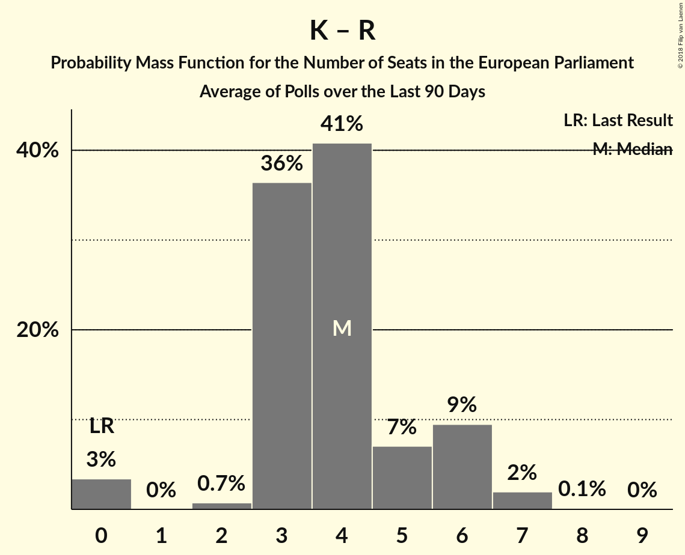
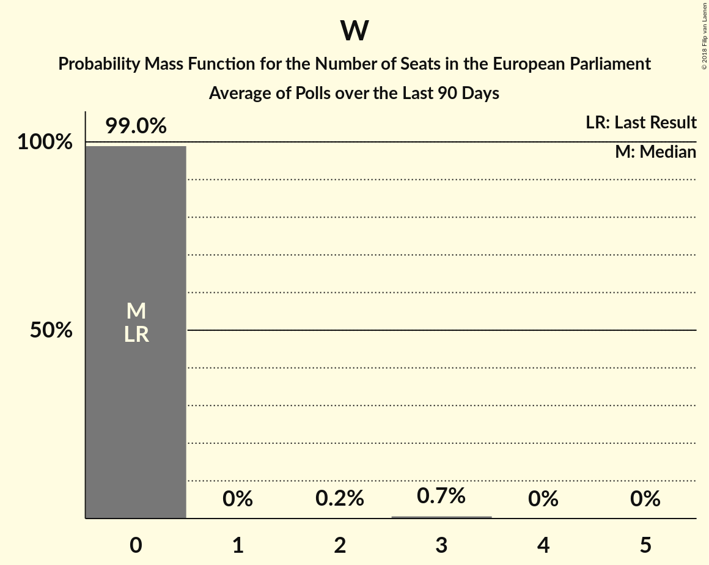

# Poll Average

<a href="#voting-intentions">Voting Intentions</a> | <a href="#seats">Seats</a> | <a href="#coalitions">Coalitions</a> | <a href="#technical-information">Technical Information</a>

## Summary

The table below lists the polls on which the average is based. They are the most recent polls (less than 90 days old) registered and analyzed so far.

| Period     | Polling firm/Commissioner(s) | PiS | PO | K | .N | PSL | SLD | W | R |
|:----------:|:----------------------------:|:--:|:--:|:--:|:--:|:--:|:--:|:--:|:--:|
| 25 May 2014 | General Election | 0.0%   0 | 0.0%   0 | 0.0%   0 | 0.0%   0 | 0.0%   0 | 0.0%   0 | 0.0%   0 | 0.0%   0 |
| N/A | Poll Average | 36–47%   20–28 | 17–29%   10–17 | 5–12%   0–6 | 2–7%   0–3 | 3–8%   0–4 | 4–12%   0–7 | 1–5%   0 | 1–4%   0 |
| [20–21 September 2018](2018-09-21-Estymator.html) | Estymator   DoRzeczy.pl | 42–48%   24–28 | 21–27%   12–15 | 5–9%   3–5 | 3–5%   0–3 | 6–9%   3–5 | 7–10%   3–5 | 1–2%   0 | 1–3%   0 |
| [6–13 September 2018](2018-09-13-CBOS.html) | CBOS | 40–46%   24–29 | 16–20%   9–12 | 6–9%   3–5 | 2–4%   0 | 3–5%   0–3 | 3–5%   0–3 | 1–3%   0 | 1–3%   0 |
| [7–12 September 2018](2018-09-12-KantarPublic.html) | Kantar Public | 39–45%   23–27 | 18–23%   11–13 | 5–8%   0–4 | 3–5%   0 | 3–5%   0 | 5–8%   3–4 | 1–3%   0 | 1–2%   0 |
| [17–19 August 2018](2018-08-19-IPSOS.html) | IPSOS   OKO.press | 38–44%   22–27 | 18–23%   10–13 | 6–10%   3–5 | 3–5%   0–3 | 5–8%   0–4 | 5–8%   0–4 | 3–5%   0–3 | 1–3%   0 |
| [9–10 August 2018](2018-08-10-InstytutBadańPollster.html) | Instytut Badań Pollster   Super Express | 35–41%   20–24 | 25–31%   15–18 | 9–13%   5–7 | 5–8%   0–4 | 3–5%   0–3 | 7–10%   3–5 | 1–3%   0 | 2–4%   0 |
| [8–10 August 2018](2018-08-10-CBMIndicator.html) | CBM Indicator   TVP1 | 39–45%   23–28 | 22–27%   13–17 | 5–8%   0–4 | 4–7%   0–4 | 3–6%   0–3 | 9–13%   5–7 | 2–4%   0 | 3–5%   0 |
| [8–9 July 2018](2018-07-09-IBRiS.html) | IBRiS   Rzeczpospolita | 35–40%   20–24 | 24–29%   13–17 | 4–7%   0–4 | 2–4%   0 | 4–7%   0–3 | 8–12%   4–6 | N/A   N/A | 2–3%   0 |
| 25 May 2014 | General Election | 0.0%   0 | 0.0%   0 | 0.0%   0 | 0.0%   0 | 0.0%   0 | 0.0%   0 | 0.0%   0 | 0.0%   0 |

Only polls for which at least the sample size has been published are included in the table above.

**Legend:**
+ **Top half of each row:** Voting intentions (95% confidence interval)
+ **Bottom half of each row:** Seat projections for the European Parliament (95% confidence interval)
+ **PiS:** Prawo i Sprawiedliwość (ECR)
+ **PO:** Platforma Obywatelska (EPP)
+ **K:** Kukiz’15 (*)
+ **.N:** .Nowoczesna (ALDE)
+ **PSL:** Polskie Stronnictwo Ludowe (EPP)
+ **SLD:** Sojusz Lewicy Demokratycznej (S&D)
+ **W:** Wolność (EFDD)
+ **R:** Partia Razem (*)
+ **N/A (single party):** Party not included the published results
+ **N/A (entire row):** Calculation for this opinion poll not started yet

## Voting Intentions

### Confidence Intervals

| Party | Last Result | Median | 80% Confidence Interval | 90% Confidence Interval | 95% Confidence Interval | 99% Confidence Interval |
|:-----:|:-----------:|:------:|:-----------------------:|:-----------------------:|:-----------------------:|:-----------------------:|
| <a href="#prawo-i-sprawiedliwość-(ecr)">Prawo i Sprawiedliwość (ECR)</a> | 0.0% | 41.5% | 37.0–44.9% |36.2–45.9% | 35.6–46.6% | 34.5–47.9% |
| <a href="#platforma-obywatelska-(epp)">Platforma Obywatelska (EPP)</a> | 0.0% | 23.3% | 18.3–27.8% |17.5–28.7% | 17.0–29.3% | 16.0–30.5% |
| <a href="#kukiz’15-(*)">Kukiz’15 (*)</a> | 0.0% | 6.9% | 5.5–10.6% |5.2–11.4% | 4.9–12.0% | 4.5–12.9% |
| <a href="#.nowoczesna-(alde)">.Nowoczesna (ALDE)</a> | 0.0% | 4.1% | 2.9–6.0% |2.7–6.5% | 2.5–6.8% | 2.1–7.5% |
| <a href="#polskie-stronnictwo-ludowe-(epp)">Polskie Stronnictwo Ludowe (EPP)</a> | 0.0% | 4.8% | 3.6–7.2% |3.4–7.8% | 3.2–8.2% | 2.8–9.0% |
| <a href="#sojusz-lewicy-demokratycznej-(s&d)">Sojusz Lewicy Demokratycznej (S&D)</a> | 0.0% | 7.6% | 4.4–10.6% |3.9–11.2% | 3.6–11.7% | 3.1–12.5% |
| <a href="#wolność-(efdd)">Wolność (EFDD)</a> | 0.0% | 2.2% | 1.5–4.0% |1.3–4.4% | 1.2–4.7% | 0.9–5.3% |
| <a href="#partia-razem-(*)">Partia Razem (*)</a> | 0.0% | 2.2% | 1.2–3.6% |0.9–3.9% | 0.8–4.2% | 0.6–4.7% |

### Prawo i Sprawiedliwość (ECR)

*For a full overview of the results for this party, see the [Prawo i Sprawiedliwość (ECR)](party-prawoisprawiedliwośćecr.html) page.*

| Voting Intentions | Probability | Accumulated | Special Marks |
|:-----------------:|:-----------:|:-----------:|:-------------:|
| 0.0–0.5% | 0% | 100% | Last Result |
| 0.5–1.5% | 0% | 100% |  |
| 1.5–2.5% | 0% | 100% |  |
| 2.5–3.5% | 0% | 100% |  |
| 3.5–4.5% | 0% | 100% |  |
| 4.5–5.5% | 0% | 100% |  |
| 5.5–6.5% | 0% | 100% |  |
| 6.5–7.5% | 0% | 100% |  |
| 7.5–8.5% | 0% | 100% |  |
| 8.5–9.5% | 0% | 100% |  |
| 9.5–10.5% | 0% | 100% |  |
| 10.5–11.5% | 0% | 100% |  |
| 11.5–12.5% | 0% | 100% |  |
| 12.5–13.5% | 0% | 100% |  |
| 13.5–14.5% | 0% | 100% |  |
| 14.5–15.5% | 0% | 100% |  |
| 15.5–16.5% | 0% | 100% |  |
| 16.5–17.5% | 0% | 100% |  |
| 17.5–18.5% | 0% | 100% |  |
| 18.5–19.5% | 0% | 100% |  |
| 19.5–20.5% | 0% | 100% |  |
| 20.5–21.5% | 0% | 100% |  |
| 21.5–22.5% | 0% | 100% |  |
| 22.5–23.5% | 0% | 100% |  |
| 23.5–24.5% | 0% | 100% |  |
| 24.5–25.5% | 0% | 100% |  |
| 25.5–26.5% | 0% | 100% |  |
| 26.5–27.5% | 0% | 100% |  |
| 27.5–28.5% | 0% | 100% |  |
| 28.5–29.5% | 0% | 100% |  |
| 29.5–30.5% | 0% | 100% |  |
| 30.5–31.5% | 0% | 100% |  |
| 31.5–32.5% | 0% | 100% |  |
| 32.5–33.5% | 0.1% | 100% |  |
| 33.5–34.5% | 0.5% | 99.9% |  |
| 34.5–35.5% | 2% | 99.5% |  |
| 35.5–36.5% | 4% | 98% |  |
| 36.5–37.5% | 7% | 93% |  |
| 37.5–38.5% | 8% | 86% |  |
| 38.5–39.5% | 8% | 78% |  |
| 39.5–40.5% | 9% | 70% |  |
| 40.5–41.5% | 12% | 61% | Median |
| 41.5–42.5% | 14% | 49% |  |
| 42.5–43.5% | 13% | 35% |  |
| 43.5–44.5% | 10% | 23% |  |
| 44.5–45.5% | 7% | 13% |  |
| 45.5–46.5% | 4% | 6% |  |
| 46.5–47.5% | 2% | 3% |  |
| 47.5–48.5% | 0.6% | 0.8% |  |
| 48.5–49.5% | 0.2% | 0.2% |  |
| 49.5–50.5% | 0% | 0% |  |

### Platforma Obywatelska (EPP)

*For a full overview of the results for this party, see the [Platforma Obywatelska (EPP)](party-platformaobywatelskaepp.html) page.*

| Voting Intentions | Probability | Accumulated | Special Marks |
|:-----------------:|:-----------:|:-----------:|:-------------:|
| 0.0–0.5% | 0% | 100% | Last Result |
| 0.5–1.5% | 0% | 100% |  |
| 1.5–2.5% | 0% | 100% |  |
| 2.5–3.5% | 0% | 100% |  |
| 3.5–4.5% | 0% | 100% |  |
| 4.5–5.5% | 0% | 100% |  |
| 5.5–6.5% | 0% | 100% |  |
| 6.5–7.5% | 0% | 100% |  |
| 7.5–8.5% | 0% | 100% |  |
| 8.5–9.5% | 0% | 100% |  |
| 9.5–10.5% | 0% | 100% |  |
| 10.5–11.5% | 0% | 100% |  |
| 11.5–12.5% | 0% | 100% |  |
| 12.5–13.5% | 0% | 100% |  |
| 13.5–14.5% | 0% | 100% |  |
| 14.5–15.5% | 0.2% | 100% |  |
| 15.5–16.5% | 1.2% | 99.8% |  |
| 16.5–17.5% | 4% | 98.6% |  |
| 17.5–18.5% | 7% | 95% |  |
| 18.5–19.5% | 10% | 88% |  |
| 19.5–20.5% | 10% | 78% |  |
| 20.5–21.5% | 7% | 67% |  |
| 21.5–22.5% | 5% | 60% |  |
| 22.5–23.5% | 6% | 55% | Median |
| 23.5–24.5% | 9% | 48% |  |
| 24.5–25.5% | 10% | 39% |  |
| 25.5–26.5% | 9% | 29% |  |
| 26.5–27.5% | 8% | 20% |  |
| 27.5–28.5% | 6% | 12% |  |
| 28.5–29.5% | 4% | 6% |  |
| 29.5–30.5% | 1.5% | 2% |  |
| 30.5–31.5% | 0.4% | 0.5% |  |
| 31.5–32.5% | 0.1% | 0.1% |  |
| 32.5–33.5% | 0% | 0% |  |

### Kukiz’15 (*)

*For a full overview of the results for this party, see the [Kukiz’15 (*)](party-kukiz’15.html) page.*

| Voting Intentions | Probability | Accumulated | Special Marks |
|:-----------------:|:-----------:|:-----------:|:-------------:|
| 0.0–0.5% | 0% | 100% | Last Result |
| 0.5–1.5% | 0% | 100% |  |
| 1.5–2.5% | 0% | 100% |  |
| 2.5–3.5% | 0% | 100% |  |
| 3.5–4.5% | 0.7% | 100% |  |
| 4.5–5.5% | 11% | 99.3% |  |
| 5.5–6.5% | 29% | 88% |  |
| 6.5–7.5% | 26% | 59% | Median |
| 7.5–8.5% | 14% | 33% |  |
| 8.5–9.5% | 5% | 19% |  |
| 9.5–10.5% | 4% | 14% |  |
| 10.5–11.5% | 6% | 10% |  |
| 11.5–12.5% | 3% | 4% |  |
| 12.5–13.5% | 0.9% | 1.0% |  |
| 13.5–14.5% | 0.1% | 0.1% |  |
| 14.5–15.5% | 0% | 0% |  |

### .Nowoczesna (ALDE)

*For a full overview of the results for this party, see the [.Nowoczesna (ALDE)](party-nowoczesnaalde.html) page.*

| Voting Intentions | Probability | Accumulated | Special Marks |
|:-----------------:|:-----------:|:-----------:|:-------------:|
| 0.0–0.5% | 0% | 100% | Last Result |
| 0.5–1.5% | 0% | 100% |  |
| 1.5–2.5% | 3% | 100% |  |
| 2.5–3.5% | 26% | 97% |  |
| 3.5–4.5% | 34% | 70% | Median |
| 4.5–5.5% | 20% | 36% |  |
| 5.5–6.5% | 12% | 16% |  |
| 6.5–7.5% | 4% | 4% |  |
| 7.5–8.5% | 0.4% | 0.5% |  |
| 8.5–9.5% | 0% | 0% |  |

### Polskie Stronnictwo Ludowe (EPP)

*For a full overview of the results for this party, see the [Polskie Stronnictwo Ludowe (EPP)](party-polskiestronnictwoludoweepp.html) page.*

| Voting Intentions | Probability | Accumulated | Special Marks |
|:-----------------:|:-----------:|:-----------:|:-------------:|
| 0.0–0.5% | 0% | 100% | Last Result |
| 0.5–1.5% | 0% | 100% |  |
| 1.5–2.5% | 0.1% | 100% |  |
| 2.5–3.5% | 9% | 99.9% |  |
| 3.5–4.5% | 33% | 91% |  |
| 4.5–5.5% | 26% | 58% | Median |
| 5.5–6.5% | 16% | 33% |  |
| 6.5–7.5% | 10% | 17% |  |
| 7.5–8.5% | 5% | 7% |  |
| 8.5–9.5% | 1.2% | 1.4% |  |
| 9.5–10.5% | 0.1% | 0.1% |  |
| 10.5–11.5% | 0% | 0% |  |

### Sojusz Lewicy Demokratycznej (S&D)

*For a full overview of the results for this party, see the [Sojusz Lewicy Demokratycznej (S&D)](party-sojuszlewicydemokratycznejsd.html) page.*

| Voting Intentions | Probability | Accumulated | Special Marks |
|:-----------------:|:-----------:|:-----------:|:-------------:|
| 0.0–0.5% | 0% | 100% | Last Result |
| 0.5–1.5% | 0% | 100% |  |
| 1.5–2.5% | 0% | 100% |  |
| 2.5–3.5% | 2% | 100% |  |
| 3.5–4.5% | 9% | 98% |  |
| 4.5–5.5% | 10% | 89% |  |
| 5.5–6.5% | 15% | 79% |  |
| 6.5–7.5% | 13% | 64% |  |
| 7.5–8.5% | 15% | 51% | Median |
| 8.5–9.5% | 13% | 36% |  |
| 9.5–10.5% | 12% | 23% |  |
| 10.5–11.5% | 8% | 11% |  |
| 11.5–12.5% | 3% | 3% |  |
| 12.5–13.5% | 0.4% | 0.5% |  |
| 13.5–14.5% | 0% | 0% |  |

### Wolność (EFDD)

*For a full overview of the results for this party, see the [Wolność (EFDD)](party-wolnośćefdd.html) page.*

| Voting Intentions | Probability | Accumulated | Special Marks |
|:-----------------:|:-----------:|:-----------:|:-------------:|
| 0.0–0.5% | 0% | 100% | Last Result |
| 0.5–1.5% | 14% | 100% |  |
| 1.5–2.5% | 47% | 86% | Median |
| 2.5–3.5% | 21% | 39% |  |
| 3.5–4.5% | 14% | 18% |  |
| 4.5–5.5% | 3% | 4% |  |
| 5.5–6.5% | 0.2% | 0.2% |  |
| 6.5–7.5% | 0% | 0% |  |

### Partia Razem (*)

*For a full overview of the results for this party, see the [Partia Razem (*)](party-partiarazem.html) page.*

| Voting Intentions | Probability | Accumulated | Special Marks |
|:-----------------:|:-----------:|:-----------:|:-------------:|
| 0.0–0.5% | 0.4% | 100% | Last Result |
| 0.5–1.5% | 18% | 99.6% |  |
| 1.5–2.5% | 45% | 81% | Median |
| 2.5–3.5% | 26% | 37% |  |
| 3.5–4.5% | 9% | 10% |  |
| 4.5–5.5% | 0.9% | 0.9% |  |
| 5.5–6.5% | 0% | 0% |  |

## Seats

### Confidence Intervals

| Party | Last Result | Median | 80% Confidence Interval | 90% Confidence Interval | 95% Confidence Interval | 99% Confidence Interval |
|:-----:|:-----------:|:------:|:-----------------------:|:-----------------------:|:-----------------------:|:-----------------------:|
| <a href="#prawo-i-sprawiedliwość-(ecr)">Prawo i Sprawiedliwość (ECR)</a> | 0 | 25 | 21–27 |21–27 | 20–28 | 20–29 |
| <a href="#platforma-obywatelska-(epp)">Platforma Obywatelska (EPP)</a> | 0 | 13 | 11–16 |10–17 | 10–17 | 9–18 |
| <a href="#kukiz’15-(*)">Kukiz’15 (*)</a> | 0 | 4 | 3–6 |3–6 | 0–6 | 0–7 |
| <a href="#.nowoczesna-(alde)">.Nowoczesna (ALDE)</a> | 0 | 0 | 0–3 |0–3 | 0–3 | 0–4 |
| <a href="#polskie-stronnictwo-ludowe-(epp)">Polskie Stronnictwo Ludowe (EPP)</a> | 0 | 0 | 0–4 |0–4 | 0–4 | 0–5 |
| <a href="#sojusz-lewicy-demokratycznej-(s&d)">Sojusz Lewicy Demokratycznej (S&D)</a> | 0 | 4 | 0–6 |0–6 | 0–7 | 0–7 |
| <a href="#wolność-(efdd)">Wolność (EFDD)</a> | 0 | 0 | 0 |0 | 0 | 0–3 |
| <a href="#partia-razem-(*)">Partia Razem (*)</a> | 0 | 0 | 0 |0 | 0 | 0 |

### Prawo i Sprawiedliwość (ECR)

*For a full overview of the results for this party, see the [Prawo i Sprawiedliwość (ECR)](party-prawoisprawiedliwośćecr.html) page.*

| Number of Seats | Probability | Accumulated | Special Marks |
|:---------------:|:-----------:|:-----------:|:-------------:|
| 0 | 0% | 100% | Last Result |
| 1 | 0% | 100% |  |
| 2 | 0% | 100% |  |
| 3 | 0% | 100% |  |
| 4 | 0% | 100% |  |
| 5 | 0% | 100% |  |
| 6 | 0% | 100% |  |
| 7 | 0% | 100% |  |
| 8 | 0% | 100% |  |
| 9 | 0% | 100% |  |
| 10 | 0% | 100% |  |
| 11 | 0% | 100% |  |
| 12 | 0% | 100% |  |
| 13 | 0% | 100% |  |
| 14 | 0% | 100% |  |
| 15 | 0% | 100% |  |
| 16 | 0% | 100% |  |
| 17 | 0% | 100% |  |
| 18 | 0% | 100% |  |
| 19 | 0.3% | 100% |  |
| 20 | 3% | 99.6% |  |
| 21 | 7% | 97% |  |
| 22 | 11% | 90% |  |
| 23 | 11% | 79% |  |
| 24 | 14% | 68% |  |
| 25 | 21% | 55% | Median |
| 26 | 18% | 33% |  |
| 27 | 11% | 16% | Majority |
| 28 | 4% | 5% |  |
| 29 | 0.6% | 0.7% |  |
| 30 | 0.2% | 0.2% |  |
| 31 | 0% | 0% |  |

### Platforma Obywatelska (EPP)

*For a full overview of the results for this party, see the [Platforma Obywatelska (EPP)](party-platformaobywatelskaepp.html) page.*

| Number of Seats | Probability | Accumulated | Special Marks |
|:---------------:|:-----------:|:-----------:|:-------------:|
| 0 | 0% | 100% | Last Result |
| 1 | 0% | 100% |  |
| 2 | 0% | 100% |  |
| 3 | 0% | 100% |  |
| 4 | 0% | 100% |  |
| 5 | 0% | 100% |  |
| 6 | 0% | 100% |  |
| 7 | 0% | 100% |  |
| 8 | 0% | 100% |  |
| 9 | 1.0% | 100% |  |
| 10 | 4% | 99.0% |  |
| 11 | 13% | 95% |  |
| 12 | 19% | 82% |  |
| 13 | 13% | 62% | Median |
| 14 | 15% | 49% |  |
| 15 | 16% | 34% |  |
| 16 | 11% | 18% |  |
| 17 | 6% | 7% |  |
| 18 | 0.9% | 1.0% |  |
| 19 | 0.1% | 0.1% |  |
| 20 | 0% | 0% |  |

### Kukiz’15 (*)

*For a full overview of the results for this party, see the [Kukiz’15 (*)](party-kukiz’15.html) page.*

| Number of Seats | Probability | Accumulated | Special Marks |
|:---------------:|:-----------:|:-----------:|:-------------:|
| 0 | 3% | 100% | Last Result |
| 1 | 0% | 97% |  |
| 2 | 0.7% | 97% |  |
| 3 | 38% | 96% |  |
| 4 | 36% | 58% | Median |
| 5 | 10% | 22% |  |
| 6 | 10% | 12% |  |
| 7 | 2% | 2% |  |
| 8 | 0.1% | 0.1% |  |
| 9 | 0% | 0% |  |

### .Nowoczesna (ALDE)

*For a full overview of the results for this party, see the [.Nowoczesna (ALDE)](party-nowoczesnaalde.html) page.*

| Number of Seats | Probability | Accumulated | Special Marks |
|:---------------:|:-----------:|:-----------:|:-------------:|
| 0 | 76% | 100% | Last Result, Median |
| 1 | 0% | 24% |  |
| 2 | 0.9% | 24% |  |
| 3 | 21% | 23% |  |
| 4 | 2% | 2% |  |
| 5 | 0% | 0% |  |

### Polskie Stronnictwo Ludowe (EPP)

*For a full overview of the results for this party, see the [Polskie Stronnictwo Ludowe (EPP)](party-polskiestronnictwoludoweepp.html) page.*

| Number of Seats | Probability | Accumulated | Special Marks |
|:---------------:|:-----------:|:-----------:|:-------------:|
| 0 | 55% | 100% | Last Result, Median |
| 1 | 0% | 45% |  |
| 2 | 2% | 45% |  |
| 3 | 28% | 43% |  |
| 4 | 14% | 15% |  |
| 5 | 2% | 2% |  |
| 6 | 0% | 0% |  |

### Sojusz Lewicy Demokratycznej (S&D)

*For a full overview of the results for this party, see the [Sojusz Lewicy Demokratycznej (S&D)](party-sojuszlewicydemokratycznejsd.html) page.*

| Number of Seats | Probability | Accumulated | Special Marks |
|:---------------:|:-----------:|:-----------:|:-------------:|
| 0 | 15% | 100% | Last Result |
| 1 | 0% | 85% |  |
| 2 | 0.1% | 85% |  |
| 3 | 21% | 85% |  |
| 4 | 25% | 64% | Median |
| 5 | 22% | 39% |  |
| 6 | 14% | 17% |  |
| 7 | 3% | 3% |  |
| 8 | 0.2% | 0.2% |  |
| 9 | 0% | 0% |  |

### Wolność (EFDD)

*For a full overview of the results for this party, see the [Wolność (EFDD)](party-wolnośćefdd.html) page.*

| Number of Seats | Probability | Accumulated | Special Marks |
|:---------------:|:-----------:|:-----------:|:-------------:|
| 0 | 98.9% | 100% | Last Result, Median |
| 1 | 0% | 1.1% |  |
| 2 | 0.3% | 1.1% |  |
| 3 | 0.9% | 0.9% |  |
| 4 | 0% | 0% |  |

### Partia Razem (*)

*For a full overview of the results for this party, see the [Partia Razem (*)](party-partiarazem.html) page.*

| Number of Seats | Probability | Accumulated | Special Marks |
|:---------------:|:-----------:|:-----------:|:-------------:|
| 0 | 99.8% | 100% | Last Result, Median |
| 1 | 0% | 0.2% |  |
| 2 | 0% | 0.2% |  |
| 3 | 0.1% | 0.1% |  |
| 4 | 0% | 0% |  |

## Coalitions

### Confidence Intervals

| Coalition | Last Result | Median | Majority? | 80% Confidence Interval | 90% Confidence Interval | 95% Confidence Interval | 99% Confidence Interval |
|:---------:|:-----------:|:------:|:---------:|:-----------------------:|:-----------------------:|:-----------------------:|:-----------------------:|
| Prawo i Sprawiedliwość (ECR) | 0 | 25 | 16% | 21–27 | 21–27 | 20–28 | 20–29 |
| Platforma Obywatelska (EPP) – Polskie Stronnictwo Ludowe (EPP) | 0 | 15 | 0% | 11–18 | 11–18 | 10–19 | 9–20 |
| Sojusz Lewicy Demokratycznej (S&D) | 0 | 4 | 0% | 0–6 | 0–6 | 0–7 | 0–7 |
| Kukiz’15 (*) – Partia Razem (*) | 0 | 4 | 0% | 3–6 | 3–6 | 0–6 | 0–7 |
| .Nowoczesna (ALDE) | 0 | 0 | 0% | 0–3 | 0–3 | 0–3 | 0–4 |
| Wolność (EFDD) | 0 | 0 | 0% | 0 | 0 | 0 | 0–3 |

### Prawo i Sprawiedliwość (ECR)

| Number of Seats | Probability | Accumulated | Special Marks |
|:---------------:|:-----------:|:-----------:|:-------------:|
| 0 | 0% | 100% | Last Result |
| 1 | 0% | 100% |  |
| 2 | 0% | 100% |  |
| 3 | 0% | 100% |  |
| 4 | 0% | 100% |  |
| 5 | 0% | 100% |  |
| 6 | 0% | 100% |  |
| 7 | 0% | 100% |  |
| 8 | 0% | 100% |  |
| 9 | 0% | 100% |  |
| 10 | 0% | 100% |  |
| 11 | 0% | 100% |  |
| 12 | 0% | 100% |  |
| 13 | 0% | 100% |  |
| 14 | 0% | 100% |  |
| 15 | 0% | 100% |  |
| 16 | 0% | 100% |  |
| 17 | 0% | 100% |  |
| 18 | 0% | 100% |  |
| 19 | 0.3% | 100% |  |
| 20 | 3% | 99.6% |  |
| 21 | 7% | 97% |  |
| 22 | 11% | 90% |  |
| 23 | 11% | 79% |  |
| 24 | 14% | 68% |  |
| 25 | 21% | 55% | Median |
| 26 | 18% | 33% |  |
| 27 | 11% | 16% | Majority |
| 28 | 4% | 5% |  |
| 29 | 0.6% | 0.7% |  |
| 30 | 0.2% | 0.2% |  |
| 31 | 0% | 0% |  |

### Platforma Obywatelska (EPP) – Polskie Stronnictwo Ludowe (EPP)

| Number of Seats | Probability | Accumulated | Special Marks |
|:---------------:|:-----------:|:-----------:|:-------------:|
| 0 | 0% | 100% | Last Result |
| 1 | 0% | 100% |  |
| 2 | 0% | 100% |  |
| 3 | 0% | 100% |  |
| 4 | 0% | 100% |  |
| 5 | 0% | 100% |  |
| 6 | 0% | 100% |  |
| 7 | 0% | 100% |  |
| 8 | 0% | 100% |  |
| 9 | 0.8% | 100% |  |
| 10 | 2% | 99.2% |  |
| 11 | 8% | 97% |  |
| 12 | 12% | 89% |  |
| 13 | 6% | 77% | Median |
| 14 | 8% | 70% |  |
| 15 | 14% | 62% |  |
| 16 | 15% | 48% |  |
| 17 | 16% | 33% |  |
| 18 | 12% | 16% |  |
| 19 | 4% | 4% |  |
| 20 | 0.5% | 0.5% |  |
| 21 | 0% | 0% |  |

### Sojusz Lewicy Demokratycznej (S&D)

| Number of Seats | Probability | Accumulated | Special Marks |
|:---------------:|:-----------:|:-----------:|:-------------:|
| 0 | 15% | 100% | Last Result |
| 1 | 0% | 85% |  |
| 2 | 0.1% | 85% |  |
| 3 | 21% | 85% |  |
| 4 | 25% | 64% | Median |
| 5 | 22% | 39% |  |
| 6 | 14% | 17% |  |
| 7 | 3% | 3% |  |
| 8 | 0.2% | 0.2% |  |
| 9 | 0% | 0% |  |

### Kukiz’15 (*) – Partia Razem (*)

| Number of Seats | Probability | Accumulated | Special Marks |
|:---------------:|:-----------:|:-----------:|:-------------:|
| 0 | 3% | 100% | Last Result |
| 1 | 0% | 97% |  |
| 2 | 0.7% | 97% |  |
| 3 | 38% | 96% |  |
| 4 | 36% | 59% | Median |
| 5 | 10% | 22% |  |
| 6 | 10% | 12% |  |
| 7 | 2% | 2% |  |
| 8 | 0.1% | 0.1% |  |
| 9 | 0% | 0% |  |

### .Nowoczesna (ALDE)

| Number of Seats | Probability | Accumulated | Special Marks |
|:---------------:|:-----------:|:-----------:|:-------------:|
| 0 | 76% | 100% | Last Result, Median |
| 1 | 0% | 24% |  |
| 2 | 0.9% | 24% |  |
| 3 | 21% | 23% |  |
| 4 | 2% | 2% |  |
| 5 | 0% | 0% |  |

### Wolność (EFDD)

| Number of Seats | Probability | Accumulated | Special Marks |
|:---------------:|:-----------:|:-----------:|:-------------:|
| 0 | 99.0% | 100% | Last Result, Median |
| 1 | 0% | 1.0% |  |
| 2 | 0.2% | 1.0% |  |
| 3 | 0.7% | 0.7% |  |
| 4 | 0% | 0% |  |

## Technical Information

+ **Number of polls included in this average:** 7
+ **Lowest number of simulations done in a poll included in this average:** 131,072
+ **Total number of simulations done in the polls included in this average:** 5,505,024
+ **Error estimate:** 1.89%
