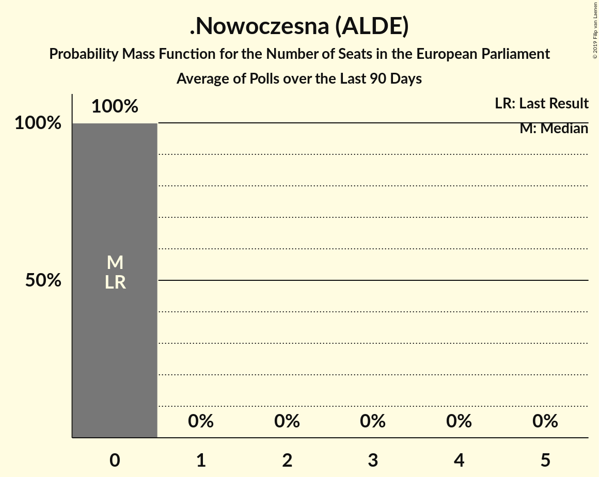

# Poll Average

<a href="#voting-intentions">Voting Intentions</a> | <a href="#seats">Seats</a> | <a href="#coalitions">Coalitions</a> | <a href="#technical-information">Technical Information</a>

## Summary

The table below lists the polls on which the average is based. They are the most recent polls (less than 90 days old) registered and analyzed so far.

| Period     | Polling firm/Commissioner(s) | PiS | PO | K | .N | PSL | SLD | W | R |
|:----------:|:----------------------------:|:--:|:--:|:--:|:--:|:--:|:--:|:--:|:--:|
| 25 May 2014 | General Election | 0.0%   0 | 0.0%   0 | 0.0%   0 | 0.0%   0 | 0.0%   0 | 0.0%   0 | 0.0%   0 | 0.0%   0 |
| N/A | Poll Average | 35–52%   19–31 | 13–25%   7–14 | 5–9%   0–5 | 3–9%   0–5 | 4–7%   0–4 | 2–8%   0–4 | 0–4%   0 | 2–4%   0 |
| [1–8 March 2018](2018-03-08-CBOS.html) | CBOS | 41–47%   23–28 | 12–16%   6–9 | 5–8%   0–4 | 5–8%   0–4 | 4–7%   0–3 | 4–7%   0–3 | 1–3%   0 | 1–3%   0 |
| [26 February 2018](2018-02-26-IBRiS.html) | IBRiS | 38–43%   21–25 | 20–25%   11–14 | 5–8%   3–4 | 3–5%   0 | 5–8%   0–4 | 6–9%   3–5 | 1–2%   0 | 3–5%   0 |
| [21–22 February 2018](2018-02-22-Estymator.html) | Estymator   DoRzeczy.pl | 47–53%   27–32 | 20–26%   11–15 | 6–9%   3–5 | 3–5%   0–3 | 4–7%   0–3 | 5–8%   0–4 | 0–2%   0 | 2–4%   0 |
| [16–21 February 2018](2018-02-21-KantarPublic.html) | Kantar Public | 34–40%   19–24 | 18–23%   10–13 | 6–9%   3–5 | 5–8%   0–4 | 4–7%   0–3 | 4–7%   0–3 | 1–2%   0 | 1–3%   0 |
| [19–20 February 2018](2018-02-20-KantarMillwardBrown.html) | Kantar Millward Brown   TVN and TVN24 | 37–43%   21–26 | 14–18%   8–11 | 5–8%   0–4 | 6–10%   3–5 | 4–7%   0–3 | 2–4%   0 | 2–4%   0 | 2–4%   0 |
| 25 May 2014 | General Election | 0.0%   0 | 0.0%   0 | 0.0%   0 | 0.0%   0 | 0.0%   0 | 0.0%   0 | 0.0%   0 | 0.0%   0 |

Only polls for which at least the sample size has been published are included in the table above.

**Legend:**
+ **Top half of each row:** Voting intentions (95% confidence interval)
+ **Bottom half of each row:** Seat projections for the European Parliament (95% confidence interval)
+ **PiS:** Prawo i Sprawiedliwość (ECR)
+ **PO:** Platforma Obywatelska (EPP)
+ **K:** Kukiz’15 (ENF)
+ **.N:** .Nowoczesna (ALDE)
+ **PSL:** Polskie Stronnictwo Ludowe (EPP)
+ **SLD:** Sojusz Lewicy Demokratycznej (S&D)
+ **W:** Wolność (EFDD)
+ **R:** Partia Razem (—)
+ **N/A (single party):** Party not included the published results
+ **N/A (entire row):** Calculation for this opinion poll not started yet

## Voting Intentions

### Confidence Intervals

| Party | Last Result | Median | 80% Confidence Interval | 90% Confidence Interval | 95% Confidence Interval | 99% Confidence Interval |
|:-----:|:-----------:|:------:|:-----------------------:|:-----------------------:|:-----------------------:|:-----------------------:|
| <a href="#prawo-i-sprawiedliwość-(ecr)">Prawo i Sprawiedliwość (ECR)</a> | 0.0% | 41.2% | 36.9–50.2% |36.0–51.3% | 35.3–52.1% | 34.1–53.3% |
| <a href="#platforma-obywatelska-(epp)">Platforma Obywatelska (EPP)</a> | 0.0% | 20.0% | 14.0–23.6% |13.3–24.2% | 12.9–24.7% | 12.1–25.7% |
| <a href="#kukiz’15-(enf)">Kukiz’15 (ENF)</a> | 0.0% | 6.6% | 5.5–7.9% |5.2–8.3% | 5.0–8.6% | 4.5–9.2% |
| <a href="#.nowoczesna-(alde)">.Nowoczesna (ALDE)</a> | 0.0% | 5.6% | 3.4–8.1% |3.2–8.6% | 2.9–9.1% | 2.6–9.8% |
| <a href="#polskie-stronnictwo-ludowe-(epp)">Polskie Stronnictwo Ludowe (EPP)</a> | 0.0% | 5.3% | 4.4–6.4% |4.1–6.8% | 3.9–7.1% | 3.6–7.7% |
| <a href="#sojusz-lewicy-demokratycznej-(s&d)">Sojusz Lewicy Demokratycznej (S&D)</a> | 0.0% | 5.4% | 3.1–7.2% |2.7–7.6% | 2.5–8.0% | 2.1–8.7% |
| <a href="#wolność-(efdd)">Wolność (EFDD)</a> | 0.0% | 1.4% | 0.7–3.1% |0.6–3.4% | 0.5–3.7% | 0.4–4.2% |
| <a href="#partia-razem-(—)">Partia Razem (—)</a> | 0.0% | 2.8% | 1.8–3.8% |1.6–4.1% | 1.5–4.4% | 1.2–4.9% |

### Prawo i Sprawiedliwość (ECR)

*For a full overview of the results for this party, see the [Prawo i Sprawiedliwość (ECR)](party-prawoisprawiedliwośćecr.html) page.*

| Voting Intentions | Probability | Accumulated | Special Marks |
|:-----------------:|:-----------:|:-----------:|:-------------:|
| 0.0–0.5% | 0% | 100% | Last Result |
| 0.5–1.5% | 0% | 100% |  |
| 1.5–2.5% | 0% | 100% |  |
| 2.5–3.5% | 0% | 100% |  |
| 3.5–4.5% | 0% | 100% |  |
| 4.5–5.5% | 0% | 100% |  |
| 5.5–6.5% | 0% | 100% |  |
| 6.5–7.5% | 0% | 100% |  |
| 7.5–8.5% | 0% | 100% |  |
| 8.5–9.5% | 0% | 100% |  |
| 9.5–10.5% | 0% | 100% |  |
| 10.5–11.5% | 0% | 100% |  |
| 11.5–12.5% | 0% | 100% |  |
| 12.5–13.5% | 0% | 100% |  |
| 13.5–14.5% | 0% | 100% |  |
| 14.5–15.5% | 0% | 100% |  |
| 15.5–16.5% | 0% | 100% |  |
| 16.5–17.5% | 0% | 100% |  |
| 17.5–18.5% | 0% | 100% |  |
| 18.5–19.5% | 0% | 100% |  |
| 19.5–20.5% | 0% | 100% |  |
| 20.5–21.5% | 0% | 100% |  |
| 21.5–22.5% | 0% | 100% |  |
| 22.5–23.5% | 0% | 100% |  |
| 23.5–24.5% | 0% | 100% |  |
| 24.5–25.5% | 0% | 100% |  |
| 25.5–26.5% | 0% | 100% |  |
| 26.5–27.5% | 0% | 100% |  |
| 27.5–28.5% | 0% | 100% |  |
| 28.5–29.5% | 0% | 100% |  |
| 29.5–30.5% | 0% | 100% |  |
| 30.5–31.5% | 0% | 100% |  |
| 31.5–32.5% | 0% | 100% |  |
| 32.5–33.5% | 0.2% | 100% |  |
| 33.5–34.5% | 0.8% | 99.8% |  |
| 34.5–35.5% | 2% | 99.0% |  |
| 35.5–36.5% | 5% | 97% |  |
| 36.5–37.5% | 6% | 92% |  |
| 37.5–38.5% | 8% | 86% |  |
| 38.5–39.5% | 10% | 78% |  |
| 39.5–40.5% | 11% | 68% |  |
| 40.5–41.5% | 10% | 57% | Median |
| 41.5–42.5% | 8% | 47% |  |
| 42.5–43.5% | 6% | 39% |  |
| 43.5–44.5% | 6% | 33% |  |
| 44.5–45.5% | 4% | 27% |  |
| 45.5–46.5% | 2% | 23% |  |
| 46.5–47.5% | 1.4% | 21% |  |
| 47.5–48.5% | 2% | 19% |  |
| 48.5–49.5% | 4% | 17% |  |
| 49.5–50.5% | 5% | 13% |  |
| 50.5–51.5% | 4% | 8% |  |
| 51.5–52.5% | 3% | 4% |  |
| 52.5–53.5% | 1.1% | 1.4% |  |
| 53.5–54.5% | 0.3% | 0.4% |  |
| 54.5–55.5% | 0.1% | 0.1% |  |
| 55.5–56.5% | 0% | 0% |  |

### Platforma Obywatelska (EPP)

*For a full overview of the results for this party, see the [Platforma Obywatelska (EPP)](party-platformaobywatelskaepp.html) page.*

| Voting Intentions | Probability | Accumulated | Special Marks |
|:-----------------:|:-----------:|:-----------:|:-------------:|
| 0.0–0.5% | 0% | 100% | Last Result |
| 0.5–1.5% | 0% | 100% |  |
| 1.5–2.5% | 0% | 100% |  |
| 2.5–3.5% | 0% | 100% |  |
| 3.5–4.5% | 0% | 100% |  |
| 4.5–5.5% | 0% | 100% |  |
| 5.5–6.5% | 0% | 100% |  |
| 6.5–7.5% | 0% | 100% |  |
| 7.5–8.5% | 0% | 100% |  |
| 8.5–9.5% | 0% | 100% |  |
| 9.5–10.5% | 0% | 100% |  |
| 10.5–11.5% | 0.1% | 100% |  |
| 11.5–12.5% | 1.3% | 99.9% |  |
| 12.5–13.5% | 5% | 98.6% |  |
| 13.5–14.5% | 9% | 93% |  |
| 14.5–15.5% | 10% | 84% |  |
| 15.5–16.5% | 8% | 75% |  |
| 16.5–17.5% | 5% | 67% |  |
| 17.5–18.5% | 3% | 62% |  |
| 18.5–19.5% | 5% | 58% |  |
| 19.5–20.5% | 8% | 53% | Median |
| 20.5–21.5% | 11% | 45% |  |
| 21.5–22.5% | 13% | 35% |  |
| 22.5–23.5% | 12% | 22% |  |
| 23.5–24.5% | 7% | 10% |  |
| 24.5–25.5% | 3% | 3% |  |
| 25.5–26.5% | 0.6% | 0.7% |  |
| 26.5–27.5% | 0.1% | 0.1% |  |
| 27.5–28.5% | 0% | 0% |  |

### Kukiz’15 (ENF)

*For a full overview of the results for this party, see the [Kukiz’15 (ENF)](party-kukiz’15enf.html) page.*

| Voting Intentions | Probability | Accumulated | Special Marks |
|:-----------------:|:-----------:|:-----------:|:-------------:|
| 0.0–0.5% | 0% | 100% | Last Result |
| 0.5–1.5% | 0% | 100% |  |
| 1.5–2.5% | 0% | 100% |  |
| 2.5–3.5% | 0% | 100% |  |
| 3.5–4.5% | 0.5% | 100% |  |
| 4.5–5.5% | 10% | 99.5% |  |
| 5.5–6.5% | 35% | 89% |  |
| 6.5–7.5% | 36% | 54% | Median |
| 7.5–8.5% | 15% | 18% |  |
| 8.5–9.5% | 3% | 3% |  |
| 9.5–10.5% | 0.2% | 0.2% |  |
| 10.5–11.5% | 0% | 0% |  |

### .Nowoczesna (ALDE)

*For a full overview of the results for this party, see the [.Nowoczesna (ALDE)](party-nowoczesnaalde.html) page.*

| Voting Intentions | Probability | Accumulated | Special Marks |
|:-----------------:|:-----------:|:-----------:|:-------------:|
| 0.0–0.5% | 0% | 100% | Last Result |
| 0.5–1.5% | 0% | 100% |  |
| 1.5–2.5% | 0.4% | 100% |  |
| 2.5–3.5% | 12% | 99.6% |  |
| 3.5–4.5% | 22% | 87% |  |
| 4.5–5.5% | 14% | 66% |  |
| 5.5–6.5% | 21% | 51% | Median |
| 6.5–7.5% | 14% | 30% |  |
| 7.5–8.5% | 10% | 16% |  |
| 8.5–9.5% | 5% | 6% |  |
| 9.5–10.5% | 0.9% | 0.9% |  |
| 10.5–11.5% | 0.1% | 0.1% |  |
| 11.5–12.5% | 0% | 0% |  |

### Polskie Stronnictwo Ludowe (EPP)

*For a full overview of the results for this party, see the [Polskie Stronnictwo Ludowe (EPP)](party-polskiestronnictwoludoweepp.html) page.*

| Voting Intentions | Probability | Accumulated | Special Marks |
|:-----------------:|:-----------:|:-----------:|:-------------:|
| 0.0–0.5% | 0% | 100% | Last Result |
| 0.5–1.5% | 0% | 100% |  |
| 1.5–2.5% | 0% | 100% |  |
| 2.5–3.5% | 0.4% | 100% |  |
| 3.5–4.5% | 16% | 99.6% |  |
| 4.5–5.5% | 46% | 84% | Median |
| 5.5–6.5% | 30% | 37% |  |
| 6.5–7.5% | 7% | 8% |  |
| 7.5–8.5% | 0.7% | 0.8% |  |
| 8.5–9.5% | 0% | 0% |  |

### Sojusz Lewicy Demokratycznej (S&D)

*For a full overview of the results for this party, see the [Sojusz Lewicy Demokratycznej (S&D)](party-sojuszlewicydemokratycznejsd.html) page.*

| Voting Intentions | Probability | Accumulated | Special Marks |
|:-----------------:|:-----------:|:-----------:|:-------------:|
| 0.0–0.5% | 0% | 100% | Last Result |
| 0.5–1.5% | 0% | 100% |  |
| 1.5–2.5% | 3% | 100% |  |
| 2.5–3.5% | 13% | 97% |  |
| 3.5–4.5% | 12% | 84% |  |
| 4.5–5.5% | 27% | 72% | Median |
| 5.5–6.5% | 24% | 45% |  |
| 6.5–7.5% | 15% | 21% |  |
| 7.5–8.5% | 5% | 6% |  |
| 8.5–9.5% | 0.7% | 0.7% |  |
| 9.5–10.5% | 0% | 0% |  |

### Wolność (EFDD)

*For a full overview of the results for this party, see the [Wolność (EFDD)](party-wolnośćefdd.html) page.*

| Voting Intentions | Probability | Accumulated | Special Marks |
|:-----------------:|:-----------:|:-----------:|:-------------:|
| 0.0–0.5% | 3% | 100% | Last Result |
| 0.5–1.5% | 53% | 97% | Median |
| 1.5–2.5% | 24% | 44% |  |
| 2.5–3.5% | 16% | 20% |  |
| 3.5–4.5% | 4% | 4% |  |
| 4.5–5.5% | 0.2% | 0.2% |  |
| 5.5–6.5% | 0% | 0% |  |

### Partia Razem (—)

*For a full overview of the results for this party, see the [Partia Razem (—)](party-partiarazem—.html) page.*

| Voting Intentions | Probability | Accumulated | Special Marks |
|:-----------------:|:-----------:|:-----------:|:-------------:|
| 0.0–0.5% | 0% | 100% | Last Result |
| 0.5–1.5% | 4% | 100% |  |
| 1.5–2.5% | 37% | 96% |  |
| 2.5–3.5% | 41% | 60% | Median |
| 3.5–4.5% | 17% | 18% |  |
| 4.5–5.5% | 1.4% | 1.4% |  |
| 5.5–6.5% | 0% | 0% |  |

## Seats

### Confidence Intervals

| Party | Last Result | Median | 80% Confidence Interval | 90% Confidence Interval | 95% Confidence Interval | 99% Confidence Interval |
|:-----:|:-----------:|:------:|:-----------------------:|:-----------------------:|:-----------------------:|:-----------------------:|
| <a href="#prawo-i-sprawiedliwość-(ecr)">Prawo i Sprawiedliwość (ECR)</a> | 0 | 24 | 21–29 |20–30 | 19–31 | 19–32 |
| <a href="#platforma-obywatelska-(epp)">Platforma Obywatelska (EPP)</a> | 0 | 11 | 8–13 |7–14 | 7–14 | 6–15 |
| <a href="#kukiz’15-(enf)">Kukiz’15 (ENF)</a> | 0 | 3 | 3–4 |3–4 | 0–5 | 0–5 |
| <a href="#.nowoczesna-(alde)">.Nowoczesna (ALDE)</a> | 0 | 3 | 0–4 |0–5 | 0–5 | 0–5 |
| <a href="#polskie-stronnictwo-ludowe-(epp)">Polskie Stronnictwo Ludowe (EPP)</a> | 0 | 3 | 0–3 |0–3 | 0–4 | 0–4 |
| <a href="#sojusz-lewicy-demokratycznej-(s&d)">Sojusz Lewicy Demokratycznej (S&D)</a> | 0 | 3 | 0–4 |0–4 | 0–4 | 0–5 |
| <a href="#wolność-(efdd)">Wolność (EFDD)</a> | 0 | 0 | 0 |0 | 0 | 0 |
| <a href="#partia-razem-(—)">Partia Razem (—)</a> | 0 | 0 | 0 |0 | 0 | 0 |

### Prawo i Sprawiedliwość (ECR)

*For a full overview of the results for this party, see the [Prawo i Sprawiedliwość (ECR)](party-prawoisprawiedliwośćecr.html) page.*

| Number of Seats | Probability | Accumulated | Special Marks |
|:---------------:|:-----------:|:-----------:|:-------------:|
| 0 | 0% | 100% | Last Result |
| 1 | 0% | 100% |  |
| 2 | 0% | 100% |  |
| 3 | 0% | 100% |  |
| 4 | 0% | 100% |  |
| 5 | 0% | 100% |  |
| 6 | 0% | 100% |  |
| 7 | 0% | 100% |  |
| 8 | 0% | 100% |  |
| 9 | 0% | 100% |  |
| 10 | 0% | 100% |  |
| 11 | 0% | 100% |  |
| 12 | 0% | 100% |  |
| 13 | 0% | 100% |  |
| 14 | 0% | 100% |  |
| 15 | 0% | 100% |  |
| 16 | 0% | 100% |  |
| 17 | 0% | 100% |  |
| 18 | 0.3% | 100% |  |
| 19 | 2% | 99.7% |  |
| 20 | 5% | 97% |  |
| 21 | 8% | 93% |  |
| 22 | 10% | 85% |  |
| 23 | 16% | 74% |  |
| 24 | 16% | 58% | Median |
| 25 | 11% | 42% |  |
| 26 | 7% | 31% | Majority |
| 27 | 4% | 24% |  |
| 28 | 5% | 20% |  |
| 29 | 6% | 15% |  |
| 30 | 6% | 9% |  |
| 31 | 2% | 3% |  |
| 32 | 0.8% | 1.2% |  |
| 33 | 0.3% | 0.4% |  |
| 34 | 0% | 0% |  |

### Platforma Obywatelska (EPP)

*For a full overview of the results for this party, see the [Platforma Obywatelska (EPP)](party-platformaobywatelskaepp.html) page.*

| Number of Seats | Probability | Accumulated | Special Marks |
|:---------------:|:-----------:|:-----------:|:-------------:|
| 0 | 0% | 100% | Last Result |
| 1 | 0% | 100% |  |
| 2 | 0% | 100% |  |
| 3 | 0% | 100% |  |
| 4 | 0% | 100% |  |
| 5 | 0% | 100% |  |
| 6 | 0.5% | 100% |  |
| 7 | 6% | 99.5% |  |
| 8 | 14% | 93% |  |
| 9 | 13% | 79% |  |
| 10 | 10% | 67% |  |
| 11 | 11% | 57% | Median |
| 12 | 17% | 45% |  |
| 13 | 19% | 28% |  |
| 14 | 8% | 9% |  |
| 15 | 1.1% | 1.3% |  |
| 16 | 0.1% | 0.1% |  |
| 17 | 0% | 0% |  |

### Kukiz’15 (ENF)

*For a full overview of the results for this party, see the [Kukiz’15 (ENF)](party-kukiz’15enf.html) page.*

| Number of Seats | Probability | Accumulated | Special Marks |
|:---------------:|:-----------:|:-----------:|:-------------:|
| 0 | 3% | 100% | Last Result |
| 1 | 0% | 97% |  |
| 2 | 0.8% | 97% |  |
| 3 | 54% | 96% | Median |
| 4 | 39% | 42% |  |
| 5 | 3% | 3% |  |
| 6 | 0% | 0% |  |

### .Nowoczesna (ALDE)

*For a full overview of the results for this party, see the [.Nowoczesna (ALDE)](party-nowoczesnaalde.html) page.*

| Number of Seats | Probability | Accumulated | Special Marks |
|:---------------:|:-----------:|:-----------:|:-------------:|
| 0 | 41% | 100% | Last Result |
| 1 | 0% | 59% |  |
| 2 | 2% | 59% |  |
| 3 | 31% | 57% | Median |
| 4 | 18% | 26% |  |
| 5 | 7% | 8% |  |
| 6 | 0.5% | 0.5% |  |
| 7 | 0% | 0% |  |

### Polskie Stronnictwo Ludowe (EPP)

*For a full overview of the results for this party, see the [Polskie Stronnictwo Ludowe (EPP)](party-polskiestronnictwoludoweepp.html) page.*

| Number of Seats | Probability | Accumulated | Special Marks |
|:---------------:|:-----------:|:-----------:|:-------------:|
| 0 | 38% | 100% | Last Result |
| 1 | 0% | 62% |  |
| 2 | 5% | 62% |  |
| 3 | 52% | 57% | Median |
| 4 | 5% | 5% |  |
| 5 | 0% | 0% |  |

### Sojusz Lewicy Demokratycznej (S&D)

*For a full overview of the results for this party, see the [Sojusz Lewicy Demokratycznej (S&D)](party-sojuszlewicydemokratycznejsd.html) page.*

| Number of Seats | Probability | Accumulated | Special Marks |
|:---------------:|:-----------:|:-----------:|:-------------:|
| 0 | 41% | 100% | Last Result |
| 1 | 0% | 59% |  |
| 2 | 5% | 59% |  |
| 3 | 38% | 54% | Median |
| 4 | 15% | 16% |  |
| 5 | 0.8% | 0.8% |  |
| 6 | 0% | 0% |  |

### Wolność (EFDD)

*For a full overview of the results for this party, see the [Wolność (EFDD)](party-wolnośćefdd.html) page.*

| Number of Seats | Probability | Accumulated | Special Marks |
|:---------------:|:-----------:|:-----------:|:-------------:|
| 0 | 100% | 100% | Last Result, Median |

### Partia Razem (—)

*For a full overview of the results for this party, see the [Partia Razem (—)](party-partiarazem—.html) page.*

| Number of Seats | Probability | Accumulated | Special Marks |
|:---------------:|:-----------:|:-----------:|:-------------:|
| 0 | 99.7% | 100% | Last Result, Median |
| 1 | 0% | 0.3% |  |
| 2 | 0.2% | 0.3% |  |
| 3 | 0.1% | 0.1% |  |
| 4 | 0% | 0% |  |

## Coalitions

### Confidence Intervals

| Coalition | Last Result | Median | Majority? | 80% Confidence Interval | 90% Confidence Interval | 95% Confidence Interval | 99% Confidence Interval |
|:---------:|:-----------:|:------:|:---------:|:-----------------------:|:-----------------------:|:-----------------------:|:-----------------------:|
| Prawo i Sprawiedliwość (ECR) | 0 | 24 | 31% | 21–29 | 20–30 | 19–31 | 19–32 |
| Platforma Obywatelska (EPP) – Polskie Stronnictwo Ludowe (EPP) | 0 | 13 | 0% | 9–16 | 8–17 | 7–17 | 7–18 |
| .Nowoczesna (ALDE) | 0 | 3 | 0% | 0–4 | 0–5 | 0–5 | 0–5 |
| Kukiz’15 (ENF) | 0 | 3 | 0% | 3–4 | 3–4 | 0–5 | 0–5 |
| Sojusz Lewicy Demokratycznej (S&D) | 0 | 3 | 0% | 0–4 | 0–4 | 0–4 | 0–5 |
| Partia Razem (—) | 0 | 0 | 0% | 0 | 0 | 0 | 0 |
| Wolność (EFDD) | 0 | 0 | 0% | 0 | 0 | 0 | 0 |

### Prawo i Sprawiedliwość (ECR)

| Number of Seats | Probability | Accumulated | Special Marks |
|:---------------:|:-----------:|:-----------:|:-------------:|
| 0 | 0% | 100% | Last Result |
| 1 | 0% | 100% |  |
| 2 | 0% | 100% |  |
| 3 | 0% | 100% |  |
| 4 | 0% | 100% |  |
| 5 | 0% | 100% |  |
| 6 | 0% | 100% |  |
| 7 | 0% | 100% |  |
| 8 | 0% | 100% |  |
| 9 | 0% | 100% |  |
| 10 | 0% | 100% |  |
| 11 | 0% | 100% |  |
| 12 | 0% | 100% |  |
| 13 | 0% | 100% |  |
| 14 | 0% | 100% |  |
| 15 | 0% | 100% |  |
| 16 | 0% | 100% |  |
| 17 | 0% | 100% |  |
| 18 | 0.3% | 100% |  |
| 19 | 2% | 99.7% |  |
| 20 | 5% | 97% |  |
| 21 | 8% | 93% |  |
| 22 | 10% | 85% |  |
| 23 | 16% | 74% |  |
| 24 | 16% | 58% | Median |
| 25 | 11% | 42% |  |
| 26 | 7% | 31% | Majority |
| 27 | 4% | 24% |  |
| 28 | 5% | 20% |  |
| 29 | 6% | 15% |  |
| 30 | 6% | 9% |  |
| 31 | 2% | 3% |  |
| 32 | 0.8% | 1.2% |  |
| 33 | 0.3% | 0.4% |  |
| 34 | 0% | 0% |  |

### Platforma Obywatelska (EPP) – Polskie Stronnictwo Ludowe (EPP)

| Number of Seats | Probability | Accumulated | Special Marks |
|:---------------:|:-----------:|:-----------:|:-------------:|
| 0 | 0% | 100% | Last Result |
| 1 | 0% | 100% |  |
| 2 | 0% | 100% |  |
| 3 | 0% | 100% |  |
| 4 | 0% | 100% |  |
| 5 | 0% | 100% |  |
| 6 | 0.1% | 100% |  |
| 7 | 2% | 99.9% |  |
| 8 | 6% | 97% |  |
| 9 | 7% | 92% |  |
| 10 | 10% | 85% |  |
| 11 | 12% | 75% |  |
| 12 | 11% | 64% |  |
| 13 | 10% | 52% |  |
| 14 | 11% | 43% | Median |
| 15 | 12% | 31% |  |
| 16 | 14% | 19% |  |
| 17 | 5% | 6% |  |
| 18 | 0.6% | 0.6% |  |
| 19 | 0% | 0% |  |

### .Nowoczesna (ALDE)

| Number of Seats | Probability | Accumulated | Special Marks |
|:---------------:|:-----------:|:-----------:|:-------------:|
| 0 | 41% | 100% | Last Result |
| 1 | 0% | 59% |  |
| 2 | 2% | 59% |  |
| 3 | 31% | 57% | Median |
| 4 | 18% | 26% |  |
| 5 | 7% | 8% |  |
| 6 | 0.5% | 0.5% |  |
| 7 | 0% | 0% |  |

### Kukiz’15 (ENF)

| Number of Seats | Probability | Accumulated | Special Marks |
|:---------------:|:-----------:|:-----------:|:-------------:|
| 0 | 3% | 100% | Last Result |
| 1 | 0% | 97% |  |
| 2 | 0.8% | 97% |  |
| 3 | 54% | 96% | Median |
| 4 | 39% | 42% |  |
| 5 | 3% | 3% |  |
| 6 | 0% | 0% |  |

### Sojusz Lewicy Demokratycznej (S&D)

| Number of Seats | Probability | Accumulated | Special Marks |
|:---------------:|:-----------:|:-----------:|:-------------:|
| 0 | 41% | 100% | Last Result |
| 1 | 0% | 59% |  |
| 2 | 5% | 59% |  |
| 3 | 38% | 54% | Median |
| 4 | 15% | 16% |  |
| 5 | 0.8% | 0.8% |  |
| 6 | 0% | 0% |  |

### Partia Razem (—)

| Number of Seats | Probability | Accumulated | Special Marks |
|:---------------:|:-----------:|:-----------:|:-------------:|
| 0 | 99.7% | 100% | Last Result, Median |
| 1 | 0% | 0.3% |  |
| 2 | 0.2% | 0.3% |  |
| 3 | 0.1% | 0.1% |  |
| 4 | 0% | 0% |  |

### Wolność (EFDD)

| Number of Seats | Probability | Accumulated | Special Marks |
|:---------------:|:-----------:|:-----------:|:-------------:|
| 0 | 100% | 100% | Last Result, Median |

## Technical Information

