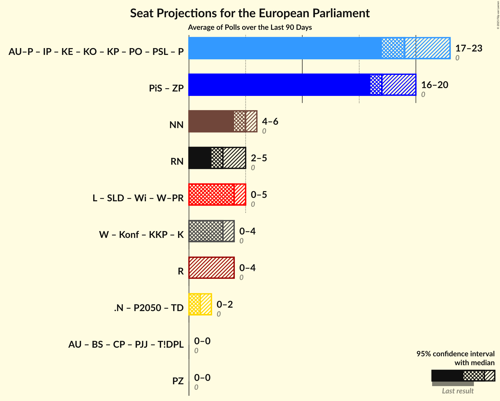

# Overview

The table below lists the most recent polls (less than 90 days old) registered and analyzed so far.

| Period     | Polling firm/Commissioner(s) | PiS | PO | K | .N | PSL | SLD | W | R |
|:----------:|:----------------------------:|:--:|:--:|:--:|:--:|:--:|:--:|:--:|:--:|
| 25 May 2014 | General Election | 0.0%   0 | 0.0%   0 | 0.0%   0 | 0.0%   0 | 0.0%   0 | 0.0%   0 | 0.0%   0 | 0.0%   0 |
| N/A | [Poll Average](average.html) | 32–44%   19–26 | 15–30%   8–18 | 5–10%   0–6 | 2–6%   0–3 | 2–7%   0–4 | 4–11%   0–6 | 1–5%   0 | 0–4%   0 |
| [8–9 August 2018](2018-08-09-Estymator.html) | Estymator   DoRzeczy.pl | 39–45%   22–26 | 23–29%   13–17 | 7–10%   3–5 | 3–6%   0–3 | 5–8%   0–4 | 8–11%   4–6 | 1–2%   0 | 1–3%   0 |
| [11–12 July 2018](2018-07-12-InstytutBadańPollster.html) | Instytut Badań Pollster   Super Express | 37–43%   22–26 | 24–30%   14–17 | 7–11%   4–6 | 4–6%   0–3 | 5–8%   0–4 | 6–10%   3–5 | 1–3%   0 | 2–4%   0 |
| [6–11 July 2018](2018-07-11-KantarPublic.html) | Kantar Public | 31–37%   18–22 | 21–26%   12–15 | 7–11%   4–6 | 2–4%   0 | 3–5%   0–3 | 5–8%   0–4 | 1–2%   0 | 1–3%   0 |
| [8–9 July 2018](2018-07-09-IBRiS.html) | IBRiS   Rzeczpospolita | 35–40%   20–24 | 24–29%   13–17 | 4–7%   0–4 | 2–4%   0 | 4–7%   0–3 | 8–12%   4–6 | N/A   N/A | 2–3%   0 |
| [28 June–5 July 2018](2018-07-05-CBOS.html) | CBOS | 37–43%   21–25 | 14–18%   8–10 | 6–10%   3–5 | 4–7%   0–3 | 2–4%   0 | 6–9%   3–5 | 1–3%   0 | 0–1%   0 |
| [28–29 May 2018](2018-05-29-KantarMillwardBrown.html) | Kantar Millward Brown   TVN and TVN24 | 33–39%   19–25 | 25–31%   15–20 | 5–8%   0–4 | 4–7%   0–4 | 3–5%   0–3 | 4–7%   0–4 | 3–5%   0–3 | 1–3%   0 |
| 25 May 2014 | General Election | 0.0%   0 | 0.0%   0 | 0.0%   0 | 0.0%   0 | 0.0%   0 | 0.0%   0 | 0.0%   0 | 0.0%   0 |

Only polls for which at least the sample size has been published are included in the table above.

**Legend:**
+ **Top half of each row:** Voting intentions (95% confidence interval)
+ **Bottom half of each row:** Seat projections for the European Parliament (95% confidence interval)
+ **PiS:** Prawo i Sprawiedliwość (ECR)
+ **PO:** Platforma Obywatelska (EPP)
+ **K:** Kukiz’15 (*)
+ **.N:** .Nowoczesna (ALDE)
+ **PSL:** Polskie Stronnictwo Ludowe (EPP)
+ **SLD:** Sojusz Lewicy Demokratycznej (S&D)
+ **W:** Wolność (EFDD)
+ **R:** Partia Razem (*)
+ **N/A (single party):** Party not included the published results
+ **N/A (entire row):** Calculation for this opinion poll not started yet

