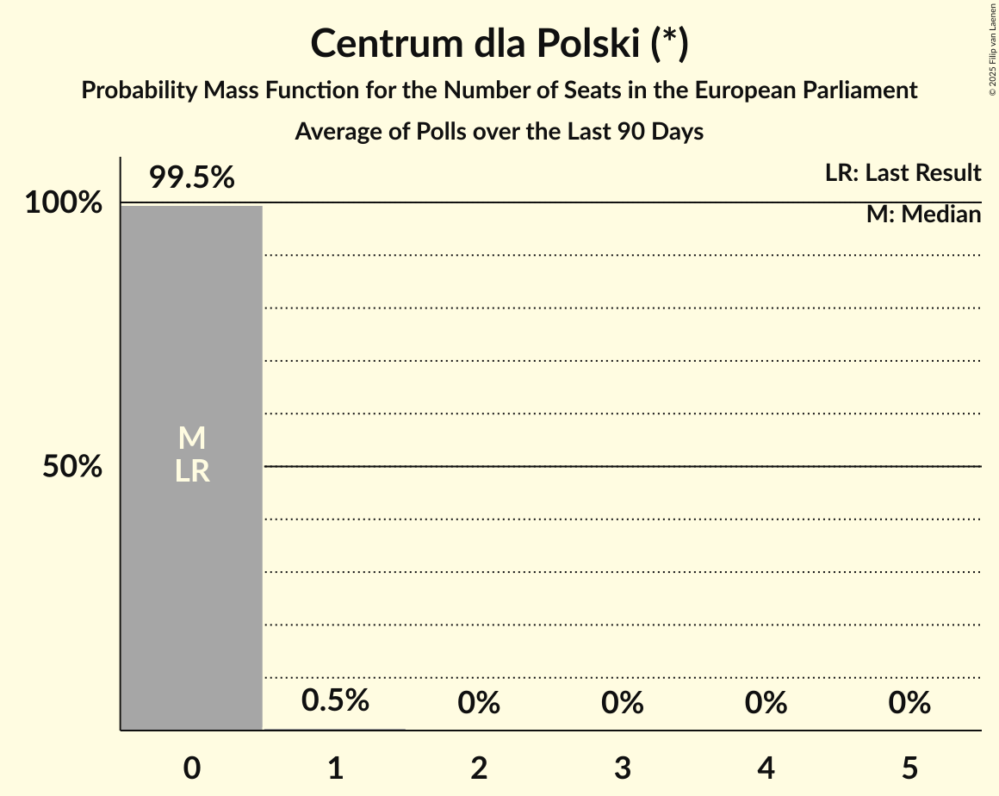

# Centrum dla Polski (*)

<a href="#voting-intentions">Voting Intentions</a> | <a href="#seats">Seats</a>

## Voting Intentions

Last result: **0.0%** (General Election of 9 June 2024)

### Confidence Intervals

| Period     | Polling firm/Commissioner(s) | Median | 80% Confidence Interval | 90% Confidence Interval | 95% Confidence Interval | 99% Confidence Interval |
|:----------:|:----------------:|:-----------:|:-----------------------:|:-----------------------:|:-----------------------:|:-----------------------:|
| N/A | [Poll Average](average.html) | 0.5% | 0.3–0.9% | 0.3–1.0% | 0.2–1.1% | 0.1–1.3% |
| [13–16 September 2024](2024-09-16-ResearchPartner.html) | Research Partner   Ariadna | 0.5% | 0.3–0.9% | 0.2–1.0% | 0.2–1.1% | 0.1–1.4% |
| [9–10 September 2024](2024-09-10-IBRiS.html) | IBRiS   Wydarzenia Polsat | 0.6% | N/A | N/A | N/A | N/A |
| [30–31 August 2024](2024-08-31-IBRiS.html) | IBRiS   Rzeczpospolita | 0.6% | N/A | N/A | N/A | N/A |
| [5–8 August 2024](2024-08-08-Opinia24.html) | Opinia24 | 0.6% | N/A | N/A | N/A | N/A |
| [8 August 2024](2024-08-08-InstytutBadańPollster.html) | Instytut Badań Pollster   Super Express | 0.5% | N/A | N/A | N/A | N/A |
| [26–28 July 2024](2024-07-28-UnitedSurveys.html) | United Surveys   WP.pl | 0.6% | N/A | N/A | N/A | N/A |
| [24–25 July 2024](2024-07-25-IBRiS.html) | IBRiS   Onet.pl | 0.5% | N/A | N/A | N/A | N/A |
| [19–22 July 2024](2024-07-22-ResearchPartner.html) | Research Partner   Ariadna | 0.5% | N/A | N/A | N/A | N/A |
| [8–11 July 2024](2024-07-11-Opinia24.html) | Opinia24 | 0.6% | N/A | N/A | N/A | N/A |
| [8–9 July 2024](2024-07-09-InstytutBadańPollster.html) | Instytut Badań Pollster   Super Express | 0.5% | N/A | N/A | N/A | N/A |
| [5–8 July 2024](2024-07-08-UnitedSurveys.html) | United Surveys   WP.pl | 0.5% | N/A | N/A | N/A | N/A |
| [21–23 June 2024](2024-06-23-UnitedSurveys.html) | United Surveys   WP.pl | 0.6% | N/A | N/A | N/A | N/A |
| [21–22 June 2024](2024-06-22-IBRiS.html) | IBRiS   Rzeczpospolita | 0.5% | N/A | N/A | N/A | N/A |
| [23–21 June 2024](2024-06-21-UnitedSurveys.html) | United Surveys   WP.pl | 0.6% | N/A | N/A | N/A | N/A |
| [18–19 June 2024](2024-06-19-IBRiS.html) | IBRiS   Onet.pl | 0.5% | N/A | N/A | N/A | N/A |
| [10–11 June 2024](2024-06-11-Opinia24.html) | Opinia24 | 0.4% | N/A | N/A | N/A | N/A |

### Probability Mass Function

The following table shows the probability mass function per percentage block of voting intentions for the [poll average](average.html) for Centrum dla Polski (*).

| Voting Intentions | Probability | Accumulated | Special Marks |
|:-----------------:|:-----------:|:-----------:|:-------------:|
| 0.0–0.5% | 51% | 100% | Last Result |
| 0.5–1.5% | 49% | 49% | Median |
| 1.5–2.5% | 0.1% | 0.1% |  |
| 2.5–3.5% | 0% | 0% |  |

## Seats

Last result: **0** seats (General Election of 9 June 2024)

### Confidence Intervals

| Period     | Polling firm/Commissioner(s) | Median | 80% Confidence Interval | 90% Confidence Interval | 95% Confidence Interval | 99% Confidence Interval |
|:----------:|:----------------:|:------:|:-----------------------:|:-----------------------:|:-----------------------:|:-----------------------:|
| N/A | [Poll Average](average.html) | 0 | 0 | 0 | 0 | 0 |
| [13–16 September 2024](2024-09-16-ResearchPartner.html) | Research Partner   Ariadna | 0 | 0 | 0 | 0 | 0 |
| [9–10 September 2024](2024-09-10-IBRiS.html) | IBRiS   Wydarzenia Polsat |  |  |  |  |  |
| [30–31 August 2024](2024-08-31-IBRiS.html) | IBRiS   Rzeczpospolita |  |  |  |  |  |
| [5–8 August 2024](2024-08-08-Opinia24.html) | Opinia24 |  |  |  |  |  |
| [8 August 2024](2024-08-08-InstytutBadańPollster.html) | Instytut Badań Pollster   Super Express |  |  |  |  |  |
| [26–28 July 2024](2024-07-28-UnitedSurveys.html) | United Surveys   WP.pl |  |  |  |  |  |
| [24–25 July 2024](2024-07-25-IBRiS.html) | IBRiS   Onet.pl |  |  |  |  |  |
| [19–22 July 2024](2024-07-22-ResearchPartner.html) | Research Partner   Ariadna |  |  |  |  |  |
| [8–11 July 2024](2024-07-11-Opinia24.html) | Opinia24 |  |  |  |  |  |
| [8–9 July 2024](2024-07-09-InstytutBadańPollster.html) | Instytut Badań Pollster   Super Express |  |  |  |  |  |
| [5–8 July 2024](2024-07-08-UnitedSurveys.html) | United Surveys   WP.pl |  |  |  |  |  |
| [21–23 June 2024](2024-06-23-UnitedSurveys.html) | United Surveys   WP.pl |  |  |  |  |  |
| [21–22 June 2024](2024-06-22-IBRiS.html) | IBRiS   Rzeczpospolita |  |  |  |  |  |
| [23–21 June 2024](2024-06-21-UnitedSurveys.html) | United Surveys   WP.pl |  |  |  |  |  |
| [18–19 June 2024](2024-06-19-IBRiS.html) | IBRiS   Onet.pl |  |  |  |  |  |
| [10–11 June 2024](2024-06-11-Opinia24.html) | Opinia24 |  |  |  |  |  |

### Probability Mass Function

The following table shows the probability mass function per seat for the [poll average](average.html) for Centrum dla Polski (*).

| Number of Seats | Probability | Accumulated | Special Marks |
|:---------------:|:-----------:|:-----------:|:-------------:|
| 0 | 99.7% | 100% | Last Result, Median |
| 1 | 0.3% | 0.3% |  |
| 2 | 0% | 0% |  |

