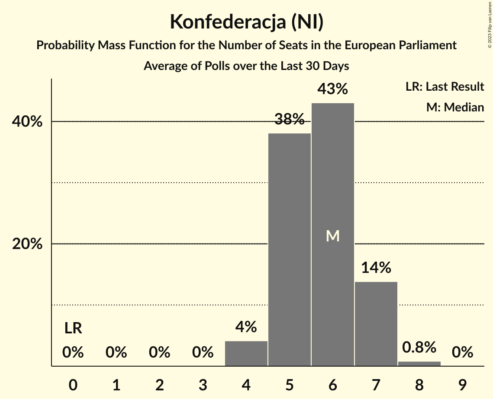

# Konfederacja (NI)

<a href="#voting-intentions">Voting Intentions</a> | <a href="#seats">Seats</a>

## Voting Intentions

Last result: **0.0%** (General Election of 26 May 2019)

### Confidence Intervals

| Period     | Polling firm/Commissioner(s) | Median | 80% Confidence Interval | 90% Confidence Interval | 95% Confidence Interval | 99% Confidence Interval |
|:----------:|:----------------:|:-----------:|:-----------------------:|:-----------------------:|:-----------------------:|:-----------------------:|
| N/A | [Poll Average](average.html) | 8.4% | 6.7–10.1% | 6.3–10.5% | 5.9–10.9% | 5.4–11.6% |
| [4–7 September 2020](2020-09-07-SocialChanges.html) | Social Changes   wPolityce.pl | 9.0% | 8.0–10.3% | 7.7–10.6% | 7.5–10.9% | 7.0–11.5% |
| [4–5 September 2020](2020-09-05-IBRiS.html) | IBRiS   WP.pl | 8.4% | 7.4–9.5% | 7.1–9.9% | 6.9–10.2% | 6.4–10.7% |
| [28–31 August 2020](2020-08-31-SocialChanges.html) | Social Changes   wPolityce.pl | 8.0% | 7.0–9.1% | 6.7–9.5% | 6.5–9.8% | 6.1–10.3% |
| [21–24 August 2020](2020-08-24-SocialChanges.html) | Social Changes   wPolityce.pl | 9.0% | 8.0–10.3% | 7.7–10.6% | 7.5–10.9% | 7.0–11.5% |
| [14–17 August 2020](2020-08-17-SocialChanges.html) | Social Changes   wPolityce.pl | 9.0% | 8.0–10.2% | 7.7–10.6% | 7.4–10.9% | 7.0–11.5% |
| [13–14 August 2020](2020-08-14-Estymator.html) | Estymator   DoRzeczy.pl | 8.5% | 7.5–9.7% | 7.2–10.1% | 7.0–10.4% | 6.5–11.0% |
| [7–10 August 2020](2020-08-10-SocialChanges.html) | Social Changes   wPolityce.pl | 8.0% | 7.0–9.1% | 6.7–9.5% | 6.5–9.8% | 6.1–10.3% |
| [6–7 August 2020](2020-08-07-IBRiS.html) | IBRiS   WP.pl | 6.7% | 5.8–7.8% | 5.6–8.1% | 5.4–8.4% | 5.0–8.9% |
| [31 July–3 August 2020](2020-08-03-SocialChanges.html) | Social Changes   wPolityce.pl | 8.0% | 7.0–9.1% | 6.7–9.4% | 6.5–9.7% | 6.1–10.3% |
| [29 July 2020](2020-07-29-IBRiS.html) | IBRiS   KO | 6.0% | 5.2–7.0% | 4.9–7.3% | 4.7–7.6% | 4.4–8.1% |
| [24–27 July 2020](2020-07-27-SocialChanges.html) | Social Changes   wPolityce.pl | 9.0% | 8.0–10.3% | 7.7–10.6% | 7.5–10.9% | 7.0–11.5% |
| [24–25 July 2020](2020-07-25-IBRiS.html) | IBRiS   WP.pl | 9.3% | 8.2–10.5% | 7.9–10.8% | 7.7–11.1% | 7.2–11.8% |
| [23–24 July 2020](2020-07-24-Estymator.html) | Estymator   DoRzeczy.pl | 8.8% | 7.8–10.0% | 7.5–10.4% | 7.2–10.7% | 6.8–11.3% |
| [17–20 July 2020](2020-07-20-SocialChanges.html) | Social Changes   wPolityce.pl | 11.0% | 9.8–12.3% | 9.5–12.7% | 9.2–13.0% | 8.7–13.6% |
| [18 July 2020](2020-07-18-UnitedSurveys.html) | United Surveys   RMF | 8.7% | 7.7–9.9% | 7.4–10.3% | 7.2–10.5% | 6.7–11.1% |
| [17–18 July 2020](2020-07-18-IBRiS.html) | IBRiS   Onet | 8.0% | 7.0–9.1% | 6.8–9.5% | 6.5–9.8% | 6.1–10.3% |
| [26–27 June 2020](2020-06-27-SocialChanges.html) | Social Changes   wPolityce.pl | 9.0% | 7.9–10.2% | 7.7–10.6% | 7.4–10.9% | 6.9–11.5% |
| [25–26 June 2020](2020-06-26-IBSP.html) | IBSP | 9.7% | 8.6–11.0% | 8.3–11.3% | 8.1–11.6% | 7.6–12.2% |
| [15–25 June 2020](2020-06-25-CBOS.html) | CBOS | 6.0% | 5.3–6.9% | 5.1–7.2% | 4.9–7.4% | 4.5–7.9% |
| [19–23 June 2020](2020-06-23-SocialChanges.html) | Social Changes   wPolityce.pl | 8.0% | 7.0–9.1% | 6.7–9.5% | 6.5–9.8% | 6.1–10.3% |
| [22–23 June 2020](2020-06-23-IPSOS.html) | IPSOS   OKO | 9.9% | 8.8–11.2% | 8.5–11.6% | 8.2–11.9% | 7.7–12.6% |
| [18–19 June 2020](2020-06-19-Estymator.html) | Estymator   DoRzeczy.pl | 7.6% | 6.6–8.7% | 6.3–9.1% | 6.1–9.4% | 5.7–10.0% |
| [16–17 June 2020](2020-06-17-InstytutBadańPollster.html) | Instytut Badań Pollster   SE.pl | 8.8% | 7.8–10.0% | 7.5–10.4% | 7.2–10.7% | 6.8–11.3% |
| [12–16 June 2020](2020-06-16-SocialChanges.html) | Social Changes   wPolityce.pl | 8.0% | 7.0–9.1% | 6.7–9.5% | 6.5–9.8% | 6.1–10.4% |
| [15–16 June 2020](2020-06-16-IPSOS.html) | IPSOS   OKO | 10.0% | 8.9–11.3% | 8.6–11.7% | 8.3–12.0% | 7.8–12.7% |
| [5–10 June 2020](2020-06-10-KantarPublic.html) | Kantar Public | 7.1% | 6.2–8.3% | 5.9–8.6% | 5.7–8.9% | 5.2–9.5% |
| [9–10 June 2020](2020-06-10-InstytutBadańPollster.html) | Instytut Badań Pollster   SE.pl | 9.7% | 8.6–11.0% | 8.4–11.3% | 8.1–11.6% | 7.6–12.3% |
| [5–9 June 2020](2020-06-09-SocialChanges.html) | Social Changes   wPolityce.pl | 8.0% | 7.1–9.2% | 6.8–9.5% | 6.6–9.8% | 6.1–10.4% |
| [8 June 2020](2020-06-08-KantarPublic.html) | Kantar Public   PO | 10.0% | 8.9–11.3% | 8.6–11.7% | 8.3–12.0% | 7.8–12.7% |
| [3–4 June 2020](2020-06-04-Estymator.html) | Estymator   DoRzeczy.pl | 7.2% | 6.3–8.4% | 6.0–8.7% | 5.8–9.0% | 5.4–9.6% |
| [22 May–4 June 2020](2020-06-04-CBOS.html) | CBOS | 6.0% | 5.2–6.9% | 5.0–7.2% | 4.8–7.4% | 4.5–7.8% |
| [29 May–2 June 2020](2020-06-02-SocialChanges.html) | Social Changes   wPolityce.pl | 9.0% | 7.9–10.2% | 7.7–10.6% | 7.4–10.9% | 6.9–11.5% |
| [29 May 2020](2020-05-29-IBRiS.html) | IBRiS   Rzeczpospolita | 7.5% | 6.6–8.7% | 6.3–9.0% | 6.1–9.3% | 5.7–9.8% |
| [26–27 May 2020](2020-05-27-InstytutBadańPollster.html) | Instytut Badań Pollster   SE.pl | 9.5% | 8.5–10.8% | 8.2–11.2% | 7.9–11.5% | 7.4–12.1% |
| [22–25 May 2020](2020-05-25-SocialChanges.html) | Social Changes   wPolityce.pl | 9.0% | 8.0–10.2% | 7.7–10.6% | 7.4–10.9% | 6.9–11.5% |
| [22–23 May 2020](2020-05-23-IBRiS.html) | IBRiS   WP.pl | 6.6% | 5.8–7.7% | 5.5–8.0% | 5.3–8.3% | 4.9–8.8% |
| [21–22 May 2020](2020-05-22-Estymator.html) | Estymator   DoRzeczy.pl | 6.6% | 5.8–7.7% | 5.5–8.0% | 5.3–8.3% | 4.9–8.8% |
| [18–19 May 2020](2020-05-19-KantarPublic.html) | Kantar Public | 11.0% | 9.8–12.4% | 9.5–12.8% | 9.2–13.2% | 8.6–13.9% |
| [11–18 May 2020](2020-05-18-SocialChanges.html) | Social Changes   wPolityce.pl | 7.0% | 6.1–8.1% | 5.8–8.4% | 5.6–8.7% | 5.2–9.2% |
| [15–17 May 2020](2020-05-17-InstytutBadańPollster.html) | Instytut Badań Pollster | 9.0% | 8.0–10.2% | 7.7–10.5% | 7.4–10.9% | 7.0–11.5% |
| [14–15 May 2020](2020-05-15-Estymator.html) | Estymator   DoRzeczy.pl | 8.9% | 7.8–10.1% | 7.5–10.5% | 7.3–10.8% | 6.8–11.4% |
| [12–14 May 2020](2020-05-14-SocialChanges.html) | Social Changes   wPolityce.pl | 9.0% | 7.9–10.2% | 7.7–10.5% | 7.4–10.8% | 6.9–11.4% |
| [14 May 2020](2020-05-14-KantarPublic.html) | Kantar Public   KO | 9.7% | 8.6–11.0% | 8.3–11.4% | 8.0–11.7% | 7.5–12.3% |
| [8–9 May 2020](2020-05-09-IBRiS.html) | IBRiS   Onet | 8.7% | 7.7–9.9% | 7.4–10.3% | 7.2–10.5% | 6.7–11.1% |
| [8 May 2020](2020-05-08-KantarPublic.html) | Kantar Public   KO | 8.9% | 7.8–10.2% | 7.5–10.5% | 7.3–10.8% | 6.8–11.5% |
| [6–7 May 2020](2020-05-07-SocialChanges.html) | Social Changes   wPolityce.pl | 10.0% | 8.9–11.2% | 8.6–11.6% | 8.3–11.9% | 7.8–12.6% |
| [30 April–4 May 2020](2020-05-04-InstytutBadańPollster.html) | Instytut Badań Pollster   SE.pl | 9.4% | 8.3–10.6% | 8.0–10.9% | 7.8–11.2% | 7.3–11.9% |
| [4 May 2020](2020-05-04-IBRiS.html) | IBRiS   ZET | 8.7% | 7.7–9.9% | 7.4–10.3% | 7.2–10.5% | 6.7–11.1% |
| [27–29 April 2020](2020-04-29-IPSOS.html) | IPSOS   OKO | 8.0% | 7.0–9.2% | 6.7–9.5% | 6.5–9.8% | 6.0–10.4% |
| [24–27 April 2020](2020-04-27-SocialChanges.html) | Social Changes   wPolityce.pl | 9.0% | 7.9–10.2% | 7.7–10.5% | 7.4–10.8% | 6.9–11.4% |
| [23–24 April 2020](2020-04-24-Estymator.html) | Estymator   DoRzeczy.pl | 7.2% | 6.2–8.3% | 6.0–8.6% | 5.7–8.9% | 5.3–9.5% |
| [17–20 April 2020](2020-04-20-SocialChanges.html) | Social Changes   wPolityce.pl | 10.0% | 8.9–11.2% | 8.6–11.6% | 8.3–11.9% | 7.8–12.6% |
| [16–17 April 2020](2020-04-17-KantarPublic.html) | Kantar Public | 8.0% | 6.9–9.2% | 6.6–9.6% | 6.4–9.9% | 5.9–10.5% |
| [10–13 April 2020](2020-04-13-SocialChanges.html) | Social Changes   wpolityce.pl | 11.0% | 9.9–12.4% | 9.6–12.7% | 9.3–13.1% | 8.8–13.7% |
| [8–9 April 2020](2020-04-09-Estymator.html) | Estymator   DoRzeczy.pl | 5.4% | 4.6–6.4% | 4.3–6.7% | 4.1–6.9% | 3.8–7.5% |
| [6–7 April 2020](2020-04-07-InstytutBadańPollster.html) | Instytut Badań Pollster   SE.pl | 7.7% | 6.7–8.8% | 6.4–9.2% | 6.2–9.5% | 5.8–10.0% |
| [3–6 April 2020](2020-04-06-SocialChanges.html) | Social Changes   wpolityce.pl | 9.0% | 8.0–10.3% | 7.7–10.6% | 7.4–10.9% | 7.0–11.5% |
| [31 March–2 April 2020](2020-04-02-IBSP.html) | IBSP   wp.pl | 9.0% | 7.9–10.2% | 7.6–10.6% | 7.4–10.9% | 6.9–11.6% |
| [27–30 March 2020](2020-03-30-SocialChanges.html) | Social Changes   wpolityce.pl | 8.0% | 7.0–9.2% | 6.8–9.5% | 6.5–9.8% | 6.1–10.4% |
| [25–26 March 2020](2020-03-26-Estymator.html) | Estymator   DoRzeczy.pl | 5.2% | 4.4–6.2% | 4.2–6.5% | 4.0–6.8% | 3.7–7.3% |
| [20–23 March 2020](2020-03-23-SocialChanges.html) | Social Changes   wpolityce.pl | 8.0% | 7.0–9.1% | 6.7–9.5% | 6.5–9.8% | 6.0–10.3% |
| [17–18 March 2020](2020-03-18-InstytutBadańPollster.html) | Instytut Badań Pollster   SE.pl | 8.2% | 7.2–9.3% | 6.9–9.7% | 6.7–10.0% | 6.2–10.6% |
| [13–17 March 2020](2020-03-17-SocialChanges.html) | Social Changes   wpolityce.pl | 6.9% | 6.0–8.0% | 5.8–8.4% | 5.6–8.6% | 5.2–9.2% |
| [5–15 March 2020](2020-03-15-CBOS.html) | CBOS | 7.0% | 6.0–8.2% | 5.7–8.5% | 5.5–8.8% | 5.1–9.4% |
| [10–13 March 2020](2020-03-13-IBSP.html) | IBSP   wp.pl | 9.8% | 8.7–11.1% | 8.4–11.5% | 8.1–11.8% | 7.6–12.4% |
| [12–13 March 2020](2020-03-13-Estymator.html) | Estymator   DoRzeczy.pl | 6.5% | 5.6–7.6% | 5.4–7.9% | 5.2–8.2% | 4.8–8.8% |
| [6–11 March 2020](2020-03-11-KantarPublic.html) | Kantar Public | 5.0% | 4.2–6.0% | 4.0–6.3% | 3.8–6.6% | 3.4–7.1% |
| [6–10 March 2020](2020-03-10-SocialChanges.html) | Social Changes   wpolityce.pl | 7.0% | 6.1–8.1% | 5.8–8.4% | 5.6–8.7% | 5.2–9.2% |
| [28 February–2 March 2020](2020-03-02-SocialChanges.html) | Social Changes   wpolityce.pl | 8.0% | 7.0–9.2% | 6.7–9.5% | 6.5–9.8% | 6.1–10.4% |
| [27–28 February 2020](2020-02-28-Estymator.html) | Estymator   DoRzeczy.pl | 6.2% | 5.3–7.3% | 5.1–7.6% | 4.9–7.9% | 4.5–8.4% |
| [24–26 February 2020](2020-02-26-InstytutBadańPollster.html) | Instytut Badań Pollster   SE.pl | 8.3% | 7.3–9.5% | 7.0–9.8% | 6.8–10.1% | 6.4–10.7% |
| [21–24 February 2020](2020-02-24-SocialChanges.html) | Social Changes   wpolityce.pl | 9.0% | 8.0–10.2% | 7.7–10.5% | 7.4–10.9% | 7.0–11.4% |
| [20–22 February 2020](2020-02-22-IPSOS.html) | IPSOS   OKO | 8.0% | 7.0–9.2% | 6.7–9.5% | 6.5–9.8% | 6.0–10.4% |
| [18–20 February 2020](2020-02-20-IBSP.html) | IBSP   wp.pl | 9.0% | 7.9–10.3% | 7.6–10.6% | 7.4–10.9% | 6.9–11.6% |
| [14–18 February 2020](2020-02-18-SocialChanges.html) | Social Changes   wpolityce.pl | 9.0% | 8.0–10.3% | 7.7–10.6% | 7.4–10.9% | 7.0–11.5% |
| [6–16 February 2020](2020-02-16-CBOS.html) | CBOS | 6.0% | 5.2–7.1% | 4.9–7.4% | 4.7–7.7% | 4.3–8.2% |
| [12–13 February 2020](2020-02-13-Estymator.html) | Estymator   DoRzeczy.pl | 6.4% | 5.5–7.5% | 5.3–7.9% | 5.1–8.1% | 4.7–8.7% |
| [7–12 February 2020](2020-02-12-KantarPublic.html) | Kantar Public   TVN | 4.0% | 3.3–5.0% | 3.1–5.2% | 3.0–5.5% | 2.7–5.9% |
| [7–11 February 2020](2020-02-11-SocialChanges.html) | Social Changes   wpolityce.pl | 8.0% | 7.0–9.2% | 6.8–9.5% | 6.5–9.8% | 6.1–10.4% |
| [7–8 February 2020](2020-02-08-IBRiS.html) | IBRiS   DoRzeczy.pl | 6.9% | 6.0–8.0% | 5.8–8.3% | 5.5–8.6% | 5.2–9.1% |
| [1–4 February 2020](2020-02-04-SocialChanges.html) | Social Changes   wpolityce.pl | 7.0% | 6.1–8.1% | 5.9–8.5% | 5.7–8.7% | 5.2–9.3% |
| [29–30 January 2020](2020-01-30-KantarPublic.html) | Kantar Public   TVN | 7.0% | 5.9–8.5% | 5.5–8.9% | 5.3–9.3% | 4.8–10.1% |
| [23–27 January 2020](2020-01-27-SocialChanges.html) | Social Changes   wpolityce.pl | 7.0% | 6.1–8.1% | 5.8–8.4% | 5.6–8.7% | 5.2–9.2% |
| [24–25 January 2020](2020-01-25-IBRiS.html) | IBRiS   Radio ZET | 6.0% | 5.2–7.0% | 4.9–7.3% | 4.7–7.6% | 4.4–8.1% |
| [23–24 January 2020](2020-01-24-Estymator.html) | Estymator   DoRzeczy.pl | 5.9% | 4.9–7.3% | 4.6–7.7% | 4.4–8.0% | 3.9–8.7% |
| [22–23 January 2020](2020-01-23-InstytutBadańPollster.html) | Instytut Badań Pollster   SE.pl | 8.5% | 7.5–9.7% | 7.2–10.0% | 7.0–10.3% | 6.6–10.9% |
| [17–21 January 2020](2020-01-21-SocialChanges.html) | Social Changes   wpolityce.pl | 8.0% | 7.0–9.1% | 6.7–9.5% | 6.5–9.8% | 6.0–10.4% |
| [14–16 January 2020](2020-01-16-InstytutBadańPollster.html) | Instytut Badań Pollster   SE.pl | 8.1% | 7.1–9.3% | 6.8–9.6% | 6.6–9.9% | 6.2–10.5% |
| [14–16 January 2020](2020-01-16-IBSP.html) | IBSP   wpolityce.pl | 9.7% | 8.6–11.0% | 8.3–11.4% | 8.0–11.7% | 7.5–12.3% |
| [9–16 January 2020](2020-01-16-CBOS.html) | CBOS | 5.6% | 4.7–6.8% | 4.5–7.1% | 4.3–7.4% | 3.9–8.0% |
| [9–15 January 2020](2020-01-15-KantarPublic.html) | Kantar Public   TVN | 3.0% | 2.3–4.0% | 2.1–4.3% | 2.0–4.6% | 1.7–5.1% |
| [10–14 January 2020](2020-01-14-SocialChanges.html) | Social Changes   wpolityce.pl | 8.0% | 7.1–9.2% | 6.8–9.6% | 6.5–9.8% | 6.1–10.4% |
| [10–11 January 2020](2020-01-11-IBRiS.html) | IBRiS   Radio ZET | 5.0% | 4.3–6.0% | 4.0–6.2% | 3.9–6.5% | 3.5–7.0% |
| [9–10 January 2020](2020-01-10-Estymator.html) | Estymator   DoRzeczy.pl | 6.3% | 5.3–7.7% | 5.0–8.1% | 4.7–8.5% | 4.3–9.2% |
| [3–7 January 2020](2020-01-07-SocialChanges.html) | Social Changes   wpolityce.pl | 8.0% | 7.0–9.2% | 6.8–9.6% | 6.5–9.9% | 6.1–10.5% |
| [27–31 December 2019](2019-12-31-SocialChanges.html) | Social Changes   wpolityce.pl | 9.0% | 8.0–10.3% | 7.7–10.6% | 7.4–10.9% | 7.0–11.5% |
| [20–24 December 2019](2019-12-24-SocialChanges.html) | Social Changes   wpolityce.pl | 9.0% | 8.0–10.2% | 7.7–10.6% | 7.4–10.9% | 6.9–11.5% |
| [20–22 December 2019](2019-12-22-InstytutBadańPollster.html) | Instytut Badań Pollster | 8.0% | 7.0–9.2% | 6.8–9.5% | 6.5–9.8% | 6.1–10.4% |
| [22 December 2019](2019-12-22-IBSP.html) | IBSP | 9.8% | 8.7–11.1% | 8.4–11.5% | 8.1–11.8% | 7.6–12.5% |
| [19–20 December 2019](2019-12-20-IBRiS.html) | IBRiS   Radio ZET | 6.8% | 5.9–7.9% | 5.7–8.2% | 5.5–8.5% | 5.1–9.0% |
| [19–20 December 2019](2019-12-20-Estymator.html) | Estymator   DoRzeczy.pl | 6.6% | 5.5–8.0% | 5.2–8.4% | 4.9–8.8% | 4.5–9.5% |
| [17–18 December 2019](2019-12-18-KantarPublic.html) | Kantar Public   TVN | 6.9% | 5.7–8.5% | 5.4–8.9% | 5.2–9.3% | 4.6–10.0% |
| [13–17 December 2019](2019-12-17-SocialChanges.html) | Social Changes   wpolityce.pl | 7.0% | 6.1–8.1% | 5.8–8.4% | 5.6–8.7% | 5.2–9.3% |
| [6–11 December 2019](2019-12-11-KantarPublic.html) | Kantar Public   WO | 7.0% | 5.9–8.5% | 5.5–8.9% | 5.3–9.3% | 4.8–10.0% |
| [6–10 December 2019](2019-12-10-SocialChanges.html) | Social Changes   wpolityce.pl | 8.0% | 7.0–9.2% | 6.7–9.5% | 6.5–9.8% | 6.1–10.4% |
| [6–7 December 2019](2019-12-07-IBRiS.html) | IBRiS   Radio ZET | 8.4% | 7.4–9.5% | 7.1–9.9% | 6.9–10.2% | 6.4–10.7% |
| [28 November–5 December 2019](2019-12-05-CBOS.html) | CBOS | 6.7% | 5.8–7.8% | 5.5–8.2% | 5.3–8.5% | 4.9–9.0% |
| [28 November–3 December 2019](2019-12-03-SocialChanges.html) | Social Changes   wpolityce.pl | 9.0% | 8.0–10.3% | 7.7–10.7% | 7.4–11.0% | 7.0–11.6% |
| [29–30 November 2019](2019-11-30-KantarPublic.html) | Kantar Public   PO | 12.0% | 10.8–13.4% | 10.4–13.8% | 10.1–14.2% | 9.6–14.9% |
| [27 November 2019](2019-11-27-InstytutBadańPollster.html) | Instytut Badań Pollster   Super Express | 8.4% | 7.4–9.6% | 7.1–10.0% | 6.8–10.3% | 6.4–10.9% |
| [22–26 November 2019](2019-11-26-SocialChanges.html) | Social Changes   wpolityce.pl | 6.0% | 5.1–7.0% | 4.9–7.3% | 4.7–7.6% | 4.3–8.1% |
| [22–23 November 2019](2019-11-23-IBRiS.html) | IBRiS   Radio ZET | 6.2% | 5.3–7.2% | 5.1–7.5% | 4.9–7.8% | 4.5–8.3% |
| [15–20 November 2019](2019-11-20-KantarPublic.html) | Kantar Public | 6.0% | 5.1–7.1% | 4.8–7.4% | 4.6–7.7% | 4.3–8.2% |
| [15–19 November 2019](2019-11-19-SocialChanges.html) | Social Changes   wpolityce.pl | 9.0% | 8.0–10.3% | 7.7–10.6% | 7.4–11.0% | 7.0–11.6% |
| [7–17 November 2019](2019-11-17-CBOS.html) | CBOS | 6.0% | 5.2–7.1% | 4.9–7.4% | 4.7–7.7% | 4.3–8.2% |
| [8–12 November 2019](2019-11-12-SocialChanges.html) | Social Changes   wpolityce.pl | 8.0% | 7.0–9.2% | 6.7–9.5% | 6.5–9.8% | 6.0–10.4% |
| [5–12 November 2019](2019-11-12-KantarPublic.html) | Kantar Public   TVN | 9.0% | 8.1–10.0% | 7.8–10.3% | 7.6–10.5% | 7.2–11.1% |
| [5–6 November 2019](2019-11-06-InstytutBadańPollster.html) | Instytut Badań Pollster   Super Express | 5.7% | 4.9–6.7% | 4.7–7.0% | 4.5–7.3% | 4.1–7.8% |
| [1–5 November 2019](2019-11-05-SocialChanges.html) | Social Changes   wpolityce.pl | 7.0% | 6.1–8.1% | 5.8–8.4% | 5.6–8.7% | 5.2–9.3% |
| [31 October–4 November 2019](2019-11-04-CBMIndicator.html) | CBM Indicator   TVP | 6.2% | 5.3–7.3% | 5.1–7.6% | 4.9–7.9% | 4.5–8.4% |
| [25–30 October 2019](2019-10-30-SocialChanges.html) | Social Changes   wpolityce.pl | 8.3% | 7.3–9.5% | 7.0–9.8% | 6.7–10.1% | 6.3–10.7% |
| [21–23 October 2019](2019-10-23-Ipsos.html) | Ipsos   OKO | 7.0% | 6.0–8.1% | 5.8–8.4% | 5.5–8.7% | 5.1–9.3% |
| [18–19 October 2019](2019-10-19-IBRiS.html) | IBRiS   Radio ZET | 6.5% | 5.7–7.6% | 5.4–7.9% | 5.2–8.2% | 4.8–8.7% |
| [11–16 October 2019](2019-10-16-KantarPublic.html) | Kantar Public   TVN | 7.0% | 6.1–8.2% | 5.8–8.5% | 5.6–8.8% | 5.1–9.4% |
| [10–11 October 2019](2019-10-11-IBSP.html) | IBSP | 8.6% | 7.5–9.8% | 7.2–10.2% | 7.0–10.5% | 6.5–11.1% |
| [11 October 2019](2019-10-11-IBRiS.html) | IBRiS   RMF | 4.7% | 4.0–5.7% | 3.8–5.9% | 3.6–6.2% | 3.3–6.6% |
| [4–10 October 2019](2019-10-10-SocialChanges.html) | Social Changes   wpolityce.pl | 6.0% | 5.2–7.1% | 4.9–7.4% | 4.7–7.7% | 4.3–8.2% |
| [9–10 October 2019](2019-10-10-KantarPublic.html) | Kantar Public   TVN | 7.0% | 6.2–7.9% | 6.0–8.2% | 5.8–8.4% | 5.4–8.9% |
| [9–10 October 2019](2019-10-10-InstytutBadańPollster.html) | Instytut Badań Pollster   Super Express | 4.7% | 4.0–5.7% | 3.8–5.9% | 3.6–6.2% | 3.3–6.7% |
| [9–10 October 2019](2019-10-10-Estymator.html) | Estymator   DoRzeczy.pl | 4.9% | 4.1–5.9% | 3.9–6.1% | 3.7–6.4% | 3.4–6.9% |
| [3–10 October 2019](2019-10-10-CBOS.html) | CBOS | 6.0% | 5.2–7.1% | 4.9–7.4% | 4.7–7.7% | 4.3–8.2% |
| [9–10 October 2019](2019-10-10-CBMIndicator.html) | CBM Indicator   TVP | 5.2% | 4.4–6.2% | 4.2–6.5% | 4.0–6.8% | 3.6–7.3% |
| [9 October 2019](2019-10-09-IBRiS.html) | IBRiS   Radio ZET | 4.3% | 3.6–5.2% | 3.4–5.4% | 3.2–5.6% | 2.9–6.1% |
| [8 October 2019](2019-10-08-IBRiS.html) | IBRiS   Onet | 3.5% | 2.9–4.4% | 2.7–4.6% | 2.6–4.8% | 2.3–5.2% |
| [1–5 October 2019](2019-10-05-KantarMillwardBrown.html) | Kantar Millward Brown   Gazeta Wyborcza, Gazeta.pl and TOK FM | 5.0% | 4.2–6.0% | 4.0–6.2% | 3.8–6.5% | 3.4–7.0% |
| [4–5 October 2019](2019-10-05-IBRiS.html) | IBRiS   RMF | 3.8% | 3.2–4.7% | 3.0–4.9% | 2.8–5.1% | 2.5–5.6% |
| [3–4 October 2019](2019-10-04-Estymator.html) | Estymator   DoRzeczy.pl | 3.7% | 3.1–4.6% | 2.9–4.9% | 2.7–5.1% | 2.5–5.6% |
| [30 September–4 October 2019](2019-10-04-DobraOpinia.html) | Dobra Opinia   PPG | 4.2% | 3.9–4.5% | 3.8–4.6% | 3.8–4.7% | 3.6–4.8% |
| [2–3 October 2019](2019-10-03-IBRiS.html) | IBRiS   Onet | 3.6% | 3.0–4.5% | 2.8–4.7% | 2.7–4.9% | 2.4–5.3% |
| [27 September–2 October 2019](2019-10-02-SocialChanges.html) | Social Changes   wpolityce.pl | 5.5% | 4.7–6.5% | 4.4–6.8% | 4.2–7.1% | 3.9–7.6% |
| [1–2 October 2019](2019-10-02-InstytutBadańPollster.html) | Instytut Badań Pollster   Super Express | 4.8% | 4.0–5.7% | 3.8–6.0% | 3.7–6.2% | 3.3–6.7% |
| [2 October 2019](2019-10-02-IBRiS.html) | IBRiS   Radio ZET | 4.4% | 3.7–5.3% | 3.5–5.5% | 3.3–5.7% | 3.0–6.2% |
| [25–26 September 2019](2019-09-26-KantarPublic.html) | Kantar Public   TVN | 7.0% | 6.0–8.1% | 5.8–8.4% | 5.5–8.7% | 5.1–9.3% |
| [20–25 September 2019](2019-09-25-SocialChanges.html) | Social Changes   wpolityce.pl | 5.9% | 5.0–6.9% | 4.8–7.2% | 4.6–7.5% | 4.2–8.0% |
| [24–25 September 2019](2019-09-25-InstytutBadańPollster.html) | Instytut Badań Pollster   Super Express | 5.0% | 4.2–5.9% | 4.0–6.2% | 3.9–6.4% | 3.5–6.9% |
| [23–25 September 2019](2019-09-25-CBMIndicator.html) | CBM Indicator   TVP | 4.1% | 3.4–5.0% | 3.2–5.3% | 3.0–5.5% | 2.7–6.0% |
| [20–21 September 2019](2019-09-21-IBRiS.html) | IBRiS   RMF | 4.4% | 3.7–5.3% | 3.5–5.5% | 3.3–5.7% | 3.0–6.2% |
| [17–19 September 2019](2019-09-19-Estymator.html) | Estymator   DoRzeczy.pl | 3.6% | 3.0–4.5% | 2.8–4.7% | 2.6–5.0% | 2.3–5.4% |
| [12–19 September 2019](2019-09-19-CBOS.html) | CBOS | 3.0% | 2.4–3.9% | 2.3–4.1% | 2.1–4.3% | 1.9–4.7% |
| [13–18 September 2019](2019-09-18-SocialChanges.html) | Social Changes   wpolityce.pl | 7.5% | 6.5–8.7% | 6.2–9.0% | 6.0–9.3% | 5.6–9.9% |
| [13–17 September 2019](2019-09-17-KantarMillwardBrown.html) | Kantar Millward Brown   Gazeta Wyborcza | 5.0% | 4.2–6.0% | 4.0–6.3% | 3.8–6.5% | 3.5–7.1% |
| [12–14 September 2019](2019-09-14-IBSP.html) | IBSP | 6.3% | 5.4–7.4% | 5.2–7.7% | 5.0–8.0% | 4.6–8.6% |
| [12–13 September 2019](2019-09-13-InstytutBadańPollster.html) | Instytut Badań Pollster   Super Express | 5.0% | 4.2–6.0% | 4.0–6.2% | 3.8–6.5% | 3.5–7.0% |
| [6–11 September 2019](2019-09-11-SocialChanges.html) | Social Changes   wpolityce.pl | 4.2% | 3.5–5.1% | 3.3–5.4% | 3.1–5.6% | 2.8–6.1% |
| [6–11 September 2019](2019-09-11-KantarPublic.html) | Kantar Public   TVN | 2.1% | 1.6–2.8% | 1.4–3.0% | 1.3–3.2% | 1.1–3.5% |
| [6–7 September 2019](2019-09-07-IBRiS.html) | IBRiS   Rzeczpospolita | 3.4% | 2.8–4.3% | 2.6–4.5% | 2.4–4.7% | 2.2–5.2% |
| [4–6 September 2019](2019-09-06-InstytutBadańPollster.html) | Instytut Badań Pollster   Super Express | 4.0% | 3.4–4.9% | 3.2–5.2% | 3.0–5.4% | 2.7–5.8% |
| [4–5 September 2019](2019-09-05-Estymator.html) | Estymator   DoRzeczy.pl | 3.9% | 3.2–4.8% | 3.0–5.0% | 2.8–5.2% | 2.5–5.7% |
| [30 August–4 September 2019](2019-09-04-SocialChanges.html) | Social Changes   wpolityce.pl | 5.0% | 4.2–6.0% | 4.0–6.2% | 3.8–6.5% | 3.5–7.0% |
| [24 August–4 September 2019](2019-09-04-IBRiS.html) | IBRiS   Onet | 4.8% | 4.5–5.2% | 4.4–5.2% | 4.4–5.3% | 4.2–5.5% |
| [23–29 August 2019](2019-08-29-DobraOpinia.html) | Dobra Opinia   PPG | 4.0% | 3.7–4.3% | 3.6–4.4% | 3.6–4.5% | 3.5–4.6% |
| [22–29 August 2019](2019-08-29-CBOS.html) | CBOS | 2.3% | 1.8–3.1% | 1.7–3.3% | 1.6–3.5% | 1.4–3.8% |
| [23–28 August 2019](2019-08-28-SocialChanges.html) | Social Changes   wpolityce.pl | 5.3% | 4.5–6.3% | 4.2–6.6% | 4.0–6.8% | 3.7–7.3% |
| [26–28 August 2019](2019-08-28-Ipsos.html) | Ipsos   OKO | 5.0% | 4.2–6.0% | 4.0–6.2% | 3.8–6.5% | 3.4–7.0% |
| [26 August 2019](2019-08-26-IBRiS.html) | IBRiS   Onet | 4.7% | 4.0–5.7% | 3.8–5.9% | 3.6–6.2% | 3.3–6.6% |
| [24–26 August 2019](2019-08-26-CBMIndicator.html) | CBM Indicator   TVP | 3.1% | 2.5–3.9% | 2.3–4.2% | 2.2–4.4% | 1.9–4.8% |
| [23–24 August 2019](2019-08-24-IBRiS.html) | IBRiS   RMF | 5.3% | 4.5–6.2% | 4.3–6.5% | 4.1–6.8% | 3.7–7.3% |
| [22 August 2019](2019-08-22-KantarPublic.html) | Kantar Public   TVN | 6.0% | 5.2–7.1% | 4.9–7.4% | 4.7–7.7% | 4.3–8.2% |
| [21–22 August 2019](2019-08-22-Estymator.html) | Estymator   DoRzeczy.pl | 3.8% | 3.2–4.7% | 3.0–5.0% | 2.8–5.2% | 2.5–5.6% |
| [16–21 August 2019](2019-08-21-SocialChanges.html) | Social Changes | 4.5% | 3.7–5.4% | 3.5–5.7% | 3.4–5.9% | 3.0–6.4% |
| [16–20 August 2019](2019-08-20-Ariadna.html) | Ariadna | 4.0% | 3.3–4.8% | 3.1–5.1% | 2.9–5.3% | 2.6–5.8% |
| [13 August 2019](2019-08-13-KantarPublic.html) | Kantar Public   TVN | 5.0% | 4.2–6.0% | 4.0–6.3% | 3.8–6.5% | 3.5–7.0% |
| [9–10 August 2019](2019-08-10-IBRiS.html) | IBRiS   Rzeczpospolita | 2.8% | 2.3–3.6% | 2.1–3.8% | 2.0–4.0% | 1.8–4.4% |
| [6–8 August 2019](2019-08-08-Estymator.html) | Estymator   DoRzeczy.pl | 0.0% | N/A | N/A | N/A | N/A |
| [2–7 August 2019](2019-08-07-SocialChanges.html) | Social Changes | 0.0% | N/A | N/A | N/A | N/A |
| [6–7 August 2019](2019-08-07-InstytutBadańPollster.html) | Instytut Badań Pollster   Super Express | 0.0% | N/A | N/A | N/A | N/A |
| [26–31 July 2019](2019-07-31-SocialChanges.html) | Social Changes | 0.0% | N/A | N/A | N/A | N/A |
| [26–27 July 2019](2019-07-27-IBRiS.html) | IBRiS   RMF | 0.0% | N/A | N/A | N/A | N/A |
| [19–24 July 2019](2019-07-24-SocialChanges.html) | Social Changes | 0.0% | N/A | N/A | N/A | N/A |
| [18–19 July 2019](2019-07-19-Estymator.html) | Estymator   DoRzeczy.pl | 0.0% | N/A | N/A | N/A | N/A |
| [12–17 July 2019](2019-07-17-SocialChanges.html) | Social Changes | 0.0% | N/A | N/A | N/A | N/A |
| [12–17 July 2019](2019-07-17-KantarPublic.html) | Kantar Public   Radio ZET | 0.0% | N/A | N/A | N/A | N/A |
| [12–15 July 2019](2019-07-15-KantarMillwardBrown.html) | Kantar Millward Brown   TVN and TVN24 | 0.0% | N/A | N/A | N/A | N/A |
| [12–13 July 2019](2019-07-13-IBRiS.html) | IBRiS   Rzeczpospolita | 0.0% | N/A | N/A | N/A | N/A |
| [4–11 July 2019](2019-07-11-CBOS.html) | CBOS | 0.0% | N/A | N/A | N/A | N/A |
| [5–10 July 2019](2019-07-10-SocialChanges.html) | Social Changes | 0.0% | N/A | N/A | N/A | N/A |
| [28–29 June 2019](2019-06-29-IBRiS.html) | IBRiS   RMF | 0.0% | N/A | N/A | N/A | N/A |
| [21–26 June 2019](2019-06-26-SocialChanges.html) | Social Changes | 0.0% | N/A | N/A | N/A | N/A |
| [19–20 June 2019](2019-06-20-Estymator.html) | Estymator   DoRzeczy.pl | 0.0% | N/A | N/A | N/A | N/A |
| [6–13 June 2019](2019-06-13-CBOS.html) | CBOS | 0.0% | N/A | N/A | N/A | N/A |
| [7–8 June 2019](2019-06-08-IBRiS.html) | IBRiS   Rzeczpospolita | 0.0% | N/A | N/A | N/A | N/A |
| [31 May–5 June 2019](2019-06-05-SocialChanges.html) | Social Changes | 0.0% | N/A | N/A | N/A | N/A |
| [24–29 May 2019](2019-05-29-SocialChanges.html) | Social Changes | 0.0% | N/A | N/A | N/A | N/A |

### Probability Mass Function

The following table shows the probability mass function per percentage block of voting intentions for the [poll average](average.html) for Konfederacja (NI).

| Voting Intentions | Probability | Accumulated | Special Marks |
|:-----------------:|:-----------:|:-----------:|:-------------:|
| 0.0–0.5% | 0% | 100% | Last Result |
| 0.5–1.5% | 0% | 100% |  |
| 1.5–2.5% | 0% | 100% |  |
| 2.5–3.5% | 0% | 100% |  |
| 3.5–4.5% | 0% | 100% |  |
| 4.5–5.5% | 0.8% | 100% |  |
| 5.5–6.5% | 8% | 99.2% |  |
| 6.5–7.5% | 17% | 92% |  |
| 7.5–8.5% | 28% | 74% | Median |
| 8.5–9.5% | 27% | 46% |  |
| 9.5–10.5% | 14% | 19% |  |
| 10.5–11.5% | 4% | 5% |  |
| 11.5–12.5% | 0.6% | 0.6% |  |
| 12.5–13.5% | 0% | 0% |  |

## Seats

Last result: **0** seats (General Election of 26 May 2019)

### Confidence Intervals

| Period     | Polling firm/Commissioner(s) | Median | 80% Confidence Interval | 90% Confidence Interval | 95% Confidence Interval | 99% Confidence Interval |
|:----------:|:----------------:|:------:|:-----------------------:|:-----------------------:|:-----------------------:|:-----------------------:|
| N/A | [Poll Average](average.html) | 4 | 3–5 | 3–5 | 3–5 | 2–6 |
| [4–7 September 2020](2020-09-07-SocialChanges.html) | Social Changes   wPolityce.pl | 5 | 4–5 | 4–5 | 4–6 | 3–6 |
| [4–5 September 2020](2020-09-05-IBRiS.html) | IBRiS   WP.pl | 4 | 4–5 | 3–5 | 3–5 | 3–5 |
| [28–31 August 2020](2020-08-31-SocialChanges.html) | Social Changes   wPolityce.pl | 4 | 3–5 | 3–5 | 3–5 | 3–5 |
| [21–24 August 2020](2020-08-24-SocialChanges.html) | Social Changes   wPolityce.pl | 5 | 4–5 | 4–5 | 4–6 | 3–6 |
| [14–17 August 2020](2020-08-17-SocialChanges.html) | Social Changes   wPolityce.pl | 5 | 4–5 | 4–5 | 4–6 | 3–6 |
| [13–14 August 2020](2020-08-14-Estymator.html) | Estymator   DoRzeczy.pl | 4 | 4–5 | 3–5 | 3–5 | 3–6 |
| [7–10 August 2020](2020-08-10-SocialChanges.html) | Social Changes   wPolityce.pl | 4 | 4–5 | 3–5 | 3–5 | 3–6 |
| [6–7 August 2020](2020-08-07-IBRiS.html) | IBRiS   WP.pl | 3 | 3–4 | 3–4 | 2–4 | 0–5 |
| [31 July–3 August 2020](2020-08-03-SocialChanges.html) | Social Changes   wPolityce.pl | 4 | 3–5 | 3–5 | 3–5 | 3–5 |
| [29 July 2020](2020-07-29-IBRiS.html) | IBRiS   KO | 3 | 2–3 | 0–4 | 0–4 | 0–4 |
| [24–27 July 2020](2020-07-27-SocialChanges.html) | Social Changes   wPolityce.pl | 5 | 4–5 | 4–5 | 4–6 | 3–6 |
| [24–25 July 2020](2020-07-25-IBRiS.html) | IBRiS   WP.pl | 5 | 4–5 | 4–6 | 4–6 | 3–6 |
| [23–24 July 2020](2020-07-24-Estymator.html) | Estymator   DoRzeczy.pl | 4 | 4–5 | 4–5 | 3–5 | 3–6 |
| [17–20 July 2020](2020-07-20-SocialChanges.html) | Social Changes   wPolityce.pl | 6 | 5–7 | 5–7 | 5–7 | 4–7 |
| [18 July 2020](2020-07-18-UnitedSurveys.html) | United Surveys   RMF | 4 | 4–5 | 4–5 | 3–5 | 3–6 |
| [17–18 July 2020](2020-07-18-IBRiS.html) | IBRiS   Onet | 4 | 3–5 | 3–5 | 3–5 | 3–5 |
| [26–27 June 2020](2020-06-27-SocialChanges.html) | Social Changes   wPolityce.pl | 5 | 4–5 | 4–5 | 4–6 | 3–6 |
| [25–26 June 2020](2020-06-26-IBSP.html) | IBSP | 5 | 4–5 | 4–6 | 4–6 | 4–6 |
| [15–25 June 2020](2020-06-25-CBOS.html) | CBOS | 3 | 2–3 | 2–4 | 0–4 | 0–4 |
| [19–23 June 2020](2020-06-23-SocialChanges.html) | Social Changes   wPolityce.pl | 4 | 3–5 | 3–5 | 3–5 | 3–5 |
| [22–23 June 2020](2020-06-23-IPSOS.html) | IPSOS   OKO | 5 | 4–6 | 4–6 | 4–6 | 4–6 |
| [18–19 June 2020](2020-06-19-Estymator.html) | Estymator   DoRzeczy.pl | 4 | 3–4 | 3–4 | 3–5 | 3–5 |
| [16–17 June 2020](2020-06-17-InstytutBadańPollster.html) | Instytut Badań Pollster   SE.pl | 4 | 4–5 | 4–5 | 3–5 | 3–6 |
| [12–16 June 2020](2020-06-16-SocialChanges.html) | Social Changes   wPolityce.pl | 4 | 3–5 | 3–5 | 3–5 | 3–5 |
| [15–16 June 2020](2020-06-16-IPSOS.html) | IPSOS   OKO | 5 | 4–6 | 4–6 | 4–6 | 4–7 |
| [5–10 June 2020](2020-06-10-KantarPublic.html) | Kantar Public | 3 | 3–4 | 3–4 | 3–4 | 2–4 |
| [9–10 June 2020](2020-06-10-InstytutBadańPollster.html) | Instytut Badań Pollster   SE.pl | 5 | 4–6 | 4–6 | 4–6 | 4–6 |
| [5–9 June 2020](2020-06-09-SocialChanges.html) | Social Changes   wPolityce.pl | 4 | 3–5 | 3–5 | 3–5 | 3–5 |
| [8 June 2020](2020-06-08-KantarPublic.html) | Kantar Public   PO | 5 | 4–6 | 4–6 | 4–6 | 4–7 |
| [3–4 June 2020](2020-06-04-Estymator.html) | Estymator   DoRzeczy.pl | 4 | 3–4 | 3–4 | 3–4 | 2–5 |
| [22 May–4 June 2020](2020-06-04-CBOS.html) | CBOS | 3 | 2–3 | 0–4 | 0–4 | 0–4 |
| [29 May–2 June 2020](2020-06-02-SocialChanges.html) | Social Changes   wPolityce.pl | 5 | 4–5 | 4–5 | 4–6 | 3–6 |
| [29 May 2020](2020-05-29-IBRiS.html) | IBRiS   Rzeczpospolita | 4 | 3–4 | 3–4 | 3–5 | 3–5 |
| [26–27 May 2020](2020-05-27-InstytutBadańPollster.html) | Instytut Badań Pollster   SE.pl | 5 | 4–5 | 4–6 | 4–6 | 4–6 |
| [22–25 May 2020](2020-05-25-SocialChanges.html) | Social Changes   wPolityce.pl | 5 | 4–5 | 4–5 | 4–6 | 3–6 |
| [22–23 May 2020](2020-05-23-IBRiS.html) | IBRiS   WP.pl | 3 | 3–4 | 3–4 | 2–4 | 0–4 |
| [21–22 May 2020](2020-05-22-Estymator.html) | Estymator   DoRzeczy.pl | 3 | 3–4 | 3–4 | 2–4 | 0–4 |
| [18–19 May 2020](2020-05-19-KantarPublic.html) | Kantar Public | 6 | 5–6 | 5–7 | 5–7 | 4–7 |
| [11–18 May 2020](2020-05-18-SocialChanges.html) | Social Changes   wPolityce.pl | 3 | 3–4 | 3–4 | 3–4 | 2–5 |
| [15–17 May 2020](2020-05-17-InstytutBadańPollster.html) | Instytut Badań Pollster | 5 | 4–5 | 4–5 | 4–6 | 3–6 |
| [14–15 May 2020](2020-05-15-Estymator.html) | Estymator   DoRzeczy.pl | 4 | 4–5 | 4–5 | 4–5 | 3–6 |
| [12–14 May 2020](2020-05-14-SocialChanges.html) | Social Changes   wPolityce.pl | 5 | 4–5 | 4–5 | 4–6 | 3–6 |
| [14 May 2020](2020-05-14-KantarPublic.html) | Kantar Public   KO | 5 | 4–6 | 4–6 | 4–6 | 4–6 |
| [8–9 May 2020](2020-05-09-IBRiS.html) | IBRiS   Onet | 4 | 4–5 | 4–5 | 3–5 | 3–6 |
| [8 May 2020](2020-05-08-KantarPublic.html) | Kantar Public   KO | 4 | 4–5 | 4–5 | 4–5 | 3–6 |
| [6–7 May 2020](2020-05-07-SocialChanges.html) | Social Changes   wPolityce.pl | 5 | 4–6 | 4–6 | 4–6 | 4–6 |
| [30 April–4 May 2020](2020-05-04-InstytutBadańPollster.html) | Instytut Badań Pollster   SE.pl | 5 | 4–5 | 4–6 | 4–6 | 4–6 |
| [4 May 2020](2020-05-04-IBRiS.html) | IBRiS   ZET | 4 | 4–5 | 4–5 | 3–5 | 3–6 |
| [27–29 April 2020](2020-04-29-IPSOS.html) | IPSOS   OKO | 4 | 3–5 | 3–5 | 3–5 | 3–5 |
| [24–27 April 2020](2020-04-27-SocialChanges.html) | Social Changes   wPolityce.pl | 4 | 4–5 | 4–5 | 4–6 | 3–6 |
| [23–24 April 2020](2020-04-24-Estymator.html) | Estymator   DoRzeczy.pl | 3 | 3–4 | 3–4 | 3–4 | 2–5 |
| [17–20 April 2020](2020-04-20-SocialChanges.html) | Social Changes   wPolityce.pl | 5 | 4–6 | 4–6 | 4–6 | 4–6 |
| [16–17 April 2020](2020-04-17-KantarPublic.html) | Kantar Public | 4 | 3–5 | 3–5 | 3–5 | 3–5 |
| [10–13 April 2020](2020-04-13-SocialChanges.html) | Social Changes   wpolityce.pl | 6 | 5–6 | 5–7 | 5–7 | 4–7 |
| [8–9 April 2020](2020-04-09-Estymator.html) | Estymator   DoRzeczy.pl | 2 | 0–3 | 0–3 | 0–3 | 0–4 |
| [6–7 April 2020](2020-04-07-InstytutBadańPollster.html) | Instytut Badań Pollster   SE.pl | 4 | 3–4 | 3–5 | 3–5 | 3–5 |
| [3–6 April 2020](2020-04-06-SocialChanges.html) | Social Changes   wpolityce.pl | 4 | 4–5 | 4–5 | 4–5 | 3–6 |
| [31 March–2 April 2020](2020-04-02-IBSP.html) | IBSP   wp.pl | 4 | 4–5 | 4–5 | 4–5 | 3–6 |
| [27–30 March 2020](2020-03-30-SocialChanges.html) | Social Changes   wpolityce.pl | 4 | 3–5 | 3–5 | 3–5 | 3–5 |
| [25–26 March 2020](2020-03-26-Estymator.html) | Estymator   DoRzeczy.pl | 2 | 0–3 | 0–3 | 0–3 | 0–3 |
| [20–23 March 2020](2020-03-23-SocialChanges.html) | Social Changes   wpolityce.pl | 4 | 3–4 | 3–5 | 3–5 | 3–5 |
| [17–18 March 2020](2020-03-18-InstytutBadańPollster.html) | Instytut Badań Pollster   SE.pl | 4 | 3–5 | 3–5 | 3–5 | 3–5 |
| [13–17 March 2020](2020-03-17-SocialChanges.html) | Social Changes   wpolityce.pl | 3 | 3–4 | 3–4 | 3–4 | 2–5 |
| [5–15 March 2020](2020-03-15-CBOS.html) | CBOS | 3 | 3–4 | 3–4 | 2–4 | 2–5 |
| [10–13 March 2020](2020-03-13-IBSP.html) | IBSP   wp.pl | 5 | 4–6 | 4–6 | 4–6 | 4–6 |
| [12–13 March 2020](2020-03-13-Estymator.html) | Estymator   DoRzeczy.pl | 3 | 3–4 | 2–4 | 2–4 | 0–4 |
| [6–11 March 2020](2020-03-11-KantarPublic.html) | Kantar Public | 2 | 0–3 | 0–3 | 0–3 | 0–3 |
| [6–10 March 2020](2020-03-10-SocialChanges.html) | Social Changes   wpolityce.pl | 3 | 3–4 | 3–4 | 3–4 | 2–5 |
| [28 February–2 March 2020](2020-03-02-SocialChanges.html) | Social Changes   wpolityce.pl | 4 | 3–4 | 3–5 | 3–5 | 3–5 |
| [27–28 February 2020](2020-02-28-Estymator.html) | Estymator   DoRzeczy.pl | 3 | 2–3 | 2–4 | 0–4 | 0–4 |
| [24–26 February 2020](2020-02-26-InstytutBadańPollster.html) | Instytut Badań Pollster   SE.pl | 4 | 4–5 | 3–5 | 3–5 | 3–5 |
| [21–24 February 2020](2020-02-24-SocialChanges.html) | Social Changes   wpolityce.pl | 4 | 4–5 | 4–5 | 4–5 | 3–6 |
| [20–22 February 2020](2020-02-22-IPSOS.html) | IPSOS   OKO | 4 | 3–5 | 3–5 | 3–5 | 3–5 |
| [18–20 February 2020](2020-02-20-IBSP.html) | IBSP   wp.pl | 4 | 4–5 | 4–5 | 4–5 | 3–6 |
| [14–18 February 2020](2020-02-18-SocialChanges.html) | Social Changes   wpolityce.pl | 4 | 4–5 | 4–5 | 4–5 | 3–6 |
| [6–16 February 2020](2020-02-16-CBOS.html) | CBOS | 3 | 2–3 | 0–4 | 0–4 | 0–4 |
| [12–13 February 2020](2020-02-13-Estymator.html) | Estymator   DoRzeczy.pl | 3 | 3–4 | 2–4 | 2–4 | 0–4 |
| [7–12 February 2020](2020-02-12-KantarPublic.html) | Kantar Public   TVN | 0 | 0 | 0–2 | 0–3 | 0–3 |
| [7–11 February 2020](2020-02-11-SocialChanges.html) | Social Changes   wpolityce.pl | 4 | 3–5 | 3–5 | 3–5 | 3–5 |
| [7–8 February 2020](2020-02-08-IBRiS.html) | IBRiS   DoRzeczy.pl | 3 | 3–4 | 3–4 | 3–4 | 2–4 |
| [1–4 February 2020](2020-02-04-SocialChanges.html) | Social Changes   wpolityce.pl | 3 | 3–4 | 3–4 | 3–4 | 2–5 |
| [29–30 January 2020](2020-01-30-KantarPublic.html) | Kantar Public   TVN | 4 | 3–4 | 2–4 | 2–5 | 0–5 |
| [23–27 January 2020](2020-01-27-SocialChanges.html) | Social Changes   wpolityce.pl | 3 | 3–4 | 3–4 | 3–4 | 2–5 |
| [24–25 January 2020](2020-01-25-IBRiS.html) | IBRiS   Radio ZET | 3 | 2–3 | 0–4 | 0–4 | 0–4 |
| [23–24 January 2020](2020-01-24-Estymator.html) | Estymator   DoRzeczy.pl | 3 | 0–3 | 0–4 | 0–4 | 0–4 |
| [22–23 January 2020](2020-01-23-InstytutBadańPollster.html) | Instytut Badań Pollster   SE.pl | 4 | 4–5 | 3–5 | 3–5 | 3–5 |
| [17–21 January 2020](2020-01-21-SocialChanges.html) | Social Changes   wpolityce.pl | 4 | 3–5 | 3–5 | 3–5 | 3–5 |
| [14–16 January 2020](2020-01-16-InstytutBadańPollster.html) | Instytut Badań Pollster   SE.pl | 4 | 3–5 | 3–5 | 3–5 | 3–5 |
| [14–16 January 2020](2020-01-16-IBSP.html) | IBSP   wpolityce.pl | 5 | 4–6 | 4–6 | 4–6 | 4–6 |
| [9–16 January 2020](2020-01-16-CBOS.html) | CBOS | 3 | 0–3 | 0–3 | 0–4 | 0–4 |
| [9–15 January 2020](2020-01-15-KantarPublic.html) | Kantar Public   TVN | 0 | 0 | 0 | 0 | 0–2 |
| [10–14 January 2020](2020-01-14-SocialChanges.html) | Social Changes   wpolityce.pl | 4 | 3–5 | 3–5 | 3–5 | 3–5 |
| [10–11 January 2020](2020-01-11-IBRiS.html) | IBRiS   Radio ZET | 2 | 0–3 | 0–3 | 0–3 | 0–3 |
| [9–10 January 2020](2020-01-10-Estymator.html) | Estymator   DoRzeczy.pl | 3 | 2–4 | 0–4 | 0–4 | 0–5 |
| [3–7 January 2020](2020-01-07-SocialChanges.html) | Social Changes   wpolityce.pl | 4 | 3–5 | 3–5 | 3–5 | 3–5 |
| [27–31 December 2019](2019-12-31-SocialChanges.html) | Social Changes   wpolityce.pl | 5 | 4–5 | 4–5 | 4–6 | 3–6 |
| [20–24 December 2019](2019-12-24-SocialChanges.html) | Social Changes   wpolityce.pl | 5 | 4–5 | 4–5 | 4–6 | 3–6 |
| [20–22 December 2019](2019-12-22-InstytutBadańPollster.html) | Instytut Badań Pollster | 4 | 3–5 | 3–5 | 3–5 | 3–5 |
| [22 December 2019](2019-12-22-IBSP.html) | IBSP | 5 | 4–6 | 4–6 | 4–6 | 4–6 |
| [19–20 December 2019](2019-12-20-IBRiS.html) | IBRiS   Radio ZET | 3 | 3–4 | 3–4 | 2–4 | 2–4 |
| [19–20 December 2019](2019-12-20-Estymator.html) | Estymator   DoRzeczy.pl | 3 | 3–4 | 2–4 | 0–4 | 0–5 |
| [17–18 December 2019](2019-12-18-KantarPublic.html) | Kantar Public   TVN | 3 | 3–4 | 2–4 | 2–5 | 0–5 |
| [13–17 December 2019](2019-12-17-SocialChanges.html) | Social Changes   wpolityce.pl | 3 | 3–4 | 3–4 | 3–4 | 2–5 |
| [6–11 December 2019](2019-12-11-KantarPublic.html) | Kantar Public   WO | 3 | 3–4 | 3–4 | 2–5 | 0–5 |
| [6–10 December 2019](2019-12-10-SocialChanges.html) | Social Changes   wpolityce.pl | 4 | 3–5 | 3–5 | 3–5 | 3–5 |
| [6–7 December 2019](2019-12-07-IBRiS.html) | IBRiS   Radio ZET | 4 | 4–5 | 3–5 | 3–5 | 3–5 |
| [28 November–5 December 2019](2019-12-05-CBOS.html) | CBOS | 3 | 3–4 | 2–4 | 2–4 | 0–4 |
| [28 November–3 December 2019](2019-12-03-SocialChanges.html) | Social Changes   wpolityce.pl | 5 | 4–5 | 4–5 | 4–6 | 3–6 |
| [29–30 November 2019](2019-11-30-KantarPublic.html) | Kantar Public   PO | 6 | 5–7 | 5–7 | 5–7 | 5–8 |
| [27 November 2019](2019-11-27-InstytutBadańPollster.html) | Instytut Badań Pollster   Super Express | 4 | 4–5 | 3–5 | 3–5 | 3–5 |
| [22–26 November 2019](2019-11-26-SocialChanges.html) | Social Changes   wpolityce.pl | 3 | 2–3 | 0–4 | 0–4 | 0–4 |
| [22–23 November 2019](2019-11-23-IBRiS.html) | IBRiS   Radio ZET | 3 | 2–3 | 2–4 | 0–4 | 0–4 |
| [15–20 November 2019](2019-11-20-KantarPublic.html) | Kantar Public | 3 | 2–3 | 0–4 | 0–4 | 0–4 |
| [15–19 November 2019](2019-11-19-SocialChanges.html) | Social Changes   wpolityce.pl | 4 | 4–5 | 4–5 | 4–6 | 3–6 |
| [7–17 November 2019](2019-11-17-CBOS.html) | CBOS | 3 | 2–3 | 0–4 | 0–4 | 0–4 |
| [8–12 November 2019](2019-11-12-SocialChanges.html) | Social Changes   wpolityce.pl | 4 | 3–5 | 3–5 | 3–5 | 3–5 |
| [5–12 November 2019](2019-11-12-KantarPublic.html) | Kantar Public   TVN | 5 | 4–5 | 4–5 | 4–5 | 3–6 |
| [5–6 November 2019](2019-11-06-InstytutBadańPollster.html) | Instytut Badań Pollster   Super Express | 3 | 0–3 | 0–3 | 0–4 | 0–4 |
| [1–5 November 2019](2019-11-05-SocialChanges.html) | Social Changes   wpolityce.pl | 3 | 3–4 | 3–4 | 3–4 | 2–5 |
| [31 October–4 November 2019](2019-11-04-CBMIndicator.html) | CBM Indicator   TVP | 3 | 2–3 | 2–4 | 0–4 | 0–4 |
| [25–30 October 2019](2019-10-30-SocialChanges.html) | Social Changes   wpolityce.pl | 4 | 3–5 | 3–5 | 3–5 | 3–5 |
| [21–23 October 2019](2019-10-23-Ipsos.html) | Ipsos   OKO | 3 | 3–4 | 3–4 | 3–4 | 2–5 |
| [18–19 October 2019](2019-10-19-IBRiS.html) | IBRiS   Radio ZET | 3 | 3–4 | 2–4 | 2–4 | 0–4 |
| [11–16 October 2019](2019-10-16-KantarPublic.html) | Kantar Public   TVN | 3 | 3–4 | 3–4 | 3–4 | 2–5 |
| [10–11 October 2019](2019-10-11-IBSP.html) | IBSP | 4 | 4–5 | 3–5 | 3–5 | 3–6 |
| [11 October 2019](2019-10-11-IBRiS.html) | IBRiS   RMF | 0 | 0–3 | 0–3 | 0–3 | 0–3 |
| [4–10 October 2019](2019-10-10-SocialChanges.html) | Social Changes   wpolityce.pl | 3 | 2–3 | 0–4 | 0–4 | 0–4 |
| [9–10 October 2019](2019-10-10-KantarPublic.html) | Kantar Public   TVN | 3 | 3–4 | 3–4 | 3–4 | 3–4 |
| [9–10 October 2019](2019-10-10-InstytutBadańPollster.html) | Instytut Badań Pollster   Super Express | 0 | 0–3 | 0–3 | 0–3 | 0–3 |
| [9–10 October 2019](2019-10-10-Estymator.html) | Estymator   DoRzeczy.pl | 0 | 0–3 | 0–3 | 0–3 | 0–3 |
| [3–10 October 2019](2019-10-10-CBOS.html) | CBOS | 3 | 2–3 | 0–4 | 0–4 | 0–4 |
| [9–10 October 2019](2019-10-10-CBMIndicator.html) | CBM Indicator   TVP | 2 | 0–3 | 0–3 | 0–3 | 0–3 |
| [9 October 2019](2019-10-09-IBRiS.html) | IBRiS   Radio ZET | 0 | 0–2 | 0–2 | 0–3 | 0–3 |
| [8 October 2019](2019-10-08-IBRiS.html) | IBRiS   Onet | 0 | 0 | 0 | 0 | 0–2 |
| [1–5 October 2019](2019-10-05-KantarMillwardBrown.html) | Kantar Millward Brown   Gazeta Wyborcza, Gazeta.pl and TOK FM | 2 | 0–3 | 0–3 | 0–3 | 0–4 |
| [4–5 October 2019](2019-10-05-IBRiS.html) | IBRiS   RMF | 0 | 0 | 0 | 0–2 | 0–3 |
| [3–4 October 2019](2019-10-04-Estymator.html) | Estymator   DoRzeczy.pl | 0 | 0 | 0 | 0–2 | 0–3 |
| [30 September–4 October 2019](2019-10-04-DobraOpinia.html) | Dobra Opinia   PPG | 0 | 0 | 0 | 0 | 0 |
| [2–3 October 2019](2019-10-03-IBRiS.html) | IBRiS   Onet | 0 | 0 | 0 | 0 | 0–2 |
| [27 September–2 October 2019](2019-10-02-SocialChanges.html) | Social Changes   wpolityce.pl | 3 | 0–3 | 0–3 | 0–3 | 0–4 |
| [1–2 October 2019](2019-10-02-InstytutBadańPollster.html) | Instytut Badań Pollster   Super Express | 0 | 0–3 | 0–3 | 0–3 | 0–3 |
| [2 October 2019](2019-10-02-IBRiS.html) | IBRiS   Radio ZET | 0 | 0–2 | 0–3 | 0–3 | 0–3 |
| [25–26 September 2019](2019-09-26-KantarPublic.html) | Kantar Public   TVN | 3 | 3–4 | 3–4 | 3–4 | 2–5 |
| [20–25 September 2019](2019-09-25-SocialChanges.html) | Social Changes   wpolityce.pl | 3 | 0–3 | 0–3 | 0–4 | 0–4 |
| [24–25 September 2019](2019-09-25-InstytutBadańPollster.html) | Instytut Badań Pollster   Super Express | 2 | 0–3 | 0–3 | 0–3 | 0–3 |
| [23–25 September 2019](2019-09-25-CBMIndicator.html) | CBM Indicator   TVP | 0 | 0–2 | 0–2 | 0–3 | 0–3 |
| [20–21 September 2019](2019-09-21-IBRiS.html) | IBRiS   RMF | 0 | 0–2 | 0–3 | 0–3 | 0–3 |
| [17–19 September 2019](2019-09-19-Estymator.html) | Estymator   DoRzeczy.pl | 0 | 0 | 0 | 0 | 0–2 |
| [12–19 September 2019](2019-09-19-CBOS.html) | CBOS | 0 | 0 | 0 | 0 | 0 |
| [13–18 September 2019](2019-09-18-SocialChanges.html) | Social Changes   wpolityce.pl | 4 | 3–4 | 3–4 | 3–5 | 3–5 |
| [13–17 September 2019](2019-09-17-KantarMillwardBrown.html) | Kantar Millward Brown   Gazeta Wyborcza | 2 | 0–3 | 0–3 | 0–3 | 0–3 |
| [12–14 September 2019](2019-09-14-IBSP.html) | IBSP | 3 | 3–4 | 2–4 | 0–4 | 0–4 |
| [12–13 September 2019](2019-09-13-InstytutBadańPollster.html) | Instytut Badań Pollster   Super Express | 2 | 0–3 | 0–3 | 0–3 | 0–3 |
| [6–11 September 2019](2019-09-11-SocialChanges.html) | Social Changes   wpolityce.pl | 0 | 0–2 | 0–2 | 0–3 | 0–3 |
| [6–11 September 2019](2019-09-11-KantarPublic.html) | Kantar Public   TVN | 0 | 0 | 0 | 0 | 0 |
| [6–7 September 2019](2019-09-07-IBRiS.html) | IBRiS   Rzeczpospolita | 0 | 0 | 0 | 0 | 0–2 |
| [4–6 September 2019](2019-09-06-InstytutBadańPollster.html) | Instytut Badań Pollster   Super Express | 0 | 0 | 0–2 | 0–2 | 0–3 |
| [4–5 September 2019](2019-09-05-Estymator.html) | Estymator   DoRzeczy.pl | 0 | 0 | 0 | 0–2 | 0–3 |
| [30 August–4 September 2019](2019-09-04-SocialChanges.html) | Social Changes   wpolityce.pl | 0 | 0–3 | 0–3 | 0–3 | 0–3 |
| [24 August–4 September 2019](2019-09-04-IBRiS.html) | IBRiS   Onet | 0 | 0–2 | 0–2 | 0–2 | 0–3 |
| [23–29 August 2019](2019-08-29-DobraOpinia.html) | Dobra Opinia   PPG | 0 | 0 | 0 | 0 | 0 |
| [22–29 August 2019](2019-08-29-CBOS.html) | CBOS | 0 | 0 | 0 | 0 | 0 |
| [23–28 August 2019](2019-08-28-SocialChanges.html) | Social Changes   wpolityce.pl | 2 | 0–3 | 0–3 | 0–3 | 0–3 |
| [26–28 August 2019](2019-08-28-Ipsos.html) | Ipsos   OKO | 2 | 0–3 | 0–3 | 0–3 | 0–4 |
| [26 August 2019](2019-08-26-IBRiS.html) | IBRiS   Onet | 0 | 0–3 | 0–3 | 0–3 | 0–3 |
| [24–26 August 2019](2019-08-26-CBMIndicator.html) | CBM Indicator   TVP | 0 | 0 | 0 | 0 | 0 |
| [23–24 August 2019](2019-08-24-IBRiS.html) | IBRiS   RMF | 2 | 0–3 | 0–3 | 0–3 | 0–4 |
| [22 August 2019](2019-08-22-KantarPublic.html) | Kantar Public   TVN | 3 | 2–3 | 0–4 | 0–4 | 0–4 |
| [21–22 August 2019](2019-08-22-Estymator.html) | Estymator   DoRzeczy.pl | 0 | 0 | 0 | 0–2 | 0–3 |
| [16–21 August 2019](2019-08-21-SocialChanges.html) | Social Changes | 0 | 0–2 | 0–3 | 0–3 | 0–3 |
| [16–20 August 2019](2019-08-20-Ariadna.html) | Ariadna | 0 | 0 | 0–2 | 0–2 | 0–3 |
| [13 August 2019](2019-08-13-KantarPublic.html) | Kantar Public   TVN | 2 | 0–3 | 0–3 | 0–3 | 0–4 |
| [9–10 August 2019](2019-08-10-IBRiS.html) | IBRiS   Rzeczpospolita | 0 | 0 | 0 | 0 | 0 |
| [6–8 August 2019](2019-08-08-Estymator.html) | Estymator   DoRzeczy.pl |  |  |  |  |  |
| [2–7 August 2019](2019-08-07-SocialChanges.html) | Social Changes |  |  |  |  |  |
| [6–7 August 2019](2019-08-07-InstytutBadańPollster.html) | Instytut Badań Pollster   Super Express |  |  |  |  |  |
| [26–31 July 2019](2019-07-31-SocialChanges.html) | Social Changes |  |  |  |  |  |
| [26–27 July 2019](2019-07-27-IBRiS.html) | IBRiS   RMF |  |  |  |  |  |
| [19–24 July 2019](2019-07-24-SocialChanges.html) | Social Changes |  |  |  |  |  |
| [18–19 July 2019](2019-07-19-Estymator.html) | Estymator   DoRzeczy.pl |  |  |  |  |  |
| [12–17 July 2019](2019-07-17-SocialChanges.html) | Social Changes |  |  |  |  |  |
| [12–17 July 2019](2019-07-17-KantarPublic.html) | Kantar Public   Radio ZET |  |  |  |  |  |
| [12–15 July 2019](2019-07-15-KantarMillwardBrown.html) | Kantar Millward Brown   TVN and TVN24 |  |  |  |  |  |
| [12–13 July 2019](2019-07-13-IBRiS.html) | IBRiS   Rzeczpospolita |  |  |  |  |  |
| [4–11 July 2019](2019-07-11-CBOS.html) | CBOS |  |  |  |  |  |
| [5–10 July 2019](2019-07-10-SocialChanges.html) | Social Changes |  |  |  |  |  |
| [28–29 June 2019](2019-06-29-IBRiS.html) | IBRiS   RMF |  |  |  |  |  |
| [21–26 June 2019](2019-06-26-SocialChanges.html) | Social Changes |  |  |  |  |  |
| [19–20 June 2019](2019-06-20-Estymator.html) | Estymator   DoRzeczy.pl |  |  |  |  |  |
| [6–13 June 2019](2019-06-13-CBOS.html) | CBOS |  |  |  |  |  |
| [7–8 June 2019](2019-06-08-IBRiS.html) | IBRiS   Rzeczpospolita |  |  |  |  |  |
| [31 May–5 June 2019](2019-06-05-SocialChanges.html) | Social Changes |  |  |  |  |  |
| [24–29 May 2019](2019-05-29-SocialChanges.html) | Social Changes |  |  |  |  |  |

### Probability Mass Function

The following table shows the probability mass function per seat for the [poll average](average.html) for Konfederacja (NI).

| Number of Seats | Probability | Accumulated | Special Marks |
|:---------------:|:-----------:|:-----------:|:-------------:|
| 0 | 0.1% | 100% | Last Result |
| 1 | 0% | 99.9% |  |
| 2 | 0.4% | 99.9% |  |
| 3 | 19% | 99.5% |  |
| 4 | 50% | 81% | Median |
| 5 | 28% | 30% |  |
| 6 | 2% | 2% |  |
| 7 | 0% | 0% |  |

