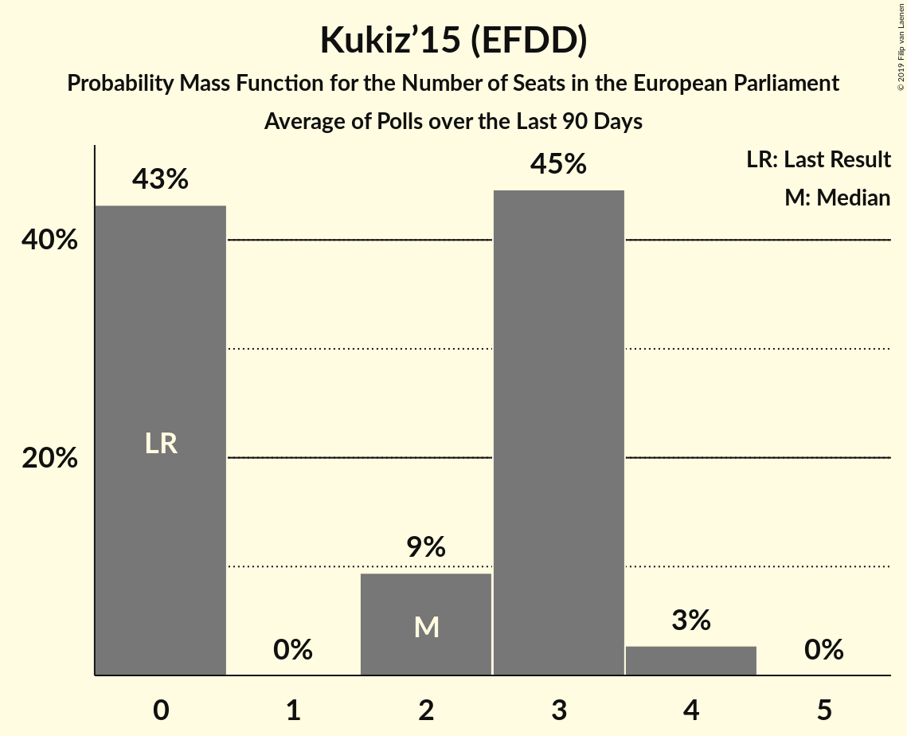

# Kukiz’15 (EFDD)

<a href="#voting-intentions">Voting Intentions</a> | <a href="#seats">Seats</a>

## Voting Intentions

Last result: **0.0%** (General Election of 25 May 2014)

### Confidence Intervals

| Period     | Polling firm/Commissioner(s) | Median | 80% Confidence Interval | 90% Confidence Interval | 95% Confidence Interval | 99% Confidence Interval |
|:----------:|:----------------:|:-----------:|:-----------------------:|:-----------------------:|:-----------------------:|:-----------------------:|
| N/A | [Poll Average](average.html) | 6.1% | 4.7–7.9% | 4.4–8.3% | 4.1–8.7% | 3.7–9.5% |
| [20–21 February 2019](2019-02-21-Estymator.html) | Estymator   DoRzeczy.pl | 7.0% | 6.1–8.2% | 5.8–8.5% | 5.6–8.8% | 5.2–9.3% |
| [14–16 February 2019](2019-02-16-IPSOS.html) | IPSOS   OKO.press | 7.9% | 6.9–9.1% | 6.6–9.4% | 6.4–9.7% | 5.9–10.3% |
| [7–14 February 2019](2019-02-14-CBOS.html) | CBOS | 5.0% | 4.2–6.0% | 4.0–6.3% | 3.8–6.5% | 3.5–7.0% |
| [8–13 February 2019](2019-02-13-KantarPublic.html) | Kantar Public | 6.0% | 5.1–7.1% | 4.8–7.4% | 4.6–7.6% | 4.3–8.2% |
| [8–11 February 2019](2019-02-11-Ariadna.html) | Ariadna   WP | 6.0% | 5.2–7.1% | 4.9–7.4% | 4.7–7.6% | 4.4–8.2% |
| [7–8 February 2019](2019-02-08-IBRiS.html) | IBRiS   Rzeczpospolita | 4.7% | 4.0–5.7% | 3.8–5.9% | 3.6–6.2% | 3.3–6.6% |
| [5–7 February 2019](2019-02-07-Estymator.html) | Estymator   DoRzeczy.pl | 7.4% | 6.4–8.6% | 6.2–8.9% | 6.0–9.2% | 5.5–9.8% |
| [31 January–6 February 2019](2019-02-06-InstytutBadańSprawNarodowościowych.html) | Instytut Badań Spraw Narodowościowych   Radio ZET | 5.8% | 5.0–6.9% | 4.7–7.2% | 4.5–7.4% | 4.1–8.0% |
| [4–5 February 2019](2019-02-05-KantarMillwardBrown.html) | Kantar Millward Brown | 7.0% | 6.0–8.1% | 5.8–8.4% | 5.5–8.7% | 5.1–9.3% |
| [30 January 2019](2019-01-30-InstytutBadańPollster.html) | Instytut Badań Pollster   Super Express | 6.0% | 5.1–7.0% | 4.9–7.3% | 4.7–7.6% | 4.3–8.1% |
| [26–27 January 2019](2019-01-27-IBRiS.html) | IBRiS   Rzeczpospolita | 5.1% | 4.3–6.1% | 4.1–6.3% | 3.9–6.6% | 3.6–7.0% |
| [25–26 January 2019](2019-01-26-IBRiS.html) | IBRiS   Onet | 3.8% | 3.2–4.7% | 3.0–4.9% | 2.8–5.1% | 2.5–5.6% |
| [23–24 January 2019](2019-01-24-Estymator.html) | Estymator   DoRzeczy.pl | 8.6% | 7.5–9.8% | 7.2–10.2% | 7.0–10.5% | 6.5–11.1% |
| [10–17 January 2019](2019-01-17-CBOS.html) | CBOS | 7.0% | 6.1–8.2% | 5.8–8.5% | 5.6–8.8% | 5.1–9.4% |
| [11–16 January 2019](2019-01-16-KantarPublic.html) | Kantar Public | 7.0% | 6.1–8.2% | 5.8–8.5% | 5.6–8.8% | 5.1–9.3% |
| [15–16 January 2019](2019-01-16-KantarMillwardBrown.html) | Kantar Millward Brown   Gazeta Wyborcza | 4.6% | 3.8–5.6% | 3.6–5.8% | 3.5–6.1% | 3.1–6.6% |
| [10–11 January 2019](2019-01-11-InstytutBadańPollster.html) | Instytut Badań Pollster   Super Express | 7.0% | 6.1–8.1% | 5.9–8.4% | 5.7–8.7% | 5.2–9.2% |
| [4 January 2019](2019-01-04-IBRiS.html) | IBRiS   Rzeczpospolita | 5.5% | 4.7–6.4% | 4.5–6.7% | 4.3–7.0% | 3.9–7.5% |
| [13–14 December 2018](2018-12-14-InstytutBadańPollster.html) | Instytut Badań Pollster   Super Express | 7.0% | 6.1–8.1% | 5.9–8.4% | 5.7–8.7% | 5.2–9.2% |
| [12–13 December 2018](2018-12-13-Estymator.html) | Estymator   DoRzeczy.pl | 9.0% | 8.0–10.3% | 7.7–10.6% | 7.4–10.9% | 6.9–11.6% |
| [30 November–11 December 2018](2018-12-11-KantarPublic.html) | Kantar Public | 6.0% | 5.2–7.1% | 4.9–7.4% | 4.7–7.7% | 4.3–8.2% |
| [29 November–9 December 2018](2018-12-09-CBOS.html) | CBOS | 5.0% | 4.2–6.0% | 4.0–6.3% | 3.8–6.6% | 3.5–7.1% |
| [7–8 December 2018](2018-12-08-IBRiS.html) | IBRiS   Rzeczpospolita | 5.7% | 4.9–6.8% | 4.6–7.1% | 4.4–7.3% | 4.1–7.9% |
| [23–24 November 2018](2018-11-24-IBRiS.html) | IBRiS   Onet | 5.2% | 4.4–6.1% | 4.2–6.4% | 4.0–6.7% | 3.7–7.1% |
| [20–21 November 2018](2018-11-21-Estymator.html) | Estymator   DoRzeczy.pl | 11.6% | 10.4–13.0% | 10.0–13.4% | 9.8–13.7% | 9.2–14.4% |
| [19–20 November 2018](2018-11-20-KantarMillwardBrown.html) | Kantar Millward Brown   TVN and TVN24 | 7.0% | 6.1–8.1% | 5.8–8.5% | 5.6–8.7% | 5.1–9.3% |
| [9–15 November 2018](2018-11-15-KantarPublic.html) | Kantar Public | 9.0% | 7.9–10.2% | 7.6–10.6% | 7.4–10.9% | 6.9–11.5% |
| [8–15 November 2018](2018-11-15-CBOS.html) | CBOS | 6.0% | 5.2–7.0% | 4.9–7.3% | 4.7–7.6% | 4.3–8.1% |
| [13 November 2018](2018-11-13-IBRiS.html) | IBRiS   Rzeczpospolita | 5.6% | 4.8–6.6% | 4.6–6.9% | 4.4–7.2% | 4.1–7.7% |
| [8–9 November 2018](2018-11-09-IBRiS.html) | IBRiS   Rzeczpospolita | 4.8% | 4.1–5.8% | 3.9–6.0% | 3.7–6.3% | 3.4–6.7% |
| [29–30 October 2018](2018-10-30-Estymator.html) | Estymator   DoRzeczy.pl | 7.3% | 6.3–8.4% | 6.1–8.8% | 5.8–9.1% | 5.4–9.6% |
| [26–27 October 2018](2018-10-27-IBRiS.html) | IBRiS | 4.7% | 3.9–5.7% | 3.7–6.0% | 3.6–6.2% | 3.2–6.7% |
| [12–17 October 2018](2018-10-17-KantarPublic.html) | Kantar Public | 8.0% | 7.0–9.2% | 6.7–9.5% | 6.5–9.8% | 6.1–10.4% |
| [4–11 October 2018](2018-10-11-CBOS.html) | CBOS | 8.0% | 7.0–9.1% | 6.8–9.4% | 6.5–9.7% | 6.1–10.3% |
| [5–6 October 2018](2018-10-06-IBRiS.html) | IBRiS   Rzeczpospolita | 10.1% | 9.0–11.4% | 8.6–11.8% | 8.4–12.1% | 7.9–12.8% |
| [1 October 2018](2018-10-01-InstytutBadańPollster.html) | Instytut Badań Pollster   Super Express | 9.0% | 8.0–10.3% | 7.7–10.6% | 7.4–10.9% | 7.0–11.6% |
| [22–23 September 2018](2018-09-23-IBRiS.html) | IBRiS   Onet | 10.0% | 8.9–11.3% | 8.6–11.6% | 8.4–11.9% | 7.9–12.5% |
| [20–21 September 2018](2018-09-21-Estymator.html) | Estymator   DoRzeczy.pl | 6.9% | 5.9–8.0% | 5.7–8.3% | 5.5–8.6% | 5.0–9.2% |
| [14–17 September 2018](2018-09-17-KantarMillwardBrown.html) | Kantar Millward Brown   TVN and TVN24 | 4.0% | 3.3–4.9% | 3.1–5.2% | 2.9–5.4% | 2.6–5.9% |
| [6–13 September 2018](2018-09-13-CBOS.html) | CBOS | 7.0% | 6.0–8.1% | 5.8–8.4% | 5.6–8.7% | 5.2–9.2% |
| [7–12 September 2018](2018-09-12-KantarPublic.html) | Kantar Public | 6.0% | 5.1–7.0% | 4.9–7.3% | 4.7–7.6% | 4.3–8.1% |
| [25 August–1 September 2018](2018-09-01-IBRiS.html) | IBRiS   Rzeczpospolita | 7.0% | 6.1–8.2% | 5.8–8.5% | 5.6–8.8% | 5.2–9.3% |
| [22–23 August 2018](2018-08-23-Estymator.html) | Estymator   DoRzeczy.pl | 7.1% | 6.2–8.3% | 5.9–8.6% | 5.7–8.9% | 5.3–9.5% |
| [16–23 August 2018](2018-08-23-CBOS.html) | CBOS | 7.0% | 6.1–8.1% | 5.9–8.4% | 5.6–8.7% | 5.2–9.2% |
| [17–19 August 2018](2018-08-19-IPSOS.html) | IPSOS   OKO.press | 8.0% | 7.0–9.2% | 6.7–9.5% | 6.5–9.8% | 6.0–10.4% |
| [11 August 2018](2018-08-11-KantarPublic.html) | Kantar Public   Gazeta Prawna | 7.0% | 6.1–8.1% | 5.8–8.5% | 5.6–8.7% | 5.2–9.3% |
| [11 August 2018](2018-08-11-IBRiS.html) | IBRiS   Rzeczpospolita | 6.4% | 5.5–7.5% | 5.3–7.8% | 5.0–8.1% | 4.6–8.7% |
| [9–10 August 2018](2018-08-10-InstytutBadańPollster.html) | Instytut Badań Pollster   Super Express | 11.0% | 9.8–12.4% | 9.5–12.7% | 9.3–13.1% | 8.7–13.7% |
| [8–10 August 2018](2018-08-10-CBMIndicator.html) | CBM Indicator   TVP1 | 6.3% | 5.4–7.4% | 5.2–7.7% | 5.0–8.0% | 4.6–8.6% |
| [8–9 August 2018](2018-08-09-Estymator.html) | Estymator   DoRzeczy.pl | 8.2% | 7.1–9.4% | 6.9–9.7% | 6.6–10.0% | 6.2–10.6% |
| [27 July 2018](2018-07-27-IBRiS.html) | IBRiS | 6.6% | 5.7–7.7% | 5.4–8.0% | 5.2–8.3% | 4.8–8.9% |
| [11–12 July 2018](2018-07-12-InstytutBadańPollster.html) | Instytut Badań Pollster   Super Express | 9.0% | 7.9–10.2% | 7.7–10.5% | 7.4–10.8% | 6.9–11.4% |
| [6–11 July 2018](2018-07-11-KantarPublic.html) | Kantar Public | 9.0% | 8.0–10.3% | 7.7–10.6% | 7.4–10.9% | 7.0–11.5% |
| [8–9 July 2018](2018-07-09-IBRiS.html) | IBRiS   Rzeczpospolita | 5.7% | 4.9–6.7% | 4.7–7.0% | 4.5–7.3% | 4.1–7.8% |
| [4–5 July 2018](2018-07-05-InstytutBadańPollster.html) | Instytut Badań Pollster   TVP1 | 8.0% | 7.0–9.1% | 6.7–9.5% | 6.5–9.8% | 6.0–10.3% |
| [28 June–5 July 2018](2018-07-05-CBOS.html) | CBOS | 8.0% | 7.0–9.2% | 6.7–9.6% | 6.5–9.9% | 6.0–10.5% |
| [27–28 June 2018](2018-06-28-Estymator.html) | Estymator   DoRzeczy.pl | 8.9% | 7.8–10.1% | 7.5–10.5% | 7.3–10.8% | 6.8–11.4% |
| [21–22 June 2018](2018-06-22-IBRiS.html) | IBRiS   Onet | 7.5% | 6.6–8.7% | 6.3–9.0% | 6.1–9.3% | 5.7–9.8% |
| [18 June 2018](2018-06-18-InstytutBadańPollster.html) | Instytut Badań Pollster   Super Express | 6.9% | 6.0–8.1% | 5.8–8.4% | 5.5–8.7% | 5.1–9.2% |
| [9–17 June 2018](2018-06-17-KantarPublic.html) | Kantar Public | 6.0% | 5.1–7.0% | 4.9–7.3% | 4.7–7.6% | 4.3–8.1% |
| [13–14 June 2018](2018-06-14-Estymator.html) | Estymator   DoRzeczy.pl | 8.3% | 7.3–9.5% | 7.0–9.9% | 6.8–10.2% | 6.3–10.8% |
| [7–14 June 2018](2018-06-14-CBOS.html) | CBOS | 8.0% | 7.0–9.2% | 6.7–9.5% | 6.5–9.8% | 6.0–10.4% |
| [7–8 June 2018](2018-06-08-IBRiS.html) | IBRiS   Rzeczpospolita | 6.2% | 5.3–7.2% | 5.1–7.5% | 4.9–7.8% | 4.5–8.3% |
| [6–7 June 2018](2018-06-07-InstytutBadańPollster.html) | Instytut Badań Pollster   TVP1 | 8.0% | 7.0–9.2% | 6.8–9.5% | 6.5–9.8% | 6.1–10.4% |
| [28–29 May 2018](2018-05-29-KantarMillwardBrown.html) | Kantar Millward Brown   TVN and TVN24 | 6.0% | 5.1–7.1% | 4.9–7.4% | 4.7–7.7% | 4.3–8.2% |
| [24–25 May 2018](2018-05-25-IBRiS.html) | IBRiS   Onet | 5.2% | 4.4–6.1% | 4.2–6.4% | 4.0–6.7% | 3.7–7.1% |
| [23–24 May 2018](2018-05-24-Estymator.html) | Estymator   DoRzeczy.pl | 10.4% | 9.3–11.8% | 9.0–12.1% | 8.7–12.5% | 8.2–13.1% |
| [10–17 May 2018](2018-05-17-CBOS.html) | CBOS | 10.0% | 8.9–11.2% | 8.7–11.6% | 8.4–11.9% | 7.9–12.5% |
| [11–16 May 2018](2018-05-16-KantarPublic.html) | Kantar Public | 5.0% | 4.3–6.0% | 4.0–6.3% | 3.9–6.6% | 3.5–7.1% |
| [14 May 2018](2018-05-14-Estymator.html) | Estymator   DoRzeczy.pl | 9.8% | 8.7–11.1% | 8.4–11.5% | 8.1–11.8% | 7.6–12.4% |
| [10–11 May 2018](2018-05-11-InstytutBadańPollster.html) | Instytut Badań Pollster   TVP1 | 7.9% | 7.0–9.1% | 6.7–9.4% | 6.5–9.7% | 6.0–10.3% |
| [10–11 May 2018](2018-05-11-IBRiS.html) | IBRiS   Rzeczpospolita | 6.3% | 5.4–7.3% | 5.2–7.6% | 5.0–7.9% | 4.6–8.4% |
| [27–29 April 2018](2018-04-29-InstytutBadańPollster.html) | Instytut Badań Pollster   Nowa TV, se.pl and Super Express | 9.0% | 8.0–10.2% | 7.7–10.5% | 7.4–10.9% | 7.0–11.4% |
| [25–27 April 2018](2018-04-27-InstytutBadańPollster.html) | Instytut Badań Pollster   Nowa TV, se.pl and Super Express | 10.9% | 9.8–12.3% | 9.5–12.7% | 9.2–13.0% | 8.7–13.7% |
| [25–26 April 2018](2018-04-26-KantarMillwardBrown.html) | Kantar Millward Brown   TVN and TVN24 | 5.0% | 4.2–6.0% | 4.0–6.3% | 3.8–6.5% | 3.4–7.0% |
| [25–26 April 2018](2018-04-26-Estymator.html) | Estymator   DoRzeczy.pl | 13.1% | 11.8–14.6% | 11.5–15.0% | 11.2–15.3% | 10.6–16.0% |
| [19 April 2018](2018-04-19-IBRiS.html) | IBRiS   Onet | 9.8% | 8.7–11.1% | 8.4–11.4% | 8.2–11.7% | 7.7–12.3% |
| [12–13 April 2018](2018-04-13-IPSOS.html) | IPSOS   OKO.press | 11.0% | 9.9–12.4% | 9.5–12.8% | 9.3–13.1% | 8.7–13.8% |
| [5–12 April 2018](2018-04-12-CBOS.html) | CBOS | 5.0% | 4.3–5.9% | 4.1–6.2% | 3.9–6.4% | 3.6–6.9% |
| [9–10 April 2018](2018-04-10-KantarPublic.html) | Kantar Public | 6.0% | 5.1–7.1% | 4.9–7.4% | 4.7–7.7% | 4.3–8.2% |
| [6–7 April 2018](2018-04-07-InstytutBadańPollster.html) | Instytut Badań Pollster   TVP1 | 8.0% | 7.0–9.2% | 6.7–9.6% | 6.5–9.8% | 6.1–10.5% |
| [4–5 April 2018](2018-04-05-InstytutBadańPollster.html) | Instytut Badań Pollster   Nowa TV, se.pl and Super Express | 10.0% | 8.9–11.3% | 8.5–11.6% | 8.3–12.0% | 7.8–12.6% |
| [4–5 April 2018](2018-04-05-Estymator.html) | Estymator   DoRzeczy.pl | 8.9% | 8.0–10.1% | 7.7–10.4% | 7.5–10.7% | 7.0–11.2% |
| [4 April 2018](2018-04-04-IBRiS.html) | IBRiS   Rzeczpospolita | 8.5% | 7.5–9.7% | 7.3–10.1% | 7.0–10.3% | 6.6–10.9% |
| [29–30 March 2018](2018-03-30-InstytutBadańPollster.html) | Instytut Badań Pollster   TVP1 | 11.0% | 9.9–12.3% | 9.5–12.7% | 9.3–13.0% | 8.7–13.7% |
| [26–27 March 2018](2018-03-27-KantarMillwardBrown.html) | Kantar Millward Brown   TVN and TVN24 | 10.0% | 8.9–11.3% | 8.6–11.7% | 8.3–12.0% | 7.8–12.7% |
| [21–22 March 2018](2018-03-22-Estymator.html) | Estymator   DoRzeczy.pl | 7.9% | 6.9–9.1% | 6.6–9.4% | 6.4–9.8% | 6.0–10.3% |
| [17 March 2018](2018-03-17-IBRiS.html) | IBRiS   Onet | 6.3% | 5.4–7.4% | 5.2–7.7% | 5.0–8.0% | 4.6–8.6% |
| [9–14 March 2018](2018-03-14-KantarPublic.html) | Kantar Public | 5.1% | 4.3–6.1% | 4.1–6.3% | 3.9–6.6% | 3.5–7.1% |
| [1–8 March 2018](2018-03-08-CBOS.html) | CBOS | 6.0% | 5.2–7.1% | 5.0–7.4% | 4.8–7.6% | 4.4–8.2% |
| [1–2 March 2018](2018-03-02-IBRiS.html) | IBRiS   Rzeczpospolita | 6.8% | 5.9–7.9% | 5.6–8.3% | 5.4–8.5% | 5.0–9.1% |
| [26 February 2018](2018-02-26-IBRiS.html) | IBRiS | 6.6% | 5.8–7.7% | 5.5–8.0% | 5.3–8.3% | 4.9–8.8% |
| [22 February 2018](2018-02-22-InstytutBadańPollster.html) | Instytut Badań Pollster   Nowa TV, se.pl and Super Express | 6.9% | 6.0–8.1% | 5.8–8.4% | 5.5–8.7% | 5.1–9.2% |
| [21–22 February 2018](2018-02-22-Estymator.html) | Estymator   DoRzeczy.pl | 7.3% | 6.4–8.5% | 6.1–8.8% | 5.9–9.1% | 5.5–9.7% |
| [16–21 February 2018](2018-02-21-KantarPublic.html) | Kantar Public | 7.0% | 6.1–8.1% | 5.8–8.4% | 5.6–8.7% | 5.2–9.3% |
| [19–20 February 2018](2018-02-20-KantarMillwardBrown.html) | Kantar Millward Brown   TVN and TVN24 | 6.0% | 5.1–7.1% | 4.9–7.4% | 4.7–7.6% | 4.3–8.2% |
| [20 February 2018](2018-02-20-IBRiS.html) | IBRiS   Onet | 5.5% | 4.8–6.5% | 4.5–6.8% | 4.3–7.1% | 4.0–7.6% |
| [1–8 February 2018](2018-02-08-CBOS.html) | CBOS | 7.2% | 6.3–8.3% | 6.0–8.6% | 5.8–8.9% | 5.4–9.5% |
| [5 February 2018](2018-02-05-IBRiS.html) | IBRiS   Rzeczpospolita | 5.7% | 4.9–6.8% | 4.6–7.1% | 4.4–7.3% | 4.1–7.9% |

### Probability Mass Function

The following table shows the probability mass function per percentage block of voting intentions for the [poll average](average.html) for Kukiz’15 (EFDD).

| Voting Intentions | Probability | Accumulated | Special Marks |
|:-----------------:|:-----------:|:-----------:|:-------------:|
| 0.0–0.5% | 0% | 100% | Last Result |
| 0.5–1.5% | 0% | 100% |  |
| 1.5–2.5% | 0% | 100% |  |
| 2.5–3.5% | 0.3% | 100% |  |
| 3.5–4.5% | 7% | 99.7% |  |
| 4.5–5.5% | 23% | 93% |  |
| 5.5–6.5% | 32% | 69% | Median |
| 6.5–7.5% | 23% | 38% |  |
| 7.5–8.5% | 11% | 15% |  |
| 8.5–9.5% | 3% | 4% |  |
| 9.5–10.5% | 0.4% | 0.4% |  |
| 10.5–11.5% | 0% | 0% |  |

## Seats

Last result: **0** seats (General Election of 25 May 2014)

### Confidence Intervals

| Period     | Polling firm/Commissioner(s) | Median | 80% Confidence Interval | 90% Confidence Interval | 95% Confidence Interval | 99% Confidence Interval |
|:----------:|:----------------:|:------:|:-----------------------:|:-----------------------:|:-----------------------:|:-----------------------:|
| N/A | [Poll Average](average.html) | 3 | 0–4 | 0–4 | 0–4 | 0–5 |
| [20–21 February 2019](2019-02-21-Estymator.html) | Estymator   DoRzeczy.pl | 3 | 3–4 | 3–4 | 3–4 | 2–5 |
| [14–16 February 2019](2019-02-16-IPSOS.html) | IPSOS   OKO.press | 4 | 3–4 | 3–5 | 3–5 | 3–5 |
| [7–14 February 2019](2019-02-14-CBOS.html) | CBOS | 2 | 0–3 | 0–3 | 0–3 | 0–3 |
| [8–13 February 2019](2019-02-13-KantarPublic.html) | Kantar Public | 3 | 2–3 | 0–4 | 0–4 | 0–4 |
| [8–11 February 2019](2019-02-11-Ariadna.html) | Ariadna   WP | 3 | 2–3 | 0–3 | 0–3 | 0–3 |
| [7–8 February 2019](2019-02-08-IBRiS.html) | IBRiS   Rzeczpospolita | 0 | 0–3 | 0–3 | 0–3 | 0–3 |
| [5–7 February 2019](2019-02-07-Estymator.html) | Estymator   DoRzeczy.pl | 4 | 3–4 | 3–4 | 3–5 | 3–5 |
| [31 January–6 February 2019](2019-02-06-InstytutBadańSprawNarodowościowych.html) | Instytut Badań Spraw Narodowościowych   Radio ZET | 3 | 0–3 | 0–4 | 0–4 | 0–4 |
| [4–5 February 2019](2019-02-05-KantarMillwardBrown.html) | Kantar Millward Brown | 3 | 3–4 | 3–4 | 3–4 | 2–5 |
| [30 January 2019](2019-01-30-InstytutBadańPollster.html) | Instytut Badań Pollster   Super Express | 3 | 2–4 | 0–4 | 0–4 | 0–4 |
| [26–27 January 2019](2019-01-27-IBRiS.html) | IBRiS   Rzeczpospolita | 2 | 0–3 | 0–3 | 0–3 | 0–3 |
| [25–26 January 2019](2019-01-26-IBRiS.html) | IBRiS   Onet | 0 | 0 | 0 | 0–3 | 0–3 |
| [23–24 January 2019](2019-01-24-Estymator.html) | Estymator   DoRzeczy.pl | 4 | 4–5 | 4–5 | 3–5 | 3–6 |
| [10–17 January 2019](2019-01-17-CBOS.html) | CBOS | 3 | 3–4 | 3–4 | 3–4 | 2–5 |
| [11–16 January 2019](2019-01-16-KantarPublic.html) | Kantar Public | 3 | 3–4 | 3–4 | 3–4 | 2–5 |
| [15–16 January 2019](2019-01-16-KantarMillwardBrown.html) | Kantar Millward Brown   Gazeta Wyborcza | 0 | 0–3 | 0–3 | 0–3 | 0–3 |
| [10–11 January 2019](2019-01-11-InstytutBadańPollster.html) | Instytut Badań Pollster   Super Express | 4 | 3–4 | 3–4 | 3–5 | 3–5 |
| [4 January 2019](2019-01-04-IBRiS.html) | IBRiS   Rzeczpospolita | 3 | 0–3 | 0–4 | 0–4 | 0–4 |
| [13–14 December 2018](2018-12-14-InstytutBadańPollster.html) | Instytut Badań Pollster   Super Express | 4 | 3–4 | 3–5 | 3–5 | 3–5 |
| [12–13 December 2018](2018-12-13-Estymator.html) | Estymator   DoRzeczy.pl | 5 | 4–5 | 4–6 | 4–6 | 3–6 |
| [30 November–11 December 2018](2018-12-11-KantarPublic.html) | Kantar Public | 3 | 3–4 | 0–4 | 0–4 | 0–4 |
| [29 November–9 December 2018](2018-12-09-CBOS.html) | CBOS | 3 | 0–3 | 0–3 | 0–3 | 0–4 |
| [7–8 December 2018](2018-12-08-IBRiS.html) | IBRiS   Rzeczpospolita | 3 | 0–4 | 0–4 | 0–4 | 0–4 |
| [23–24 November 2018](2018-11-24-IBRiS.html) | IBRiS   Onet | 3 | 0–3 | 0–3 | 0–4 | 0–4 |
| [20–21 November 2018](2018-11-21-Estymator.html) | Estymator   DoRzeczy.pl | 6 | 6–7 | 5–7 | 5–8 | 5–8 |
| [19–20 November 2018](2018-11-20-KantarMillwardBrown.html) | Kantar Millward Brown   TVN and TVN24 | 4 | 3–5 | 3–5 | 3–5 | 3–5 |
| [9–15 November 2018](2018-11-15-KantarPublic.html) | Kantar Public | 5 | 4–5 | 4–6 | 4–6 | 3–6 |
| [8–15 November 2018](2018-11-15-CBOS.html) | CBOS | 3 | 3–4 | 0–4 | 0–4 | 0–4 |
| [13 November 2018](2018-11-13-IBRiS.html) | IBRiS   Rzeczpospolita | 3 | 0–3 | 0–4 | 0–4 | 0–4 |
| [8–9 November 2018](2018-11-09-IBRiS.html) | IBRiS   Rzeczpospolita | 0 | 0–3 | 0–3 | 0–3 | 0–4 |
| [29–30 October 2018](2018-10-30-Estymator.html) | Estymator   DoRzeczy.pl | 4 | 3–4 | 3–5 | 3–5 | 3–5 |
| [26–27 October 2018](2018-10-27-IBRiS.html) | IBRiS | 0 | 0–3 | 0–3 | 0–3 | 0–3 |
| [12–17 October 2018](2018-10-17-KantarPublic.html) | Kantar Public | 4 | 3–5 | 3–5 | 3–5 | 3–5 |
| [4–11 October 2018](2018-10-11-CBOS.html) | CBOS | 4 | 4–5 | 4–5 | 4–6 | 3–6 |
| [5–6 October 2018](2018-10-06-IBRiS.html) | IBRiS   Rzeczpospolita | 5 | 5–6 | 4–6 | 4–6 | 4–7 |
| [1 October 2018](2018-10-01-InstytutBadańPollster.html) | Instytut Badań Pollster   Super Express | 5 | 4–5 | 4–5 | 4–6 | 3–6 |
| [22–23 September 2018](2018-09-23-IBRiS.html) | IBRiS   Onet | 5 | 5–6 | 5–6 | 4–7 | 4–7 |
| [20–21 September 2018](2018-09-21-Estymator.html) | Estymator   DoRzeczy.pl | 4 | 3–4 | 3–4 | 3–5 | 3–5 |
| [14–17 September 2018](2018-09-17-KantarMillwardBrown.html) | Kantar Millward Brown   TVN and TVN24 | 0 | 0 | 0–2 | 0–3 | 0–3 |
| [6–13 September 2018](2018-09-13-CBOS.html) | CBOS | 4 | 3–5 | 3–5 | 3–5 | 3–5 |
| [7–12 September 2018](2018-09-12-KantarPublic.html) | Kantar Public | 3 | 3–4 | 0–4 | 0–4 | 0–4 |
| [25 August–1 September 2018](2018-09-01-IBRiS.html) | IBRiS   Rzeczpospolita | 3 | 3–4 | 3–4 | 3–4 | 2–5 |
| [22–23 August 2018](2018-08-23-Estymator.html) | Estymator   DoRzeczy.pl | 4 | 3–4 | 3–5 | 3–5 | 3–5 |
| [16–23 August 2018](2018-08-23-CBOS.html) | CBOS | 4 | 3–5 | 3–5 | 3–5 | 3–5 |
| [17–19 August 2018](2018-08-19-IPSOS.html) | IPSOS   OKO.press | 4 | 4–5 | 4–5 | 3–5 | 3–6 |
| [11 August 2018](2018-08-11-KantarPublic.html) | Kantar Public   Gazeta Prawna | 4 | 3–4 | 3–5 | 3–5 | 3–5 |
| [11 August 2018](2018-08-11-IBRiS.html) | IBRiS   Rzeczpospolita | 3 | 3–4 | 2–4 | 2–4 | 0–4 |
| [9–10 August 2018](2018-08-10-InstytutBadańPollster.html) | Instytut Badań Pollster   Super Express | 6 | 5–7 | 5–7 | 5–7 | 5–8 |
| [8–10 August 2018](2018-08-10-CBMIndicator.html) | CBM Indicator   TVP1 | 3 | 3–4 | 3–4 | 0–4 | 0–5 |
| [8–9 August 2018](2018-08-09-Estymator.html) | Estymator   DoRzeczy.pl | 4 | 4–5 | 4–5 | 3–5 | 3–6 |
| [27 July 2018](2018-07-27-IBRiS.html) | IBRiS | 3 | 3–4 | 3–4 | 2–4 | 0–5 |
| [11–12 July 2018](2018-07-12-InstytutBadańPollster.html) | Instytut Badań Pollster   Super Express | 5 | 4–6 | 4–6 | 4–6 | 4–6 |
| [6–11 July 2018](2018-07-11-KantarPublic.html) | Kantar Public | 5 | 4–6 | 4–6 | 4–6 | 4–6 |
| [8–9 July 2018](2018-07-09-IBRiS.html) | IBRiS   Rzeczpospolita | 3 | 0–3 | 0–4 | 0–4 | 0–4 |
| [4–5 July 2018](2018-07-05-InstytutBadańPollster.html) | Instytut Badań Pollster   TVP1 | 4 | 3–5 | 3–5 | 3–5 | 3–6 |
| [28 June–5 July 2018](2018-07-05-CBOS.html) | CBOS | 4 | 4–5 | 3–5 | 3–5 | 3–6 |
| [27–28 June 2018](2018-06-28-Estymator.html) | Estymator   DoRzeczy.pl | 5 | 4–6 | 4–6 | 4–6 | 3–6 |
| [21–22 June 2018](2018-06-22-IBRiS.html) | IBRiS   Onet | 4 | 3–4 | 3–5 | 3–5 | 3–5 |
| [18 June 2018](2018-06-18-InstytutBadańPollster.html) | Instytut Badań Pollster   Super Express | 4 | 3–4 | 3–4 | 3–4 | 2–5 |
| [9–17 June 2018](2018-06-17-KantarPublic.html) | Kantar Public | 3 | 3–4 | 0–4 | 0–4 | 0–4 |
| [13–14 June 2018](2018-06-14-Estymator.html) | Estymator   DoRzeczy.pl | 5 | 4–5 | 4–6 | 4–6 | 3–6 |
| [7–14 June 2018](2018-06-14-CBOS.html) | CBOS | 4 | 4–5 | 4–5 | 4–6 | 3–6 |
| [7–8 June 2018](2018-06-08-IBRiS.html) | IBRiS   Rzeczpospolita | 3 | 3–4 | 3–4 | 0–4 | 0–5 |
| [6–7 June 2018](2018-06-07-InstytutBadańPollster.html) | Instytut Badań Pollster   TVP1 | 4 | 4–5 | 4–5 | 4–6 | 3–6 |
| [28–29 May 2018](2018-05-29-KantarMillwardBrown.html) | Kantar Millward Brown   TVN and TVN24 | 3 | 3–4 | 0–4 | 0–4 | 0–5 |
| [24–25 May 2018](2018-05-25-IBRiS.html) | IBRiS   Onet | 3 | 0–3 | 0–3 | 0–4 | 0–4 |
| [23–24 May 2018](2018-05-24-Estymator.html) | Estymator   DoRzeczy.pl | 6 | 5–7 | 5–7 | 5–7 | 4–7 |
| [10–17 May 2018](2018-05-17-CBOS.html) | CBOS | 6 | 5–6 | 5–6 | 4–7 | 4–7 |
| [11–16 May 2018](2018-05-16-KantarPublic.html) | Kantar Public | 3 | 0–3 | 0–3 | 0–4 | 0–4 |
| [14 May 2018](2018-05-14-Estymator.html) | Estymator   DoRzeczy.pl | 5 | 4–6 | 4–6 | 4–6 | 4–6 |
| [10–11 May 2018](2018-05-11-InstytutBadańPollster.html) | Instytut Badań Pollster   TVP1 | 4 | 4–5 | 4–5 | 3–5 | 3–6 |
| [10–11 May 2018](2018-05-11-IBRiS.html) | IBRiS   Rzeczpospolita | 3 | 3–4 | 3–4 | 2–4 | 0–4 |
| [27–29 April 2018](2018-04-29-InstytutBadańPollster.html) | Instytut Badań Pollster   Nowa TV, se.pl and Super Express | 5 | 4–6 | 4–6 | 4–6 | 4–7 |
| [25–27 April 2018](2018-04-27-InstytutBadańPollster.html) | Instytut Badań Pollster   Nowa TV, se.pl and Super Express | 6 | 5–7 | 5–7 | 5–7 | 5–8 |
| [25–26 April 2018](2018-04-26-KantarMillwardBrown.html) | Kantar Millward Brown   TVN and TVN24 | 0 | 0–3 | 0–3 | 0–3 | 0–4 |
| [25–26 April 2018](2018-04-26-Estymator.html) | Estymator   DoRzeczy.pl | 7 | 6–8 | 6–8 | 6–8 | 6–9 |
| [19 April 2018](2018-04-19-IBRiS.html) | IBRiS   Onet | 5 | 5–6 | 4–6 | 4–6 | 4–7 |
| [12–13 April 2018](2018-04-13-IPSOS.html) | IPSOS   OKO.press | 6 | 6–7 | 5–7 | 5–8 | 5–8 |
| [5–12 April 2018](2018-04-12-CBOS.html) | CBOS | 3 | 0–3 | 0–3 | 0–3 | 0–4 |
| [9–10 April 2018](2018-04-10-KantarPublic.html) | Kantar Public | 3 | 3–4 | 0–4 | 0–4 | 0–4 |
| [6–7 April 2018](2018-04-07-InstytutBadańPollster.html) | Instytut Badań Pollster   TVP1 | 4 | 4–5 | 3–5 | 3–5 | 3–6 |
| [4–5 April 2018](2018-04-05-InstytutBadańPollster.html) | Instytut Badań Pollster   Nowa TV, se.pl and Super Express | 6 | 5–6 | 5–7 | 4–7 | 4–7 |
| [4–5 April 2018](2018-04-05-Estymator.html) | Estymator   DoRzeczy.pl | 5 | 4–5 | 4–6 | 4–6 | 4–6 |
| [4 April 2018](2018-04-04-IBRiS.html) | IBRiS   Rzeczpospolita | 4 | 4–5 | 4–5 | 4–6 | 3–6 |
| [29–30 March 2018](2018-03-30-InstytutBadańPollster.html) | Instytut Badań Pollster   TVP1 | 6 | 5–7 | 5–7 | 5–7 | 5–8 |
| [26–27 March 2018](2018-03-27-KantarMillwardBrown.html) | Kantar Millward Brown   TVN and TVN24 | 5 | 5–6 | 5–6 | 4–7 | 4–7 |
| [21–22 March 2018](2018-03-22-Estymator.html) | Estymator   DoRzeczy.pl | 4 | 4–5 | 3–5 | 3–5 | 3–6 |
| [17 March 2018](2018-03-17-IBRiS.html) | IBRiS   Onet | 3 | 2–4 | 2–4 | 0–4 | 0–4 |
| [9–14 March 2018](2018-03-14-KantarPublic.html) | Kantar Public | 3 | 0–3 | 0–3 | 0–3 | 0–4 |
| [1–8 March 2018](2018-03-08-CBOS.html) | CBOS | 3 | 3–4 | 0–4 | 0–4 | 0–5 |
| [1–2 March 2018](2018-03-02-IBRiS.html) | IBRiS   Rzeczpospolita | 3 | 3–4 | 3–4 | 2–4 | 0–5 |
| [26 February 2018](2018-02-26-IBRiS.html) | IBRiS | 3 | 3–4 | 3–4 | 3–4 | 0–5 |
| [22 February 2018](2018-02-22-InstytutBadańPollster.html) | Instytut Badań Pollster   Nowa TV, se.pl and Super Express | 3 | 3–4 | 3–4 | 3–4 | 2–5 |
| [21–22 February 2018](2018-02-22-Estymator.html) | Estymator   DoRzeczy.pl | 4 | 3–5 | 3–5 | 3–5 | 3–5 |
| [16–21 February 2018](2018-02-21-KantarPublic.html) | Kantar Public | 4 | 3–4 | 3–5 | 3–5 | 2–5 |
| [19–20 February 2018](2018-02-20-KantarMillwardBrown.html) | Kantar Millward Brown   TVN and TVN24 | 3 | 3–4 | 0–4 | 0–4 | 0–5 |
| [20 February 2018](2018-02-20-IBRiS.html) | IBRiS   Onet | 3 | 0–3 | 0–4 | 0–4 | 0–4 |
| [1–8 February 2018](2018-02-08-CBOS.html) | CBOS | 4 | 3–5 | 3–5 | 3–5 | 3–5 |
| [5 February 2018](2018-02-05-IBRiS.html) | IBRiS   Rzeczpospolita | 3 | 0–3 | 0–3 | 0–4 | 0–4 |

### Probability Mass Function

The following table shows the probability mass function per seat for the [poll average](average.html) for Kukiz’15 (EFDD).

| Number of Seats | Probability | Accumulated | Special Marks |
|:---------------:|:-----------:|:-----------:|:-------------:|
| 0 | 16% | 100% | Last Result |
| 1 | 0% | 84% |  |
| 2 | 10% | 84% |  |
| 3 | 53% | 74% | Median |
| 4 | 20% | 21% |  |
| 5 | 1.5% | 2% |  |
| 6 | 0% | 0% |  |

