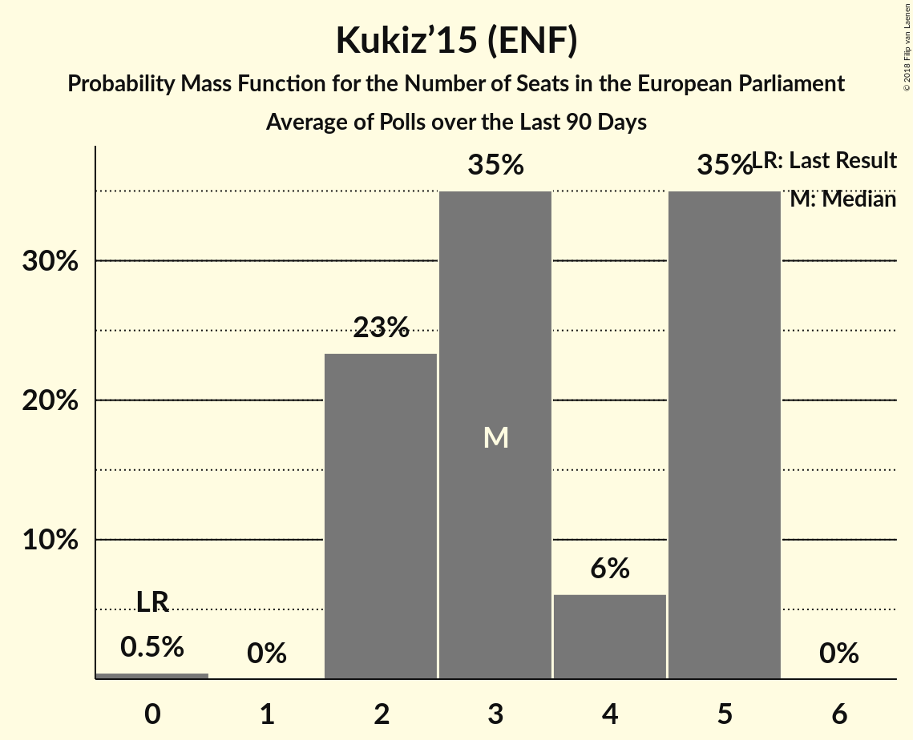

# Kukiz’15 (ENF)

<a href="#voting-intentions">Voting Intentions</a> | <a href="#seats">Seats</a>

## Voting Intentions

Last result: **0.0%** (General Election of 25 May 2014)

### Confidence Intervals

| Period     | Polling firm/Commissioner(s) | Median | 80% Confidence Interval | 90% Confidence Interval | 95% Confidence Interval | 99% Confidence Interval |
|:----------:|:----------------:|:-----------:|:-----------------------:|:-----------------------:|:-----------------------:|:-----------------------:|
| N/A | [Poll Average](average.html) | 6.3% | 4.9–7.7% | 4.6–8.1% | 4.3–8.5% | 3.9–9.1% |
| [9–14 March 2018](2018-03-14-KantarPublic.html) | Kantar Public | 5.1% | 4.3–6.1% | 4.1–6.3% | 3.9–6.6% | 3.5–7.1% |
| [1–8 March 2018](2018-03-08-CBOS.html) | CBOS | 6.0% | 5.2–7.1% | 5.0–7.4% | 4.8–7.6% | 4.4–8.2% |
| [26 February 2018](2018-02-26-IBRiS.html) | IBRiS | 6.6% | 5.8–7.7% | 5.5–8.0% | 5.3–8.3% | 4.9–8.8% |
| [21–22 February 2018](2018-02-22-Estymator.html) | Estymator   DoRzeczy.pl | 7.3% | 6.4–8.5% | 6.1–8.8% | 5.9–9.1% | 5.5–9.7% |
| [16–21 February 2018](2018-02-21-KantarPublic.html) | Kantar Public | 7.0% | 6.1–8.1% | 5.8–8.4% | 5.6–8.7% | 5.2–9.3% |
| [19–20 February 2018](2018-02-20-KantarMillwardBrown.html) | Kantar Millward Brown   TVN and TVN24 | 6.0% | 5.1–7.1% | 4.9–7.4% | 4.7–7.6% | 4.3–8.2% |
| [20 February 2018](2018-02-20-IBRiS.html) | IBRiS   Onet | 5.5% | 4.8–6.5% | 4.5–6.8% | 4.3–7.1% | 4.0–7.6% |
| [1–8 February 2018](2018-02-08-CBOS.html) | CBOS | 7.2% | 6.3–8.3% | 6.0–8.6% | 5.8–8.9% | 5.4–9.5% |

### Probability Mass Function

The following table shows the probability mass function per percentage block of voting intentions for the [poll average](average.html) for Kukiz’15 (ENF).

| Voting Intentions | Probability | Accumulated | Special Marks |
|:-----------------:|:-----------:|:-----------:|:-------------:|
| 0.0–0.5% | 0% | 100% | Last Result |
| 0.5–1.5% | 0% | 100% |  |
| 1.5–2.5% | 0% | 100% |  |
| 2.5–3.5% | 0.1% | 100% |  |
| 3.5–4.5% | 4% | 99.9% |  |
| 4.5–5.5% | 21% | 96% |  |
| 5.5–6.5% | 35% | 75% | Median |
| 6.5–7.5% | 27% | 40% |  |
| 7.5–8.5% | 10% | 13% |  |
| 8.5–9.5% | 2% | 2% |  |
| 9.5–10.5% | 0.2% | 0.2% |  |
| 10.5–11.5% | 0% | 0% |  |

## Seats

Last result: **0** seats (General Election of 25 May 2014)

### Confidence Intervals

| Period     | Polling firm/Commissioner(s) | Median | 80% Confidence Interval | 90% Confidence Interval | 95% Confidence Interval | 99% Confidence Interval |
|:----------:|:----------------:|:------:|:-----------------------:|:-----------------------:|:-----------------------:|:-----------------------:|
| N/A | [Poll Average](average.html) | 3 | 0–4 | 0–4 | 0–5 | 0–5 |
| [9–14 March 2018](2018-03-14-KantarPublic.html) | Kantar Public | 3 | 0–3 | 0–3 | 0–3 | 0–4 |
| [1–8 March 2018](2018-03-08-CBOS.html) | CBOS | 3 | 3–4 | 0–4 | 0–4 | 0–5 |
| [26 February 2018](2018-02-26-IBRiS.html) | IBRiS | 3 | 3–4 | 3–4 | 3–4 | 0–5 |
| [21–22 February 2018](2018-02-22-Estymator.html) | Estymator   DoRzeczy.pl | 4 | 3–5 | 3–5 | 3–5 | 3–5 |
| [16–21 February 2018](2018-02-21-KantarPublic.html) | Kantar Public | 4 | 3–4 | 3–5 | 3–5 | 2–5 |
| [19–20 February 2018](2018-02-20-KantarMillwardBrown.html) | Kantar Millward Brown   TVN and TVN24 | 3 | 3 | 3 | 0–3 | 0–3 |
| [20 February 2018](2018-02-20-IBRiS.html) | IBRiS   Onet | 3 | 0–3 | 0–4 | 0–4 | 0–4 |
| [1–8 February 2018](2018-02-08-CBOS.html) | CBOS | 4 | 3–5 | 3–5 | 3–5 | 3–5 |

### Probability Mass Function

The following table shows the probability mass function per seat for the [poll average](average.html) for Kukiz’15 (ENF).

| Number of Seats | Probability | Accumulated | Special Marks |
|:---------------:|:-----------:|:-----------:|:-------------:|
| 0 | 11% | 100% | Last Result |
| 1 | 0% | 89% |  |
| 2 | 0.7% | 89% |  |
| 3 | 58% | 89% | Median |
| 4 | 27% | 31% |  |
| 5 | 4% | 4% |  |
| 6 | 0.1% | 0.1% |  |
| 7 | 0% | 0% |  |

