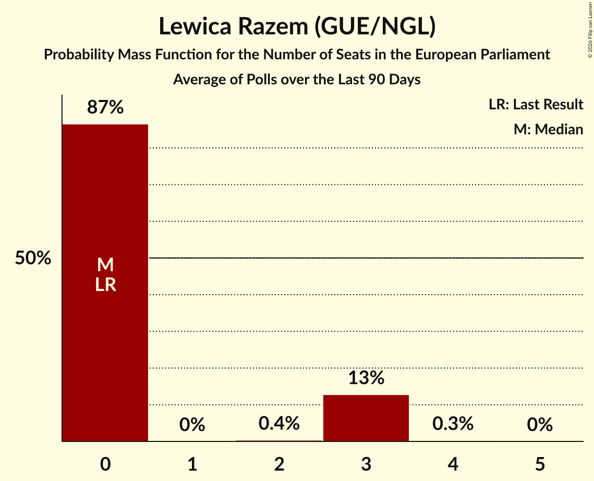

# Lewica Razem (GUE/NGL)

<a href="#voting-intentions">Voting Intentions</a> | <a href="#seats">Seats</a>

## Voting Intentions

Last result: **0.0%** (General Election of 9 June 2024)

### Confidence Intervals

| Period     | Polling firm/Commissioner(s) | Median | 80% Confidence Interval | 90% Confidence Interval | 95% Confidence Interval | 99% Confidence Interval |
|:----------:|:----------------:|:-----------:|:-----------------------:|:-----------------------:|:-----------------------:|:-----------------------:|
| N/A | [Poll Average](average.html) | 4.0% | 2.6–6.2% | 2.3–6.8% | 2.1–7.2% | 1.8–8.0% |
| [9–15 December 2025](2025-12-15-OGB.html) | OGB | 3.3% | 2.7–4.1% | 2.5–4.4% | 2.3–4.6% | 2.1–5.0% |
| [5–9 December 2025](2025-12-09-Ipsos.html) | Ipsos   Radio ZET | 6.3% | 5.4–7.5% | 5.2–7.8% | 5.0–8.1% | 4.5–8.7% |
| [5–8 December 2025](2025-12-08-UnitedSurveys.html) | United Surveys   WP.pl | 2.9% | 2.3–3.8% | 2.2–4.0% | 2.0–4.2% | 1.8–4.7% |
| [4–7 December 2025](2025-12-07-Opinia24.html) | Opinia24   Gazeta Wyborcza | 2.6% | 2.1–3.4% | 1.9–3.7% | 1.8–3.9% | 1.6–4.3% |
| [6–7 December 2025](2025-12-07-InstytutBadańPollster.html) | Instytut Badań Pollster   SE.pl | 4.7% | 3.9–5.6% | 3.7–5.9% | 3.5–6.2% | 3.2–6.6% |
| [4–6 December 2025](2025-12-06-IBRiS.html) | IBRiS   Polsat News | 3.8% | 3.1–4.8% | 2.9–5.0% | 2.8–5.2% | 2.5–5.7% |
| [1–3 December 2025](2025-12-03-Opinia24.html) | Opinia24 | 4.9% | 4.1–5.9% | 3.9–6.2% | 3.7–6.5% | 3.3–7.0% |
| [1–30 November 2025](2025-11-30-SocialChanges.html) | Social Changes   wPolsce24 | 5.0% | 4.2–6.0% | 4.0–6.3% | 3.8–6.5% | 3.5–7.1% |
| [22–25 November 2025](2025-11-25-OGB.html) | OGB   Stan 360 | 2.8% | 2.2–3.6% | 2.1–3.8% | 1.9–4.0% | 1.7–4.4% |
| [21–23 November 2025](2025-11-23-UnitedSurveys.html) | United Surveys   WP.pl | 3.3% | 2.6–4.1% | 2.5–4.4% | 2.3–4.6% | 2.0–5.1% |
| [21–23 November 2025](2025-11-23-IBRiS.html) | IBRiS   Rzeczpospolita | 4.2% | 3.4–5.1% | 3.2–5.3% | 3.1–5.6% | 2.8–6.1% |
| [15–17 November 2025](2025-11-17-InstytutBadańPollster.html) | Instytut Badań Pollster   SE.pl | 4.9% | 4.1–5.9% | 3.9–6.2% | 3.7–6.4% | 3.4–6.9% |
| [14–15 November 2025](2025-11-15-IBRiS.html) | IBRiS   Onet | 3.8% | 3.1–4.7% | 3.0–4.9% | 2.8–5.1% | 2.5–5.6% |
| [3–5 November 2025](2025-11-05-Opinia24.html) | Opinia24 | 3.4% | 2.7–4.3% | 2.5–4.5% | 2.4–4.8% | 2.1–5.2% |
| [31 October–3 November 2025](2025-11-03-ResearchPartner.html) | Research Partner | 3.3% | 2.6–4.1% | 2.5–4.3% | 2.3–4.6% | 2.0–5.0% |
| [23–27 October 2025](2025-10-27-OGB.html) | OGB | 2.2% | 1.8–3.0% | 1.6–3.2% | 1.5–3.4% | 1.3–3.8% |
| [24–26 October 2025](2025-10-26-UnitedSurveys.html) | United Surveys   WP.pl | 3.6% | 3.0–4.6% | 2.8–4.8% | 2.6–5.0% | 2.3–5.5% |
| [24–25 October 2025](2025-10-25-IBRiS.html) | IBRiS   Rzeczpospolita | 4.3% | 3.6–5.2% | 3.3–5.5% | 3.2–5.7% | 2.9–6.2% |
| [15–22 October 2025](2025-10-22-OGB.html) | OGB | 2.0% | 1.5–2.7% | 1.4–2.9% | 1.3–3.1% | 1.1–3.4% |
| [13–14 October 2025](2025-10-14-Opinia24.html) | Opinia24   Fakty TVN and TVN24 | 5.5% | 4.7–6.6% | 4.4–6.9% | 4.2–7.2% | 3.9–7.7% |
| [8–13 October 2025](2025-10-13-OGB.html) | OGB | 4.3% | 3.6–5.2% | 3.4–5.5% | 3.2–5.7% | 2.9–6.2% |
| [10–12 October 2025](2025-10-12-UnitedSurveys.html) | United Surveys   WP.pl | 2.6% | 2.0–3.4% | 1.8–3.6% | 1.7–3.8% | 1.5–4.2% |
| [11–12 October 2025](2025-10-12-InstytutBadańPollster.html) | Instytut Badań Pollster   SE.pl | 5.5% | 4.7–6.5% | 4.4–6.8% | 4.2–7.1% | 3.9–7.6% |
| [8–9 October 2025](2025-10-09-IBRiS.html) | IBRiS   Onet | 3.1% | 2.5–3.9% | 2.3–4.1% | 2.2–4.3% | 1.9–4.8% |
| [6–8 October 2025](2025-10-08-Opinia24.html) | Opinia24 | 4.8% | 4.0–5.8% | 3.8–6.1% | 3.6–6.4% | 3.2–6.9% |
| [26–29 September 2025](2025-09-29-ResearchPartner.html) | Research Partner | 3.6% | 3.0–4.5% | 2.8–4.7% | 2.7–5.0% | 2.4–5.4% |
| [26–28 September 2025](2025-09-28-UnitedSurveys.html) | United Surveys   WP.pl | 2.2% | 1.7–2.9% | 1.6–3.1% | 1.4–3.3% | 1.2–3.7% |
| [27–28 September 2025](2025-09-28-InstytutBadańPollster.html) | Instytut Badań Pollster   SE.pl | 4.5% | 3.7–5.4% | 3.6–5.7% | 3.4–5.9% | 3.0–6.4% |
| [26–27 September 2025](2025-09-27-IBRiS.html) | IBRiS   Rzeczpospolita | 2.9% | 2.3–3.7% | 2.1–3.9% | 2.0–4.1% | 1.7–4.5% |
| [13–15 September 2025](2025-09-15-UnitedSurveys.html) | United Surveys   WP.pl | 1.3% | 0.9–1.9% | 0.8–2.1% | 0.7–2.2% | 0.6–2.6% |
| [12–15 September 2025](2025-09-15-SocialChanges.html) | Social Changes   wPolsce24 | 2.2% | 1.7–3.0% | 1.6–3.2% | 1.5–3.4% | 1.3–3.7% |
| [10–11 September 2025](2025-09-11-InstytutBadańPollster.html) | Instytut Badań Pollster   SE.pl | 4.2% | 3.5–5.1% | 3.3–5.4% | 3.1–5.6% | 2.8–6.1% |
| [2–9 September 2025](2025-09-09-OGB.html) | OGB | 2.6% | 2.1–3.4% | 1.9–3.6% | 1.8–3.8% | 1.6–4.2% |
| [29 August–5 September 2025](2025-09-05-SocialChanges.html) | Social Changes   wPolityce.pl | 3.4% | 2.7–4.2% | 2.6–4.5% | 2.4–4.7% | 2.1–5.2% |
| [1–3 September 2025](2025-09-03-Opinia24.html) | Opinia24 | 4.2% | 3.4–5.2% | 3.2–5.4% | 3.1–5.7% | 2.8–6.2% |
| [28 August–1 September 2025](2025-09-01-UnitedSurveys.html) | United Surveys   WP.pl | 3.5% | 2.9–4.5% | 2.7–4.7% | 2.5–5.0% | 2.2–5.4% |
| [30 August–1 September 2025](2025-09-01-InstytutBadańPollster.html) | Instytut Badań Pollster   SE.pl | 5.5% | N/A | N/A | N/A | N/A |
| [29–30 August 2025](2025-08-30-IBRiS.html) | IBRiS   Rzeczpospolita | 3.9% | 3.7–5.4% | 3.6–5.7% | 3.4–5.9% | 3.0–6.4% |
| [22–25 August 2025](2025-08-25-ResearchPartner.html) | Research Partner | 3.3% | 2.6–4.2% | 2.5–4.4% | 2.3–4.7% | 2.0–5.1% |
| [13–16 August 2025](2025-08-16-UnitedSurveys.html) | United Surveys   SE.pl | 3.4% | 2.8–4.3% | 2.6–4.6% | 2.4–4.8% | 2.1–5.3% |
| [6–13 August 2025](2025-08-13-OGB.html) | OGB | 3.3% | 2.7–4.1% | 2.5–4.4% | 2.3–4.6% | 2.1–5.0% |
| [8–9 August 2025](2025-08-09-InstytutBadańPollster.html) | Instytut Badań Pollster   SE.pl | 4.7% | 3.9–5.6% | 3.7–5.9% | 3.5–6.2% | 3.2–6.7% |
| [4–6 August 2025](2025-08-06-Opinia24.html) | Opinia24 | 4.4% | 3.6–5.4% | 3.4–5.7% | 3.3–5.9% | 2.9–6.4% |
| [25–28 July 2025](2025-07-28-InstytutBadańPollster.html) | Instytut Badań Pollster   SE.pl | 4.4% | 3.7–5.3% | 3.5–5.6% | 3.3–5.8% | 3.0–6.3% |
| [25–27 July 2025](2025-07-27-UnitedSurveys.html) | United Surveys   WP.pl | 3.8% | 3.1–4.7% | 2.9–5.0% | 2.7–5.2% | 2.5–5.7% |
| [25–26 July 2025](2025-07-26-IBRiS.html) | IBRiS   Rzeczpospolita | 3.2% | 2.6–4.1% | 2.5–4.3% | 2.3–4.5% | 2.0–4.9% |
| [24–25 July 2025](2025-07-25-Ipsos.html) | Ipsos   TVP Info | 6.5% | 5.5–7.6% | 5.3–7.9% | 5.0–8.2% | 4.6–8.8% |
| [18–21 July 2025](2025-07-21-ResearchPartner.html) | Research Partner | 2.8% | 2.2–3.6% | 2.0–3.8% | 1.9–4.0% | 1.7–4.4% |
| [11–13 July 2025](2025-07-13-UnitedSurveys.html) | United Surveys   WP.pl | 3.3% | 2.7–4.2% | 2.5–4.5% | 2.3–4.7% | 2.1–5.2% |
| [4–11 July 2025](2025-07-11-OGB.html) | OGB | 4.4% | 3.7–5.3% | 3.5–5.6% | 3.3–5.9% | 3.0–6.4% |
| [7–9 July 2025](2025-07-09-Opinia24.html) | Opinia24 | 4.1% | 3.4–5.1% | 3.2–5.3% | 3.0–5.6% | 2.7–6.1% |
| [8–9 July 2025](2025-07-09-InstytutBadańPollster.html) | Instytut Badań Pollster   SE.pl | 5.0% | 4.2–5.9% | 4.0–6.2% | 3.8–6.4% | 3.5–6.9% |
| [27–29 June 2025](2025-06-29-UnitedSurveys.html) | United Surveys   WP.pl | 5.4% | 4.5–6.5% | 4.3–6.8% | 4.1–7.0% | 3.7–7.6% |
| [26–27 June 2025](2025-06-27-IBRiS.html) | IBRiS   Rzeczpospolita | 5.1% | N/A | N/A | N/A | N/A |
| [23–24 June 2025](2025-06-24-IBRiS.html) | IBRiS   Onet | 4.0% | N/A | N/A | N/A | N/A |
| [12–14 June 2025](2025-06-14-IBRiS.html) | IBRiS   Polsat News | 3.3% | N/A | N/A | N/A | N/A |
| [9–12 June 2025](2025-06-12-Opinia24.html) | Opinia24 | 4.8% | 4.0–5.8% | 3.8–6.1% | 3.6–6.4% | 3.3–6.9% |
| [6–8 June 2025](2025-06-08-UnitedSurveys.html) | United Surveys   WP.pl | 5.4% | N/A | N/A | N/A | N/A |
| [6–7 June 2025](2025-06-07-IBRiS.html) | IBRiS   Rzeczpospolita | 3.2% | N/A | N/A | N/A | N/A |
| [5–6 June 2025](2025-06-06-InstytutBadańPollster.html) | Instytut Badań Pollster   Najwyższy Czas | 4.9% | 4.1–6.0% | 3.8–6.3% | 3.6–6.6% | 3.3–7.2% |
| [28–29 May 2025](2025-05-29-SocialChanges.html) | Social Changes   Radio Wnet | 3.4% | 2.7–4.3% | 2.6–4.5% | 2.4–4.8% | 2.1–5.2% |
| [27–28 May 2025](2025-05-28-ResearchPartner.html) | Research Partner | 4.5% | 3.7–5.5% | 3.5–5.7% | 3.4–6.0% | 3.0–6.5% |
| [25–27 May 2025](2025-05-27-Opinia24.html) | Opinia24   RMF FM | 6.0% | N/A | N/A | N/A | N/A |
| [26–27 May 2025](2025-05-27-IBRiS.html) | IBRiS   Onet | 2.6% | N/A | N/A | N/A | N/A |
| [23–26 May 2025](2025-05-26-Opinia24.html) | Opinia24   Radio Zet | 4.2% | N/A | N/A | N/A | N/A |
| [25 May 2025](2025-05-25-InstytutBadańPollster.html) | Instytut Badań Pollster   SE.pl | 4.4% | N/A | N/A | N/A | N/A |
| [12–14 May 2025](2025-05-14-Opinia24.html) | Opinia24   RMF FM | 5.2% | N/A | N/A | N/A | N/A |
| [12–13 May 2025](2025-05-13-IBRiS.html) | IBRiS   Onet | 3.9% | N/A | N/A | N/A | N/A |
| [7–8 May 2025](2025-05-08-InstytutBadańPollster.html) | Instytut Badań Pollster   SE.pl | 5.4% | N/A | N/A | N/A | N/A |
| [7 May 2025](2025-05-07-UnitedSurveys.html) | United Surveys   WP.pl | 4.3% | N/A | N/A | N/A | N/A |
| [5–7 May 2025](2025-05-07-Opinia24.html) | Opinia24   Newsweek | 5.3% | N/A | N/A | N/A | N/A |
| [1–30 April 2025](2025-04-30-Opinia24.html) | Opinia24   Fakty TVN and TVN24 | 5.2% | N/A | N/A | N/A | N/A |
| [28–29 April 2025](2025-04-29-UnitedSurveys.html) | United Surveys   WP.pl | 4.2% | N/A | N/A | N/A | N/A |
| [28–29 April 2025](2025-04-29-InstytutBadańPollster.html) | Instytut Badań Pollster   SE.pl | 4.9% | N/A | N/A | N/A | N/A |
| [23–25 April 2025](2025-04-25-OGB.html) | OGB | 2.9% | 2.3–3.7% | 2.1–3.9% | 2.0–4.1% | 1.8–4.6% |
| [17–19 April 2025](2025-04-19-UnitedSurveys.html) | United Surveys   WP.pl | 3.8% | N/A | N/A | N/A | N/A |
| [14–16 April 2025](2025-04-16-Opinia24.html) | Opinia24 | 4.0% | N/A | N/A | N/A | N/A |
| [14–16 April 2025](2025-04-16-Ipsos.html) | Ipsos   TVP Info | 4.4% | 3.7–5.5% | 3.5–5.7% | 3.3–6.0% | 2.9–6.5% |
| [15–16 April 2025](2025-04-16-InstytutBadańPollster.html) | Instytut Badań Pollster   SE.pl | 3.2% | N/A | N/A | N/A | N/A |
| [9–14 April 2025](2025-04-14-OGB.html) | OGB | 2.4% | N/A | N/A | N/A | N/A |
| [7–9 April 2025](2025-04-09-Opinia24.html) | Opinia24   RMF FM | 3.4% | N/A | N/A | N/A | N/A |
| [4–6 April 2025](2025-04-06-UnitedSurveys.html) | United Surveys   WP.pl | 0.5% | N/A | N/A | N/A | N/A |
| [2–6 April 2025](2025-04-06-Opinia24.html) | Opinia24   Radio ZET | 4.2% | N/A | N/A | N/A | N/A |
| [3–4 April 2025](2025-04-04-InstytutBadańPollster.html) | Instytut Badań Pollster   TV Republika | 0.0% | N/A | N/A | N/A | N/A |
| [31 March–1 April 2025](2025-04-01-InstytutBadańPollster.html) | Instytut Badań Pollster   SE.pl | 3.5% | N/A | N/A | N/A | N/A |
| [21–24 March 2025](2025-03-24-ResearchPartner.html) | Research Partner | 0.0% | N/A | N/A | N/A | N/A |
| [21–23 March 2025](2025-03-23-UnitedSurveys.html) | United Surveys   WP.pl | 0.9% | N/A | N/A | N/A | N/A |
| [17–21 March 2025](2025-03-21-Opinia24.html) | Opinia24 | 2.5% | N/A | N/A | N/A | N/A |
| [10–13 March 2025](2025-03-13-Opinia24.html) | Opinia24   RMF FM | 2.4% | N/A | N/A | N/A | N/A |
| [11–13 March 2025](2025-03-13-Ipsos.html) | Ipsos   TVP | 3.2% | N/A | N/A | N/A | N/A |
| [7–9 March 2025](2025-03-09-UnitedSurveys.html) | United Surveys   WP.pl | 1.2% | N/A | N/A | N/A | N/A |
| [7–9 March 2025](2025-03-09-InstytutBadańPollster.html) | Instytut Badań Pollster   SE.pl | 1.7% | N/A | N/A | N/A | N/A |
| [7–8 March 2025](2025-03-08-IBRiS.html) | IBRiS   Rzeczpospolita | 2.1% | N/A | N/A | N/A | N/A |
| [1–28 February 2025](2025-02-28-SocialChanges.html) | Social Changes | 1.1% | N/A | N/A | N/A | N/A |
| [19–26 February 2025](2025-02-26-OGB.html) | OGB | 1.2% | N/A | N/A | N/A | N/A |
| [21–24 February 2025](2025-02-24-UnitedSurveys.html) | United Surveys   WP.pl | 1.2% | N/A | N/A | N/A | N/A |
| [21–24 February 2025](2025-02-24-ResearchPartner.html) | Research Partner   Ariadna | 0.0% | N/A | N/A | N/A | N/A |
| [17–21 February 2025](2025-02-21-Opinia24.html) | Opinia24 | 3.2% | N/A | N/A | N/A | N/A |
| [19–21 February 2025](2025-02-21-Ipsos.html) | Ipsos   Liberté! | 2.0% | N/A | N/A | N/A | N/A |
| [17–18 February 2025](2025-02-18-Ipsos.html) | Ipsos   TVP | 2.1% | N/A | N/A | N/A | N/A |
| [10–13 February 2025](2025-02-13-Opinia24.html) | Opinia24   RMF FM | 3.0% | N/A | N/A | N/A | N/A |
| [8–10 February 2025](2025-02-10-InstytutBadańPollster.html) | Instytut Badań Pollster   Super Express | 1.7% | N/A | N/A | N/A | N/A |
| [8–9 February 2025](2025-02-09-UnitedSurveys.html) | United Surveys   WP.pl | 1.1% | N/A | N/A | N/A | N/A |
| [7–8 February 2025](2025-02-08-IBRiS.html) | IBRiS   Rzeczpospolita | 1.6% | N/A | N/A | N/A | N/A |
| [31 January–2 February 2025](2025-02-02-IBRiS.html) | IBRiS   Onet.pl | 1.1% | N/A | N/A | N/A | N/A |
| [23–29 January 2025](2025-01-29-Opinia24.html) | Opinia24   Radio ZET | 1.1% | N/A | N/A | N/A | N/A |
| [24–27 January 2025](2025-01-27-ResearchPartner.html) | Research Partner   Ariadna | 0.0% | N/A | N/A | N/A | N/A |
| [24–26 January 2025](2025-01-26-UnitedSurveys.html) | United Surveys   WP.pl | 0.5% | N/A | N/A | N/A | N/A |
| [20–24 January 2025](2025-01-24-Opinia24.html) | Opinia24 | 2.3% | N/A | N/A | N/A | N/A |
| [21–23 January 2025](2025-01-23-OGB.html) | OGB | 0.4% | N/A | N/A | N/A | N/A |
| [17–18 January 2025](2025-01-18-InstytutBadańPollster.html) | Instytut Badań Pollster   Super Express | 1.6% | N/A | N/A | N/A | N/A |
| [14–16 January 2025](2025-01-16-Ipsos.html) | Ipsos   TVP | 3.3% | N/A | N/A | N/A | N/A |
| [10–12 January 2025](2025-01-12-UnitedSurveys.html) | United Surveys   WP.pl | 2.3% | N/A | N/A | N/A | N/A |
| [10–11 January 2025](2025-01-11-IBRiS.html) | IBRiS   Rzeczpospolita | 1.4% | N/A | N/A | N/A | N/A |
| [7–9 January 2025](2025-01-09-Opinia24.html) | Opinia24   RMF FM | 2.2% | N/A | N/A | N/A | N/A |
| [20–22 December 2024](2024-12-22-UnitedSurveys.html) | United Surveys   WP.pl | 0.3% | N/A | N/A | N/A | N/A |
| [17–18 December 2024](2024-12-18-Ipsos.html) | Ipsos   TVP | 3.0% | N/A | N/A | N/A | N/A |
| [17 December 2024](2024-12-17-Opinia24.html) | Opinia24   RMF FM | 0.8% | N/A | N/A | N/A | N/A |
| [10–11 December 2024](2024-12-11-InstytutBadańPollster.html) | Instytut Badań Pollster   Super Express | 1.5% | N/A | N/A | N/A | N/A |
| [6–8 December 2024](2024-12-08-UnitedSurveys.html) | United Surveys   WP.pl | 0.0% | N/A | N/A | N/A | N/A |
| [6–7 December 2024](2024-12-07-IBRiS.html) | IBRiS   Rzeczpospolita | 0.9% | N/A | N/A | N/A | N/A |
| [3–6 December 2024](2024-12-06-Opinia24.html) | Opinia24 | 2.6% | N/A | N/A | N/A | N/A |
| [25–26 November 2024](2024-11-26-InstytutBadańPollster.html) | Instytut Badań Pollster   Super Express | 1.1% | N/A | N/A | N/A | N/A |
| [22–24 November 2024](2024-11-24-UnitedSurveys.html) | United Surveys   WP.pl | 0.0% | N/A | N/A | N/A | N/A |
| [24 November 2024](2024-11-24-Opinia24.html) | Opinia24   TVN24 | 0.0% | N/A | N/A | N/A | N/A |
| [13–18 November 2024](2024-11-18-Opinia24.html) | Opinia24   Radio ZET | 0.0% | N/A | N/A | N/A | N/A |
| [12–15 November 2024](2024-11-15-Opinia24.html) | Opinia24 | 0.0% | N/A | N/A | N/A | N/A |
| [12–13 November 2024](2024-11-13-InstytutBadańPollster.html) | Instytut Badań Pollster   Super Express | 1.5% | N/A | N/A | N/A | N/A |
| [8–11 November 2024](2024-11-11-ResearchPartner.html) | Research Partner   Ariadna | 0.0% | N/A | N/A | N/A | N/A |
| [11–10 November 2024](2024-11-10-UnitedSurveys.html) | United Surveys   WP.pl | 0.0% | N/A | N/A | N/A | N/A |
| [25–27 October 2024](2024-10-27-UnitedSurveys.html) | United Surveys   WP.pl | 0.0% | N/A | N/A | N/A | N/A |
| [25–26 October 2024](2024-10-26-IBRiS.html) | IBRiS   Rzeczpospolita | 2.5% | N/A | N/A | N/A | N/A |
| [15–18 October 2024](2024-10-18-Opinia24.html) | Opinia24   TVN24 | 2.5% | N/A | N/A | N/A | N/A |
| [11–14 October 2024](2024-10-14-IBRiS.html) | IBRiS   Wydarzenia Polsat | 2.2% | N/A | N/A | N/A | N/A |
| [7–9 October 2024](2024-10-09-Opinia24.html) | Opinia24   Gazeta Wyborcza | 1.6% | N/A | N/A | N/A | N/A |
| [5–6 October 2024](2024-10-06-InstytutBadańPollster.html) | Instytut Badań Pollster   Super Express | 2.4% | N/A | N/A | N/A | N/A |
| [29–30 September 2024](2024-09-30-InstytutBadańPollster.html) | Instytut Badań Pollster   TVP Info | 2.7% | N/A | N/A | N/A | N/A |
| [27–29 September 2024](2024-09-29-UnitedSurveys.html) | United Surveys   WP.pl | 2.4% | N/A | N/A | N/A | N/A |
| [20–21 September 2024](2024-09-21-UnitedSurveys.html) | United Surveys   WP.pl | 2.5% | N/A | N/A | N/A | N/A |
| [10–18 September 2024](2024-09-18-Ipsos.html) | Ipsos   Krytyka Polityczna | 2.4% | N/A | N/A | N/A | N/A |
| [13–16 September 2024](2024-09-16-ResearchPartner.html) | Research Partner   Ariadna | 2.6% | N/A | N/A | N/A | N/A |
| [9–10 September 2024](2024-09-10-IBRiS.html) | IBRiS   Wydarzenia Polsat | 2.4% | N/A | N/A | N/A | N/A |
| [30–31 August 2024](2024-08-31-IBRiS.html) | IBRiS   Rzeczpospolita | 2.2% | N/A | N/A | N/A | N/A |
| [5–8 August 2024](2024-08-08-Opinia24.html) | Opinia24 | 2.3% | N/A | N/A | N/A | N/A |
| [8 August 2024](2024-08-08-InstytutBadańPollster.html) | Instytut Badań Pollster   Super Express | 2.5% | N/A | N/A | N/A | N/A |
| [26–28 July 2024](2024-07-28-UnitedSurveys.html) | United Surveys   WP.pl | 2.9% | N/A | N/A | N/A | N/A |
| [24–25 July 2024](2024-07-25-IBRiS.html) | IBRiS   Onet.pl | 2.5% | N/A | N/A | N/A | N/A |
| [19–22 July 2024](2024-07-22-ResearchPartner.html) | Research Partner   Ariadna | 2.4% | N/A | N/A | N/A | N/A |
| [8–11 July 2024](2024-07-11-Opinia24.html) | Opinia24 | 2.5% | N/A | N/A | N/A | N/A |
| [8–9 July 2024](2024-07-09-InstytutBadańPollster.html) | Instytut Badań Pollster   Super Express | 2.4% | N/A | N/A | N/A | N/A |
| [5–8 July 2024](2024-07-08-UnitedSurveys.html) | United Surveys   WP.pl | 2.4% | N/A | N/A | N/A | N/A |
| [21–23 June 2024](2024-06-23-UnitedSurveys.html) | United Surveys   WP.pl | 1.7% | N/A | N/A | N/A | N/A |
| [21–22 June 2024](2024-06-22-IBRiS.html) | IBRiS   Rzeczpospolita | 1.8% | N/A | N/A | N/A | N/A |
| [23–21 June 2024](2024-06-21-UnitedSurveys.html) | United Surveys   WP.pl | 1.7% | N/A | N/A | N/A | N/A |
| [18–19 June 2024](2024-06-19-IBRiS.html) | IBRiS   Onet.pl | 2.1% | N/A | N/A | N/A | N/A |
| [10–11 June 2024](2024-06-11-Opinia24.html) | Opinia24 | 2.3% | N/A | N/A | N/A | N/A |

### Probability Mass Function

The following table shows the probability mass function per percentage block of voting intentions for the [poll average](average.html) for Lewica Razem (GUE/NGL).

| Voting Intentions | Probability | Accumulated | Special Marks |
|:-----------------:|:-----------:|:-----------:|:-------------:|
| 0.0–0.5% | 0% | 100% | Last Result |
| 0.5–1.5% | 0.1% | 100% |  |
| 1.5–2.5% | 9% | 99.9% |  |
| 2.5–3.5% | 30% | 91% |  |
| 3.5–4.5% | 25% | 61% | Median |
| 4.5–5.5% | 19% | 37% |  |
| 5.5–6.5% | 11% | 18% |  |
| 6.5–7.5% | 5% | 7% |  |
| 7.5–8.5% | 1.2% | 1.3% |  |
| 8.5–9.5% | 0.1% | 0.1% |  |
| 9.5–10.5% | 0% | 0% |  |

## Seats

Last result: **0** seats (General Election of 9 June 2024)

### Confidence Intervals

| Period     | Polling firm/Commissioner(s) | Median | 80% Confidence Interval | 90% Confidence Interval | 95% Confidence Interval | 99% Confidence Interval |
|:----------:|:----------------:|:------:|:-----------------------:|:-----------------------:|:-----------------------:|:-----------------------:|
| N/A | [Poll Average](average.html) | 0 | 0–3 | 0–4 | 0–4 | 0–4 |
| [9–15 December 2025](2025-12-15-OGB.html) | OGB | 0 | 0 | 0 | 0 | 0–3 |
| [5–9 December 2025](2025-12-09-Ipsos.html) | Ipsos   Radio ZET | 4 | 3–4 | 3–4 | 0–4 | 0–4 |
| [5–8 December 2025](2025-12-08-UnitedSurveys.html) | United Surveys   WP.pl | 0 | 0 | 0 | 0 | 0 |
| [4–7 December 2025](2025-12-07-Opinia24.html) | Opinia24   Gazeta Wyborcza | 0 | 0 | 0 | 0 | 0 |
| [6–7 December 2025](2025-12-07-InstytutBadańPollster.html) | Instytut Badań Pollster   SE.pl | 0 | 0–3 | 0–3 | 0–3 | 0–3 |
| [4–6 December 2025](2025-12-06-IBRiS.html) | IBRiS   Polsat News | 0 | 0 | 0 | 0 | 0–3 |
| [1–3 December 2025](2025-12-03-Opinia24.html) | Opinia24 | 0 | 0–3 | 0–4 | 0–4 | 0–4 |
| [1–30 November 2025](2025-11-30-SocialChanges.html) | Social Changes   wPolsce24 | 0 | 0–3 | 0–3 | 0–3 | 0–4 |
| [22–25 November 2025](2025-11-25-OGB.html) | OGB   Stan 360 | 0 | 0 | 0 | 0 | 0 |
| [21–23 November 2025](2025-11-23-UnitedSurveys.html) | United Surveys   WP.pl | 0 | 0 | 0 | 0 | 0 |
| [21–23 November 2025](2025-11-23-IBRiS.html) | IBRiS   Rzeczpospolita | 0 | 0–3 | 0–3 | 0–3 | 0–3 |
| [15–17 November 2025](2025-11-17-InstytutBadańPollster.html) | Instytut Badań Pollster   SE.pl | 3 | 0–3 | 0–3 | 0–3 | 0–4 |
| [14–15 November 2025](2025-11-15-IBRiS.html) | IBRiS   Onet | 0 | 0 | 0 | 0 | 0–3 |
| [3–5 November 2025](2025-11-05-Opinia24.html) | Opinia24 | 0 | 0 | 0 | 0 | 0–2 |
| [31 October–3 November 2025](2025-11-03-ResearchPartner.html) | Research Partner | 0 | 0 | 0 | 0 | 0 |
| [23–27 October 2025](2025-10-27-OGB.html) | OGB | 0 | 0 | 0 | 0 | 0 |
| [24–26 October 2025](2025-10-26-UnitedSurveys.html) | United Surveys   WP.pl | 0 | 0–2 | 0–2 | 0–2 | 0–3 |
| [24–25 October 2025](2025-10-25-IBRiS.html) | IBRiS   Rzeczpospolita | 0 | 0–3 | 0–3 | 0–3 | 0–3 |
| [15–22 October 2025](2025-10-22-OGB.html) | OGB | 0 | 0 | 0 | 0 | 0 |
| [13–14 October 2025](2025-10-14-Opinia24.html) | Opinia24   Fakty TVN and TVN24 | 3 | 0–4 | 0–4 | 0–4 | 0–4 |
| [8–13 October 2025](2025-10-13-OGB.html) | OGB | 0 | 0 | 0 | 0–3 | 0–3 |
| [10–12 October 2025](2025-10-12-UnitedSurveys.html) | United Surveys   WP.pl | 0 | 0 | 0 | 0 | 0 |
| [11–12 October 2025](2025-10-12-InstytutBadańPollster.html) | Instytut Badań Pollster   SE.pl | 3 | 0–3 | 0–3 | 0–4 | 0–4 |
| [8–9 October 2025](2025-10-09-IBRiS.html) | IBRiS   Onet | 0 | 0 | 0 | 0 | 0 |
| [6–8 October 2025](2025-10-08-Opinia24.html) | Opinia24 | 0 | 0–3 | 0–3 | 0–3 | 0–4 |
| [26–29 September 2025](2025-09-29-ResearchPartner.html) | Research Partner | 0 | 0 | 0 | 0 | 0–3 |
| [26–28 September 2025](2025-09-28-UnitedSurveys.html) | United Surveys   WP.pl | 0 | 0 | 0 | 0 | 0 |
| [27–28 September 2025](2025-09-28-InstytutBadańPollster.html) | Instytut Badań Pollster   SE.pl | 0 | 0–3 | 0–3 | 0–3 | 0–3 |
| [26–27 September 2025](2025-09-27-IBRiS.html) | IBRiS   Rzeczpospolita | 0 | 0 | 0 | 0 | 0 |
| [13–15 September 2025](2025-09-15-UnitedSurveys.html) | United Surveys   WP.pl | 0 | 0 | 0 | 0 | 0 |
| [12–15 September 2025](2025-09-15-SocialChanges.html) | Social Changes   wPolsce24 | 0 | 0 | 0 | 0 | 0 |
| [10–11 September 2025](2025-09-11-InstytutBadańPollster.html) | Instytut Badań Pollster   SE.pl | 0 | 0 | 0–3 | 0–3 | 0–3 |
| [2–9 September 2025](2025-09-09-OGB.html) | OGB | 0 | 0 | 0 | 0 | 0 |
| [29 August–5 September 2025](2025-09-05-SocialChanges.html) | Social Changes   wPolityce.pl | 0 | 0 | 0 | 0 | 0 |
| [1–3 September 2025](2025-09-03-Opinia24.html) | Opinia24 | 0 | 0–3 | 0–3 | 0–3 | 0–3 |
| [28 August–1 September 2025](2025-09-01-UnitedSurveys.html) | United Surveys   WP.pl | 0 | 0 | 0 | 0 | 0 |
| [30 August–1 September 2025](2025-09-01-InstytutBadańPollster.html) | Instytut Badań Pollster   SE.pl |  |  |  |  |  |
| [29–30 August 2025](2025-08-30-IBRiS.html) | IBRiS   Rzeczpospolita | 0 | 0 | 0 | 0 | 0–3 |
| [22–25 August 2025](2025-08-25-ResearchPartner.html) | Research Partner | 0 | 0 | 0 | 0 | 0 |
| [13–16 August 2025](2025-08-16-UnitedSurveys.html) | United Surveys   SE.pl | 0 | 0 | 0 | 0–3 | 0–3 |
| [6–13 August 2025](2025-08-13-OGB.html) | OGB | 0 | 0 | 0 | 0 | 0–3 |
| [8–9 August 2025](2025-08-09-InstytutBadańPollster.html) | Instytut Badań Pollster   SE.pl | 0 | 0–2 | 0–3 | 0–3 | 0–3 |
| [4–6 August 2025](2025-08-06-Opinia24.html) | Opinia24 | 0 | 0–3 | 0–3 | 0–3 | 0–3 |
| [25–28 July 2025](2025-07-28-InstytutBadańPollster.html) | Instytut Badań Pollster   SE.pl | 0 | 0–3 | 0–3 | 0–3 | 0–3 |
| [25–27 July 2025](2025-07-27-UnitedSurveys.html) | United Surveys   WP.pl | 0 | 0 | 0–3 | 0–3 | 0–3 |
| [25–26 July 2025](2025-07-26-IBRiS.html) | IBRiS   Rzeczpospolita | 0 | 0 | 0 | 0 | 0 |
| [24–25 July 2025](2025-07-25-Ipsos.html) | Ipsos   TVP Info | 3 | 3–4 | 3–5 | 3–5 | 0–5 |
| [18–21 July 2025](2025-07-21-ResearchPartner.html) | Research Partner | 0 | 0 | 0 | 0 | 0 |
| [11–13 July 2025](2025-07-13-UnitedSurveys.html) | United Surveys   WP.pl | 0 | 0 | 0 | 0 | 0 |
| [4–11 July 2025](2025-07-11-OGB.html) | OGB | 0 | 0 | 0 | 0 | 0–3 |
| [7–9 July 2025](2025-07-09-Opinia24.html) | Opinia24 | 0 | 0 | 0–3 | 0–3 | 0–3 |
| [8–9 July 2025](2025-07-09-InstytutBadańPollster.html) | Instytut Badań Pollster   SE.pl | 3 | 0–3 | 0–3 | 0–3 | 0–4 |
| [27–29 June 2025](2025-06-29-UnitedSurveys.html) | United Surveys   WP.pl | 0 | 0–4 | 0–4 | 0–4 | 0–4 |
| [26–27 June 2025](2025-06-27-IBRiS.html) | IBRiS   Rzeczpospolita |  |  |  |  |  |
| [23–24 June 2025](2025-06-24-IBRiS.html) | IBRiS   Onet |  |  |  |  |  |
| [12–14 June 2025](2025-06-14-IBRiS.html) | IBRiS   Polsat News |  |  |  |  |  |
| [9–12 June 2025](2025-06-12-Opinia24.html) | Opinia24 | 0 | 0–3 | 0–3 | 0–3 | 0–4 |
| [6–8 June 2025](2025-06-08-UnitedSurveys.html) | United Surveys   WP.pl |  |  |  |  |  |
| [6–7 June 2025](2025-06-07-IBRiS.html) | IBRiS   Rzeczpospolita |  |  |  |  |  |
| [5–6 June 2025](2025-06-06-InstytutBadańPollster.html) | Instytut Badań Pollster   Najwyższy Czas | 0 | 0–3 | 0–4 | 0–4 | 0–4 |
| [28–29 May 2025](2025-05-29-SocialChanges.html) | Social Changes   Radio Wnet | 0 | 0 | 0 | 0 | 0–3 |
| [27–28 May 2025](2025-05-28-ResearchPartner.html) | Research Partner | 0 | 0 | 0–3 | 0–3 | 0–3 |
| [25–27 May 2025](2025-05-27-Opinia24.html) | Opinia24   RMF FM |  |  |  |  |  |
| [26–27 May 2025](2025-05-27-IBRiS.html) | IBRiS   Onet |  |  |  |  |  |
| [23–26 May 2025](2025-05-26-Opinia24.html) | Opinia24   Radio Zet |  |  |  |  |  |
| [25 May 2025](2025-05-25-InstytutBadańPollster.html) | Instytut Badań Pollster   SE.pl |  |  |  |  |  |
| [12–14 May 2025](2025-05-14-Opinia24.html) | Opinia24   RMF FM |  |  |  |  |  |
| [12–13 May 2025](2025-05-13-IBRiS.html) | IBRiS   Onet |  |  |  |  |  |
| [7–8 May 2025](2025-05-08-InstytutBadańPollster.html) | Instytut Badań Pollster   SE.pl |  |  |  |  |  |
| [7 May 2025](2025-05-07-UnitedSurveys.html) | United Surveys   WP.pl |  |  |  |  |  |
| [5–7 May 2025](2025-05-07-Opinia24.html) | Opinia24   Newsweek |  |  |  |  |  |
| [1–30 April 2025](2025-04-30-Opinia24.html) | Opinia24   Fakty TVN and TVN24 |  |  |  |  |  |
| [28–29 April 2025](2025-04-29-UnitedSurveys.html) | United Surveys   WP.pl |  |  |  |  |  |
| [28–29 April 2025](2025-04-29-InstytutBadańPollster.html) | Instytut Badań Pollster   SE.pl |  |  |  |  |  |
| [23–25 April 2025](2025-04-25-OGB.html) | OGB | 0 | 0 | 0 | 0 | 0 |
| [17–19 April 2025](2025-04-19-UnitedSurveys.html) | United Surveys   WP.pl |  |  |  |  |  |
| [14–16 April 2025](2025-04-16-Opinia24.html) | Opinia24 |  |  |  |  |  |
| [14–16 April 2025](2025-04-16-Ipsos.html) | Ipsos   TVP Info | 0 | 0–3 | 0–3 | 0–3 | 0–3 |
| [15–16 April 2025](2025-04-16-InstytutBadańPollster.html) | Instytut Badań Pollster   SE.pl |  |  |  |  |  |
| [9–14 April 2025](2025-04-14-OGB.html) | OGB |  |  |  |  |  |
| [7–9 April 2025](2025-04-09-Opinia24.html) | Opinia24   RMF FM |  |  |  |  |  |
| [4–6 April 2025](2025-04-06-UnitedSurveys.html) | United Surveys   WP.pl |  |  |  |  |  |
| [2–6 April 2025](2025-04-06-Opinia24.html) | Opinia24   Radio ZET |  |  |  |  |  |
| [3–4 April 2025](2025-04-04-InstytutBadańPollster.html) | Instytut Badań Pollster   TV Republika |  |  |  |  |  |
| [31 March–1 April 2025](2025-04-01-InstytutBadańPollster.html) | Instytut Badań Pollster   SE.pl |  |  |  |  |  |
| [21–24 March 2025](2025-03-24-ResearchPartner.html) | Research Partner |  |  |  |  |  |
| [21–23 March 2025](2025-03-23-UnitedSurveys.html) | United Surveys   WP.pl |  |  |  |  |  |
| [17–21 March 2025](2025-03-21-Opinia24.html) | Opinia24 |  |  |  |  |  |
| [10–13 March 2025](2025-03-13-Opinia24.html) | Opinia24   RMF FM |  |  |  |  |  |
| [11–13 March 2025](2025-03-13-Ipsos.html) | Ipsos   TVP |  |  |  |  |  |
| [7–9 March 2025](2025-03-09-UnitedSurveys.html) | United Surveys   WP.pl |  |  |  |  |  |
| [7–9 March 2025](2025-03-09-InstytutBadańPollster.html) | Instytut Badań Pollster   SE.pl |  |  |  |  |  |
| [7–8 March 2025](2025-03-08-IBRiS.html) | IBRiS   Rzeczpospolita |  |  |  |  |  |
| [1–28 February 2025](2025-02-28-SocialChanges.html) | Social Changes |  |  |  |  |  |
| [19–26 February 2025](2025-02-26-OGB.html) | OGB |  |  |  |  |  |
| [21–24 February 2025](2025-02-24-UnitedSurveys.html) | United Surveys   WP.pl |  |  |  |  |  |
| [21–24 February 2025](2025-02-24-ResearchPartner.html) | Research Partner   Ariadna |  |  |  |  |  |
| [17–21 February 2025](2025-02-21-Opinia24.html) | Opinia24 |  |  |  |  |  |
| [19–21 February 2025](2025-02-21-Ipsos.html) | Ipsos   Liberté! |  |  |  |  |  |
| [17–18 February 2025](2025-02-18-Ipsos.html) | Ipsos   TVP |  |  |  |  |  |
| [10–13 February 2025](2025-02-13-Opinia24.html) | Opinia24   RMF FM |  |  |  |  |  |
| [8–10 February 2025](2025-02-10-InstytutBadańPollster.html) | Instytut Badań Pollster   Super Express |  |  |  |  |  |
| [8–9 February 2025](2025-02-09-UnitedSurveys.html) | United Surveys   WP.pl |  |  |  |  |  |
| [7–8 February 2025](2025-02-08-IBRiS.html) | IBRiS   Rzeczpospolita |  |  |  |  |  |
| [31 January–2 February 2025](2025-02-02-IBRiS.html) | IBRiS   Onet.pl |  |  |  |  |  |
| [23–29 January 2025](2025-01-29-Opinia24.html) | Opinia24   Radio ZET |  |  |  |  |  |
| [24–27 January 2025](2025-01-27-ResearchPartner.html) | Research Partner   Ariadna |  |  |  |  |  |
| [24–26 January 2025](2025-01-26-UnitedSurveys.html) | United Surveys   WP.pl |  |  |  |  |  |
| [20–24 January 2025](2025-01-24-Opinia24.html) | Opinia24 |  |  |  |  |  |
| [21–23 January 2025](2025-01-23-OGB.html) | OGB |  |  |  |  |  |
| [17–18 January 2025](2025-01-18-InstytutBadańPollster.html) | Instytut Badań Pollster   Super Express |  |  |  |  |  |
| [14–16 January 2025](2025-01-16-Ipsos.html) | Ipsos   TVP |  |  |  |  |  |
| [10–12 January 2025](2025-01-12-UnitedSurveys.html) | United Surveys   WP.pl |  |  |  |  |  |
| [10–11 January 2025](2025-01-11-IBRiS.html) | IBRiS   Rzeczpospolita |  |  |  |  |  |
| [7–9 January 2025](2025-01-09-Opinia24.html) | Opinia24   RMF FM |  |  |  |  |  |
| [20–22 December 2024](2024-12-22-UnitedSurveys.html) | United Surveys   WP.pl |  |  |  |  |  |
| [17–18 December 2024](2024-12-18-Ipsos.html) | Ipsos   TVP |  |  |  |  |  |
| [17 December 2024](2024-12-17-Opinia24.html) | Opinia24   RMF FM |  |  |  |  |  |
| [10–11 December 2024](2024-12-11-InstytutBadańPollster.html) | Instytut Badań Pollster   Super Express |  |  |  |  |  |
| [6–8 December 2024](2024-12-08-UnitedSurveys.html) | United Surveys   WP.pl |  |  |  |  |  |
| [6–7 December 2024](2024-12-07-IBRiS.html) | IBRiS   Rzeczpospolita |  |  |  |  |  |
| [3–6 December 2024](2024-12-06-Opinia24.html) | Opinia24 |  |  |  |  |  |
| [25–26 November 2024](2024-11-26-InstytutBadańPollster.html) | Instytut Badań Pollster   Super Express |  |  |  |  |  |
| [22–24 November 2024](2024-11-24-UnitedSurveys.html) | United Surveys   WP.pl |  |  |  |  |  |
| [24 November 2024](2024-11-24-Opinia24.html) | Opinia24   TVN24 |  |  |  |  |  |
| [13–18 November 2024](2024-11-18-Opinia24.html) | Opinia24   Radio ZET |  |  |  |  |  |
| [12–15 November 2024](2024-11-15-Opinia24.html) | Opinia24 |  |  |  |  |  |
| [12–13 November 2024](2024-11-13-InstytutBadańPollster.html) | Instytut Badań Pollster   Super Express |  |  |  |  |  |
| [8–11 November 2024](2024-11-11-ResearchPartner.html) | Research Partner   Ariadna |  |  |  |  |  |
| [11–10 November 2024](2024-11-10-UnitedSurveys.html) | United Surveys   WP.pl |  |  |  |  |  |
| [25–27 October 2024](2024-10-27-UnitedSurveys.html) | United Surveys   WP.pl |  |  |  |  |  |
| [25–26 October 2024](2024-10-26-IBRiS.html) | IBRiS   Rzeczpospolita |  |  |  |  |  |
| [15–18 October 2024](2024-10-18-Opinia24.html) | Opinia24   TVN24 |  |  |  |  |  |
| [11–14 October 2024](2024-10-14-IBRiS.html) | IBRiS   Wydarzenia Polsat |  |  |  |  |  |
| [7–9 October 2024](2024-10-09-Opinia24.html) | Opinia24   Gazeta Wyborcza |  |  |  |  |  |
| [5–6 October 2024](2024-10-06-InstytutBadańPollster.html) | Instytut Badań Pollster   Super Express |  |  |  |  |  |
| [29–30 September 2024](2024-09-30-InstytutBadańPollster.html) | Instytut Badań Pollster   TVP Info |  |  |  |  |  |
| [27–29 September 2024](2024-09-29-UnitedSurveys.html) | United Surveys   WP.pl |  |  |  |  |  |
| [20–21 September 2024](2024-09-21-UnitedSurveys.html) | United Surveys   WP.pl |  |  |  |  |  |
| [10–18 September 2024](2024-09-18-Ipsos.html) | Ipsos   Krytyka Polityczna |  |  |  |  |  |
| [13–16 September 2024](2024-09-16-ResearchPartner.html) | Research Partner   Ariadna |  |  |  |  |  |
| [9–10 September 2024](2024-09-10-IBRiS.html) | IBRiS   Wydarzenia Polsat |  |  |  |  |  |
| [30–31 August 2024](2024-08-31-IBRiS.html) | IBRiS   Rzeczpospolita |  |  |  |  |  |
| [5–8 August 2024](2024-08-08-Opinia24.html) | Opinia24 |  |  |  |  |  |
| [8 August 2024](2024-08-08-InstytutBadańPollster.html) | Instytut Badań Pollster   Super Express |  |  |  |  |  |
| [26–28 July 2024](2024-07-28-UnitedSurveys.html) | United Surveys   WP.pl |  |  |  |  |  |
| [24–25 July 2024](2024-07-25-IBRiS.html) | IBRiS   Onet.pl |  |  |  |  |  |
| [19–22 July 2024](2024-07-22-ResearchPartner.html) | Research Partner   Ariadna |  |  |  |  |  |
| [8–11 July 2024](2024-07-11-Opinia24.html) | Opinia24 |  |  |  |  |  |
| [8–9 July 2024](2024-07-09-InstytutBadańPollster.html) | Instytut Badań Pollster   Super Express |  |  |  |  |  |
| [5–8 July 2024](2024-07-08-UnitedSurveys.html) | United Surveys   WP.pl |  |  |  |  |  |
| [21–23 June 2024](2024-06-23-UnitedSurveys.html) | United Surveys   WP.pl |  |  |  |  |  |
| [21–22 June 2024](2024-06-22-IBRiS.html) | IBRiS   Rzeczpospolita |  |  |  |  |  |
| [23–21 June 2024](2024-06-21-UnitedSurveys.html) | United Surveys   WP.pl |  |  |  |  |  |
| [18–19 June 2024](2024-06-19-IBRiS.html) | IBRiS   Onet.pl |  |  |  |  |  |
| [10–11 June 2024](2024-06-11-Opinia24.html) | Opinia24 |  |  |  |  |  |

### Probability Mass Function

The following table shows the probability mass function per seat for the [poll average](average.html) for Lewica Razem (GUE/NGL).

| Number of Seats | Probability | Accumulated | Special Marks |
|:---------------:|:-----------:|:-----------:|:-------------:|
| 0 | 77% | 100% | Last Result, Median |
| 1 | 0% | 23% |  |
| 2 | 0.2% | 23% |  |
| 3 | 14% | 23% |  |
| 4 | 9% | 9% |  |
| 5 | 0% | 0% |  |

