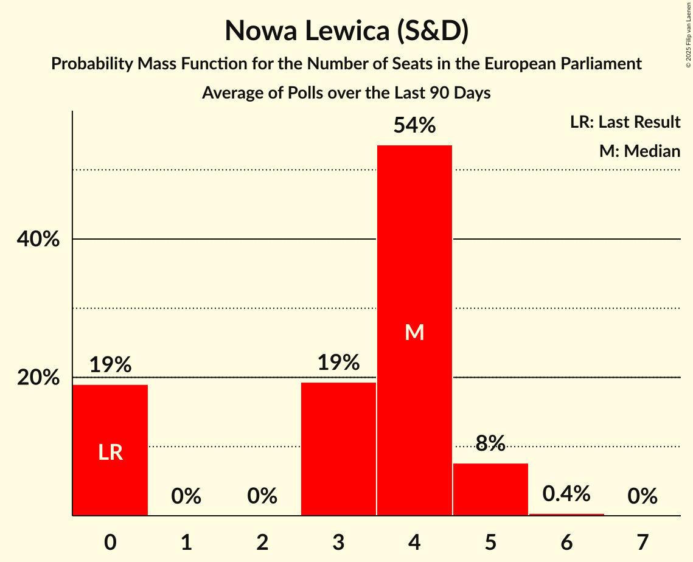

# Nowa Lewica (S&D)

<a href="#voting-intentions">Voting Intentions</a> | <a href="#seats">Seats</a>

## Voting Intentions

Last result: **0.0%** (General Election of 9 June 2024)

### Confidence Intervals

| Period     | Polling firm/Commissioner(s) | Median | 80% Confidence Interval | 90% Confidence Interval | 95% Confidence Interval | 99% Confidence Interval |
|:----------:|:----------------:|:-----------:|:-----------------------:|:-----------------------:|:-----------------------:|:-----------------------:|
| N/A | [Poll Average](average.html) | 6.9% | 5.9–8.2% | 5.6–8.6% | 5.4–8.9% | 5.0–9.6% |
| [26–28 July 2024](2024-07-28-UnitedSurveys.html) | United Surveys   WP.pl | 7.7% | 6.7–8.9% | 6.4–9.2% | 6.2–9.5% | 5.8–10.1% |
| [24–25 July 2024](2024-07-25-IBRiS.html) | IBRiS   Onet.pl | 6.8% | 5.9–7.9% | 5.7–8.2% | 5.5–8.5% | 5.1–9.0% |
| [19–22 July 2024](2024-07-22-ResearchPartner.html) | Research Partner   Ariadna | 6.5% | 5.6–7.6% | 5.4–7.9% | 5.2–8.2% | 4.8–8.8% |
| [8–11 July 2024](2024-07-11-Opinia24.html) | Opinia24 | 6.9% | 6.0–8.0% | 5.7–8.4% | 5.5–8.7% | 5.1–9.2% |
| [8–9 July 2024](2024-07-09-InstytutBadańPollster.html) | Instytut Badań Pollster   Super Express | 6.6% | 5.7–7.7% | 5.5–8.0% | 5.2–8.3% | 4.8–8.9% |
| [5–8 July 2024](2024-07-08-UnitedSurveys.html) | United Surveys   WP.pl | 6.5% | N/A | N/A | N/A | N/A |
| [21–23 June 2024](2024-06-23-UnitedSurveys.html) | United Surveys   WP.pl | 4.7% | N/A | N/A | N/A | N/A |
| [21–22 June 2024](2024-06-22-IBRiS.html) | IBRiS   Rzeczpospolita | 4.9% | N/A | N/A | N/A | N/A |
| [23–21 June 2024](2024-06-21-UnitedSurveys.html) | United Surveys   WP.pl | 4.7% | N/A | N/A | N/A | N/A |
| [18–19 June 2024](2024-06-19-IBRiS.html) | IBRiS   Onet.pl | 5.5% | N/A | N/A | N/A | N/A |
| [10–11 June 2024](2024-06-11-Opinia24.html) | Opinia24 | 6.3% | N/A | N/A | N/A | N/A |

### Probability Mass Function

The following table shows the probability mass function per percentage block of voting intentions for the [poll average](average.html) for Nowa Lewica (S&D).

| Voting Intentions | Probability | Accumulated | Special Marks |
|:-----------------:|:-----------:|:-----------:|:-------------:|
| 0.0–0.5% | 0% | 100% | Last Result |
| 0.5–1.5% | 0% | 100% |  |
| 1.5–2.5% | 0% | 100% |  |
| 2.5–3.5% | 0% | 100% |  |
| 3.5–4.5% | 0.1% | 100% |  |
| 4.5–5.5% | 4% | 99.9% |  |
| 5.5–6.5% | 28% | 96% |  |
| 6.5–7.5% | 42% | 67% | Median |
| 7.5–8.5% | 21% | 26% |  |
| 8.5–9.5% | 5% | 5% |  |
| 9.5–10.5% | 0.5% | 0.5% |  |
| 10.5–11.5% | 0% | 0% |  |

## Seats

Last result: **0** seats (General Election of 9 June 2024)

### Confidence Intervals

| Period     | Polling firm/Commissioner(s) | Median | 80% Confidence Interval | 90% Confidence Interval | 95% Confidence Interval | 99% Confidence Interval |
|:----------:|:----------------:|:------:|:-----------------------:|:-----------------------:|:-----------------------:|:-----------------------:|
| N/A | [Poll Average](average.html) | 4 | 3–4 | 3–5 | 3–5 | 2–5 |
| [26–28 July 2024](2024-07-28-UnitedSurveys.html) | United Surveys   WP.pl | 4 | 4–5 | 3–5 | 3–5 | 3–5 |
| [24–25 July 2024](2024-07-25-IBRiS.html) | IBRiS   Onet.pl | 4 | 3–4 | 3–5 | 3–5 | 3–5 |
| [19–22 July 2024](2024-07-22-ResearchPartner.html) | Research Partner   Ariadna | 3 | 3 | 3–4 | 3–4 | 3–5 |
| [8–11 July 2024](2024-07-11-Opinia24.html) | Opinia24 | 4 | 3–4 | 3–4 | 3–5 | 3–5 |
| [8–9 July 2024](2024-07-09-InstytutBadańPollster.html) | Instytut Badań Pollster   Super Express | 3 | 3–4 | 3–4 | 2–4 | 2–5 |
| [5–8 July 2024](2024-07-08-UnitedSurveys.html) | United Surveys   WP.pl |  |  |  |  |  |
| [21–23 June 2024](2024-06-23-UnitedSurveys.html) | United Surveys   WP.pl |  |  |  |  |  |
| [21–22 June 2024](2024-06-22-IBRiS.html) | IBRiS   Rzeczpospolita |  |  |  |  |  |
| [23–21 June 2024](2024-06-21-UnitedSurveys.html) | United Surveys   WP.pl |  |  |  |  |  |
| [18–19 June 2024](2024-06-19-IBRiS.html) | IBRiS   Onet.pl |  |  |  |  |  |
| [10–11 June 2024](2024-06-11-Opinia24.html) | Opinia24 |  |  |  |  |  |

### Probability Mass Function

The following table shows the probability mass function per seat for the [poll average](average.html) for Nowa Lewica (S&D).

| Number of Seats | Probability | Accumulated | Special Marks |
|:---------------:|:-----------:|:-----------:|:-------------:|
| 0 | 0% | 100% | Last Result |
| 1 | 0% | 100% |  |
| 2 | 0.8% | 100% |  |
| 3 | 35% | 99.2% |  |
| 4 | 57% | 64% | Median |
| 5 | 7% | 7% |  |
| 6 | 0% | 0% |  |

