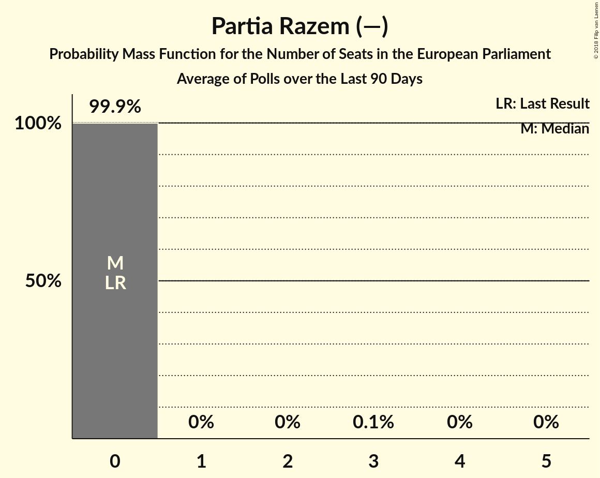

# Partia Razem (—)

<a href="#voting-intentions">Voting Intentions</a> | <a href="#seats">Seats</a>

## Voting Intentions

Last result: **0.0%** (General Election of 25 May 2014)

### Confidence Intervals

| Period     | Polling firm/Commissioner(s) | Median | 80% Confidence Interval | 90% Confidence Interval | 95% Confidence Interval | 99% Confidence Interval |
|:----------:|:----------------:|:-----------:|:-----------------------:|:-----------------------:|:-----------------------:|:-----------------------:|
| N/A | [Poll Average](average.html) | 2.9% | 1.9–4.0% | 1.7–4.3% | 1.5–4.5% | 1.3–5.0% |
| [1–8 March 2018](2018-03-08-CBOS.html) | CBOS | 2.0% | 1.6–2.7% | 1.4–2.9% | 1.3–3.0% | 1.1–3.4% |
| [26 February 2018](2018-02-26-IBRiS.html) | IBRiS | 3.5% | 2.9–4.4% | 2.7–4.6% | 2.6–4.8% | 2.3–5.2% |
| [21–22 February 2018](2018-02-22-Estymator.html) | Estymator   DoRzeczy.pl | 3.0% | 2.4–3.8% | 2.2–4.0% | 2.1–4.2% | 1.8–4.6% |
| [16–21 February 2018](2018-02-21-KantarPublic.html) | Kantar Public | 2.0% | 1.2–2.9% | 1.2–3.3% | 1.2–3.3% | 0.8–3.7% |
| [19–20 February 2018](2018-02-20-KantarMillwardBrown.html) | Kantar Millward Brown   TVN and TVN24 | 3.0% | N/A | N/A | N/A | N/A |
| [20 February 2018](2018-02-20-IBRiS.html) | IBRiS   Onet | 3.9% | N/A | N/A | N/A | N/A |
| [1–8 February 2018](2018-02-08-CBOS.html) | CBOS | 1.0% | N/A | N/A | N/A | N/A |

### Probability Mass Function

The following table shows the probability mass function per percentage block of voting intentions for the [poll average](average.html) for Partia Razem (—).

| Voting Intentions | Probability | Accumulated | Special Marks |
|:-----------------:|:-----------:|:-----------:|:-------------:|
| 0.0–0.5% | 0% | 100% | Last Result |
| 0.5–1.5% | 3% | 100% |  |
| 1.5–2.5% | 31% | 97% |  |
| 2.5–3.5% | 42% | 66% | Median |
| 3.5–4.5% | 22% | 24% |  |
| 4.5–5.5% | 2% | 2% |  |
| 5.5–6.5% | 0% | 0% |  |
| 6.5–7.5% | 0% | 0% |  |

## Seats

Last result: **0** seats (General Election of 25 May 2014)

### Confidence Intervals

| Period     | Polling firm/Commissioner(s) | Median | 80% Confidence Interval | 90% Confidence Interval | 95% Confidence Interval | 99% Confidence Interval |
|:----------:|:----------------:|:------:|:-----------------------:|:-----------------------:|:-----------------------:|:-----------------------:|
| N/A | [Poll Average](average.html) | 0 | 0–3 | 0–3 | 0–3 | 0–3 |
| [1–8 March 2018](2018-03-08-CBOS.html) | CBOS | 0 | 0 | 0 | 0 | 0 |
| [26 February 2018](2018-02-26-IBRiS.html) | IBRiS | 0 | 0 | 0 | 0 | 0 |
| [21–22 February 2018](2018-02-22-Estymator.html) | Estymator   DoRzeczy.pl | 0 | 0–3 | 0–3 | 0–3 | 0–3 |
| [16–21 February 2018](2018-02-21-KantarPublic.html) | Kantar Public |  |  |  |  |  |
| [19–20 February 2018](2018-02-20-KantarMillwardBrown.html) | Kantar Millward Brown   TVN and TVN24 |  |  |  |  |  |
| [20 February 2018](2018-02-20-IBRiS.html) | IBRiS   Onet |  |  |  |  |  |
| [1–8 February 2018](2018-02-08-CBOS.html) | CBOS |  |  |  |  |  |

### Probability Mass Function

The following table shows the probability mass function per seat for the [poll average](average.html) for Partia Razem (—).

| Number of Seats | Probability | Accumulated | Special Marks |
|:---------------:|:-----------:|:-----------:|:-------------:|
| 0 | 77% | 100% | Last Result, Median |
| 1 | 0% | 23% |  |
| 2 | 0% | 23% |  |
| 3 | 23% | 23% |  |
| 4 | 0% | 0% |  |

