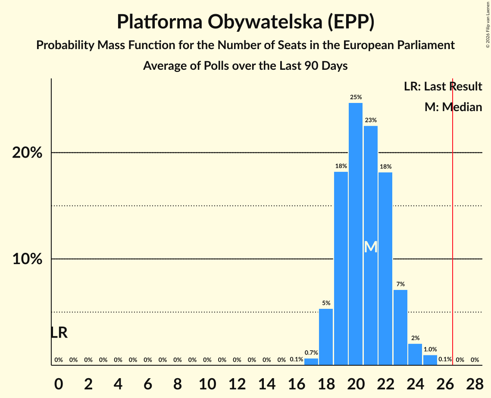

# Platforma Obywatelska (EPP)

<a href="#voting-intentions">Voting Intentions</a> | <a href="#seats">Seats</a>

## Voting Intentions

Last result: **0.0%** (General Election of 9 June 2024)

### Confidence Intervals

| Period     | Polling firm/Commissioner(s) | Median | 80% Confidence Interval | 90% Confidence Interval | 95% Confidence Interval | 99% Confidence Interval |
|:----------:|:----------------:|:-----------:|:-----------------------:|:-----------------------:|:-----------------------:|:-----------------------:|
| N/A | [Poll Average](average.html) | 32.8% | 29.7–36.7% | 29.0–37.5% | 28.5–38.2% | 27.4–39.4% |
| [11–16 March 2026](2026-03-16-OGB.html) | OGB | 36.4% | 34.4–38.3% | 33.9–38.9% | 33.4–39.4% | 32.5–40.4% |
| [13–15 March 2026](2026-03-15-UnitedSurveys.html) | United Surveys   WP.pl | 33.1% | 31.1–35.1% | 30.6–35.6% | 30.1–36.1% | 29.2–37.1% |
| [13–15 March 2026](2026-03-15-IBRiS.html) | IBRiS   Polsat News | 32.0% | 30.1–34.0% | 29.6–34.6% | 29.1–35.1% | 28.2–36.1% |
| [11–13 March 2026](2026-03-13-SocialChanges.html) | Social Changes   wPolsce24 | 30.7% | 29.0–32.6% | 28.5–33.1% | 28.0–33.5% | 27.2–34.4% |
| [11–12 March 2026](2026-03-12-Opinia24.html) | Opinia24   Fakty TVN and TVN24 | 35.7% | 33.7–37.7% | 33.1–38.3% | 32.6–38.8% | 31.7–39.8% |
| [9 March 2026](2026-03-09-IBRiS.html) | IBRiS   Onet | 32.9% | N/A | N/A | N/A | N/A |
| [2–4 March 2026](2026-03-04-Opinia24.html) | Opinia24 | 35.2% | N/A | N/A | N/A | N/A |
| [27 February–1 March 2026](2026-03-01-UnitedSurveys.html) | United Surveys   WP.pl | 32.1% | N/A | N/A | N/A | N/A |
| [27–28 February 2026](2026-02-28-IBRiS.html) | IBRiS   Rzeczpospolita | 31.7% | 29.8–33.7% | 29.3–34.2% | 28.9–34.7% | 28.0–35.6% |
| [25–26 February 2026](2026-02-26-InstytutBadańPollster.html) | Instytut Badań Pollster   SE.pl | 32.9% | 31.0–34.9% | 30.5–35.4% | 30.0–35.9% | 29.1–36.8% |
| [20–21 February 2026](2026-02-21-UnitedSurveys.html) | United Surveys   WP.pl | 32.1% | 30.1–34.1% | 29.6–34.7% | 29.1–35.2% | 28.2–36.1% |
| [19–20 February 2026](2026-02-20-Ipsos.html) | Ipsos   TVP Info | 30.2% | 28.3–32.2% | 27.8–32.8% | 27.3–33.3% | 26.4–34.2% |
| [6–17 February 2026](2026-02-17-SocialChanges.html) | Social Changes   wPolsce24 | 31.7% | 29.9–33.5% | 29.4–34.1% | 29.0–34.5% | 28.2–35.4% |
| [13–15 February 2026](2026-02-15-UnitedSurveys.html) | United Surveys   WP.pl | 32.5% | N/A | N/A | N/A | N/A |
| [9–14 February 2026](2026-02-14-OGB.html) | OGB | 33.1% | 31.2–35.0% | 30.7–35.6% | 30.2–36.0% | 29.3–37.0% |
| [1–8 February 2026](2026-02-08-SocialChanges.html) | Social Changes   wPolsce24 | 33.5% | N/A | N/A | N/A | N/A |
| [2–4 February 2026](2026-02-04-Opinia24.html) | Opinia24 | 33.0% | 31.0–35.0% | 30.5–35.6% | 30.0–36.1% | 29.1–37.1% |
| [30 January–1 February 2026](2026-02-01-UnitedSurveys.html) | United Surveys   WP.pl | 33.7% | N/A | N/A | N/A | N/A |
| [30–31 January 2026](2026-01-31-IBRiS.html) | IBRiS   Rzeczpospolita | 31.7% | N/A | N/A | N/A | N/A |
| [20–21 January 2026](2026-01-21-IBRiS.html) | IBRiS   Onet | 31.9% | N/A | N/A | N/A | N/A |
| [12–19 January 2026](2026-01-19-OGB.html) | OGB   Stan 360 | 37.5% | N/A | N/A | N/A | N/A |
| [16–18 January 2026](2026-01-18-UnitedSurveys.html) | United Surveys   WP.pl | 32.2% | N/A | N/A | N/A | N/A |
| [12–14 January 2026](2026-01-14-Opinia24.html) | Opinia24 | 31.3% | N/A | N/A | N/A | N/A |
| [2–4 January 2026](2026-01-04-UnitedSurveys.html) | United Surveys   WP.pl | 31.1% | N/A | N/A | N/A | N/A |
| [2–3 January 2026](2026-01-03-IBRiS.html) | IBRiS   Rzeczpospolita | 31.9% | N/A | N/A | N/A | N/A |
| [31 December 2025–1 January 2026](2026-01-01-InstytutBadańPollster.html) | Instytut Badań Pollster   SE.pl | 32.8% | N/A | N/A | N/A | N/A |
| [1–31 December 2025](2025-12-31-Opinia24.html) | Opinia24   Fakty TVN and TVN24 | 34.3% | N/A | N/A | N/A | N/A |
| [19–21 December 2025](2025-12-21-UnitedSurveys.html) | United Surveys   WP.pl | 32.7% | N/A | N/A | N/A | N/A |
| [1–20 December 2025](2025-12-20-SocialChanges.html) | Social Changes   wPolsce24 | 31.0% | N/A | N/A | N/A | N/A |
| [9–15 December 2025](2025-12-15-OGB.html) | OGB | 33.9% | N/A | N/A | N/A | N/A |
| [5–9 December 2025](2025-12-09-Ipsos.html) | Ipsos   Radio ZET | 30.6% | N/A | N/A | N/A | N/A |
| [5–8 December 2025](2025-12-08-UnitedSurveys.html) | United Surveys   WP.pl | 33.1% | N/A | N/A | N/A | N/A |
| [4–7 December 2025](2025-12-07-Opinia24.html) | Opinia24   Gazeta Wyborcza | 33.4% | N/A | N/A | N/A | N/A |
| [6–7 December 2025](2025-12-07-InstytutBadańPollster.html) | Instytut Badań Pollster   SE.pl | 33.2% | N/A | N/A | N/A | N/A |
| [4–6 December 2025](2025-12-06-IBRiS.html) | IBRiS   Polsat News | 31.4% | N/A | N/A | N/A | N/A |
| [1–3 December 2025](2025-12-03-Opinia24.html) | Opinia24 | 32.4% | N/A | N/A | N/A | N/A |
| [22–25 November 2025](2025-11-25-OGB.html) | OGB   Stan 360 | 36.5% | N/A | N/A | N/A | N/A |
| [21–23 November 2025](2025-11-23-UnitedSurveys.html) | United Surveys   WP.pl | 31.3% | N/A | N/A | N/A | N/A |
| [21–23 November 2025](2025-11-23-IBRiS.html) | IBRiS   Rzeczpospolita | 30.7% | N/A | N/A | N/A | N/A |
| [15–17 November 2025](2025-11-17-InstytutBadańPollster.html) | Instytut Badań Pollster   SE.pl | 32.2% | N/A | N/A | N/A | N/A |
| [1–15 November 2025](2025-11-15-SocialChanges.html) | Social Changes   wPolsce24 | 32.6% | N/A | N/A | N/A | N/A |
| [14–15 November 2025](2025-11-15-IBRiS.html) | IBRiS   Onet | 31.6% | N/A | N/A | N/A | N/A |
| [3–5 November 2025](2025-11-05-Opinia24.html) | Opinia24 | 34.5% | N/A | N/A | N/A | N/A |
| [31 October–3 November 2025](2025-11-03-ResearchPartner.html) | Research Partner | 30.8% | N/A | N/A | N/A | N/A |
| [1–31 October 2025](2025-10-31-SocialChanges.html) | Social Changes   wPolsce24 | 32.6% | N/A | N/A | N/A | N/A |
| [23–27 October 2025](2025-10-27-OGB.html) | OGB | 37.4% | N/A | N/A | N/A | N/A |
| [24–26 October 2025](2025-10-26-UnitedSurveys.html) | United Surveys   WP.pl | 31.7% | N/A | N/A | N/A | N/A |
| [24–25 October 2025](2025-10-25-IBRiS.html) | IBRiS   Rzeczpospolita | 30.8% | N/A | N/A | N/A | N/A |
| [15–22 October 2025](2025-10-22-OGB.html) | OGB | 34.7% | N/A | N/A | N/A | N/A |
| [13–14 October 2025](2025-10-14-Opinia24.html) | Opinia24   Fakty TVN and TVN24 | 28.6% | N/A | N/A | N/A | N/A |
| [8–13 October 2025](2025-10-13-OGB.html) | OGB | 31.0% | N/A | N/A | N/A | N/A |
| [10–12 October 2025](2025-10-12-UnitedSurveys.html) | United Surveys   WP.pl | 28.8% | N/A | N/A | N/A | N/A |
| [11–12 October 2025](2025-10-12-InstytutBadańPollster.html) | Instytut Badań Pollster   SE.pl | 29.5% | N/A | N/A | N/A | N/A |
| [8–9 October 2025](2025-10-09-IBRiS.html) | IBRiS   Onet | 29.4% | N/A | N/A | N/A | N/A |
| [6–8 October 2025](2025-10-08-Opinia24.html) | Opinia24 | 29.8% | N/A | N/A | N/A | N/A |
| [26–29 September 2025](2025-09-29-ResearchPartner.html) | Research Partner | 27.2% | N/A | N/A | N/A | N/A |
| [26–28 September 2025](2025-09-28-UnitedSurveys.html) | United Surveys   WP.pl | 27.3% | N/A | N/A | N/A | N/A |
| [27–28 September 2025](2025-09-28-InstytutBadańPollster.html) | Instytut Badań Pollster   SE.pl | 28.3% | N/A | N/A | N/A | N/A |
| [26–27 September 2025](2025-09-27-IBRiS.html) | IBRiS   Rzeczpospolita | 28.6% | N/A | N/A | N/A | N/A |
| [13–15 September 2025](2025-09-15-UnitedSurveys.html) | United Surveys   WP.pl | 31.2% | N/A | N/A | N/A | N/A |
| [12–15 September 2025](2025-09-15-SocialChanges.html) | Social Changes   wPolsce24 | 26.9% | N/A | N/A | N/A | N/A |
| [10–11 September 2025](2025-09-11-InstytutBadańPollster.html) | Instytut Badań Pollster   SE.pl | 29.0% | N/A | N/A | N/A | N/A |
| [2–9 September 2025](2025-09-09-OGB.html) | OGB | 31.4% | N/A | N/A | N/A | N/A |
| [29 August–5 September 2025](2025-09-05-SocialChanges.html) | Social Changes   wPolityce.pl | 28.2% | N/A | N/A | N/A | N/A |
| [1–3 September 2025](2025-09-03-Opinia24.html) | Opinia24 | 28.0% | N/A | N/A | N/A | N/A |
| [28 August–1 September 2025](2025-09-01-UnitedSurveys.html) | United Surveys   WP.pl | 27.4% | N/A | N/A | N/A | N/A |
| [30 August–1 September 2025](2025-09-01-InstytutBadańPollster.html) | Instytut Badań Pollster   SE.pl | 29.7% | N/A | N/A | N/A | N/A |
| [29–30 August 2025](2025-08-30-IBRiS.html) | IBRiS   Onet | 27.8% | N/A | N/A | N/A | N/A |
| [22–25 August 2025](2025-08-25-ResearchPartner.html) | Research Partner | 28.1% | N/A | N/A | N/A | N/A |
| [13–16 August 2025](2025-08-16-UnitedSurveys.html) | United Surveys   SE.pl | 28.2% | N/A | N/A | N/A | N/A |
| [6–13 August 2025](2025-08-13-OGB.html) | OGB | 30.4% | N/A | N/A | N/A | N/A |
| [8–9 August 2025](2025-08-09-InstytutBadańPollster.html) | Instytut Badań Pollster   SE.pl | 29.1% | N/A | N/A | N/A | N/A |
| [4–6 August 2025](2025-08-06-Opinia24.html) | Opinia24 | 27.6% | N/A | N/A | N/A | N/A |
| [25–28 July 2025](2025-07-28-InstytutBadańPollster.html) | Instytut Badań Pollster   SE.pl | 29.2% | N/A | N/A | N/A | N/A |
| [25–27 July 2025](2025-07-27-UnitedSurveys.html) | United Surveys   WP.pl | 24.7% | N/A | N/A | N/A | N/A |
| [25–26 July 2025](2025-07-26-IBRiS.html) | IBRiS   Rzeczpospolita | 28.6% | N/A | N/A | N/A | N/A |
| [24–25 July 2025](2025-07-25-Ipsos.html) | Ipsos   TVP Info | 23.4% | N/A | N/A | N/A | N/A |
| [18–21 July 2025](2025-07-21-ResearchPartner.html) | Research Partner | 29.0% | N/A | N/A | N/A | N/A |
| [11–13 July 2025](2025-07-13-UnitedSurveys.html) | United Surveys   WP.pl | 28.5% | N/A | N/A | N/A | N/A |
| [4–11 July 2025](2025-07-11-OGB.html) | OGB | 28.8% | N/A | N/A | N/A | N/A |
| [7–9 July 2025](2025-07-09-Opinia24.html) | Opinia24 | 28.1% | N/A | N/A | N/A | N/A |
| [8–9 July 2025](2025-07-09-InstytutBadańPollster.html) | Instytut Badań Pollster   SE.pl | 28.4% | N/A | N/A | N/A | N/A |
| [27–29 June 2025](2025-06-29-UnitedSurveys.html) | United Surveys   WP.pl | 25.1% | N/A | N/A | N/A | N/A |
| [26–27 June 2025](2025-06-27-IBRiS.html) | IBRiS   Rzeczpospolita | 25.7% | N/A | N/A | N/A | N/A |
| [23–24 June 2025](2025-06-24-IBRiS.html) | IBRiS   Onet | 24.2% | N/A | N/A | N/A | N/A |
| [12–14 June 2025](2025-06-14-IBRiS.html) | IBRiS   Polsat News | 28.2% | N/A | N/A | N/A | N/A |
| [9–12 June 2025](2025-06-12-Opinia24.html) | Opinia24 | 27.6% | N/A | N/A | N/A | N/A |
| [6–8 June 2025](2025-06-08-UnitedSurveys.html) | United Surveys   WP.pl | 31.3% | N/A | N/A | N/A | N/A |
| [6–7 June 2025](2025-06-07-IBRiS.html) | IBRiS   Rzeczpospolita | 30.6% | N/A | N/A | N/A | N/A |
| [5–6 June 2025](2025-06-06-InstytutBadańPollster.html) | Instytut Badań Pollster   Najwyższy Czas | 28.1% | N/A | N/A | N/A | N/A |
| [28–29 May 2025](2025-05-29-SocialChanges.html) | Social Changes   Radio Wnet | 27.6% | N/A | N/A | N/A | N/A |
| [27–28 May 2025](2025-05-28-ResearchPartner.html) | Research Partner | 30.0% | N/A | N/A | N/A | N/A |
| [25–27 May 2025](2025-05-27-Opinia24.html) | Opinia24   RMF FM | 30.7% | N/A | N/A | N/A | N/A |
| [26–27 May 2025](2025-05-27-IBRiS.html) | IBRiS   Onet | 31.3% | N/A | N/A | N/A | N/A |
| [23–26 May 2025](2025-05-26-Opinia24.html) | Opinia24   Radio Zet | 30.6% | N/A | N/A | N/A | N/A |
| [25 May 2025](2025-05-25-InstytutBadańPollster.html) | Instytut Badań Pollster   SE.pl | 29.1% | N/A | N/A | N/A | N/A |
| [12–14 May 2025](2025-05-14-Opinia24.html) | Opinia24   RMF FM | 28.3% | N/A | N/A | N/A | N/A |
| [12–13 May 2025](2025-05-13-IBRiS.html) | IBRiS   Onet | 31.0% | N/A | N/A | N/A | N/A |
| [7–8 May 2025](2025-05-08-InstytutBadańPollster.html) | Instytut Badań Pollster   SE.pl | 28.3% | N/A | N/A | N/A | N/A |
| [7 May 2025](2025-05-07-UnitedSurveys.html) | United Surveys   WP.pl | 31.1% | N/A | N/A | N/A | N/A |
| [6–7 May 2025](2025-05-07-Opinia24.html) | Opinia24   Fakty TVN and TVN24 | 31.3% | N/A | N/A | N/A | N/A |
| [1–30 April 2025](2025-04-30-Opinia24.html) | Opinia24   Fakty TVN and TVN24 | 28.4% | N/A | N/A | N/A | N/A |
| [28–29 April 2025](2025-04-29-UnitedSurveys.html) | United Surveys   WP.pl | 29.9% | N/A | N/A | N/A | N/A |
| [28–29 April 2025](2025-04-29-InstytutBadańPollster.html) | Instytut Badań Pollster   SE.pl | 28.5% | N/A | N/A | N/A | N/A |
| [23–25 April 2025](2025-04-25-OGB.html) | OGB | 30.3% | N/A | N/A | N/A | N/A |
| [24 April 2025](2025-04-24-Opinia24.html) | Opinia24   Fakty TVN and TVN24 | 28.5% | N/A | N/A | N/A | N/A |
| [17–19 April 2025](2025-04-19-UnitedSurveys.html) | United Surveys   WP.pl | 28.4% | N/A | N/A | N/A | N/A |
| [14–16 April 2025](2025-04-16-Opinia24.html) | Opinia24 | 32.8% | N/A | N/A | N/A | N/A |
| [14–16 April 2025](2025-04-16-Ipsos.html) | Ipsos   TVP Info | 28.3% | N/A | N/A | N/A | N/A |
| [15–16 April 2025](2025-04-16-InstytutBadańPollster.html) | Instytut Badań Pollster   SE.pl | 29.9% | N/A | N/A | N/A | N/A |
| [9–14 April 2025](2025-04-14-OGB.html) | OGB | 31.0% | N/A | N/A | N/A | N/A |
| [7–9 April 2025](2025-04-09-Opinia24.html) | Opinia24   RMF FM | 31.8% | N/A | N/A | N/A | N/A |
| [4–6 April 2025](2025-04-06-UnitedSurveys.html) | United Surveys   WP.pl | 34.4% | N/A | N/A | N/A | N/A |
| [2–6 April 2025](2025-04-06-Opinia24.html) | Opinia24   Radio ZET | 28.7% | N/A | N/A | N/A | N/A |
| [3–4 April 2025](2025-04-04-InstytutBadańPollster.html) | Instytut Badań Pollster   TV Republika | 30.0% | N/A | N/A | N/A | N/A |
| [31 March–1 April 2025](2025-04-01-InstytutBadańPollster.html) | Instytut Badań Pollster   SE.pl | 29.4% | N/A | N/A | N/A | N/A |
| [21–24 March 2025](2025-03-24-ResearchPartner.html) | Research Partner | 31.3% | N/A | N/A | N/A | N/A |
| [21–23 March 2025](2025-03-23-UnitedSurveys.html) | United Surveys   WP.pl | 32.8% | N/A | N/A | N/A | N/A |
| [17–21 March 2025](2025-03-21-Opinia24.html) | Opinia24 | 33.3% | N/A | N/A | N/A | N/A |
| [10–13 March 2025](2025-03-13-Opinia24.html) | Opinia24   RMF FM | 32.3% | N/A | N/A | N/A | N/A |
| [11–13 March 2025](2025-03-13-Ipsos.html) | Ipsos   TVP | 30.6% | N/A | N/A | N/A | N/A |
| [7–9 March 2025](2025-03-09-UnitedSurveys.html) | United Surveys   WP.pl | 31.9% | N/A | N/A | N/A | N/A |
| [7–9 March 2025](2025-03-09-InstytutBadańPollster.html) | Instytut Badań Pollster   SE.pl | 30.0% | N/A | N/A | N/A | N/A |
| [7–8 March 2025](2025-03-08-IBRiS.html) | IBRiS   Rzeczpospolita | 32.2% | N/A | N/A | N/A | N/A |
| [1–28 February 2025](2025-02-28-SocialChanges.html) | Social Changes | 31.0% | N/A | N/A | N/A | N/A |
| [19–26 February 2025](2025-02-26-OGB.html) | OGB | 33.2% | N/A | N/A | N/A | N/A |
| [21–24 February 2025](2025-02-24-UnitedSurveys.html) | United Surveys   WP.pl | 31.1% | N/A | N/A | N/A | N/A |
| [21–24 February 2025](2025-02-24-ResearchPartner.html) | Research Partner   Ariadna | 28.9% | N/A | N/A | N/A | N/A |
| [17–21 February 2025](2025-02-21-Opinia24.html) | Opinia24 | 29.6% | N/A | N/A | N/A | N/A |
| [19–21 February 2025](2025-02-21-Ipsos.html) | Ipsos   Liberté! | 26.4% | N/A | N/A | N/A | N/A |
| [17–18 February 2025](2025-02-18-Ipsos.html) | Ipsos   TVP | 28.1% | N/A | N/A | N/A | N/A |
| [10–13 February 2025](2025-02-13-Opinia24.html) | Opinia24   RMF FM | 30.3% | N/A | N/A | N/A | N/A |
| [8–10 February 2025](2025-02-10-InstytutBadańPollster.html) | Instytut Badań Pollster   Super Express | 28.5% | N/A | N/A | N/A | N/A |
| [8–9 February 2025](2025-02-09-UnitedSurveys.html) | United Surveys   WP.pl | 32.0% | N/A | N/A | N/A | N/A |
| [7–8 February 2025](2025-02-08-IBRiS.html) | IBRiS   Rzeczpospolita | 32.0% | N/A | N/A | N/A | N/A |
| [31 January–2 February 2025](2025-02-02-IBRiS.html) | IBRiS   Onet.pl | 30.9% | N/A | N/A | N/A | N/A |
| [23–29 January 2025](2025-01-29-Opinia24.html) | Opinia24   Radio ZET | 31.6% | N/A | N/A | N/A | N/A |
| [24–27 January 2025](2025-01-27-ResearchPartner.html) | Research Partner   Ariadna | 29.0% | N/A | N/A | N/A | N/A |
| [24–26 January 2025](2025-01-26-UnitedSurveys.html) | United Surveys   WP.pl | 31.6% | N/A | N/A | N/A | N/A |
| [20–24 January 2025](2025-01-24-Opinia24.html) | Opinia24 | 29.7% | N/A | N/A | N/A | N/A |
| [21–23 January 2025](2025-01-23-OGB.html) | OGB | 30.1% | N/A | N/A | N/A | N/A |
| [17–18 January 2025](2025-01-18-InstytutBadańPollster.html) | Instytut Badań Pollster   Super Express | 28.8% | N/A | N/A | N/A | N/A |
| [14–16 January 2025](2025-01-16-Ipsos.html) | Ipsos   TVP | 28.7% | N/A | N/A | N/A | N/A |
| [10–12 January 2025](2025-01-12-UnitedSurveys.html) | United Surveys   WP.pl | 28.1% | N/A | N/A | N/A | N/A |
| [10–11 January 2025](2025-01-11-IBRiS.html) | IBRiS   Rzeczpospolita | 29.8% | N/A | N/A | N/A | N/A |
| [7–9 January 2025](2025-01-09-Opinia24.html) | Opinia24   RMF FM | 31.3% | N/A | N/A | N/A | N/A |
| [20–22 December 2024](2024-12-22-UnitedSurveys.html) | United Surveys   WP.pl | 32.0% | N/A | N/A | N/A | N/A |
| [17–18 December 2024](2024-12-18-Ipsos.html) | Ipsos   TVP | 28.2% | N/A | N/A | N/A | N/A |
| [17 December 2024](2024-12-17-Opinia24.html) | Opinia24   RMF FM | 31.4% | N/A | N/A | N/A | N/A |
| [10–11 December 2024](2024-12-11-InstytutBadańPollster.html) | Instytut Badań Pollster   Super Express | 30.2% | N/A | N/A | N/A | N/A |
| [6–8 December 2024](2024-12-08-UnitedSurveys.html) | United Surveys   WP.pl | 32.2% | N/A | N/A | N/A | N/A |
| [6–7 December 2024](2024-12-07-IBRiS.html) | IBRiS   Rzeczpospolita | 33.6% | N/A | N/A | N/A | N/A |
| [3–6 December 2024](2024-12-06-Opinia24.html) | Opinia24 | 30.6% | N/A | N/A | N/A | N/A |
| [25–26 November 2024](2024-11-26-InstytutBadańPollster.html) | Instytut Badań Pollster   Super Express | 30.0% | N/A | N/A | N/A | N/A |
| [22–24 November 2024](2024-11-24-UnitedSurveys.html) | United Surveys   WP.pl | 32.5% | N/A | N/A | N/A | N/A |
| [24 November 2024](2024-11-24-Opinia24.html) | Opinia24   TVN24 | 32.8% | N/A | N/A | N/A | N/A |
| [13–18 November 2024](2024-11-18-Opinia24.html) | Opinia24   Radio ZET | 30.9% | N/A | N/A | N/A | N/A |
| [12–15 November 2024](2024-11-15-Opinia24.html) | Opinia24 | 32.8% | N/A | N/A | N/A | N/A |
| [12–13 November 2024](2024-11-13-InstytutBadańPollster.html) | Instytut Badań Pollster   Super Express | 29.4% | N/A | N/A | N/A | N/A |
| [8–11 November 2024](2024-11-11-ResearchPartner.html) | Research Partner   Ariadna | 32.1% | N/A | N/A | N/A | N/A |
| [11–10 November 2024](2024-11-10-UnitedSurveys.html) | United Surveys   WP.pl | 30.9% | N/A | N/A | N/A | N/A |
| [25–27 October 2024](2024-10-27-UnitedSurveys.html) | United Surveys   WP.pl | 33.1% | N/A | N/A | N/A | N/A |
| [25–26 October 2024](2024-10-26-IBRiS.html) | IBRiS   Rzeczpospolita | 31.3% | N/A | N/A | N/A | N/A |
| [15–18 October 2024](2024-10-18-Opinia24.html) | Opinia24   TVN24 | 32.0% | N/A | N/A | N/A | N/A |
| [11–14 October 2024](2024-10-14-IBRiS.html) | IBRiS   Wydarzenia Polsat | 31.5% | N/A | N/A | N/A | N/A |
| [7–9 October 2024](2024-10-09-Opinia24.html) | Opinia24   Gazeta Wyborcza | 33.4% | N/A | N/A | N/A | N/A |
| [5–6 October 2024](2024-10-06-InstytutBadańPollster.html) | Instytut Badań Pollster   Super Express | 29.0% | N/A | N/A | N/A | N/A |
| [29–30 September 2024](2024-09-30-InstytutBadańPollster.html) | Instytut Badań Pollster   TVP Info | 30.9% | N/A | N/A | N/A | N/A |
| [27–29 September 2024](2024-09-29-UnitedSurveys.html) | United Surveys   WP.pl | 32.9% | N/A | N/A | N/A | N/A |
| [20–21 September 2024](2024-09-21-UnitedSurveys.html) | United Surveys   WP.pl | 33.6% | N/A | N/A | N/A | N/A |
| [10–18 September 2024](2024-09-18-Ipsos.html) | Ipsos   Krytyka Polityczna | 28.2% | N/A | N/A | N/A | N/A |
| [13–16 September 2024](2024-09-16-ResearchPartner.html) | Research Partner   Ariadna | 29.9% | N/A | N/A | N/A | N/A |
| [9–10 September 2024](2024-09-10-IBRiS.html) | IBRiS   Wydarzenia Polsat | 32.0% | N/A | N/A | N/A | N/A |
| [30–31 August 2024](2024-08-31-IBRiS.html) | IBRiS   Rzeczpospolita | 33.0% | N/A | N/A | N/A | N/A |
| [5–8 August 2024](2024-08-08-Opinia24.html) | Opinia24 | 32.4% | N/A | N/A | N/A | N/A |
| [8 August 2024](2024-08-08-InstytutBadańPollster.html) | Instytut Badań Pollster   Super Express | 28.7% | N/A | N/A | N/A | N/A |
| [26–28 July 2024](2024-07-28-UnitedSurveys.html) | United Surveys   WP.pl | 32.1% | N/A | N/A | N/A | N/A |
| [24–25 July 2024](2024-07-25-IBRiS.html) | IBRiS   Onet.pl | 30.5% | N/A | N/A | N/A | N/A |
| [19–22 July 2024](2024-07-22-ResearchPartner.html) | Research Partner   Ariadna | 30.3% | N/A | N/A | N/A | N/A |
| [8–11 July 2024](2024-07-11-Opinia24.html) | Opinia24 | 29.9% | N/A | N/A | N/A | N/A |
| [8–9 July 2024](2024-07-09-InstytutBadańPollster.html) | Instytut Badań Pollster   Super Express | 31.9% | N/A | N/A | N/A | N/A |
| [5–8 July 2024](2024-07-08-UnitedSurveys.html) | United Surveys   WP.pl | 32.9% | N/A | N/A | N/A | N/A |
| [21–23 June 2024](2024-06-23-UnitedSurveys.html) | United Surveys   WP.pl | 32.1% | N/A | N/A | N/A | N/A |
| [21–22 June 2024](2024-06-22-IBRiS.html) | IBRiS   Rzeczpospolita | 31.9% | N/A | N/A | N/A | N/A |
| [23–21 June 2024](2024-06-21-UnitedSurveys.html) | United Surveys   WP.pl | 32.1% | N/A | N/A | N/A | N/A |
| [18–19 June 2024](2024-06-19-IBRiS.html) | IBRiS   Onet.pl | 33.8% | N/A | N/A | N/A | N/A |
| [10–11 June 2024](2024-06-11-Opinia24.html) | Opinia24 | 32.2% | N/A | N/A | N/A | N/A |

### Probability Mass Function

The following table shows the probability mass function per percentage block of voting intentions for the [poll average](average.html) for Platforma Obywatelska (EPP).

| Voting Intentions | Probability | Accumulated | Special Marks |
|:-----------------:|:-----------:|:-----------:|:-------------:|
| 0.0–0.5% | 0% | 100% | Last Result |
| 0.5–1.5% | 0% | 100% |  |
| 1.5–2.5% | 0% | 100% |  |
| 2.5–3.5% | 0% | 100% |  |
| 3.5–4.5% | 0% | 100% |  |
| 4.5–5.5% | 0% | 100% |  |
| 5.5–6.5% | 0% | 100% |  |
| 6.5–7.5% | 0% | 100% |  |
| 7.5–8.5% | 0% | 100% |  |
| 8.5–9.5% | 0% | 100% |  |
| 9.5–10.5% | 0% | 100% |  |
| 10.5–11.5% | 0% | 100% |  |
| 11.5–12.5% | 0% | 100% |  |
| 12.5–13.5% | 0% | 100% |  |
| 13.5–14.5% | 0% | 100% |  |
| 14.5–15.5% | 0% | 100% |  |
| 15.5–16.5% | 0% | 100% |  |
| 16.5–17.5% | 0% | 100% |  |
| 17.5–18.5% | 0% | 100% |  |
| 18.5–19.5% | 0% | 100% |  |
| 19.5–20.5% | 0% | 100% |  |
| 20.5–21.5% | 0% | 100% |  |
| 21.5–22.5% | 0% | 100% |  |
| 22.5–23.5% | 0% | 100% |  |
| 23.5–24.5% | 0% | 100% |  |
| 24.5–25.5% | 0% | 100% |  |
| 25.5–26.5% | 0.1% | 100% |  |
| 26.5–27.5% | 0.6% | 99.9% |  |
| 27.5–28.5% | 2% | 99.3% |  |
| 28.5–29.5% | 6% | 97% |  |
| 29.5–30.5% | 10% | 92% |  |
| 30.5–31.5% | 14% | 82% |  |
| 31.5–32.5% | 15% | 68% |  |
| 32.5–33.5% | 13% | 53% | Median |
| 33.5–34.5% | 11% | 40% |  |
| 34.5–35.5% | 10% | 29% |  |
| 35.5–36.5% | 8% | 19% |  |
| 36.5–37.5% | 6% | 11% |  |
| 37.5–38.5% | 3% | 5% |  |
| 38.5–39.5% | 1.3% | 2% |  |
| 39.5–40.5% | 0.3% | 0.4% |  |
| 40.5–41.5% | 0.1% | 0.1% |  |
| 41.5–42.5% | 0% | 0% |  |

## Seats

Last result: **0** seats (General Election of 9 June 2024)

### Confidence Intervals

| Period     | Polling firm/Commissioner(s) | Median | 80% Confidence Interval | 90% Confidence Interval | 95% Confidence Interval | 99% Confidence Interval |
|:----------:|:----------------:|:------:|:-----------------------:|:-----------------------:|:-----------------------:|:-----------------------:|
| N/A | [Poll Average](average.html) | 20 | 18–23 | 18–23 | 17–24 | 17–25 |
| [11–16 March 2026](2026-03-16-OGB.html) | OGB | 22 | 21–23 | 20–24 | 20–25 | 19–25 |
| [13–15 March 2026](2026-03-15-UnitedSurveys.html) | United Surveys   WP.pl | 21 | 19–22 | 18–22 | 18–22 | 18–23 |
| [13–15 March 2026](2026-03-15-IBRiS.html) | IBRiS   Polsat News | 19 | 18–21 | 18–21 | 18–21 | 17–22 |
| [11–13 March 2026](2026-03-13-SocialChanges.html) | Social Changes   wPolsce24 | 19 | 18–20 | 18–21 | 18–21 | 17–22 |
| [11–12 March 2026](2026-03-12-Opinia24.html) | Opinia24   Fakty TVN and TVN24 | 22 | 21–24 | 21–24 | 20–25 | 20–25 |
| [9 March 2026](2026-03-09-IBRiS.html) | IBRiS   Onet |  |  |  |  |  |
| [2–4 March 2026](2026-03-04-Opinia24.html) | Opinia24 |  |  |  |  |  |
| [27 February–1 March 2026](2026-03-01-UnitedSurveys.html) | United Surveys   WP.pl |  |  |  |  |  |
| [27–28 February 2026](2026-02-28-IBRiS.html) | IBRiS   Rzeczpospolita | 19 | 18–21 | 17–21 | 17–22 | 17–22 |
| [25–26 February 2026](2026-02-26-InstytutBadańPollster.html) | Instytut Badań Pollster   SE.pl | 21 | 19–21 | 19–22 | 19–22 | 18–23 |
| [20–21 February 2026](2026-02-21-UnitedSurveys.html) | United Surveys   WP.pl | 20 | 18–21 | 18–21 | 18–21 | 17–22 |
| [19–20 February 2026](2026-02-20-Ipsos.html) | Ipsos   TVP Info | 19 | 17–20 | 17–20 | 17–21 | 16–21 |
| [6–17 February 2026](2026-02-17-SocialChanges.html) | Social Changes   wPolsce24 | 20 | 18–21 | 18–21 | 18–21 | 17–22 |
| [13–15 February 2026](2026-02-15-UnitedSurveys.html) | United Surveys   WP.pl |  |  |  |  |  |
| [9–14 February 2026](2026-02-14-OGB.html) | OGB | 20 | 19–22 | 19–22 | 19–22 | 18–23 |
| [1–8 February 2026](2026-02-08-SocialChanges.html) | Social Changes   wPolsce24 |  |  |  |  |  |
| [2–4 February 2026](2026-02-04-Opinia24.html) | Opinia24 | 21 | 19–22 | 19–22 | 18–22 | 17–23 |
| [30 January–1 February 2026](2026-02-01-UnitedSurveys.html) | United Surveys   WP.pl |  |  |  |  |  |
| [30–31 January 2026](2026-01-31-IBRiS.html) | IBRiS   Rzeczpospolita |  |  |  |  |  |
| [20–21 January 2026](2026-01-21-IBRiS.html) | IBRiS   Onet |  |  |  |  |  |
| [12–19 January 2026](2026-01-19-OGB.html) | OGB   Stan 360 |  |  |  |  |  |
| [16–18 January 2026](2026-01-18-UnitedSurveys.html) | United Surveys   WP.pl |  |  |  |  |  |
| [12–14 January 2026](2026-01-14-Opinia24.html) | Opinia24 |  |  |  |  |  |
| [2–4 January 2026](2026-01-04-UnitedSurveys.html) | United Surveys   WP.pl |  |  |  |  |  |
| [2–3 January 2026](2026-01-03-IBRiS.html) | IBRiS   Rzeczpospolita |  |  |  |  |  |
| [31 December 2025–1 January 2026](2026-01-01-InstytutBadańPollster.html) | Instytut Badań Pollster   SE.pl |  |  |  |  |  |
| [1–31 December 2025](2025-12-31-Opinia24.html) | Opinia24   Fakty TVN and TVN24 |  |  |  |  |  |
| [19–21 December 2025](2025-12-21-UnitedSurveys.html) | United Surveys   WP.pl |  |  |  |  |  |
| [1–20 December 2025](2025-12-20-SocialChanges.html) | Social Changes   wPolsce24 |  |  |  |  |  |
| [9–15 December 2025](2025-12-15-OGB.html) | OGB |  |  |  |  |  |
| [5–9 December 2025](2025-12-09-Ipsos.html) | Ipsos   Radio ZET |  |  |  |  |  |
| [5–8 December 2025](2025-12-08-UnitedSurveys.html) | United Surveys   WP.pl |  |  |  |  |  |
| [4–7 December 2025](2025-12-07-Opinia24.html) | Opinia24   Gazeta Wyborcza |  |  |  |  |  |
| [6–7 December 2025](2025-12-07-InstytutBadańPollster.html) | Instytut Badań Pollster   SE.pl |  |  |  |  |  |
| [4–6 December 2025](2025-12-06-IBRiS.html) | IBRiS   Polsat News |  |  |  |  |  |
| [1–3 December 2025](2025-12-03-Opinia24.html) | Opinia24 |  |  |  |  |  |
| [22–25 November 2025](2025-11-25-OGB.html) | OGB   Stan 360 |  |  |  |  |  |
| [21–23 November 2025](2025-11-23-UnitedSurveys.html) | United Surveys   WP.pl |  |  |  |  |  |
| [21–23 November 2025](2025-11-23-IBRiS.html) | IBRiS   Rzeczpospolita |  |  |  |  |  |
| [15–17 November 2025](2025-11-17-InstytutBadańPollster.html) | Instytut Badań Pollster   SE.pl |  |  |  |  |  |
| [1–15 November 2025](2025-11-15-SocialChanges.html) | Social Changes   wPolsce24 |  |  |  |  |  |
| [14–15 November 2025](2025-11-15-IBRiS.html) | IBRiS   Onet |  |  |  |  |  |
| [3–5 November 2025](2025-11-05-Opinia24.html) | Opinia24 |  |  |  |  |  |
| [31 October–3 November 2025](2025-11-03-ResearchPartner.html) | Research Partner |  |  |  |  |  |
| [1–31 October 2025](2025-10-31-SocialChanges.html) | Social Changes   wPolsce24 |  |  |  |  |  |
| [23–27 October 2025](2025-10-27-OGB.html) | OGB |  |  |  |  |  |
| [24–26 October 2025](2025-10-26-UnitedSurveys.html) | United Surveys   WP.pl |  |  |  |  |  |
| [24–25 October 2025](2025-10-25-IBRiS.html) | IBRiS   Rzeczpospolita |  |  |  |  |  |
| [15–22 October 2025](2025-10-22-OGB.html) | OGB |  |  |  |  |  |
| [13–14 October 2025](2025-10-14-Opinia24.html) | Opinia24   Fakty TVN and TVN24 |  |  |  |  |  |
| [8–13 October 2025](2025-10-13-OGB.html) | OGB |  |  |  |  |  |
| [10–12 October 2025](2025-10-12-UnitedSurveys.html) | United Surveys   WP.pl |  |  |  |  |  |
| [11–12 October 2025](2025-10-12-InstytutBadańPollster.html) | Instytut Badań Pollster   SE.pl |  |  |  |  |  |
| [8–9 October 2025](2025-10-09-IBRiS.html) | IBRiS   Onet |  |  |  |  |  |
| [6–8 October 2025](2025-10-08-Opinia24.html) | Opinia24 |  |  |  |  |  |
| [26–29 September 2025](2025-09-29-ResearchPartner.html) | Research Partner |  |  |  |  |  |
| [26–28 September 2025](2025-09-28-UnitedSurveys.html) | United Surveys   WP.pl |  |  |  |  |  |
| [27–28 September 2025](2025-09-28-InstytutBadańPollster.html) | Instytut Badań Pollster   SE.pl |  |  |  |  |  |
| [26–27 September 2025](2025-09-27-IBRiS.html) | IBRiS   Rzeczpospolita |  |  |  |  |  |
| [13–15 September 2025](2025-09-15-UnitedSurveys.html) | United Surveys   WP.pl |  |  |  |  |  |
| [12–15 September 2025](2025-09-15-SocialChanges.html) | Social Changes   wPolsce24 |  |  |  |  |  |
| [10–11 September 2025](2025-09-11-InstytutBadańPollster.html) | Instytut Badań Pollster   SE.pl |  |  |  |  |  |
| [2–9 September 2025](2025-09-09-OGB.html) | OGB |  |  |  |  |  |
| [29 August–5 September 2025](2025-09-05-SocialChanges.html) | Social Changes   wPolityce.pl |  |  |  |  |  |
| [1–3 September 2025](2025-09-03-Opinia24.html) | Opinia24 |  |  |  |  |  |
| [28 August–1 September 2025](2025-09-01-UnitedSurveys.html) | United Surveys   WP.pl |  |  |  |  |  |
| [30 August–1 September 2025](2025-09-01-InstytutBadańPollster.html) | Instytut Badań Pollster   SE.pl |  |  |  |  |  |
| [29–30 August 2025](2025-08-30-IBRiS.html) | IBRiS   Onet |  |  |  |  |  |
| [22–25 August 2025](2025-08-25-ResearchPartner.html) | Research Partner |  |  |  |  |  |
| [13–16 August 2025](2025-08-16-UnitedSurveys.html) | United Surveys   SE.pl |  |  |  |  |  |
| [6–13 August 2025](2025-08-13-OGB.html) | OGB |  |  |  |  |  |
| [8–9 August 2025](2025-08-09-InstytutBadańPollster.html) | Instytut Badań Pollster   SE.pl |  |  |  |  |  |
| [4–6 August 2025](2025-08-06-Opinia24.html) | Opinia24 |  |  |  |  |  |
| [25–28 July 2025](2025-07-28-InstytutBadańPollster.html) | Instytut Badań Pollster   SE.pl |  |  |  |  |  |
| [25–27 July 2025](2025-07-27-UnitedSurveys.html) | United Surveys   WP.pl |  |  |  |  |  |
| [25–26 July 2025](2025-07-26-IBRiS.html) | IBRiS   Rzeczpospolita |  |  |  |  |  |
| [24–25 July 2025](2025-07-25-Ipsos.html) | Ipsos   TVP Info |  |  |  |  |  |
| [18–21 July 2025](2025-07-21-ResearchPartner.html) | Research Partner |  |  |  |  |  |
| [11–13 July 2025](2025-07-13-UnitedSurveys.html) | United Surveys   WP.pl |  |  |  |  |  |
| [4–11 July 2025](2025-07-11-OGB.html) | OGB |  |  |  |  |  |
| [7–9 July 2025](2025-07-09-Opinia24.html) | Opinia24 |  |  |  |  |  |
| [8–9 July 2025](2025-07-09-InstytutBadańPollster.html) | Instytut Badań Pollster   SE.pl |  |  |  |  |  |
| [27–29 June 2025](2025-06-29-UnitedSurveys.html) | United Surveys   WP.pl |  |  |  |  |  |
| [26–27 June 2025](2025-06-27-IBRiS.html) | IBRiS   Rzeczpospolita |  |  |  |  |  |
| [23–24 June 2025](2025-06-24-IBRiS.html) | IBRiS   Onet |  |  |  |  |  |
| [12–14 June 2025](2025-06-14-IBRiS.html) | IBRiS   Polsat News |  |  |  |  |  |
| [9–12 June 2025](2025-06-12-Opinia24.html) | Opinia24 |  |  |  |  |  |
| [6–8 June 2025](2025-06-08-UnitedSurveys.html) | United Surveys   WP.pl |  |  |  |  |  |
| [6–7 June 2025](2025-06-07-IBRiS.html) | IBRiS   Rzeczpospolita |  |  |  |  |  |
| [5–6 June 2025](2025-06-06-InstytutBadańPollster.html) | Instytut Badań Pollster   Najwyższy Czas |  |  |  |  |  |
| [28–29 May 2025](2025-05-29-SocialChanges.html) | Social Changes   Radio Wnet |  |  |  |  |  |
| [27–28 May 2025](2025-05-28-ResearchPartner.html) | Research Partner |  |  |  |  |  |
| [25–27 May 2025](2025-05-27-Opinia24.html) | Opinia24   RMF FM |  |  |  |  |  |
| [26–27 May 2025](2025-05-27-IBRiS.html) | IBRiS   Onet |  |  |  |  |  |
| [23–26 May 2025](2025-05-26-Opinia24.html) | Opinia24   Radio Zet |  |  |  |  |  |
| [25 May 2025](2025-05-25-InstytutBadańPollster.html) | Instytut Badań Pollster   SE.pl |  |  |  |  |  |
| [12–14 May 2025](2025-05-14-Opinia24.html) | Opinia24   RMF FM |  |  |  |  |  |
| [12–13 May 2025](2025-05-13-IBRiS.html) | IBRiS   Onet |  |  |  |  |  |
| [7–8 May 2025](2025-05-08-InstytutBadańPollster.html) | Instytut Badań Pollster   SE.pl |  |  |  |  |  |
| [7 May 2025](2025-05-07-UnitedSurveys.html) | United Surveys   WP.pl |  |  |  |  |  |
| [6–7 May 2025](2025-05-07-Opinia24.html) | Opinia24   Fakty TVN and TVN24 |  |  |  |  |  |
| [1–30 April 2025](2025-04-30-Opinia24.html) | Opinia24   Fakty TVN and TVN24 |  |  |  |  |  |
| [28–29 April 2025](2025-04-29-UnitedSurveys.html) | United Surveys   WP.pl |  |  |  |  |  |
| [28–29 April 2025](2025-04-29-InstytutBadańPollster.html) | Instytut Badań Pollster   SE.pl |  |  |  |  |  |
| [23–25 April 2025](2025-04-25-OGB.html) | OGB |  |  |  |  |  |
| [24 April 2025](2025-04-24-Opinia24.html) | Opinia24   Fakty TVN and TVN24 |  |  |  |  |  |
| [17–19 April 2025](2025-04-19-UnitedSurveys.html) | United Surveys   WP.pl |  |  |  |  |  |
| [14–16 April 2025](2025-04-16-Opinia24.html) | Opinia24 |  |  |  |  |  |
| [14–16 April 2025](2025-04-16-Ipsos.html) | Ipsos   TVP Info |  |  |  |  |  |
| [15–16 April 2025](2025-04-16-InstytutBadańPollster.html) | Instytut Badań Pollster   SE.pl |  |  |  |  |  |
| [9–14 April 2025](2025-04-14-OGB.html) | OGB |  |  |  |  |  |
| [7–9 April 2025](2025-04-09-Opinia24.html) | Opinia24   RMF FM |  |  |  |  |  |
| [4–6 April 2025](2025-04-06-UnitedSurveys.html) | United Surveys   WP.pl |  |  |  |  |  |
| [2–6 April 2025](2025-04-06-Opinia24.html) | Opinia24   Radio ZET |  |  |  |  |  |
| [3–4 April 2025](2025-04-04-InstytutBadańPollster.html) | Instytut Badań Pollster   TV Republika |  |  |  |  |  |
| [31 March–1 April 2025](2025-04-01-InstytutBadańPollster.html) | Instytut Badań Pollster   SE.pl |  |  |  |  |  |
| [21–24 March 2025](2025-03-24-ResearchPartner.html) | Research Partner |  |  |  |  |  |
| [21–23 March 2025](2025-03-23-UnitedSurveys.html) | United Surveys   WP.pl |  |  |  |  |  |
| [17–21 March 2025](2025-03-21-Opinia24.html) | Opinia24 |  |  |  |  |  |
| [10–13 March 2025](2025-03-13-Opinia24.html) | Opinia24   RMF FM |  |  |  |  |  |
| [11–13 March 2025](2025-03-13-Ipsos.html) | Ipsos   TVP |  |  |  |  |  |
| [7–9 March 2025](2025-03-09-UnitedSurveys.html) | United Surveys   WP.pl |  |  |  |  |  |
| [7–9 March 2025](2025-03-09-InstytutBadańPollster.html) | Instytut Badań Pollster   SE.pl |  |  |  |  |  |
| [7–8 March 2025](2025-03-08-IBRiS.html) | IBRiS   Rzeczpospolita |  |  |  |  |  |
| [1–28 February 2025](2025-02-28-SocialChanges.html) | Social Changes |  |  |  |  |  |
| [19–26 February 2025](2025-02-26-OGB.html) | OGB |  |  |  |  |  |
| [21–24 February 2025](2025-02-24-UnitedSurveys.html) | United Surveys   WP.pl |  |  |  |  |  |
| [21–24 February 2025](2025-02-24-ResearchPartner.html) | Research Partner   Ariadna |  |  |  |  |  |
| [17–21 February 2025](2025-02-21-Opinia24.html) | Opinia24 |  |  |  |  |  |
| [19–21 February 2025](2025-02-21-Ipsos.html) | Ipsos   Liberté! |  |  |  |  |  |
| [17–18 February 2025](2025-02-18-Ipsos.html) | Ipsos   TVP |  |  |  |  |  |
| [10–13 February 2025](2025-02-13-Opinia24.html) | Opinia24   RMF FM |  |  |  |  |  |
| [8–10 February 2025](2025-02-10-InstytutBadańPollster.html) | Instytut Badań Pollster   Super Express |  |  |  |  |  |
| [8–9 February 2025](2025-02-09-UnitedSurveys.html) | United Surveys   WP.pl |  |  |  |  |  |
| [7–8 February 2025](2025-02-08-IBRiS.html) | IBRiS   Rzeczpospolita |  |  |  |  |  |
| [31 January–2 February 2025](2025-02-02-IBRiS.html) | IBRiS   Onet.pl |  |  |  |  |  |
| [23–29 January 2025](2025-01-29-Opinia24.html) | Opinia24   Radio ZET |  |  |  |  |  |
| [24–27 January 2025](2025-01-27-ResearchPartner.html) | Research Partner   Ariadna |  |  |  |  |  |
| [24–26 January 2025](2025-01-26-UnitedSurveys.html) | United Surveys   WP.pl |  |  |  |  |  |
| [20–24 January 2025](2025-01-24-Opinia24.html) | Opinia24 |  |  |  |  |  |
| [21–23 January 2025](2025-01-23-OGB.html) | OGB |  |  |  |  |  |
| [17–18 January 2025](2025-01-18-InstytutBadańPollster.html) | Instytut Badań Pollster   Super Express |  |  |  |  |  |
| [14–16 January 2025](2025-01-16-Ipsos.html) | Ipsos   TVP |  |  |  |  |  |
| [10–12 January 2025](2025-01-12-UnitedSurveys.html) | United Surveys   WP.pl |  |  |  |  |  |
| [10–11 January 2025](2025-01-11-IBRiS.html) | IBRiS   Rzeczpospolita |  |  |  |  |  |
| [7–9 January 2025](2025-01-09-Opinia24.html) | Opinia24   RMF FM |  |  |  |  |  |
| [20–22 December 2024](2024-12-22-UnitedSurveys.html) | United Surveys   WP.pl |  |  |  |  |  |
| [17–18 December 2024](2024-12-18-Ipsos.html) | Ipsos   TVP |  |  |  |  |  |
| [17 December 2024](2024-12-17-Opinia24.html) | Opinia24   RMF FM |  |  |  |  |  |
| [10–11 December 2024](2024-12-11-InstytutBadańPollster.html) | Instytut Badań Pollster   Super Express |  |  |  |  |  |
| [6–8 December 2024](2024-12-08-UnitedSurveys.html) | United Surveys   WP.pl |  |  |  |  |  |
| [6–7 December 2024](2024-12-07-IBRiS.html) | IBRiS   Rzeczpospolita |  |  |  |  |  |
| [3–6 December 2024](2024-12-06-Opinia24.html) | Opinia24 |  |  |  |  |  |
| [25–26 November 2024](2024-11-26-InstytutBadańPollster.html) | Instytut Badań Pollster   Super Express |  |  |  |  |  |
| [22–24 November 2024](2024-11-24-UnitedSurveys.html) | United Surveys   WP.pl |  |  |  |  |  |
| [24 November 2024](2024-11-24-Opinia24.html) | Opinia24   TVN24 |  |  |  |  |  |
| [13–18 November 2024](2024-11-18-Opinia24.html) | Opinia24   Radio ZET |  |  |  |  |  |
| [12–15 November 2024](2024-11-15-Opinia24.html) | Opinia24 |  |  |  |  |  |
| [12–13 November 2024](2024-11-13-InstytutBadańPollster.html) | Instytut Badań Pollster   Super Express |  |  |  |  |  |
| [8–11 November 2024](2024-11-11-ResearchPartner.html) | Research Partner   Ariadna |  |  |  |  |  |
| [11–10 November 2024](2024-11-10-UnitedSurveys.html) | United Surveys   WP.pl |  |  |  |  |  |
| [25–27 October 2024](2024-10-27-UnitedSurveys.html) | United Surveys   WP.pl |  |  |  |  |  |
| [25–26 October 2024](2024-10-26-IBRiS.html) | IBRiS   Rzeczpospolita |  |  |  |  |  |
| [15–18 October 2024](2024-10-18-Opinia24.html) | Opinia24   TVN24 |  |  |  |  |  |
| [11–14 October 2024](2024-10-14-IBRiS.html) | IBRiS   Wydarzenia Polsat |  |  |  |  |  |
| [7–9 October 2024](2024-10-09-Opinia24.html) | Opinia24   Gazeta Wyborcza |  |  |  |  |  |
| [5–6 October 2024](2024-10-06-InstytutBadańPollster.html) | Instytut Badań Pollster   Super Express |  |  |  |  |  |
| [29–30 September 2024](2024-09-30-InstytutBadańPollster.html) | Instytut Badań Pollster   TVP Info |  |  |  |  |  |
| [27–29 September 2024](2024-09-29-UnitedSurveys.html) | United Surveys   WP.pl |  |  |  |  |  |
| [20–21 September 2024](2024-09-21-UnitedSurveys.html) | United Surveys   WP.pl |  |  |  |  |  |
| [10–18 September 2024](2024-09-18-Ipsos.html) | Ipsos   Krytyka Polityczna |  |  |  |  |  |
| [13–16 September 2024](2024-09-16-ResearchPartner.html) | Research Partner   Ariadna |  |  |  |  |  |
| [9–10 September 2024](2024-09-10-IBRiS.html) | IBRiS   Wydarzenia Polsat |  |  |  |  |  |
| [30–31 August 2024](2024-08-31-IBRiS.html) | IBRiS   Rzeczpospolita |  |  |  |  |  |
| [5–8 August 2024](2024-08-08-Opinia24.html) | Opinia24 |  |  |  |  |  |
| [8 August 2024](2024-08-08-InstytutBadańPollster.html) | Instytut Badań Pollster   Super Express |  |  |  |  |  |
| [26–28 July 2024](2024-07-28-UnitedSurveys.html) | United Surveys   WP.pl |  |  |  |  |  |
| [24–25 July 2024](2024-07-25-IBRiS.html) | IBRiS   Onet.pl |  |  |  |  |  |
| [19–22 July 2024](2024-07-22-ResearchPartner.html) | Research Partner   Ariadna |  |  |  |  |  |
| [8–11 July 2024](2024-07-11-Opinia24.html) | Opinia24 |  |  |  |  |  |
| [8–9 July 2024](2024-07-09-InstytutBadańPollster.html) | Instytut Badań Pollster   Super Express |  |  |  |  |  |
| [5–8 July 2024](2024-07-08-UnitedSurveys.html) | United Surveys   WP.pl |  |  |  |  |  |
| [21–23 June 2024](2024-06-23-UnitedSurveys.html) | United Surveys   WP.pl |  |  |  |  |  |
| [21–22 June 2024](2024-06-22-IBRiS.html) | IBRiS   Rzeczpospolita |  |  |  |  |  |
| [23–21 June 2024](2024-06-21-UnitedSurveys.html) | United Surveys   WP.pl |  |  |  |  |  |
| [18–19 June 2024](2024-06-19-IBRiS.html) | IBRiS   Onet.pl |  |  |  |  |  |
| [10–11 June 2024](2024-06-11-Opinia24.html) | Opinia24 |  |  |  |  |  |

### Probability Mass Function

The following table shows the probability mass function per seat for the [poll average](average.html) for Platforma Obywatelska (EPP).

| Number of Seats | Probability | Accumulated | Special Marks |
|:---------------:|:-----------:|:-----------:|:-------------:|
| 0 | 0% | 100% | Last Result |
| 1 | 0% | 100% |  |
| 2 | 0% | 100% |  |
| 3 | 0% | 100% |  |
| 4 | 0% | 100% |  |
| 5 | 0% | 100% |  |
| 6 | 0% | 100% |  |
| 7 | 0% | 100% |  |
| 8 | 0% | 100% |  |
| 9 | 0% | 100% |  |
| 10 | 0% | 100% |  |
| 11 | 0% | 100% |  |
| 12 | 0% | 100% |  |
| 13 | 0% | 100% |  |
| 14 | 0% | 100% |  |
| 15 | 0% | 100% |  |
| 16 | 0.3% | 100% |  |
| 17 | 3% | 99.7% |  |
| 18 | 9% | 97% |  |
| 19 | 22% | 88% |  |
| 20 | 19% | 67% | Median |
| 21 | 20% | 47% |  |
| 22 | 17% | 27% |  |
| 23 | 7% | 10% |  |
| 24 | 2% | 3% |  |
| 25 | 1.0% | 1.1% |  |
| 26 | 0.1% | 0.1% |  |
| 27 | 0% | 0% | Majority |

