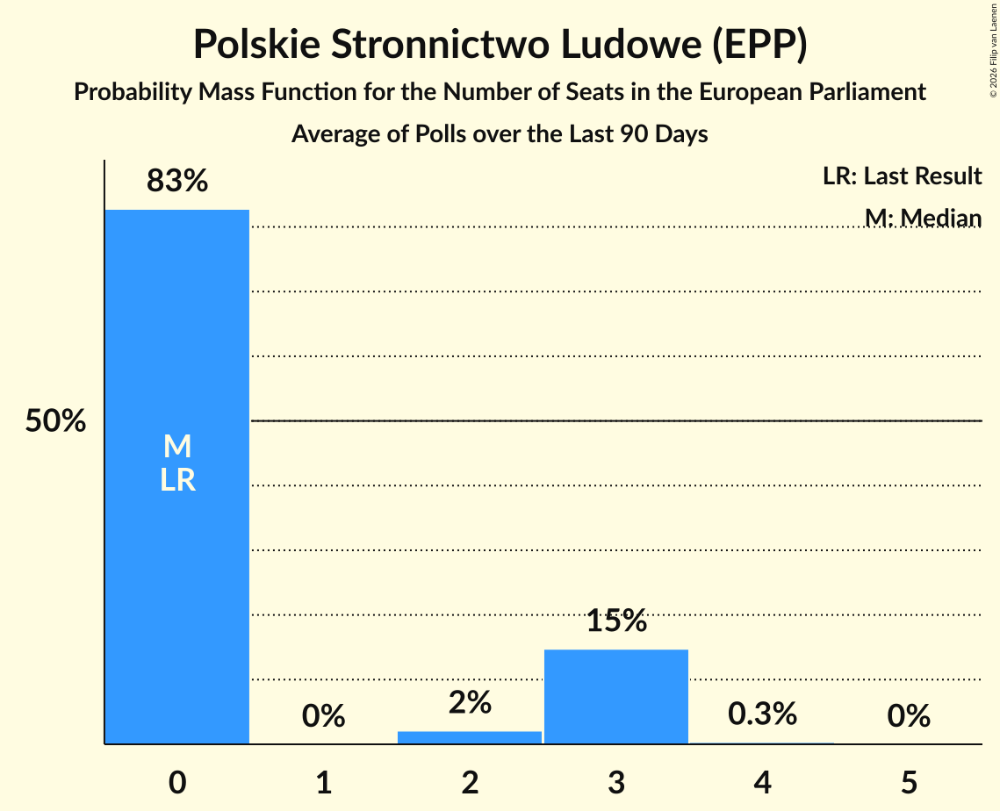

# Polskie Stronnictwo Ludowe (EPP)

<a href="#voting-intentions">Voting Intentions</a> | <a href="#seats">Seats</a>

## Voting Intentions

Last result: **0.0%** (General Election of 26 May 2019)

### Confidence Intervals

| Period     | Polling firm/Commissioner(s) | Median | 80% Confidence Interval | 90% Confidence Interval | 95% Confidence Interval | 99% Confidence Interval |
|:----------:|:----------------:|:-----------:|:-----------------------:|:-----------------------:|:-----------------------:|:-----------------------:|
| N/A | [Poll Average](average.html) | 5.6% | 4.5–6.7% | 4.3–7.0% | 4.1–7.3% | 3.7–7.9% |
| [23–24 April 2024](2024-04-24-IBRiS.html) | IBRiS   Rzeczpospolita | 6.2% | 5.3–7.2% | 5.1–7.5% | 4.9–7.8% | 4.5–8.3% |
| [19–21 April 2024](2024-04-21-UnitedSurveys.html) | United Surveys   WP.pl | 5.6% | 4.8–6.6% | 4.5–6.9% | 4.3–7.2% | 4.0–7.7% |
| [18–19 April 2024](2024-04-19-InstytutBadańPollster.html) | Instytut Badań Pollster   Super Express | 4.8% | 4.1–5.8% | 3.9–6.1% | 3.7–6.3% | 3.4–6.8% |
| [8–9 April 2024](2024-04-09-Opinia24.html) | Opinia24 | 5.4% | 4.6–6.4% | 4.3–6.7% | 4.2–7.0% | 3.8–7.5% |
| [3–5 April 2024](2024-04-05-OGB.html) | OGB   StanPolityki.pl | 5.6% | 4.8–6.6% | 4.5–6.9% | 4.3–7.2% | 4.0–7.7% |
| [4 April 2024](2024-04-04-IBRiS.html) | IBRiS   Onet.pl | 5.6% | N/A | N/A | N/A | N/A |
| [2–3 April 2024](2024-04-03-Opinia24.html) | Opinia24 | 6.3% | N/A | N/A | N/A | N/A |
| [25–26 March 2024](2024-03-26-Opinia24.html) | Opinia24 | 7.3% | 6.3–8.5% | 6.1–8.8% | 5.8–9.1% | 5.4–9.7% |
| [22–23 March 2024](2024-03-23-IBRiS.html) | IBRiS   Rzeczpospolita | 5.1% | 4.3–6.0% | 4.1–6.3% | 3.9–6.6% | 3.6–7.0% |
| [16–17 March 2024](2024-03-17-InstytutBadańPollster.html) | Instytut Badań Pollster   Super Express | 5.9% | 5.0–6.9% | 4.8–7.2% | 4.6–7.5% | 4.3–8.0% |
| [8–11 March 2024](2024-03-11-ResearchPartner.html) | Research Partner   Ariadna | 4.4% | 3.7–5.3% | 3.5–5.6% | 3.3–5.8% | 3.0–6.3% |
| [6–7 March 2024](2024-03-07-Opinia24.html) | Opinia24 | 6.4% | N/A | N/A | N/A | N/A |
| [23 February–5 March 2024](2024-03-05-Ipsos.html) | Ipsos   Euronews | 7.1% | 6.2–8.3% | 5.9–8.6% | 5.7–8.9% | 5.2–9.4% |
| [26–28 February 2024](2024-02-28-Opinia24.html) | Opinia24   TOK FM | 5.2% | 4.4–6.2% | 4.2–6.5% | 4.0–6.8% | 3.6–7.3% |
| [22–26 February 2024](2024-02-26-Ipsos.html) | Ipsos   OKO.press and TOK FM | 5.8% | N/A | N/A | N/A | N/A |
| [23–25 February 2024](2024-02-25-UnitedSurveys.html) | United Surveys   WP.pl | 6.9% | 6.0–8.0% | 5.7–8.4% | 5.5–8.7% | 5.1–9.2% |
| [23–24 February 2024](2024-02-24-IBRiS.html) | IBRiS   Rzeczpospolita | 6.7% | N/A | N/A | N/A | N/A |
| [15–16 February 2024](2024-02-16-InstytutBadańPollster.html) | Instytut Badań Pollster   TVP | 7.4% | N/A | N/A | N/A | N/A |
| [12–15 February 2024](2024-02-15-OGB.html) | OGB | 6.6% | 5.7–7.7% | 5.4–8.0% | 5.2–8.3% | 4.8–8.9% |
| [2–13 February 2024](2024-02-13-Opinia24.html) | Opinia24   More in Common Polska | 6.4% | 5.8–7.2% | 5.6–7.4% | 5.4–7.6% | 5.1–8.0% |
| [9–12 February 2024](2024-02-12-ResearchPartner.html) | Research Partner   Ariadna | 6.3% | N/A | N/A | N/A | N/A |
| [10–11 February 2024](2024-02-11-UnitedSurveys.html) | United Surveys   WP.pl | 7.0% | N/A | N/A | N/A | N/A |
| [11 February 2024](2024-02-11-InstytutBadańPollster.html) | Instytut Badań Pollster   SE.pl | 6.3% | N/A | N/A | N/A | N/A |
| [6–7 February 2024](2024-02-07-Opinia24.html) | Opinia24 | 7.7% | N/A | N/A | N/A | N/A |
| [24–31 January 2024](2024-01-31-PortlandCommunications.html) | Portland Communications | 6.8% | 5.9–7.9% | 5.7–8.3% | 5.4–8.5% | 5.0–9.1% |
| [26–28 January 2024](2024-01-28-UnitedSurveys.html) | United Surveys   WP.pl | 8.7% | N/A | N/A | N/A | N/A |
| [19–22 January 2024](2024-01-22-ResearchPartner.html) | Research Partner   Ariadna | 6.2% | N/A | N/A | N/A | N/A |
| [12–14 January 2024](2024-01-14-UnitedSurveys.html) | United Surveys   WP.pl | 7.7% | N/A | N/A | N/A | N/A |
| [13–14 January 2024](2024-01-14-InstytutBadańPollster.html) | Instytut Badań Pollster   SE.pl | 7.3% | N/A | N/A | N/A | N/A |
| [12–13 January 2024](2024-01-13-IBRiS.html) | IBRiS   Rzeczpospolita | 7.5% | N/A | N/A | N/A | N/A |
| [8–9 January 2024](2024-01-09-Opinia24.html) | Opinia24 | 8.2% | N/A | N/A | N/A | N/A |
| [5–8 January 2024](2024-01-08-IBRiS.html) | IBRiS   Onet.pl | 6.4% | N/A | N/A | N/A | N/A |
| [15–17 December 2023](2023-12-17-UnitedSurveys.html) | United Surveys   WP.pl | 8.4% | 7.4–9.6% | 7.1–10.0% | 6.8–10.3% | 6.4–10.9% |
| [17 December 2023](2023-12-17-InstytutBadańPollster.html) | Instytut Badań Pollster   SE.pl | 7.3% | 6.3–8.4% | 6.1–8.7% | 5.8–9.0% | 5.4–9.6% |
| [1–8 December 2023](2023-12-08-Ipsos.html) | Ipsos   More in Common Polska | 6.9% | 6.0–8.0% | 5.7–8.4% | 5.5–8.7% | 5.1–9.2% |
| [5–6 December 2023](2023-12-06-Opinia24.html) | Opinia24 | 8.2% | 7.2–9.4% | 6.9–9.8% | 6.6–10.1% | 6.2–10.7% |
| [1–3 December 2023](2023-12-03-UnitedSurveys.html) | United Surveys   WP.pl | 7.1% | 6.2–8.3% | 5.9–8.6% | 5.7–8.9% | 5.2–9.4% |
| [17–19 November 2023](2023-11-19-UnitedSurveys.html) | United Surveys   WP.pl | 6.6% | 5.7–7.7% | 5.4–8.0% | 5.2–8.3% | 4.8–8.9% |
| [10–13 November 2023](2023-11-13-SocialChanges.html) | Social Changes   wPolityce.pl | 6.0% | 5.2–7.0% | 4.9–7.3% | 4.7–7.6% | 4.4–8.1% |
| [7–8 November 2023](2023-11-08-InstytutBadańPollster.html) | Instytut Badań Pollster   SE.pl | 7.2% | 6.2–8.4% | 6.0–8.7% | 5.8–9.0% | 5.3–9.5% |
| [3–5 November 2023](2023-11-05-UnitedSurveys.html) | United Surveys   WP.pl | 7.3% | 6.3–8.5% | 6.1–8.8% | 5.8–9.1% | 5.4–9.7% |
| [20–22 October 2023](2023-10-22-UnitedSurveys.html) | United Surveys   WP.pl | 8.3% | 7.3–9.5% | 7.0–9.9% | 6.7–10.2% | 6.3–10.8% |
| [11–13 October 2023](2023-10-13-IBSP.html) | IBSP   StanPolityki.pl | 0.0% | N/A | N/A | N/A | N/A |
| [11–12 October 2023](2023-10-12-PGBOpinium.html) | PGB Opinium | 0.0% | N/A | N/A | N/A | N/A |
| [10–12 October 2023](2023-10-12-Kantar.html) | Kantar   Fakty TVN and TVN24 | 0.0% | N/A | N/A | N/A | N/A |
| [11–12 October 2023](2023-10-12-InstytutBadańPollster.html) | Instytut Badań Pollster   SE.pl | 0.0% | N/A | N/A | N/A | N/A |
| [10–11 October 2023](2023-10-11-IBRiS.html) | IBRiS   Onet.pl | 0.0% | N/A | N/A | N/A | N/A |
| [8–10 October 2023](2023-10-10-UnitedSurveys.html) | United Surveys   WP.pl | 0.0% | N/A | N/A | N/A | N/A |
| [9–10 October 2023](2023-10-10-SocialChanges.html) | Social Changes   wPolityce.pl | 0.0% | N/A | N/A | N/A | N/A |
| [6–10 October 2023](2023-10-10-Ipsos.html) | Ipsos   OKO.press and TOK FM | 0.0% | N/A | N/A | N/A | N/A |
| [9–10 October 2023](2023-10-10-IBRiS.html) | IBRiS   Rzeczpospolita | 0.0% | N/A | N/A | N/A | N/A |
| [6–9 October 2023](2023-10-09-ResearchPartner.html) | Research Partner   Ariadna | 0.0% | N/A | N/A | N/A | N/A |
| [6–7 October 2023](2023-10-07-InstytutBadańPollster.html) | Instytut Badań Pollster   SE.pl | 0.0% | N/A | N/A | N/A | N/A |
| [5–7 October 2023](2023-10-07-IBRiS.html) | IBRiS   Wydarzenia | 0.0% | N/A | N/A | N/A | N/A |
| [5–6 October 2023](2023-10-06-Estymator.html) | Estymator   DoRzeczy.pl | 0.0% | N/A | N/A | N/A | N/A |
| [3–4 October 2023](2023-10-04-PGBOpinium.html) | PGB Opinium | 0.0% | N/A | N/A | N/A | N/A |
| [3–4 October 2023](2023-10-04-Opinia24.html) | Opinia24   Gazeta Wyborcza | 0.0% | N/A | N/A | N/A | N/A |
| [2–4 October 2023](2023-10-04-Kantar.html) | Kantar   Fakty TVN and TVN24 | 0.0% | N/A | N/A | N/A | N/A |
| [3–4 October 2023](2023-10-04-IBRiS.html) | IBRiS   Onet.pl | 0.0% | N/A | N/A | N/A | N/A |
| [2 October 2023](2023-10-02-UnitedSurveys.html) | United Surveys   DGP and RMF FM | 0.0% | N/A | N/A | N/A | N/A |
| [29 September–2 October 2023](2023-10-02-SocialChanges.html) | Social Changes   wPolityce.pl | 0.0% | N/A | N/A | N/A | N/A |
| [30 September–1 October 2023](2023-10-01-UnitedSurveys.html) | United Surveys   WP.pl | 0.0% | N/A | N/A | N/A | N/A |
| [29–30 September 2023](2023-09-30-Estymator.html) | Estymator   DoRzeczy.pl | 0.0% | N/A | N/A | N/A | N/A |
| [27 September 2023](2023-09-27-IBRiS.html) | IBRiS   Onet.pl | 0.0% | N/A | N/A | N/A | N/A |
| [22–25 September 2023](2023-09-25-SocialChanges.html) | Social Changes   wPolityce.pl | 0.0% | N/A | N/A | N/A | N/A |
| [22–25 September 2023](2023-09-25-Ipsos.html) | Ipsos   OKO.press and TOK FM | 0.0% | N/A | N/A | N/A | N/A |
| [22–24 September 2023](2023-09-24-UnitedSurveys.html) | United Surveys   WP.pl | 0.0% | N/A | N/A | N/A | N/A |
| [22–23 September 2023](2023-09-23-Estymator.html) | Estymator   DoRzeczy.pl | 0.0% | N/A | N/A | N/A | N/A |
| [21–22 September 2023](2023-09-22-InstytutBadańPollster.html) | Instytut Badań Pollster   SE.pl | 0.0% | N/A | N/A | N/A | N/A |
| [20 September 2023](2023-09-20-IBRiS.html) | IBRiS   Onet.pl | 0.0% | N/A | N/A | N/A | N/A |
| [18–19 September 2023](2023-09-19-UnitedSurveys.html) | United Surveys   DGP and RMF FM | 0.0% | N/A | N/A | N/A | N/A |
| [15–18 September 2023](2023-09-18-SocialChanges.html) | Social Changes   wPolityce.pl | 0.0% | N/A | N/A | N/A | N/A |
| [15–18 September 2023](2023-09-18-ResearchPartner.html) | Research Partner   Ariadna | 0.0% | N/A | N/A | N/A | N/A |
| [16–17 September 2023](2023-09-17-UnitedSurveys.html) | United Surveys   WP.pl | 0.0% | N/A | N/A | N/A | N/A |
| [15–17 September 2023](2023-09-17-IBRiS.html) | IBRiS   Wydarzenia | 0.0% | N/A | N/A | N/A | N/A |
| [15–16 September 2023](2023-09-16-Estymator.html) | Estymator   DoRzeczy.pl | 0.0% | N/A | N/A | N/A | N/A |
| [13 September 2023](2023-09-13-IBRiS.html) | IBRiS   Onet.pl | 0.0% | N/A | N/A | N/A | N/A |
| [11 September 2023](2023-09-11-UnitedSurveys.html) | United Surveys   WP.pl | 0.0% | N/A | N/A | N/A | N/A |
| [8–11 September 2023](2023-09-11-SocialChanges.html) | Social Changes   wPolityce.pl | 0.0% | N/A | N/A | N/A | N/A |
| [8–11 September 2023](2023-09-11-Ipsos.html) | Ipsos   OKO.press and TOK FM | 0.0% | N/A | N/A | N/A | N/A |
| [7–11 September 2023](2023-09-11-IBSP.html) | IBSP   StanPolityki.pl | 0.0% | N/A | N/A | N/A | N/A |
| [8–9 September 2023](2023-09-09-Estymator.html) | Estymator   DoRzeczy.pl | 0.0% | N/A | N/A | N/A | N/A |
| [5–6 September 2023](2023-09-06-Kantar.html) | Kantar   Fakty TVN and TVN24 | 0.0% | N/A | N/A | N/A | N/A |
| [4–5 September 2023](2023-09-05-PGBOpinium.html) | PGB Opinium | 0.0% | N/A | N/A | N/A | N/A |
| [1–4 September 2023](2023-09-04-SocialChanges.html) | Social Changes   wPolityce.pl | 0.0% | N/A | N/A | N/A | N/A |
| [1–4 September 2023](2023-09-04-ResearchPartner.html) | Research Partner   Ariadna | 0.0% | N/A | N/A | N/A | N/A |
| [1–3 September 2023](2023-09-03-UnitedSurveys.html) | United Surveys   WP.pl | 0.0% | N/A | N/A | N/A | N/A |
| [29–31 August 2023](2023-08-31-Mands.html) | Mands   Wiadomości TVP | 0.0% | N/A | N/A | N/A | N/A |
| [30–31 August 2023](2023-08-31-IBRiS.html) | IBRiS   Onet.pl | 0.0% | N/A | N/A | N/A | N/A |
| [25–28 August 2023](2023-08-28-SocialChanges.html) | Social Changes   wPolityce.pl | 0.0% | N/A | N/A | N/A | N/A |
| [25–26 August 2023](2023-08-26-IBRiS.html) | IBRiS   Rzeczpospolita | 0.0% | N/A | N/A | N/A | N/A |
| [23–24 August 2023](2023-08-24-InstytutBadańPollster.html) | Instytut Badań Pollster   SE.pl | 0.0% | N/A | N/A | N/A | N/A |
| [18–23 August 2023](2023-08-23-KantarPublic.html) | Kantar Public | 0.0% | N/A | N/A | N/A | N/A |
| [18–21 August 2023](2023-08-21-SocialChanges.html) | Social Changes   wPolityce.pl | 0.0% | N/A | N/A | N/A | N/A |
| [18–21 August 2023](2023-08-21-IBRiS.html) | IBRiS   Wydarzenia | 0.0% | N/A | N/A | N/A | N/A |
| [18–20 August 2023](2023-08-20-UnitedSurveys.html) | United Surveys   WP.pl | 0.0% | N/A | N/A | N/A | N/A |
| [11–14 August 2023](2023-08-14-SocialChanges.html) | Social Changes   wPolityce.pl | 0.0% | N/A | N/A | N/A | N/A |
| [11–14 August 2023](2023-08-14-ResearchPartner.html) | Research Partner   Ariadna | 0.0% | N/A | N/A | N/A | N/A |
| [28–31 July 2023](2023-07-31-SocialChanges.html) | Social Changes   wPolityce.pl | 0.0% | N/A | N/A | N/A | N/A |
| [29–30 July 2023](2023-07-30-UnitedSurveys.html) | United Surveys   WP.pl | 0.0% | N/A | N/A | N/A | N/A |
| [29–30 July 2023](2023-07-30-ResearchPartner.html) | Research Partner   Ariadna | 0.0% | N/A | N/A | N/A | N/A |
| [28–29 July 2023](2023-07-29-IBRiS.html) | IBRiS   Rzeczpospolita | 0.0% | N/A | N/A | N/A | N/A |
| [21–24 July 2023](2023-07-24-SocialChanges.html) | Social Changes   wPolityce.pl | 0.0% | N/A | N/A | N/A | N/A |
| [19–20 July 2023](2023-07-20-IBRiS.html) | IBRiS   Onet.pl | 0.0% | N/A | N/A | N/A | N/A |
| [14–19 July 2023](2023-07-19-KantarPublic.html) | Kantar Public | 0.0% | N/A | N/A | N/A | N/A |
| [14–17 July 2023](2023-07-17-SocialChanges.html) | Social Changes   wPolityce.pl | 0.0% | N/A | N/A | N/A | N/A |
| [14–17 July 2023](2023-07-17-ResearchPartner.html) | Research Partner   Ariadna | 0.0% | N/A | N/A | N/A | N/A |
| [17 July 2023](2023-07-17-InstytutBadańPollster.html) | Instytut Badań Pollster   SE.pl | 0.0% | N/A | N/A | N/A | N/A |
| [13–14 July 2023](2023-07-14-IBRiS.html) | IBRiS   Wydarzenia | 0.0% | N/A | N/A | N/A | N/A |
| [11–13 July 2023](2023-07-13-PGBOpinium.html) | PGB Opinium | 0.0% | N/A | N/A | N/A | N/A |
| [6–10 July 2023](2023-07-10-IBSP.html) | IBSP   StanPolityki.pl | 0.0% | N/A | N/A | N/A | N/A |
| [7–9 July 2023](2023-07-09-UnitedSurveys.html) | United Surveys   WP.pl | 0.0% | N/A | N/A | N/A | N/A |
| [5–7 July 2023](2023-07-07-Estymator.html) | Estymator   DoRzeczy.pl | 0.0% | N/A | N/A | N/A | N/A |
| [26–28 June 2023](2023-06-28-IPSOS.html) | IPSOS   DoRzeczy.pl | 0.0% | N/A | N/A | N/A | N/A |
| [23–27 June 2023](2023-06-27-SocialChanges.html) | Social Changes   wPolityce.pl | 0.0% | N/A | N/A | N/A | N/A |
| [23–25 June 2023](2023-06-25-UnitedSurveys.html) | United Surveys   WP.pl | 0.0% | N/A | N/A | N/A | N/A |
| [19–22 June 2023](2023-06-22-Ipsos.html) | Ipsos   OKO.press and TOK FM | 0.0% | N/A | N/A | N/A | N/A |
| [16–19 June 2023](2023-06-19-KantarPublic.html) | Kantar Public | 0.0% | N/A | N/A | N/A | N/A |
| [16–18 June 2023](2023-06-18-InstytutBadańPollster.html) | Instytut Badań Pollster   SE.pl | 0.0% | N/A | N/A | N/A | N/A |
| [14–15 June 2023](2023-06-15-IBRiS.html) | IBRiS   Rzeczpospolita | 0.0% | N/A | N/A | N/A | N/A |
| [9–12 June 2023](2023-06-12-SocialChanges.html) | Social Changes   wPolityce.pl | 0.0% | N/A | N/A | N/A | N/A |
| [9–12 June 2023](2023-06-12-ResearchPartner.html) | Research Partner   Ariadna | 0.0% | N/A | N/A | N/A | N/A |
| [9–11 June 2023](2023-06-11-UnitedSurveys.html) | United Surveys   WP.pl | 0.0% | N/A | N/A | N/A | N/A |
| [6–11 June 2023](2023-06-11-IBRiS.html) | IBRiS   Wydarzenia | 0.0% | N/A | N/A | N/A | N/A |
| [5–7 June 2023](2023-06-07-IPSOS.html) | IPSOS   DoRzeczy.pl | 0.0% | N/A | N/A | N/A | N/A |
| [4–6 June 2023](2023-06-06-PGBOpinium.html) | PGB Opinium | 0.0% | N/A | N/A | N/A | N/A |
| [5–6 June 2023](2023-06-06-Kantar.html) | Kantar   Fakty TVN and TVN24 | 0.0% | N/A | N/A | N/A | N/A |
| [6 June 2023](2023-06-06-IBRiS.html) | IBRiS   Onet.pl | 0.0% | N/A | N/A | N/A | N/A |
| [2–5 June 2023](2023-06-05-SocialChanges.html) | Social Changes   wPolityce.pl | 0.0% | N/A | N/A | N/A | N/A |
| [2–4 June 2023](2023-06-04-UnitedSurveys.html) | United Surveys   DGP and RMF FM | 0.0% | N/A | N/A | N/A | N/A |
| [4 June 2023](2023-06-04-IBRiS.html) | IBRiS   Radio ZET | 0.0% | N/A | N/A | N/A | N/A |
| [30–31 May 2023](2023-05-31-InstytutBadańPollster.html) | Instytut Badań Pollster   SE.pl | 0.0% | N/A | N/A | N/A | N/A |
| [29–30 May 2023](2023-05-30-CBMIndicator.html) | CBM Indicator   TVP | 0.0% | N/A | N/A | N/A | N/A |
| [26–29 May 2023](2023-05-29-SocialChanges.html) | Social Changes   wPolityce.pl | 0.0% | N/A | N/A | N/A | N/A |
| [26–29 May 2023](2023-05-29-ResearchPartner.html) | Research Partner   Ariadna | 0.0% | N/A | N/A | N/A | N/A |
| [26–28 May 2023](2023-05-28-UnitedSurveys.html) | United Surveys   WP.pl | 0.0% | N/A | N/A | N/A | N/A |
| [26–27 May 2023](2023-05-27-IBRiS.html) | IBRiS   Rzeczpospolita | 0.0% | N/A | N/A | N/A | N/A |
| [19–21 May 2023](2023-05-21-UnitedSurveys.html) | United Surveys   DGP and RMF FM | 0.0% | N/A | N/A | N/A | N/A |
| [19–21 May 2023](2023-05-21-IBRiS.html) | IBRiS   Wydarzenia | 0.0% | N/A | N/A | N/A | N/A |
| [16–19 May 2023](2023-05-19-PGBOpinium.html) | PGB Opinium | 0.0% | N/A | N/A | N/A | N/A |
| [16–19 May 2023](2023-05-19-IPSOS.html) | IPSOS   DoRzeczy.pl | 0.0% | N/A | N/A | N/A | N/A |
| [12–17 May 2023](2023-05-17-KantarPublic.html) | Kantar Public | 0.0% | N/A | N/A | N/A | N/A |
| [16 May 2023](2023-05-16-IBRiS.html) | IBRiS   Onet.pl | 0.0% | N/A | N/A | N/A | N/A |
| [12–15 May 2023](2023-05-15-ResearchPartner.html) | Research Partner   Ariadna | 0.0% | N/A | N/A | N/A | N/A |
| [15 May 2023](2023-05-15-InstytutBadańPollster.html) | Instytut Badań Pollster   SE.pl | 0.0% | N/A | N/A | N/A | N/A |
| [12–14 May 2023](2023-05-14-UnitedSurveys.html) | United Surveys   WP.pl | 0.0% | N/A | N/A | N/A | N/A |
| [28 April–2 May 2023](2023-05-02-SocialChanges.html) | Social Changes   wPolityce.pl | 0.0% | N/A | N/A | N/A | N/A |
| [27–30 April 2023](2023-04-30-UnitedSurveys.html) | United Surveys   WP.pl | 0.0% | N/A | N/A | N/A | N/A |
| [21–24 April 2023](2023-04-24-SocialChanges.html) | Social Changes   wPolityce.pl | 0.0% | N/A | N/A | N/A | N/A |
| [20–21 April 2023](2023-04-21-Estymator.html) | Estymator   DoRzeczy.pl | 0.0% | N/A | N/A | N/A | N/A |
| [17–19 April 2023](2023-04-19-PGBOpinium.html) | PGB Opinium | 0.0% | N/A | N/A | N/A | N/A |
| [14–19 April 2023](2023-04-19-KantarPublic.html) | Kantar Public   Gazeta Wyborcza | 0.0% | N/A | N/A | N/A | N/A |
| [14–17 April 2023](2023-04-17-SocialChanges.html) | Social Changes   wPolityce.pl | 0.0% | N/A | N/A | N/A | N/A |
| [14–17 April 2023](2023-04-17-ResearchPartner.html) | Research Partner   Ariadna | 0.0% | N/A | N/A | N/A | N/A |
| [14–16 April 2023](2023-04-16-InstytutBadańPollster.html) | Instytut Badań Pollster   SE.pl | 0.0% | N/A | N/A | N/A | N/A |
| [14–15 April 2023](2023-04-15-IBRiS.html) | IBRiS   Rzeczpospolita | 0.0% | N/A | N/A | N/A | N/A |
| [7–10 April 2023](2023-04-10-SocialChanges.html) | Social Changes   wPolityce.pl | 0.0% | N/A | N/A | N/A | N/A |
| [4–5 April 2023](2023-04-05-IBRiS.html) | IBRiS   Wydarzenia | 0.0% | N/A | N/A | N/A | N/A |
| [4–5 April 2023](2023-04-05-Estymator.html) | Estymator   DoRzeczy.pl | 0.0% | N/A | N/A | N/A | N/A |
| [31 March–3 April 2023](2023-04-03-SocialChanges.html) | Social Changes   wPolityce.pl | 0.0% | N/A | N/A | N/A | N/A |
| [31 March–3 April 2023](2023-04-03-ResearchPartner.html) | Research Partner   Ariadna | 0.0% | N/A | N/A | N/A | N/A |
| [30 March–2 April 2023](2023-04-02-UnitedSurveys.html) | United Surveys   WP.pl | 0.0% | N/A | N/A | N/A | N/A |
| [24–27 March 2023](2023-03-27-SocialChanges.html) | Social Changes   wPolityce.pl | 0.0% | N/A | N/A | N/A | N/A |
| [22–25 March 2023](2023-03-25-PGBOpinium.html) | PGB Opinium | 0.0% | N/A | N/A | N/A | N/A |
| [23–24 March 2023](2023-03-24-Estymator.html) | Estymator   DoRzeczy.pl | 0.0% | N/A | N/A | N/A | N/A |
| [20–23 March 2023](2023-03-23-Ipsos.html) | Ipsos   OKO.press | 0.0% | N/A | N/A | N/A | N/A |
| [20–23 March 2023](2023-03-23-IBSP.html) | IBSP   StanPolityki.pl | 0.0% | N/A | N/A | N/A | N/A |
| [17–22 March 2023](2023-03-22-KantarPublic.html) | Kantar Public   Gazeta Wyborcza | 0.0% | N/A | N/A | N/A | N/A |
| [17–20 March 2023](2023-03-20-SocialChanges.html) | Social Changes   wPolityce.pl | 0.0% | N/A | N/A | N/A | N/A |
| [17–19 March 2023](2023-03-19-UnitedSurveys.html) | United Surveys   WP.pl | 0.0% | N/A | N/A | N/A | N/A |
| [17–18 March 2023](2023-03-18-IBRiS.html) | IBRiS   Rzeczpospolita | 0.0% | N/A | N/A | N/A | N/A |
| [14–16 March 2023](2023-03-16-Kantar.html) | Kantar   Fakty TVN and TVN24 | 0.0% | N/A | N/A | N/A | N/A |
| [13–16 March 2023](2023-03-16-IPSOS.html) | IPSOS   DoRzeczy.pl | 0.0% | N/A | N/A | N/A | N/A |
| [13–14 March 2023](2023-03-14-IBRiS.html) | IBRiS   Onet.pl | 0.0% | N/A | N/A | N/A | N/A |
| [10–13 March 2023](2023-03-13-SocialChanges.html) | Social Changes   wPolityce.pl | 0.0% | N/A | N/A | N/A | N/A |
| [10–13 March 2023](2023-03-13-ResearchPartner.html) | Research Partner   Ariadna | 0.0% | N/A | N/A | N/A | N/A |
| [1–13 March 2023](2023-03-13-KantarPublic.html) | Kantar Public   Forum Długiego Stołu | 0.0% | N/A | N/A | N/A | N/A |
| [10–13 March 2023](2023-03-13-InstytutBadańPollster.html) | Instytut Badań Pollster   SE.pl | 0.0% | N/A | N/A | N/A | N/A |
| [8–9 March 2023](2023-03-09-Estymator.html) | Estymator   DoRzeczy.pl | 0.0% | N/A | N/A | N/A | N/A |
| [3–6 March 2023](2023-03-06-SocialChanges.html) | Social Changes   wPolityce.pl | 0.0% | N/A | N/A | N/A | N/A |
| [3–6 March 2023](2023-03-06-ResearchPartner.html) | Research Partner   Ariadna | 0.0% | N/A | N/A | N/A | N/A |
| [3–5 March 2023](2023-03-05-UnitedSurveys.html) | United Surveys   WP.pl | 0.0% | N/A | N/A | N/A | N/A |
| [28 February–1 March 2023](2023-03-01-IBRiS.html) | IBRiS   Radio ZET | 0.0% | N/A | N/A | N/A | N/A |
| [24–27 February 2023](2023-02-27-SocialChanges.html) | Social Changes   wPolityce.pl | 0.0% | N/A | N/A | N/A | N/A |
| [24–27 February 2023](2023-02-27-IBSP.html) | IBSP   StanPolityki.pl | 0.0% | N/A | N/A | N/A | N/A |
| [23–24 February 2023](2023-02-24-Estymator.html) | Estymator   DoRzeczy.pl | 0.0% | N/A | N/A | N/A | N/A |
| [17–21 February 2023](2023-02-21-SocialChanges.html) | Social Changes   wPolityce.pl | 0.0% | N/A | N/A | N/A | N/A |
| [17–20 February 2023](2023-02-20-ResearchPartner.html) | Research Partner   Ariadna | 0.0% | N/A | N/A | N/A | N/A |
| [15–20 February 2023](2023-02-20-KantarPublic.html) | Kantar Public | 0.0% | N/A | N/A | N/A | N/A |
| [17–19 February 2023](2023-02-19-UnitedSurveys.html) | United Surveys   WP.pl | 0.0% | N/A | N/A | N/A | N/A |
| [15–18 February 2023](2023-02-18-PGBOpinium.html) | PGB Opinium | 0.0% | N/A | N/A | N/A | N/A |
| [17–18 February 2023](2023-02-18-IBRiS.html) | IBRiS   Rzeczpospolita | 0.0% | N/A | N/A | N/A | N/A |
| [10–13 February 2023](2023-02-13-SocialChanges.html) | Social Changes   wPolityce.pl | 0.0% | N/A | N/A | N/A | N/A |
| [9–10 February 2023](2023-02-10-Estymator.html) | Estymator   DoRzeczy.pl | 0.0% | N/A | N/A | N/A | N/A |
| [7–8 February 2023](2023-02-08-Kantar.html) | Kantar   Fakty TVN and TVN24 | 0.0% | N/A | N/A | N/A | N/A |
| [3–7 February 2023](2023-02-07-SocialChanges.html) | Social Changes   wPolityce.pl | 0.0% | N/A | N/A | N/A | N/A |
| [5–6 February 2023](2023-02-06-ResearchPartner.html) | Research Partner   Ariadna | 0.0% | N/A | N/A | N/A | N/A |
| [3–5 February 2023](2023-02-05-UnitedSurveys.html) | United Surveys   WP.pl | 0.0% | N/A | N/A | N/A | N/A |
| [3–4 February 2023](2023-02-04-IBRiS.html) | IBRiS   Rzeczpospolita | 0.0% | N/A | N/A | N/A | N/A |
| [27–30 January 2023](2023-01-30-SocialChanges.html) | Social Changes   wPolityce.pl | 0.0% | N/A | N/A | N/A | N/A |
| [28–29 January 2023](2023-01-29-InstytutBadańPollster.html) | Instytut Badań Pollster   SE.pl | 0.0% | N/A | N/A | N/A | N/A |
| [26–27 January 2023](2023-01-27-Estymator.html) | Estymator   DoRzeczy.pl | 0.0% | N/A | N/A | N/A | N/A |
| [22–23 January 2023](2023-01-23-UnitedSurveys.html) | United Surveys   DGP and RMF FM | 0.0% | N/A | N/A | N/A | N/A |
| [20–23 January 2023](2023-01-23-SocialChanges.html) | Social Changes   wPolityce.pl | 0.0% | N/A | N/A | N/A | N/A |
| [18–23 January 2023](2023-01-23-KantarPublic.html) | Kantar Public | 0.0% | N/A | N/A | N/A | N/A |
| [20–22 January 2023](2023-01-22-UnitedSurveys.html) | United Surveys   WP.pl | 0.0% | N/A | N/A | N/A | N/A |
| [13–16 January 2023](2023-01-16-SocialChanges.html) | Social Changes   wPolityce.pl | 0.0% | N/A | N/A | N/A | N/A |
| [13–16 January 2023](2023-01-16-ResearchPartner.html) | Research Partner   Ariadna | 0.0% | N/A | N/A | N/A | N/A |
| [10–15 January 2023](2023-01-15-IBSP.html) | IBSP   StanPolityki.pl | 0.0% | N/A | N/A | N/A | N/A |
| [14–15 January 2023](2023-01-15-IBRiS.html) | IBRiS   Radio ZET | 0.0% | N/A | N/A | N/A | N/A |
| [12–13 January 2023](2023-01-13-Estymator.html) | Estymator   DoRzeczy.pl | 0.0% | N/A | N/A | N/A | N/A |
| [6–9 January 2023](2023-01-09-SocialChanges.html) | Social Changes   wPolityce.pl | 0.0% | N/A | N/A | N/A | N/A |
| [6–8 January 2023](2023-01-08-UnitedSurveys.html) | United Surveys   WP.pl | 0.0% | N/A | N/A | N/A | N/A |
| [30 December 2022–2 January 2023](2023-01-02-SocialChanges.html) | Social Changes   wPolityce.pl | 0.0% | N/A | N/A | N/A | N/A |
| [29–30 December 2022](2022-12-30-Estymator.html) | Estymator   DoRzeczy.pl | 0.0% | N/A | N/A | N/A | N/A |
| [23–27 December 2022](2022-12-27-SocialChanges.html) | Social Changes   wPolityce.pl | 0.0% | N/A | N/A | N/A | N/A |
| [19–21 December 2022](2022-12-21-Ipsos.html) | Ipsos   OKO.press | 0.0% | N/A | N/A | N/A | N/A |
| [20 December 2022](2022-12-20-InstytutBadańPollster.html) | Instytut Badań Pollster   SE.pl | 0.0% | N/A | N/A | N/A | N/A |
| [19–20 December 2022](2022-12-20-IBRiS.html) | IBRiS   Radio ZET | 0.0% | N/A | N/A | N/A | N/A |
| [16–19 December 2022](2022-12-19-SocialChanges.html) | Social Changes   wPolityce.pl | 0.0% | N/A | N/A | N/A | N/A |
| [16 December 2022](2022-12-16-UnitedSurveys.html) | United Surveys   WP.pl | 0.0% | N/A | N/A | N/A | N/A |
| [15–16 December 2022](2022-12-16-Estymator.html) | Estymator   DoRzeczy.pl | 0.0% | N/A | N/A | N/A | N/A |
| [9–15 December 2022](2022-12-15-Kantar.html) | Kantar   Fakty TVN and TVN24 | 0.0% | N/A | N/A | N/A | N/A |
| [9–12 December 2022](2022-12-12-SocialChanges.html) | Social Changes   wPolityce.pl | 0.0% | N/A | N/A | N/A | N/A |
| [9–12 December 2022](2022-12-12-ResearchPartner.html) | Research Partner   Ariadna | 0.0% | N/A | N/A | N/A | N/A |
| [7–8 December 2022](2022-12-08-IBRiS.html) | IBRiS   Onet.pl | 0.0% | N/A | N/A | N/A | N/A |
| [2–7 December 2022](2022-12-07-KantarPublic.html) | Kantar Public | 0.0% | N/A | N/A | N/A | N/A |
| [2–5 December 2022](2022-12-05-SocialChanges.html) | Social Changes   wPolityce.pl | 0.0% | N/A | N/A | N/A | N/A |
| [2–4 December 2022](2022-12-04-UnitedSurveys.html) | United Surveys   WP.pl | 0.0% | N/A | N/A | N/A | N/A |
| [2–3 December 2022](2022-12-03-IBRiS.html) | IBRiS   Rzeczpospolita | 0.0% | N/A | N/A | N/A | N/A |
| [25–28 November 2022](2022-11-28-SocialChanges.html) | Social Changes   wPolityce.pl | 0.0% | N/A | N/A | N/A | N/A |
| [25–27 November 2022](2022-11-27-InstytutBadańPollster.html) | Instytut Badań Pollster   SE.pl | 0.0% | N/A | N/A | N/A | N/A |
| [24–25 November 2022](2022-11-25-Estymator.html) | Estymator   DoRzeczy.pl | 0.0% | N/A | N/A | N/A | N/A |
| [18–21 November 2022](2022-11-21-SocialChanges.html) | Social Changes   wPolityce.pl | 0.0% | N/A | N/A | N/A | N/A |
| [20–21 November 2022](2022-11-21-IBRiS.html) | IBRiS   Radio ZET | 0.0% | N/A | N/A | N/A | N/A |
| [18–20 November 2022](2022-11-20-UnitedSurveys.html) | United Surveys   WP.pl | 0.0% | N/A | N/A | N/A | N/A |
| [14–15 November 2022](2022-11-15-IBRiS.html) | IBRiS   Onet.pl | 0.0% | N/A | N/A | N/A | N/A |
| [11–14 November 2022](2022-11-14-SocialChanges.html) | Social Changes   wPolityce.pl | 0.0% | N/A | N/A | N/A | N/A |
| [11–14 November 2022](2022-11-14-ResearchPartner.html) | Research Partner   Ariadna | 0.0% | N/A | N/A | N/A | N/A |
| [10–12 November 2022](2022-11-12-UnitedSurveys.html) | United Surveys   DGP and RMF FM | 0.0% | N/A | N/A | N/A | N/A |
| [9–10 November 2022](2022-11-10-Estymator.html) | Estymator   DoRzeczy.pl | 0.0% | N/A | N/A | N/A | N/A |
| [4–9 November 2022](2022-11-09-KantarPublic.html) | Kantar Public | 0.0% | N/A | N/A | N/A | N/A |
| [7–9 November 2022](2022-11-09-Ipsos.html) | Ipsos   OKO.press | 0.0% | N/A | N/A | N/A | N/A |
| [4–7 November 2022](2022-11-07-SocialChanges.html) | Social Changes   wPolityce.pl | 0.0% | N/A | N/A | N/A | N/A |
| [4–5 November 2022](2022-11-05-UnitedSurveys.html) | United Surveys   WP.pl | 0.0% | N/A | N/A | N/A | N/A |
| [4–5 November 2022](2022-11-05-IBRiS.html) | IBRiS   Rzeczpospolita | 0.0% | N/A | N/A | N/A | N/A |
| [28–31 October 2022](2022-10-31-SocialChanges.html) | Social Changes   wPolityce.pl | 0.0% | N/A | N/A | N/A | N/A |
| [28–31 October 2022](2022-10-31-ResearchPartner.html) | Research Partner   Ariadna | 0.0% | N/A | N/A | N/A | N/A |
| [27–28 October 2022](2022-10-28-Estymator.html) | Estymator   DoRzeczy.pl | 0.0% | N/A | N/A | N/A | N/A |
| [21–24 October 2022](2022-10-24-SocialChanges.html) | Social Changes   wPolityce.pl | 0.0% | N/A | N/A | N/A | N/A |
| [21–23 October 2022](2022-10-23-UnitedSurveys.html) | United Surveys   WP.pl | 0.0% | N/A | N/A | N/A | N/A |
| [21–22 October 2022](2022-10-22-IBRiS.html) | IBRiS   Rzeczpospolita | 0.0% | N/A | N/A | N/A | N/A |
| [17–20 October 2022](2022-10-20-IBSP.html) | IBSP   StanPolityki.pl | 0.0% | N/A | N/A | N/A | N/A |
| [14–19 October 2022](2022-10-19-KantarPublic.html) | Kantar Public | 0.0% | N/A | N/A | N/A | N/A |
| [18–19 October 2022](2022-10-19-InstytutBadańPollster.html) | Instytut Badań Pollster   SE.pl | 0.0% | N/A | N/A | N/A | N/A |
| [14–17 October 2022](2022-10-17-ResearchPartner.html) | Research Partner   Ariadna | 0.0% | N/A | N/A | N/A | N/A |
| [13–14 October 2022](2022-10-14-Estymator.html) | Estymator   DoRzeczy.pl | 0.0% | N/A | N/A | N/A | N/A |
| [11–13 October 2022](2022-10-13-IBRiS.html) | IBRiS   Onet.pl | 0.0% | N/A | N/A | N/A | N/A |
| [7–10 October 2022](2022-10-10-SocialChanges.html) | Social Changes   wPolityce.pl | 0.0% | N/A | N/A | N/A | N/A |
| [7–9 October 2022](2022-10-09-UnitedSurveys.html) | United Surveys   WP.pl | 0.0% | N/A | N/A | N/A | N/A |
| [4–5 October 2022](2022-10-05-IBRiS.html) | IBRiS   Radio ZET | 0.0% | N/A | N/A | N/A | N/A |
| [30 September–3 October 2022](2022-10-03-SocialChanges.html) | Social Changes   wPolityce.pl | 0.0% | N/A | N/A | N/A | N/A |
| [23–26 September 2022](2022-09-26-SocialChanges.html) | Social Changes   wPolityce.pl | 0.0% | N/A | N/A | N/A | N/A |
| [23–25 September 2022](2022-09-25-UnitedSurveys.html) | United Surveys   WP.pl | 0.0% | N/A | N/A | N/A | N/A |
| [23–24 September 2022](2022-09-24-IBRiS.html) | IBRiS   Rzeczpospolita | 0.0% | N/A | N/A | N/A | N/A |
| [22–23 September 2022](2022-09-23-Estymator.html) | Estymator   DoRzeczy.pl | 0.0% | N/A | N/A | N/A | N/A |
| [21–22 September 2022](2022-09-22-InstytutBadańPollster.html) | Instytut Badań Pollster   SE.pl | 0.0% | N/A | N/A | N/A | N/A |
| [16–19 September 2022](2022-09-19-SocialChanges.html) | Social Changes   wPolityce.pl | 0.0% | N/A | N/A | N/A | N/A |
| [13 September 2022](2022-09-13-IBRiS.html) | IBRiS   Onet.pl | 0.0% | N/A | N/A | N/A | N/A |
| [9–12 September 2022](2022-09-12-SocialChanges.html) | Social Changes   wPolityce.pl | 0.0% | N/A | N/A | N/A | N/A |
| [9–12 September 2022](2022-09-12-ResearchPartner.html) | Research Partner   Ariadna | 0.0% | N/A | N/A | N/A | N/A |
| [9–11 September 2022](2022-09-11-UnitedSurveys.html) | United Surveys   WP.pl | 0.0% | N/A | N/A | N/A | N/A |
| [2–9 September 2022](2022-09-09-KantarPublic.html) | Kantar Public | 0.0% | N/A | N/A | N/A | N/A |
| [8–9 September 2022](2022-09-09-Estymator.html) | Estymator   DoRzeczy.pl | 0.0% | N/A | N/A | N/A | N/A |
| [6–8 September 2022](2022-09-08-Ipsos.html) | Ipsos   OKO.press | 0.0% | N/A | N/A | N/A | N/A |
| [2–5 September 2022](2022-09-05-SocialChanges.html) | Social Changes   wPolityce.pl | 0.0% | N/A | N/A | N/A | N/A |
| [2–3 September 2022](2022-09-03-IBRiS.html) | IBRiS   Radio ZET | 0.0% | N/A | N/A | N/A | N/A |
| [1 September 2022](2022-09-01-UnitedSurveys.html) | United Surveys   DGP and RMF FM | 0.0% | N/A | N/A | N/A | N/A |
| [26–29 August 2022](2022-08-29-SocialChanges.html) | Social Changes   wPolityce.pl | 0.0% | N/A | N/A | N/A | N/A |
| [26–29 August 2022](2022-08-29-ResearchPartner.html) | Research Partner   Ariadna | 0.0% | N/A | N/A | N/A | N/A |
| [27–28 August 2022](2022-08-28-UnitedSurveys.html) | United Surveys   WP.pl | 0.0% | N/A | N/A | N/A | N/A |
| [26–27 August 2022](2022-08-27-IBRiS.html) | IBRiS   Rzeczpospolita | 0.0% | N/A | N/A | N/A | N/A |
| [25–26 August 2022](2022-08-26-Estymator.html) | Estymator   DoRzeczy.pl | 0.0% | N/A | N/A | N/A | N/A |
| [23–24 August 2022](2022-08-24-InstytutBadańPollster.html) | Instytut Badań Pollster   SE.pl | 0.0% | N/A | N/A | N/A | N/A |
| [17–18 August 2022](2022-08-18-Kantar.html) | Kantar   Fakty TVN and TVN24 | 0.0% | N/A | N/A | N/A | N/A |
| [12–17 August 2022](2022-08-17-IBSP.html) | IBSP   StanPolityki.pl | 0.0% | N/A | N/A | N/A | N/A |
| [12–15 August 2022](2022-08-15-SocialChanges.html) | Social Changes   wPolityce.pl | 0.0% | N/A | N/A | N/A | N/A |
| [12–15 August 2022](2022-08-15-ResearchPartner.html) | Research Partner   Ariadna | 0.0% | N/A | N/A | N/A | N/A |
| [11–12 August 2022](2022-08-12-Estymator.html) | Estymator   DoRzeczy.pl | 0.0% | N/A | N/A | N/A | N/A |
| [5–8 August 2022](2022-08-08-SocialChanges.html) | Social Changes   wPolityce.pl | 0.0% | N/A | N/A | N/A | N/A |
| [29 July–1 August 2022](2022-08-01-SocialChanges.html) | Social Changes   wPolityce.pl | 0.0% | N/A | N/A | N/A | N/A |
| [28 July–1 August 2022](2022-08-01-ResearchPartner.html) | Research Partner   Ariadna | 0.0% | N/A | N/A | N/A | N/A |
| [29–31 July 2022](2022-07-31-UnitedSurveys.html) | United Surveys   WP.pl | 0.0% | N/A | N/A | N/A | N/A |
| [28–29 July 2022](2022-07-29-Estymator.html) | Estymator   DoRzeczy.pl | 0.0% | N/A | N/A | N/A | N/A |
| [26 July 2022](2022-07-26-IBRiS.html) | IBRiS   Onet.pl | 0.0% | N/A | N/A | N/A | N/A |
| [22–25 July 2022](2022-07-25-SocialChanges.html) | Social Changes   wPolityce.pl | 0.0% | N/A | N/A | N/A | N/A |
| [22–23 July 2022](2022-07-23-UnitedSurveys.html) | United Surveys   WP.pl | 0.0% | N/A | N/A | N/A | N/A |
| [15–20 July 2022](2022-07-20-KantarPublic.html) | Kantar Public | 0.0% | N/A | N/A | N/A | N/A |
| [19 July 2022](2022-07-19-InstytutBadańPollster.html) | Instytut Badań Pollster   SE.pl | 0.0% | N/A | N/A | N/A | N/A |
| [15–18 July 2022](2022-07-18-SocialChanges.html) | Social Changes   wPolityce.pl | 0.0% | N/A | N/A | N/A | N/A |
| [15–16 July 2022](2022-07-16-Estymator.html) | Estymator   DoRzeczy.pl | 0.0% | N/A | N/A | N/A | N/A |
| [8–11 July 2022](2022-07-11-SocialChanges.html) | Social Changes   wPolityce.pl | 0.0% | N/A | N/A | N/A | N/A |
| [8–11 July 2022](2022-07-11-ResearchPartner.html) | Research Partner   Ariadna | 0.0% | N/A | N/A | N/A | N/A |
| [5 July 2022](2022-07-05-IBRiS.html) | IBRiS   Radio ZET | 0.0% | N/A | N/A | N/A | N/A |
| [1–4 July 2022](2022-07-04-SocialChanges.html) | Social Changes   wPolityce.pl | 0.0% | N/A | N/A | N/A | N/A |
| [1–2 July 2022](2022-07-02-UnitedSurveys.html) | United Surveys   WP.pl | 0.0% | N/A | N/A | N/A | N/A |
| [24–27 June 2022](2022-06-27-SocialChanges.html) | Social Changes   wPolityce.pl | 0.0% | N/A | N/A | N/A | N/A |
| [24–27 June 2022](2022-06-27-ResearchPartner.html) | Research Partner   Ariadna | 0.0% | N/A | N/A | N/A | N/A |
| [23–24 June 2022](2022-06-24-Estymator.html) | Estymator   DoRzeczy.pl | 0.0% | N/A | N/A | N/A | N/A |
| [22–23 June 2022](2022-06-23-Kantar.html) | Kantar   Fakty TVN and TVN24 | 0.0% | N/A | N/A | N/A | N/A |
| [21–22 June 2022](2022-06-22-InstytutBadańPollster.html) | Instytut Badań Pollster   SE.pl | 0.0% | N/A | N/A | N/A | N/A |
| [17–20 June 2022](2022-06-20-SocialChanges.html) | Social Changes   wPolityce.pl | 0.0% | N/A | N/A | N/A | N/A |
| [17–19 June 2022](2022-06-19-UnitedSurveys.html) | United Surveys   WP.pl | 0.0% | N/A | N/A | N/A | N/A |
| [17–18 June 2022](2022-06-18-IBRiS.html) | IBRiS   Rzeczpospolita | 0.0% | N/A | N/A | N/A | N/A |
| [10–13 June 2022](2022-06-13-SocialChanges.html) | Social Changes   wPolityce.pl | 0.0% | N/A | N/A | N/A | N/A |
| [10–13 June 2022](2022-06-13-ResearchPartner.html) | Research Partner   Ariadna | 0.0% | N/A | N/A | N/A | N/A |
| [8–13 June 2022](2022-06-13-IBSP.html) | IBSP   StanPolityki.pl | 0.0% | N/A | N/A | N/A | N/A |
| [12–13 June 2022](2022-06-13-Estymator.html) | Estymator   DoRzeczy.pl | 0.0% | N/A | N/A | N/A | N/A |
| [7–9 June 2022](2022-06-09-Kantar.html) | Kantar   Wyborcza | 0.0% | N/A | N/A | N/A | N/A |
| [3–8 June 2022](2022-06-08-KantarPublic.html) | Kantar Public | 0.0% | N/A | N/A | N/A | N/A |
| [6–7 June 2022](2022-06-07-UnitedSurveys.html) | United Surveys   DGP and RMF FM | 0.0% | N/A | N/A | N/A | N/A |
| [3–6 June 2022](2022-06-06-SocialChanges.html) | Social Changes   wPolityce.pl | 0.0% | N/A | N/A | N/A | N/A |
| [3–4 June 2022](2022-06-04-UnitedSurveys.html) | United Surveys   WP.pl | 0.0% | N/A | N/A | N/A | N/A |
| [30 May–1 June 2022](2022-06-01-IBRiS.html) | IBRiS   Radio ZET | 0.0% | N/A | N/A | N/A | N/A |
| [23–30 May 2022](2022-05-30-SocialChanges.html) | Social Changes   wPolityce.pl | 0.0% | N/A | N/A | N/A | N/A |
| [27–30 May 2022](2022-05-30-ResearchPartner.html) | Research Partner   Ariadna | 0.0% | N/A | N/A | N/A | N/A |
| [26–27 May 2022](2022-05-27-Estymator.html) | Estymator   DoRzeczy.pl | 0.0% | N/A | N/A | N/A | N/A |
| [24–25 May 2022](2022-05-25-InstytutBadańPollster.html) | Instytut Badań Pollster   SE.pl | 0.0% | N/A | N/A | N/A | N/A |
| [20–23 May 2022](2022-05-23-SocialChanges.html) | Social Changes   wPolityce.pl | 0.0% | N/A | N/A | N/A | N/A |
| [20–21 May 2022](2022-05-21-UnitedSurveys.html) | United Surveys   WP.pl | 0.0% | N/A | N/A | N/A | N/A |
| [20–21 May 2022](2022-05-21-IBRiS.html) | IBRiS   Rzeczpospolita | 0.0% | N/A | N/A | N/A | N/A |
| [13–18 May 2022](2022-05-18-KantarPublic.html) | Kantar Public | 0.0% | N/A | N/A | N/A | N/A |
| [13–16 May 2022](2022-05-16-SocialChanges.html) | Social Changes   wPolityce.pl | 0.0% | N/A | N/A | N/A | N/A |
| [12–13 May 2022](2022-05-13-Estymator.html) | Estymator   DoRzeczy.pl | 0.0% | N/A | N/A | N/A | N/A |
| [10–12 May 2022](2022-05-12-Ipsos.html) | Ipsos   OKO.press | 0.0% | N/A | N/A | N/A | N/A |
| [6–9 May 2022](2022-05-09-SocialChanges.html) | Social Changes   wPolityce.pl | 0.0% | N/A | N/A | N/A | N/A |
| [5–9 May 2022](2022-05-09-ResearchPartner.html) | Research Partner   Ariadna | 0.0% | N/A | N/A | N/A | N/A |
| [6–7 May 2022](2022-05-07-UnitedSurveys.html) | United Surveys   WP.pl | 0.0% | N/A | N/A | N/A | N/A |
| [2–4 May 2022](2022-05-04-UnitedSurveys.html) | United Surveys   DGP and RMF FM | 0.0% | N/A | N/A | N/A | N/A |
| [29 April–4 May 2022](2022-05-04-SocialChanges.html) | Social Changes   wPolityce.pl | 0.0% | N/A | N/A | N/A | N/A |
| [4 May 2022](2022-05-04-IBRiS.html) | IBRiS   Radio ZET | 0.0% | N/A | N/A | N/A | N/A |
| [28–29 April 2022](2022-04-29-Estymator.html) | Estymator   DoRzeczy.pl | 0.0% | N/A | N/A | N/A | N/A |
| [27–28 April 2022](2022-04-28-InstytutBadańPollster.html) | Instytut Badań Pollster   SE.pl | 0.0% | N/A | N/A | N/A | N/A |
| [26 April 2022](2022-04-26-IBRiS.html) | IBRiS   Onet.pl | 0.0% | N/A | N/A | N/A | N/A |
| [22–25 April 2022](2022-04-25-SocialChanges.html) | Social Changes   wPolityce.pl | 0.0% | N/A | N/A | N/A | N/A |
| [22–25 April 2022](2022-04-25-ResearchPartner.html) | Research Partner   Ariadna | 0.0% | N/A | N/A | N/A | N/A |
| [22–23 April 2022](2022-04-23-UnitedSurveys.html) | United Surveys   WP.pl | 0.0% | N/A | N/A | N/A | N/A |
| [15–18 April 2022](2022-04-18-SocialChanges.html) | Social Changes   wPolityce.pl | 0.0% | N/A | N/A | N/A | N/A |
| [12–14 April 2022](2022-04-14-Estymator.html) | Estymator   DoRzeczy.pl | 0.0% | N/A | N/A | N/A | N/A |
| [8–13 April 2022](2022-04-13-KantarPublic.html) | Kantar Public | 0.0% | N/A | N/A | N/A | N/A |
| [8–11 April 2022](2022-04-11-SocialChanges.html) | Social Changes   wPolityce.pl | 0.0% | N/A | N/A | N/A | N/A |
| [8–11 April 2022](2022-04-11-ResearchPartner.html) | Research Partner   Ariadna | 0.0% | N/A | N/A | N/A | N/A |
| [7–11 April 2022](2022-04-11-IBSP.html) | IBSP   StanPolityki.pl | 0.0% | N/A | N/A | N/A | N/A |
| [1–4 April 2022](2022-04-04-SocialChanges.html) | Social Changes   wPolityce.pl | 0.0% | N/A | N/A | N/A | N/A |
| [1–2 April 2022](2022-04-02-UnitedSurveys.html) | United Surveys   WP.pl | 0.0% | N/A | N/A | N/A | N/A |
| [1–2 April 2022](2022-04-02-IBRiS.html) | IBRiS   Rzeczpospolita | 0.0% | N/A | N/A | N/A | N/A |
| [30–31 March 2022](2022-03-31-IBRiS.html) | IBRiS   Radio ZET | 0.0% | N/A | N/A | N/A | N/A |
| [30–31 March 2022](2022-03-31-Estymator.html) | Estymator   DoRzeczy.pl | 0.0% | N/A | N/A | N/A | N/A |
| [25–28 March 2022](2022-03-28-SocialChanges.html) | Social Changes   wPolityce.pl | 0.0% | N/A | N/A | N/A | N/A |
| [25–28 March 2022](2022-03-28-ResearchPartner.html) | Research Partner   Ariadna | 0.0% | N/A | N/A | N/A | N/A |
| [18–21 March 2022](2022-03-21-SocialChanges.html) | Social Changes   wPolityce.pl | 0.0% | N/A | N/A | N/A | N/A |
| [18–21 March 2022](2022-03-21-KantarPublic.html) | Kantar Public   Polityka | 0.0% | N/A | N/A | N/A | N/A |
| [18–19 March 2022](2022-03-19-UnitedSurveys.html) | United Surveys   DGP and RMF FM | 0.0% | N/A | N/A | N/A | N/A |
| [18 March 2022](2022-03-18-UnitedSurveys.html) | United Surveys   WP.pl | 0.0% | N/A | N/A | N/A | N/A |
| [11–16 March 2022](2022-03-16-KantarPublic.html) | Kantar Public | 0.0% | N/A | N/A | N/A | N/A |
| [11–14 March 2022](2022-03-14-ResearchPartner.html) | Research Partner   Ariadna | 0.0% | N/A | N/A | N/A | N/A |
| [10–11 March 2022](2022-03-11-Estymator.html) | Estymator   DoRzeczy.pl | 0.0% | N/A | N/A | N/A | N/A |
| [8–10 March 2022](2022-03-10-Ipsos.html) | Ipsos   OKO.press | 0.0% | N/A | N/A | N/A | N/A |
| [4 March 2022](2022-03-04-UnitedSurveys.html) | United Surveys   WP.pl | 0.0% | N/A | N/A | N/A | N/A |
| [4 March 2022](2022-03-04-Kantar.html) | Kantar   KO | 0.0% | N/A | N/A | N/A | N/A |
| [2 March 2022](2022-03-02-InstytutBadańPollster.html) | Instytut Badań Pollster   SE.pl | 0.0% | N/A | N/A | N/A | N/A |
| [28 February–1 March 2022](2022-03-01-SocialChanges.html) | Social Changes   wPolityce.pl | 0.0% | N/A | N/A | N/A | N/A |
| [1 March 2022](2022-03-01-IBRiS.html) | IBRiS   Radio ZET | 0.0% | N/A | N/A | N/A | N/A |
| [25–28 February 2022](2022-02-28-ResearchPartner.html) | Research Partner   Ariadna | 0.0% | N/A | N/A | N/A | N/A |
| [18–21 February 2022](2022-02-21-SocialChanges.html) | Social Changes   wPolityce.pl | 0.0% | N/A | N/A | N/A | N/A |
| [18 February 2022](2022-02-18-UnitedSurveys.html) | United Surveys   WP.pl | 0.0% | N/A | N/A | N/A | N/A |
| [16–17 February 2022](2022-02-17-InstytutBadańPollster.html) | Instytut Badań Pollster   SE.pl | 0.0% | N/A | N/A | N/A | N/A |
| [16–17 February 2022](2022-02-17-Estymator.html) | Estymator   DoRzeczy.pl | 0.0% | N/A | N/A | N/A | N/A |
| [11–16 February 2022](2022-02-16-KantarPublic.html) | Kantar Public | 0.0% | N/A | N/A | N/A | N/A |
| [11–14 February 2022](2022-02-14-SocialChanges.html) | Social Changes   wPolityce.pl | 0.0% | N/A | N/A | N/A | N/A |
| [11–14 February 2022](2022-02-14-ResearchPartner.html) | Research Partner   Ariadna | 0.0% | N/A | N/A | N/A | N/A |
| [11–12 February 2022](2022-02-12-IBRiS.html) | IBRiS   Onet.pl | 0.0% | N/A | N/A | N/A | N/A |
| [4–7 February 2022](2022-02-07-SocialChanges.html) | Social Changes   wPolityce.pl | 0.0% | N/A | N/A | N/A | N/A |
| [3–7 February 2022](2022-02-07-IBSP.html) | IBSP   StanPolityki.pl | 0.0% | N/A | N/A | N/A | N/A |
| [6 February 2022](2022-02-06-UnitedSurveys.html) | United Surveys   WP.pl | 0.0% | N/A | N/A | N/A | N/A |
| [4–6 February 2022](2022-02-06-IBRiS.html) | IBRiS   Rzeczpospolita | 0.0% | N/A | N/A | N/A | N/A |
| [28 January–1 February 2022](2022-02-01-ResearchPartner.html) | Research Partner   Ariadna | 0.0% | N/A | N/A | N/A | N/A |
| [28–31 January 2022](2022-01-31-SocialChanges.html) | Social Changes   wPolityce.pl | 0.0% | N/A | N/A | N/A | N/A |
| [27 January 2022](2022-01-27-UnitedSurveys.html) | United Surveys   DGP and RMF FM | 0.0% | N/A | N/A | N/A | N/A |
| [21–26 January 2022](2022-01-26-KantarPublic.html) | Kantar Public | 0.0% | N/A | N/A | N/A | N/A |
| [21–24 January 2022](2022-01-24-SocialChanges.html) | Social Changes   wPolityce.pl | 0.0% | N/A | N/A | N/A | N/A |
| [21 January 2022](2022-01-21-UnitedSurveys.html) | United Surveys   WP.pl | 0.0% | N/A | N/A | N/A | N/A |
| [17–18 January 2022](2022-01-18-Kantar.html) | Kantar   KO | 0.0% | N/A | N/A | N/A | N/A |
| [14–17 January 2022](2022-01-17-SocialChanges.html) | Social Changes   wPolityce.pl | 0.0% | N/A | N/A | N/A | N/A |
| [14–17 January 2022](2022-01-17-ResearchPartner.html) | Research Partner   Ariadna | 0.0% | N/A | N/A | N/A | N/A |
| [12–13 January 2022](2022-01-13-InstytutBadańPollster.html) | Instytut Badań Pollster   SE.pl | 0.0% | N/A | N/A | N/A | N/A |
| [13 January 2022](2022-01-13-IBRiS.html) | IBRiS   Onet.pl | 0.0% | N/A | N/A | N/A | N/A |
| [7–10 January 2022](2022-01-10-SocialChanges.html) | Social Changes   wPolityce.pl | 0.0% | N/A | N/A | N/A | N/A |
| [6–7 January 2022](2022-01-07-UnitedSurveys.html) | United Surveys   WP.pl | 0.0% | N/A | N/A | N/A | N/A |
| [31 December 2021–2 January 2022](2022-01-02-SocialChanges.html) | Social Changes   wPolityce.pl | 0.0% | N/A | N/A | N/A | N/A |
| [28–30 December 2021](2021-12-30-Ipsos.html) | Ipsos   OKO.press | 0.0% | N/A | N/A | N/A | N/A |
| [29–30 December 2021](2021-12-30-Estymator.html) | Estymator   DoRzeczy.pl | 0.0% | N/A | N/A | N/A | N/A |
| [17–20 December 2021](2021-12-20-SocialChanges.html) | Social Changes   wPolityce.pl | 0.0% | N/A | N/A | N/A | N/A |
| [17–18 December 2021](2021-12-18-IBRiS.html) | IBRiS   Rzeczpospolita | 0.0% | N/A | N/A | N/A | N/A |
| [17 December 2021](2021-12-17-UnitedSurveys.html) | United Surveys   WP.pl | 0.0% | N/A | N/A | N/A | N/A |
| [10–13 December 2021](2021-12-13-SocialChanges.html) | Social Changes   wPolityce.pl | 0.0% | N/A | N/A | N/A | N/A |
| [10–13 December 2021](2021-12-13-ResearchPartner.html) | Research Partner   Ariadna | 0.0% | N/A | N/A | N/A | N/A |
| [8–12 December 2021](2021-12-12-Kantar.html) | Kantar   Polityka | 0.0% | N/A | N/A | N/A | N/A |
| [11–12 December 2021](2021-12-12-InstytutBadańPollster.html) | Instytut Badań Pollster   SE.pl | 0.0% | N/A | N/A | N/A | N/A |
| [3–8 December 2021](2021-12-08-KantarPublic.html) | Kantar Public | 0.0% | N/A | N/A | N/A | N/A |
| [3–6 December 2021](2021-12-06-SocialChanges.html) | Social Changes   wPolityce.pl | 0.0% | N/A | N/A | N/A | N/A |
| [3 December 2021](2021-12-03-UnitedSurveys.html) | United Surveys   WP.pl | 0.0% | N/A | N/A | N/A | N/A |
| [26–29 November 2021](2021-11-29-SocialChanges.html) | Social Changes   wPolityce.pl | 0.0% | N/A | N/A | N/A | N/A |
| [26–29 November 2021](2021-11-29-ResearchPartner.html) | Research Partner   Ariadna | 0.0% | N/A | N/A | N/A | N/A |
| [26–27 November 2021](2021-11-27-IBRiS.html) | IBRiS   Onet.pl | 0.0% | N/A | N/A | N/A | N/A |
| [25–26 November 2021](2021-11-26-Estymator.html) | Estymator   DoRzeczy.pl | 0.0% | N/A | N/A | N/A | N/A |
| [22–23 November 2021](2021-11-23-InstytutBadańPollster.html) | Instytut Badań Pollster   SE.pl | 0.0% | N/A | N/A | N/A | N/A |
| [23 November 2021](2021-11-23-IBRiS.html) | IBRiS   Wydarzenia | 0.0% | N/A | N/A | N/A | N/A |
| [19–22 November 2021](2021-11-22-SocialChanges.html) | Social Changes   wPolityce.pl | 0.0% | N/A | N/A | N/A | N/A |
| [19–20 November 2021](2021-11-20-IBRiS.html) | IBRiS   Rzeczpospolita | 0.0% | N/A | N/A | N/A | N/A |
| [18–19 November 2021](2021-11-19-UnitedSurveys.html) | United Surveys   WP.pl | 0.0% | N/A | N/A | N/A | N/A |
| [5–18 November 2021](2021-11-18-SocialChanges.html) | Social Changes   wPolityce.pl | 0.0% | N/A | N/A | N/A | N/A |
| [16–18 November 2021](2021-11-18-Kantar.html) | Kantar   Wyborcza | 0.0% | N/A | N/A | N/A | N/A |
| [12–17 November 2021](2021-11-17-KantarPublic.html) | Kantar Public | 0.0% | N/A | N/A | N/A | N/A |
| [12–15 November 2021](2021-11-15-SocialChanges.html) | Social Changes   wPolityce.pl | 0.0% | N/A | N/A | N/A | N/A |
| [5–9 November 2021](2021-11-09-ResearchPartner.html) | Research Partner   Ariadna | 0.0% | N/A | N/A | N/A | N/A |
| [5–6 November 2021](2021-11-06-Estymator.html) | Estymator   DoRzeczy.pl | 0.0% | N/A | N/A | N/A | N/A |
| [5 November 2021](2021-11-05-UnitedSurveys.html) | United Surveys   WP.pl | 0.0% | N/A | N/A | N/A | N/A |
| [29 October–2 November 2021](2021-11-02-SocialChanges.html) | Social Changes   wPolityce.pl | 0.0% | N/A | N/A | N/A | N/A |
| [27–28 October 2021](2021-10-28-InstytutBadańPollster.html) | Instytut Badań Pollster   SE.pl | 0.0% | N/A | N/A | N/A | N/A |
| [24–26 October 2021](2021-10-26-PGBOpinium.html) | PGB Opinium | 0.0% | N/A | N/A | N/A | N/A |
| [22–25 October 2021](2021-10-25-SocialChanges.html) | Social Changes   wPolityce.pl | 0.0% | N/A | N/A | N/A | N/A |
| [22–25 October 2021](2021-10-25-ResearchPartner.html) | Research Partner   Ariadna | 0.0% | N/A | N/A | N/A | N/A |
| [22–23 October 2021](2021-10-23-IBRiS.html) | IBRiS   Rzeczpospolita | 0.0% | N/A | N/A | N/A | N/A |
| [22 October 2021](2021-10-22-UnitedSurveys.html) | United Surveys   WP.pl | 0.0% | N/A | N/A | N/A | N/A |
| [15–18 October 2021](2021-10-18-SocialChanges.html) | Social Changes   wPolityce.pl | 0.0% | N/A | N/A | N/A | N/A |
| [8–13 October 2021](2021-10-13-KantarPublic.html) | Kantar Public | 0.0% | N/A | N/A | N/A | N/A |
| [12–13 October 2021](2021-10-13-Kantar.html) | Kantar   Fakty TVN and TVN24 | 0.0% | N/A | N/A | N/A | N/A |
| [11 October 2021](2021-10-11-UnitedSurveys.html) | United Surveys   DGP and RMF FM | 0.0% | N/A | N/A | N/A | N/A |
| [8–11 October 2021](2021-10-11-SocialChanges.html) | Social Changes   wPolityce.pl | 0.0% | N/A | N/A | N/A | N/A |
| [8 October 2021](2021-10-08-UnitedSurveys.html) | United Surveys   WP.pl | 0.0% | N/A | N/A | N/A | N/A |
| [6 October 2021](2021-10-06-IBRiS.html) | IBRiS   Wydarzenia | 0.0% | N/A | N/A | N/A | N/A |
| [1–4 October 2021](2021-10-04-SocialChanges.html) | Social Changes   wPolityce.pl | 0.0% | N/A | N/A | N/A | N/A |
| [24–27 September 2021](2021-09-27-SocialChanges.html) | Social Changes   wPolityce.pl | 0.0% | N/A | N/A | N/A | N/A |
| [24–27 September 2021](2021-09-27-ResearchPartner.html) | Research Partner   Ariadna | 0.0% | N/A | N/A | N/A | N/A |
| [24–25 September 2021](2021-09-25-IBRiS.html) | IBRiS   Rzeczpospolita | 0.0% | N/A | N/A | N/A | N/A |
| [24 September 2021](2021-09-24-UnitedSurveys.html) | United Surveys   WP.pl | 0.0% | N/A | N/A | N/A | N/A |
| [21–23 September 2021](2021-09-23-Ipsos.html) | Ipsos   OKO.press and Wyborcza | 0.0% | N/A | N/A | N/A | N/A |
| [17–20 September 2021](2021-09-20-SocialChanges.html) | Social Changes   wPolityce.pl | 0.0% | N/A | N/A | N/A | N/A |
| [13–14 September 2021](2021-09-14-InstytutBadańPollster.html) | Instytut Badań Pollster   SE.pl | 0.0% | N/A | N/A | N/A | N/A |
| [10–13 September 2021](2021-09-13-SocialChanges.html) | Social Changes   wPolityce.pl | 0.0% | N/A | N/A | N/A | N/A |
| [11–12 September 2021](2021-09-12-InstytutBadańPollster.html) | Instytut Badań Pollster   Salon24.pl | 0.0% | N/A | N/A | N/A | N/A |
| [9–11 September 2021](2021-09-11-Kantar.html) | Kantar   Fakty TVN and TVN24 | 0.0% | N/A | N/A | N/A | N/A |
| [10–11 September 2021](2021-09-11-Estymator.html) | Estymator   DoRzeczy.pl | 0.0% | N/A | N/A | N/A | N/A |
| [10 September 2021](2021-09-10-UnitedSurveys.html) | United Surveys   WP.pl | 0.0% | N/A | N/A | N/A | N/A |
| [3–8 September 2021](2021-09-08-Kantar.html) | Kantar | 0.0% | N/A | N/A | N/A | N/A |
| [7 September 2021](2021-09-07-IBRiS.html) | IBRiS   Wydarzenia | 0.0% | N/A | N/A | N/A | N/A |
| [3–6 September 2021](2021-09-06-SocialChanges.html) | Social Changes   wPolityce.pl | 0.0% | N/A | N/A | N/A | N/A |
| [3–6 September 2021](2021-09-06-ResearchPartner.html) | Research Partner   Ariadna | 0.0% | N/A | N/A | N/A | N/A |
| [3–4 September 2021](2021-09-04-IBRiS.html) | IBRiS   Onet.pl | 0.0% | N/A | N/A | N/A | N/A |
| [1–3 September 2021](2021-09-03-InstytutBadańPollster.html) | Instytut Badań Pollster   Wiadomości TVP | 0.0% | N/A | N/A | N/A | N/A |
| [1 September 2021](2021-09-01-IBSP.html) | IBSP   StanPolityki.pl | 0.0% | N/A | N/A | N/A | N/A |
| [27–30 August 2021](2021-08-30-SocialChanges.html) | Social Changes   wPolityce.pl | 0.0% | N/A | N/A | N/A | N/A |
| [27–28 August 2021](2021-08-28-IBRiS.html) | IBRiS   Rzeczpospolita | 0.0% | N/A | N/A | N/A | N/A |
| [27 August 2021](2021-08-27-UnitedSurveys.html) | United Surveys   WP.pl | 0.0% | N/A | N/A | N/A | N/A |
| [26–27 August 2021](2021-08-27-InstytutBadańPollster.html) | Instytut Badań Pollster   Wiadomości TVP | 0.0% | N/A | N/A | N/A | N/A |
| [23–26 August 2021](2021-08-26-SocialChanges.html) | Social Changes   wPolityce.pl | 0.0% | N/A | N/A | N/A | N/A |
| [24 August 2021](2021-08-24-IBRiS.html) | IBRiS   Wydarzenia | 0.0% | N/A | N/A | N/A | N/A |
| [13–19 August 2021](2021-08-19-SocialChanges.html) | Social Changes   wPolityce.pl | 0.0% | N/A | N/A | N/A | N/A |
| [13–16 August 2021](2021-08-16-ResearchPartner.html) | Research Partner   Ariadna | 0.0% | N/A | N/A | N/A | N/A |
| [15–16 August 2021](2021-08-16-InstytutBadańPollster.html) | Instytut Badań Pollster   TVP Info | 0.0% | N/A | N/A | N/A | N/A |
| [8 October–11 August 2021](2021-08-11-ResearchPartner.html) | Research Partner   Ariadna | 0.0% | N/A | N/A | N/A | N/A |
| [6–11 August 2021](2021-08-11-Kantar.html) | Kantar | 0.0% | N/A | N/A | N/A | N/A |
| [6 August 2021](2021-08-06-SocialChanges.html) | Social Changes   wPolityce.pl | 0.0% | N/A | N/A | N/A | N/A |
| [30 July–4 August 2021](2021-08-04-InstytutBadańPollster.html) | Instytut Badań Pollster   SE.pl | 0.0% | N/A | N/A | N/A | N/A |
| [30 July–2 August 2021](2021-08-02-ResearchPartner.html) | Research Partner   Ariadna | 0.0% | N/A | N/A | N/A | N/A |
| [31 July–1 August 2021](2021-08-01-IBRiS.html) | IBRiS   Rzeczpospolita | 0.0% | N/A | N/A | N/A | N/A |
| [30 July 2021](2021-07-30-UnitedSurvey.html) | United Survey   WP.pl | 0.0% | N/A | N/A | N/A | N/A |
| [23–26 July 2021](2021-07-26-SocialChanges.html) | Social Changes   wPolityce.pl | 0.0% | N/A | N/A | N/A | N/A |
| [24–25 July 2021](2021-07-25-IBRiS.html) | IBRiS   Onet.pl | 0.0% | N/A | N/A | N/A | N/A |
| [21–23 July 2021](2021-07-23-IBSP.html) | IBSP   StanPolityki.pl | 0.0% | N/A | N/A | N/A | N/A |
| [16–19 July 2021](2021-07-19-SocialChanges.html) | Social Changes   wPolityce.pl | 0.0% | N/A | N/A | N/A | N/A |
| [16–19 July 2021](2021-07-19-ResearchPartner.html) | Research Partner   Ariadna | 0.0% | N/A | N/A | N/A | N/A |
| [9–14 July 2021](2021-07-14-Kantar.html) | Kantar | 0.0% | N/A | N/A | N/A | N/A |
| [9–12 July 2021](2021-07-12-SocialChanges.html) | Social Changes   wPolityce.pl | 0.0% | N/A | N/A | N/A | N/A |
| [9–11 July 2021](2021-07-11-Kantar.html) | Kantar   Fakty TVN and TVN24 | 0.0% | N/A | N/A | N/A | N/A |
| [5–7 July 2021](2021-07-07-UnitedSurvey.html) | United Survey   WP.pl | 0.0% | N/A | N/A | N/A | N/A |
| [6–7 July 2021](2021-07-07-InstytutBadańPollster.html) | Instytut Badań Pollster   SE.pl | 0.0% | N/A | N/A | N/A | N/A |
| [6 July 2021](2021-07-06-IBRiS.html) | IBRiS   Wydarzenia | 0.0% | N/A | N/A | N/A | N/A |
| [2–5 July 2021](2021-07-05-SocialChanges.html) | Social Changes   wPolityce.pl | 0.0% | N/A | N/A | N/A | N/A |
| [2–5 July 2021](2021-07-05-ResearchPartner.html) | Research Partner   Ariadna | 0.0% | N/A | N/A | N/A | N/A |
| [2–5 July 2021](2021-07-05-Opinia24.html) | Opinia24   RMF | 0.0% | N/A | N/A | N/A | N/A |
| [30 June 2021](2021-06-30-IBRiS.html) | IBRiS   Wydarzenia | 0.0% | N/A | N/A | N/A | N/A |
| [25–28 June 2021](2021-06-28-SocialChanges.html) | Social Changes   wPolityce.pl | 0.0% | N/A | N/A | N/A | N/A |
| [26–27 June 2021](2021-06-27-InstytutBadańPollster.html) | Instytut Badań Pollster   SE.pl | 0.0% | N/A | N/A | N/A | N/A |
| [25–26 June 2021](2021-06-26-IBRiS.html) | IBRiS   Onet.pl | 0.0% | N/A | N/A | N/A | N/A |
| [24–25 June 2021](2021-06-25-Kantar.html) | Kantar   Fakty TVN and TVN24 | 0.0% | N/A | N/A | N/A | N/A |
| [18–21 June 2021](2021-06-21-SocialChanges.html) | Social Changes   wPolityce.pl | 0.0% | N/A | N/A | N/A | N/A |
| [18–21 June 2021](2021-06-21-ResearchPartner.html) | Research Partner   Ariadna | 0.0% | N/A | N/A | N/A | N/A |
| [19–20 June 2021](2021-06-20-IBRiS.html) | IBRiS   Rzeczpospolita | 0.0% | N/A | N/A | N/A | N/A |
| [19 June 2021](2021-06-19-UnitedSurvey.html) | United Survey   WP.pl | 0.0% | N/A | N/A | N/A | N/A |
| [11–16 June 2021](2021-06-16-Kantar.html) | Kantar | 0.0% | N/A | N/A | N/A | N/A |
| [11–14 June 2021](2021-06-14-SocialChanges.html) | Social Changes   wPolityce.pl | 0.0% | N/A | N/A | N/A | N/A |
| [11 June 2021](2021-06-11-IBRiS.html) | IBRiS   Radio ZET | 0.0% | N/A | N/A | N/A | N/A |
| [4–7 June 2021](2021-06-07-ResearchPartner.html) | Research Partner   Ariadna | 0.0% | N/A | N/A | N/A | N/A |
| [4–6 June 2021](2021-06-06-SocialChanges.html) | Social Changes   wPolityce.pl | 0.0% | N/A | N/A | N/A | N/A |
| [5–6 June 2021](2021-06-06-InstytutBadańPollster.html) | Instytut Badań Pollster   SE.pl | 0.0% | N/A | N/A | N/A | N/A |
| [4 June 2021](2021-06-04-UnitedSurvey.html) | United Survey   WP.pl | 0.0% | N/A | N/A | N/A | N/A |
| [28–31 May 2021](2021-05-31-SocialChanges.html) | Social Changes   wPolityce.pl | 0.0% | N/A | N/A | N/A | N/A |
| [31 May 2021](2021-05-31-IBRiS.html) | IBRiS   Onet.pl | 0.0% | N/A | N/A | N/A | N/A |
| [28 May 2021](2021-05-28-IBRiS.html) | IBRiS   Interia.pl | 0.0% | N/A | N/A | N/A | N/A |
| [25 May 2021](2021-05-25-UnitedSurvey.html) | United Survey   DGP and RMF FM | 0.0% | N/A | N/A | N/A | N/A |
| [21–24 May 2021](2021-05-24-SocialChanges.html) | Social Changes   wPolityce.pl | 0.0% | N/A | N/A | N/A | N/A |
| [21–22 May 2021](2021-05-22-IBRiS.html) | IBRiS   Rzeczpospolita | 0.0% | N/A | N/A | N/A | N/A |
| [21 May 2021](2021-05-21-UnitedSurvey.html) | United Survey   WP.pl | 0.0% | N/A | N/A | N/A | N/A |
| [20–21 May 2021](2021-05-21-Estymator.html) | Estymator   DoRzeczy.pl | 0.0% | N/A | N/A | N/A | N/A |
| [18–20 May 2021](2021-05-20-PGBOpinium.html) | PGB Opinium | 0.0% | N/A | N/A | N/A | N/A |
| [19–20 May 2021](2021-05-20-InstytutBadańPollster.html) | Instytut Badań Pollster   SE.pl | 0.0% | N/A | N/A | N/A | N/A |
| [19 May 2021](2021-05-19-IBRiS.html) | IBRiS   Wydarzenia | 0.0% | N/A | N/A | N/A | N/A |
| [14–17 May 2021](2021-05-17-SocialChanges.html) | Social Changes   wPolityce.pl | 0.0% | N/A | N/A | N/A | N/A |
| [14–17 May 2021](2021-05-17-ResearchPartner.html) | Research Partner   Ariadna | 0.0% | N/A | N/A | N/A | N/A |
| [15–16 May 2021](2021-05-16-UCEResearch.html) | UCE Research   WP.pl | 0.0% | N/A | N/A | N/A | N/A |
| [13–14 May 2021](2021-05-14-IBSP.html) | IBSP   StanPolityki.pl | 0.0% | N/A | N/A | N/A | N/A |
| [7–12 May 2021](2021-05-12-Kantar.html) | Kantar | 0.0% | N/A | N/A | N/A | N/A |
| [11 May 2021](2021-05-11-UnitedSurvey.html) | United Survey   DGP and RMF FM | 0.0% | N/A | N/A | N/A | N/A |
| [11 May 2021](2021-05-11-Kantar.html) | Kantar | 0.0% | N/A | N/A | N/A | N/A |
| [7–10 May 2021](2021-05-10-SocialChanges.html) | Social Changes   wPolityce.pl | 0.0% | N/A | N/A | N/A | N/A |
| [8–9 May 2021](2021-05-09-IBRiS.html) | IBRiS   Onet.pl | 0.0% | N/A | N/A | N/A | N/A |
| [5 May 2021](2021-05-05-IBRiS.html) | IBRiS   Wydarzenia | 0.0% | N/A | N/A | N/A | N/A |
| [4 May 2021](2021-05-04-UnitedSurvey.html) | United Survey   WP.pl | 0.0% | N/A | N/A | N/A | N/A |
| [30 April–4 May 2021](2021-05-04-SocialChanges.html) | Social Changes   wPolityce.pl | 0.0% | N/A | N/A | N/A | N/A |
| [30 April–3 May 2021](2021-05-03-ResearchPartner.html) | Research Partner   Ariadna | 0.0% | N/A | N/A | N/A | N/A |
| [27–28 April 2021](2021-04-28-Kantar.html) | Kantar   Fakty TVN and TVN24 | 0.0% | N/A | N/A | N/A | N/A |
| [26–28 April 2021](2021-04-28-Ipsos.html) | Ipsos   OKO.press | 0.0% | N/A | N/A | N/A | N/A |
| [23–26 April 2021](2021-04-26-SocialChanges.html) | Social Changes   wPolityce.pl | 0.0% | N/A | N/A | N/A | N/A |
| [24–25 April 2021](2021-04-25-IBRiS.html) | IBRiS   Onet.pl | 0.0% | N/A | N/A | N/A | N/A |
| [20 April 2021](2021-04-20-InstytutBadańPollster.html) | Instytut Badań Pollster   SE.pl | 0.0% | N/A | N/A | N/A | N/A |
| [20 April 2021](2021-04-20-IBRiS.html) | IBRiS   Wydarzenia | 0.0% | N/A | N/A | N/A | N/A |
| [16–19 April 2021](2021-04-19-SocialChanges.html) | Social Changes   wPolityce.pl | 0.0% | N/A | N/A | N/A | N/A |
| [16–19 April 2021](2021-04-19-ResearchPartner.html) | Research Partner   Ariadna | 0.0% | N/A | N/A | N/A | N/A |
| [16 April 2021](2021-04-16-UnitedSurvey.html) | United Survey   WP.pl | 0.0% | N/A | N/A | N/A | N/A |
| [9–16 April 2021](2021-04-16-Kantar.html) | Kantar | 0.0% | N/A | N/A | N/A | N/A |
| [9–14 April 2021](2021-04-14-Estymator.html) | Estymator   DoRzeczy.pl | 0.0% | N/A | N/A | N/A | N/A |
| [9–12 April 2021](2021-04-12-SocialChanges.html) | Social Changes   wPolityce.pl | 0.0% | N/A | N/A | N/A | N/A |
| [9–10 April 2021](2021-04-10-IBRiS.html) | IBRiS   RP | 0.0% | N/A | N/A | N/A | N/A |
| [9 April 2021](2021-04-09-UnitedSurvey.html) | United Survey   DGP and RMF | 0.0% | N/A | N/A | N/A | N/A |
| [7–9 April 2021](2021-04-09-IBSP.html) | IBSP   StanPolityki.pl | 0.0% | N/A | N/A | N/A | N/A |
| [2–6 April 2021](2021-04-06-ResearchPartner.html) | Research Partner   Ariadna | 0.0% | N/A | N/A | N/A | N/A |
| [2–5 April 2021](2021-04-05-SocialChanges.html) | Social Changes   wPolityce.pl | 0.0% | N/A | N/A | N/A | N/A |
| [25–30 March 2021](2021-03-30-CBMIndicator.html) | CBM Indicator   Rzeczpospolita | 0.0% | N/A | N/A | N/A | N/A |
| [26–29 March 2021](2021-03-29-SocialChanges.html) | Social Changes   wPolityce.pl | 0.0% | N/A | N/A | N/A | N/A |
| [27–28 March 2021](2021-03-28-IBRiS.html) | IBRiS   Onet | 0.0% | N/A | N/A | N/A | N/A |
| [19–22 March 2021](2021-03-22-SocialChanges.html) | Social Changes   wPolityce.pl | 0.0% | N/A | N/A | N/A | N/A |
| [19–22 March 2021](2021-03-22-ResearchPartner.html) | Research Partner   Ariadna | 0.0% | N/A | N/A | N/A | N/A |
| [19 March 2021](2021-03-19-UnitedSurvey.html) | United Survey   WP.pl | 0.0% | N/A | N/A | N/A | N/A |
| [17–19 March 2021](2021-03-19-Kantar.html) | Kantar   Gazeta Wyborcza and OKO.press | 0.0% | N/A | N/A | N/A | N/A |
| [17–18 March 2021](2021-03-18-Kantar.html) | Kantar   GW and OKO.press | 0.0% | N/A | N/A | N/A | N/A |
| [12–15 March 2021](2021-03-15-SocialChanges.html) | Social Changes   wPolityce.pl | 0.0% | N/A | N/A | N/A | N/A |
| [10–12 March 2021](2021-03-12-PGBOpinium.html) | PGB Opinium | 0.0% | N/A | N/A | N/A | N/A |
| [11–12 March 2021](2021-03-12-Estymator.html) | Estymator   DoRzeczy.pl | 0.0% | N/A | N/A | N/A | N/A |
| [5–10 March 2021](2021-03-10-Kantar.html) | Kantar | 0.0% | N/A | N/A | N/A | N/A |
| [5–8 March 2021](2021-03-08-SocialChanges.html) | Social Changes   wPolityce.pl | 0.0% | N/A | N/A | N/A | N/A |
| [1–7 March 2021](2021-03-07-Opinia24.html) | Opinia24   RMF | 0.0% | N/A | N/A | N/A | N/A |
| [5–6 March 2021](2021-03-06-IBRiS.html) | IBRiS   Rzeczpospolita | 0.0% | N/A | N/A | N/A | N/A |
| [5 March 2021](2021-03-05-UnitedSurvey.html) | United Survey   WP.pl | 0.0% | N/A | N/A | N/A | N/A |
| [3–4 March 2021](2021-03-04-InstytutBadańPollster.html) | Instytut Badań Pollster   SE.pl | 0.0% | N/A | N/A | N/A | N/A |
| [26 February–1 March 2021](2021-03-01-SocialChanges.html) | Social Changes   wPolityce.pl | 0.0% | N/A | N/A | N/A | N/A |
| [27–28 February 2021](2021-02-28-IBRiS.html) | IBRiS   Onet | 0.0% | N/A | N/A | N/A | N/A |
| [25–26 February 2021](2021-02-26-IBSP.html) | IBSP | 0.0% | N/A | N/A | N/A | N/A |
| [25–26 February 2021](2021-02-26-Estymator.html) | Estymator   doRzeczy.pl | 0.0% | N/A | N/A | N/A | N/A |
| [19–22 February 2021](2021-02-22-SocialChanges.html) | Social Changes   wPolityce.pl | 0.0% | N/A | N/A | N/A | N/A |
| [19 February 2021](2021-02-19-UnitedSurvey.html) | United Survey   WP.pl | 0.0% | N/A | N/A | N/A | N/A |
| [15–16 February 2021](2021-02-16-PGBOpinium.html) | PGB Opinium | 0.0% | N/A | N/A | N/A | N/A |
| [12–15 February 2021](2021-02-15-SocialChanges.html) | Social Changes   wPolityce.pl | 0.0% | N/A | N/A | N/A | N/A |
| [12–13 February 2021](2021-02-13-Estymator.html) | Estymator   DoRzeczy.pl | 0.0% | N/A | N/A | N/A | N/A |
| [10–12 February 2021](2021-02-12-IPSOS.html) | IPSOS   OKO | 0.0% | N/A | N/A | N/A | N/A |
| [5–10 February 2021](2021-02-10-Kantar.html) | Kantar | 0.0% | N/A | N/A | N/A | N/A |
| [5–8 February 2021](2021-02-08-SocialChanges.html) | Social Changes   wPolityce.pl | 0.0% | N/A | N/A | N/A | N/A |
| [5–6 February 2021](2021-02-06-IBRiS.html) | IBRiS   Rzeczpospolita | 0.0% | N/A | N/A | N/A | N/A |
| [5 February 2021](2021-02-05-UnitedSurvey.html) | United Survey   WP.pl | 0.0% | N/A | N/A | N/A | N/A |
| [29 January–3 February 2021](2021-02-03-Kantar.html) | Kantar | 0.0% | N/A | N/A | N/A | N/A |
| [29 January–1 February 2021](2021-02-01-SocialChanges.html) | Social Changes   wPolityce.pl | 0.0% | N/A | N/A | N/A | N/A |
| [29 January–1 February 2021](2021-02-01-InstytutBadańPollster.html) | Instytut Badań Pollster   SE.pl | 0.0% | N/A | N/A | N/A | N/A |
| [30–31 January 2021](2021-01-31-IBRiS.html) | IBRiS   Onet.pl | 0.0% | N/A | N/A | N/A | N/A |
| [28–29 January 2021](2021-01-29-Estymator.html) | Estymator   DoRzeczy.pl | 0.0% | N/A | N/A | N/A | N/A |
| [25–26 January 2021](2021-01-26-IBSP.html) | IBSP | 0.0% | N/A | N/A | N/A | N/A |
| [22–25 January 2021](2021-01-25-SocialChanges.html) | Social Changes   wPolityce.pl | 0.0% | N/A | N/A | N/A | N/A |
| [23 January 2021](2021-01-23-IBRiS.html) | IBRiS   WP.pl | 0.0% | N/A | N/A | N/A | N/A |
| [22 January 2021](2021-01-22-UnitedSurvey.html) | United Survey   DGP and RMF | 0.0% | N/A | N/A | N/A | N/A |
| [20–21 January 2021](2021-01-21-PGBOpinium.html) | PGB Opinium | 0.0% | N/A | N/A | N/A | N/A |
| [19 January 2021](2021-01-19-IBRiS.html) | IBRiS   Fakt.pl | 0.0% | N/A | N/A | N/A | N/A |
| [15–18 January 2021](2021-01-18-SocialChanges.html) | Social Changes   wPolityce.pl | 0.0% | N/A | N/A | N/A | N/A |
| [14–15 January 2021](2021-01-15-Estymator.html) | Estymator   DoRzeczy.pl | 0.0% | N/A | N/A | N/A | N/A |
| [4–14 January 2021](2021-01-14-CBOS.html) | CBOS | 0.0% | N/A | N/A | N/A | N/A |
| [8–11 January 2021](2021-01-11-SocialChanges.html) | Social Changes   wPolityce.pl | 0.0% | N/A | N/A | N/A | N/A |
| [8–9 January 2021](2021-01-09-IBRiS.html) | IBRiS   RP | 0.0% | N/A | N/A | N/A | N/A |
| [1–5 January 2021](2021-01-05-SocialChanges.html) | Social Changes   wPolityce.pl | 0.0% | N/A | N/A | N/A | N/A |
| [28–29 December 2020](2020-12-29-Estymator.html) | Estymator   DoRzeczy.pl | 0.0% | N/A | N/A | N/A | N/A |
| [25–28 December 2020](2020-12-28-SocialChanges.html) | Social Changes   wPolityce.pl | 0.0% | N/A | N/A | N/A | N/A |
| [21–22 December 2020](2020-12-22-IBRiS.html) | IBRiS   WP.pl | 0.0% | N/A | N/A | N/A | N/A |
| [17–22 December 2020](2020-12-22-CBMIndicator.html) | CBM Indicator   Rzeczpospolita | 0.0% | N/A | N/A | N/A | N/A |
| [18–21 December 2020](2020-12-21-SocialChanges.html) | Social Changes   wPolityce.pl | 0.0% | N/A | N/A | N/A | N/A |
| [16 December 2020](2020-12-16-IBRiS.html) | IBRiS   Onet.pl | 0.0% | N/A | N/A | N/A | N/A |
| [11–14 December 2020](2020-12-14-SocialChanges.html) | Social Changes   wPolityce.pl | 0.0% | N/A | N/A | N/A | N/A |
| [12 December 2020](2020-12-12-InstytutBadańPollster.html) | Instytut Badań Pollster   SE.pl | 0.0% | N/A | N/A | N/A | N/A |
| [11–12 December 2020](2020-12-12-IBRiS.html) | IBRiS   WP.pl | 0.0% | N/A | N/A | N/A | N/A |
| [10–11 December 2020](2020-12-11-Estymator.html) | Estymator   DoRzeczy.pl | 0.0% | N/A | N/A | N/A | N/A |
| [9–10 December 2020](2020-12-10-PGBOpinium.html) | PGB Opinium | 0.0% | N/A | N/A | N/A | N/A |
| [30 November–10 December 2020](2020-12-10-CBOS.html) | CBOS | 0.0% | N/A | N/A | N/A | N/A |
| [4–9 December 2020](2020-12-09-KantarPublic.html) | Kantar Public | 0.0% | N/A | N/A | N/A | N/A |
| [4–8 December 2020](2020-12-08-SocialChanges.html) | Social Changes   wPolityce.pl | 0.0% | N/A | N/A | N/A | N/A |
| [17–30 November 2020](2020-11-30-SocialChanges.html) | Social Changes   wPolityce.pl | 0.0% | N/A | N/A | N/A | N/A |
| [27–28 November 2020](2020-11-28-UnitedSurvey.html) | United Survey   DGP and RMF | 0.0% | N/A | N/A | N/A | N/A |
| [27 November 2020](2020-11-27-IBRiS.html) | IBRiS   WP.pl | 0.0% | N/A | N/A | N/A | N/A |
| [26–27 November 2020](2020-11-27-Estymator.html) | Estymator   DoRzeczy.pl | 0.0% | N/A | N/A | N/A | N/A |
| [23–25 November 2020](2020-11-25-IPSOS.html) | IPSOS   OKO | 0.0% | N/A | N/A | N/A | N/A |
| [20–23 November 2020](2020-11-23-SocialChanges.html) | Social Changes   wPolityce.pl | 0.0% | N/A | N/A | N/A | N/A |
| [20–23 November 2020](2020-11-23-KantarPublic.html) | Kantar Public   TVN | 0.0% | N/A | N/A | N/A | N/A |
| [13–16 November 2020](2020-11-16-SocialChanges.html) | Social Changes   wPolityce.pl | 0.0% | N/A | N/A | N/A | N/A |
| [13–14 November 2020](2020-11-14-IBRiS.html) | IBRiS   WP.pl | 0.0% | N/A | N/A | N/A | N/A |
| [12–13 November 2020](2020-11-13-Estymator.html) | Estymator   DoRzeczy.pl | 0.0% | N/A | N/A | N/A | N/A |
| [6–12 November 2020](2020-11-12-KantarPublic.html) | Kantar Public | 0.0% | N/A | N/A | N/A | N/A |
| [6–9 November 2020](2020-11-09-SocialChanges.html) | Social Changes   wPolityce.pl | 0.0% | N/A | N/A | N/A | N/A |
| [3 November 2020](2020-11-03-IBRiS.html) | IBRiS   Onet | 0.0% | N/A | N/A | N/A | N/A |
| [30 October–2 November 2020](2020-11-02-SocialChanges.html) | Social Changes   wPolityce.pl | 0.0% | N/A | N/A | N/A | N/A |
| [31 October 2020](2020-10-31-UnitedSurvey.html) | United Survey   RMF | 0.0% | N/A | N/A | N/A | N/A |
| [30–31 October 2020](2020-10-31-IBRiS.html) | IBRiS   Rzeczpospolita | 0.0% | N/A | N/A | N/A | N/A |
| [30 October 2020](2020-10-30-IBRiS.html) | IBRiS   WP.pl | 0.0% | N/A | N/A | N/A | N/A |
| [29–30 October 2020](2020-10-30-Estymator.html) | Estymator   DoRzeczy.pl | 0.0% | N/A | N/A | N/A | N/A |
| [19–29 October 2020](2020-10-29-CBOS.html) | CBOS | 0.0% | N/A | N/A | N/A | N/A |
| [26–28 October 2020](2020-10-28-PGBOpinium.html) | PGB Opinium | 0.0% | N/A | N/A | N/A | N/A |
| [27–28 October 2020](2020-10-28-InstytutBadańPollster.html) | Instytut Badań Pollster   SE.pl | 0.0% | N/A | N/A | N/A | N/A |
| [26–27 October 2020](2020-10-27-KantarPublic.html) | Kantar Public   GW | 0.0% | N/A | N/A | N/A | N/A |
| [23–26 October 2020](2020-10-26-SocialChanges.html) | Social Changes   wPolityce.pl | 0.0% | N/A | N/A | N/A | N/A |
| [22–23 October 2020](2020-10-23-Estymator.html) | Estymator   DoRzeczy.pl | 0.0% | N/A | N/A | N/A | N/A |
| [20 October 2020](2020-10-20-IBRiS.html) | IBRiS   Onet.pl | 0.0% | N/A | N/A | N/A | N/A |
| [16–19 October 2020](2020-10-19-SocialChanges.html) | Social Changes   wPolityce.pl | 0.0% | N/A | N/A | N/A | N/A |
| [16 October 2020](2020-10-16-IBRiS.html) | IBRiS   WP.pl | 0.0% | N/A | N/A | N/A | N/A |
| [9–12 October 2020](2020-10-12-SocialChanges.html) | Social Changes   wPolityce.pl | 0.0% | N/A | N/A | N/A | N/A |
| [28 September–8 October 2020](2020-10-08-CBOS.html) | CBOS | 0.0% | N/A | N/A | N/A | N/A |
| [2–7 October 2020](2020-10-07-KantarPublic.html) | Kantar Public | 0.0% | N/A | N/A | N/A | N/A |
| [2–5 October 2020](2020-10-05-SocialChanges.html) | Social Changes   wPolityce.pl | 0.0% | N/A | N/A | N/A | N/A |
| [2 October 2020](2020-10-02-IBRiS.html) | IBRiS   WP.pl | 0.0% | N/A | N/A | N/A | N/A |
| [25–28 September 2020](2020-09-28-SocialChanges.html) | Social Changes   wPolityce.pl | 0.0% | N/A | N/A | N/A | N/A |
| [25–26 September 2020](2020-09-26-Estymator.html) | Estymator   DoRzeczy.pl | 0.0% | N/A | N/A | N/A | N/A |
| [21–22 September 2020](2020-09-22-InstytutBadańPollster.html) | Instytut Badań Pollster   SE.pl | 0.0% | N/A | N/A | N/A | N/A |
| [21–22 September 2020](2020-09-22-CBMIndicator.html) | CBM Indicator   Rzeczpospolita | 0.0% | N/A | N/A | N/A | N/A |
| [18–21 September 2020](2020-09-21-SocialChanges.html) | Social Changes   wPolityce.pl | 0.0% | N/A | N/A | N/A | N/A |
| [18–19 September 2020](2020-09-19-UnitedSurvey.html) | United Survey   RMF | 0.0% | N/A | N/A | N/A | N/A |
| [19 September 2020](2020-09-19-IBRiS.html) | IBRiS   Rzeczpospolita | 0.0% | N/A | N/A | N/A | N/A |
| [18 September 2020](2020-09-18-IBRiS.html) | IBRiS   WP.pl | 0.0% | N/A | N/A | N/A | N/A |
| [7–17 September 2020](2020-09-17-CBOS.html) | CBOS | 0.0% | N/A | N/A | N/A | N/A |
| [11–14 September 2020](2020-09-14-SocialChanges.html) | Social Changes   wPolityce.pl | 0.0% | N/A | N/A | N/A | N/A |
| [4–9 September 2020](2020-09-09-KantarPublic.html) | Kantar Public | 0.0% | N/A | N/A | N/A | N/A |
| [4–7 September 2020](2020-09-07-SocialChanges.html) | Social Changes   wPolityce.pl | 0.0% | N/A | N/A | N/A | N/A |
| [4–5 September 2020](2020-09-05-IBRiS.html) | IBRiS   WP.pl | 0.0% | N/A | N/A | N/A | N/A |
| [28–31 August 2020](2020-08-31-SocialChanges.html) | Social Changes   wPolityce.pl | 0.0% | N/A | N/A | N/A | N/A |
| [18–27 August 2020](2020-08-27-CBOS.html) | CBOS | 0.0% | N/A | N/A | N/A | N/A |
| [21–24 August 2020](2020-08-24-SocialChanges.html) | Social Changes   wPolityce.pl | 0.0% | N/A | N/A | N/A | N/A |
| [21–22 August 2020](2020-08-22-IBRiS.html) | IBRiS   WP.pl | 0.0% | N/A | N/A | N/A | N/A |
| [21 August 2020](2020-08-21-UnitedSurvey.html) | United Survey   RMF | 0.0% | N/A | N/A | N/A | N/A |
| [14–17 August 2020](2020-08-17-SocialChanges.html) | Social Changes   wPolityce.pl | 0.0% | N/A | N/A | N/A | N/A |
| [13–14 August 2020](2020-08-14-Estymator.html) | Estymator   DoRzeczy.pl | 0.0% | N/A | N/A | N/A | N/A |
| [7–12 August 2020](2020-08-12-KantarPublic.html) | Kantar Public | 0.0% | N/A | N/A | N/A | N/A |
| [7–10 August 2020](2020-08-10-SocialChanges.html) | Social Changes   wPolityce.pl | 0.0% | N/A | N/A | N/A | N/A |
| [6–7 August 2020](2020-08-07-IBRiS.html) | IBRiS   WP.pl | 0.0% | N/A | N/A | N/A | N/A |
| [31 July–3 August 2020](2020-08-03-SocialChanges.html) | Social Changes   wPolityce.pl | 0.0% | N/A | N/A | N/A | N/A |
| [29 July 2020](2020-07-29-IBRiS.html) | IBRiS   KO | 0.0% | N/A | N/A | N/A | N/A |
| [24–27 July 2020](2020-07-27-SocialChanges.html) | Social Changes   wPolityce.pl | 0.0% | N/A | N/A | N/A | N/A |
| [24–25 July 2020](2020-07-25-IBRiS.html) | IBRiS   WP.pl | 0.0% | N/A | N/A | N/A | N/A |
| [21–24 July 2020](2020-07-24-SocialChanges.html) | Social Changes   wPolityce.pl | 0.0% | N/A | N/A | N/A | N/A |
| [23–24 July 2020](2020-07-24-Estymator.html) | Estymator   DoRzeczy.pl | 0.0% | N/A | N/A | N/A | N/A |
| [17–20 July 2020](2020-07-20-SocialChanges.html) | Social Changes   wPolityce.pl | 0.0% | N/A | N/A | N/A | N/A |
| [18 July 2020](2020-07-18-UnitedSurvey.html) | United Survey   RMF | 0.0% | N/A | N/A | N/A | N/A |
| [17–18 July 2020](2020-07-18-IBRiS.html) | IBRiS   Onet | 0.0% | N/A | N/A | N/A | N/A |
| [8–9 July 2020](2020-07-09-InstytutBadańPollster.html) | Instytut Badań Pollster   SE.pl | 0.0% | N/A | N/A | N/A | N/A |
| [4 July 2020](2020-07-04-IBRiS.html) | IBRiS   Onet | 0.0% | N/A | N/A | N/A | N/A |
| [26–27 June 2020](2020-06-27-SocialChanges.html) | Social Changes   wPolityce.pl | 0.0% | N/A | N/A | N/A | N/A |
| [25–26 June 2020](2020-06-26-IBSP.html) | IBSP | 0.0% | N/A | N/A | N/A | N/A |
| [15–25 June 2020](2020-06-25-CBOS.html) | CBOS | 0.0% | N/A | N/A | N/A | N/A |
| [19–23 June 2020](2020-06-23-SocialChanges.html) | Social Changes   wPolityce.pl | 0.0% | N/A | N/A | N/A | N/A |
| [22–23 June 2020](2020-06-23-IPSOS.html) | IPSOS   OKO | 0.0% | N/A | N/A | N/A | N/A |
| [18–19 June 2020](2020-06-19-Estymator.html) | Estymator   DoRzeczy.pl | 0.0% | N/A | N/A | N/A | N/A |
| [16–17 June 2020](2020-06-17-InstytutBadańPollster.html) | Instytut Badań Pollster   SE.pl | 0.0% | N/A | N/A | N/A | N/A |
| [12–16 June 2020](2020-06-16-SocialChanges.html) | Social Changes   wPolityce.pl | 0.0% | N/A | N/A | N/A | N/A |
| [15–16 June 2020](2020-06-16-IPSOS.html) | IPSOS   OKO | 0.0% | N/A | N/A | N/A | N/A |
| [5–10 June 2020](2020-06-10-KantarPublic.html) | Kantar Public | 0.0% | N/A | N/A | N/A | N/A |
| [9–10 June 2020](2020-06-10-InstytutBadańPollster.html) | Instytut Badań Pollster   SE.pl | 0.0% | N/A | N/A | N/A | N/A |
| [5–9 June 2020](2020-06-09-SocialChanges.html) | Social Changes   wPolityce.pl | 0.0% | N/A | N/A | N/A | N/A |
| [8 June 2020](2020-06-08-KantarPublic.html) | Kantar Public   PO | 0.0% | N/A | N/A | N/A | N/A |
| [3–4 June 2020](2020-06-04-Estymator.html) | Estymator   DoRzeczy.pl | 0.0% | N/A | N/A | N/A | N/A |
| [22 May–4 June 2020](2020-06-04-CBOS.html) | CBOS | 0.0% | N/A | N/A | N/A | N/A |
| [29 May–2 June 2020](2020-06-02-SocialChanges.html) | Social Changes   wPolityce.pl | 0.0% | N/A | N/A | N/A | N/A |
| [29 May 2020](2020-05-29-IBRiS.html) | IBRiS   Rzeczpospolita | 0.0% | N/A | N/A | N/A | N/A |
| [26–27 May 2020](2020-05-27-InstytutBadańPollster.html) | Instytut Badań Pollster   SE.pl | 0.0% | N/A | N/A | N/A | N/A |
| [22–25 May 2020](2020-05-25-SocialChanges.html) | Social Changes   wPolityce.pl | 0.0% | N/A | N/A | N/A | N/A |
| [22–23 May 2020](2020-05-23-IBRiS.html) | IBRiS   WP.pl | 0.0% | N/A | N/A | N/A | N/A |
| [21–22 May 2020](2020-05-22-Estymator.html) | Estymator   DoRzeczy.pl | 0.0% | N/A | N/A | N/A | N/A |
| [18–19 May 2020](2020-05-19-KantarPublic.html) | Kantar Public | 0.0% | N/A | N/A | N/A | N/A |
| [11–18 May 2020](2020-05-18-SocialChanges.html) | Social Changes   wPolityce.pl | 0.0% | N/A | N/A | N/A | N/A |
| [15–17 May 2020](2020-05-17-InstytutBadańPollster.html) | Instytut Badań Pollster | 0.0% | N/A | N/A | N/A | N/A |
| [14–15 May 2020](2020-05-15-Estymator.html) | Estymator   DoRzeczy.pl | 0.0% | N/A | N/A | N/A | N/A |
| [12–14 May 2020](2020-05-14-SocialChanges.html) | Social Changes   wPolityce.pl | 0.0% | N/A | N/A | N/A | N/A |
| [14 May 2020](2020-05-14-KantarPublic.html) | Kantar Public   KO | 0.0% | N/A | N/A | N/A | N/A |
| [8–9 May 2020](2020-05-09-IBRiS.html) | IBRiS   Onet | 0.0% | N/A | N/A | N/A | N/A |
| [8 May 2020](2020-05-08-KantarPublic.html) | Kantar Public   KO | 0.0% | N/A | N/A | N/A | N/A |
| [6–7 May 2020](2020-05-07-SocialChanges.html) | Social Changes   wPolityce.pl | 0.0% | N/A | N/A | N/A | N/A |
| [30 April–4 May 2020](2020-05-04-InstytutBadańPollster.html) | Instytut Badań Pollster   SE.pl | 0.0% | N/A | N/A | N/A | N/A |
| [4 May 2020](2020-05-04-IBRiS.html) | IBRiS   ZET | 0.0% | N/A | N/A | N/A | N/A |
| [27–29 April 2020](2020-04-29-IPSOS.html) | IPSOS   OKO | 0.0% | N/A | N/A | N/A | N/A |
| [24–27 April 2020](2020-04-27-SocialChanges.html) | Social Changes   wPolityce.pl | 0.0% | N/A | N/A | N/A | N/A |
| [23–24 April 2020](2020-04-24-Estymator.html) | Estymator   DoRzeczy.pl | 0.0% | N/A | N/A | N/A | N/A |
| [17–20 April 2020](2020-04-20-SocialChanges.html) | Social Changes   wPolityce.pl | 0.0% | N/A | N/A | N/A | N/A |
| [16–17 April 2020](2020-04-17-KantarPublic.html) | Kantar Public | 0.0% | N/A | N/A | N/A | N/A |
| [10–13 April 2020](2020-04-13-SocialChanges.html) | Social Changes   wpolityce.pl | 0.0% | N/A | N/A | N/A | N/A |
| [8–9 April 2020](2020-04-09-Estymator.html) | Estymator   DoRzeczy.pl | 0.0% | N/A | N/A | N/A | N/A |
| [6–7 April 2020](2020-04-07-InstytutBadańPollster.html) | Instytut Badań Pollster   SE.pl | 0.0% | N/A | N/A | N/A | N/A |
| [3–6 April 2020](2020-04-06-SocialChanges.html) | Social Changes   wpolityce.pl | 0.0% | N/A | N/A | N/A | N/A |
| [31 March–2 April 2020](2020-04-02-IBSP.html) | IBSP   wp.pl | 0.0% | N/A | N/A | N/A | N/A |
| [27–30 March 2020](2020-03-30-SocialChanges.html) | Social Changes   wpolityce.pl | 0.0% | N/A | N/A | N/A | N/A |
| [25–26 March 2020](2020-03-26-Estymator.html) | Estymator   DoRzeczy.pl | 0.0% | N/A | N/A | N/A | N/A |
| [20–23 March 2020](2020-03-23-SocialChanges.html) | Social Changes   wpolityce.pl | 0.0% | N/A | N/A | N/A | N/A |
| [17–18 March 2020](2020-03-18-InstytutBadańPollster.html) | Instytut Badań Pollster   SE.pl | 0.0% | N/A | N/A | N/A | N/A |
| [13–17 March 2020](2020-03-17-SocialChanges.html) | Social Changes   wpolityce.pl | 0.0% | N/A | N/A | N/A | N/A |
| [5–15 March 2020](2020-03-15-CBOS.html) | CBOS | 0.0% | N/A | N/A | N/A | N/A |
| [10–13 March 2020](2020-03-13-IBSP.html) | IBSP   wp.pl | 0.0% | N/A | N/A | N/A | N/A |
| [12–13 March 2020](2020-03-13-Estymator.html) | Estymator   DoRzeczy.pl | 0.0% | N/A | N/A | N/A | N/A |
| [6–11 March 2020](2020-03-11-KantarPublic.html) | Kantar Public | 0.0% | N/A | N/A | N/A | N/A |
| [6–10 March 2020](2020-03-10-SocialChanges.html) | Social Changes   wpolityce.pl | 0.0% | N/A | N/A | N/A | N/A |
| [28 February–2 March 2020](2020-03-02-SocialChanges.html) | Social Changes   wpolityce.pl | 0.0% | N/A | N/A | N/A | N/A |
| [27–28 February 2020](2020-02-28-Estymator.html) | Estymator   DoRzeczy.pl | 0.0% | N/A | N/A | N/A | N/A |
| [24–26 February 2020](2020-02-26-InstytutBadańPollster.html) | Instytut Badań Pollster   SE.pl | 0.0% | N/A | N/A | N/A | N/A |
| [21–24 February 2020](2020-02-24-SocialChanges.html) | Social Changes   wpolityce.pl | 0.0% | N/A | N/A | N/A | N/A |
| [20–22 February 2020](2020-02-22-IPSOS.html) | IPSOS   OKO | 0.0% | N/A | N/A | N/A | N/A |
| [18–20 February 2020](2020-02-20-IBSP.html) | IBSP   wp.pl | 0.0% | N/A | N/A | N/A | N/A |
| [14–18 February 2020](2020-02-18-SocialChanges.html) | Social Changes   wpolityce.pl | 0.0% | N/A | N/A | N/A | N/A |
| [6–16 February 2020](2020-02-16-CBOS.html) | CBOS | 0.0% | N/A | N/A | N/A | N/A |
| [12–13 February 2020](2020-02-13-Estymator.html) | Estymator   DoRzeczy.pl | 0.0% | N/A | N/A | N/A | N/A |
| [7–12 February 2020](2020-02-12-KantarPublic.html) | Kantar Public   TVN | 0.0% | N/A | N/A | N/A | N/A |
| [7–11 February 2020](2020-02-11-SocialChanges.html) | Social Changes   wpolityce.pl | 0.0% | N/A | N/A | N/A | N/A |
| [7–8 February 2020](2020-02-08-IBRiS.html) | IBRiS   DoRzeczy.pl | 0.0% | N/A | N/A | N/A | N/A |
| [1–4 February 2020](2020-02-04-SocialChanges.html) | Social Changes   wpolityce.pl | 0.0% | N/A | N/A | N/A | N/A |
| [29–30 January 2020](2020-01-30-KantarPublic.html) | Kantar Public   TVN | 0.0% | N/A | N/A | N/A | N/A |
| [23–27 January 2020](2020-01-27-SocialChanges.html) | Social Changes   wpolityce.pl | 0.0% | N/A | N/A | N/A | N/A |
| [24–25 January 2020](2020-01-25-IBRiS.html) | IBRiS   Radio ZET | 0.0% | N/A | N/A | N/A | N/A |
| [23–24 January 2020](2020-01-24-Estymator.html) | Estymator   DoRzeczy.pl | 0.0% | N/A | N/A | N/A | N/A |
| [22–23 January 2020](2020-01-23-InstytutBadańPollster.html) | Instytut Badań Pollster   SE.pl | 0.0% | N/A | N/A | N/A | N/A |
| [17–21 January 2020](2020-01-21-SocialChanges.html) | Social Changes   wpolityce.pl | 0.0% | N/A | N/A | N/A | N/A |
| [14–16 January 2020](2020-01-16-InstytutBadańPollster.html) | Instytut Badań Pollster   SE.pl | 0.0% | N/A | N/A | N/A | N/A |
| [14–16 January 2020](2020-01-16-IBSP.html) | IBSP   wpolityce.pl | 0.0% | N/A | N/A | N/A | N/A |
| [9–16 January 2020](2020-01-16-CBOS.html) | CBOS | 0.0% | N/A | N/A | N/A | N/A |
| [9–15 January 2020](2020-01-15-KantarPublic.html) | Kantar Public   TVN | 0.0% | N/A | N/A | N/A | N/A |
| [10–14 January 2020](2020-01-14-SocialChanges.html) | Social Changes   wpolityce.pl | 0.0% | N/A | N/A | N/A | N/A |
| [10–11 January 2020](2020-01-11-IBRiS.html) | IBRiS   Radio ZET | 0.0% | N/A | N/A | N/A | N/A |
| [9–10 January 2020](2020-01-10-Estymator.html) | Estymator   DoRzeczy.pl | 0.0% | N/A | N/A | N/A | N/A |
| [3–7 January 2020](2020-01-07-SocialChanges.html) | Social Changes   wpolityce.pl | 0.0% | N/A | N/A | N/A | N/A |
| [27–31 December 2019](2019-12-31-SocialChanges.html) | Social Changes   wpolityce.pl | 0.0% | N/A | N/A | N/A | N/A |
| [20–24 December 2019](2019-12-24-SocialChanges.html) | Social Changes   wpolityce.pl | 0.0% | N/A | N/A | N/A | N/A |
| [20–22 December 2019](2019-12-22-InstytutBadańPollster.html) | Instytut Badań Pollster | 0.0% | N/A | N/A | N/A | N/A |
| [22 December 2019](2019-12-22-IBSP.html) | IBSP | 0.0% | N/A | N/A | N/A | N/A |
| [19–20 December 2019](2019-12-20-IBRiS.html) | IBRiS   Radio ZET | 0.0% | N/A | N/A | N/A | N/A |
| [19–20 December 2019](2019-12-20-Estymator.html) | Estymator   DoRzeczy.pl | 0.0% | N/A | N/A | N/A | N/A |
| [17–18 December 2019](2019-12-18-KantarPublic.html) | Kantar Public   TVN | 0.0% | N/A | N/A | N/A | N/A |
| [13–17 December 2019](2019-12-17-SocialChanges.html) | Social Changes   wpolityce.pl | 0.0% | N/A | N/A | N/A | N/A |
| [6–11 December 2019](2019-12-11-KantarPublic.html) | Kantar Public   WO | 0.0% | N/A | N/A | N/A | N/A |
| [6–10 December 2019](2019-12-10-SocialChanges.html) | Social Changes   wpolityce.pl | 0.0% | N/A | N/A | N/A | N/A |
| [6–7 December 2019](2019-12-07-IBRiS.html) | IBRiS   Radio ZET | 0.0% | N/A | N/A | N/A | N/A |
| [28 November–5 December 2019](2019-12-05-CBOS.html) | CBOS | 0.0% | N/A | N/A | N/A | N/A |
| [28 November–3 December 2019](2019-12-03-SocialChanges.html) | Social Changes   wpolityce.pl | 0.0% | N/A | N/A | N/A | N/A |
| [29–30 November 2019](2019-11-30-KantarPublic.html) | Kantar Public   PO | 0.0% | N/A | N/A | N/A | N/A |
| [27 November 2019](2019-11-27-InstytutBadańPollster.html) | Instytut Badań Pollster   Super Express | 0.0% | N/A | N/A | N/A | N/A |
| [22–26 November 2019](2019-11-26-SocialChanges.html) | Social Changes   wpolityce.pl | 0.0% | N/A | N/A | N/A | N/A |
| [22–23 November 2019](2019-11-23-IBRiS.html) | IBRiS   Radio ZET | 0.0% | N/A | N/A | N/A | N/A |
| [15–20 November 2019](2019-11-20-KantarPublic.html) | Kantar Public | 0.0% | N/A | N/A | N/A | N/A |
| [15–19 November 2019](2019-11-19-SocialChanges.html) | Social Changes   wpolityce.pl | 0.0% | N/A | N/A | N/A | N/A |
| [7–17 November 2019](2019-11-17-CBOS.html) | CBOS | 0.0% | N/A | N/A | N/A | N/A |
| [8–12 November 2019](2019-11-12-SocialChanges.html) | Social Changes   wpolityce.pl | 0.0% | N/A | N/A | N/A | N/A |
| [5–12 November 2019](2019-11-12-KantarPublic.html) | Kantar Public   TVN | 0.0% | N/A | N/A | N/A | N/A |
| [5–6 November 2019](2019-11-06-InstytutBadańPollster.html) | Instytut Badań Pollster   Super Express | 0.0% | N/A | N/A | N/A | N/A |
| [1–5 November 2019](2019-11-05-SocialChanges.html) | Social Changes   wpolityce.pl | 0.0% | N/A | N/A | N/A | N/A |
| [31 October–4 November 2019](2019-11-04-CBMIndicator.html) | CBM Indicator   TVP | 0.0% | N/A | N/A | N/A | N/A |
| [25–30 October 2019](2019-10-30-SocialChanges.html) | Social Changes   wpolityce.pl | 0.0% | N/A | N/A | N/A | N/A |
| [21–23 October 2019](2019-10-23-Ipsos.html) | Ipsos   OKO | 0.0% | N/A | N/A | N/A | N/A |
| [18–19 October 2019](2019-10-19-IBRiS.html) | IBRiS   Radio ZET | 0.0% | N/A | N/A | N/A | N/A |
| [11–16 October 2019](2019-10-16-KantarPublic.html) | Kantar Public   TVN | 0.0% | N/A | N/A | N/A | N/A |
| [10–11 October 2019](2019-10-11-IBSP.html) | IBSP | 0.0% | N/A | N/A | N/A | N/A |
| [11 October 2019](2019-10-11-IBRiS.html) | IBRiS   RMF | 0.0% | N/A | N/A | N/A | N/A |
| [4–10 October 2019](2019-10-10-SocialChanges.html) | Social Changes   wpolityce.pl | 0.0% | N/A | N/A | N/A | N/A |
| [9–10 October 2019](2019-10-10-KantarPublic.html) | Kantar Public   TVN | 0.0% | N/A | N/A | N/A | N/A |
| [9–10 October 2019](2019-10-10-InstytutBadańPollster.html) | Instytut Badań Pollster   Super Express | 0.0% | N/A | N/A | N/A | N/A |
| [9–10 October 2019](2019-10-10-Estymator.html) | Estymator   DoRzeczy.pl | 0.0% | N/A | N/A | N/A | N/A |
| [3–10 October 2019](2019-10-10-CBOS.html) | CBOS | 0.0% | N/A | N/A | N/A | N/A |
| [9–10 October 2019](2019-10-10-CBMIndicator.html) | CBM Indicator   TVP | 0.0% | N/A | N/A | N/A | N/A |
| [9 October 2019](2019-10-09-IBRiS.html) | IBRiS   Radio ZET | 0.0% | N/A | N/A | N/A | N/A |
| [8 October 2019](2019-10-08-IBRiS.html) | IBRiS   Onet | 0.0% | N/A | N/A | N/A | N/A |
| [1–5 October 2019](2019-10-05-KantarMillwardBrown.html) | Kantar Millward Brown   Gazeta Wyborcza, Gazeta.pl and TOK FM | 0.0% | N/A | N/A | N/A | N/A |
| [4–5 October 2019](2019-10-05-IBRiS.html) | IBRiS   RMF | 0.0% | N/A | N/A | N/A | N/A |
| [3–4 October 2019](2019-10-04-Estymator.html) | Estymator   DoRzeczy.pl | 0.0% | N/A | N/A | N/A | N/A |
| [30 September–4 October 2019](2019-10-04-DobraOpinia.html) | Dobra Opinia   PPG | 0.0% | N/A | N/A | N/A | N/A |
| [2–3 October 2019](2019-10-03-IBRiS.html) | IBRiS   Onet | 0.0% | N/A | N/A | N/A | N/A |
| [27 September–2 October 2019](2019-10-02-SocialChanges.html) | Social Changes   wpolityce.pl | 0.0% | N/A | N/A | N/A | N/A |
| [1–2 October 2019](2019-10-02-InstytutBadańPollster.html) | Instytut Badań Pollster   Super Express | 0.0% | N/A | N/A | N/A | N/A |
| [2 October 2019](2019-10-02-IBRiS.html) | IBRiS   Radio ZET | 0.0% | N/A | N/A | N/A | N/A |
| [25–26 September 2019](2019-09-26-KantarPublic.html) | Kantar Public   TVN | 0.0% | N/A | N/A | N/A | N/A |
| [20–25 September 2019](2019-09-25-SocialChanges.html) | Social Changes   wpolityce.pl | 0.0% | N/A | N/A | N/A | N/A |
| [24–25 September 2019](2019-09-25-InstytutBadańPollster.html) | Instytut Badań Pollster   Super Express | 0.0% | N/A | N/A | N/A | N/A |
| [23–25 September 2019](2019-09-25-CBMIndicator.html) | CBM Indicator   TVP | 0.0% | N/A | N/A | N/A | N/A |
| [20–21 September 2019](2019-09-21-IBRiS.html) | IBRiS   RMF | 0.0% | N/A | N/A | N/A | N/A |
| [17–19 September 2019](2019-09-19-Estymator.html) | Estymator   DoRzeczy.pl | 0.0% | N/A | N/A | N/A | N/A |
| [12–19 September 2019](2019-09-19-CBOS.html) | CBOS | 0.0% | N/A | N/A | N/A | N/A |
| [13–18 September 2019](2019-09-18-SocialChanges.html) | Social Changes   wpolityce.pl | 0.0% | N/A | N/A | N/A | N/A |
| [13–17 September 2019](2019-09-17-KantarMillwardBrown.html) | Kantar Millward Brown   Gazeta Wyborcza | 0.0% | N/A | N/A | N/A | N/A |
| [12–14 September 2019](2019-09-14-IBSP.html) | IBSP | 0.0% | N/A | N/A | N/A | N/A |
| [12–13 September 2019](2019-09-13-InstytutBadańPollster.html) | Instytut Badań Pollster   Super Express | 0.0% | N/A | N/A | N/A | N/A |
| [6–11 September 2019](2019-09-11-SocialChanges.html) | Social Changes   wpolityce.pl | 0.0% | N/A | N/A | N/A | N/A |
| [6–11 September 2019](2019-09-11-KantarPublic.html) | Kantar Public   TVN | 0.0% | N/A | N/A | N/A | N/A |
| [6–7 September 2019](2019-09-07-IBRiS.html) | IBRiS   Rzeczpospolita | 0.0% | N/A | N/A | N/A | N/A |
| [4–6 September 2019](2019-09-06-InstytutBadańPollster.html) | Instytut Badań Pollster   Super Express | 0.0% | N/A | N/A | N/A | N/A |
| [4–5 September 2019](2019-09-05-Estymator.html) | Estymator   DoRzeczy.pl | 0.0% | N/A | N/A | N/A | N/A |
| [30 August–4 September 2019](2019-09-04-SocialChanges.html) | Social Changes   wpolityce.pl | 0.0% | N/A | N/A | N/A | N/A |
| [24 August–4 September 2019](2019-09-04-IBRiS.html) | IBRiS   Onet | 0.0% | N/A | N/A | N/A | N/A |
| [23–29 August 2019](2019-08-29-DobraOpinia.html) | Dobra Opinia   PPG | 0.0% | N/A | N/A | N/A | N/A |
| [22–29 August 2019](2019-08-29-CBOS.html) | CBOS | 0.0% | N/A | N/A | N/A | N/A |
| [23–28 August 2019](2019-08-28-SocialChanges.html) | Social Changes   wpolityce.pl | 0.0% | N/A | N/A | N/A | N/A |
| [26–28 August 2019](2019-08-28-Ipsos.html) | Ipsos   OKO | 0.0% | N/A | N/A | N/A | N/A |
| [26 August 2019](2019-08-26-IBRiS.html) | IBRiS   Onet | 0.0% | N/A | N/A | N/A | N/A |
| [24–26 August 2019](2019-08-26-CBMIndicator.html) | CBM Indicator   TVP | 0.0% | N/A | N/A | N/A | N/A |
| [23–24 August 2019](2019-08-24-IBRiS.html) | IBRiS   RMF | 0.0% | N/A | N/A | N/A | N/A |
| [22 August 2019](2019-08-22-KantarPublic.html) | Kantar Public   TVN | 0.0% | N/A | N/A | N/A | N/A |
| [21–22 August 2019](2019-08-22-Estymator.html) | Estymator   DoRzeczy.pl | 0.0% | N/A | N/A | N/A | N/A |
| [16–21 August 2019](2019-08-21-SocialChanges.html) | Social Changes | 0.0% | N/A | N/A | N/A | N/A |
| [16–20 August 2019](2019-08-20-Ariadna.html) | Ariadna | 0.0% | N/A | N/A | N/A | N/A |
| [13 August 2019](2019-08-13-KantarPublic.html) | Kantar Public   TVN | 0.0% | N/A | N/A | N/A | N/A |
| [9–10 August 2019](2019-08-10-IBRiS.html) | IBRiS   Rzeczpospolita | 0.0% | N/A | N/A | N/A | N/A |
| [6–8 August 2019](2019-08-08-Estymator.html) | Estymator   DoRzeczy.pl | 0.0% | 4.3–6.1% | 4.1–6.4% | 3.9–6.6% | 3.6–7.1% |
| [2–7 August 2019](2019-08-07-SocialChanges.html) | Social Changes | 6.5% | 5.6–7.6% | 5.4–7.9% | 5.2–8.2% | 4.8–8.8% |
| [6–7 August 2019](2019-08-07-InstytutBadańPollster.html) | Instytut Badań Pollster   Super Express | 5.0% | 4.2–6.0% | 4.0–6.2% | 3.8–6.5% | 3.5–7.0% |
| [26–31 July 2019](2019-07-31-SocialChanges.html) | Social Changes | 0.0% | 5.1–7.0% | 4.8–7.3% | 4.6–7.6% | 4.3–8.1% |
| [26–27 July 2019](2019-07-27-IBRiS.html) | IBRiS   RMF | 2.0% | 1.6–2.7% | 1.4–2.9% | 1.3–3.0% | 1.1–3.4% |
| [19–24 July 2019](2019-07-24-SocialChanges.html) | Social Changes | 4.3% | 3.6–5.2% | 3.4–5.5% | 3.2–5.7% | 2.9–6.2% |
| [18–19 July 2019](2019-07-19-Estymator.html) | Estymator   DoRzeczy.pl | 5.2% | 4.4–6.2% | 4.1–6.4% | 3.9–6.7% | 3.6–7.2% |
| [12–17 July 2019](2019-07-17-SocialChanges.html) | Social Changes | 5.8% | 4.9–6.8% | 4.7–7.1% | 4.5–7.4% | 4.1–7.9% |
| [12–17 July 2019](2019-07-17-KantarPublic.html) | Kantar Public   Radio ZET | 2.0% | 1.5–2.7% | 1.4–2.9% | 1.2–3.0% | 1.1–3.4% |
| [12–15 July 2019](2019-07-15-KantarMillwardBrown.html) | Kantar Millward Brown   TVN and TVN24 | 3.0% | 2.4–3.8% | 2.2–4.0% | 2.1–4.3% | 1.8–4.7% |
| [12–13 July 2019](2019-07-13-IBRiS.html) | IBRiS   Rzeczpospolita | 4.4% | 3.7–5.3% | 3.5–5.5% | 3.3–5.7% | 3.0–6.2% |
| [4–11 July 2019](2019-07-11-CBOS.html) | CBOS | 6.0% | 5.2–7.0% | 4.9–7.3% | 4.7–7.5% | 4.4–8.0% |
| [5–10 July 2019](2019-07-10-SocialChanges.html) | Social Changes | 5.0% | 4.2–6.0% | 4.0–6.3% | 3.8–6.5% | 3.5–7.0% |
| [28–29 June 2019](2019-06-29-IBRiS.html) | IBRiS   RMF | 3.0% | 2.4–3.8% | 2.3–4.0% | 2.1–4.2% | 1.9–4.6% |
| [21–26 June 2019](2019-06-26-SocialChanges.html) | Social Changes | 4.2% | 3.5–5.1% | 3.3–5.4% | 3.2–5.6% | 2.9–6.1% |
| [19–20 June 2019](2019-06-20-Estymator.html) | Estymator   DoRzeczy.pl | 4.3% | 3.6–5.2% | 3.4–5.5% | 3.2–5.7% | 2.9–6.2% |
| [6–13 June 2019](2019-06-13-CBOS.html) | CBOS | 3.3% | 2.7–4.1% | 2.5–4.3% | 2.4–4.5% | 2.1–5.0% |
| [7–8 June 2019](2019-06-08-IBRiS.html) | IBRiS   Rzeczpospolita | 5.1% | 4.3–6.1% | 4.1–6.3% | 3.9–6.6% | 3.6–7.0% |
| [31 May–5 June 2019](2019-06-05-SocialChanges.html) | Social Changes | 5.0% | 4.3–6.0% | 4.0–6.3% | 3.9–6.5% | 3.5–7.0% |
| [24–29 May 2019](2019-05-29-SocialChanges.html) | Social Changes | 5.5% | 4.7–6.5% | 4.4–6.8% | 4.3–7.0% | 3.9–7.6% |

### Probability Mass Function

The following table shows the probability mass function per percentage block of voting intentions for the [poll average](average.html) for Polskie Stronnictwo Ludowe (EPP).

| Voting Intentions | Probability | Accumulated | Special Marks |
|:-----------------:|:-----------:|:-----------:|:-------------:|
| 0.0–0.5% | 0% | 100% | Last Result |
| 0.5–1.5% | 0% | 100% |  |
| 1.5–2.5% | 0% | 100% |  |
| 2.5–3.5% | 0.3% | 100% |  |
| 3.5–4.5% | 10% | 99.7% |  |
| 4.5–5.5% | 39% | 90% |  |
| 5.5–6.5% | 38% | 51% | Median |
| 6.5–7.5% | 12% | 13% |  |
| 7.5–8.5% | 1.3% | 1.3% |  |
| 8.5–9.5% | 0.1% | 0.1% |  |
| 9.5–10.5% | 0% | 0% |  |

## Seats

Last result: **0** seats (General Election of 26 May 2019)

### Confidence Intervals

| Period     | Polling firm/Commissioner(s) | Median | 80% Confidence Interval | 90% Confidence Interval | 95% Confidence Interval | 99% Confidence Interval |
|:----------:|:----------------:|:------:|:-----------------------:|:-----------------------:|:-----------------------:|:-----------------------:|
| N/A | [Poll Average](average.html) | 3 | 2–4 | 2–4 | 2–5 | 2–5 |
| [23–24 April 2024](2024-04-24-IBRiS.html) | IBRiS   Rzeczpospolita | 4 | 3–5 | 3–5 | 3–5 | 2–5 |
| [19–21 April 2024](2024-04-21-UnitedSurveys.html) | United Surveys   WP.pl | 3 | 3–4 | 2–4 | 2–4 | 2–4 |
| [18–19 April 2024](2024-04-19-InstytutBadańPollster.html) | Instytut Badań Pollster   Super Express | 3 | 2–3 | 2–3 | 2–3 | 2–4 |
| [8–9 April 2024](2024-04-09-Opinia24.html) | Opinia24 | 3 | 2–4 | 2–5 | 2–5 | 2–5 |
| [3–5 April 2024](2024-04-05-OGB.html) | OGB   StanPolityki.pl | 2 | 2–4 | 2–4 | 2–5 | 2–5 |
| [4 April 2024](2024-04-04-IBRiS.html) | IBRiS   Onet.pl |  |  |  |  |  |
| [2–3 April 2024](2024-04-03-Opinia24.html) | Opinia24 |  |  |  |  |  |
| [25–26 March 2024](2024-03-26-Opinia24.html) | Opinia24 | 4 | 3–5 | 3–5 | 3–5 | 3–5 |
| [22–23 March 2024](2024-03-23-IBRiS.html) | IBRiS   Rzeczpospolita | 2 | 2–3 | 2–3 | 2–3 | 2–4 |
| [16–17 March 2024](2024-03-17-InstytutBadańPollster.html) | Instytut Badań Pollster   Super Express | 3 | 3–4 | 3–4 | 2–4 | 2–5 |
| [8–11 March 2024](2024-03-11-ResearchPartner.html) | Research Partner   Ariadna | 2 | 2–3 | 2–3 | 2–3 | 2–4 |
| [6–7 March 2024](2024-03-07-Opinia24.html) | Opinia24 |  |  |  |  |  |
| [23 February–5 March 2024](2024-03-05-Ipsos.html) | Ipsos   Euronews | 3 | 3–4 | 3–4 | 3–5 | 3–5 |
| [26–28 February 2024](2024-02-28-Opinia24.html) | Opinia24   TOK FM | 3 | 2–3 | 2–3 | 2–4 | 2–5 |
| [22–26 February 2024](2024-02-26-Ipsos.html) | Ipsos   OKO.press and TOK FM |  |  |  |  |  |
| [23–25 February 2024](2024-02-25-UnitedSurveys.html) | United Surveys   WP.pl | 4 | 3–5 | 3–5 | 3–5 | 3–5 |
| [23–24 February 2024](2024-02-24-IBRiS.html) | IBRiS   Rzeczpospolita |  |  |  |  |  |
| [15–16 February 2024](2024-02-16-InstytutBadańPollster.html) | Instytut Badań Pollster   TVP |  |  |  |  |  |
| [12–15 February 2024](2024-02-15-OGB.html) | OGB | 4 | 4–5 | 3–5 | 3–5 | 3–5 |
| [2–13 February 2024](2024-02-13-Opinia24.html) | Opinia24   More in Common Polska | 4 | 3–4 | 3–4 | 3–4 | 3–4 |
| [9–12 February 2024](2024-02-12-ResearchPartner.html) | Research Partner   Ariadna |  |  |  |  |  |
| [10–11 February 2024](2024-02-11-UnitedSurveys.html) | United Surveys   WP.pl |  |  |  |  |  |
| [11 February 2024](2024-02-11-InstytutBadańPollster.html) | Instytut Badań Pollster   SE.pl |  |  |  |  |  |
| [6–7 February 2024](2024-02-07-Opinia24.html) | Opinia24 |  |  |  |  |  |
| [24–31 January 2024](2024-01-31-PortlandCommunications.html) | Portland Communications | 4 | 3–4 | 3–5 | 3–5 | 3–5 |
| [26–28 January 2024](2024-01-28-UnitedSurveys.html) | United Surveys   WP.pl |  |  |  |  |  |
| [19–22 January 2024](2024-01-22-ResearchPartner.html) | Research Partner   Ariadna |  |  |  |  |  |
| [12–14 January 2024](2024-01-14-UnitedSurveys.html) | United Surveys   WP.pl |  |  |  |  |  |
| [13–14 January 2024](2024-01-14-InstytutBadańPollster.html) | Instytut Badań Pollster   SE.pl |  |  |  |  |  |
| [12–13 January 2024](2024-01-13-IBRiS.html) | IBRiS   Rzeczpospolita |  |  |  |  |  |
| [8–9 January 2024](2024-01-09-Opinia24.html) | Opinia24 |  |  |  |  |  |
| [5–8 January 2024](2024-01-08-IBRiS.html) | IBRiS   Onet.pl |  |  |  |  |  |
| [15–17 December 2023](2023-12-17-UnitedSurveys.html) | United Surveys   WP.pl | 5 | 4–5 | 4–6 | 4–6 | 4–6 |
| [17 December 2023](2023-12-17-InstytutBadańPollster.html) | Instytut Badań Pollster   SE.pl | 4 | 4–5 | 4–6 | 3–6 | 3–6 |
| [1–8 December 2023](2023-12-08-Ipsos.html) | Ipsos   More in Common Polska | 4 | 3–4 | 3–5 | 3–5 | 3–5 |
| [5–6 December 2023](2023-12-06-Opinia24.html) | Opinia24 | 5 | 4–5 | 4–5 | 4–5 | 3–6 |
| [1–3 December 2023](2023-12-03-UnitedSurveys.html) | United Surveys   WP.pl | 4 | 3–4 | 3–5 | 3–5 | 3–5 |
| [17–19 November 2023](2023-11-19-UnitedSurveys.html) | United Surveys   WP.pl | 4 | 3–4 | 3–5 | 3–5 | 3–5 |
| [10–13 November 2023](2023-11-13-SocialChanges.html) | Social Changes   wPolityce.pl | 3 | 3–4 | 3–4 | 3–4 | 2–5 |
| [7–8 November 2023](2023-11-08-InstytutBadańPollster.html) | Instytut Badań Pollster   SE.pl | 4 | 4–5 | 3–5 | 3–5 | 3–5 |
| [3–5 November 2023](2023-11-05-UnitedSurveys.html) | United Surveys   WP.pl | 4 | 3–4 | 3–5 | 3–5 | 3–5 |
| [20–22 October 2023](2023-10-22-UnitedSurveys.html) | United Surveys   WP.pl | 5 | 4–6 | 4–6 | 4–7 | 4–7 |
| [11–13 October 2023](2023-10-13-IBSP.html) | IBSP   StanPolityki.pl |  |  |  |  |  |
| [11–12 October 2023](2023-10-12-PGBOpinium.html) | PGB Opinium |  |  |  |  |  |
| [10–12 October 2023](2023-10-12-Kantar.html) | Kantar   Fakty TVN and TVN24 |  |  |  |  |  |
| [11–12 October 2023](2023-10-12-InstytutBadańPollster.html) | Instytut Badań Pollster   SE.pl |  |  |  |  |  |
| [10–11 October 2023](2023-10-11-IBRiS.html) | IBRiS   Onet.pl |  |  |  |  |  |
| [8–10 October 2023](2023-10-10-UnitedSurveys.html) | United Surveys   WP.pl |  |  |  |  |  |
| [9–10 October 2023](2023-10-10-SocialChanges.html) | Social Changes   wPolityce.pl |  |  |  |  |  |
| [6–10 October 2023](2023-10-10-Ipsos.html) | Ipsos   OKO.press and TOK FM |  |  |  |  |  |
| [9–10 October 2023](2023-10-10-IBRiS.html) | IBRiS   Rzeczpospolita |  |  |  |  |  |
| [6–9 October 2023](2023-10-09-ResearchPartner.html) | Research Partner   Ariadna |  |  |  |  |  |
| [6–7 October 2023](2023-10-07-InstytutBadańPollster.html) | Instytut Badań Pollster   SE.pl |  |  |  |  |  |
| [5–7 October 2023](2023-10-07-IBRiS.html) | IBRiS   Wydarzenia |  |  |  |  |  |
| [5–6 October 2023](2023-10-06-Estymator.html) | Estymator   DoRzeczy.pl |  |  |  |  |  |
| [3–4 October 2023](2023-10-04-PGBOpinium.html) | PGB Opinium |  |  |  |  |  |
| [3–4 October 2023](2023-10-04-Opinia24.html) | Opinia24   Gazeta Wyborcza |  |  |  |  |  |
| [2–4 October 2023](2023-10-04-Kantar.html) | Kantar   Fakty TVN and TVN24 |  |  |  |  |  |
| [3–4 October 2023](2023-10-04-IBRiS.html) | IBRiS   Onet.pl |  |  |  |  |  |
| [2 October 2023](2023-10-02-UnitedSurveys.html) | United Surveys   DGP and RMF FM |  |  |  |  |  |
| [29 September–2 October 2023](2023-10-02-SocialChanges.html) | Social Changes   wPolityce.pl |  |  |  |  |  |
| [30 September–1 October 2023](2023-10-01-UnitedSurveys.html) | United Surveys   WP.pl |  |  |  |  |  |
| [29–30 September 2023](2023-09-30-Estymator.html) | Estymator   DoRzeczy.pl |  |  |  |  |  |
| [27 September 2023](2023-09-27-IBRiS.html) | IBRiS   Onet.pl |  |  |  |  |  |
| [22–25 September 2023](2023-09-25-SocialChanges.html) | Social Changes   wPolityce.pl |  |  |  |  |  |
| [22–25 September 2023](2023-09-25-Ipsos.html) | Ipsos   OKO.press and TOK FM |  |  |  |  |  |
| [22–24 September 2023](2023-09-24-UnitedSurveys.html) | United Surveys   WP.pl |  |  |  |  |  |
| [22–23 September 2023](2023-09-23-Estymator.html) | Estymator   DoRzeczy.pl |  |  |  |  |  |
| [21–22 September 2023](2023-09-22-InstytutBadańPollster.html) | Instytut Badań Pollster   SE.pl |  |  |  |  |  |
| [20 September 2023](2023-09-20-IBRiS.html) | IBRiS   Onet.pl |  |  |  |  |  |
| [18–19 September 2023](2023-09-19-UnitedSurveys.html) | United Surveys   DGP and RMF FM |  |  |  |  |  |
| [15–18 September 2023](2023-09-18-SocialChanges.html) | Social Changes   wPolityce.pl |  |  |  |  |  |
| [15–18 September 2023](2023-09-18-ResearchPartner.html) | Research Partner   Ariadna |  |  |  |  |  |
| [16–17 September 2023](2023-09-17-UnitedSurveys.html) | United Surveys   WP.pl |  |  |  |  |  |
| [15–17 September 2023](2023-09-17-IBRiS.html) | IBRiS   Wydarzenia |  |  |  |  |  |
| [15–16 September 2023](2023-09-16-Estymator.html) | Estymator   DoRzeczy.pl |  |  |  |  |  |
| [13 September 2023](2023-09-13-IBRiS.html) | IBRiS   Onet.pl |  |  |  |  |  |
| [11 September 2023](2023-09-11-UnitedSurveys.html) | United Surveys   WP.pl |  |  |  |  |  |
| [8–11 September 2023](2023-09-11-SocialChanges.html) | Social Changes   wPolityce.pl |  |  |  |  |  |
| [8–11 September 2023](2023-09-11-Ipsos.html) | Ipsos   OKO.press and TOK FM |  |  |  |  |  |
| [7–11 September 2023](2023-09-11-IBSP.html) | IBSP   StanPolityki.pl |  |  |  |  |  |
| [8–9 September 2023](2023-09-09-Estymator.html) | Estymator   DoRzeczy.pl |  |  |  |  |  |
| [5–6 September 2023](2023-09-06-Kantar.html) | Kantar   Fakty TVN and TVN24 |  |  |  |  |  |
| [4–5 September 2023](2023-09-05-PGBOpinium.html) | PGB Opinium |  |  |  |  |  |
| [1–4 September 2023](2023-09-04-SocialChanges.html) | Social Changes   wPolityce.pl |  |  |  |  |  |
| [1–4 September 2023](2023-09-04-ResearchPartner.html) | Research Partner   Ariadna |  |  |  |  |  |
| [1–3 September 2023](2023-09-03-UnitedSurveys.html) | United Surveys   WP.pl |  |  |  |  |  |
| [29–31 August 2023](2023-08-31-Mands.html) | Mands   Wiadomości TVP |  |  |  |  |  |
| [30–31 August 2023](2023-08-31-IBRiS.html) | IBRiS   Onet.pl |  |  |  |  |  |
| [25–28 August 2023](2023-08-28-SocialChanges.html) | Social Changes   wPolityce.pl |  |  |  |  |  |
| [25–26 August 2023](2023-08-26-IBRiS.html) | IBRiS   Rzeczpospolita |  |  |  |  |  |
| [23–24 August 2023](2023-08-24-InstytutBadańPollster.html) | Instytut Badań Pollster   SE.pl |  |  |  |  |  |
| [18–23 August 2023](2023-08-23-KantarPublic.html) | Kantar Public |  |  |  |  |  |
| [18–21 August 2023](2023-08-21-SocialChanges.html) | Social Changes   wPolityce.pl |  |  |  |  |  |
| [18–21 August 2023](2023-08-21-IBRiS.html) | IBRiS   Wydarzenia |  |  |  |  |  |
| [18–20 August 2023](2023-08-20-UnitedSurveys.html) | United Surveys   WP.pl |  |  |  |  |  |
| [11–14 August 2023](2023-08-14-SocialChanges.html) | Social Changes   wPolityce.pl |  |  |  |  |  |
| [11–14 August 2023](2023-08-14-ResearchPartner.html) | Research Partner   Ariadna |  |  |  |  |  |
| [28–31 July 2023](2023-07-31-SocialChanges.html) | Social Changes   wPolityce.pl |  |  |  |  |  |
| [29–30 July 2023](2023-07-30-UnitedSurveys.html) | United Surveys   WP.pl |  |  |  |  |  |
| [29–30 July 2023](2023-07-30-ResearchPartner.html) | Research Partner   Ariadna |  |  |  |  |  |
| [28–29 July 2023](2023-07-29-IBRiS.html) | IBRiS   Rzeczpospolita |  |  |  |  |  |
| [21–24 July 2023](2023-07-24-SocialChanges.html) | Social Changes   wPolityce.pl |  |  |  |  |  |
| [19–20 July 2023](2023-07-20-IBRiS.html) | IBRiS   Onet.pl |  |  |  |  |  |
| [14–19 July 2023](2023-07-19-KantarPublic.html) | Kantar Public |  |  |  |  |  |
| [14–17 July 2023](2023-07-17-SocialChanges.html) | Social Changes   wPolityce.pl |  |  |  |  |  |
| [14–17 July 2023](2023-07-17-ResearchPartner.html) | Research Partner   Ariadna |  |  |  |  |  |
| [17 July 2023](2023-07-17-InstytutBadańPollster.html) | Instytut Badań Pollster   SE.pl |  |  |  |  |  |
| [13–14 July 2023](2023-07-14-IBRiS.html) | IBRiS   Wydarzenia |  |  |  |  |  |
| [11–13 July 2023](2023-07-13-PGBOpinium.html) | PGB Opinium |  |  |  |  |  |
| [6–10 July 2023](2023-07-10-IBSP.html) | IBSP   StanPolityki.pl |  |  |  |  |  |
| [7–9 July 2023](2023-07-09-UnitedSurveys.html) | United Surveys   WP.pl |  |  |  |  |  |
| [5–7 July 2023](2023-07-07-Estymator.html) | Estymator   DoRzeczy.pl |  |  |  |  |  |
| [26–28 June 2023](2023-06-28-IPSOS.html) | IPSOS   DoRzeczy.pl |  |  |  |  |  |
| [23–27 June 2023](2023-06-27-SocialChanges.html) | Social Changes   wPolityce.pl |  |  |  |  |  |
| [23–25 June 2023](2023-06-25-UnitedSurveys.html) | United Surveys   WP.pl |  |  |  |  |  |
| [19–22 June 2023](2023-06-22-Ipsos.html) | Ipsos   OKO.press and TOK FM |  |  |  |  |  |
| [16–19 June 2023](2023-06-19-KantarPublic.html) | Kantar Public |  |  |  |  |  |
| [16–18 June 2023](2023-06-18-InstytutBadańPollster.html) | Instytut Badań Pollster   SE.pl |  |  |  |  |  |
| [14–15 June 2023](2023-06-15-IBRiS.html) | IBRiS   Rzeczpospolita |  |  |  |  |  |
| [9–12 June 2023](2023-06-12-SocialChanges.html) | Social Changes   wPolityce.pl |  |  |  |  |  |
| [9–12 June 2023](2023-06-12-ResearchPartner.html) | Research Partner   Ariadna |  |  |  |  |  |
| [9–11 June 2023](2023-06-11-UnitedSurveys.html) | United Surveys   WP.pl |  |  |  |  |  |
| [6–11 June 2023](2023-06-11-IBRiS.html) | IBRiS   Wydarzenia |  |  |  |  |  |
| [5–7 June 2023](2023-06-07-IPSOS.html) | IPSOS   DoRzeczy.pl |  |  |  |  |  |
| [4–6 June 2023](2023-06-06-PGBOpinium.html) | PGB Opinium |  |  |  |  |  |
| [5–6 June 2023](2023-06-06-Kantar.html) | Kantar   Fakty TVN and TVN24 |  |  |  |  |  |
| [6 June 2023](2023-06-06-IBRiS.html) | IBRiS   Onet.pl |  |  |  |  |  |
| [2–5 June 2023](2023-06-05-SocialChanges.html) | Social Changes   wPolityce.pl |  |  |  |  |  |
| [2–4 June 2023](2023-06-04-UnitedSurveys.html) | United Surveys   DGP and RMF FM |  |  |  |  |  |
| [4 June 2023](2023-06-04-IBRiS.html) | IBRiS   Radio ZET |  |  |  |  |  |
| [30–31 May 2023](2023-05-31-InstytutBadańPollster.html) | Instytut Badań Pollster   SE.pl |  |  |  |  |  |
| [29–30 May 2023](2023-05-30-CBMIndicator.html) | CBM Indicator   TVP |  |  |  |  |  |
| [26–29 May 2023](2023-05-29-SocialChanges.html) | Social Changes   wPolityce.pl |  |  |  |  |  |
| [26–29 May 2023](2023-05-29-ResearchPartner.html) | Research Partner   Ariadna |  |  |  |  |  |
| [26–28 May 2023](2023-05-28-UnitedSurveys.html) | United Surveys   WP.pl |  |  |  |  |  |
| [26–27 May 2023](2023-05-27-IBRiS.html) | IBRiS   Rzeczpospolita |  |  |  |  |  |
| [19–21 May 2023](2023-05-21-UnitedSurveys.html) | United Surveys   DGP and RMF FM |  |  |  |  |  |
| [19–21 May 2023](2023-05-21-IBRiS.html) | IBRiS   Wydarzenia |  |  |  |  |  |
| [16–19 May 2023](2023-05-19-PGBOpinium.html) | PGB Opinium |  |  |  |  |  |
| [16–19 May 2023](2023-05-19-IPSOS.html) | IPSOS   DoRzeczy.pl |  |  |  |  |  |
| [12–17 May 2023](2023-05-17-KantarPublic.html) | Kantar Public |  |  |  |  |  |
| [16 May 2023](2023-05-16-IBRiS.html) | IBRiS   Onet.pl |  |  |  |  |  |
| [12–15 May 2023](2023-05-15-ResearchPartner.html) | Research Partner   Ariadna |  |  |  |  |  |
| [15 May 2023](2023-05-15-InstytutBadańPollster.html) | Instytut Badań Pollster   SE.pl |  |  |  |  |  |
| [12–14 May 2023](2023-05-14-UnitedSurveys.html) | United Surveys   WP.pl |  |  |  |  |  |
| [28 April–2 May 2023](2023-05-02-SocialChanges.html) | Social Changes   wPolityce.pl |  |  |  |  |  |
| [27–30 April 2023](2023-04-30-UnitedSurveys.html) | United Surveys   WP.pl |  |  |  |  |  |
| [21–24 April 2023](2023-04-24-SocialChanges.html) | Social Changes   wPolityce.pl |  |  |  |  |  |
| [20–21 April 2023](2023-04-21-Estymator.html) | Estymator   DoRzeczy.pl |  |  |  |  |  |
| [17–19 April 2023](2023-04-19-PGBOpinium.html) | PGB Opinium |  |  |  |  |  |
| [14–19 April 2023](2023-04-19-KantarPublic.html) | Kantar Public   Gazeta Wyborcza |  |  |  |  |  |
| [14–17 April 2023](2023-04-17-SocialChanges.html) | Social Changes   wPolityce.pl |  |  |  |  |  |
| [14–17 April 2023](2023-04-17-ResearchPartner.html) | Research Partner   Ariadna |  |  |  |  |  |
| [14–16 April 2023](2023-04-16-InstytutBadańPollster.html) | Instytut Badań Pollster   SE.pl |  |  |  |  |  |
| [14–15 April 2023](2023-04-15-IBRiS.html) | IBRiS   Rzeczpospolita |  |  |  |  |  |
| [7–10 April 2023](2023-04-10-SocialChanges.html) | Social Changes   wPolityce.pl |  |  |  |  |  |
| [4–5 April 2023](2023-04-05-IBRiS.html) | IBRiS   Wydarzenia |  |  |  |  |  |
| [4–5 April 2023](2023-04-05-Estymator.html) | Estymator   DoRzeczy.pl |  |  |  |  |  |
| [31 March–3 April 2023](2023-04-03-SocialChanges.html) | Social Changes   wPolityce.pl |  |  |  |  |  |
| [31 March–3 April 2023](2023-04-03-ResearchPartner.html) | Research Partner   Ariadna |  |  |  |  |  |
| [30 March–2 April 2023](2023-04-02-UnitedSurveys.html) | United Surveys   WP.pl |  |  |  |  |  |
| [24–27 March 2023](2023-03-27-SocialChanges.html) | Social Changes   wPolityce.pl |  |  |  |  |  |
| [22–25 March 2023](2023-03-25-PGBOpinium.html) | PGB Opinium |  |  |  |  |  |
| [23–24 March 2023](2023-03-24-Estymator.html) | Estymator   DoRzeczy.pl |  |  |  |  |  |
| [20–23 March 2023](2023-03-23-Ipsos.html) | Ipsos   OKO.press |  |  |  |  |  |
| [20–23 March 2023](2023-03-23-IBSP.html) | IBSP   StanPolityki.pl |  |  |  |  |  |
| [17–22 March 2023](2023-03-22-KantarPublic.html) | Kantar Public   Gazeta Wyborcza |  |  |  |  |  |
| [17–20 March 2023](2023-03-20-SocialChanges.html) | Social Changes   wPolityce.pl |  |  |  |  |  |
| [17–19 March 2023](2023-03-19-UnitedSurveys.html) | United Surveys   WP.pl |  |  |  |  |  |
| [17–18 March 2023](2023-03-18-IBRiS.html) | IBRiS   Rzeczpospolita |  |  |  |  |  |
| [14–16 March 2023](2023-03-16-Kantar.html) | Kantar   Fakty TVN and TVN24 |  |  |  |  |  |
| [13–16 March 2023](2023-03-16-IPSOS.html) | IPSOS   DoRzeczy.pl |  |  |  |  |  |
| [13–14 March 2023](2023-03-14-IBRiS.html) | IBRiS   Onet.pl |  |  |  |  |  |
| [10–13 March 2023](2023-03-13-SocialChanges.html) | Social Changes   wPolityce.pl |  |  |  |  |  |
| [10–13 March 2023](2023-03-13-ResearchPartner.html) | Research Partner   Ariadna |  |  |  |  |  |
| [1–13 March 2023](2023-03-13-KantarPublic.html) | Kantar Public   Forum Długiego Stołu |  |  |  |  |  |
| [10–13 March 2023](2023-03-13-InstytutBadańPollster.html) | Instytut Badań Pollster   SE.pl |  |  |  |  |  |
| [8–9 March 2023](2023-03-09-Estymator.html) | Estymator   DoRzeczy.pl |  |  |  |  |  |
| [3–6 March 2023](2023-03-06-SocialChanges.html) | Social Changes   wPolityce.pl |  |  |  |  |  |
| [3–6 March 2023](2023-03-06-ResearchPartner.html) | Research Partner   Ariadna |  |  |  |  |  |
| [3–5 March 2023](2023-03-05-UnitedSurveys.html) | United Surveys   WP.pl |  |  |  |  |  |
| [28 February–1 March 2023](2023-03-01-IBRiS.html) | IBRiS   Radio ZET |  |  |  |  |  |
| [24–27 February 2023](2023-02-27-SocialChanges.html) | Social Changes   wPolityce.pl |  |  |  |  |  |
| [24–27 February 2023](2023-02-27-IBSP.html) | IBSP   StanPolityki.pl |  |  |  |  |  |
| [23–24 February 2023](2023-02-24-Estymator.html) | Estymator   DoRzeczy.pl |  |  |  |  |  |
| [17–21 February 2023](2023-02-21-SocialChanges.html) | Social Changes   wPolityce.pl |  |  |  |  |  |
| [17–20 February 2023](2023-02-20-ResearchPartner.html) | Research Partner   Ariadna |  |  |  |  |  |
| [15–20 February 2023](2023-02-20-KantarPublic.html) | Kantar Public |  |  |  |  |  |
| [17–19 February 2023](2023-02-19-UnitedSurveys.html) | United Surveys   WP.pl |  |  |  |  |  |
| [15–18 February 2023](2023-02-18-PGBOpinium.html) | PGB Opinium |  |  |  |  |  |
| [17–18 February 2023](2023-02-18-IBRiS.html) | IBRiS   Rzeczpospolita |  |  |  |  |  |
| [10–13 February 2023](2023-02-13-SocialChanges.html) | Social Changes   wPolityce.pl |  |  |  |  |  |
| [9–10 February 2023](2023-02-10-Estymator.html) | Estymator   DoRzeczy.pl |  |  |  |  |  |
| [7–8 February 2023](2023-02-08-Kantar.html) | Kantar   Fakty TVN and TVN24 |  |  |  |  |  |
| [3–7 February 2023](2023-02-07-SocialChanges.html) | Social Changes   wPolityce.pl |  |  |  |  |  |
| [5–6 February 2023](2023-02-06-ResearchPartner.html) | Research Partner   Ariadna |  |  |  |  |  |
| [3–5 February 2023](2023-02-05-UnitedSurveys.html) | United Surveys   WP.pl |  |  |  |  |  |
| [3–4 February 2023](2023-02-04-IBRiS.html) | IBRiS   Rzeczpospolita |  |  |  |  |  |
| [27–30 January 2023](2023-01-30-SocialChanges.html) | Social Changes   wPolityce.pl |  |  |  |  |  |
| [28–29 January 2023](2023-01-29-InstytutBadańPollster.html) | Instytut Badań Pollster   SE.pl |  |  |  |  |  |
| [26–27 January 2023](2023-01-27-Estymator.html) | Estymator   DoRzeczy.pl |  |  |  |  |  |
| [22–23 January 2023](2023-01-23-UnitedSurveys.html) | United Surveys   DGP and RMF FM |  |  |  |  |  |
| [20–23 January 2023](2023-01-23-SocialChanges.html) | Social Changes   wPolityce.pl |  |  |  |  |  |
| [18–23 January 2023](2023-01-23-KantarPublic.html) | Kantar Public |  |  |  |  |  |
| [20–22 January 2023](2023-01-22-UnitedSurveys.html) | United Surveys   WP.pl |  |  |  |  |  |
| [13–16 January 2023](2023-01-16-SocialChanges.html) | Social Changes   wPolityce.pl |  |  |  |  |  |
| [13–16 January 2023](2023-01-16-ResearchPartner.html) | Research Partner   Ariadna |  |  |  |  |  |
| [10–15 January 2023](2023-01-15-IBSP.html) | IBSP   StanPolityki.pl |  |  |  |  |  |
| [14–15 January 2023](2023-01-15-IBRiS.html) | IBRiS   Radio ZET |  |  |  |  |  |
| [12–13 January 2023](2023-01-13-Estymator.html) | Estymator   DoRzeczy.pl |  |  |  |  |  |
| [6–9 January 2023](2023-01-09-SocialChanges.html) | Social Changes   wPolityce.pl |  |  |  |  |  |
| [6–8 January 2023](2023-01-08-UnitedSurveys.html) | United Surveys   WP.pl |  |  |  |  |  |
| [30 December 2022–2 January 2023](2023-01-02-SocialChanges.html) | Social Changes   wPolityce.pl |  |  |  |  |  |
| [29–30 December 2022](2022-12-30-Estymator.html) | Estymator   DoRzeczy.pl |  |  |  |  |  |
| [23–27 December 2022](2022-12-27-SocialChanges.html) | Social Changes   wPolityce.pl |  |  |  |  |  |
| [19–21 December 2022](2022-12-21-Ipsos.html) | Ipsos   OKO.press |  |  |  |  |  |
| [20 December 2022](2022-12-20-InstytutBadańPollster.html) | Instytut Badań Pollster   SE.pl |  |  |  |  |  |
| [19–20 December 2022](2022-12-20-IBRiS.html) | IBRiS   Radio ZET |  |  |  |  |  |
| [16–19 December 2022](2022-12-19-SocialChanges.html) | Social Changes   wPolityce.pl |  |  |  |  |  |
| [16 December 2022](2022-12-16-UnitedSurveys.html) | United Surveys   WP.pl |  |  |  |  |  |
| [15–16 December 2022](2022-12-16-Estymator.html) | Estymator   DoRzeczy.pl |  |  |  |  |  |
| [9–15 December 2022](2022-12-15-Kantar.html) | Kantar   Fakty TVN and TVN24 |  |  |  |  |  |
| [9–12 December 2022](2022-12-12-SocialChanges.html) | Social Changes   wPolityce.pl |  |  |  |  |  |
| [9–12 December 2022](2022-12-12-ResearchPartner.html) | Research Partner   Ariadna |  |  |  |  |  |
| [7–8 December 2022](2022-12-08-IBRiS.html) | IBRiS   Onet.pl |  |  |  |  |  |
| [2–7 December 2022](2022-12-07-KantarPublic.html) | Kantar Public |  |  |  |  |  |
| [2–5 December 2022](2022-12-05-SocialChanges.html) | Social Changes   wPolityce.pl |  |  |  |  |  |
| [2–4 December 2022](2022-12-04-UnitedSurveys.html) | United Surveys   WP.pl |  |  |  |  |  |
| [2–3 December 2022](2022-12-03-IBRiS.html) | IBRiS   Rzeczpospolita |  |  |  |  |  |
| [25–28 November 2022](2022-11-28-SocialChanges.html) | Social Changes   wPolityce.pl |  |  |  |  |  |
| [25–27 November 2022](2022-11-27-InstytutBadańPollster.html) | Instytut Badań Pollster   SE.pl |  |  |  |  |  |
| [24–25 November 2022](2022-11-25-Estymator.html) | Estymator   DoRzeczy.pl |  |  |  |  |  |
| [18–21 November 2022](2022-11-21-SocialChanges.html) | Social Changes   wPolityce.pl |  |  |  |  |  |
| [20–21 November 2022](2022-11-21-IBRiS.html) | IBRiS   Radio ZET |  |  |  |  |  |
| [18–20 November 2022](2022-11-20-UnitedSurveys.html) | United Surveys   WP.pl |  |  |  |  |  |
| [14–15 November 2022](2022-11-15-IBRiS.html) | IBRiS   Onet.pl |  |  |  |  |  |
| [11–14 November 2022](2022-11-14-SocialChanges.html) | Social Changes   wPolityce.pl |  |  |  |  |  |
| [11–14 November 2022](2022-11-14-ResearchPartner.html) | Research Partner   Ariadna |  |  |  |  |  |
| [10–12 November 2022](2022-11-12-UnitedSurveys.html) | United Surveys   DGP and RMF FM |  |  |  |  |  |
| [9–10 November 2022](2022-11-10-Estymator.html) | Estymator   DoRzeczy.pl |  |  |  |  |  |
| [4–9 November 2022](2022-11-09-KantarPublic.html) | Kantar Public |  |  |  |  |  |
| [7–9 November 2022](2022-11-09-Ipsos.html) | Ipsos   OKO.press |  |  |  |  |  |
| [4–7 November 2022](2022-11-07-SocialChanges.html) | Social Changes   wPolityce.pl |  |  |  |  |  |
| [4–5 November 2022](2022-11-05-UnitedSurveys.html) | United Surveys   WP.pl |  |  |  |  |  |
| [4–5 November 2022](2022-11-05-IBRiS.html) | IBRiS   Rzeczpospolita |  |  |  |  |  |
| [28–31 October 2022](2022-10-31-SocialChanges.html) | Social Changes   wPolityce.pl |  |  |  |  |  |
| [28–31 October 2022](2022-10-31-ResearchPartner.html) | Research Partner   Ariadna |  |  |  |  |  |
| [27–28 October 2022](2022-10-28-Estymator.html) | Estymator   DoRzeczy.pl |  |  |  |  |  |
| [21–24 October 2022](2022-10-24-SocialChanges.html) | Social Changes   wPolityce.pl |  |  |  |  |  |
| [21–23 October 2022](2022-10-23-UnitedSurveys.html) | United Surveys   WP.pl |  |  |  |  |  |
| [21–22 October 2022](2022-10-22-IBRiS.html) | IBRiS   Rzeczpospolita |  |  |  |  |  |
| [17–20 October 2022](2022-10-20-IBSP.html) | IBSP   StanPolityki.pl |  |  |  |  |  |
| [14–19 October 2022](2022-10-19-KantarPublic.html) | Kantar Public |  |  |  |  |  |
| [18–19 October 2022](2022-10-19-InstytutBadańPollster.html) | Instytut Badań Pollster   SE.pl |  |  |  |  |  |
| [14–17 October 2022](2022-10-17-ResearchPartner.html) | Research Partner   Ariadna |  |  |  |  |  |
| [13–14 October 2022](2022-10-14-Estymator.html) | Estymator   DoRzeczy.pl |  |  |  |  |  |
| [11–13 October 2022](2022-10-13-IBRiS.html) | IBRiS   Onet.pl |  |  |  |  |  |
| [7–10 October 2022](2022-10-10-SocialChanges.html) | Social Changes   wPolityce.pl |  |  |  |  |  |
| [7–9 October 2022](2022-10-09-UnitedSurveys.html) | United Surveys   WP.pl |  |  |  |  |  |
| [4–5 October 2022](2022-10-05-IBRiS.html) | IBRiS   Radio ZET |  |  |  |  |  |
| [30 September–3 October 2022](2022-10-03-SocialChanges.html) | Social Changes   wPolityce.pl |  |  |  |  |  |
| [23–26 September 2022](2022-09-26-SocialChanges.html) | Social Changes   wPolityce.pl |  |  |  |  |  |
| [23–25 September 2022](2022-09-25-UnitedSurveys.html) | United Surveys   WP.pl |  |  |  |  |  |
| [23–24 September 2022](2022-09-24-IBRiS.html) | IBRiS   Rzeczpospolita |  |  |  |  |  |
| [22–23 September 2022](2022-09-23-Estymator.html) | Estymator   DoRzeczy.pl |  |  |  |  |  |
| [21–22 September 2022](2022-09-22-InstytutBadańPollster.html) | Instytut Badań Pollster   SE.pl |  |  |  |  |  |
| [16–19 September 2022](2022-09-19-SocialChanges.html) | Social Changes   wPolityce.pl |  |  |  |  |  |
| [13 September 2022](2022-09-13-IBRiS.html) | IBRiS   Onet.pl |  |  |  |  |  |
| [9–12 September 2022](2022-09-12-SocialChanges.html) | Social Changes   wPolityce.pl |  |  |  |  |  |
| [9–12 September 2022](2022-09-12-ResearchPartner.html) | Research Partner   Ariadna |  |  |  |  |  |
| [9–11 September 2022](2022-09-11-UnitedSurveys.html) | United Surveys   WP.pl |  |  |  |  |  |
| [2–9 September 2022](2022-09-09-KantarPublic.html) | Kantar Public |  |  |  |  |  |
| [8–9 September 2022](2022-09-09-Estymator.html) | Estymator   DoRzeczy.pl |  |  |  |  |  |
| [6–8 September 2022](2022-09-08-Ipsos.html) | Ipsos   OKO.press |  |  |  |  |  |
| [2–5 September 2022](2022-09-05-SocialChanges.html) | Social Changes   wPolityce.pl |  |  |  |  |  |
| [2–3 September 2022](2022-09-03-IBRiS.html) | IBRiS   Radio ZET |  |  |  |  |  |
| [1 September 2022](2022-09-01-UnitedSurveys.html) | United Surveys   DGP and RMF FM |  |  |  |  |  |
| [26–29 August 2022](2022-08-29-SocialChanges.html) | Social Changes   wPolityce.pl |  |  |  |  |  |
| [26–29 August 2022](2022-08-29-ResearchPartner.html) | Research Partner   Ariadna |  |  |  |  |  |
| [27–28 August 2022](2022-08-28-UnitedSurveys.html) | United Surveys   WP.pl |  |  |  |  |  |
| [26–27 August 2022](2022-08-27-IBRiS.html) | IBRiS   Rzeczpospolita |  |  |  |  |  |
| [25–26 August 2022](2022-08-26-Estymator.html) | Estymator   DoRzeczy.pl |  |  |  |  |  |
| [23–24 August 2022](2022-08-24-InstytutBadańPollster.html) | Instytut Badań Pollster   SE.pl |  |  |  |  |  |
| [17–18 August 2022](2022-08-18-Kantar.html) | Kantar   Fakty TVN and TVN24 |  |  |  |  |  |
| [12–17 August 2022](2022-08-17-IBSP.html) | IBSP   StanPolityki.pl |  |  |  |  |  |
| [12–15 August 2022](2022-08-15-SocialChanges.html) | Social Changes   wPolityce.pl |  |  |  |  |  |
| [12–15 August 2022](2022-08-15-ResearchPartner.html) | Research Partner   Ariadna |  |  |  |  |  |
| [11–12 August 2022](2022-08-12-Estymator.html) | Estymator   DoRzeczy.pl |  |  |  |  |  |
| [5–8 August 2022](2022-08-08-SocialChanges.html) | Social Changes   wPolityce.pl |  |  |  |  |  |
| [29 July–1 August 2022](2022-08-01-SocialChanges.html) | Social Changes   wPolityce.pl |  |  |  |  |  |
| [28 July–1 August 2022](2022-08-01-ResearchPartner.html) | Research Partner   Ariadna |  |  |  |  |  |
| [29–31 July 2022](2022-07-31-UnitedSurveys.html) | United Surveys   WP.pl |  |  |  |  |  |
| [28–29 July 2022](2022-07-29-Estymator.html) | Estymator   DoRzeczy.pl |  |  |  |  |  |
| [26 July 2022](2022-07-26-IBRiS.html) | IBRiS   Onet.pl |  |  |  |  |  |
| [22–25 July 2022](2022-07-25-SocialChanges.html) | Social Changes   wPolityce.pl |  |  |  |  |  |
| [22–23 July 2022](2022-07-23-UnitedSurveys.html) | United Surveys   WP.pl |  |  |  |  |  |
| [15–20 July 2022](2022-07-20-KantarPublic.html) | Kantar Public |  |  |  |  |  |
| [19 July 2022](2022-07-19-InstytutBadańPollster.html) | Instytut Badań Pollster   SE.pl |  |  |  |  |  |
| [15–18 July 2022](2022-07-18-SocialChanges.html) | Social Changes   wPolityce.pl |  |  |  |  |  |
| [15–16 July 2022](2022-07-16-Estymator.html) | Estymator   DoRzeczy.pl |  |  |  |  |  |
| [8–11 July 2022](2022-07-11-SocialChanges.html) | Social Changes   wPolityce.pl |  |  |  |  |  |
| [8–11 July 2022](2022-07-11-ResearchPartner.html) | Research Partner   Ariadna |  |  |  |  |  |
| [5 July 2022](2022-07-05-IBRiS.html) | IBRiS   Radio ZET |  |  |  |  |  |
| [1–4 July 2022](2022-07-04-SocialChanges.html) | Social Changes   wPolityce.pl |  |  |  |  |  |
| [1–2 July 2022](2022-07-02-UnitedSurveys.html) | United Surveys   WP.pl |  |  |  |  |  |
| [24–27 June 2022](2022-06-27-SocialChanges.html) | Social Changes   wPolityce.pl |  |  |  |  |  |
| [24–27 June 2022](2022-06-27-ResearchPartner.html) | Research Partner   Ariadna |  |  |  |  |  |
| [23–24 June 2022](2022-06-24-Estymator.html) | Estymator   DoRzeczy.pl |  |  |  |  |  |
| [22–23 June 2022](2022-06-23-Kantar.html) | Kantar   Fakty TVN and TVN24 |  |  |  |  |  |
| [21–22 June 2022](2022-06-22-InstytutBadańPollster.html) | Instytut Badań Pollster   SE.pl |  |  |  |  |  |
| [17–20 June 2022](2022-06-20-SocialChanges.html) | Social Changes   wPolityce.pl |  |  |  |  |  |
| [17–19 June 2022](2022-06-19-UnitedSurveys.html) | United Surveys   WP.pl |  |  |  |  |  |
| [17–18 June 2022](2022-06-18-IBRiS.html) | IBRiS   Rzeczpospolita |  |  |  |  |  |
| [10–13 June 2022](2022-06-13-SocialChanges.html) | Social Changes   wPolityce.pl |  |  |  |  |  |
| [10–13 June 2022](2022-06-13-ResearchPartner.html) | Research Partner   Ariadna |  |  |  |  |  |
| [8–13 June 2022](2022-06-13-IBSP.html) | IBSP   StanPolityki.pl |  |  |  |  |  |
| [12–13 June 2022](2022-06-13-Estymator.html) | Estymator   DoRzeczy.pl |  |  |  |  |  |
| [7–9 June 2022](2022-06-09-Kantar.html) | Kantar   Wyborcza |  |  |  |  |  |
| [3–8 June 2022](2022-06-08-KantarPublic.html) | Kantar Public |  |  |  |  |  |
| [6–7 June 2022](2022-06-07-UnitedSurveys.html) | United Surveys   DGP and RMF FM |  |  |  |  |  |
| [3–6 June 2022](2022-06-06-SocialChanges.html) | Social Changes   wPolityce.pl |  |  |  |  |  |
| [3–4 June 2022](2022-06-04-UnitedSurveys.html) | United Surveys   WP.pl |  |  |  |  |  |
| [30 May–1 June 2022](2022-06-01-IBRiS.html) | IBRiS   Radio ZET |  |  |  |  |  |
| [23–30 May 2022](2022-05-30-SocialChanges.html) | Social Changes   wPolityce.pl |  |  |  |  |  |
| [27–30 May 2022](2022-05-30-ResearchPartner.html) | Research Partner   Ariadna |  |  |  |  |  |
| [26–27 May 2022](2022-05-27-Estymator.html) | Estymator   DoRzeczy.pl |  |  |  |  |  |
| [24–25 May 2022](2022-05-25-InstytutBadańPollster.html) | Instytut Badań Pollster   SE.pl |  |  |  |  |  |
| [20–23 May 2022](2022-05-23-SocialChanges.html) | Social Changes   wPolityce.pl |  |  |  |  |  |
| [20–21 May 2022](2022-05-21-UnitedSurveys.html) | United Surveys   WP.pl |  |  |  |  |  |
| [20–21 May 2022](2022-05-21-IBRiS.html) | IBRiS   Rzeczpospolita |  |  |  |  |  |
| [13–18 May 2022](2022-05-18-KantarPublic.html) | Kantar Public |  |  |  |  |  |
| [13–16 May 2022](2022-05-16-SocialChanges.html) | Social Changes   wPolityce.pl |  |  |  |  |  |
| [12–13 May 2022](2022-05-13-Estymator.html) | Estymator   DoRzeczy.pl |  |  |  |  |  |
| [10–12 May 2022](2022-05-12-Ipsos.html) | Ipsos   OKO.press |  |  |  |  |  |
| [6–9 May 2022](2022-05-09-SocialChanges.html) | Social Changes   wPolityce.pl |  |  |  |  |  |
| [5–9 May 2022](2022-05-09-ResearchPartner.html) | Research Partner   Ariadna |  |  |  |  |  |
| [6–7 May 2022](2022-05-07-UnitedSurveys.html) | United Surveys   WP.pl |  |  |  |  |  |
| [2–4 May 2022](2022-05-04-UnitedSurveys.html) | United Surveys   DGP and RMF FM |  |  |  |  |  |
| [29 April–4 May 2022](2022-05-04-SocialChanges.html) | Social Changes   wPolityce.pl |  |  |  |  |  |
| [4 May 2022](2022-05-04-IBRiS.html) | IBRiS   Radio ZET |  |  |  |  |  |
| [28–29 April 2022](2022-04-29-Estymator.html) | Estymator   DoRzeczy.pl |  |  |  |  |  |
| [27–28 April 2022](2022-04-28-InstytutBadańPollster.html) | Instytut Badań Pollster   SE.pl |  |  |  |  |  |
| [26 April 2022](2022-04-26-IBRiS.html) | IBRiS   Onet.pl |  |  |  |  |  |
| [22–25 April 2022](2022-04-25-SocialChanges.html) | Social Changes   wPolityce.pl |  |  |  |  |  |
| [22–25 April 2022](2022-04-25-ResearchPartner.html) | Research Partner   Ariadna |  |  |  |  |  |
| [22–23 April 2022](2022-04-23-UnitedSurveys.html) | United Surveys   WP.pl |  |  |  |  |  |
| [15–18 April 2022](2022-04-18-SocialChanges.html) | Social Changes   wPolityce.pl |  |  |  |  |  |
| [12–14 April 2022](2022-04-14-Estymator.html) | Estymator   DoRzeczy.pl |  |  |  |  |  |
| [8–13 April 2022](2022-04-13-KantarPublic.html) | Kantar Public |  |  |  |  |  |
| [8–11 April 2022](2022-04-11-SocialChanges.html) | Social Changes   wPolityce.pl |  |  |  |  |  |
| [8–11 April 2022](2022-04-11-ResearchPartner.html) | Research Partner   Ariadna |  |  |  |  |  |
| [7–11 April 2022](2022-04-11-IBSP.html) | IBSP   StanPolityki.pl |  |  |  |  |  |
| [1–4 April 2022](2022-04-04-SocialChanges.html) | Social Changes   wPolityce.pl |  |  |  |  |  |
| [1–2 April 2022](2022-04-02-UnitedSurveys.html) | United Surveys   WP.pl |  |  |  |  |  |
| [1–2 April 2022](2022-04-02-IBRiS.html) | IBRiS   Rzeczpospolita |  |  |  |  |  |
| [30–31 March 2022](2022-03-31-IBRiS.html) | IBRiS   Radio ZET |  |  |  |  |  |
| [30–31 March 2022](2022-03-31-Estymator.html) | Estymator   DoRzeczy.pl |  |  |  |  |  |
| [25–28 March 2022](2022-03-28-SocialChanges.html) | Social Changes   wPolityce.pl |  |  |  |  |  |
| [25–28 March 2022](2022-03-28-ResearchPartner.html) | Research Partner   Ariadna |  |  |  |  |  |
| [18–21 March 2022](2022-03-21-SocialChanges.html) | Social Changes   wPolityce.pl |  |  |  |  |  |
| [18–21 March 2022](2022-03-21-KantarPublic.html) | Kantar Public   Polityka |  |  |  |  |  |
| [18–19 March 2022](2022-03-19-UnitedSurveys.html) | United Surveys   DGP and RMF FM |  |  |  |  |  |
| [18 March 2022](2022-03-18-UnitedSurveys.html) | United Surveys   WP.pl |  |  |  |  |  |
| [11–16 March 2022](2022-03-16-KantarPublic.html) | Kantar Public |  |  |  |  |  |
| [11–14 March 2022](2022-03-14-ResearchPartner.html) | Research Partner   Ariadna |  |  |  |  |  |
| [10–11 March 2022](2022-03-11-Estymator.html) | Estymator   DoRzeczy.pl |  |  |  |  |  |
| [8–10 March 2022](2022-03-10-Ipsos.html) | Ipsos   OKO.press |  |  |  |  |  |
| [4 March 2022](2022-03-04-UnitedSurveys.html) | United Surveys   WP.pl |  |  |  |  |  |
| [4 March 2022](2022-03-04-Kantar.html) | Kantar   KO |  |  |  |  |  |
| [2 March 2022](2022-03-02-InstytutBadańPollster.html) | Instytut Badań Pollster   SE.pl |  |  |  |  |  |
| [28 February–1 March 2022](2022-03-01-SocialChanges.html) | Social Changes   wPolityce.pl |  |  |  |  |  |
| [1 March 2022](2022-03-01-IBRiS.html) | IBRiS   Radio ZET |  |  |  |  |  |
| [25–28 February 2022](2022-02-28-ResearchPartner.html) | Research Partner   Ariadna |  |  |  |  |  |
| [18–21 February 2022](2022-02-21-SocialChanges.html) | Social Changes   wPolityce.pl |  |  |  |  |  |
| [18 February 2022](2022-02-18-UnitedSurveys.html) | United Surveys   WP.pl |  |  |  |  |  |
| [16–17 February 2022](2022-02-17-InstytutBadańPollster.html) | Instytut Badań Pollster   SE.pl |  |  |  |  |  |
| [16–17 February 2022](2022-02-17-Estymator.html) | Estymator   DoRzeczy.pl |  |  |  |  |  |
| [11–16 February 2022](2022-02-16-KantarPublic.html) | Kantar Public |  |  |  |  |  |
| [11–14 February 2022](2022-02-14-SocialChanges.html) | Social Changes   wPolityce.pl |  |  |  |  |  |
| [11–14 February 2022](2022-02-14-ResearchPartner.html) | Research Partner   Ariadna |  |  |  |  |  |
| [11–12 February 2022](2022-02-12-IBRiS.html) | IBRiS   Onet.pl |  |  |  |  |  |
| [4–7 February 2022](2022-02-07-SocialChanges.html) | Social Changes   wPolityce.pl |  |  |  |  |  |
| [3–7 February 2022](2022-02-07-IBSP.html) | IBSP   StanPolityki.pl |  |  |  |  |  |
| [6 February 2022](2022-02-06-UnitedSurveys.html) | United Surveys   WP.pl |  |  |  |  |  |
| [4–6 February 2022](2022-02-06-IBRiS.html) | IBRiS   Rzeczpospolita |  |  |  |  |  |
| [28 January–1 February 2022](2022-02-01-ResearchPartner.html) | Research Partner   Ariadna |  |  |  |  |  |
| [28–31 January 2022](2022-01-31-SocialChanges.html) | Social Changes   wPolityce.pl |  |  |  |  |  |
| [27 January 2022](2022-01-27-UnitedSurveys.html) | United Surveys   DGP and RMF FM |  |  |  |  |  |
| [21–26 January 2022](2022-01-26-KantarPublic.html) | Kantar Public |  |  |  |  |  |
| [21–24 January 2022](2022-01-24-SocialChanges.html) | Social Changes   wPolityce.pl |  |  |  |  |  |
| [21 January 2022](2022-01-21-UnitedSurveys.html) | United Surveys   WP.pl |  |  |  |  |  |
| [17–18 January 2022](2022-01-18-Kantar.html) | Kantar   KO |  |  |  |  |  |
| [14–17 January 2022](2022-01-17-SocialChanges.html) | Social Changes   wPolityce.pl |  |  |  |  |  |
| [14–17 January 2022](2022-01-17-ResearchPartner.html) | Research Partner   Ariadna |  |  |  |  |  |
| [12–13 January 2022](2022-01-13-InstytutBadańPollster.html) | Instytut Badań Pollster   SE.pl |  |  |  |  |  |
| [13 January 2022](2022-01-13-IBRiS.html) | IBRiS   Onet.pl |  |  |  |  |  |
| [7–10 January 2022](2022-01-10-SocialChanges.html) | Social Changes   wPolityce.pl |  |  |  |  |  |
| [6–7 January 2022](2022-01-07-UnitedSurveys.html) | United Surveys   WP.pl |  |  |  |  |  |
| [31 December 2021–2 January 2022](2022-01-02-SocialChanges.html) | Social Changes   wPolityce.pl |  |  |  |  |  |
| [28–30 December 2021](2021-12-30-Ipsos.html) | Ipsos   OKO.press |  |  |  |  |  |
| [29–30 December 2021](2021-12-30-Estymator.html) | Estymator   DoRzeczy.pl |  |  |  |  |  |
| [17–20 December 2021](2021-12-20-SocialChanges.html) | Social Changes   wPolityce.pl |  |  |  |  |  |
| [17–18 December 2021](2021-12-18-IBRiS.html) | IBRiS   Rzeczpospolita |  |  |  |  |  |
| [17 December 2021](2021-12-17-UnitedSurveys.html) | United Surveys   WP.pl |  |  |  |  |  |
| [10–13 December 2021](2021-12-13-SocialChanges.html) | Social Changes   wPolityce.pl |  |  |  |  |  |
| [10–13 December 2021](2021-12-13-ResearchPartner.html) | Research Partner   Ariadna |  |  |  |  |  |
| [8–12 December 2021](2021-12-12-Kantar.html) | Kantar   Polityka |  |  |  |  |  |
| [11–12 December 2021](2021-12-12-InstytutBadańPollster.html) | Instytut Badań Pollster   SE.pl |  |  |  |  |  |
| [3–8 December 2021](2021-12-08-KantarPublic.html) | Kantar Public |  |  |  |  |  |
| [3–6 December 2021](2021-12-06-SocialChanges.html) | Social Changes   wPolityce.pl |  |  |  |  |  |
| [3 December 2021](2021-12-03-UnitedSurveys.html) | United Surveys   WP.pl |  |  |  |  |  |
| [26–29 November 2021](2021-11-29-SocialChanges.html) | Social Changes   wPolityce.pl |  |  |  |  |  |
| [26–29 November 2021](2021-11-29-ResearchPartner.html) | Research Partner   Ariadna |  |  |  |  |  |
| [26–27 November 2021](2021-11-27-IBRiS.html) | IBRiS   Onet.pl |  |  |  |  |  |
| [25–26 November 2021](2021-11-26-Estymator.html) | Estymator   DoRzeczy.pl |  |  |  |  |  |
| [22–23 November 2021](2021-11-23-InstytutBadańPollster.html) | Instytut Badań Pollster   SE.pl |  |  |  |  |  |
| [23 November 2021](2021-11-23-IBRiS.html) | IBRiS   Wydarzenia |  |  |  |  |  |
| [19–22 November 2021](2021-11-22-SocialChanges.html) | Social Changes   wPolityce.pl |  |  |  |  |  |
| [19–20 November 2021](2021-11-20-IBRiS.html) | IBRiS   Rzeczpospolita |  |  |  |  |  |
| [18–19 November 2021](2021-11-19-UnitedSurveys.html) | United Surveys   WP.pl |  |  |  |  |  |
| [5–18 November 2021](2021-11-18-SocialChanges.html) | Social Changes   wPolityce.pl |  |  |  |  |  |
| [16–18 November 2021](2021-11-18-Kantar.html) | Kantar   Wyborcza |  |  |  |  |  |
| [12–17 November 2021](2021-11-17-KantarPublic.html) | Kantar Public |  |  |  |  |  |
| [12–15 November 2021](2021-11-15-SocialChanges.html) | Social Changes   wPolityce.pl |  |  |  |  |  |
| [5–9 November 2021](2021-11-09-ResearchPartner.html) | Research Partner   Ariadna |  |  |  |  |  |
| [5–6 November 2021](2021-11-06-Estymator.html) | Estymator   DoRzeczy.pl |  |  |  |  |  |
| [5 November 2021](2021-11-05-UnitedSurveys.html) | United Surveys   WP.pl |  |  |  |  |  |
| [29 October–2 November 2021](2021-11-02-SocialChanges.html) | Social Changes   wPolityce.pl |  |  |  |  |  |
| [27–28 October 2021](2021-10-28-InstytutBadańPollster.html) | Instytut Badań Pollster   SE.pl |  |  |  |  |  |
| [24–26 October 2021](2021-10-26-PGBOpinium.html) | PGB Opinium |  |  |  |  |  |
| [22–25 October 2021](2021-10-25-SocialChanges.html) | Social Changes   wPolityce.pl |  |  |  |  |  |
| [22–25 October 2021](2021-10-25-ResearchPartner.html) | Research Partner   Ariadna |  |  |  |  |  |
| [22–23 October 2021](2021-10-23-IBRiS.html) | IBRiS   Rzeczpospolita |  |  |  |  |  |
| [22 October 2021](2021-10-22-UnitedSurveys.html) | United Surveys   WP.pl |  |  |  |  |  |
| [15–18 October 2021](2021-10-18-SocialChanges.html) | Social Changes   wPolityce.pl |  |  |  |  |  |
| [8–13 October 2021](2021-10-13-KantarPublic.html) | Kantar Public |  |  |  |  |  |
| [12–13 October 2021](2021-10-13-Kantar.html) | Kantar   Fakty TVN and TVN24 |  |  |  |  |  |
| [11 October 2021](2021-10-11-UnitedSurveys.html) | United Surveys   DGP and RMF FM |  |  |  |  |  |
| [8–11 October 2021](2021-10-11-SocialChanges.html) | Social Changes   wPolityce.pl |  |  |  |  |  |
| [8 October 2021](2021-10-08-UnitedSurveys.html) | United Surveys   WP.pl |  |  |  |  |  |
| [6 October 2021](2021-10-06-IBRiS.html) | IBRiS   Wydarzenia |  |  |  |  |  |
| [1–4 October 2021](2021-10-04-SocialChanges.html) | Social Changes   wPolityce.pl |  |  |  |  |  |
| [24–27 September 2021](2021-09-27-SocialChanges.html) | Social Changes   wPolityce.pl |  |  |  |  |  |
| [24–27 September 2021](2021-09-27-ResearchPartner.html) | Research Partner   Ariadna |  |  |  |  |  |
| [24–25 September 2021](2021-09-25-IBRiS.html) | IBRiS   Rzeczpospolita |  |  |  |  |  |
| [24 September 2021](2021-09-24-UnitedSurveys.html) | United Surveys   WP.pl |  |  |  |  |  |
| [21–23 September 2021](2021-09-23-Ipsos.html) | Ipsos   OKO.press and Wyborcza |  |  |  |  |  |
| [17–20 September 2021](2021-09-20-SocialChanges.html) | Social Changes   wPolityce.pl |  |  |  |  |  |
| [13–14 September 2021](2021-09-14-InstytutBadańPollster.html) | Instytut Badań Pollster   SE.pl |  |  |  |  |  |
| [10–13 September 2021](2021-09-13-SocialChanges.html) | Social Changes   wPolityce.pl |  |  |  |  |  |
| [11–12 September 2021](2021-09-12-InstytutBadańPollster.html) | Instytut Badań Pollster   Salon24.pl |  |  |  |  |  |
| [9–11 September 2021](2021-09-11-Kantar.html) | Kantar   Fakty TVN and TVN24 |  |  |  |  |  |
| [10–11 September 2021](2021-09-11-Estymator.html) | Estymator   DoRzeczy.pl |  |  |  |  |  |
| [10 September 2021](2021-09-10-UnitedSurveys.html) | United Surveys   WP.pl |  |  |  |  |  |
| [3–8 September 2021](2021-09-08-Kantar.html) | Kantar |  |  |  |  |  |
| [7 September 2021](2021-09-07-IBRiS.html) | IBRiS   Wydarzenia |  |  |  |  |  |
| [3–6 September 2021](2021-09-06-SocialChanges.html) | Social Changes   wPolityce.pl |  |  |  |  |  |
| [3–6 September 2021](2021-09-06-ResearchPartner.html) | Research Partner   Ariadna |  |  |  |  |  |
| [3–4 September 2021](2021-09-04-IBRiS.html) | IBRiS   Onet.pl |  |  |  |  |  |
| [1–3 September 2021](2021-09-03-InstytutBadańPollster.html) | Instytut Badań Pollster   Wiadomości TVP |  |  |  |  |  |
| [1 September 2021](2021-09-01-IBSP.html) | IBSP   StanPolityki.pl |  |  |  |  |  |
| [27–30 August 2021](2021-08-30-SocialChanges.html) | Social Changes   wPolityce.pl |  |  |  |  |  |
| [27–28 August 2021](2021-08-28-IBRiS.html) | IBRiS   Rzeczpospolita |  |  |  |  |  |
| [27 August 2021](2021-08-27-UnitedSurveys.html) | United Surveys   WP.pl |  |  |  |  |  |
| [26–27 August 2021](2021-08-27-InstytutBadańPollster.html) | Instytut Badań Pollster   Wiadomości TVP |  |  |  |  |  |
| [23–26 August 2021](2021-08-26-SocialChanges.html) | Social Changes   wPolityce.pl |  |  |  |  |  |
| [24 August 2021](2021-08-24-IBRiS.html) | IBRiS   Wydarzenia |  |  |  |  |  |
| [13–19 August 2021](2021-08-19-SocialChanges.html) | Social Changes   wPolityce.pl |  |  |  |  |  |
| [13–16 August 2021](2021-08-16-ResearchPartner.html) | Research Partner   Ariadna |  |  |  |  |  |
| [15–16 August 2021](2021-08-16-InstytutBadańPollster.html) | Instytut Badań Pollster   TVP Info |  |  |  |  |  |
| [8 October–11 August 2021](2021-08-11-ResearchPartner.html) | Research Partner   Ariadna |  |  |  |  |  |
| [6–11 August 2021](2021-08-11-Kantar.html) | Kantar |  |  |  |  |  |
| [6 August 2021](2021-08-06-SocialChanges.html) | Social Changes   wPolityce.pl |  |  |  |  |  |
| [30 July–4 August 2021](2021-08-04-InstytutBadańPollster.html) | Instytut Badań Pollster   SE.pl |  |  |  |  |  |
| [30 July–2 August 2021](2021-08-02-ResearchPartner.html) | Research Partner   Ariadna |  |  |  |  |  |
| [31 July–1 August 2021](2021-08-01-IBRiS.html) | IBRiS   Rzeczpospolita |  |  |  |  |  |
| [30 July 2021](2021-07-30-UnitedSurvey.html) | United Survey   WP.pl |  |  |  |  |  |
| [23–26 July 2021](2021-07-26-SocialChanges.html) | Social Changes   wPolityce.pl |  |  |  |  |  |
| [24–25 July 2021](2021-07-25-IBRiS.html) | IBRiS   Onet.pl |  |  |  |  |  |
| [21–23 July 2021](2021-07-23-IBSP.html) | IBSP   StanPolityki.pl |  |  |  |  |  |
| [16–19 July 2021](2021-07-19-SocialChanges.html) | Social Changes   wPolityce.pl |  |  |  |  |  |
| [16–19 July 2021](2021-07-19-ResearchPartner.html) | Research Partner   Ariadna |  |  |  |  |  |
| [9–14 July 2021](2021-07-14-Kantar.html) | Kantar |  |  |  |  |  |
| [9–12 July 2021](2021-07-12-SocialChanges.html) | Social Changes   wPolityce.pl |  |  |  |  |  |
| [9–11 July 2021](2021-07-11-Kantar.html) | Kantar   Fakty TVN and TVN24 |  |  |  |  |  |
| [5–7 July 2021](2021-07-07-UnitedSurvey.html) | United Survey   WP.pl |  |  |  |  |  |
| [6–7 July 2021](2021-07-07-InstytutBadańPollster.html) | Instytut Badań Pollster   SE.pl |  |  |  |  |  |
| [6 July 2021](2021-07-06-IBRiS.html) | IBRiS   Wydarzenia |  |  |  |  |  |
| [2–5 July 2021](2021-07-05-SocialChanges.html) | Social Changes   wPolityce.pl |  |  |  |  |  |
| [2–5 July 2021](2021-07-05-ResearchPartner.html) | Research Partner   Ariadna |  |  |  |  |  |
| [2–5 July 2021](2021-07-05-Opinia24.html) | Opinia24   RMF |  |  |  |  |  |
| [30 June 2021](2021-06-30-IBRiS.html) | IBRiS   Wydarzenia |  |  |  |  |  |
| [25–28 June 2021](2021-06-28-SocialChanges.html) | Social Changes   wPolityce.pl |  |  |  |  |  |
| [26–27 June 2021](2021-06-27-InstytutBadańPollster.html) | Instytut Badań Pollster   SE.pl |  |  |  |  |  |
| [25–26 June 2021](2021-06-26-IBRiS.html) | IBRiS   Onet.pl |  |  |  |  |  |
| [24–25 June 2021](2021-06-25-Kantar.html) | Kantar   Fakty TVN and TVN24 |  |  |  |  |  |
| [18–21 June 2021](2021-06-21-SocialChanges.html) | Social Changes   wPolityce.pl |  |  |  |  |  |
| [18–21 June 2021](2021-06-21-ResearchPartner.html) | Research Partner   Ariadna |  |  |  |  |  |
| [19–20 June 2021](2021-06-20-IBRiS.html) | IBRiS   Rzeczpospolita |  |  |  |  |  |
| [19 June 2021](2021-06-19-UnitedSurvey.html) | United Survey   WP.pl |  |  |  |  |  |
| [11–16 June 2021](2021-06-16-Kantar.html) | Kantar |  |  |  |  |  |
| [11–14 June 2021](2021-06-14-SocialChanges.html) | Social Changes   wPolityce.pl |  |  |  |  |  |
| [11 June 2021](2021-06-11-IBRiS.html) | IBRiS   Radio ZET |  |  |  |  |  |
| [4–7 June 2021](2021-06-07-ResearchPartner.html) | Research Partner   Ariadna |  |  |  |  |  |
| [4–6 June 2021](2021-06-06-SocialChanges.html) | Social Changes   wPolityce.pl |  |  |  |  |  |
| [5–6 June 2021](2021-06-06-InstytutBadańPollster.html) | Instytut Badań Pollster   SE.pl |  |  |  |  |  |
| [4 June 2021](2021-06-04-UnitedSurvey.html) | United Survey   WP.pl |  |  |  |  |  |
| [28–31 May 2021](2021-05-31-SocialChanges.html) | Social Changes   wPolityce.pl |  |  |  |  |  |
| [31 May 2021](2021-05-31-IBRiS.html) | IBRiS   Onet.pl |  |  |  |  |  |
| [28 May 2021](2021-05-28-IBRiS.html) | IBRiS   Interia.pl |  |  |  |  |  |
| [25 May 2021](2021-05-25-UnitedSurvey.html) | United Survey   DGP and RMF FM |  |  |  |  |  |
| [21–24 May 2021](2021-05-24-SocialChanges.html) | Social Changes   wPolityce.pl |  |  |  |  |  |
| [21–22 May 2021](2021-05-22-IBRiS.html) | IBRiS   Rzeczpospolita |  |  |  |  |  |
| [21 May 2021](2021-05-21-UnitedSurvey.html) | United Survey   WP.pl |  |  |  |  |  |
| [20–21 May 2021](2021-05-21-Estymator.html) | Estymator   DoRzeczy.pl |  |  |  |  |  |
| [18–20 May 2021](2021-05-20-PGBOpinium.html) | PGB Opinium |  |  |  |  |  |
| [19–20 May 2021](2021-05-20-InstytutBadańPollster.html) | Instytut Badań Pollster   SE.pl |  |  |  |  |  |
| [19 May 2021](2021-05-19-IBRiS.html) | IBRiS   Wydarzenia |  |  |  |  |  |
| [14–17 May 2021](2021-05-17-SocialChanges.html) | Social Changes   wPolityce.pl |  |  |  |  |  |
| [14–17 May 2021](2021-05-17-ResearchPartner.html) | Research Partner   Ariadna |  |  |  |  |  |
| [15–16 May 2021](2021-05-16-UCEResearch.html) | UCE Research   WP.pl |  |  |  |  |  |
| [13–14 May 2021](2021-05-14-IBSP.html) | IBSP   StanPolityki.pl |  |  |  |  |  |
| [7–12 May 2021](2021-05-12-Kantar.html) | Kantar |  |  |  |  |  |
| [11 May 2021](2021-05-11-UnitedSurvey.html) | United Survey   DGP and RMF FM |  |  |  |  |  |
| [11 May 2021](2021-05-11-Kantar.html) | Kantar |  |  |  |  |  |
| [7–10 May 2021](2021-05-10-SocialChanges.html) | Social Changes   wPolityce.pl |  |  |  |  |  |
| [8–9 May 2021](2021-05-09-IBRiS.html) | IBRiS   Onet.pl |  |  |  |  |  |
| [5 May 2021](2021-05-05-IBRiS.html) | IBRiS   Wydarzenia |  |  |  |  |  |
| [4 May 2021](2021-05-04-UnitedSurvey.html) | United Survey   WP.pl |  |  |  |  |  |
| [30 April–4 May 2021](2021-05-04-SocialChanges.html) | Social Changes   wPolityce.pl |  |  |  |  |  |
| [30 April–3 May 2021](2021-05-03-ResearchPartner.html) | Research Partner   Ariadna |  |  |  |  |  |
| [27–28 April 2021](2021-04-28-Kantar.html) | Kantar   Fakty TVN and TVN24 |  |  |  |  |  |
| [26–28 April 2021](2021-04-28-Ipsos.html) | Ipsos   OKO.press |  |  |  |  |  |
| [23–26 April 2021](2021-04-26-SocialChanges.html) | Social Changes   wPolityce.pl |  |  |  |  |  |
| [24–25 April 2021](2021-04-25-IBRiS.html) | IBRiS   Onet.pl |  |  |  |  |  |
| [20 April 2021](2021-04-20-InstytutBadańPollster.html) | Instytut Badań Pollster   SE.pl |  |  |  |  |  |
| [20 April 2021](2021-04-20-IBRiS.html) | IBRiS   Wydarzenia |  |  |  |  |  |
| [16–19 April 2021](2021-04-19-SocialChanges.html) | Social Changes   wPolityce.pl |  |  |  |  |  |
| [16–19 April 2021](2021-04-19-ResearchPartner.html) | Research Partner   Ariadna |  |  |  |  |  |
| [16 April 2021](2021-04-16-UnitedSurvey.html) | United Survey   WP.pl |  |  |  |  |  |
| [9–16 April 2021](2021-04-16-Kantar.html) | Kantar |  |  |  |  |  |
| [9–14 April 2021](2021-04-14-Estymator.html) | Estymator   DoRzeczy.pl |  |  |  |  |  |
| [9–12 April 2021](2021-04-12-SocialChanges.html) | Social Changes   wPolityce.pl |  |  |  |  |  |
| [9–10 April 2021](2021-04-10-IBRiS.html) | IBRiS   RP |  |  |  |  |  |
| [9 April 2021](2021-04-09-UnitedSurvey.html) | United Survey   DGP and RMF |  |  |  |  |  |
| [7–9 April 2021](2021-04-09-IBSP.html) | IBSP   StanPolityki.pl |  |  |  |  |  |
| [2–6 April 2021](2021-04-06-ResearchPartner.html) | Research Partner   Ariadna |  |  |  |  |  |
| [2–5 April 2021](2021-04-05-SocialChanges.html) | Social Changes   wPolityce.pl |  |  |  |  |  |
| [25–30 March 2021](2021-03-30-CBMIndicator.html) | CBM Indicator   Rzeczpospolita |  |  |  |  |  |
| [26–29 March 2021](2021-03-29-SocialChanges.html) | Social Changes   wPolityce.pl |  |  |  |  |  |
| [27–28 March 2021](2021-03-28-IBRiS.html) | IBRiS   Onet |  |  |  |  |  |
| [19–22 March 2021](2021-03-22-SocialChanges.html) | Social Changes   wPolityce.pl |  |  |  |  |  |
| [19–22 March 2021](2021-03-22-ResearchPartner.html) | Research Partner   Ariadna |  |  |  |  |  |
| [19 March 2021](2021-03-19-UnitedSurvey.html) | United Survey   WP.pl |  |  |  |  |  |
| [17–19 March 2021](2021-03-19-Kantar.html) | Kantar   Gazeta Wyborcza and OKO.press |  |  |  |  |  |
| [17–18 March 2021](2021-03-18-Kantar.html) | Kantar   GW and OKO.press |  |  |  |  |  |
| [12–15 March 2021](2021-03-15-SocialChanges.html) | Social Changes   wPolityce.pl |  |  |  |  |  |
| [10–12 March 2021](2021-03-12-PGBOpinium.html) | PGB Opinium |  |  |  |  |  |
| [11–12 March 2021](2021-03-12-Estymator.html) | Estymator   DoRzeczy.pl |  |  |  |  |  |
| [5–10 March 2021](2021-03-10-Kantar.html) | Kantar |  |  |  |  |  |
| [5–8 March 2021](2021-03-08-SocialChanges.html) | Social Changes   wPolityce.pl |  |  |  |  |  |
| [1–7 March 2021](2021-03-07-Opinia24.html) | Opinia24   RMF |  |  |  |  |  |
| [5–6 March 2021](2021-03-06-IBRiS.html) | IBRiS   Rzeczpospolita |  |  |  |  |  |
| [5 March 2021](2021-03-05-UnitedSurvey.html) | United Survey   WP.pl |  |  |  |  |  |
| [3–4 March 2021](2021-03-04-InstytutBadańPollster.html) | Instytut Badań Pollster   SE.pl |  |  |  |  |  |
| [26 February–1 March 2021](2021-03-01-SocialChanges.html) | Social Changes   wPolityce.pl |  |  |  |  |  |
| [27–28 February 2021](2021-02-28-IBRiS.html) | IBRiS   Onet |  |  |  |  |  |
| [25–26 February 2021](2021-02-26-IBSP.html) | IBSP |  |  |  |  |  |
| [25–26 February 2021](2021-02-26-Estymator.html) | Estymator   doRzeczy.pl |  |  |  |  |  |
| [19–22 February 2021](2021-02-22-SocialChanges.html) | Social Changes   wPolityce.pl |  |  |  |  |  |
| [19 February 2021](2021-02-19-UnitedSurvey.html) | United Survey   WP.pl |  |  |  |  |  |
| [15–16 February 2021](2021-02-16-PGBOpinium.html) | PGB Opinium |  |  |  |  |  |
| [12–15 February 2021](2021-02-15-SocialChanges.html) | Social Changes   wPolityce.pl |  |  |  |  |  |
| [12–13 February 2021](2021-02-13-Estymator.html) | Estymator   DoRzeczy.pl |  |  |  |  |  |
| [10–12 February 2021](2021-02-12-IPSOS.html) | IPSOS   OKO |  |  |  |  |  |
| [5–10 February 2021](2021-02-10-Kantar.html) | Kantar |  |  |  |  |  |
| [5–8 February 2021](2021-02-08-SocialChanges.html) | Social Changes   wPolityce.pl |  |  |  |  |  |
| [5–6 February 2021](2021-02-06-IBRiS.html) | IBRiS   Rzeczpospolita |  |  |  |  |  |
| [5 February 2021](2021-02-05-UnitedSurvey.html) | United Survey   WP.pl |  |  |  |  |  |
| [29 January–3 February 2021](2021-02-03-Kantar.html) | Kantar |  |  |  |  |  |
| [29 January–1 February 2021](2021-02-01-SocialChanges.html) | Social Changes   wPolityce.pl |  |  |  |  |  |
| [29 January–1 February 2021](2021-02-01-InstytutBadańPollster.html) | Instytut Badań Pollster   SE.pl |  |  |  |  |  |
| [30–31 January 2021](2021-01-31-IBRiS.html) | IBRiS   Onet.pl |  |  |  |  |  |
| [28–29 January 2021](2021-01-29-Estymator.html) | Estymator   DoRzeczy.pl |  |  |  |  |  |
| [25–26 January 2021](2021-01-26-IBSP.html) | IBSP |  |  |  |  |  |
| [22–25 January 2021](2021-01-25-SocialChanges.html) | Social Changes   wPolityce.pl |  |  |  |  |  |
| [23 January 2021](2021-01-23-IBRiS.html) | IBRiS   WP.pl |  |  |  |  |  |
| [22 January 2021](2021-01-22-UnitedSurvey.html) | United Survey   DGP and RMF |  |  |  |  |  |
| [20–21 January 2021](2021-01-21-PGBOpinium.html) | PGB Opinium |  |  |  |  |  |
| [19 January 2021](2021-01-19-IBRiS.html) | IBRiS   Fakt.pl |  |  |  |  |  |
| [15–18 January 2021](2021-01-18-SocialChanges.html) | Social Changes   wPolityce.pl |  |  |  |  |  |
| [14–15 January 2021](2021-01-15-Estymator.html) | Estymator   DoRzeczy.pl |  |  |  |  |  |
| [4–14 January 2021](2021-01-14-CBOS.html) | CBOS |  |  |  |  |  |
| [8–11 January 2021](2021-01-11-SocialChanges.html) | Social Changes   wPolityce.pl |  |  |  |  |  |
| [8–9 January 2021](2021-01-09-IBRiS.html) | IBRiS   RP |  |  |  |  |  |
| [1–5 January 2021](2021-01-05-SocialChanges.html) | Social Changes   wPolityce.pl |  |  |  |  |  |
| [28–29 December 2020](2020-12-29-Estymator.html) | Estymator   DoRzeczy.pl |  |  |  |  |  |
| [25–28 December 2020](2020-12-28-SocialChanges.html) | Social Changes   wPolityce.pl |  |  |  |  |  |
| [21–22 December 2020](2020-12-22-IBRiS.html) | IBRiS   WP.pl |  |  |  |  |  |
| [17–22 December 2020](2020-12-22-CBMIndicator.html) | CBM Indicator   Rzeczpospolita |  |  |  |  |  |
| [18–21 December 2020](2020-12-21-SocialChanges.html) | Social Changes   wPolityce.pl |  |  |  |  |  |
| [16 December 2020](2020-12-16-IBRiS.html) | IBRiS   Onet.pl |  |  |  |  |  |
| [11–14 December 2020](2020-12-14-SocialChanges.html) | Social Changes   wPolityce.pl |  |  |  |  |  |
| [12 December 2020](2020-12-12-InstytutBadańPollster.html) | Instytut Badań Pollster   SE.pl |  |  |  |  |  |
| [11–12 December 2020](2020-12-12-IBRiS.html) | IBRiS   WP.pl |  |  |  |  |  |
| [10–11 December 2020](2020-12-11-Estymator.html) | Estymator   DoRzeczy.pl |  |  |  |  |  |
| [9–10 December 2020](2020-12-10-PGBOpinium.html) | PGB Opinium |  |  |  |  |  |
| [30 November–10 December 2020](2020-12-10-CBOS.html) | CBOS |  |  |  |  |  |
| [4–9 December 2020](2020-12-09-KantarPublic.html) | Kantar Public |  |  |  |  |  |
| [4–8 December 2020](2020-12-08-SocialChanges.html) | Social Changes   wPolityce.pl |  |  |  |  |  |
| [17–30 November 2020](2020-11-30-SocialChanges.html) | Social Changes   wPolityce.pl |  |  |  |  |  |
| [27–28 November 2020](2020-11-28-UnitedSurvey.html) | United Survey   DGP and RMF |  |  |  |  |  |
| [27 November 2020](2020-11-27-IBRiS.html) | IBRiS   WP.pl |  |  |  |  |  |
| [26–27 November 2020](2020-11-27-Estymator.html) | Estymator   DoRzeczy.pl |  |  |  |  |  |
| [23–25 November 2020](2020-11-25-IPSOS.html) | IPSOS   OKO |  |  |  |  |  |
| [20–23 November 2020](2020-11-23-SocialChanges.html) | Social Changes   wPolityce.pl |  |  |  |  |  |
| [20–23 November 2020](2020-11-23-KantarPublic.html) | Kantar Public   TVN |  |  |  |  |  |
| [13–16 November 2020](2020-11-16-SocialChanges.html) | Social Changes   wPolityce.pl |  |  |  |  |  |
| [13–14 November 2020](2020-11-14-IBRiS.html) | IBRiS   WP.pl |  |  |  |  |  |
| [12–13 November 2020](2020-11-13-Estymator.html) | Estymator   DoRzeczy.pl |  |  |  |  |  |
| [6–12 November 2020](2020-11-12-KantarPublic.html) | Kantar Public |  |  |  |  |  |
| [6–9 November 2020](2020-11-09-SocialChanges.html) | Social Changes   wPolityce.pl |  |  |  |  |  |
| [3 November 2020](2020-11-03-IBRiS.html) | IBRiS   Onet |  |  |  |  |  |
| [30 October–2 November 2020](2020-11-02-SocialChanges.html) | Social Changes   wPolityce.pl |  |  |  |  |  |
| [31 October 2020](2020-10-31-UnitedSurvey.html) | United Survey   RMF |  |  |  |  |  |
| [30–31 October 2020](2020-10-31-IBRiS.html) | IBRiS   Rzeczpospolita |  |  |  |  |  |
| [30 October 2020](2020-10-30-IBRiS.html) | IBRiS   WP.pl |  |  |  |  |  |
| [29–30 October 2020](2020-10-30-Estymator.html) | Estymator   DoRzeczy.pl |  |  |  |  |  |
| [19–29 October 2020](2020-10-29-CBOS.html) | CBOS |  |  |  |  |  |
| [26–28 October 2020](2020-10-28-PGBOpinium.html) | PGB Opinium |  |  |  |  |  |
| [27–28 October 2020](2020-10-28-InstytutBadańPollster.html) | Instytut Badań Pollster   SE.pl |  |  |  |  |  |
| [26–27 October 2020](2020-10-27-KantarPublic.html) | Kantar Public   GW |  |  |  |  |  |
| [23–26 October 2020](2020-10-26-SocialChanges.html) | Social Changes   wPolityce.pl |  |  |  |  |  |
| [22–23 October 2020](2020-10-23-Estymator.html) | Estymator   DoRzeczy.pl |  |  |  |  |  |
| [20 October 2020](2020-10-20-IBRiS.html) | IBRiS   Onet.pl |  |  |  |  |  |
| [16–19 October 2020](2020-10-19-SocialChanges.html) | Social Changes   wPolityce.pl |  |  |  |  |  |
| [16 October 2020](2020-10-16-IBRiS.html) | IBRiS   WP.pl |  |  |  |  |  |
| [9–12 October 2020](2020-10-12-SocialChanges.html) | Social Changes   wPolityce.pl |  |  |  |  |  |
| [28 September–8 October 2020](2020-10-08-CBOS.html) | CBOS |  |  |  |  |  |
| [2–7 October 2020](2020-10-07-KantarPublic.html) | Kantar Public |  |  |  |  |  |
| [2–5 October 2020](2020-10-05-SocialChanges.html) | Social Changes   wPolityce.pl |  |  |  |  |  |
| [2 October 2020](2020-10-02-IBRiS.html) | IBRiS   WP.pl |  |  |  |  |  |
| [25–28 September 2020](2020-09-28-SocialChanges.html) | Social Changes   wPolityce.pl |  |  |  |  |  |
| [25–26 September 2020](2020-09-26-Estymator.html) | Estymator   DoRzeczy.pl |  |  |  |  |  |
| [21–22 September 2020](2020-09-22-InstytutBadańPollster.html) | Instytut Badań Pollster   SE.pl |  |  |  |  |  |
| [21–22 September 2020](2020-09-22-CBMIndicator.html) | CBM Indicator   Rzeczpospolita |  |  |  |  |  |
| [18–21 September 2020](2020-09-21-SocialChanges.html) | Social Changes   wPolityce.pl |  |  |  |  |  |
| [18–19 September 2020](2020-09-19-UnitedSurvey.html) | United Survey   RMF |  |  |  |  |  |
| [19 September 2020](2020-09-19-IBRiS.html) | IBRiS   Rzeczpospolita |  |  |  |  |  |
| [18 September 2020](2020-09-18-IBRiS.html) | IBRiS   WP.pl |  |  |  |  |  |
| [7–17 September 2020](2020-09-17-CBOS.html) | CBOS |  |  |  |  |  |
| [11–14 September 2020](2020-09-14-SocialChanges.html) | Social Changes   wPolityce.pl |  |  |  |  |  |
| [4–9 September 2020](2020-09-09-KantarPublic.html) | Kantar Public |  |  |  |  |  |
| [4–7 September 2020](2020-09-07-SocialChanges.html) | Social Changes   wPolityce.pl |  |  |  |  |  |
| [4–5 September 2020](2020-09-05-IBRiS.html) | IBRiS   WP.pl |  |  |  |  |  |
| [28–31 August 2020](2020-08-31-SocialChanges.html) | Social Changes   wPolityce.pl |  |  |  |  |  |
| [18–27 August 2020](2020-08-27-CBOS.html) | CBOS |  |  |  |  |  |
| [21–24 August 2020](2020-08-24-SocialChanges.html) | Social Changes   wPolityce.pl |  |  |  |  |  |
| [21–22 August 2020](2020-08-22-IBRiS.html) | IBRiS   WP.pl |  |  |  |  |  |
| [21 August 2020](2020-08-21-UnitedSurvey.html) | United Survey   RMF |  |  |  |  |  |
| [14–17 August 2020](2020-08-17-SocialChanges.html) | Social Changes   wPolityce.pl |  |  |  |  |  |
| [13–14 August 2020](2020-08-14-Estymator.html) | Estymator   DoRzeczy.pl |  |  |  |  |  |
| [7–12 August 2020](2020-08-12-KantarPublic.html) | Kantar Public |  |  |  |  |  |
| [7–10 August 2020](2020-08-10-SocialChanges.html) | Social Changes   wPolityce.pl |  |  |  |  |  |
| [6–7 August 2020](2020-08-07-IBRiS.html) | IBRiS   WP.pl |  |  |  |  |  |
| [31 July–3 August 2020](2020-08-03-SocialChanges.html) | Social Changes   wPolityce.pl |  |  |  |  |  |
| [29 July 2020](2020-07-29-IBRiS.html) | IBRiS   KO |  |  |  |  |  |
| [24–27 July 2020](2020-07-27-SocialChanges.html) | Social Changes   wPolityce.pl |  |  |  |  |  |
| [24–25 July 2020](2020-07-25-IBRiS.html) | IBRiS   WP.pl |  |  |  |  |  |
| [21–24 July 2020](2020-07-24-SocialChanges.html) | Social Changes   wPolityce.pl |  |  |  |  |  |
| [23–24 July 2020](2020-07-24-Estymator.html) | Estymator   DoRzeczy.pl |  |  |  |  |  |
| [17–20 July 2020](2020-07-20-SocialChanges.html) | Social Changes   wPolityce.pl |  |  |  |  |  |
| [18 July 2020](2020-07-18-UnitedSurvey.html) | United Survey   RMF |  |  |  |  |  |
| [17–18 July 2020](2020-07-18-IBRiS.html) | IBRiS   Onet |  |  |  |  |  |
| [8–9 July 2020](2020-07-09-InstytutBadańPollster.html) | Instytut Badań Pollster   SE.pl |  |  |  |  |  |
| [4 July 2020](2020-07-04-IBRiS.html) | IBRiS   Onet |  |  |  |  |  |
| [26–27 June 2020](2020-06-27-SocialChanges.html) | Social Changes   wPolityce.pl |  |  |  |  |  |
| [25–26 June 2020](2020-06-26-IBSP.html) | IBSP |  |  |  |  |  |
| [15–25 June 2020](2020-06-25-CBOS.html) | CBOS |  |  |  |  |  |
| [19–23 June 2020](2020-06-23-SocialChanges.html) | Social Changes   wPolityce.pl |  |  |  |  |  |
| [22–23 June 2020](2020-06-23-IPSOS.html) | IPSOS   OKO |  |  |  |  |  |
| [18–19 June 2020](2020-06-19-Estymator.html) | Estymator   DoRzeczy.pl |  |  |  |  |  |
| [16–17 June 2020](2020-06-17-InstytutBadańPollster.html) | Instytut Badań Pollster   SE.pl |  |  |  |  |  |
| [12–16 June 2020](2020-06-16-SocialChanges.html) | Social Changes   wPolityce.pl |  |  |  |  |  |
| [15–16 June 2020](2020-06-16-IPSOS.html) | IPSOS   OKO |  |  |  |  |  |
| [5–10 June 2020](2020-06-10-KantarPublic.html) | Kantar Public |  |  |  |  |  |
| [9–10 June 2020](2020-06-10-InstytutBadańPollster.html) | Instytut Badań Pollster   SE.pl |  |  |  |  |  |
| [5–9 June 2020](2020-06-09-SocialChanges.html) | Social Changes   wPolityce.pl |  |  |  |  |  |
| [8 June 2020](2020-06-08-KantarPublic.html) | Kantar Public   PO |  |  |  |  |  |
| [3–4 June 2020](2020-06-04-Estymator.html) | Estymator   DoRzeczy.pl |  |  |  |  |  |
| [22 May–4 June 2020](2020-06-04-CBOS.html) | CBOS |  |  |  |  |  |
| [29 May–2 June 2020](2020-06-02-SocialChanges.html) | Social Changes   wPolityce.pl |  |  |  |  |  |
| [29 May 2020](2020-05-29-IBRiS.html) | IBRiS   Rzeczpospolita |  |  |  |  |  |
| [26–27 May 2020](2020-05-27-InstytutBadańPollster.html) | Instytut Badań Pollster   SE.pl |  |  |  |  |  |
| [22–25 May 2020](2020-05-25-SocialChanges.html) | Social Changes   wPolityce.pl |  |  |  |  |  |
| [22–23 May 2020](2020-05-23-IBRiS.html) | IBRiS   WP.pl |  |  |  |  |  |
| [21–22 May 2020](2020-05-22-Estymator.html) | Estymator   DoRzeczy.pl |  |  |  |  |  |
| [18–19 May 2020](2020-05-19-KantarPublic.html) | Kantar Public |  |  |  |  |  |
| [11–18 May 2020](2020-05-18-SocialChanges.html) | Social Changes   wPolityce.pl |  |  |  |  |  |
| [15–17 May 2020](2020-05-17-InstytutBadańPollster.html) | Instytut Badań Pollster |  |  |  |  |  |
| [14–15 May 2020](2020-05-15-Estymator.html) | Estymator   DoRzeczy.pl |  |  |  |  |  |
| [12–14 May 2020](2020-05-14-SocialChanges.html) | Social Changes   wPolityce.pl |  |  |  |  |  |
| [14 May 2020](2020-05-14-KantarPublic.html) | Kantar Public   KO |  |  |  |  |  |
| [8–9 May 2020](2020-05-09-IBRiS.html) | IBRiS   Onet |  |  |  |  |  |
| [8 May 2020](2020-05-08-KantarPublic.html) | Kantar Public   KO |  |  |  |  |  |
| [6–7 May 2020](2020-05-07-SocialChanges.html) | Social Changes   wPolityce.pl |  |  |  |  |  |
| [30 April–4 May 2020](2020-05-04-InstytutBadańPollster.html) | Instytut Badań Pollster   SE.pl |  |  |  |  |  |
| [4 May 2020](2020-05-04-IBRiS.html) | IBRiS   ZET |  |  |  |  |  |
| [27–29 April 2020](2020-04-29-IPSOS.html) | IPSOS   OKO |  |  |  |  |  |
| [24–27 April 2020](2020-04-27-SocialChanges.html) | Social Changes   wPolityce.pl |  |  |  |  |  |
| [23–24 April 2020](2020-04-24-Estymator.html) | Estymator   DoRzeczy.pl |  |  |  |  |  |
| [17–20 April 2020](2020-04-20-SocialChanges.html) | Social Changes   wPolityce.pl |  |  |  |  |  |
| [16–17 April 2020](2020-04-17-KantarPublic.html) | Kantar Public |  |  |  |  |  |
| [10–13 April 2020](2020-04-13-SocialChanges.html) | Social Changes   wpolityce.pl |  |  |  |  |  |
| [8–9 April 2020](2020-04-09-Estymator.html) | Estymator   DoRzeczy.pl |  |  |  |  |  |
| [6–7 April 2020](2020-04-07-InstytutBadańPollster.html) | Instytut Badań Pollster   SE.pl |  |  |  |  |  |
| [3–6 April 2020](2020-04-06-SocialChanges.html) | Social Changes   wpolityce.pl |  |  |  |  |  |
| [31 March–2 April 2020](2020-04-02-IBSP.html) | IBSP   wp.pl |  |  |  |  |  |
| [27–30 March 2020](2020-03-30-SocialChanges.html) | Social Changes   wpolityce.pl |  |  |  |  |  |
| [25–26 March 2020](2020-03-26-Estymator.html) | Estymator   DoRzeczy.pl |  |  |  |  |  |
| [20–23 March 2020](2020-03-23-SocialChanges.html) | Social Changes   wpolityce.pl |  |  |  |  |  |
| [17–18 March 2020](2020-03-18-InstytutBadańPollster.html) | Instytut Badań Pollster   SE.pl |  |  |  |  |  |
| [13–17 March 2020](2020-03-17-SocialChanges.html) | Social Changes   wpolityce.pl |  |  |  |  |  |
| [5–15 March 2020](2020-03-15-CBOS.html) | CBOS |  |  |  |  |  |
| [10–13 March 2020](2020-03-13-IBSP.html) | IBSP   wp.pl |  |  |  |  |  |
| [12–13 March 2020](2020-03-13-Estymator.html) | Estymator   DoRzeczy.pl |  |  |  |  |  |
| [6–11 March 2020](2020-03-11-KantarPublic.html) | Kantar Public |  |  |  |  |  |
| [6–10 March 2020](2020-03-10-SocialChanges.html) | Social Changes   wpolityce.pl |  |  |  |  |  |
| [28 February–2 March 2020](2020-03-02-SocialChanges.html) | Social Changes   wpolityce.pl |  |  |  |  |  |
| [27–28 February 2020](2020-02-28-Estymator.html) | Estymator   DoRzeczy.pl |  |  |  |  |  |
| [24–26 February 2020](2020-02-26-InstytutBadańPollster.html) | Instytut Badań Pollster   SE.pl |  |  |  |  |  |
| [21–24 February 2020](2020-02-24-SocialChanges.html) | Social Changes   wpolityce.pl |  |  |  |  |  |
| [20–22 February 2020](2020-02-22-IPSOS.html) | IPSOS   OKO |  |  |  |  |  |
| [18–20 February 2020](2020-02-20-IBSP.html) | IBSP   wp.pl |  |  |  |  |  |
| [14–18 February 2020](2020-02-18-SocialChanges.html) | Social Changes   wpolityce.pl |  |  |  |  |  |
| [6–16 February 2020](2020-02-16-CBOS.html) | CBOS |  |  |  |  |  |
| [12–13 February 2020](2020-02-13-Estymator.html) | Estymator   DoRzeczy.pl |  |  |  |  |  |
| [7–12 February 2020](2020-02-12-KantarPublic.html) | Kantar Public   TVN |  |  |  |  |  |
| [7–11 February 2020](2020-02-11-SocialChanges.html) | Social Changes   wpolityce.pl |  |  |  |  |  |
| [7–8 February 2020](2020-02-08-IBRiS.html) | IBRiS   DoRzeczy.pl |  |  |  |  |  |
| [1–4 February 2020](2020-02-04-SocialChanges.html) | Social Changes   wpolityce.pl |  |  |  |  |  |
| [29–30 January 2020](2020-01-30-KantarPublic.html) | Kantar Public   TVN |  |  |  |  |  |
| [23–27 January 2020](2020-01-27-SocialChanges.html) | Social Changes   wpolityce.pl |  |  |  |  |  |
| [24–25 January 2020](2020-01-25-IBRiS.html) | IBRiS   Radio ZET |  |  |  |  |  |
| [23–24 January 2020](2020-01-24-Estymator.html) | Estymator   DoRzeczy.pl |  |  |  |  |  |
| [22–23 January 2020](2020-01-23-InstytutBadańPollster.html) | Instytut Badań Pollster   SE.pl |  |  |  |  |  |
| [17–21 January 2020](2020-01-21-SocialChanges.html) | Social Changes   wpolityce.pl |  |  |  |  |  |
| [14–16 January 2020](2020-01-16-InstytutBadańPollster.html) | Instytut Badań Pollster   SE.pl |  |  |  |  |  |
| [14–16 January 2020](2020-01-16-IBSP.html) | IBSP   wpolityce.pl |  |  |  |  |  |
| [9–16 January 2020](2020-01-16-CBOS.html) | CBOS |  |  |  |  |  |
| [9–15 January 2020](2020-01-15-KantarPublic.html) | Kantar Public   TVN |  |  |  |  |  |
| [10–14 January 2020](2020-01-14-SocialChanges.html) | Social Changes   wpolityce.pl |  |  |  |  |  |
| [10–11 January 2020](2020-01-11-IBRiS.html) | IBRiS   Radio ZET |  |  |  |  |  |
| [9–10 January 2020](2020-01-10-Estymator.html) | Estymator   DoRzeczy.pl |  |  |  |  |  |
| [3–7 January 2020](2020-01-07-SocialChanges.html) | Social Changes   wpolityce.pl |  |  |  |  |  |
| [27–31 December 2019](2019-12-31-SocialChanges.html) | Social Changes   wpolityce.pl |  |  |  |  |  |
| [20–24 December 2019](2019-12-24-SocialChanges.html) | Social Changes   wpolityce.pl |  |  |  |  |  |
| [20–22 December 2019](2019-12-22-InstytutBadańPollster.html) | Instytut Badań Pollster |  |  |  |  |  |
| [22 December 2019](2019-12-22-IBSP.html) | IBSP |  |  |  |  |  |
| [19–20 December 2019](2019-12-20-IBRiS.html) | IBRiS   Radio ZET |  |  |  |  |  |
| [19–20 December 2019](2019-12-20-Estymator.html) | Estymator   DoRzeczy.pl |  |  |  |  |  |
| [17–18 December 2019](2019-12-18-KantarPublic.html) | Kantar Public   TVN |  |  |  |  |  |
| [13–17 December 2019](2019-12-17-SocialChanges.html) | Social Changes   wpolityce.pl |  |  |  |  |  |
| [6–11 December 2019](2019-12-11-KantarPublic.html) | Kantar Public   WO |  |  |  |  |  |
| [6–10 December 2019](2019-12-10-SocialChanges.html) | Social Changes   wpolityce.pl |  |  |  |  |  |
| [6–7 December 2019](2019-12-07-IBRiS.html) | IBRiS   Radio ZET |  |  |  |  |  |
| [28 November–5 December 2019](2019-12-05-CBOS.html) | CBOS |  |  |  |  |  |
| [28 November–3 December 2019](2019-12-03-SocialChanges.html) | Social Changes   wpolityce.pl |  |  |  |  |  |
| [29–30 November 2019](2019-11-30-KantarPublic.html) | Kantar Public   PO |  |  |  |  |  |
| [27 November 2019](2019-11-27-InstytutBadańPollster.html) | Instytut Badań Pollster   Super Express |  |  |  |  |  |
| [22–26 November 2019](2019-11-26-SocialChanges.html) | Social Changes   wpolityce.pl |  |  |  |  |  |
| [22–23 November 2019](2019-11-23-IBRiS.html) | IBRiS   Radio ZET |  |  |  |  |  |
| [15–20 November 2019](2019-11-20-KantarPublic.html) | Kantar Public |  |  |  |  |  |
| [15–19 November 2019](2019-11-19-SocialChanges.html) | Social Changes   wpolityce.pl |  |  |  |  |  |
| [7–17 November 2019](2019-11-17-CBOS.html) | CBOS |  |  |  |  |  |
| [8–12 November 2019](2019-11-12-SocialChanges.html) | Social Changes   wpolityce.pl |  |  |  |  |  |
| [5–12 November 2019](2019-11-12-KantarPublic.html) | Kantar Public   TVN |  |  |  |  |  |
| [5–6 November 2019](2019-11-06-InstytutBadańPollster.html) | Instytut Badań Pollster   Super Express |  |  |  |  |  |
| [1–5 November 2019](2019-11-05-SocialChanges.html) | Social Changes   wpolityce.pl |  |  |  |  |  |
| [31 October–4 November 2019](2019-11-04-CBMIndicator.html) | CBM Indicator   TVP |  |  |  |  |  |
| [25–30 October 2019](2019-10-30-SocialChanges.html) | Social Changes   wpolityce.pl |  |  |  |  |  |
| [21–23 October 2019](2019-10-23-Ipsos.html) | Ipsos   OKO |  |  |  |  |  |
| [18–19 October 2019](2019-10-19-IBRiS.html) | IBRiS   Radio ZET |  |  |  |  |  |
| [11–16 October 2019](2019-10-16-KantarPublic.html) | Kantar Public   TVN |  |  |  |  |  |
| [10–11 October 2019](2019-10-11-IBSP.html) | IBSP |  |  |  |  |  |
| [11 October 2019](2019-10-11-IBRiS.html) | IBRiS   RMF |  |  |  |  |  |
| [4–10 October 2019](2019-10-10-SocialChanges.html) | Social Changes   wpolityce.pl |  |  |  |  |  |
| [9–10 October 2019](2019-10-10-KantarPublic.html) | Kantar Public   TVN |  |  |  |  |  |
| [9–10 October 2019](2019-10-10-InstytutBadańPollster.html) | Instytut Badań Pollster   Super Express |  |  |  |  |  |
| [9–10 October 2019](2019-10-10-Estymator.html) | Estymator   DoRzeczy.pl |  |  |  |  |  |
| [3–10 October 2019](2019-10-10-CBOS.html) | CBOS |  |  |  |  |  |
| [9–10 October 2019](2019-10-10-CBMIndicator.html) | CBM Indicator   TVP |  |  |  |  |  |
| [9 October 2019](2019-10-09-IBRiS.html) | IBRiS   Radio ZET |  |  |  |  |  |
| [8 October 2019](2019-10-08-IBRiS.html) | IBRiS   Onet |  |  |  |  |  |
| [1–5 October 2019](2019-10-05-KantarMillwardBrown.html) | Kantar Millward Brown   Gazeta Wyborcza, Gazeta.pl and TOK FM |  |  |  |  |  |
| [4–5 October 2019](2019-10-05-IBRiS.html) | IBRiS   RMF |  |  |  |  |  |
| [3–4 October 2019](2019-10-04-Estymator.html) | Estymator   DoRzeczy.pl |  |  |  |  |  |
| [30 September–4 October 2019](2019-10-04-DobraOpinia.html) | Dobra Opinia   PPG |  |  |  |  |  |
| [2–3 October 2019](2019-10-03-IBRiS.html) | IBRiS   Onet |  |  |  |  |  |
| [27 September–2 October 2019](2019-10-02-SocialChanges.html) | Social Changes   wpolityce.pl |  |  |  |  |  |
| [1–2 October 2019](2019-10-02-InstytutBadańPollster.html) | Instytut Badań Pollster   Super Express |  |  |  |  |  |
| [2 October 2019](2019-10-02-IBRiS.html) | IBRiS   Radio ZET |  |  |  |  |  |
| [25–26 September 2019](2019-09-26-KantarPublic.html) | Kantar Public   TVN |  |  |  |  |  |
| [20–25 September 2019](2019-09-25-SocialChanges.html) | Social Changes   wpolityce.pl |  |  |  |  |  |
| [24–25 September 2019](2019-09-25-InstytutBadańPollster.html) | Instytut Badań Pollster   Super Express |  |  |  |  |  |
| [23–25 September 2019](2019-09-25-CBMIndicator.html) | CBM Indicator   TVP |  |  |  |  |  |
| [20–21 September 2019](2019-09-21-IBRiS.html) | IBRiS   RMF |  |  |  |  |  |
| [17–19 September 2019](2019-09-19-Estymator.html) | Estymator   DoRzeczy.pl |  |  |  |  |  |
| [12–19 September 2019](2019-09-19-CBOS.html) | CBOS |  |  |  |  |  |
| [13–18 September 2019](2019-09-18-SocialChanges.html) | Social Changes   wpolityce.pl |  |  |  |  |  |
| [13–17 September 2019](2019-09-17-KantarMillwardBrown.html) | Kantar Millward Brown   Gazeta Wyborcza |  |  |  |  |  |
| [12–14 September 2019](2019-09-14-IBSP.html) | IBSP |  |  |  |  |  |
| [12–13 September 2019](2019-09-13-InstytutBadańPollster.html) | Instytut Badań Pollster   Super Express |  |  |  |  |  |
| [6–11 September 2019](2019-09-11-SocialChanges.html) | Social Changes   wpolityce.pl |  |  |  |  |  |
| [6–11 September 2019](2019-09-11-KantarPublic.html) | Kantar Public   TVN |  |  |  |  |  |
| [6–7 September 2019](2019-09-07-IBRiS.html) | IBRiS   Rzeczpospolita |  |  |  |  |  |
| [4–6 September 2019](2019-09-06-InstytutBadańPollster.html) | Instytut Badań Pollster   Super Express |  |  |  |  |  |
| [4–5 September 2019](2019-09-05-Estymator.html) | Estymator   DoRzeczy.pl |  |  |  |  |  |
| [30 August–4 September 2019](2019-09-04-SocialChanges.html) | Social Changes   wpolityce.pl |  |  |  |  |  |
| [24 August–4 September 2019](2019-09-04-IBRiS.html) | IBRiS   Onet |  |  |  |  |  |
| [23–29 August 2019](2019-08-29-DobraOpinia.html) | Dobra Opinia   PPG |  |  |  |  |  |
| [22–29 August 2019](2019-08-29-CBOS.html) | CBOS |  |  |  |  |  |
| [23–28 August 2019](2019-08-28-SocialChanges.html) | Social Changes   wpolityce.pl |  |  |  |  |  |
| [26–28 August 2019](2019-08-28-Ipsos.html) | Ipsos   OKO |  |  |  |  |  |
| [26 August 2019](2019-08-26-IBRiS.html) | IBRiS   Onet |  |  |  |  |  |
| [24–26 August 2019](2019-08-26-CBMIndicator.html) | CBM Indicator   TVP |  |  |  |  |  |
| [23–24 August 2019](2019-08-24-IBRiS.html) | IBRiS   RMF |  |  |  |  |  |
| [22 August 2019](2019-08-22-KantarPublic.html) | Kantar Public   TVN |  |  |  |  |  |
| [21–22 August 2019](2019-08-22-Estymator.html) | Estymator   DoRzeczy.pl |  |  |  |  |  |
| [16–21 August 2019](2019-08-21-SocialChanges.html) | Social Changes |  |  |  |  |  |
| [16–20 August 2019](2019-08-20-Ariadna.html) | Ariadna |  |  |  |  |  |
| [13 August 2019](2019-08-13-KantarPublic.html) | Kantar Public   TVN |  |  |  |  |  |
| [9–10 August 2019](2019-08-10-IBRiS.html) | IBRiS   Rzeczpospolita |  |  |  |  |  |
| [6–8 August 2019](2019-08-08-Estymator.html) | Estymator   DoRzeczy.pl | 3 | 0–3 | 0–4 | 0–4 | 0–4 |
| [2–7 August 2019](2019-08-07-SocialChanges.html) | Social Changes | 3 | 3–4 | 3–4 | 3–5 | 0–5 |
| [6–7 August 2019](2019-08-07-InstytutBadańPollster.html) | Instytut Badań Pollster   Super Express | 3 | 0–3 | 0–4 | 0–4 | 0–4 |
| [26–31 July 2019](2019-07-31-SocialChanges.html) | Social Changes | 3 | 3–4 | 0–4 | 0–4 | 0–4 |
| [26–27 July 2019](2019-07-27-IBRiS.html) | IBRiS   RMF | 0 | 0 | 0 | 0 | 0 |
| [19–24 July 2019](2019-07-24-SocialChanges.html) | Social Changes | 0 | 0–3 | 0–3 | 0–3 | 0–3 |
| [18–19 July 2019](2019-07-19-Estymator.html) | Estymator   DoRzeczy.pl | 3 | 0–3 | 0–4 | 0–4 | 0–4 |
| [12–17 July 2019](2019-07-17-SocialChanges.html) | Social Changes | 3 | 3–4 | 0–4 | 0–4 | 0–5 |
| [12–17 July 2019](2019-07-17-KantarPublic.html) | Kantar Public   Radio ZET | 0 | 0 | 0 | 0 | 0 |
| [12–15 July 2019](2019-07-15-KantarMillwardBrown.html) | Kantar Millward Brown   TVN and TVN24 | 0 | 0 | 0 | 0 | 0 |
| [12–13 July 2019](2019-07-13-IBRiS.html) | IBRiS   Rzeczpospolita | 0 | 0–3 | 0–3 | 0–3 | 0–3 |
| [4–11 July 2019](2019-07-11-CBOS.html) | CBOS | 3 | 3–4 | 0–4 | 0–4 | 0–5 |
| [5–10 July 2019](2019-07-10-SocialChanges.html) | Social Changes | 2 | 0–3 | 0–3 | 0–3 | 0–3 |
| [28–29 June 2019](2019-06-29-IBRiS.html) | IBRiS   RMF | 0 | 0 | 0 | 0 | 0 |
| [21–26 June 2019](2019-06-26-SocialChanges.html) | Social Changes | 0 | 0–3 | 0–3 | 0–3 | 0–3 |
| [19–20 June 2019](2019-06-20-Estymator.html) | Estymator   DoRzeczy.pl | 0 | 0–3 | 0–3 | 0–3 | 0–4 |
| [6–13 June 2019](2019-06-13-CBOS.html) | CBOS | 0 | 0 | 0 | 0 | 0 |
| [7–8 June 2019](2019-06-08-IBRiS.html) | IBRiS   Rzeczpospolita | 3 | 0–3 | 0–3 | 0–3 | 0–4 |
| [31 May–5 June 2019](2019-06-05-SocialChanges.html) | Social Changes | 3 | 0–3 | 0–3 | 0–3 | 0–4 |
| [24–29 May 2019](2019-05-29-SocialChanges.html) | Social Changes | 3 | 0–4 | 0–4 | 0–4 | 0–4 |

### Probability Mass Function

The following table shows the probability mass function per seat for the [poll average](average.html) for Polskie Stronnictwo Ludowe (EPP).

| Number of Seats | Probability | Accumulated | Special Marks |
|:---------------:|:-----------:|:-----------:|:-------------:|
| 0 | 0% | 100% | Last Result |
| 1 | 0% | 100% |  |
| 2 | 26% | 100% |  |
| 3 | 51% | 74% | Median |
| 4 | 19% | 23% |  |
| 5 | 4% | 4% |  |
| 6 | 0% | 0% |  |

